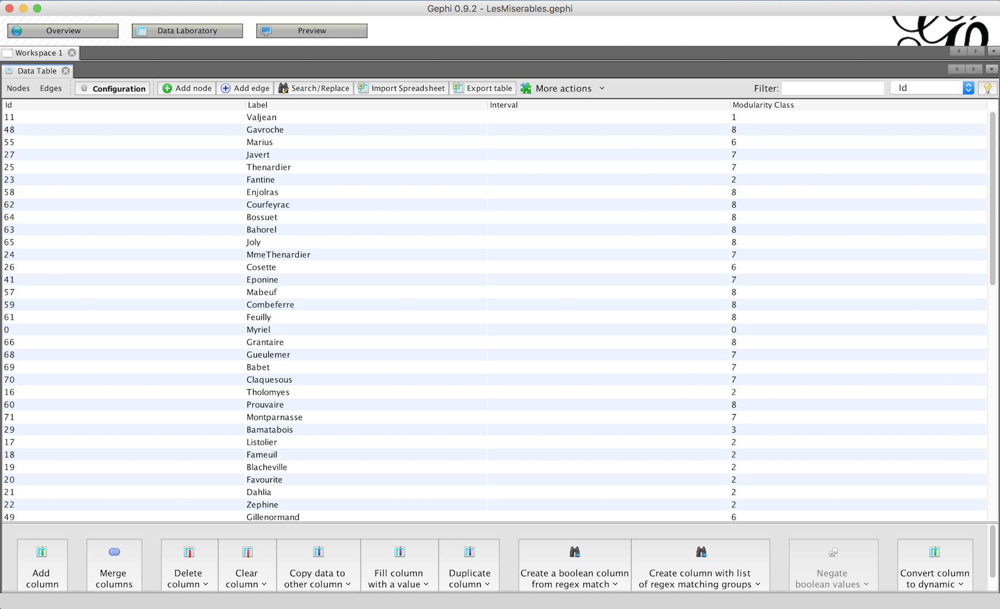
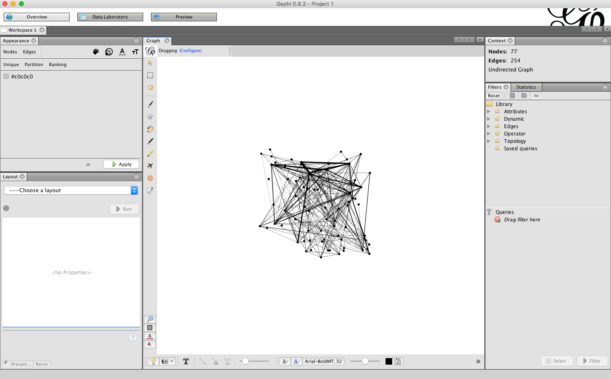
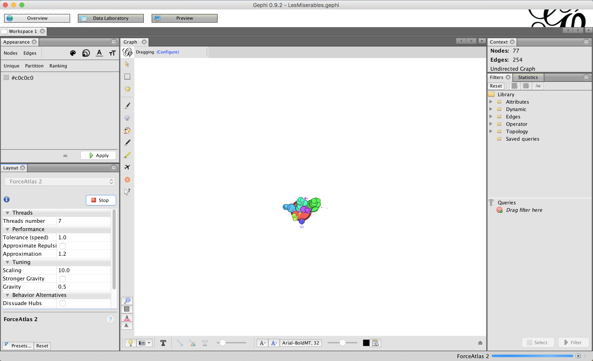
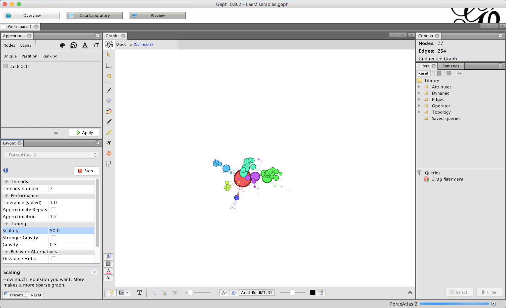
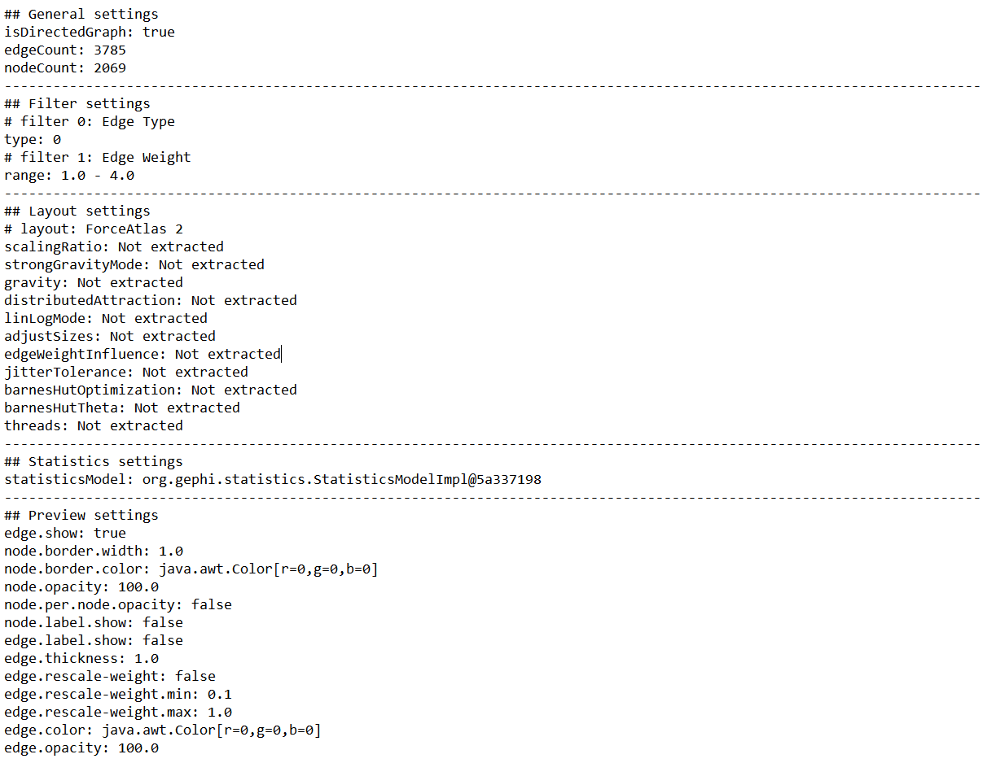

---
Pr-id: MoneyLab
P-id: INC Reader
A-id: 10
Type: article
Book-type: anthology
Anthology item: article
Item-id: unique no.
Article-title: title of the article
Article-status: accepted
Author: name(s) of author(s)
Author-email:   corresponding address
Author-bio:  about the author
Abstract:   short description of the article (100 words)
Keywords:   50 keywords for search and indexing
Rights: CC BY-NC 4.0
...

# 16: The Fieldnotes Plugin: Making Network Visualization in Gephi Accountable

*Maranke Wieringa, Daniela van Geenen, Karin van Es and Jelmer van
Nuss*

**Abstract**

The network visualizations humanities scholars and social scientists
employ to communicate research findings are often imbued with a sense of
objectivity. The impression is that these visualizations show facts
about rather than interpretations of data. Consequently, suggestions
have been made as to what kind of questions and contextual information
need to accompany data visualizations. However, practical incorporation
of answers to these questions in (academic) publications is absent. In
this chapter we engage in and depart from tool criticism taking the most
common academic network visualization software Gephi as our case in
point. Problematically, Gephi saves only the spatialized network graph,
whilst the steps taken and parameters of the algorithms used to get to
the particular visualization go undocumented.

Tackling the software tool's 'epistemological affordances,' we elaborate
on how the 'interpretative acts' of practitioners -- knowingly and
unknowingly -- privilege certain viewpoints and perpetuate particular
power relations. We consider how these can be made accountable in a
pragmatic way through an application that supports those working with
Gephi in taking procedural 'fieldnotes,' which enables scholarly
positioning. By facilitating systematic documentation of the
visualization and analysis process it allows for traceability of and
reflection on the subsequent results. The application, thus, brings us
closer to what can be characterized as 'good technologically mediated'
practice in data-related research projects and helps us interrogate what
being accountable in a scholarly context entails. We place the
development of this plugin in an emerging practice of 'account-ability
by design'.

## Introduction

Data visualizations are increasingly used for sense-making and
communication in scholarly research.[^16chapter16_1] Network visualizations, among
the most complex data visualizations, are often seen as little more than
unintelligible 'hair balls.'[^16chapter16_2] Humanities scholars and social
scientists nevertheless employ them to make palpable and communicate
(abstract) research findings. These visualizations are often imbued with
a sense of objectivity and give the impression that they show facts
about rather than interpretations of data.[^16chapter16_3] Several scholars have
made suggestions as to what kind of questions and contextual information
need to accompany data visualization: most importantly, the decisions
involved in making these data visualizations in order to shed more light
on these interpretations.[^16chapter16_4] In this contribution we focus on the case
of Gephi. Gephi is a popular open-source software program for graph and
network analysis used in the humanities and social sciences.[^16chapter16_5]
However, publications using the software rarely inform their readers
about the applied settings and steps taken in the making of the network
visualization.

We have taken a first step towards 'account-ability by design' in
developing a plugin for Gephi, together with the Digital Humanities Lab
of Utrecht University. With 'account-ability by design,' an
ethnomethodologically inspired term, we refer to the built-in
inspectability of tools providing researchers with adequate means to
effectively assess these tools. The plugin's development is situated
within a larger trend of other projects such as Datasheets for Datasets,
Principles for Accountable Algorithms, and the Data Ethics Decision Aid
that seek to make transparent and accountable the work that digital
tools do.[^16chapter16_6] More specifically, the plugin allows users to export the
details of the working process including a time-stamped version of the
graph file.

In this chapter we discuss how the 'fieldnotes plugin' helps to make
Gephi network visualizations accountable. Logging the interaction of the
researcher with the software can facilitate and stimulate scholarly
positioning and reflection. To begin, we consider 'critical positioning'
and its relation to the notions of reflexivity and accountability.[^16chapter16_7]
We discuss how reflexivity as an inherent quality of the epistemic
process encompasses the opportunity to account for decisive (human and
non-human) actions performed in the making of network visualizations.
Here we take into account Gephi's (lack of) 'epistemological
affordances', as Van Geenen terms it,[^16chapter16_8] and demonstrate the need for
logging explorative and 'interpretive acts' performed by the use of
Gephi, something which Johanna Drucker also argued for with regards to
visualization in general.[^16chapter16_9] This demonstration focuses on the default
and adaptable settings of the ForceAtlas 2 layout algorithm using the
example of the 'Les Miserables' data sample which comes prepackaged with
Gephi.[^16chapter16_10] Subsequently, we examine a sample of academic publications
to address how media scholars are currently documenting their working
processes in and with Gephi. It reveals that, despite having
consequences for the analysis or presentation, a number of influential
aspects of the working process are not thoroughly documented. Following
this, we return to the plugin itself and explore its promises and
pitfalls with regard to accountability. The plugin is a pragmatic but
partial solution to making network visualization accountable in Gephi.
In conclusion, we consider which work still needs to be done around
account-ability by design. Although the development of the plugin is
aimed at scholars in the humanities, it should be of relevance to
scholars engaged with critical data studies more widely.

## Critical Positioning and its Prerequisites

Gephi has served as a notable example in several critical explorations
that approach digital methods and tools not as mere instruments but as
sites of study.[^16chapter16_11] Bernhard Rieder and Theo Röhle, in their engagement
with such 'sites of study,' call for a scholarly practice that
oscillates between practical and critical work on the research material
we investigate and the digital tools we employ.[^16chapter16_12] Here they build on
the notion of 'reflexivity' in both the traditions of the humanities and
science and technology studies. According to Michael Lynch, this notion
covers two things: Firstly, Lynch discusses the conscious activity of
reflecting on the epistemic process, and in this course, the idea of
generating 'objective knowledge'.[^16chapter16_13] This idea of 'reflexivity'
implies a kind of academic superiority put under scrutiny by Lynch.
Secondly, he proposes a more general understanding of the term that
includes the assumptions of the researchers of which they may not be
actively aware. Donna Haraway, in this sense, calls for the 'critical
positioning' of practitioners: the critical review of the bias they
reflect on the research outcomes through their academic background and
the interpretive choices they make during the research process.[^16chapter16_14] The
following section will explore the importance of reflexive practice and
how Gephi, through its affordances, makes it difficult to track and
record how network visualizations are constructed. As such, we state, it
constrains critical positioning.

### Reflexivity and Accountability

Working with software is a constant interaction between what the program
allows, what the user does, and how the program responds to this. In
other words, the interplay of human and non-human actors grants
different kinds of agencies, or capacities to act, to both.[^16chapter16_15]
Sometimes these agencies are so intertwined it becomes difficult to
locate who is acting upon whom or what.[^16chapter16_16] We want to identify two of
these agencies, which we believe are crucial in order to identify the
(obscured) scholarly intentions at stake: the agency of the researcher,
and the agency of the software. Focusing first on the agency of the
software, Gephi is programmed in a specific way, thereby enabling
particular actions and constraining others; it is 'inscribed' with
(human) agency through its programming.[^16chapter16_17] Scholars, in turn, can
interact with this software in an analysis process in which they make
particular (un)conscious choices stimulated by the (automated) methods
and tools they use. For us, this dynamic, the interfacing between
researcher and program is of interest, as it shapes the 'interpretative
acts' researchers perform in their working practice, and thus,
meaning-making with Gephi.[^16chapter16_18] It is this dynamic which the plugin will
help to document.

To better understand how Gephi structures, facilitates, and influences
the working process, we propose to look at its affordances: the
'possibilities for action' presented to the user.[^16chapter16_19] Questioning the
affordances of software tools, understood as their designed and
perceivable action possibilities,[^16chapter16_20] directs the attention to the
actions such tools allow for, or constrain, including their (hidden)
politics.[^16chapter16_21] An approach of critical affordance analysis is especially
suited for Gephi,[^16chapter16_22] which is presented as a tool for 'Visual Network
Analysis'.[^16chapter16_23] As such, Gephi's strength resides in allowing its users
interaction with the underlying data and network through its graphical
user interface. An investigation of Gephi's interface affordances allows
for cutting critically through the interface level and revealing the
tool's executable layers and their role in mediating the research
material.[^16chapter16_24]

Such a reflective attitude is important, for interpretive acts in Gephi
are framed by particular 'situated knowledges'.[^16chapter16_25] The notion of
situated knowledges refers to how researchers are not neutral observers
of reality. The epistemic claims they make reflect their social identity
and situation. Scientific visualizations are a prominent example of such
research outcomes. Haraway scrutinizes the objectified impression
visualizations gain in research communication through a separation of
information on their making process from the visual outcomes themselves.
The notion of situated knowledge stresses the need to make bias in the
knowledge production, and therefore, the manner in which this bias
resonates in the interpretive practice of scholars, explicit. In other
words, situated knowledge implies that one's ideas are rooted in a
particular framework: a paradigm, a (socio-economic) background, a
discipline, and so forth. All these aspects, which together make up
one's situatedness, influence the kinds of interpretative acts one
conducts. Moreover, in the case of Gephi, diverse kinds of situated
knowledges deriving from particular academic fields are also
*implemented by design* and *mobilized by means of the use of the tool*,
such as the mathematical branch of graph theory, and the social sciences
approach of social network analysis.[^16chapter16_26] We focus particularly on the
mobilization of situated knowledge in Gephi's usage and the way in which
the plugin can enhance reflection on this.

As a tool that produces visual outcomes -- in the shape of a network
graph -- Gephi is a perfect showcase to pose the question of the
reflexivity of (algorithmic) knowledge instruments, or what becomes
visible in comparison to the parts of the epistemic process that stay
invisible. Reflexivity as an inherent quality of the epistemic process
implies that we need an opportunity to *account for* all decisive (human
and non-human) actions performed in this process. Accountability here is
understood as accepting responsibility for one's actions, and thereby
being -- potentially -- liable.[^16chapter16_27] It differs from transparency which
concerns disclosing information and privileges seeing over
understanding.[^16chapter16_28] Our concern, however, is not per se on one's
liability, but on one's *account-ability*, which refers to, on the one
hand, *being open to inspection* (transparency, if you wish), and on the
other hand, *being competent in assessing the subject matter*.[^16chapter16_29]
Thus, the concept encompasses both the subject and object position of
the word.[^16chapter16_30] The hyphenated term, account-ability, was coined by
Harold Garfinkel as an ethnomethodological concept,[^16chapter16_31] dealing with
the 'observable-and-reportable', with practices of
'looking-and-telling,' and is very applicable to our situation.[^16chapter16_32]

Part of being account-able rests with the documentation of one's
research process, but also requires insight in how tools are used and
why. As such, the account-ability we promote can be seen as a
documentation of one's reflexivity: the researchers' ability to provide
an account of what they have done. This is a first and necessary step in
terms of legitimization of the outcome. Part of the knowledge production
is delegated to Gephi. Thus, ideally, the decisions made by the
researcher are informed by an understanding of the concepts and
techniques mobilized by the software.

It is in the facilitation of further understanding about the analysis
process that we situate the plugin: as a *first step* on the road to
what we term 'account-ability by design.' The design process springs
forth from an ethnographic, processual, and systematic engagement with
the tool. The reflexive practice we envision for scholars working with
the tool considers and offers information about the tools we use and the
steps we take to analyze our data. In other words, we attempt to make
the interpretive practices of scholars open for scrutiny -- account-able
-- as part of their critical positioning. The lack of such
documentation, which we expand on later in this paper, is partly due to
the structure of the program itself, and resides in the need for and
current lack of its 'epistemological affordances'.[^16chapter16_33] The term is
inspired by Lev Manovich's call for a 'software epistemology', that
interrogates what knowledge is and becomes in relation to software.[^16chapter16_34]
Such a software epistemology should enable a dialogue on action
possibilities that stimulate reflection on how software frames and
shifts the production and distribution of knowledge, or in other words
its epistemological affordances. To put it differently, epistemological
affordances are action possibilities the software tool should enable to
enhance accountability. The availability of such action possibilities
stimulates the reflective attitude of the researcher towards the
epistemic process.

The notion of epistemological affordances allows us to think thoroughly
about what is 'good technologically mediated' practice in the scholarly
context.[^16chapter16_35] Peter-Paul Verbeek's conception of the 'good
technologically mediated life' poses the questions whether and how it is
possible to 'design the morality of things'.[^16chapter16_36] Verbeek advocates that
we should adopt a 'limit-attitude'.[^16chapter16_37] In Michel Foucault's
description of the term, this ethos is defined by a critical scholarly
attitude *from within* the 'field' in which one is working, constantly
questioning the 'limits' of one's knowledge, which also involves the
tools a scholar is employing.[^16chapter16_38] In designing the fieldnotes plugin we
strive to contribute to good 'computationally mediated' data research
practice, by adopting a limit attitude with regard to a software tool
such as Gephi. Below, we discuss how the affordances of Gephi actually
(dis)allow documentation of the research practice with Gephi.

## Gephi's (lack of) Affordances

We discuss Gephi's action possibilities in terms of default
functionalities and other, in social and technical ways, featured
specifications.[^16chapter16_39] Gephi's software affordances are promoted by the
tool's graphical user interface as well as by the core team of
developers, for instance, in official tutorials they share on the Gephi
platform.[^16chapter16_40] In order to have access to the full array of
functionalities and explore the tool's affordances the application
software requires data input. When a user opens Gephi the welcome pop-up
window offers the opportunity to select one of the three exercise data
samples the developers prepared for beginning users. For demonstration
purposes, we will draw on the smallest of the three exercise samples:
'Les Miserables.gexf" composed of 77 nodes and 154 edges. The dataset is
a graph file prepared in Gephi's own Graph Exchange File Format.[^16chapter16_41]
Users new to Gephi are encouraged to play with the dataset; the set is
prominently placed on the welcome screen and in the 'Quick Start Guide',
one of the few tutorials that is branded an 'Official Tutorial' by the
Gephi core team.[^16chapter16_42] The Les Miserables dataset appeals to the
imagination of the user: The nodes represent the novel characters and
the edges stand for these characters' co-appearances during the plot
development of *Les Miserables*. However, in analytical terms the data
sample is moderately 'inoperative' in its current form, such as the
following demonstration will show.

Upon opening this dataset from the welcome screen, one is presented with
the workable Gephi interface. The program offers the user three tabs:
The 'Overview' tab (see Figures 1, 3-5) allows for spatializing and
analyzing the data. The 'Data Laboratory' tab (Figure 2) houses the
dataset and the metrics from preceding analyses (e.g. Modularity Class
values, which classify nodes and group them together). Finally, the
'Preview tab' allows for finetuning the static output of the network
graph. Looking at the graph in the Overview tab, we noticed that the
network graph was prepared by the application of specific settings.
Engaging with the software program and its practice set, however, does
not clarify which steps have been taken to prepare the graph. The layout
algorithm used and its parameters are not made explicit and related
documentation is sparse.

The 'Quick Start Guide' tutorial is the only resource that provides the
user with some clues about the preparation of the data sample. This
tutorial recommends the application of an algorithm of the ForceAtlas
series, layout algorithms that were specifically developed for
Gephi.[^16chapter16_43] To demonstrate how influential the choice for a layout
algorithm and its particular properties is, we draw upon the Les
Miserables data sample and the spatialization algorithm ForceAtlas 2,
the successor of ForceAtlas. ForceAtlas 2 spatializes and clusters the
graph based on degree, the number of edges a node possesses. The
clustering, addressed by the term 'modularity', is facilitated by
attraction forces of edges and repulsion forces of (unconnected)
nodes.[^16chapter16_44] It results in the visual clustering of nodes in which highly
connected nodes are grouped together. This phenomenon of grouping
together is amplified by the use of a community detection procedure,
implemented in Gephi, coupled with node coloring. The 'Modularity Class'
community detection algorithm generates metadata (see the fourth column
in Figure 2). Starting from a single node, the algorithm 'snowballs'
through the entire graph and assesses with which cluster each node has
the most connections. Subsequently, it is possible to color and
'partition' these nodes based on the communities inferred by the
algorithm (see Figure 1).[^16chapter16_45]

*Figures 1 and 2: Gephi's 'Overview' and 'Data Laboratory' tabs after
opening the Les Miserables dataset.*

*Figure 3: The 'raw' Les Miserables sample.*

*Figures 4 and 5: ForceAtlas 2's default settings applied to the same
'Les Miserables' exercise sample, and after adjusting 'Tuning' and
'Behavior Alternative' settings such as the scaling (from 10 to 50) and
the gravity (from 1.0 to 0.5).*

In order to stress the importance of recording the applied parameters,
the figures above demonstrate how applying a particular layout algorithm
and playing with its settings returns network graphs shaped in very
specific ways: Figure 3 shows the Les Miserables graph in an unprepared,
'raw' state.[^16chapter16_46] In the above figures (4 and 5) we applied ForceAtlas 2
to the prepared graph file and adjusted layout properties under
ForceAtlas 2's subheadings of 'Tuning' and 'Behavior Alternatives'.
Moreover, selecting "Behavior Alternatives' such as 'Dissuade Hubs' and
'Prevent Overlap' returns a graphical display similar to the starting
position (Figure 1). While these adjustments of algorithm property
values result in changed node positions in the graph file (GEXF), apart
from that this action that changes the algorithm 'behavior' leaves no
permanent trail. To be more specific, the work of the software and
researcher cannot be traced back. This is exemplified by the lack of
otherwise commonplace software features such as 'undo' and 'redo'
options.[^16chapter16_47]

Gephi's lack of epistemological affordances affect knowledge production.
We focused on the default and adaptable settings of the layout algorithm
to illustrate their influence on how the data is visualized as graph
therein demonstrating the need for recording and accounting for
explorative and interpretive activities. The integration of the 'Les
Miserables.gexf' dataset reflects the politics of the developer's
community: Gephi's sociological focus on community detection and, based
on this calculation process, the visual clustering of the network
graph.[^16chapter16_48] Researchers need to be provided with the opportunity to
scrutinize such politics in order to make sense of the interpretative
acts performed in, and with, Gephi. We argue that a process of
understanding can only be afforded to scholars through a combination of
access to the applied parameters and a consultation of the documentation
on the software tool.[^16chapter16_49] The fieldnotes plugin is a practical solution
that offers access to the applied parameters and in doing so can
hopefully support Gephi's epistemological affordances. The plugin is
needed because, as we demonstrate in the following section, academic
publications using Gephi network visualizations only scarcely report the
interpretative acts performed by the researcher(s).

## Network Visualizations Practices in Scholarly Discourse

About documenting the Gephi work process in academic publications, Axel
Bruns writes:

> \[T\]he various visualization algorithms offered by the well--known,
> open source network analysis software Gephi, for example, are
> generally described in some detail in software guides and related
> literature, but relatively few of the scholarly publications which
> draw on Gephi to visualize the social networks they study insert any
> substantive discussion of the benefits or limitations of the
> particular Gephi network visualization algorithms they have chosen, or
> of the specific visualization settings which were used to direct the
> algorithm itself.[^16chapter16_50]

We presently seek to validate the observation that there is a lack of
documentation empirically, which we find is a cause for concern. In
order to gauge if and how scholars are currently discussing their
research processes in Gephi, we inventoried a selection of articles
which cite the developer's paper 'Gephi: an open source software for
exploring and manipulating networks'.[^16chapter16_51] Working in a media department
ourselves, we decided to sample publications that mention
\[media\].[^16chapter16_52] For this selection process, we drew on Google Scholar.
In total, 3,251 papers that cite Bastian et al. were found, of which
2,410 also mention \[media\].[^16chapter16_53]

We collected the first 150 academic papers listed by Google Scholar,
thereby practicing what Richard Rogers called 'search as research'.[^16chapter16_54]
Of these 150 papers, we selected the 16 papers stemming from media
studies for an exploratory inventory. These papers were assessed on the
documentation of the dimensions also logged by the plugin that we will
introduce in detail in the next section. We noted on a scale of 0-2
whether the information was not at all (0), to some extent (1), or
completely (2) present. Below the inventoried dimensions and their total
count are listed.

| Dimension                                                           | Total count |
|---------------------------------------------------------------------|-------------|
| Amount of nodes                                                     | 21          |
| Amount of edges                                                     | 18          |
| Layout algorithm applied                                            | 21          |
| Settings algorithm                                                  | 0           |
| Filters                                                             | 12          |
| Appearance N/E (explaining the ranking/partition elements in graph) | 24          |
| Color nodes                                                         | 15          |
| Color edges                                                         | 5           |
| Size nodes                                                          | 16          |
| Edge thickness/shape                                                | 8           |
| Statistics used                                                     | 17          |
| Data lab manipulations                                              | 1           |
| Preview settings                                                    | 1           |

*Table 1. Amount of times papers documented aspect of research project*.
*N is 16, the greatest potential score is 32, lowest is 0.*

Our sample suggests that media studies papers drawing on Gephi
frequently document the layout algorithm that was used and details on
the partitioning of the graph. However, none of the papers in our sample
reflected on the settings of those (layout) algorithms (e.g. whether
scaling was set to 10 or 50). As demonstrated earlier, such settings
should be described because of the influence they have on the
presentation of the graph. Furthermore, the settings of the applied
metrics such as the 'resolution' set for Modularity Class influence the
outcome of the calculation process (e.g. more or less smaller
communities) and, therefore, the (visual) clustering of the graph and
identification of communities based on this clustering. The inventoried
dimensions were classified according to three different degrees of
attention to documentation: rich documentation, some documentation, and
limited documentation. This categorization serves to show the
disproportional attention particular aspects of the process receive, as
per below.

| Rich documentation (>20)                                            | Some documentation (10-20) | Limited documentation (<10) |
|---------------------------------------------------------------------|----------------------------|-----------------------------|
| Amount of nodes                                                     | Amount of edges            | Settings algorithm          |
| Layout algorithm applied                                            | Filters                    | Color edges                 |
| Appearance N/E (explaining the ranking/partition elements in graph) | Color nodes                | Edge thickness/shape        |
|                                                                     | Size nodes                 | Data lab manipulations      |
|                                                                     | Statistics used            | Preview settings            |
*Table 2. Spectrum of documentation.*

We discovered that a number of influential aspects of the working
process are not documented (in detail), despite their fundamental
consequences for the analysis or presentation. This includes
documentation about the statistics and filters used, the settings of the
algorithm applied, data lab manipulations, and the preview settings.
These settings should be logged and open for scrutiny as part of an
effort for scholarly positioning. Bruns has rightfully raised concerns
about 'spatial limitations' in the publication of (big) data research
that limit detailed documentation of tools, methods, and datasets.[^16chapter16_55]
As such we propose that at a bare minimum the most relevant settings for
the particular network visualization, as established by the researchers
working on the project, be included in a legend. It should also be
accompanied by either the settings file itself or contact details to
retrieve the said file.

## The Fieldnotes Plugin

Alluding to a long-standing tradition in field work and the related
practice of taking thorough fieldnotes, we decided to baptize the
practical contribution to making network visualization in Gephi
accountable the 'fieldnotes plugin'.[^16chapter16_56] In doing so, we also emphasize
the need for more (ongoing) ethnographic work in the domain of digital
methods and software tools, their use and development. The plugin is
designed to be installed like any other plugin available for Gephi.[^16chapter16_57]
It can automatically log the following:

-   Amount of nodes/edges;

-   Algorithms used;

-   Filters;

-   Statistics;

-   Preview settings;

-   Time-stamped graph file (including information from Data Laboratory)
    in gexf format.

The log of the working process can be exported as a settings file (see
for example the figure below). In this file, the particular parameters
of each step are logged -- not only the steps taken. For instance, if
one uses a particular filter, besides the type of filter all properties
associated with that filter are saved. The settings are exported as a
.txt file and can therefore be opened in a wide variety of text editors
(e.g. Figure 6).

A limitation, which is important to note, is that we have not yet
managed to extract the property values of the layout algorithm, which
are influential settings. The back-end of Gephi did not allow for such
implementation during the development time allotted, but it is foremost
on our priority list for future development. Nevertheless, even with the
limited functionality in logging this particular aspect, it still
greatly speeds up the logging which would otherwise be done manually.

*Figure 6. Example of settings.txt file*

Aside from the settings file, the plugin also automatically saves the
graph file (GEXF) with a timestamp that matches the settings file's
timestamp. Together these files serve as a complete snapshot of the
graph. Additionally, the automatic saving functions as an extra failsafe
for Gephi's omission of an undo button and is a hack to cope with the
need to continuously save all steps during the working process.[^16chapter16_58]

## What the Gephi Plugin Does and Does not Solve

The Gephi plugin is intended to make it easier to document the working
process, yet it by no means covers all the problems (humanities)
scholars face when working with Gephi. We will briefly highlight a
couple of problems that will persist, and some others for which we
believe the plugin to be a pragmatic solution to.

Several scholars have highlighted the need for a better understanding of
the tools we use, and therefore, the algorithms we work with.[^16chapter16_59] While
we acknowledge the importance of such intimate tool understanding -- for
instance, in the case of statistical measures such as PageRank or
algorithms like ForceAtlas 2 -- our plugin does not facilitate better
understanding of the algorithms themselves. The plugin limits itself to
offering information on what parameters were used to influence their
workings. Thus, it does not help to open the black box of the applied -
in this case mathematical and social - principles themselves, but rather
helps to give insight into the 'black box of data research,' by
gathering the variables and procedures applied.

By tackling this black box of data research, we hope to stimulate
communication between scholars both within research teams and in
external communication. Documenting the variables used allows, for
instance, for accessing and assessing particular research projects. By
logging these, it also makes it easier for scholars to communicate and
reflect on key parameters in their publications. As we have shown, much
can be gained in this area. Nevertheless, the plugin does not
immediately lead to a more reflective engagement with the Gephi working
process. As the plugin logs properties automatically, it is still up to
the researcher to reflect on the process; our contribution merely
facilitates practices of critical positioning.

The plugin is not a fix for all issues arising around inspectability of
data research projects. While it helps to make settings known, one still
needs the dataset in order to be able to actually assess the research.
Furthermore, one needs to know how that dataset has been created, under
what circumstances, whether it is the original master version, or
whether it has been filtered, in which way, and what motivated these
choices.[^16chapter16_60] *Seeing* a network graph, then, does not equal
*understanding* the data sample and its (partially automatic)
creation.[^16chapter16_61] Some information on the Les Miserables data sample's
preparation, for example, can be found in the Quick Start Guide, but
extensive documentation is missing. In other words, the plugin is merely
a way station on the road to critical positioning and account-ability by
design.

Additionally, the exact way of arriving at particular settings is not
always documented. Node size, for instance, can be set through partition
or through manual settings. The approach used to get to different node
sizes is not logged, only the size change. As discussed, due to the
technical makeup of the program, we were not able to program the plugin
in such a way that it logs everything we wanted to as of yet. For
instance, the pop-up windows used in the case of statistics or splining,
and the layout properties during the algorithm's runtime, were
impossible to log in the scope allotted for the development of the
plugin. It is something we hope to add in future versions.

In sum, we need to distinguish between tackling the black-box of
creating network visualizations and that of the tool. Automatically
logging the settings used in making the visualization with the Gephi
plugin, does the former, but not the latter. Rieder and Röhle rightfully
point out that 'tools such as Gephi have made network analysis
accessible to broad audiences that happily produce network diagrams
without having acquired robust understanding of the concepts and
techniques the software mobilizes'.[^16chapter16_62] It is true then that the plugin
does not make everyone domain experts, but merely makes it possible for
domain experts and other researchers to *better communicate about the
process*,[^16chapter16_63] and in that, critically position themselves and their
research activities. For us, this is what is at stake in account-ability
by design. Automating logging processes can assist the researchers in
their reflexive process, but the required reflection on the epistemic
process remains a human activity.

## Conclusion

In this chapter we introduced the fieldnotes plugin for Gephi, which
allows the taking of procedural 'fieldnotes.' By facilitating systematic
documentation of the visualization and analysis process, it allows for
traceability of and reflection on the subsequent results. By mapping the
interaction between the software tool and the researcher, we facilitate
a reflexive approach to one's research practice. We situate the
development of the plugin in what we call the road to 'account-ability
by design.' Recently there have been a number of pragmatic contributions
which similarly allow for 'methodological reflexivity' and
account-ability, which share a similar vision on what is good
computationally mediated scholarly practice.[^16chapter16_64]

For us being account-able rests in part with the documentation of one's
research process, but it also requires insight in how tools are used and
why. The need for the documentation was demonstrated with an exploration
of the application of (different properties of) the ForceAtlas 2
algorithm and modularity clustering in the case of the Les Miserables
data sample. We have also shown that documentation in scholarly papers
drawing on Gephi is in many instances quite poor or nonexistent.

We see the Gephi plugin as a pragmatic solution which only partially
aids in account-ability. The plugin enables tracking the interaction
between researcher and program but does not address other crucial
matters (e.g. why particular choices were made or providing more insight
in the workings of an algorithm). The application brings us closer to
good computationally mediated practice in data-related research projects
and helps us interrogate what being accountable means in a scholarly
context. Yet, it needs to be seen as just one step towards the end goal
of 'account-ability by design'. The plugin maps the analysis process,
which facilitates better documentation in scholarly communication.

The development of the plugin fits in the tradition of research
documentation. In the case of network visualization, we argue that many
different forms of process documenting can still be explored. Due to
practical constraints, we abandoned the idea of accompanying the plugin
with a list of questions to the researcher to kickstart methodological
reflexivity. We consider the development of such (an) accompanying
document(s) as a fertile strand of further research. One of such
promising strands is, for instance, recording the graph simulation, or
more dynamic forms of communication, which demonstrate how the analysis
process unfolds over time and based on which choices. With regards to
further development of Gephi, we argue in particular for the
implementation of the legend module. This was already pitched by Heymann
in 2012 and announced on the roadmap for the Gephi 1.0 version that is
yet to come.[^16chapter16_65]

**Acknowledgements**

We would like to extend our thanks to the Digital Humanities Lab of
Utrecht University, as without their help the plugin could not have been
realized. Especially, we want to express our gratitude to José de Kruif
and Alex Hebing. Additionally, we would like to thank our research
assistant Marjolein Krijgsman who inventoried the academic papers under
our guidance.

## References

Akrich, Madeleine and Bruno Latour. 'A Summary of a Convenient
Vocabulary for the Semiotics of Human and Nonhuman Assemblies', in Wiebe
E. Bijker and John Law (eds), *Shaping Technology / Building Society:
Studies in Sociotechnical Change*, Cambridge MA/London: MIT Press, 1992,
pp. 259--64.

Ananny, Mike and Kate Crawford. 'Seeing without Knowing: Limitations of
the Transparency Ideal and Its Application to Algorithmic
Accountability'. *New Media and Society,* 20.3 (2018): 973--89.

Bastian, Mathieu, Sebastien Heymann and Mathieu Jacomy. 'Gephi: An Open
Source Software for Exploring and Manipulating Networks', *Proceedings
of the Third International ICWSM Conference*, 2009.
http://www.aaai.org/ocs/index.php/ICWSM/09/paper/download/154/1009.

Blondel, Vincent D., Jean-Loup Guillaume, Renaud Lambiotte and Etienne
Lefebvre. 'Fast Unfolding of Communities in Large Networks', *Journal of
Statistical Mechanics: Theory and Experiment,* 10 (2008): 1--12.

Bruns, Axel. 'Faster than the Speed of Print: Reconciling 'Big Data'
Social Media Analysis and Academic Scholarship', *First Monday* 18.10
(2013).

Clifford, James and Georg E. Marcus (eds), *Writing Culture: The Poetics
and Politics of Ethnography*, Berkeley: University of California Press,
1986.

Correa, Carlos D and Kwan-Liu Ma. 'Visualizing Social Networks', in
Charu C. Aggarwal (ed.), *Social Network Data Analytics*, New York:
Springer, 2011, pp. 307--26.

Curinga, Matthew. 'Critical analysis of interactive media with software
affordances', *First Monday* 19.9 (2014).

Diakopoulos, Nicholas, Sorelle Friedler, Marcelo Arenas, Solon Barocas,
Michael Hay, Bill Howe, H. V. Jagadish, et al. 'Principles for
Accountable Algorithms. Fairness, Accountability, and Transparency in
Machine Learning',
http://www.fatml.org/resources/principles-for-accountable-algorithms.

Dianati, Navid. 'Unwinding the Hairball Graph: Pruning Algorithms for
Weighted Complex Networks', *Physical Review,* 93.1 (2016).

Drucker, Johanna. 'Humanities Approaches to Graphical Display', *Digital
Humanities Quarterly* 5.1 (2011).

Eriksén, Sara. 'Designing for Accountability', *Proceedings of the
Second Nordic Conference on Human-Computer Interaction*, 2002: 177-186.

Es, Karin van, Nico Lopez and Thomas Boeschoten. 'Towards a Reflexive
Data Analysis', in Mirko Tobias Schäfer and Karin Van Es (eds), *The
Datafied Society: Studying Culture through Data*, Amsterdam: Amsterdam
University Press, 2017, pp. 171-182.

Few, Stephen. 'Data Visualization for Human Perception', in Interaction
Design Foundation (ed.), *The Encyclopedia of Human-Computer
Interaction*, 2nd edition, Aarhus: Interaction Design Foundation, 2014.
https://www.interaction-design.org/literature/book/the-encyclopedia-of-human-computer-interaction-2nd-ed/data-visualization-for-human-perception.

Foucault, Michel. 'What is Enlightenment?', in Paul Rabinow (ed.),
*Ethics: Subjectivity and Truth*, New York: The New Press, 1997.

Garfinkel, Harold. *Studies in Ethnomethodology*, Englewood Cliffs:
Prentice-Hall, 1967.

Gebru, Timnit, Jamie Morgenstern, Briana Vecchione, Jennifer Wortman
Vaughan, Hanna Wallach, Hal Daumé III and Kate Crawford, 'Datasheets for
Datasets', 2018. http://jamiemorgenstern.com/papers/datasheet.pdf.

Geenen, Daniela van. 'The Role of Software Tools in Critical Data
Studies Practices. Studying the Affordances of Gephi as a Sociotechnical
System', MA thesis, 2018.
https://dspace.library.uu.nl/handle/1874/367489.

Geenen, Daniela van. 'The Role of Software Tools in Critical Data
Studies Practices. Studying the Affordances of Gephi as a Sociotechnical
System.' in *Explorations in Digital Cultures: On the Politics of
Datafication, Calculation and Networking,* Lüneburg: Meson Press,
forthcoming.

Gephi.org. 'Learn how to use Gephi', https://gephi.org/users/.

Gibson, J.J. *The Ecological Approach to Visual Perception*, Boston:
Houghton Mifflin, 1979.

Haraway, Donna J. 'Situated Knowledges: The Science Question in Feminism
and the Privilege of Partial Perspective', *Feminist Studies* 14.3
(1988): 575--99.

Heymann, Sebastien. 'GSoC: Legend Module', *Gephi Blog*, 2012,
https://gephi.wordpress.com/2012/09/24/gsoc-legend-module/comment-page-1/.

Heymann, Sebastien. 'Roadmap', 2015.
https://github.com/gephi/gephi/wiki/Roadmap.

Hutchby, Ian. 'Technologies, Texts and Affordances', *Sociology* 35.2
(2001): 441-56.

Jacomy, Mathieu, Tommaso Venturini, Sebastien Heymann and Mathieu
Bastian. 'ForceAtlas2, a Continuous Graph Layout Algorithm for Handy
Network Visualization Designed for the Gephi Software', *PLoS ONE* 9.6
(2014): 1--12.

Kariv, Adam. 'Letting Data Speak for Itself', *Medium*, 2017,
https://medium.com/\@adam.kariv/letting-data-speak-for-itself-80f1625a8ad1.

Kennedy, Helen, Rosemary Lucy Hill, Giorgia Aiello, and William Allen.
'The Work That Visualisation Conventions Do', *Information Communication
and Society* 19.6 (2016): 715--35.

Knuth, Donald E. *The Stanford GraphBase: A Platform for Combinatorial
Computing*, New York: ACM Press, 1993.

Lynch, Michael. 'Against Reflexivity as an Academic Virtue and Source of
Privileged Knowledge', *Theory, Culture & Society* 17.3 (2000), 26-54.

Mackenzie, Adrian. *Cutting Code,* New York: Peter Lang, 2006.

Markham, Annette, and Simon Lindgren, 'From Object to Flow: Network
Sensibility, Symbolic Interactionism, and Social Media', *Studies in
Symbolic Interaction*, 2013.

Manovich, Lev. *Software Takes Command,* New York, London: Bloomsbury,
2013.

Neyland, Daniel. 'Bearing Account-Able Witness to the Ethical
Algorithmic System', *Science, Technology, & Human Values* 41.1 (2016):
50--76.

Nissenbaum, Helen. 'Computing and Accountability', *Communications of
the ACM* 37.1 (1994): 72--80.

Norman, Donald. *The Design of Everyday Things*, New York: Doubleday,
1990.

Page, Lawrence, Sergey Brin, Rajeev Motwani and Terry Winograd. 'The
PageRank Citation Ranking: Bringing Order to the Web', *World Wide Web
Internet And Web Information Systems* 54.1999--66 (1998): 1--17.

Paßmann, Johannes. 'Forschungsmedien erforschen. Über Praxis mit der
Mapping- Software Gephi', in *Navigationen. Vom Feld zum Labor und
zurück* 1 (2013): 113-129.

Rieder, Bernhard, and Theo Röhle. 'Digital Methods: Five Challenges', in
David Berry (ed.), *Understanding Digital Humanities*, Cham: Springer,
2012, pp. 67--84.

Rieder, Bernhard, and Theo Röhle. 'Digital Methods: From Challenges to
Bildung' in Mirko Tobias Schäfer and Karin Van Es (eds), *The Datafied
Society: Studying Culture through Data*, Amsterdam: Amsterdam University
Press, 2017, pp. 109-24.

Rogers, Richard. 'Foundations of Digital Methods', in Mirko Tobias
Schäfer and Karin Van Es (eds), *The Datafied Society: Studying Culture
through Data*, Amsterdam: Amsterdam University Press, 2017, pp. 75--94.

Sanjek, Roger (ed.). *Fieldnotes: The Makings of Anthropology*, Ithaca:
Cornell University Press, 1990.

Schulz, Hans-Jörg and Christophe Hurter. 'Grooming the Hairball - How to
Tidy up Network Visualizations', *IEEE Information Visualization
Conference*, Atlanta, United States, 2013.

Utrecht Data School. 'Data Ethics Decision Aid (DEDA)', *Utrecht Data
School*, 2018, https://dataschool.nl/deda/?lang=en.

Venturini, Tommaso, Mathieu Jacomy and Débora Pereira. 'Visual Network
Analysis', Working Paper (2015),
https://www.tommasoventurini.it/wp/wp-content/uploads/2014/08/Venturini-Jacomy\_Visual-Network-Analysis\_WorkingPaper.pdf.

Verbeek, Peter-Paul. *Moralizing Technology. Understanding and Designing
the Morality of Things.* Chicago/London: University of Chicago Press,
2011.

\_\_\_\_\_. 'Resistance Is Futile: Toward a Non-Modern Democratization
of Technology', *Techné: Research in Philosophy and Technology* 17.1
(2013): 72--92.

[^16chapter16_1]: Stephen Few, 'Data Visualization for Human Perception', in
    Interaction Design Foundation (ed.), *The Encyclopedia of
    Human-Computer Interaction*, 2nd edition, Aarhus: Interaction Design
    Foundation, 2014.
    https://www.interaction-design.org/literature/book/the-encyclopedia-of-human-computer-interaction-2nd-ed/data-visualization-for-human-perception.

[^16chapter16_2]: See e.g. Carlos D. Correa and Kwan-Liu Ma, 'Visualizing Social
    Networks', in Charu C. Aggarwal (ed.), *Social Network Data
    Analytics*, New York: Springer, 2011, pp. 307--26; Navid Dianati,
    'Unwinding the Hairball Graph: Pruning Algorithms for Weighted
    Complex Networks', *Physical Review* 93.1 (2016); Hans-Jörg Schulz,
    and Christophe Hurter, 'Grooming the Hairball - How to Tidy up
    Network Visualizations', *IEEE Information Visualization
    Conference,* Atlanta, United States, 2013.

[^16chapter16_3]: Johanna Drucker, 'Humanities Approaches to Graphical Display',
    *Digital Humanities Quarterly* 5.1 (2011).

[^16chapter16_4]: See e.g. Adam Kariv, 'Letting Data Speak for Itself', *Medium*,
    2017,
    https://medium.com/\@adam.kariv/letting-data-speak-for-itself-80f1625a8ad1.;
    Helen Kennedy, Rosemary Lucy Hill, Giorgia Aiello, and William
    Allen, 'The Work That Visualisation Conventions Do', *Information
    Communication and Society* 19.6 (2016): 715--35; Karin Van Es, Nico
    Lopez and Thomas Boeschoten, 'Towards a Reflexive Data Analysis' in
    Mirko Tobias Schäfer and Karin Van Es, *The Datafied Society:
    Studying Culture through Data*, Amsterdam: Amsterdam University
    Press, 2017, pp. 171--82.

[^16chapter16_5]: Mathieu Bastian, Sebastien Heymann and Mathieu Jacomy, 'Gephi: An
    Open Source Software for Exploring and Manipulating Networks' in
    *Proceedings of the Third International ICWSM Conference*, 2009,
    http://www.aaai.org/ocs/index.php/ICWSM/09/paper/download/154/1009.

[^16chapter16_6]: Timnit Gebru, Jamie Morgenstern, Briana Vecchione, Jennifer
    Wortman Vaughan, Hanna Wallach, Hal Daumé III and Kate Crawford,
    'Datasheets for Datasets' 2018,
    http://jamiemorgenstern.com/papers/datasheet.pdf.; Nicholas
    Diakopoulos, Sorelle Friedler, Marcelo Arenas, Solon Barocas,
    Michael Hay, Bill Howe, H. V. Jagadish, et al, 'Principles for
    Accountable Algorithms. Fairness, Accountability, and Transparency
    in Machine Learning',
    http://www.fatml.org/resources/principles-for-accountable-algorithms.;
    Utrecht Data School, 'Data Ethics Decision Aid (DEDA)', Utrecht Data
    School, 2018, https://dataschool.nl/deda/?lang=en.

[^16chapter16_7]: Donna J Haraway, 'Situated Knowledges: The Science Question in
    Feminism and the Privilege of Partial Perspective', *Feminist
    Studies* 14.3 (1988): 586.

[^16chapter16_8]: Daniela van Geenen, 'The Role of Software Tools in Critical Data
    Studies Practices. Studying the Affordances of Gephi as a
    Sociotechnical System', in *Explorations in Digital Cultures: On the
    Politics of Datafication, Calculation and Networking.* Lüneburg:
    Meson press, forthcoming.

[^16chapter16_9]: Drucker, 'Humanities Approaches to Graphical Display'.

[^16chapter16_10]: Mathieu Jacomy, Tommaso Venturini, Sebastien Heymann, and Mathieu
    Bastian, 'ForceAtlas2, a Continuous Graph Layout Algorithm for Handy
    Network Visualization Designed for the Gephi Software', *PLoS ONE*
    9.6 (2014).

[^16chapter16_11]: Johannes Paßmann, 'Forschungsmedien erforschen. Über Praxis mit
    der Mapping- Software Gephi', in *Navigationen. Vom Feld zum Labor
    und zurück* 1 (2013): 113-129; Bernhard Rieder and Theo Röhle.
    'Digital Methods: From Challenges to Bildung', in Mirko Tobias
    Schäfer and Karin van Es (eds), *The Datafied Society: Studying
    Culture through Data*, Amsterdam: Amsterdam University Press, 2017,
    pp. 109--24.

[^16chapter16_12]: Bernhard Rieder and Theo Röhle, 'Digital Methods: Five
    Challenges', in David Berry (ed.), *Understanding Digital
    Humanities*, Cham: Springer, 2012, pp. 67--84, p. 80.

[^16chapter16_13]: Michael Lynch, 'Against Reflexivity as an Academic Virtue and
    Source of Privileged Knowledge', *Theory, Culture & Society* 17.3
    (2000), 26-54.

[^16chapter16_14]: Haraway, 'Situated Knowledges: The Science Question in Feminism
    and the Privilege of Partial Perspective', p. 586.

[^16chapter16_15]: Madeleine Akrich and Bruno Latour, 'A Summary of a Convenient
    Vocabulary for the Semiotics of Human and Nonhuman Assemblies', in
    Wiebe E. Bijker and John Law (eds), *Shaping Technology / Building
    Society: Studies in Sociotechnical Change*, Cambridge MA/London: MIT
    Press, 1992, pp. 259--64.

[^16chapter16_16]: Adrian Mackenzie, *Cutting Code.* New York: Peter Lang, 2006, p.
    10.

[^16chapter16_17]: Ibid.

[^16chapter16_18]: Drucker, 'Humanities Approaches to Graphical Display'.

[^16chapter16_19]: Ian Hutchby, 'Technologies, Texts and Affordances', *Sociology*
    35.2 (2001): 441-56, 444.

[^16chapter16_20]: Ibid, 447-50, with reference to Donald Norman, *The Design of
    Everyday Things*. New York: Doubleday, 1990.

[^16chapter16_21]: Matthew Curinga, 'Critical analysis of interactive media with
    software affordances', *First Monday* 19.9 (2014).

[^16chapter16_22]: Van Geenen, 'The Role of Software Tools in Critical Data Studies
    Practices', forthcoming.

[^16chapter16_23]: Tommaso Venturini, Mathieu Jacomy and Débora Pereira, 'Visual
    Network Analysis', Working Paper (2015),
    https://www.tommasoventurini.it/wp/wp-content/uploads/2014/08/Venturini-Jacomy\_Visual-Network-Analysis\_WorkingPaper.pdf.

[^16chapter16_24]: For an elaborate critical affordance analysis of Gephi see:
    Daniela van Geenen, *The Role of Software Tools in Critical Data
    Studies Practices. Studying the Affordances of Gephi as a
    Sociotechnical System* MA thesis, 2018,
    https://dspace.library.uu.nl/handle/1874/367489.

[^16chapter16_25]: Haraway, 'Situated Knowledges: The Science Question in Feminism
    and the Privilege of Partial Perspective', pp. 581-590.

[^16chapter16_26]: Rieder and Röhle, 'Digital Methods: From Challenges to Bildung',
    pp. 111, 117-9.

[^16chapter16_27]: Helen Nissenbaum, 'Computing and Accountability', *Communications
    of the ACM* 37.1 (1994): 72--80.

[^16chapter16_28]: Mike Ananny and Kate Crawford, 'Seeing without Knowing:
    Limitations of the Transparency Ideal and Its Application to
    Algorithmic Accountability', *New Media and Society* 20.3 (2018):
    973--89

[^16chapter16_29]: Daniel Neyland, 'Bearing Account-Able Witness to the Ethical
    Algorithmic System', *Science, Technology, & Human Values* 41.1
    (2016): 55.

[^16chapter16_30]: Sara Eriksén, 'Designing for Accountability', *Proceedings of the
    Second Nordic Conference on Human-Computer Interaction* (2002): 179.

[^16chapter16_31]: Harold Garfinkel, *Studies in Ethnomethodology*. Englewood
    Cliffs: Prentice-Hall, 1967.

[^16chapter16_32]: Eriksén, 'Designing for Accountability', 179.

[^16chapter16_33]: Daniela van Geenen, 'The Role of Software Tools in Critical Data
    Studies Practices', forthcoming.

[^16chapter16_34]: Lev Manovich, *Software Takes Command,* New York/London:
    Bloomsbury, 2013, pp. 337-341.

[^16chapter16_35]: Peter-Paul Verbeek, 'Resistance Is Futile: Toward a Non-Modern
    Democratization of Technology', *Techné: Research in Philosophy and
    Technology* 17.1 (2013): 91.

[^16chapter16_36]: Ibid; Peter-Paul Verbeek, *Moralizing Technology. Understanding
    and Designing the Morality of Things.* Chicago/London: University of
    Chicago Press, 2011.

[^16chapter16_37]: Verbeek, 'Resistance Is Futile: Toward a Non-Modern
    Democratization of Technology', pp. 81-2.

[^16chapter16_38]: Ibid, in reference to Michel Foucault, 'What is Enlightenment?',
    in Paul Rabinow (ed.), *Ethics: Subjectivity and Truth*, New York:
    The New Press, 1997.

[^16chapter16_39]: For this investigation we applied Gephi 0.9.2., the most recent
    release of the software tool at the time of writing this paper.

[^16chapter16_40]: For the official website see: https://gephi.org/.

[^16chapter16_41]: The 'Les Miserables' exercise sample builds on Donald Knuth's
    work on 'literate programming'. On his website, Knuth explains that
    he prepared the data sample as exercise material for "benchmark
    tests of competing methods." In Gephi the implementation of the
    sample can be similarly understood in such a benchmarking capacity:
    as experimental and comparative material for various analytical
    principles implemented in Gephi. See: Donald E Knuth, *The Stanford
    GraphBase: A Platform for Combinatorial Computing*, New York: ACM
    Press, 1993.

[^16chapter16_42]: Gephi.org., 'Learn how to use Gephi.', https://gephi.org/users/.

[^16chapter16_43]: Jacomy, Venturini, Heymann, and Bastian, 'ForceAtlas2, a
    Continuous Graph Layout Algorithm for Handy Network Visualization
    Designed for the Gephi Software'.

[^16chapter16_44]: Ibid, 2-3.

[^16chapter16_45]: See also the steps recommended in the 'Quick Start Guide'
    tutorial. For academic reference explaining the workings of
    'Modularity Class' see: Vincent D Blondel, Jean-Loup Guillaume,
    Renaud Lambiotte and Etienne Lefebvre, 'Fast Unfolding of
    Communities in Large Networks', *Journal of Statistical Mechanics:
    Theory and Experiment,*10 (2008): 1--12.

[^16chapter16_46]: The Quick Start Guide tutorial links to such a version of the
    data sample.

[^16chapter16_47]: See e.g. Van Geenen, 'The Role of Software Tools in Critical Data
    Studies Practices' for related scholarly discussions, and the
    discussion feed on the Gephi Wiki that features the call for
    undo/redo specifications formulated by the Gephi community:
    https://github.com/gephi/gephi/issues/1175.

[^16chapter16_48]: Most of the default layout algorithms implemented in Gephi are
    'force-directed' and cluster the graph based on degree.

[^16chapter16_49]: Documentation could be found, for example, in the academic paper
    that was published on, and provides insights into, the significance
    of the applied algorithm settings, see for instance: Jacomy et al,
    'ForceAtlas2, a Continuous Graph Layout Algorithm for Handy Network
    Visualization Designed for the Gephi Software'.

[^16chapter16_50]: Axel Bruns, 'Faster than the Speed of Print: Reconciling 'Big
    Data' Social Media Analysis and Academic Scholarship', *First
    Monday* 18.10 (2013).

[^16chapter16_51]: Bastian et al, 'Gephi: An Open Source Software for Exploring and
    Manipulating Networks'.

[^16chapter16_52]: The block braces are used to denote a query. For an explanation
    on the nature of query notation, see Richard Rogers, 'Foundations of
    Digital Methods', in Mirko Tobias Schäfer and Karin Van Es (eds),
    *The Datafied Society: Studying Culture through Data*, Amsterdam:
    Amsterdam University Press, 2017, pp. 75--94, p. 83.

[^16chapter16_53]: Bastian, et al, 'Gephi: An Open Source Software for Exploring and
    Manipulating Networks'.

[^16chapter16_54]: In order to minimize effects of personalization, we logged out of
    Google and used a clean installation of a normally unused browser,
    of which all cookies were deleted as an additional precaution.
    Books/book chapters, duplicates, and non-English work were excluded
    due to practical constraints. Rogers, 'Foundations of Digital
    Methods', p. 76.

[^16chapter16_55]: Bruns, 'Faster than the Speed of Print'.

[^16chapter16_56]: See e.g. James Clifford and Georg E. Marcus (eds), *Writing
    Culture: The Poetics and Politics of Ethnography,* Berkeley:
    University of California Press, 1986; Roger Sanjek (ed.),
    *Fieldnotes: The Makings of Anthropology*, Ithaca: Cornell
    University Press, 1990.

[^16chapter16_57]: The project can be found on GitHub:
    https://github.com/UUDigitalHumanitieslab/gephi-plugins/tree/fieldnotes.

[^16chapter16_58]: See e.g. a related discussion on the Gephi Wiki:
    https://github.com/gephi/gephi/issues/1175.

[^16chapter16_59]: See e.g. Paßmann, 'Forschungsmedien erforschen. Über Praxis mit
    der Mapping- Software Gephi'; Bernhard Rieder and Theo Röhle,
    'Digital Methods: Five Challenges'; Rieder and Röhle, 'Digital
    methods: from challenges to Bildung.'.

[^16chapter16_60]: Gebru et al, 'Datasheets for Datasets'.

[^16chapter16_61]: Ananny and Crawford, 'Seeing without Knowing: Limitations of the
    Transparency Ideal and Its Application to Algorithmic
    Accountability'.

[^16chapter16_62]: Rieder and Röhle, 'Digital methods: from challenges to Bildung'.

[^16chapter16_63]: In the same line as Gebru et al, 'Datasheets for Datasets'.

[^16chapter16_64]: Rieder and Röhle, 'Digital methods: from challenges to Bildung';
    see e.g. Datasheets for Datasets, *Principles for Accountable
    Algorithms*.

[^16chapter16_65]: Heymann, Sebastien. "GSoC: Legend Module." *Gephi Blog*, 2012.
    https://gephi.wordpress.com/2012/09/24/gsoc-legend-module/comment-page-1/;
    Heymann, Sebastien. "Roadmap." *Wiki*, 2015.
    https://github.com/gephi/gephi/wiki/Roadmap.
