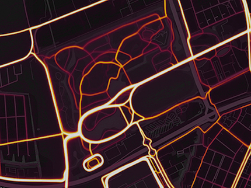

---
Pr-id: MoneyLab
P-id: INC Reader
A-id: 10
Type: article
Book-type: anthology
Anthology item: article
Item-id: unique no.
Article-title: title of the article
Article-status: accepted
Author: name(s) of author(s)
Author-email:   corresponding address
Author-bio:  about the author
Abstract:   short description of the article (100 words)
Keywords:   50 keywords for search and indexing
Rights: CC BY-NC 4.0
...

# 17: Algorithmic Mapmaking in 'Smart Cities': Data Protection Impact Assessments as a means of Protection for Groups
*Gerard Jan Ritsema van Eck*

**Abstract**

Maps are powerful communication tools, and mapmaking used to be a
privileged affair. In recent times, this has changed as 'smart cities'
have been outfitted with video, audio, and other kinds of 'Internet of
Things' sensing devices. The data-streams they generate can be combined
with volunteered data to create a vast multitude of interactive maps on
which individuals are constantly (re)grouped based on abnormality,
deviation, and desirability. Many have argued that under these
circumstances personal data protection rights should extend to groups.

However, group rights are an awkward fit for the current European Data
Protection Framework, which is heavily focused on individuals. One
possible opening for better protection is offered by Data Protection
Impact Assessments (DPIAs), which are mandatory to carry out when the
'systematic monitoring of a publicly accessible area on a large
scale'[^17chapter17_2] necessary for mapmaking takes place. They form an opportunity
to recognize the risks of e.g. discrimination at an early stage.
Furthermore, by including representatives of local (disadvantaged)
groups, the strong performative qualities of maps can offer occasions
for groups of citizens in smart cities to proactively shape the
environments in which they live.

There are serious limitations. Although DPIAs are mandatory, the
inclusion of affected data subjects and their representatives is not.
This undermines many of the possible advantages. Finally, the high costs
associated with the process might mean many companies engage with it
only superficially and temporarily. Establishing effective data
protection for groups negatively impacted by mapmaking software through
DPIAs thus seems nigh on impossible in lieu of substantial legislative
change.

## Introduction

In late 2017, Strava revealed its 'global heatmap' which shows popular
running and cycling routes around the world. Although first reported as
a 'striking visualization of over one billion activities',[^17chapter17_3] the tone
of the reporting quickly changed when it was discovered that secret
(military) locations could also be located using the heatmap.[^17chapter17_4] The
Stratumseind, a popular nightlife area in the Dutch city of Eindhoven
received similarly negative press when it transformed into a 'Living
Lab' 'where massive amounts of data about people\'s activities will be
used \[...\] to study which factors contribute to violence and
discomfort.'[^17chapter17_5] This data is overlaid on a map of the area, and the
police can quickly intervene when and where suspicious patterns emerge.
One reporter dubbed it 'Having a beer with Big Brother'.[^17chapter17_6]

Clearly, the usage of large amounts of data to draw maps raises
concerns. The practice, however, seems to be booming rather than
decreasing. 'Smart' and dumb cities alike are increasingly being
outfitted with video, audio, and various other 'Internet of Things'
(IoT) sensing devices in order to gather ever more data,[^17chapter17_7] and an even
more potent, and often cheaper, stream of data can be crowdsourced or
scraped from (the smartphones of) city dwellers. Once generated, the
data needs to go somewhere, and often they end up in maps.

This chapter will consider these developments by combining insights from
critical geography and data protection law, particularly the General
Data Protection Regulation (GDPR) that recently came into force in the
European Union. Specifically, the chapter will begin by investigating
the relationship between data and maps, and why they are such salient
artifacts. In the next section, the issue of maps is problematized and
the lack of legal protections for affected groups is discussed. Then,
Data Protection Impact Assessments (DPIAs), a tool that has received
renewed interest as a result of the introduction of the GDPR, are
introduced as a possible solution in the absence of strong legislation.
But are they really a panacea that can provide meaningful safeguards, or
an expensive Band-Aid that will be avoided, ignored, and brushed aside?

*Figure 1. Screenshot taken by the author on
https://labs.strava.com/heatmaps on 2 February 2018. Shown is the
Stadspark in Groningen, the Netherlands. The clearly visible small
semi-circle in the bottom is a 400-meter running track whereas the
larger oval above it goes around a pond and measures almost exactly one
kilometer; it therefore constitutes a popular running route.*

## How Maps Are Made

Drawing a map is a powerful act. Who draws a map, decides what is shown
on it: physical features of the landscape, roads, settlements, or claims
to certain territories by various (imagined) groups.[^17chapter17_8] Maps provide a
representation of a certain geographical area that, even if not fully
objective, at least is claimed to represent the truth.[^17chapter17_9] Map drawing
has historically been a privileged affair that is only undertaken by
those with the means and motivation to do so, including 'scientists,
planners, urbanists, technocratic subdividers and social
engineers'.[^17chapter17_10] However, over the past two decades, the global north
has seen a dizzying multiplication of geotagged databases visually
overlaid on maps, each of which comprises a new map in itself.[^17chapter17_11] Such
'Geographic Information Systems', or simply GIS as they are referred to
in the technocratic jargon, are often not carefully constructed by
single authors but are based on aggregations of data from a multiplicity
of sources, each of which might have been collected differently.[^17chapter17_12]

Outfitting an environment with enough IoT sensors to collect the
critical mass of geotagged data needed to feed a GIS can be
prohibitively expensive for all but the most well-funded smart cities. A
cheap and therefore popular alternative, or addition, is crowdsourcing.
Roughly, organizations that crowdsource the collection of georeferenced
data in order to make maps have three options. One option is that data
is collected purposefully by participants that have knowledge of (and
perhaps an interest in) how it will be processed further. This is the
approach taken by, for example, OpenStreetMap, which is 'built by a
community of mappers that contribute and maintain data about roads,
trails, cafés, railway stations, and much more'.[^17chapter17_13] Another option is
to scrape together the various geotagged data trails that smartphone
users leave behind,[^17chapter17_14] as is done by the Living Lab in Eindhoven and
various others.[^17chapter17_15] The third option is to combine these two
strategies. This model is successfully employed by the navigation app
Waze, which takes into account the current traffic situation to
calculate the fastest routes. To be able to do so, it scrapes data on
the speed and location of its users and combines this with data on for
instance road closures that users are encouraged to add using a gamified
system of badges and achievements. Furthermore, in various cities such
as Rio de Janeiro, New York City, and Ghent, Waze receives data on
upcoming road closures from local governments through its Connected
Citizens Programme --- in exchange, the local governments gain access to
information on accidents and other traffic disruptions.[^17chapter17_16] As Gekker
and Hind point out, this makes it 'not necessarily easy to make a clean
split between those who "produce" the map, those who "edit" the map and
those who "consume" the map'.[^17chapter17_17]

*Figure 2. Screenshot taken by the author on
https://www.waze.com/livemap on 5 February 2018. Shown is part of the
center of London, England. The three data sources are clearly visible:
the coloration of the streets is based on scraped movement data, the
balloons are based on user submitted reports, and the map data comes
from Google Maps.*

Once collected, the manner in which crowdsourced georeferenced data is
presented further blurs the lines between producers, editors, and
consumers. Georeferenced datasets are visualized as cartographic imagery
in interactive environments overlaid on Google Maps or similar services
like OpenStreetMaps or Bing Maps,[^17chapter17_18] engaging the user in acts of
active sense making.[^17chapter17_19] This makes *prima facie* sense, as the public
is accustomed to engaging with large data sets visually.[^17chapter17_20]

Interestingly, something else is also gained when crowdsourced
georeferenced data is offered as a map. This mode of presentation
immediately embeds the data within what Leslie calls 'the "system of
maps," the full panoply of mutually-reinforcing, mutually referential
map images that subjects are exposed to \[...\], a system ultimately
grounded in a generalized awareness of cartography's scientism'.[^17chapter17_21]
Thus, by becoming maps, crowdsourced georeferenced data sets also gain
the performative power that comes with the claim to truth-correspondence
of maps. Put differently: Because people tend to take maps at face
value, any data overlaid is also taken at face value, whether it
purports to show a crime hotspot or a traffic jam.

## Maps and (Missing) Group Rights

The role of many modern algorithms is to render 'big data' actionable on
the basis of hypercomplex probalistics.[^17chapter17_22] They do this by
categorizing people into groups: for example, those who should be shown
a certain advertisement, those who should not be let into an airplane
without an extra security check, or those who should receive special
police attention because they know a victim of a recent shooting.[^17chapter17_23]

In public spaces, the push to make cities smart by outfitting them with
a multitude of sensors also increases the influence of grouping
algorithms.[^17chapter17_24] Take, for example, those who are unwittingly part of a
suspicious pattern in the Stratumseind Living Lab in Eindhoven. Once
identified, the location of the pattern is shown on a map, which, as
outlined above, forms an effective communication method for the
end-result of such algorithms: it embeds the abstract (and perhaps
highly contestable)[^17chapter17_25] output of the algorithm in the 'panoply of
maps'.[^17chapter17_26] Private security personnel can then be deployed to
re-establish order. The Strava example mentioned before shows that an
environment does not need to be highly saturated with IoT sensors for
such groupings to have an effect: only a few smartphones in the Syrian
Desert were enough to give away the locations of various secret military
bases.

The most problematic side product of map-making algorithms can be
geographical biases. Although they do not directly affect individuals,
they can deeply impact local communities[^17chapter17_27] through, for instance,
increased police surveillance.[^17chapter17_28] This can, inter alia, be caused by a
skew in the collection of crowdsourced geographic data, in which
marginalized communities tend to be underrepresented,[^17chapter17_29] or
conversely, their overrepresentation in historical data.[^17chapter17_30] After the
collection phase, bias can also creep in during analysis. At this stage
though, it may be harder to detect any biases[^17chapter17_31] because the inner
workings of many algorithms can be difficult to understand for
non-experts and, in the case of self-learning algorithms, for the
developers of the algorithm itself.[^17chapter17_32] Such biases can easily turn
into disparate impacts and discrimination when the output of an
algorithm is taken at face value. This is especially salient for
mapmaking algorithms because, as was discussed above, representing
abstract outputs on maps increases their performativity.

The enigmatical nature of refined data processing means that even if
strong anti-discrimination legislation exists, it might not provide much
protection.[^17chapter17_33] This follows from the simple fact that, in order to
bring a claim, for instance in a class action setting, claimants need to
be aware that they belong to a group that has been negatively impacted.
In the context of algorithmic grouping, where groups are constantly
being made, re-made, and deleted on the basis of hypercomplex
probalistics, this awareness is usually lacking.[^17chapter17_34]

Furthermore, relying on the current EU data protection framework often
falls short. Consider for instance the idea of consent, a cornerstone in
individual data protection law.[^17chapter17_35] It seems questionable whether the
(often heavily intoxicated) visitors to the Stratumseind gave informed
consent to use their personal data for research purposes. And what about
their rights to receive access to the data kept on them, in order to see
if it is correct,[^17chapter17_36] or whether so-called 'special categories' of data
such as their ethnicity or sexual orientation --- easily guessed by
observing e.g. the entrance to an LGBT nightclub --- have been
processed?[^17chapter17_37] Both questions are, from a legal perspective, moot
because the Living Lab and Strava anonymize all data before analysis.
The latter even gives users an opt-out to making their anonymized data
available.[^17chapter17_38] The individual focus of the human rights framework means
that the analysis of anonymous data that by definition cannot be traced
back to any individual can never infringe any data protection rights.
However, it is clear that groups can suffer the consequences of the
processing of data that does not identify anyone in the group, for
instance when a map clearly indicates where extra police presence might
be needed or where antagonists can strike secret military bases.

Many have argued that under these circumstances it no longer makes sense
to only defend the personal data protection rights of individuals.[^17chapter17_39]
Rather, we should be protecting group rights, which are rights
'possessed by a group qua group rather than by its members
severally',[^17chapter17_40] and more specifically, the data protection rights of
groups created by classification algorithms.

However, group rights are an awkward fit for the current European Data
Protection Framework, which is heavily focused on individuals.[^17chapter17_41]
Combined with the recent adoption of the GDPR and the associated
legislative fatigue, which prevents any major innovations in data
protection rights in the foreseeable future, it seems unlikely that
group data protection rights will become a staple of data protection law
in Europe anytime soon.[^17chapter17_42] This section has accentuated why this might
be problematic. Therefore, the next section will introduce DPIAs, which
might provide a workable solution that can be implemented without
completely overhauling the legislative framework.

## Making Group Rights Real Through DPIAs?

DPIAs have been around for several decades,[^17chapter17_43] but the GDPR has
renewed interest in them. The GDPR became directly applicable in the
member states of the European Union (EU) on 25 May 2018.[^17chapter17_44] It aims to
create 'first-rate data protection rules providing for the world\'s
highest standard of protection.'[^17chapter17_45] Some of the central tools the GDPR
employs in order to ensure this high standard are preventative measures,
such as storage limitations,[^17chapter17_46] codes of conduct,[^17chapter17_47]
certification,[^17chapter17_48] data protection by design and by default,[^17chapter17_49] and
rules on the security of personal data.[^17chapter17_50] This approach aimed at
reducing risks seems fitting for personal data protection, as it can be
difficult to predict harms,[^17chapter17_51] and it might be even more complicated
to reverse them.

DPIAs are a central instrument in this toolbox, and required if the
processing of personal data is 'likely to result in a high risk to the
rights and freedoms of natural persons.'[^17chapter17_52] In cases where it is
unclear whether high risks will materialize, the Article 29 Working
Party recommends that a DPIA be carried out nonetheless in order to
minimize risks and ensure compliance.[^17chapter17_53] 'A DPIA is a process designed
to describe the processing, assess its necessity and proportionality and
help manage the risks to the rights and freedoms of natural persons
resulting from the processing of personal data'.[^17chapter17_54] This process can
take many forms depending on, inter alia, the type of personal data
processing being assessed.[^17chapter17_55] But its minimum requirements are a
description of the processing; an assessment of the proportionality and
necessity of the processing (i.e. can the same aim be achieved with less
personal data processing); measures to minimize risks to data subjects;
and an active involvement of those data subjects.[^17chapter17_56]

Crowdsourced maps are usually of publicly accessible areas such as
streets, neighborhoods and parks, if only because it would be hard to
find a crowd in an area that is *not* publicly accessible.[^17chapter17_57] In
particular, the GDPR requires DPIAs if 'systematic monitoring of a
publicly accessible area on a large scale' takes place.[^17chapter17_58] The Article
29 Working Party points out that such data collection can be especially
problematic because data subjects might not be aware of the data
processing. Furthermore, they might not be able to prevent their data
from being collected without avoiding the public area in question,
rendering the public place less public and any form of consent
meaningless.[^17chapter17_59] Therefore, safeguards to gauge and minimize risks are
certainly needed, and it seems it will be nigh on impossible to avoid
doing a DPIA when gathering crowdsourced data for making maps.

As DPIAs are thus a necessary step in the development of crowdsourced
maps, they might form a promising avenue to address the problems
identified in the previous section. As we have seen however, trying to
deal with group data protection rights within the EU data protection
framework achieves unsatisfactory results. So why should Data Protection
Impact Assessments be better suited to deal with mapmaking algorithms
that analyze crowdsourced data if they are a part of that same
framework? In the next two sub-sections, only those aspects that are
pertinent to this specific question will be dealt with. Many others have
already written extensively on DPIAs and proposed various models and
frameworks.[^17chapter17_60] The object here is not to duplicate their work or add
yet another model, but to suggest how, within existing models, a small
extension could yield significant results.

## Opportunities

Counter-intuitively, the embeddedness of DPIAs provides an opportunity
to enhance the protection of group data protection rights *within* the
current legal framework. Many other proposals exist to include various
ethical, social, and human rights considerations in a plethora of impact
assessment tools.[^17chapter17_61] These can serve as important inspirations and
templates in the context of crowdsourced map-making initiatives.
However, they form an additional financial and administrative burden
that data controllers are called upon to voluntarily shoulder. By adding
group rights to an already existing requirement, these costs could be
significantly decreased.

The most straightforward way in which group data protection rights for
crowdsourced mapmaking initiatives can be safeguarded is the same way in
which personal data protection rights are safeguarded: by 'assessing
\[risks\] and determining the measures to address them'.[^17chapter17_62] Many
already established personal data protection principles can be applied
to address any identified risks for groups. Consider, for example, how
the data minimization principle could also be applied to anonymous data.
In the Strava example mentioned above this simple procedure could have
prevented the company great reputational loss, not to mention the
unknown costs to military operations.

This example also shows how important the proactive nature of DPIAs is
in making group rights real. DPIAs should be engaged in 'as early as is
practicable'[^17chapter17_63] in order to prevent risks from materializing. As was
discussed in the section 'Maps and (Missing) Group Rights', it can be
difficult to reliably reconstruct what has happened once an algorithm
has grouped individuals. Therefore, it is preferable to set limits and
objectives beforehand,[^17chapter17_64] by for instance auditing algorithms for
disparate impacts using simulated data.[^17chapter17_65]

Besides these more general opportunities for the inclusion of group data
protection rights within DPIAs, the GDPR contains a clause with specific
relevance for crowdsourced mapmaking initiatives: 'where appropriate,
the controller shall seek the views of data subjects or their
representatives on the intended processing'.[^17chapter17_66] At its most basic,
this clause allows data controllers to seek these views and perhaps
include them in the final report of the DPIA, but then for all intents
and purposes discount them. However, if properly engaged with, it also
allows for data subjects to co-produce the environments in which they
live.[^17chapter17_67]

This opportunity is created by the considerable performative power of
maps, as discussed in the section 'How Maps are Made'. By affording
local groups access to the development process, they gain ownership[^17chapter17_68]
over the production of the map and thus their surroundings. For
instance, they can have a voice in what maps will and will not show, in
which way, and to whom.[^17chapter17_69] This ability to contribute to the meaning
of places makes DPIAs for crowdsourced maps especially well-suited for
empowering residents;[^17chapter17_70] it allows them to change their environment
from a place that they happen to live in and that others map, to a place
that is mapped and co-produced by them.[^17chapter17_71]

Such a co-production can be modelled after consent, one of the pillars
of personal data protection law. Consent should always be given
beforehand,[^17chapter17_72] and by the affected data subject itself. Consent is
only valid if, inter alia, it meets the connected requirements that it
is informed, granular, and specific.[^17chapter17_73] By integrating these
requirements into DPIAs, groups are given a way to meaningfully
co-produce the crowdsourced maps and the GIS software --- and thus their
living environments --- at a stage when some of the processing
operations are still unknown.[^17chapter17_74]

The inclusion of as many views as possible is essential for this
process. However, as it seems quite impractical to have all (potential)
data subjects fully engaged in any and all DPIAs for crowdsourced
mapmaking initiatives that might affect them, the selection of data
subjects and their representatives is crucial. These should come from at
least two categories: on the one hand representatives of local
communities and local disadvantaged groups, and on the other hand,
representatives from digital rights associations with a broader basis in
society.

Delegates from local[^17chapter17_75] communities should be included to directly
speak for those affected and in turn, affect the mapmaking process and
the places they inhabit. Also, they alone can meaningfully and actively
co-produce their environment on behalf of its inhabitants. The inclusion
of representatives from disadvantaged groups can help in trying to avoid
bias and discrimination. As was pointed out above, georeferenced data
gathering tends to underrepresent already disadvantaged groups,[^17chapter17_76] and
if data is collected on these groups, it usually further stigmatizes
them.[^17chapter17_77] The inclusion of these groups should draw the attention of
mapmakers to their specific concerns at an early stage.[^17chapter17_78]

The benefit of including digital rights associations is that they can
represent groups of which the existence is not yet known and can
contribute expert knowledge.[^17chapter17_79] As was pointed out in the section
'Maps and (Missing) Group Rights' it can be impossible to predict, or
even reconstruct after the fact, which groups the algorithms constantly
(re)generate. This would mean that any unforeseen groups are
automatically excluded from the DPIA. In order to prevent this, digital
rights associations may represent them. Note that it would seem
appropriate for representatives of such associations to be cautious
beyond this specific remit.

The selection of representatives is a difficult task,[^17chapter17_80] but the GDPR
gives a hint at who might be welcome at the table regardless. Article 80
outlines how individual data subjects can mandate a 'not-for-profit
body, organisation or association which \[...\] has statutory objectives
which are in the public interest, and is active in the field of the
protection of data subjects\' rights and freedoms with regard to the
protection of their personal data'[^17chapter17_81] to represent them when lodging a
complaint with a DPA,[^17chapter17_82] or when seeking a judicial remedy against a
DPA, data controller, or processer.[^17chapter17_83] This list could be expanded ---
either informally by data controllers currently executing a DPIA, or
eventually by the European legislator --- to include the representation
of data subjects during DPIAs in the sense of Article 35(9) of the GDPR.

## Limitations

Although the EU legislator pays lip service to the ethical and social
issues that result from large scale data processing and have an impact
beyond the individual, these are included neither in Article 35 of the
GDPR which describes Data Protection Impact Assessments, nor in the
various DPIA models provided by the Data Protection Authorities (DPA) of
the Member States.[^17chapter17_84] As a result, despite the many opportunities
listed above, a number of important limitations to DPIAs as a tool for
enhancing group data protection rights in the context of crowdsourced
mapmaking needs to be considered.

A fundamental limitation to the possibility of using DPIAs as embedded
in the GDPR is formed by the voluntary nature of the inclusion of groups
and their representatives in the process. Article 35(9) is qualified as
follows: '*Where appropriate*, the controller shall seek the views of
data subjects or their representatives on the intended processing
\[...\]' (emphasis added). It remains unclear, at least for the moment,
where this would and would not be appropriate; a situation that the
Article 29 Working Party failed to remedy in its opinion on DPIAs.[^17chapter17_85]
It seems improbable that companies will interpret this provision widely
and be eager to engage in the time-consuming, costly, and potentially
politically laden process[^17chapter17_86] if it can easily be avoided. As seen
above, however, it would be exactly this inclusion that engenders many
opportunities.

If we assume that companies do engage in DPIAs and include affected data
subjects and representatives of local (disadvantaged) groups, many
limitations still remain. First of all, when we compare the data
protection rights of groups that can be protected through DPIAs to the
rights that individuals have over their personal data, it seems that it
is chiefly the prohibition on the processing of special categories of
data that can be somewhat enhanced through engaging in DPIAs. Left by
the wayside are many other principles, such as for example accuracy,
accountability, confidentiality, or a lawful basis for processing such
as informed and freely given consent.[^17chapter17_87] For now, these data
protection principles seem out of reach for groups.

The selection of groups to be represented would also present a data
controller eager to conduct a DPIA with major difficulties. As was
discussed in the section 'How Maps are Made' it is impossible to
pinpoint exactly who produces, edits, or consumes a contemporary map; we
could add to this confusion those who are impacted by a map. Even if it
would be possible to neatly separate these roles and find suitable
representatives for each affected group, the composition of all the
groups that will (or might) be formed by an algorithm cannot always be
known beforehand. Furthermore, many distinct local communities are not
neatly divided in classical neighborhoods,[^17chapter17_88] and the involvement of
neighborhood associations, which may be easy to access for data
controllers, might not lead to accurate representation. Finally,
assuming that a somewhat complete overview of groups to be represented
has been established, it is extremely difficult to decide who can speak
on behalf of each group.[^17chapter17_89] As the success of a DPIA hinges on the
accurate composition of the groups and involvement of their
representatives, careful consideration for each separate DPIA is
warranted.[^17chapter17_90]

Finally, even if companies do engage in the process initially and
include as many views as possible, for a DPIA to be truly successful it
should be a circular process that is regularly repeated. This is even
more important if self-learning algorithms are employed as their
outcomes can show unexpected changes over time. This can include changes
in the groups targeted, thus necessitating a constant updating of the
composition of representatives. The costs necessary to continually
assess the possible negative impacts of crowdsourced mapmaking software
that has already been written and released might not, in the view of
profit maximizing companies, be justified by the possible results.

## Conclusion

The question asked at the beginning of the chapter was whether DPIAs
could form a panacea or a Band-Aid when protecting group data protection
rights in crowdsourced mapmaking initiatives. It laid out the strong
performative power of maps and how crowdsourced data is used to make
them. Then, it introduced how this practice interacts with the current
personal data protection framework in the European Union, leaving
undesirable gaps in the safeguarding of group rights. Finally, it
introduced Data Protection Impact Assessments and discussed how they
could help in alleviating these problems without overhauling the current
legislative framework in the EU.

When taking stock of both the opportunities and limitations that DPIAs
offer for group data protection rights in crowdsourced mapmaking
initiatives it seems that they could easily be circumvented, their
effect would be limited at best, that the proper representation of
groups is nigh impossible, and that their long-term impact is uncertain
in the face of self-learning algorithms. Still, companies interested in
retaining consumer trust --- and gaining a competitive advantage when
dealing with responsible customers and partners --- would be
well-advised to make the investment. This goes doubly so for
governmental bodies and institutions: DPIAs form an opportunity to use
group rights to put the performative power of maps in the hands of those
being mapped. Despite the many gaps and pitfalls, DPIAs for mapmaking
initiatives that utilize crowdsourced georeferenced data should be
performed, and they should include as many views as possible; Public
space should belong to the public, not to companies writing mapping
software.

It is up to the EU legislator --- and in the meantime: the European Data
Protection Board, formerly known as the Article 29 Working Party, whose
importance 'for the EU data protection cannot be overstated'[^17chapter17_91] --- to
ensure that group data protection rights can be properly incorporated
within the European Data Protection framework. This is the only way to
ensure that the uncomfortable Band-Aid proposed in this chapter becomes
unnecessary and can be ripped off.

**Acknowledgments**

An early version of this paper was presented to my colleagues at the
department of Transboundary Legal Studies in Groningen. I thank them for
the frank comments, which helped to sharpen the argument. I thank Prof.
Jeanne Mifsud Bonnici for her many comments on various early drafts.
Thanks are due to Lauren Elrick for her careful language check. Finally,
I would like to thank the participants of the Surveillance Studies
Network 8^th^ Biennial Conference at Aarhus University, Denmark, who
provided valuable feedback and inspiration.

## References

Amoore, Louise. 'Data Derivatives: On the Emergence of a Security Risk
Calculus for Our Times', *Theory, Culture & Society* 28.6 (November
2011): 24--43, DOI: 10.1177/0263276411417430.

Anderson, Benedict R. *Imagined Communities: Reflections on the Origin
and Spread of Nationalism*, 2nd ed. London; New York: Verso, 2006.

Arnstein, Sherry R. 'A Ladder of Citizen Participation', *Journal of the
American Institute of Planners* 35.4 (July 1969): 216--24, DOI:
10.1080/01944366908977225.

Article 29 Data Protection Working Party. 'Guidelines on Consent under
Regulation 2016/679', 29 November 2017, http://ec.europa.eu/newsroom/document.cfm?doc_id=48849.

---------. 'Guidelines on Data Protection Impact Assessment (DPIA) and
Determining Whether Processing Is "Likely to Result in a High Risk" for
the Purposes of Regulation 2016/679 (WP 248 Rev.01)', 4 October 2017.
ec.europa.eu/newsroom/document.cfm?doc\_id=47711.

Botta, Federico, Helen Susannah Moat and Tobias Preis. 'Quantifying
Crowd Size with Mobile Phone and Twitter Data', *Royal Society Open
Science* 2.5 (May 2015). DOI: 10.1098/rsos.150162.

Brannon, Monica M. 'Datafied and Divided: Techno-Dimensions of
Inequality in American Cities', *City & Community* 16.1 (March 2017):
20--24. DOI: 10.1111/cico.12220.

Cardullo, Paolo, and Rob Kitchin. 'Being a "Citizen" in the Smart City:
Up and down the Scaffold of Smart Citizen Participation in Dublin,
Ireland', *GeoJournal* (12 January 2018). DOI:
10.1007/s10708-018-9845-8.

Casals, Neus Torbisco (ed.). *Group Rights as Human Rights: A Liberal
Approach to Multiculturalism*, Law and Philosophy Library \#75.
Dordrecht: Springer, 2006.

Clarke, Roger. 'Privacy Impact Assessment: Its Origins and Development',
*Computer Law & Security Review* 25.2 (January 2009): 123--35, DOI:
10.1016/j.clsr.2009.02.002.

Commission Nationale de l'Informatique et des Libertés. 'Privacy Impact
Assessment (PIA) Templates', 2018, https://www.cnil.fr/sites/default/files/atoms/files/cnil-pia-2-en-templates.pdf.

---------. 'The Open Source PIA Software Helps to Carry out Data
Protection Impact Assessment', CNIL, 31 May 2018,
https://www.cnil.fr/en/open-source-pia-software-helps-carry-out-data-protection-impact-assesment.

'Connected Citizen's Programme', Waze, https://www.waze.com/ccp.

Crampton, Jeremy W. 'Bordering on Bosnia', *GeoJournal* 39.4 (1996):
353--61.

---------. 'Maps as Social Constructions: Power, Communication, and
Visualization', *Progress in Human Geography* 25.2 (2001): 235--52.

De Lange, Michiel, and Martijn De Waal. 'Owning the City: New Media and
Citizen Engagement in Urban Design', *First Monday* 18.11 (27 November
2013), DOI: 10.5210/fm.v18i11.4954.

Edwards, Lilian. 'Privacy, Security and Data Protection in Smart Cities:
A Critical EU Law Perspective', *European Data Protection Law Review*
2.1 (2016): 28--58, DOI: 10.21552/EDPL/2016/1/6.

Edwards, Lilian, and Michael Veale. 'Enslaving the Algorithm: From a
"Right to an Explanation" to a "Right to Better Decisions"?', *IEEE
Security & Privacy* 16.3 (May 2018): 46--54, DOI:
10.1109/MSP.2018.2701152.

'Eindhoven Living Lab', European Network of Living Labs, http://www.openlivinglabs.eu/livinglab/eindhoven-living-lab.

Elliot, Delbert S. 'Lies, Damn Lies and Arrest Statistics'. Center for
the Study and Prevention of Violence, 1995.

European Commission. 'Joint Statement on the Final Adoption of the New
EU Rules for Personal Data Protection', 14 April 2016, http://europa.eu/rapid/press-release_STATEMENT-16-1403_en.htm.

Gekker, Alex, and Sam Hind. '"Outsmarting Traffic, Together": Driving as
Social Navigation', in Clancy Wilmott, Chris Perkins, Sybille Lammes,
Sam Hind, Alex Gekker, Emma Fraser, and Daniel Evans *(eds.) Playful
Mapping in the Digital Age*, Theory on Demand \#21. Amsterdam: Institute
of Network Cultures, 2016, pp. 78--92.

Gellert, Raphaël. 'The Article 29 Working Party's Provisional Guidelines
on Data Protection Impact Assessment', *European Data Protection Law
Review* 3.2 (2017): 212--17, DOI: 10.21552/edpl/2017/2/11.

Goodman, Bryce. 'Discrimination, Data Sanitisation and Auditing in the
European Union's General Data Protection Regulation', *European Data
Protection Law Review* 2.4 (2016): 493--506, DOI:
10.21552/EDPL/2016/4/8.

Götzmann, Nora, Tulika Bansal, Elin Wrzoncki, Cathrine Poulsen-Hansen,
Jacqueline Tedaldi, and Roya Høvsgaard. 'Human Rights Impact Assessment
Guidance and Toolbox (Road-Testing Version)'. The Danish Institute for
Human Rights, 2016, https://www.humanrights.dk/sites/humanrights.dk/files/media/dokumenter/business/hria_toolbox/hria_guidance_and_toolbox_final_may22016.pdf_223795_1_1.pdf.

Graaf, Peter de. 'Een Biertje Met Big Brother Erbij', *De Volkskrant*,
23 November 2015.

Greenfield, Adam, and Mark Shepard. *Urban Computing and Its
Discontents*, Architecture and Situated Technologies Pamphlets \#1. New
York, NY: The Architectural League of New York, 2007.

Gstrein, Oskar Josef, and Gerard Jan Ritsema van Eck. 'Mobile Devices as
Stigmatizing Security Sensors: The GDPR and a Future of Crowdsourced
"Broken Windows"', *International Data Privacy Law* 8.1 (2018): 69--85,
DOI: 10.1093/idpl/ipx024.

Harding, Alan, and Talja Blokland-Potters. *Urban Theory: A Critical
Introduction to Power, Cities and Urbanism in the 21st Century*, Los
Angeles: SAGE, 2014.

Hern, Alex. 'Fitness Tracking App Strava Gives Away Location of Secret
US Army Bases', *The Guardian*, 28 January 2018, https://www.theguardian.com/world/2018/jan/28/fitness-tracking-app-gives-away-location-of-secret-us-army-bases.

Hert, Paul de, and Vagelis Papakonstantinou. 'The New General Data
Protection Regulation: Still a Sound System for the Protection of
Individuals?', *Computer Law & Security Review* 32.2 (April 2016):
179--94, DOI: 10.1016/j.clsr.2016.02.006.

Information Commissioner's office. 'Sample DPIA Template', 2018, https://ico.org.uk/media/for-organisations/documents/2258857/dpia-template-v1.docx.

Joh, Elizabeth E. 'Policing by Numbers: Big Data and the Fourth
Amendment', *Washington Law Review* 89.1 (2014): 35--68.

---------. 'The New Surveillance Discretion: Automated Suspicion, Big
Data, and Policing', *Harvard Law & Policy Review* 10.1 (2016): 15--42.

Jones, Peter. 'Group Rights', Stanford Encyclopedia of Philosophy, 29
March 2016, http://plato.stanford.edu/archives/sum2016/entries/rights-group/.

---------. 'Human Rights, Group Rights, and Peoples' Rights', *Human
Rights Quarterly* 21.2 (1999): 80--107.

Jovanović, Miodrag A. *Collective Rights: A Legal Theory*, Cambridge:
New York: Cambridge University Press, 2012.

Kennedy, Helen, Rosemary Lucy Hill, William Allen and Andy Kirk.
'Engaging with (Big) Data Visualizations: Factors That Affect Engagement
and Resulting New Definitions of Effectiveness', *First Monday* 21.11 (3
November 2016), DOI: 10.5210/fm.v21i11.6389.

Kloza, Dariusz, Niels van Dijk, Raphaël Gellert, István Böröcz, Alessia
Tanas, Eugenio Mantovani and Paul Quinn. 'Data Protection Impact
Assessments in the European Union: Complementing the New Legal Framework
towards a More Robust Protection of Individuals'. d.pia.lab, 2017, https://cris.vub.be/files/32009890/dpialab_pb2017_1_final.pdf.

Lefebvre, Henri. 'Right to the City', in Eleonore Kofman and Elizabeth
Lebas (eds.), *Writings on Cities*, Cambridge MA: Blackwell, 1996
(1968), pp 61--181.

---------. *The Production of Space*, trans Donald Nicholson-Smith,
Malden MA: Blackwell, 1991 (1974).

Leslie, Camilo Arturo. 'Territoriality, Map-Mindedness, and the Politics
of Place', *Theory and Society* 45.2 (April 2016): 169--201, DOI:
10.1007/s11186-016-9268-9.

Lyon, David (ed.). *Surveillance as Social Sorting: Privacy, Risk, and
Digital Discrimination*. London/New York: Routledge, 2003.

Mantelero, Alessandro. 'AI and Big Data: A Blueprint for a Human Rights,
Social and Ethical Impact Assessment', *Computer Law & Security Review*
34.4 (August 2018): 754--72, DOI: 10.1016/j.clsr.2018.05.017.

---------. 'From Group Privacy to Collective Privacy: Towards a New
Dimension of Privacy and Data Protection in the Big Data Era', in Linnet
Taylor, Luciano Floridi and Bart van der Sloot *(eds.), Group Privacy:
New Challenges of Data Technologies*, Philosophical Studies Series
\#126. Berlin: Springer, 2017, pp. 139--58, DOI: https://doi.org/10.1007/978-3-319-46608-8_8.

---------. 'Personal Data for Decisional Purposes in the Age of
Analytics: From an Individual to a Collective Dimension of Data
Protection', *Computer Law & Security Review* 32.2 (April 2016):
238--55, DOI: 10.1016/j.clsr.2016.01.014.

Miller, David. 'Group Rights, Human Rights and Citizenship', *European
Journal of Philosophy* 10.2 (August 2002): 178--95, DOI:
10.1111/1468-0378.00155.

Mittelstadt, Brent. 'From Individual to Group Privacy in Big Data
Analytics', *Philosophy & Technology* 30.4 (December 2017): 475--94,
DOI: 10.1007/s13347-017-0253-7.

Narayanan, Arvind, Joanna Huey and Edward W. Felten, 'A Precautionary
Approach to Big Data Privacy', in Serge Gutwirth, Ronald Leenes, and
Paul De Hert (eds), *Data Protection on the Move*, Issues in Privacy and
Data Protection \#24, Dordrecht: Springer Netherlands, 2016, pp.
357--85, DOI: 10.1007/978-94-017-7376-8\_13.

OpenStreetMap Foundation. 'About', https://www.openstreetmap.org/about.

Pak, Burak, Alvin Chua, and Andrew Vande Moere. 'FixMyStreet Brussels:
Socio-Demographic Inequality in Crowdsourced Civic Participation',
*Journal of Urban Technology* (10 April 2017), 1--23, DOI:
10.1080/10630732.2016.1270047.

Pasquale, Frank. *The Black Box Society: The Secret Algorithms That
Control Money and Information*. Cambridge: Harvard University Press,
2015.

Privacy International. 'Smart Cities: Utopian Vision, Dystopian
Reality', 31 October 2017, https://privacyinternational.org/node/638.

Robb, Drew. 'The Global Heatmap, Now 6x Hotter', *Medium*, 1 November
2017, https://medium.com/strava-engineering/the-global-heatmap-now-6x-hotter-23fc01d301de.

Selbst, Andrew D. 'Disparate Impact in Big Data Policing', *Georgia Law
Review* 52.1 (2018): 109--95.

Skorupinski, Barbara, and Konrad Ott. 'Technology Assessment and Ethics:
Determining a Relationship in Theory and Practice', *Poiesis & Praxis*
1.2 (1 August 2002): 95--122, DOI: 10.1007/s102020100010.

Sloot, Bart van der. 'Do Groups Have a Right to Protect Their Group
Interest in Privacy and Should They? Peeling the Onion of Rights and
Interests Protected under Article 8 ECHR', in Linnet Taylor, Luciano
Floridi, and Bart van der Sloot (eds), *Group Privacy: New Challenges of
Data Technologies.* Philosophical Studies Series \#126. Berlin:
Springer, 2017, pp. 197--224, DOI: 10.1007/978-3-319-46608-8\_9.

Smith, Gavin J. D. 'Surveillance, Data and Embodiment: On the Work of
Being Watched', *Body & Society* 22.2 (2016): 108--39, DOI:
10.1177/1357034X15623622.

'Strava: A Global Heatmap of Athletic Activity', *The Guardian*, 2
November 2017, https://www.theguardian.com/lifeandstyle/the-running-blog/gallery/2017/nov/02/strava-a-global-heatmap-of-athletic-activity.

Taylor, Linnet, Luciano Floridi, and Bart van der Sloot (eds). *Group
Privacy: New Challenges of Data Technologies*, Philosophical Studies
Series 126, Berlin: Springer, 2017.

Walker, Simon. *The Future of Human Rights Impact Assessments of Trade
Agreements*, School of Human Rights Research Series \#35. Antwerp:
Intersentia, 2009, https://dspace.library.uu.nl/bitstream/handle/1874/36620/walker.pdf.

Williams, Matthew L., Pete Burnap, and Luke Sloan. 'Crime Sensing with
Big Data: The Affordances and Limitations of Using Open Source
Communications to Estimate Crime Patterns', *British Journal of
Criminology* (31 March 2016): 320--340, DOI: 10.1093/bjc/azw031.

Winston, Ali. 'Palantir Has Secretly Been Using New Orleans to Test Its
Predictive Policing Technology', *The Verge*, 27 February 2018, https://www.theverge.com/2018/2/27/17054740/palantir-predictive-policing-tool-new-orleans-nopd.

Wright, David, and Michael Friedewald. 'Integrating Privacy and Ethical
Impact Assessments', *Science and Public Policy* 40.6 (1 December 2013):
755--66, DOI: 10.1093/scipol/sct083.

Wright, David, and Paul de Hert (eds). *Privacy Impact Assessment*, Law,
Governance and Technology Series 6. Dordrecht: Springer, 2012.

Wright, David, and Emilio Mordini. 'Privacy and Ethical Impact
Assessment', in David Wright and Paul De Hert (eds), *Privacy Impact
Assessment*, Dordrecht: Springer Netherlands, 2012, pp. 397--418, DOI:
10.1007/978-94-007-2543-0\_19.

Yeal, Tamir. 'Against Collective Rights', in Christian Joppke and Steven
Lukes (eds), *Multicultural Questions*, Oxford: Oxford University Press,
1999, pp. 150--80.

Yordanov, Atanas. 'Nature and Ideal Steps of the Data Protection Impact
Assessment under the General Data Protection Regulation', *European Data
Protection Law Review* 3.4 (2017): 486--95, DOI:
10.21552/edpl/2017/4/10.

[^17chapter17_1]: ^\*^ Security, Technology, and *e*-Privacy (ST*e*P) research
    group, University of Groningen, the Netherlands.

[^17chapter17_2]: Regulation (EU) 2016/679 of the European Parliament and of the
    Council of 27 April 2016 on the protection of natural persons with
    regard to the processing of personal data and on the free movement
    of such data, and repealing Directive 95/46/EC (General Data
    Protection Regulation (GDPR)) \[2016\] OJ L119/1, point (c) of art
    35(3).

[^17chapter17_3]: 'Strava: A Global Heatmap of Athletic Activity', *The Guardian*, 2
    November 2017,
    https://www.theguardian.com/lifeandstyle/the-running-blog/gallery/2017/nov/02/strava-a-global-heatmap-of-athletic-activity.

[^17chapter17_4]: Alex Hern, 'Fitness Tracking App Strava Gives Away Location of
    Secret US Army Bases', *The Guardian*, 28 January 2018,
    https://www.theguardian.com/world/2018/jan/28/fitness-tracking-app-gives-away-location-of-secret-us-army-bases.

[^17chapter17_5]: 'Eindhoven Living Lab', European Network of Living Labs,
    http://www.openlivinglabs.eu/livinglab/eindhoven-living-lab.

[^17chapter17_6]: Author's translation. Peter de Graaf, 'Een Biertje Met Big Brother
    Erbij', *De Volkskrant*, 23 November 2015.

[^17chapter17_7]: Privacy International, 'Smart Cities: Utopian Vision, Dystopian
    Reality', 31 October 2017,
    https://privacyinternational.org/node/638.

[^17chapter17_8]: For an interesting example of how the national map of
    Indonesia/the former Dutch East Indies was used in this way, see
    Benedict R. Anderson, *Imagined Communities: Reflections on the
    Origin and Spread of Nationalism*, 2nd edition, London/New York:
    Verso, 2006, from p. 175. For a contrasting example of the same
    phenomenon, see Jeremy W. Crampton, 'Bordering on Bosnia',
    *GeoJournal* 39.4 (1996): 353--61.

[^17chapter17_9]: Camilo Arturo Leslie, 'Territoriality, Map-Mindedness, and the
    Politics of Place', *Theory and Society* 45.2 (April 2016):
    especially 172-73, DOI: 10.1007/s11186-016-9268-9.

[^17chapter17_10]: Henri Lefebvre, *The Production of Space*, trans. Donald
    Nicholson-Smith, Malden MA: Blackwell, 1991 (1974), p. 38.

[^17chapter17_11]: Note that from hereon, the term 'map' in this article will be
    used to describe any visual representation of geographic or
    georeferenced data that claims to describe some spatial territory,
    i.e. maps in paper atlases as well as interactive Geographic
    Information Systems such as Waze.

[^17chapter17_12]: For some examples of differing input arrangements in this
    context, see Oskar Josef Gstrein and Gerard Jan Ritsema van Eck,
    'Mobile Devices as Stigmatizing Security Sensors: The GDPR and a
    Future of Crowdsourced "Broken Windows"', *International Data
    Privacy Law* 8.1 (2018): 70--74, DOI: 10.1093/idpl/ipx024.

[^17chapter17_13]: OpenStreetMap Foundation, 'About',
    https://www.openstreetmap.org/about.

[^17chapter17_14]: Gavin J. D. Smith, 'Surveillance, Data and Embodiment: On the
    Work of Being Watched', *Body & Society* 22.2 (2016): 108, doi:
    10.1177/1357034X15623622.

[^17chapter17_15]: See e.g. Federico Botta, Helen Susannah Moat and Tobias Preis,
    'Quantifying Crowd Size with Mobile Phone and Twitter Data', *Royal
    Society Open Science* 2.5 (May 2015), DOI: 10.1098/rsos.150162.

[^17chapter17_16]: 'Connected Citizen's Programme', Waze, https://www.waze.com/ccp.

[^17chapter17_17]: Alex Gekker and Sam Hind, '"Outsmarting Traffic, Together":
    Driving as Social Navigation', in Clancy Wilmott et al (eds.)
    *Playful Mapping in the Digital Age*. Theory on Demand \#21,
    Amsterdam: Institute of Network Cultures, 2016, p. 83.

[^17chapter17_18]: Which itself also provides a seamless transition between multiple
    'views' of the same area, such as 'map,' 'terrain,' 'traffic,' and
    'satellite.'

[^17chapter17_19]: Jeremy W. Crampton, 'Maps as Social Constructions: Power,
    Communication, and Visualization', *Progress in Human Geography*
    25.2 (2001).

[^17chapter17_20]: Helen Kennedy et al, 'Engaging with (Big) Data Visualizations:
    Factors That Affect Engagement and Resulting New Definitions of
    Effectiveness', *First Monday* 21.11 (3 November 2016), DOI:
    10.5210/fm.v21i11.6389.

[^17chapter17_21]: Leslie, 'Territoriality, Map-Mindedness, and the Politics of
    Place', 172.

[^17chapter17_22]: Louise Amoore, 'Data Derivatives: On the Emergence of a Security
    Risk Calculus for Our Times', *Theory, Culture & Society* 28.6
    (November 2011): pp. 24--43, DOI: 10.1177/0263276411417430.

[^17chapter17_23]: Ali Winston, 'Palantir Has Secretly Been Using New Orleans to
    Test Its Predictive Policing Technology', *The Verge*, 27 February
    2018,
    https://www.theverge.com/2018/2/27/17054740/palantir-predictive-policing-tool-new-orleans-nopd;
    David Lyon (ed.), *Surveillance as Social Sorting: Privacy, Risk,
    and Digital Discrimination*, London; New York: Routledge, 2003.

[^17chapter17_24]: Lilian Edwards, 'Privacy, Security and Data Protection in Smart
    Cities: A Critical EU Law Perspective', *European Data Protection
    Law Review* 2.1 (2016) DOI: 10.21552/EDPL/2016/1/6.

[^17chapter17_25]: See e.g. Matthew L. Williams, Pete Burnap, and Luke Sloan, 'Crime
    Sensing with Big Data: The Affordances and Limitations of Using Open
    Source Communications to Estimate Crime Patterns', *British Journal
    of Criminology*, 31 March 2016, doi: 10.1093/bjc/azw031, who found
    that the same Twitter data can reveal juxtaposed phenomena in areas
    with either high or low levels of crime.

[^17chapter17_26]: Leslie, 'Territoriality, Map-Mindedness, and the Politics of
    Place', 172.

[^17chapter17_27]: Alessandro Mantelero, 'Personal Data for Decisional Purposes in
    the Age of Analytics: From an Individual to a Collective Dimension
    of Data Protection', *Computer Law & Security Review* 32.2 (April
    2016): 240, doi: 10.1016/j.clsr.2016.01.014.

[^17chapter17_28]: Elizabeth E. Joh, 'The New Surveillance Discretion: Automated
    Suspicion, Big Data, and Policing', *Harvard Law & Policy Review*
    10.1 (2016): 31--32; Note in this context that Andrew D. Selbst
    recently proposed an impact assessment framework specifically for
    predictive policing solutions, see 'Disparate Impact in Big Data
    Policing', *Georgia Law Review* 52.1 (2018).

[^17chapter17_29]: Burak Pak, Alvin Chua, and Andrew Vande Moere, 'FixMyStreet
    Brussels: Socio-Demographic Inequality in Crowdsourced Civic
    Participation', *Journal of Urban Technology*, 10 April 2017, DOI:
    10.1080/10630732.2016.1270047; Monica M. Brannon, 'Datafied and
    Divided: Techno-Dimensions of Inequality in American Cities', *City
    & Community* 16.1 (March 2017): 20--24, DOI: 10.1111/cico.12220.

[^17chapter17_30]: Selbst, 'Disparate Impact in Big Data Policing', 133; Elizabeth
    E. Joh, 'Policing by Numbers: Big Data and the Fourth Amendment',
    *Washington Law Review* 89.1 (2014): 58; Delbert S. Elliot, 'Lies,
    Damn Lies and Arrest Statistics' Center for the Study and Prevention
    of Violence, 1995.

[^17chapter17_31]: Brent Mittelstadt, 'From Individual to Group Privacy in Big Data
    Analytics', *Philosophy & Technology* 30.4 (December 2017): 479 and
    490, doi: 10.1007/s13347-017-0253-7.

[^17chapter17_32]: Joh, 'The New Surveillance Discretion', 21; Frank Pasquale, *The
    Black Box Society: The Secret Algorithms That Control Money and
    Information,* Cambridge: Harvard University Press, 2015.

[^17chapter17_33]: Mantelero, 'Personal Data for Decisional Purposes in the Age of
    Analytics', 248; Bryce Goodman, 'Discrimination, Data Sanitisation
    and Auditing in the European Union's General Data Protection
    Regulation', *European Data Protection Law Review* 2.4 (2016): 502,
    DOI: 10.21552/EDPL/2016/4/8 on the GDPR, and specifically art 9
    juncto art 22(4).

[^17chapter17_34]: Mittelstadt, 'From Individual to Group Privacy in Big Data
    Analytics', 487--88; Alessandro Mantelero, 'AI and Big Data: A
    Blueprint for a Human Rights, Social and Ethical Impact Assessment',
    *Computer Law & Security Review* 34.4 (August 2018): 764, doi:
    10.1016/j.clsr.2018.05.017.

[^17chapter17_35]: GDPR, point (a) of art 6(1).

[^17chapter17_36]: ibid, art 15.

[^17chapter17_37]: ibid, art 9.

[^17chapter17_38]: Drew Robb, 'The Global Heatmap, Now 6x Hotter', *Medium*, 1
    November 2017,
    https://medium.com/strava-engineering/the-global-heatmap-now-6x-hotter-23fc01d301de.

[^17chapter17_39]: See e.g. Mantelero, 'Personal Data for Decisional Purposes in the
    Age of Analytics', 241; Mittelstadt, 'From Individual to Group
    Privacy in Big Data Analytics'; Linnet Taylor, Luciano Floridi, and
    Bart van der Sloot, (eds.), *Group Privacy: New Challenges of Data
    Technologie*s, Philosophical Studies Series \#126. Berlin: Springer,
    2017, p. 2.

[^17chapter17_40]: Peter Jones, 'Group Rights', *Stanford Encyclopedia of
    Philosophy*, 29 March 2016,
    http://plato.stanford.edu/archives/sum2016/entries/rights-group/.

[^17chapter17_41]: Bart van der Sloot, 'Do Groups Have a Right to Protect Their
    Group Interest in Privacy and Should They? Peeling the Onion of
    Rights and Interests Protected under Article 8 ECHR', in Linnet
    Taylor, Luciano Floridi, and Bart van der Sloot (eds), *Group
    Privacy: New Challenges of Data Technologies,* Philosophical Studies
    Series 126. Berlin: Springer, 2017, pp. 197--224, DOI:
    10.1007/978-3-319-46608-8\_9; Lilian Edwards and Michael Veale,
    'Enslaving the Algorithm: From a "Right to an Explanation" to a
    "Right to Better Decisions"?', *IEEE Security & Privacy* 16.3 (May
    2018): 47, DOI: 10.1109/MSP.2018.2701152. Note that the existence of
    group (or collective) rights in general has long been a topic of
    debate within legal and political philosophy scholarship. There is
    not sufficient room within the current chapter to provide an
    overview that would do justice to this debate, but the interested
    reader may, for both pro and contra perspectives, refer to inter
    alia Peter Jones, 'Human Rights, Group Rights, and Peoples' Rights',
    *Human Rights Quarterly* 21.2 (1999): 80--107; Miodrag A. Jovanović,
    *Collective Rights: A Legal Theory,* Cambridge ; New York: Cambridge
    University Press, 2012; Tamir Yeal, 'Against Collective Rights', in
    Christian Joppke and Steven Lukes (eds), *Multicultural Questions*,
    Oxford: Oxford University Press, 1999, pp. 150--80; David Miller,
    'Group Rights, Human Rights and Citizenship', *European Journal of
    Philosophy* 10.2 (August 2002), DOI: 10.1111/1468-0378.00155; Neus
    Torbisco Casals (ed.), *Group Rights as Human Rights: A Liberal
    Approach to Multiculturalism*, Law and Philosophy Library \#75.
    Dordrecht: Springer, 2006, DOI: 10.1007/1-4020-4209-4.

[^17chapter17_42]: Taylor, Floridi, and van der Sloot, *Group Privacy*, p. 233.

[^17chapter17_43]: Although they already existed in a primordial form in the 1970s,
    their development really took flight after the mid-1990s. Roger
    Clarke, 'Privacy Impact Assessment: Its Origins and Development',
    *Computer Law & Security Review* 25.2 (January 2009), DOI:
    10.1016/j.clsr.2009.02.002.

[^17chapter17_44]: GDPR, art 99(2).

[^17chapter17_45]: European Commission, 'Joint Statement on the Final Adoption of
    the New EU Rules for Personal Data Protection', 14 April 2016,
    http://europa.eu/rapid/press-release\_STATEMENT-16-1403\_en.htm.

[^17chapter17_46]: GDPR, point (e) of art 5(1).

[^17chapter17_47]: ibid, art 40.

[^17chapter17_48]: ibid, art 42.

[^17chapter17_49]: ibid, art 25.

[^17chapter17_50]: ibid, art 32.

[^17chapter17_51]: Arvind Narayanan, Joanna Huey and Edward W. Felten, 'A
    Precautionary Approach to Big Data Privacy', in Serge Gutwirth,
    Ronald Leenes, and Paul De Hert (eds), *Data Protection on the Move:
    Current Developments in ICT and Privacy/Data Protection,* Issues in
    Privacy and Data Protection \#24. Dordrecht: Springer Netherlands,
    2016, p. 358, DOI: 10.1007/978-94-017-7376-8\_13.

[^17chapter17_52]: GDPR, art 35(1).

[^17chapter17_53]: Article 29 Data Protection Working Party, 'Guidelines on Data
    Protection Impact Assessment (DPIA) and Determining Whether
    Processing Is "Likely to Result in a High Risk" for the Purposes of
    Regulation 2016/679 (WP 248 Rev.01)', 4 October 2017, 8,
    ec.europa.eu/newsroom/document.cfm?doc\_id=47711.

[^17chapter17_54]: ibid., 31. Note that the Article 29 Working Party has been
    renamed the European Data Protection Board (EDPB) when the GDPR came
    into force. GDPR, art 68--76.

[^17chapter17_55]: Article 29 Data Protection Working Party, 'Guidelines on DPIA',
    annex 1.

[^17chapter17_56]: ibid, annex 2.

[^17chapter17_57]: Although not completely impossible if one for instance invites a
    crowd of people to their private castle or estate.

[^17chapter17_58]: GDPR, point (c) of art 35(3).

[^17chapter17_59]: Article 29 Data Protection Working Party, 'Guidelines on DPIA',
    9.

[^17chapter17_60]: See, among many others, e.g. the interactive software released by
    the French Data Protection Authority, the Commission Nationale de
    l'Informatique et des Libertés, 'The Open Source PIA Software Helps
    to Carry out Data Protection Impact Assessment', CNIL, 31 May 2018,
    https://www.cnil.fr/en/open-source-pia-software-helps-carry-out-data-protection-impact-assesment;
    Commission Nationale de l'Informatique et des Libertés, 'Privacy
    Impact Assessment (PIA) Templates', 2018,
    https://www.cnil.fr/sites/default/files/atoms/files/cnil-pia-2-en-templates.pdf;
    Information Commissioner's office, 'Sample DPIA Template', 2018,
    https://ico.org.uk/media/for-organisations/documents/2258857/dpia-template-v1.docx;
    The 'Guidelines on DPIA' by the Article 29 Working Party could be
    read in this light; Mantelero, 'AI and Big Data'; See also various
    contributions to the edited volume by David Wright and Paul de Hert
    (eds), *Privacy Impact Assessment*, Law, Governance and Technology
    Series \#6. Dordrecht: Springer, 2012.

[^17chapter17_61]: See e.g. Nora Götzmann et al, 'Human Rights Impact Assessment
    Guidance and Toolbox (Road-Testing Version)' The Danish Institute
    for Human Rights, 2016,
    https://www.humanrights.dk/sites/humanrights.dk/files/media/dokumenter/business/hria\_toolbox/hria\_guidance\_and\_toolbox\_final\_may22016.pdf\_223795\_1\_1.pdf;
    David Wright and Michael Friedewald, 'Integrating Privacy and
    Ethical Impact Assessments', *Science and Public Policy* 40.6 (1
    December 2013), DOI: 10.1093/scipol/sct083; David Wright and Emilio
    Mordini, 'Privacy and Ethical Impact Assessment', in David Wright
    and Paul De Hert (eds), *Privacy Impact Assessment,* Dordrecht:
    Springer Netherlands, 2012, pp. 397--418, DOI:
    10.1007/978-94-007-2543-0\_19; Barbara Skorupinski and Konrad Ott,
    'Technology Assessment and Ethics: Determining a Relationship in
    Theory and Practice', *Poiesis & Praxis* 1.2 (1 August 2002), DOI:
    10.1007/s102020100010.

[^17chapter17_62]: Article 29 Data Protection Working Party, 'Guidelines on DPIA',
    4.

[^17chapter17_63]: ibid, 14.

[^17chapter17_64]: Mittelstadt, 'From Individual to Group Privacy in Big Data
    Analytics', 489.

[^17chapter17_65]: Goodman, 'Discrimination, Data Sanitisation and Auditing in the
    GDPR', 503.

[^17chapter17_66]: GDPR, art 35(9).

[^17chapter17_67]: Henri Lefebvre, 'Right to the City', in Eleonore Kofman and
    Elizabeth Lebas (eds), *Writings on Cities*, Cambridge MA:
    Blackwell, 1996, p. 79.

[^17chapter17_68]: To be understood in the manner that e.g. Michiel de Lange and
    Martijn de Waal use for the term; 'Owning the City: New Media and
    Citizen Engagement in Urban Design', *First Monday* 18.11 (27
    November 2013), DOI: 10.5210/fm.v18i11.4954.

[^17chapter17_69]: Adam Greenfield and Mark Shepard, *Urban Computing and Its
    Discontents*, Architecture and Situated Technologies Pamphlets \#1.
    New York: The Architectural League of New York, 2007, p. 44.

[^17chapter17_70]: For a parallel argument, see Simon Walker, *The Future of Human
    Rights Impact Assessments of Trade Agreements*, School of Human
    Rights Research Series \#35. Antwerp: Intersentia, 2009, p. 41,
    https://dspace.library.uu.nl/bitstream/handle/1874/36620/walker.pdf.

[^17chapter17_71]: Lefebvre, 'Right to the City', p. 79; For a similar argument from
    the disciplines of human geography and urban studies, see Paolo
    Cardullo and Rob Kitchin, 'Being a "Citizen" in the Smart City: Up
    and down the Scaffold of Smart Citizen Participation in Dublin,
    Ireland', *GeoJournal* (12 January 2018), DOI:
    10.1007/s10708-018-9845-8; and the seminal work by Sherry R.
    Arnstein, 'A Ladder Of Citizen Participation', *Journal of the
    American Institute of Planners* 35.4 (July 1969), DOI:
    10.1080/01944366908977225.

[^17chapter17_72]: Although consent can also be withdrawn at any time (GDPR, art
    7(3)); this can be difficult in this context as will be discussed
    below.

[^17chapter17_73]: Article 29 Data Protection Working Party, 'Guidelines on Consent
    under Regulation 2016/679', 29 November 2017, pp. 11--15,
    http://ec.europa.eu/newsroom/document.cfm?doc\_id=48849.

[^17chapter17_74]: Article 29 Data Protection Working Party, 'Guidelines on DPIA',
    14.

[^17chapter17_75]: The exact scale of 'local' is not defined here, as it will depend
    on the mapmaking effort in question. When making a global map,
    'local' might thus very well include the world population.

[^17chapter17_76]: Pak, Chua and Moere, 'FixMyStreet Brussels'.

[^17chapter17_77]: Brannon, 'Datafied and Divided'.

[^17chapter17_78]: Wright and Mordini, 'Privacy and Ethical Impact Assessment', p.
    402.

[^17chapter17_79]: Mantelero, 'Personal Data for Decisional Purposes in the Age of
    Analytics', 252; Alessandro Mantelero, 'From Group Privacy to
    Collective Privacy: Towards a New Dimension of Privacy and Data
    Protection in the Big Data Era', in Linnet Taylor, Luciano Floridi,
    and Bart van der Sloot (eds) *Group Privacy: New Challenges of Data
    Technologies*, Philosophical Studies Series 126. Berlin: Springer,
    2017, p. 153, DOI: 10.1007/978-3-319-46608-8\_8.

[^17chapter17_80]: See also the next sub-section.

[^17chapter17_81]: GDPR, art 80(1).

[^17chapter17_82]: ibid, art 77.

[^17chapter17_83]: ibid, art 78 and 79.

[^17chapter17_84]: Mantelero, 'AI and Big Data', 756; GDPR, recital 75. See also
    footnote 61.

[^17chapter17_85]: Raphaël Gellert, 'The Article 29 Working Party's Provisional
    Guidelines on Data Protection Impact Assessment', *European Data
    Protection Law Review* 3.2 (2017): 215, DOI:
    10.21552/edpl/2017/2/11; Atanas Yordanov, 'Nature and Ideal Steps of
    the Data Protection Impact Assessment Under the General Data
    Protection Regulation', *European Data Protection Law Review* 3.4
    (2017): 493, doi: 10.21552/edpl/2017/4/10; Dariusz Kloza et al,
    'Data Protection Impact Assessments in the European Union:
    Complementing the New Legal Framework towards a More Robust
    Protection of Individuals' d.pia.lab, 2017, 3,
    https://cris.vub.be/files/32009890/dpialab\_pb2017\_1\_final.pdf.

[^17chapter17_86]: Mantelero, 'AI and Big Data', 755.

[^17chapter17_87]: See GDPR, art 5 for a more comprehensive set of data processing
    principles.

[^17chapter17_88]: Alan Harding and Talja Blokland-Potters, *Urban Theory: A
    Critical Introduction to Power, Cities and Urbanism in the 21st
    Century* Los Angeles: SAGE, 2014, p. 179.

[^17chapter17_89]: Mantelero, 'Personal Data for Decisional Purposes in the Age of
    Analytics', 254; Mantelero, 'From Group Privacy to Collective
    Privacy', p. 150.

[^17chapter17_90]: The permanent ad-hoc committees proposed by Mantelero might
    provide some solace for specific data controllers, although it
    remains unclear who would be responsible for solving the underlying
    problem: 'AI and Big Data', 771.

[^17chapter17_91]: Paul de Hert and Vagelis Papakonstantinou, 'The New General Data
    Protection Regulation: Still a Sound System for the Protection of
    Individuals?', *Computer Law & Security Review* 32.2 (April 2016):
    193, DOI: 10.1016/j.clsr.2016.02.006.
