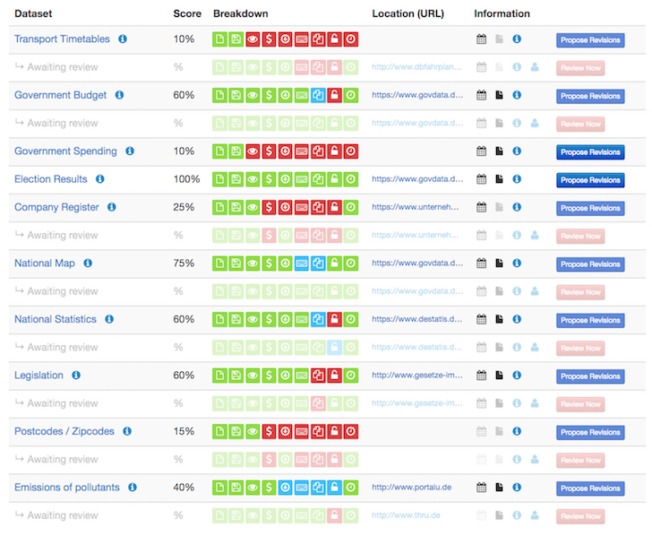
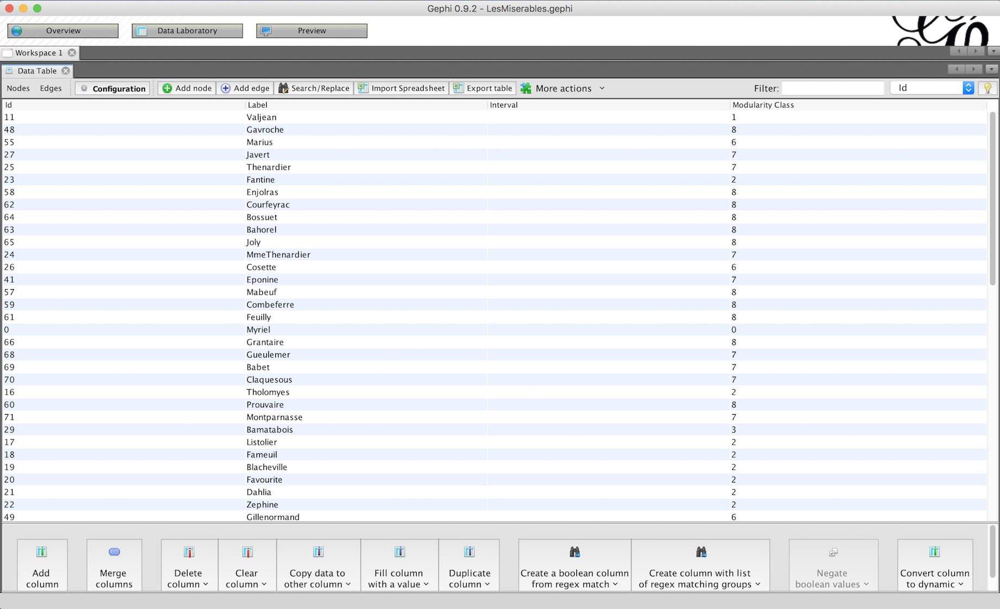
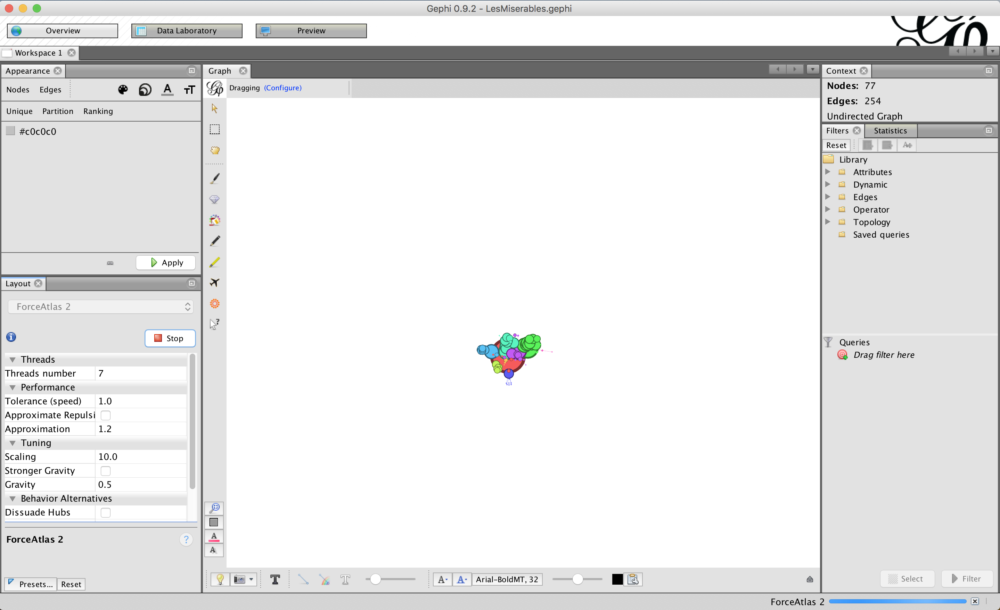
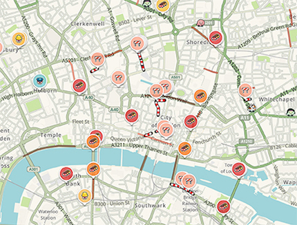
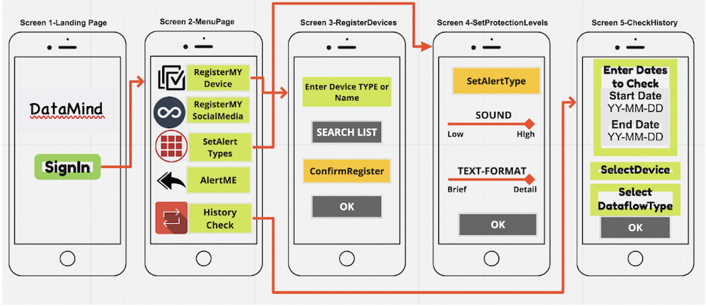

Theory on Demand #29  
**Good Data**

Editors: Angela Daly, S. Kate Devitt and Monique Mann  
Copy editor: Harley Williams  
Editorial assistant: Kayleigh Murphy  

Funding: Queensland University of Technology Faculty of Law

Cover design: Katja van Stiphout  
Design and EPUB development: Barbara Dubbeldam  

Published by the Institute of Network Cultures, Amsterdam, 2019

ISBN 978-94-92302-27-4

**Contact**  
Institute of Network Cultures  
Phone: +3120 5951865  
Email: info@networkcultures.org  
Web: http://www.networkcultures.org

This publication is licensed under the Creative Commons
Attribution-NonCommercial-NoDerrivatives 4.0 International (CC BY-NC-SA
4.0)

This publication is made available through various print on demand
services and freely downloadable from
http://www.networkcultures.org/publications

#BIOGRAPHIES

**Bruce Baer Arnold** is an Assistant Professor at Canberra Law School
(University of Canberra). Dr Arnold's doctoral dissertation explored the
nature of legal identity, including the information state, autonomy and
population-scale data-mining. He has served on OECD health informatics
and data protection working parties, alongside Vice-Chairmanship of the
Australian Privacy Foundation, the Australia's preeminent civil society
body concerned with data protection. His work on new technology law and
privacy has appeared in leading journals and collections. He is a
contributor to Australia's authoritative privacy/confidentiality
practitioner resource. Dr Arnold's current research focus is on
regulatory incapacity regarding medical products and data.

**Wendy Elizabeth Bonython** is an Adjunct Associate Professor at
Canberra Law School (University of Canberra). Dr Bonython has graduate
qualifications in molecular genetics and law, with a background in
health research, public administration and policy development. She
serves on government and professional committees, in addition to
providing invited expert testimony to a range of legislative and law
reform inquiries. Dr Bonython's work has appeared in leading Australian
and overseas law journals, including studies of the interaction between
tort law and practitioner regulation, tort theory and law's
understanding of property in bodies and intangibles. Her research
encompasses professional and public understandings of risk, harm and
innovation.

**Rachelle Bosua** is Assistant Professor in the Business Process
Management & IS Dept of the Management Science and Technology Faculty at
the Open University of The Netherlands. She is also an Honorary Senior
Fellow in the Department of Computing and Information Systems (CIS) at
the University of Melbourne. She is co-author of the book *Knowledge
Management in organizations: a critical introduction* (Oxford University
Press 2018). Her research focuses on data and information privacy that
relates to human behavior and the use of information and communication
technologies.

**Ellen Broad** is Head of Technical Delivery, Consumer Data Standards
at CSIRO\'s Data61. Previous roles include Head of Policy for the Open
Data Institute (ODI), an international non-profit founded by Sir Tim
Berners-Lee and Sir Nigel Shadbolt, and adviser to senior UK government
minister Elisabeth Truss on data, both in the UK. She has also held
roles as Manager of Digital Policy and Projects for the International
Federation of Library Associations and Institutions (Netherlands) and
Executive Officer for the Australian Digital Alliance. Ellen has written
and spoken about AI, open data and data sharing issues in the New
Scientist, the Guardian and a range of technology publications, and is
the author of *MADE BY HUMANS: The AI Condition* published by Melbourne
University Publishing (MUP) in August 2018.

**Anna Bruce** is a Senior Lecturer in the School of Photovoltaic and
Renewable Energy Engineering at UNSW and Research Coordinator
(Engineering) at the Centre for Energy and Environmental Markets. Her
research focuses on energy transitions, including renewable and
distributed energy system and energy market modelling. Current research
projects include Energy Data for Smart Decision Making through the
Australian Government's Smart Cities and Suburbs Program, and Integrated
Smart Home Energy Management Technologies through the CRC-P program. She
participates as an Australian expert in the IEA's Photovoltaic Power
Systems and Demand Side Management technology collaboration programs.

**Stephanie Carroll Rainie** (Ahtna Athabascan), MPH, DrPH, is Assistant
Professor, Public Health Policy and Management at the Community,
Environment and Policy Department, Mel and Enid Zuckerman College of
Public Health; Assistant Research Professor, Udall Center for Studies in
Public Policy (UC); Associate Director and Manager -- Tribal Health
Program for the Native Nations Institute (http://nni.arizona.edu/) in
the UC; and Assistant Director for the Center for Indigenous
Environmental Health Research(http://ciehr.arizona.edu/), MEZCOPH at
the University of Arizona (UA). Stephanie's research explores the links
between governance, health care, the environment, and community
wellness. Stephanie is the co-founder of the United States Indigenous
Data Sovereignty Network and the International Indigenous Data
Sovereignty Interest Group at the Research Data Alliance.  

**Donna Cormack **(Kāti Mamoe, Kai Tahu) is a Senior Lecturer and
researcher with joint positions at Te Kupenga Hauora Māori, University
of Auckland and Te Rōpū Rangahau Hauora a Eru Pōmare, Univeristy of
Otago. Donna has had a long-standing interest in data issues,
particularly as they relate to measuring and monitoring Māori health and
ethnic health inequities. She is a member of the Te Mana Raraunga Māori
Data Sovereignty Network. 

**Karin Clark** is a Senior Fellow (Melbourne Law Masters) at the
University of Melbourne. Previously, she was Special Counsel with the
Melbourne office of the Allens law firm and practised in the firm's
Communications, Media and Technology Practice Group specialising in
advising on compliance with privacy laws.

**Tyng-Ruey Chuang** is an Associate Research Fellow at the Institute of
Information Science, Academia Sinica (Taipei, Taiwan) with a joint
appointment at both the Research Center for Information Technology
Innovation and the Research Center for Humanities and Social Sciences.
He was trained as a computer scientist (PhD, NYU 1993) and has been
working with ecologists, historians and legal scholars to make better
use of research data. He serves on the Executive Committee of CODATA
(The Committee on Data for Science and Technology) at the International
Science Council. He is also a member of CODATA\'s International Data
Policy Committee.

**Angela Daly** is a critical socio-legal scholar of the regulation of
new technologies. She is currently based in the Chinese University of
Hong Kong Faculty of Law and holds adjunct positions at Queensland
University of Technology Faculty of Law (Australia) and the Tilburg
Institute of Law, Technology and Society (Netherlands). She is the
author of *Private Power, Online Information Flows and EU Law: Mind the
Gap* (Hart 2016) and *Socio-Legal Aspects of the 3D Printing Revolution*
(Palgrave Macmillan 2016).

**S Kate Devitt** is a philosopher and cognitive scientist working as a
social and ethical robotics researcher for the Australian Defence
Science and Technology Group. She is an Adjunct Fellow in the
Co-Innovation Group, School of Information Technology and Electrical
Engineering, University of Queensland. Her research includes: the ethics
of data, barriers to the adoption of technologies, the trustworthiness
of autonomous systems and philosophically designed tools for
evidence-based, collective decision making.

**Martin Flintham** is an Assistant Professor of Computer Science at the
University of Nottingham, where he is a member of the Mixed Reality Lab
and Horizon Digital Economy Research Institute. His research focus on
deploying and studying interactive experiences and disruptive technology
probes, including domains such as the Internet of Things, ubiquitous
computing, mixed reality and games. He has led successful 'in the wild'
collaborations with the creative industries, leading to several
highly-cited publications at ACM CHI, and winning the Prix Ars
Electronica and two BAFTA nominations.

**Murray Goulden** is an Assistant Professor of Sociology at the
University of Nottingham, and current holder of a Nottingham Research
Fellowship. Through the Fellowship he is exploring the sociological
implications of Internet of Things technologies for domestic life. His
most recent work addresses the political economy of the 'smart home',
and the implications of IoT-generated 'interpersonal data' for intimate
social groups. He has worked extensively on research applying novel
digital technologies to real world settings, with a focus on networking,
digital data, and smart energy, their role in reconfiguring associated
social practices, and the implications for policy making and design.

**Timothy Graham** is Postdoctoral Fellow in Sociology and Computer
Science at the Australian National University. His research combines
computational methods with social theory to describe, explain, and
predict the dynamics of social systems. He is currently a Chief
Investigator of an ARC Discovery Project that utilises large-scale
hyperlink network analysis and web experiments to comparatively assess
the government web presence of 10 high-tech countries. He develops open
source software tools for the analysis of socially-generated data, and
has published in journals such as Information, Communication & Society,
Information Polity, Big Data & Society, and Critical Social Policy.

**Daniel Gray** (\@DanielGray00) is a PhD researcher based at Cardiff
University, United Kingdom. His undergraduate and postgraduate studies
have focused on critical discursive approaches to social media. At the
time of writing this takes the form of an analysis of neoliberal and
misogynistic discourse on Twitter, blending big data and computational
methods with critical, qualitative research. His research interests are
focused on Marxist and radical approaches to digital sociology,
particularly political, ethical and methodological issues on social
media. More generally, his interests also include the intersections of
radical left politics and Christianity, and teaching in university.

**Jonathan Gray** is Lecturer in Critical Infrastructure Studies at the
Department of Digital Humanities, King's College London, where he is
currently writing a book on data worlds. He is also Cofounder of the
Public Data Lab; and Research Associate at the Digital Methods
Initiative (University of Amsterdam) and the médialab (Sciences Po,
Paris). More about his work can be found at jonathangray.org and he
tweets at \@jwyg.

**Miren Gutiérrez** (\@gutierrezmiren) holds a PhD in Communication
Studies. She is the Director of the postgraduate program 'Analysis,
Research and Data Communication' and lectures on Communication at the
University of Deusto and is a guest lecturer at the University of
Navarra. She is also an Associate Researcher at the Overseas Development
Institute (ODI) in London and DATACTIVE at the University of Amsterdam.
Her interest is data activism or how people and organizations use data
infrastructure, in combination with other technologies, for social
change, equality and environmental conservation. She is also the author
of the book *Data activism and social change (*Palgrave Macmillan 2018).

**Chih-hsing Ho** is Assistant Research Fellow at Academia Sinica,
Taiwan. Her research focuses on the nexus of law and medicine in
general, with particular attention to the governance of genomics and
newly emerging technologies, such as big data, biobanks and artificial
intelligence (AI). She is currently a Co-PI in law for a health cloud
project in Taiwan and is responsible for designing an adequate
regulatory framework for the secondary use of health data and data
linkage. She holds a PhD in law from the London School of Economics
(LSE), a LLM from Columbia Law School, and a JSM from Stanford
University. 

**Becky Kazansky** is a PhD candidate with the DATACTIVE project at the
University of Amsterdam. She has a joint affiliation with the Media
Studies and Political Science departments, additionally serving on the
ethics committee of the Informatics Institute. Her research focuses on
resistance to surveillance amidst datafication, looking specifically at
practices that try to predict and preempt surveillance. Alongside her
academic research, she has worked for a decade with different human
rights and social justice organisations on technology issues.

**Declan Kuch** is a Research Fellow in the School of Humanities and
Languages at UNSW. His research is motivated by problems of reconciling
public values, technoscience and democracy in an era characterized by
profound environmental constraints. His research spans climate change,
energy policy and the social dimensions of the life sciences, and his
primary role is as a co-leader of the Social Dimensions stream of the
ARC Centre of Excellence in Convergent Bio-Nano Science and Technology.
He is the author of *The Rise and Fall of Carbon Emissions Trading*
(Palgrave Climate Energy and Environment Series 2015).

**Tahu Kukutai** (Ngāti Tīpa, Ngāti Kinohaku, Te Aupōuri) is Professor
of Demography at the National Institute of Demographic and Economic
Analysis, University of Waikato. Tahu specialises in Māori and
Indigenous demographic research and has written extensively on issues of
Māori population change, Māori identity and official statistics. Tahu is
a founding member of the Māori Data Sovereignty Network Te Mana Raraunga
and co-editor (with John Taylor) *of Indigenous Data Sovereignty: Toward
an Agenda* (ANU Press 2016). She was previously a journalist. 

**Danny Lämmerhirt** is researcher and research coordinator at Open
Knowledge International. His work focuses on the sociology of
quantification, metrics and policy, data ethnography, and the data
commons. Among other activities, he leads the methodology around the
Global Open Data Index and co-chairs the measurement and accountability
working group at the Open Data Charter. Working at the intersection
between practice and theory, he explores the 'social life of metrics'
and how metrics intervene and reshape organisational cultures and vice
versa.  He shares his work on Twitter \@danlammerhirt.

**Vanessa Lee** (Yupungathi and Meriam people, Cape York and the Torres
Strait), is a social epidemiologist and senior academic within the
discipline of Behavioural and Social Sciences in the Faculty of Health
Sciences at University of Sydney. Vanessa's overarching focus addresses
the social issues of the burden of disease to break the cycle of
inequality that potentially lead to suicide in First Nations
communities, and to strengthen the health and wellness of Aboriginal and
Torres Strait Islander cultural identity, particularly for women. She is
a founding member of the Indigenous Data Sovereignty group in Australia
- Maiam nayri Wingara. 

**Raymond Lovett **(Wongaibon/Ngiyampaa) is an Associate Professor and
leader of the Aboriginal and Torres Strait Islander health program at
the National Centre for Epidemiology and Population Health, Research
School of Population Health, the Australian National University. Ray is
a social epidemiologist with extensive experience in health services
research, public health policy development and health program
evaluation. He is a founding member of the Indigenous Data Sovereignty
group in Australia (Maiam nayri Wingara) and is a member of
the International Indigenous Data Sovereignty Interest group at the
Research Data Alliance. 

**Iain MacGill** is an Associate Professor in the School of Electrical
Engineering and Telecommunications at the University of New South Wales,
and Joint Director (Engineering) for the University's Centre for Energy
and Environmental Markets (CEEM). Iain's teaching and research interests
include electricity industry restructuring and the Australian National
Electricity Market, sustainable energy generation technologies,
renewable and distributed energy integration, energy efficiency and
demand-side participation, and broader energy and climate policy
opportunities and challenges.  

**Daniel McNamara** is a PhD candidate in the Research School of
Computer Science at the Australian National University. He is affiliated
with the Machine Learning Research Group at CSIRO Data61. Daniel\'s
research interests include fair machine learning and representation
learning. He was a visiting student researcher during 2016-17 at the
Carnegie Mellon University Machine Learning Department, supported by a
Fulbright Postgraduate Scholarship. His work experience includes roles
as a campaign data specialist at the Australian Labor Party, as a
management consultant at the Nous Group, and as an intern at Microsoft
and Google.

**Monique Mann** is the Vice Chancellor's Research Fellow in Technology
and Regulation at the Faculty of Law, Queensland University of
Technology. Dr Mann is advancing a program of socio-legal research on
the intersecting topics of algorithmic justice, police technology,
surveillance, and transnational online policing.

**Luke Marshall** is a PhD student in the School of Photovoltaics and
Renewable Energy Engineering and Centre for Energy and Environmental
Markets in the University of New South Wales. His research centres on
the intersection between energy market rules, and the integration of
solar resources into the electricity grid. He loves to code (including
projects such as http://energyopensource.org/) and also to surf.

**Nikita Melashchenko** is a PhD Candidate at Victoria University of
Wellington. He focuses on intellectual property and regulatory theory in
application to the knowledge economy. His dissertation examines data
localization policies under the WTO law. Nikita is a Fulbright alumnus
and earned degrees from Vanderbilt University (LLM) and SPbU (LLB &
LLM). Before joining the academy he practiced in the field of law and
technology.

**Stefania Milan** (stefaniamilan.net) is Associate Professor of New
Media at the University of Amsterdam. Her work explores the intersection
of digital technology, governance and activism, with emphasis on
critical data practices and autonomous infrastructure. Stefania is the
Principal Investigator of the DATACTIVE project, funded with a Starting
Grant of the European Research Council (639379) and exploring the
evolution of citizenship and participation vis-à-vis datafication and
surveillance (data-activism.net), and of the spin-off ALEX project (ERC
Proof of Concept 825974). She is the author of *Social Movements and
Their Technologies: Wiring Social Change* (Palgrave Macmillan 2013/2016)
and co-author of *Media/Society* (Sage 2011).

**Cheng Soon Ong** is a principal research scientist at the Machine
Learning Research Group, Data61, CSIRO(http://data61.csiro.au/). He is
also an Adjunct Associate Professor at the Australian National
University. His PhD in Computer Science was completed at the Australian
National University in 2005. He was a postdoc at the Max Planck
Institute of Biological Cybernetics and the Fredrich Miescher Laboratory
in Tübingen, Germany. From 2008 to 2011, he was a lecturer in the
Department of Computer Science at ETH Zurich, and in 2012 and 2013 he
worked in the Diagnostic Genomics Team at NICTA in Melbourne. Since
2014, Cheng Soon is researching ways to enable scientific discovery by
extending statistical machine learning methods with the Machine Learning
Research Group in Data61, CSIRO in Canberra. Prior to his PhD, he
researched and built search engine and Bahasa Malaysia technologies at
Mimos Berhad, Malaysia. He obtained his B.E. (Information Systems) and
B.Sc. (Computer Science) from the University of Sydney, Australia.

**Sefa Ozalp** is a research assistant and a PhD student at the Social
Data Science Lab, Cardiff University. His main research interests are
computational sociology and computational criminology, particularly
focusing on dissemination of multiple typologies of cyberhate and
xenophobia on social media platforms. He is also interested in
regulation of digital platforms and abuse of personal (meta)data by
oppressive regimes, focusing particularly on Turkey.

**Rob Passey** is a Senior Research Associate at the Centre for Energy
and Environmental Markets (CEEM), and Postdoctoral Fellow at the School
of Photovoltaic and Renewable Energy Engineering (SPREE), both at UNSW
Sydney. He is also a Senior Consultant with ITP Renewables, and Policy
Analyst and Treasurer at the Australian PV Institute. He focuses on
policy research and analysis, particularly renewable energy, distributed
energy resources, energy efficiency and carbon pricing.  He has
published widely on market-like policies to reduce greenhouse emissions,
the uptake of low emission technologies and energy efficiency, as well
as distributed generation and its integration into electricity networks,
including smart grids.

**Chiara Poletti** (\@ccpollon) is an ESRC funded PhD researcher in the
School of Social Sciences at Cardiff University. Her research interests
cover digital rights, digital labour, cybersecurity, digital
methodologies and ethics of research on big data. In the last years, she
has been working on Internet governance, social media platforms and big
data. Her PhD project focuses on the discursive and socio-economic
aspects of social media platforms\' content regulation. Previously, she
studied the public discourse on social media platforms in the aftermath
of terrorist attacks. She is one of the co-founders and chair of the
Digital Stuff Post Graduate research group in Cardiff University
(https://digitalstuffcardiff.com).

**Colin Porlezza** is Senior Lecturer in Journalism with the Department
of Journalism at City, University of London. He is also a Visiting
Professor at the Institute of Media and Journalism at the Università
della Svizzera italiana. His research focuses on data journalism, media
accountability and transparency, as well as innovation in digital
journalism. His research so far has resulted in more than 30
peer-reviewed publications. He is a Board Member of the Swiss
Association of Communication and Media Research (SACM) and a founding
member of the European Journalism Observatory. He has featured on the
the Swiss Public Service Broadcaster SRG SSR, Poynter, the Neue Zürcher
Zeitung and other news outlets.

**Dominic Price** is a researcher at the Horizon Digital Economy
Research Institute at the University of Nottingham. His research focuses
on the software engineering aspect of Human-Computer Interaction and the
development of platforms that bridge the gap between system level
computing and human interfaces. He has most recently been involved in
work in the areas of crowd-sourcing and social-networking.

**Paula Restrepo** is an Associate Professor at the Department of Social
Communication, Faculty of Communication, Universidad de Antioquia,
Medellín, Colombia. She has a degree in Anthropology and a Masters in
Philosophy from Universidad de Antioquia, and a PhD in Philosophy from
the Basque Country University. She is a member of the Research Group
'Grupo de investigación Comunicación Periodismo y Sociedad' at Facultad
de Comunicaciones, Universidad de Antioquia UdeA, Calle 70 No. 52-21,
Medellín, Colombia. This chapter is a product of the Project "Prácticas
comunicativas de la agricultura urbana en Medellín" (cod. 2016-12689)
approved by Convocatoria Programática 2016, from the Universidad de
Antioquia.

**Megan Richardson** is a Professor of Law, Co-Director of the Centre
for Media and Communications Law, and Director of the Intellectual
Property Research Institute of Australia at the University of Melbourne.
Recent books include *The Right to Privacy: Origins and Influence of a
Nineteenth-Century Idea* (Cambridge University Press 2017), and she is
currently writing an *Advanced Introduction to Privacy Law* (Edward
Elgar, forthcoming 2020).

**Gerard Jan Ritsema** **van Eck** is a PhD researcher at the Security,
Technology, and *e*-Privacy (ST*e*P) research group at the University of
Groningen. His research focuses on participatory surveillance and
privacy issues in public spaces. In particular, he is interested in how
new and rapidly evolving technologies, such as smartphones and
predictive analytics, enable states and large corporations to enrol
citizens as data gatherers. His work combines insights from sociology
and surveillance studies with work on European (Union) data protection
law to generate new insights on the changing nature of urban public
spaces.

**Mike Roberts** is a Research Associate at the Centre for Energy and
Environmental Markets (CEEM) and in the School of Photovoltaic and
Renewable Energy Engineering (SPREE) at UNSW Sydney. His research
interests include technical and policy aspects of integration of
distributed renewable generation, storage and demand management,
co-operative approaches to energy planning, including embedded networks,
micro grids and community renewable energy, and solar potential
assessment. Mike's doctoral thesis explored opportunities for
photovoltaics and storage in multi-occupancy residential buildings.

**Adam Steer** is a serial multi-disciplinarian, whose career has ranged
from neurophysiology laboratories to web site management to professional
bicycle repair to Antarctic logistics, sea ice field research and most
recently working on massive high resolution geospatial data management.
The intersection of technology and human evolution is a key driver in
Adam's outlook on science and data and life - looking at when we cast
human problems as engineering problems, and how we can become better
humans in order to build a better future. He runs the consultancy
Spatialised (http://spatialised.net).

**Naomi Stringer** is undertaking a PhD in the School of Photovoltaics
and Renewable Energy Engineering and Centre for Energy and Environmental
Markets in the University of New South Wales. Her research is driven by
a fascination with the opportunities and challenges afforded by
distributed energy resources (namely rooftop PV and home battery
systems) and research interests include the technical, social and
regulatory aspects of distributed energy integration. Her current work
examines the behaviour of rooftop solar PV systems during major
electricity system disturbances. Undertaken in collaboration with the
Australian Energy Market Operator and solar monitoring company, Solar
Analytics, her work is heavily data driven.

**Guillén Torres** joined DATACTIVE as a PhD candidate to develop a
project on how data mediates the interaction between organised citizens
and the state. His main areas of interest are transparency, resistance
and the anthropology of the state. He also serves as an advisor to the
Mexican NGO ControlYourGovernment. He has a background in Urban Studies
and Sociology and is a recidivist Actor-Network Theory enthusiast.

**Claire Trenham** has research and data experience spanning a range of
physical sciences, including radio astronomy, ocean waves, and climate
models, as well as substantial experience more broadly managing large
scale 'nationally significant' research data collections at the
Australian National Computational Infrastructure. Claire currently works
for CSIRO's Climate Science Centre in the Sea level rise, waves and
coastal extremes team alongside the regional climate team. Claire is
heavily involved in climate modelling, data processing, data preparation
and software to enhance science capabilities, as well as supervising
student volunteers in historical data digitisation. Claire has a passion
for making maths and science fun, relevant and accessible.

**Lachlan Urquhart** is a Lecturer in Technology Law at the University
of Edinburgh. He is also a visiting researcher at the Horizon Digital
Economy Research Institute, where he was a Research Fellow in
Information Technology Law from 2016-2018. He is a multidisciplinary
researcher, having degrees in both law and computer science, with an
LL.B, (Hons) from University of Edinburgh, an LL.M in IT & Telecoms Law
(Distinction) from University of Strathclyde and & a Ph.D in Human
Computer Interaction from University of Nottingham. He works at the
boundaries of information technology law (mainly privacy & information
security), HCI, and computer ethics. His research mainly considers
the technical, legal, social, and ethical implications of living with
ambient interactive computing.

**Juan Carlos Valencia** is an Associate Professor of Communication at
Universidad Javeriana in Bogotá, Colombia. He holds a degree in
Electronics Engineering and a Masters in Communication from Universidad
Javeriana, and a PhD from the Department of Music, Media and Cultural
Studies at Macquarie University (Australia). He is a member of the
Research Group 'Comunicación, medios y cultura' at Universidad
Javeriana.

**Karin van Es** is an Assistant Professor at Utrecht University and
coordinator of the Datafied Society research platform. Her current
research interests revolve around tool criticism and public values in
the digital age. Karin is author of the book *The Future of Live*
(Polity Press 2016), co-editor of the volume *The Datafied Society* (AUP
2017) and the issue 'Big Data Histories' (2018) for TMG-Journal for
Media History. She has published in outlets such as Television & New
Media, Media, Culture & Society, M/C Journal and First Monday. Her
publications cover critical data studies, social media, and the concept
liveness.

**Daniela van Geenen** is a Lecturer and researcher in data journalistic
practice and data visualization at the University of Applied Sciences
Utrecht and an affiliated researcher at the Datafied Society research
platform. Her work tackles the question of the scholarly conduct that
the work with digital methods demands, challenged by the need to design
accountable software tools. She wrote her MA thesis on tool criticism
investigating the case of Gephi. Daniela published on the role of social
and technical actors on social media platforms, and their meaning for
social and political practices such as public debate and cultural
consumption.

**Jelmer van Nuss** is a developer at the Digital Humanities Lab at
Utrecht University and a computing science master's student at Utrecht
University. He specializes in artificial intelligence with a particular
interest in data science. His work at the Digital Humanities Lab
consists of supporting humanities researchers by providing software and
tools for their research.

**Lonneke van der Velden** is a postdoctoral researcher with DATACTIVE
and a Senior Lecturer at the Department of Media Studies at the
University of Amsterdam. Her work deals with surveillance and data
activism, with a special focus on Open Source Intelligence. She is part
of the editorial board of Krisis: Journal for contemporary philosophy in
the Netherlands and is on the Board of Directors of the Dutch digital
rights organisation Bits of Freedom.

**Jennifer Walker** (Haudenosaunee), PhD, is a Canada Research Chair in
Indigenous Health and Assistant Professor, School of Rural and Northern
Health, Laurentian University. She is the Indigenous Lead at the
Institute for Clinical Evaluative Sciences in Ontario, Canada. Jennifer
works to support and advance the governance and use of population health
data by Indigenous nations to address community health and wellbeing.
Her program of research integrates Indigenous perspectives on
multi-morbidity and culturally safe care for Indigenous older adults.
Jennifer is a member of the Indigenous Data Sovereignty Interest group
at the Research Data Alliance.  

**Jeb Webb** is a research fellow at Australia's Oceania Cyber Security
Centre, which works in partnership with the University of Oxford's
Global Cyber Security Capacity Centre to conduct maturity reviews for
countries in the Oceania region. He received a Bachelor of Arts in
Political Science from the University of California at Berkeley, a
Master of Arts in Intelligence Studies from American Military
University, and a PhD from the University of Melbourne\'s School of
Engineering (Department of Computing and Information Systems).

**Maranke Wieringa** is a PhD candidate at Utrecht University and has a
background in Cultural Studies and Media Studies, with a specialization
in software and data. Her dissertation investigates algorithmic
accountability in Dutch municipalities, and, following from this
insight, Maranke develops a toolkit to empower municipal data
professionals to give testimony of the (decisions around the) algorithm.
At Utrecht University, Maranke is part of the Datafied Society research
platform, and teaches various courses on (scholarly) data analysis. Her
academic interests lie at the intersection of software and data (e.g.
tool criticism, algorithm studies).

**Kersti Wissenbach** (kerstiwissenbach.com) is a researcher and senior
consultant working on the crossroads of communication, governance,
responsible data, and civic tech. She is specialised in participatory
methods and has worked with activist groups, NGOs, and government
institutions in over 15 countries. Since 2011 Kersti runs her own
consulting firm providing strategy and policy advice and facilitating
co-creation processes. Kersti lectures in the Communication for
Development Master of Malmö University. She is a researcher with the
DATACTIVE project where she merges social movement and communication for
social change scholarship for her study of power dynamics within
transnational civic tech activism.

**Sharon Young** has recently submitted her PhD thesis to the University
of New South Wales, investigating the influence of tariffs on the
impacts of decentralised energy resources on the Australian electricity
industry and is currently working with the Centre for Energy and
Environmental Markets (CEEM).

**Andrea Zeffiro** is an Assistant Professor in the Department of
Communication Studies and Multimedia, and Academic Director for the
Lewis & Ruth Sherman Centre for Digital Scholarship at McMaster
University.

#CONTENT

**1: Introduction: What is (in) Good Data**  
*Monique Mann, Kate Devitt and Angela Daly*

##THEME 1: GOOD DATA MANIFESTOS AND PRACTICES

**2: Good Data Practices for Indigenous Data Sovereignty and Governance**  
*Raymond Lovett, Vanessa Lee, Tahu Kukutai, Donna Cormack, Stephanie Carroll Rainie and Jennifer Walker*

**3: The Good Data Manifesto**  
*Claire Trenham and Adam Steer*

**4: The Good, the Bad and the Beauty of ‘Good Enough Data’**  
*Miren Gutiérrez*

**5: An Energy Data Manifesto**  
*Declan Kuch, Naomi Stringer, Luke Marshall, Sharon Young, Mike Roberts, Iain MacGill, Anna Bruce and Rob Passey*

##THEME 2: GOOD DATA AND JUSTICE 

**6: Trade-offs in Algorithmic Risk Assessment: An Australian Domestic Violence Case Study**   
*Daniel McNamara, Timothy Graham, Ellen Broad and Cheng Soon Ong*

**7: Unlawful Data Access and Abuse of Metadata for Mass Persecution of Dissidents in Turkey: the ByLock Case**   
*A. Sefa Ozalp*

**8: Not as Good as Gold? Genomics, Data and Dignity**  
*Bruce Baer Arnold and Wendy Elizabeth Bonython*

**9: Data Localization: Policymaking or Gambling?**  
*Nikita Melashchenko*

##THEME 3: GOOD DATA AS OPEN AND SHARED DATA

**10: Making Data Public? The Open Data Index as Participatory Device**  
*Jonathan Gray and Danny Lämmerhirt*

**11: Data Journalism and the Ethics of Open Source** 
*Colin Porlezza*

**12: Governance of Communal Data Sharing** 
*Chih-Hsing Ho and Tyng-Ruey Chuang*

##THEME 4: GOOD DATA ACTIVISM AND RESEARCH 

**13: Provocations for Social Media Research: Toward Good Data Ethics** 
*Andrea Zeffiro*

**14: Data for the Social Good: Toward a Data-Activist Research Agenda** 
*Becky Kazansky, Guillén Torres, Lonneke van der Velden, Kersti Wissenbach and Stefania Milan* 

**15: Good Data is Critical Data: An Appeal for Critical Digital Studies**  
*Chiara Poletti and Daniel Gray*

**16: The Fieldnotes Plugin: Making Network Visualisation in Gephi Accountable** *Maranke Wieringa, Daniela van Geenen, Karin van Es and Jelmer van Nuss*

##THEME 5: GOOD DATA AND SMART CITIES AND HOMES 

**17: Algorithmic Mapmaking in ‘Smart Cities’: Data Protection Impact Assessments as a means of Protection for Groups** 
*Gerard Jan Ritsema van Eck*

**18: Truly Smart Cities. Buen Conocer, Digital Activism and Urban Agroecology in Colombia** 
*Juan-Carlos Valencia and Paula Restrepo*

**19: Intelligent Warning Systems: ‘Technological Nudges’ to Enhance User Control of IoT Data Collection, Storage and Use**  
*Rachelle Bosua, Karin Clark, Megan Richardson and Jeb Webb*

**20: Domesticating Data: Socio-Legal Perspectives on Smart Homes and Good Data Design** 
*Martin Flintham, Murray Goulden, Dominic Price and Lachlan Urquhart*

# 1. What is (in) Good Data?
*Monique Mann, S. Kate Devitt and Angela Daly*

## Introduction: Why Good Data?

In recent years, there has been an exponential increase in the
collection, aggregation and automated analysis of information by
government and private actors. In response to this there has been
significant critique regarding what could be termed 'bad' data practices
in the globalised digital economy. These include the mass gathering of
data about individuals, in opaque, unethical and at times illegal ways,
and the increased use of that data in unaccountable and discriminatory
forms of algorithmic decision-making.

This edited collection has emerged from our frustration and depression
over the previous years of our academic and activist careers critiquing
these dystopian 'Bad Data' practices. Rather, in this text on 'Good
Data' we seek to move our work from critique to imagining and
articulating a more optimistic vision of the datafied future. We see
many previous considerations of Bad Data practices, including our own,
as only providing critiques rather than engaging constructively with a
new vision of how digital technologies and data can be used productively
and justly to further social, economic, cultural and political goals.
The objective of the Good Data project is to start a multi-disciplinary
and multi-stakeholder conversation around promoting good and ethical
data practices and initiatives, towards a fair and just digital economy
and society. In doing so, we combine expertise from various disciplines
and sectors, including law, criminology, justice, public health, data
science, digital media, and philosophy. The contributors to this text
also have expertise in areas such as renewable energy, sociology, social
media, digital humanities, and political science. There are many fields
of knowledge that need to come together to build the Good Data future.
This project has also brought together academic, government and industry
experts along with rights advocates and activists to examine and propose
initiatives that seeks to promote and embed social justice, due process
rights, autonomy, freedom from discrimination and environmental
sustainability principles.

We acknowledge that we are not the first people to start thinking about
ethical data and data justice.[^01chapter1_1] But we view 'Good Data' as being a
broader, and more open-ended, idea than data ethics or data justice,
which may confine the conversation, for instance, to philosophical
questions or a consideration of 'inserting' ethics in technical aspects,
and not engage with wider political, historical, social, cultural,
technological and economic issues.

We also wanted to take a more global approach to Good Data given much of
the discussion and critique on data practices emanates from the Global
North/West, in the spirit of creating and supporting Southern
scholarship about data issues.[^01chapter1_2] In this edited text there are
contributions from five continents which we view as a step towards
broadening the good and ethical data discussions out from the Global
North/West, although we acknowledge our position of privilege as
academics based in the 'Global North-in-South'.[^01chapter1_3] Furthermore, we
acknowledge limitations of the book in this regard that we do not have a
contribution from the African continent, and also our choice of language
in the form of English. We hope that in the future Good Data discussions
will be broadened to include more contributions from authors based in
more geographical locations and in more languages than we have managed
with this book.

The Good Data project was developed and initiated by us when we were all
based together at Queensland University of Technology (QUT) in
Brisbane/Meanjin - located on traditional Turbal land in what is now
known as Australia - in late 2017. Each of us had been working on
research engaging with social science aspects of data and digital
technologies, and Angela and Monique had also been very active in
digital rights activism in Australia. The situation in Australia was
then, and still is, far from 'best practice' in data and digital issues
- the lack of an enforceable constitutional right to privacy, the
Australian government's ongoing digital colonialism perpetuated against
Indigenous peoples, refugees and other marginalised people and a myriad
of other ways in which unethical data practices were being
implemented^.^[^01chapter1_4] We had spent a lot of time and energy criticising
these practices from both academic and activist perspectives, but we
realised that we had not presented a positive alternative: how could
data and digital technologies be designed and used in 'good ways', for
'good' purposes? If digitisation and data are inevitabilities, then we
have to (re)imagine the kind of digitised world and data we want to see
rather than only offering a naysaying critique of the status quo.

The Good Data project formally commenced with a multi-stakeholder
workshop hosted by us and funded by the QUT Faculty of Law in late 2017.
We designed the workshop to gather representatives of different academic
disciplines and people who had in some way created, used or implemented
'Good Data' practices. The workshop was invite-only, and we organised an
outreach public event in the evening featuring well-known digital rights
activist Asher Wolf (\@Asher\_Wolf) in conversation. We would like to
thank Thoughtworks Brisbane for hosting our public event and providing
catering for the audience.

We wanted the workshop and public event to be just the beginning of our
enquiry into Good Data. Given the interest and engagement in our
project, we thought that the next step was a book project on Good Data
with an open call for contributions. From the beginning we knew that the
book would have to encompass and showcase Good Data practices itself.
Firstly, we are delighted to be working with the Institute of Network
Cultures (INC) given their commitment to quick open access publishing on
innovative topics related to digital network cultures. So many texts
related to Good Data reside behind paywalls and as a result are not
widely accessible, particularly to those outside of the academy.
Furthermore, with the increasing and all-encompassing datafication of
society and the economy, we were keen to issue this collection on Good
Data in a rapid and timely manner (whose publication is taking place a
little over a year after our initial Good Data workshop). We have
extensive experience ourselves in waiting for our (academic) writing to
see the light of day (often behind a paywall) and so we also appreciated
the speed with which the INC could facilitate this collection getting
out into the world. We also asked contributors for short chapters which
would be accessible to non-specialists in order to widen the book's
appeal.

Perhaps the first question that should be asked when writing a book
about Good Data is what is the nature of 'good'. What is 'goodness'? In
our call for papers we were deliberately agnostic with regards to a
conceptual analysis of 'good' because it intentionally sought
transdisciplinary, culturally diverse and inclusive contributions.
Foundational questions on 'goodness' for society and individuals from a
western philosophical perspective - a perspective in which we ourselves
are situated - might consider 'goodness' as increasing wellbeing
(including hedonic, desire-theories and objective list-based theories),
sustainability, fairness, justice, virtue and so on. For example, how
would a utilitarian or Rawlsian design a smart city? How should app
developers incorporate feminist ethics of care - that prioritises
relationships and responsibilities over the individual - into their
choice architecture? Yet, data discourses from underrepresented,
disenfranchised and disempowered voices need to be prioritised rather
than hegemonic conceptual structures. For example, (how) can autonomous
vehicle data regulation incorporate intersectional feminist or Marxist
political agendas? When and who should participate in radical data
resistance and erasure? We believe this book is just one step into a
long term project of interrogating diverse ethical, cultural and
political theoretical frameworks into data practices.

Since we view 'Good Data' as a discussion which transcends atomised
academic fields, we are pleased to see contributors and contributions to
this book coming from cross/multi/transdisciplinary perspectives.
Another of our aims was to move the discussion on Good Data beyond one
disciplinary or professional sphere, and we are also pleased to see
academics, activists, civil society representatives and technical
experts contribute chapters to this book. Finally, we gave authors the
option to have their chapter peer-reviewed or editor-reviewed. We
thought that the option of editor review would ensure that people from
other fields beyond academia could contribute to the collection.

In the next section we offer an overview of the authors' contributions
to this collection under each theme. We acknowledge that many of the
contributions are relevant to more than one theme, but we have grouped
them as best we can under some headings which give a flavour of the
chapters:

1.  Good Data Manifestos and Practices;

2.  Good Data and Justice;

3.  Good Data as Open and Shared Data;

4.  Good Data Activism and Research; and

5.  Good and Smart Data.

Finally, we would like to offer our sincere thanks to our research and
editorial assistants who have helped us bring this book to fruition. Our
particular thanks go to Dr Kayleigh Murphy and Ms Harley Williamson
without whose hard work and dedication we would not have been able to
complete the book project within such a speedy timeframe. We would also
like to thank Anna Carlson who assisted us at the beginning of the
project and organised a wonderful outdoor public event in November 2017
on 'Data Activism and Digital Rights'[^01chapter1_5] (at which Angela spoke) for
the Brisbane Free University, 'an autonomous space in which the
empowering processes of teaching and learning belong to everybody'.[^01chapter1_6]
Anna also wrote a series of Good Data blogposts for the DATACTIVE Big
Data Sur blog.[^01chapter1_7] Last, but far from least, we would like to thank all
of the peer reviewers who contributed their time and expert insights to
commenting on the peer-reviewed chapters, thereby strengthening the
final versions of the chapters, and this book overall.

## 2. What's in the Good Data book?

**Theme 1: Good Data Manifestos and Practices**

We kick off the book with a selection of manifestos and guidance on what
'Good Data' is, or should be, and how it should be used, or not.

First, in **Chapter 2**, we are delighted to have a multi-authored
contribution on Good Data Practices for Indigenous Data Sovereignty and
Governance from a group of prominent international Indigenous scholars,
namely Raymond Lovett, Vanessa Lee, Tahu Kukutai, Donna Cormack,
Stephanie Carroll Rainie and Jennifer Walker. Indigenous Data
Sovereignty (IDS) and Indigenous Data Governance are Indigenous-led
movements and practices through which Indigenous peoples are setting
their own visions for good data regarding data generated and collected
by and about them. IDS movements and practices can be seen as a
manifestation of Indigenous peoples' sovereignty more generally and as
an alternative vision of data, centreing Indigenous peoples' rights to
self-determination and autonomy.[^01chapter1_8] IDS also challenges conventional,
western colonial data practices, which have been utilised against
Indigenous peoples since colonisation and continue to be used against
them in the digital environment. The authors set out the context for,
and emergence of, IDS movements and provide an overview of IDS
developments including the IDS networks such as Te Mana Raraunga, the
Māori Data Sovereignty Network in Aotearoa/New Zealand.

In **Chapter 3**, we then move to Claire Trenham and Adam Steer's Good
Data Manifesto, which draws on their practical experience as data
scientists working with geospatial data. Their manifesto sets out a
series of 'Good Data' questions that data producers and consumers should
ask, constituting a set of principles which can be used to guide data
collection, storage, and re-use. According to the authors, good data
should be: usable and fit for purpose; collected with respect to humans
and their rights, and the natural world; published; revisable; and form
useful social capital. They draw on various examples to illustrate these
questions and principles, with a focus on geospatial data which is often
voluminous, ubiquitous and also - significant from a data protection
perspective - personal.

**Chapter 4** by Miren Gutiérrez, considers the question of 'good enough
data', particularly for social activism. 'Good enough' is contrasted
with institutional, government or corporate data collection that may be
systematic, but also imbued with control mechanisms to protect data
stakeholders. Good enough data is thus a way to promote the use of data
by grass roots activists and citizens to impose political pressure for
social ends. The author thus defends 'good enough data' as data created,
valued and interpreted by ordinary people, such as environmental data
and citizen sensing. Good enough to sustain ongoing legal
investigations. She offers the example of the Berkeley Human Rights
Investigation Lab (HRC Lab) that used the Syrian archive to categorise
chemical attacks on a Syrian city as evidence for violations of
international humanitarian law as well as violations other regulations
and treaties.

Finally, we turn to our next manifesto in **Chapter 5**, this time for
good energy data, authored by Declan Kuch, Naomi Stringer, Luke
Marshall, Sharon Young, Mike Roberts, Iain MacGill, Anna Bruce and Rob
Passey. The authors are Australia-based energy researchers who view a
close link between access to energy data and the country's transition to
a sustainable and just community-based energy future, which they argue
is currently hampered by some major incumbent energy sector businesses
and politicians. Rooftop solar (PV) panels are popular additions to
Australian homes but individuals do not have access to the data about
the energy they produce and consume. Access to this data would empower
individuals and collectives such as community energy groups, and
accordingly could hasten Australia's take-up and implementation of
sustainable energy in a sustainable, communal way. The authors provide a
series of recommended actions in their manifesto which would lead to
this goal.

**Theme 2: Good Data and Justice**

Data justice is a term which has become very prominent in recent times.
We acknowledge in particular the work of the Data Justice Lab based at
Cardiff University,[^01chapter1_9] and their conceptualisation of 'data justice' as
'a conceptual foundation for exploring how data-driven surveillance
implicates different understandings of social justice as well as a
potential action-building tool for addressing such implications'.[^01chapter1_10]
We also acknowledge Taylor's work on elucidating a concept of
international data justice based on three 'pillars' of '(in)visibility,
(dis)engagement with technology and antidiscrimination'.[^01chapter1_11]

The chapters in this theme contribute to, and extend, the idea of data
justice, through case studies on data justice topics in different areas
such as criminal justice, genomics and cross-border data flows. We see
these chapters as also contributing to discussions on digital
criminology,[^01chapter1_12] by widening the discipline's traditional focus beyond
'The Cyber' and cybercrime to look at wider socio-political contexts of
digital citizenship.

What is meant by 'fairness' is a central consideration in 'Good Data.'
This question is addressed by McNamara, Graham, Broad, and Ong on
(racial) bias[^01chapter1_13] in **Chapter 6** that examines actuarial models of
criminal justice. McNamara and colleagues examine assumptions that
underpin recidivism prediction methods in Australia, with the objective
of identifying and rectifying bias, specifically in relation to domestic
violence cases. Significantly, the authors draw attention to the
politics of data collection and statistical inference. For example, they
question Indigenous status being selected as a predictor variable, and
argue that the social context of algorithmic decision-making is an
important determinant of outcomes in criminal justice. Their examination
of the predictive validity of risk assessment tools demonstrates that
there are serious consequences for 'trade-offs' in adopting various
definitions of 'fairness'. Accordingly, the authors re-design the
predictive model in order to reduce the discriminatory impact of the
model towards Indigenous persons, yet this comes at the 'trade-off' of
reduced predictive accuracy. With these findings identified, the authors
outline various approaches to algorithmic fairness in all stages of data
collection and processing. Their analysis demonstrates the importance of
incorporating explicit fairness criterion into predictive models - and
making trade-offs in fairness explicit - as Good Data practice.

Ozalp's chapter - **Chapter 7** - presents a detailed case study of the
ByLock case concerning unlawful data access leading to mass persecution
of dissidents in Turkey. Through the lens of moral panic analysis Ozalp
recounts a case study of what can go bad without good information
security, providing a concrete real world example of the oppressive
potential of bad data practices, and while questioning what we can learn
for Good Data. In doing so, Ozalp outlines how digital communication
technologies and strong information security are essential to support
what he terms a 'good democracy' -- including protection for the rights
such as freedom of expression, political thought, religion, association
and privacy. Accordingly, it is argued that counter-surveillance
practices, online anonymity and encryption tools are integral to a good
democracy.

Next under the data justice theme is **Chapter 8:** Arnold and
Bonython's examination of genomic data. They argue that recent
technological developments in this area, a 'perfect storm' may be
brewing where governments want to implement population-wide genomic
databases, private corporations attempt to commodify genomic data
through the intellectual property system, and direct-to-consumer genomic
testing opens a Pandora's Box of legal, political and ethical issues.
Their chapter is a timely and crucial contribution to conceptualising
'Good Data' in this area. Underpinning 'goodness' regarding genomic data
is, according to the authors, a fundamental respect for human dignity
which ought to manifest, for instance, in truly consensual, fair and
transparent data collection and use. The authors also emphasise an
'ethic of responsibility' regarding genomic data which ought to be
implemented in various ways, including through regulation and government
intervention, professional codes, public education, and decision-making
by public bodies funding research and development in this area.

The final contribution to this section is **Chapter 9**, where
Melashchenko tackles the contentious issue of data localisation,[^01chapter1_14] or
stipulations that data be physically held on machines within the
territory of a particular country or jurisdiction. Data localisation
policies in some countries evidence the materiality of data. Data does
not have an ethereal existence but exists in a physical location. This
is significant as principles of territoriality underpin the state's
legitimacy to police and govern. The issue of data localisation goes to
the heart of (digital) geopolitics and legal geographies of digital
technologies, since it may or may not be desirable from different
perspective for data to be held in a particular country, or for it to be
held 'offshore' in order to evade certain laws and policies.
Melashchenko considers data localisation in the context of trade, data
justice and privacy. He identifies that data localisation policies are
far from a monolith and may differ in their intensity and detail, and
accordingly maps out some 'variables' and 'types' of these policies.
This is followed by the introduction of some normative criteria against
which data localisation policies can be assessed as being 'smart data
regulation' which facilitates data justice, and ultimately a vision of
Good Data.

**Theme 3: Good Data as Open and Shared Data**

Our next theme centres ideas of open data and shared data as forms of
Good Data. Discussions of open data have preceded much of the
contemporary focus on privacy as being a main 'Good Data' issue,
although concerns about the unintended consequences of (some) open data
for privacy and other rights are now prominent. Reconciling tensions
between open data and data protection (and other interests) is a key
challenge for this area.

In the first chapter in this theme - **Chapter 10** - Gray and
Lämmerhirt consider the social life of the Open Data Index, a civil
society project that aims to measure and influence how much government
data is made available. In particular they attend to how the index
organises participation and data politics, comparing indexes to the
political mobilisiation afforded by rallies, petitions and hashtags.
Indexes represent social facts but also reshape the social world -
quantifying and thus enabling normative claims about data practices of
different countries, and encouraging participation to resolve them. The
Open Data Index aims to intervene around what is considered 'Good Data'
by assessing the extent to which the publication of government data
conforms with specific legal and technical norms and conventions. As a
database about data, it can measure accountability and intervene on
official regimes of quantification and datification. This is relevant to
other chapters considered in the volume including smart cities and good
enough data that consider the role of government versus citizen data and
the role of data activism. The discussion of the role of indexes
(ratings and rankings) is also relevant to the data visualization
chapter that acknowledges the impact of visualisations on the
epistemology of users. Visualizations are heavily employed by indexes to
attempt political and social change (e.g. Corruption Perceptions Index).
The Open Data index chapter is thus able to contribute to a larger
conversation around the importance of empowering citizens with good
data.

We then turn to **Chapter 11**, where Porlezza addresses open source
ethics in data journalism, broadly speaking the use of computer science
and statistical analytic methods in journalism practice, including
programming, data analysis and visualisations to inform reporting. The
author identifies four open source normative concepts to guide activity
in this area, namely transparency, participation, tinkering, and
iteration, which he argues can facilitate Good Data journalism. Drawing
on empirical research conducted with data journalists in Italy and
Switzerland, actual data journalism practices are assessed against these
four concepts to evaluate the extent to which these activities fulfil
and align with open source ethics. Various differences are identified in
how data journalists in both countries approach, adhere to and implement
these ethical principles in their work, which Porlezza mainly attributes
to structural differences between the journalism environment in the two
countries rather than individual journalists' own moral codes.

In the final chapter in this theme**, Chapter 12**, Ho and Chuang
critique neoliberal data protection models which emphasise individual
autonomy and choice through concepts such as consent and anonymisation.
Instead, the authors propose an alternative model for data use and
sharing based on community participation in decision-making and
self-governance, drawing from commoning scholarship and practice, and
computational methods. They look to examples including data cooperatives
to analyse how community participation can occur regarding data
governance, in ways which can facilitate use and sharing of that data
but are also trusted by the collective. In this way, communal data
sharing models present a Good Data alternative to the current widespread
prorprietary and extractive models.

**Theme 4: Good Data Activism and Research**

Ethical research and activism is a key component of 'Good Data'. In an
age of fighting back against Bad Data, government surveillance and
corporate capture of civil society and academia (see for instance
Funding Matters' recent resistance to Palantir's sponsorship of the
Amsterdam Privacy Conference),[^01chapter1_15] it is crucially important for the
Good Data agenda to outline approaches to ethical activism and research.
Chapters within this theme advance and consider what 'Good' activism and
research looks like and outline principled approaches to conducting Good
Data activism and research. Chapters within this theme also consider the
interaction between activists and academics research agendas and outline
models for ethical data-activist collaborations.

The theme's first chapter - **Chapter 13** - by Zeffiro investigates
research ethics boards at funding bodies and universities in Canada and
found that they share a piecemeal approach to research ethics in the
face of changing technologies. She proposes a united effort to create
ethical guidance for using social media data for whole of life-cycle
research that acknowledges the diversity of needs of different
interdisciplinary researchers. At its core researchers must be
transparent about their methodologies for generating, collecting,
processing analysing and storing social media data. Social media data is
likely to be harvested without informed consent, without concern for the
welfare of participants and potentially without sensitivity to
vulnerable or at risk participants. Zeffiro notes that third party
disclaimers on social platforms are not sufficient for ethical and
informed consent by research participants. Participant data accrued from
social media participants must be kept anonymous, yet researchers must
acknowledge that confidentiality cannot be guaranteed for data sent via
the internet by any third parties. Researchers must recognise that their
social media dataset has been generated by human participants who are
likely unaware of how their inputs have been quantified and that they
are complicit with the platforms themselves if they rely on them for
research data. Zeffiro argues that the term 'c/overt research' should be
used by researchers to acknowledge the ethical challenges with
collecting and using social media data and the limitations of research
ethics boards. Zeffiro proposes researchers question who they feel
accountable towards, are self-reflective with regards to their own
situated perspective and identify their duties to participants;
maintaining a flexible and adaptable approach, rather than seeking a
'one-size-fits-all' solution to research.

Writing reflectively from the experiences of the DATACTIVE team at the
University of Amsterdam, in **Chapter 14** Kazansky, Torres, van der
Velden, Wissenbach and Milan consider what data activism research for
the social good could look like aligned with the Good Data agenda. They
question what forms of active and productive roles academics can play in
advancing data activism, and also research agendas. In doing so, they
examine the co-production of knowledge and the specific work of the
DATACTIVE team and their direct involvement as activists with the
communities that they study. Their main contribution is the proposal of
an 'engaged' approach and epistemology to research that aims to
contribute to activist causes -- that is, doing research 'with' rather
than 'about'. They outline an approach to ethical data activist research
as a process rather than a checklist and as inspired by Association of
Internet Researchers (AoIR) ethical codes and feminist ethics of care.

Similarly, in **Chapter 15** Poletti and Gray outline what is 'Good'
when it comes to critical digital studies, and advance an emancipatory
method inspired by Marxist and critical ethical approaches. They argue
that 'Good Data' is that which can be used to critique power dynamics
associated with the use of data, and with a focus on economic and
technological environments and contexts in which they are generated.
They commence their examination by drawing attention to global
informational capitalism and the asymmetric and extractive exploitation
of data by companies such as Google, Facebook, Amazon etc, while
advocating for reflection on the production system where data are
created and collected and sold -- and the tensions between ethical
research and capitalist research (such as, for example, as revealed by
the Facebook-Cambridge Analytica scandal). Poletti and Gray highlight
the challenges to critical researchers in producing valid and ethical
research in a data ecosystem of capitalist production and also that is
formed and exists in cross/multi jurisdictional contexts. Drawing from
the work of Antonio Casilli, Christian Fuchs and Karen Gregory they
propose an approach to critical ethical data research that considers the
economic and political order, and ground data ethics in a critique of
neoliberal economic systems and digital labor and capitalist relations.
They conclude that Good Data are data that can be used to bring about
change in modern informational capitalism, but for this to occur there
is a need to challenge the dominant rhetoric and further reflexivity in
critical digital studies.

In **Chapter 16** Wieringa, van Geenen, van Es and van Nuss focus on a
particular kind of research data communication format: network
visualisations. Network visualisations are used to represent the
geometric interconnectedness and interrelatedness of data, providing a
more nuanced way of experiencing complex data than normal charts, graphs
or tables. However, network visualisations can bias readers into
believing the data presented is objective and complete; rather than
interpretive and limited. The authors argue that the assumptions,
methodologies and justifications behind the visualisation need to be
more transparent and have created a plug-in for common data
visualisation tool 'Gephi' to make them more accountable. Specifically
their fieldnotes plugin allows users to export the details of the
ethnographic, working process, including iterations of the graph file
over time. The authors argue that the plugin is of relevance to critical
data scholars more widely.

**Theme 5: Good and Smart Data**

The book's final theme focuses on the changes ubiquitous
interconnectedness brings to our cities, homes, personal and
interpersonal information ecosystems. Governments, research institutions
and corporations are invested in an innovation agenda that relies on
extensive access to citizen data via smart phones; urban and domestic
surveillance and the Internet of Things (IoT) to create 'smart'
algorithms for 'smart cities' and 'smart homes'. Families, groups and
communities share personal data in homes and online and have collective
interests beyond those of the individual. Technologies are usually
touted as bringing convenience, efficiency, ease and wellbeing
improvements to consumers, often in overtly technological determinist
terms. However, ethical, regulatory and legal frameworks often lag
behind consumer trust in these devices and networks. This theme brings
together authors who consider data activism and citizen protection under
the onslaught of data in private and public spheres. The authors
consider citizen use of public, private and interpersonal data, offering
insights and good data practices to protect individuals and groups.

In the first chapter in this theme, **Chapter 17**, Ritsema van Eck
argues that mapmaking has changed as 'smart cities' gather data via
video, audio, and other kinds of Internet of Things (IoT) sensing
devices. The data-streams they generate can be combined with volunteered
data to create a vast multitude of interactive maps on which individuals
are constantly (re)grouped on the basis of abnormality, deviation, and
desirability. Instead of extending personal data protection rights to
groups - that is awkward within the current European Union data
protection framework, which is the chapter's focus - the author suggests
protection can be achieved via Data Protection Impact Assessments
(DPIAs), which are mandatory to carry out when the 'systematic
monitoring of a publicly accessible area on a large scale' necessary for
mapmaking takes place. DPIAs can identify risks such as discrimination
at an early stage. Furthermore, by including representatives of local
(disadvantaged) groups, the strong performative qualities of maps can
offer occasions for groups of citizens in smart cities to proactively
shape the environments in which they live. However the author
acknowledges that substantial legislative change would be required to
the DPIA process to ensure affected data subjects and their
representatives were included in the consultative process.

Smart cities are promoted as creating more economically thriving, social
and environmentally sustainable cities. However, in **Chapter 18**
Valencia and Restrepo argue that they are usually driven by governments
and corporations that promote a neoliberal, colonialist agenda to retain
power and influence over citizens through increased surveillance and
data secrecy. Citizens' data is collected, analysed and used to drive
political agendas, often without citizen consent or access. The authors
investigate the possibility of citizen led smart cities that could lead
to data empowered citizens. Rather than rejecting datatification, the
authors discuss citizen organisations and resistance communities that
demand open data and the production of citizen-led data and software to
produce bottom-up smart cities instead of top-down. They argue that true
smart cities can only emerge from inclusive and citizen-led social data
practices. They focus particularly on an instance of urban agriculture
in Colombia, where a citizen-led environmental resistance movement
endorses open data and software, citizen-data gathering, digital
activism, community connection and communication. The chapter explores
how data activism can progress an agroecological political agenda and
social movements.

This is followed by **Chapter 19,** in which Bosua, Clark, Richardson
and Webb investigate user control of personal data in a connected
digital world. They argue that the Internet of Things has the
paradoxical result of introducing a new era of 'smart computing' while
reducing the intelligent control that individuals can exercise over
their personal data. Users should be able to exert greater control over
the collection, storage and use of their personal data. In this chapter
the authors provide early design concepts of systems that could improve
personal control of data including privacy, data protection and
cybersecurity. They argue that personal data empowerment can be achieved
through better design that make data flows more transparent to users. In
particular they focus on IoT data that is particularly vulnerable
because it is frequently unencrypted and uncontrolled. They propose
creating an Intelligent Warning App DataMind, using 'privacy-by-design'
principles to incorporate 'nudges' to alert individuals about data
issues of potential interest to them, thereby empowering them to take
control of their personal data.

In **Chapter 20,** the last chapter of the book, Flintham, Goulden,
Price and Urquhart warn of a future in which the Internet of Things
creates group data that overwhelm the efforts of individual group
members to manage personal information that other members have access to
- what they call 'interpersonal data', because it is drawn from, and
carries consequences for, the relationships between intimate groups. The
authors examine European Union law (as the most proactive regulatory
regime in this space) using design fiction methodologies to consider
what good interpersonal data might look like and how to avoid it
becoming 'bad data' through inappropriate design, or legal consequence.
Data in homes is often co-constructed, yet legal protection is
constrained to individualised notions of one user, one device. Homes are
shared spaces between diverse individuals who participate in wide range
of social practices including access to and control of data. These homes
comprise not just nuclear units and are not necessarily safe for all
parties to have agency. The authors point to divorce, break ups and
domestic violence as particular challenges, but also discuss the risks
to the agency of teenagers and children. Thus the specific danger within
homes it is not a distant bad actor who constitutes the greatest threat
but those most intimately connected to individuals. Smart devices
digitise domestic interpersonal relations demonstrating how IoT
technologies carry novel implications for interpersonal relations, and
the data generated around them. Designing smart devices with the law in
mind goes some way towards good data practices, however users have
latitude to change settings that open up new challenges within their
context of use. Data driven technologies must respect interpersonal
relationships, and the distribution of agency amongst them, both
socially and legally. They must also, in doing so, recognise the moral
choices they are making in involving themselves in these spaces, and
redefining their possibilities. The next generation of smart devices
should, potentially, actively and disruptively, deliver data protection
norms into the home including informed and visible transactions around
data and designing personalised privacy interventions. However, given
limited legal protections and fast-paced technological innovation, it is
possible that the best data at home is not smart at all.

## What (else) is Good Data?

We are very pleased to include 20 Chapters of Good Data discussions with
differing perspectives on the question of what Good Data is. But, like
data itself, it is impossible for us to cover everything encompassed by
'Good Data' and accordingly we cannot offer a 'complete',
'comprehensive' or 'perfect' account of good data at this stage (if
indeed ever). This book is but a partial reflection of the 'Good Data'
reality or possibility. But that is exciting because we are just the
beginning of a process of establishing Good Data frameworks, processes
and guidelines.

As we mentioned earlier in this Introduction, we acknowledge that this
book still has a bias to the Global North in the contributions we
received and included in this book, and we also acknowledge that our
choice of language also may have excluded contributions. For Good Data
going forward, a more global approach needs to be taken to the issue,
rather than just (re)centreing perspectives from the Global North, as
already noted -- and critiqued - by Arora.[^01chapter1_16] In order to see more
Global South perspectives on Good Data, and many other topics, Global
North(-in-South) scholars such as ourselves need to take more steps to
be inclusive and facilitate such perspectives, for instance by providing
resources such as translation, access to academic databases and other
assistance to our colleagues and comrades in the Global South. This is a
increasingly crucial as we see a more multi-polar digital world, with
the rise of China as an Internet giant and the large online - and
increasingly datafied - populations of countries such as India (with its
highly controversial Aadhar whole-of-population biometric database),
Indonesia and Nigeria - to name but a few.

In addition to more Global Southern perspectives on Good Data, we also
think that more account should be taken of how Bad Data practices impact
specifically and more acutely on marginalised people and communities,
and that Good Data thinking and practices must taken an intersectional
approach to acknowledging the different and intersecting oppressions
faced by People of Colour, Indigenous people, queer people, and disabled
people. We are very pleased and honoured to have the chapter from Lovett
and others in this book on Indigenous Data Sovereignty. Going forward,
Good Data conversations, including our own, must take more account of
intersectional perspectives.

We would also like to see more scholarship and thinking at various
levels on Good Data in the form of theories, methodologies and practices
for Good Data, in order to gain power for individuals and communities.
While we are critical of technological determinist views of data,
digital technologies and datafication, we do not include much on
technical aspects of data in this book. We do not think that 'only'
'hard-coding' rights, interests, values etc into technology is enough to
ensure Good Data practices; but we also do not think that it is
unimportant either. We would like to see more ideas, discussion and
scholarship, from an interdisciplinary perspective, about how this might
happen. Finally, we have included some domain or sector-specific
contributions in this book on the question and idea of Good Data; but
given that 'Good Data' might look somewhat different in different
contexts, we would also like to see more analysis and recommendations
for specific domains and sectors such as science, agriculture, health
and education.

For us, Good Data also goes beyond the digital, including when studying
the digital as researchers. Social media and other digital data are
tempting for researchers as they offer rich, complex and extensive
insights into human behaviours, attitudes, beliefs and desires. However,
researchers utilising digital data sources such as social media must be
self-reflective regarding their methodologies and acknowledge their
complicity with platform ethical commitments (or lack thereof) when they
benefit from harvested platform data. Researchers also need to
appreciate the limits of data scraped from public sources that may not
reveal a full picture of participant views but instead present a
carefully filtered representation. So the fight is deeper than the
methodologies themselves and indeed extends to challenging various
aspects of the contemporary neoliberal culture of research as a whole. A
call for Good Data for holistically ethical research encourages
researchers to strive towards higher order ethical norms, beyond the
minimum required of 'do not harm' and instead a cry to do more, to 'do
good'.

## Next steps: How do we start building Good Data initiatives? 

An important question following from this book is how do we start to
build, develop and reward Good Data initiatives? This is the logical
next step in the Good Data project: moving from theory and academic
inquiry (as we present in this collection) to progressing initiatives in
practice. Good Data is but the first step in a long journey towards a
just or ethical digital economy and society. With the utmost humility,
we admit that we do not have all the answers to this question, but we
have some ideas as where to place the next steps, and we present them as
open questions in this final section.

There is first and foremost a need to take stock and question what tools
- conceptual, theoretical, practical, legal and technical - that we need
to build the Good Data future. Despite being socio-legal researchers
working within Law Faculties, we do not think that law and regulation is
the solution,[^01chapter1_17] and there are limits to looking to the law (and data
protection law).[^01chapter1_18] With that said, we do see some potentially
promising provisions such as Article 25 of the EU's General Data
Protection Regulation on 'data protection by design and default.' But,
we have questions about how this translates (if indeed if it is possible
to do so) into the design or hardcoding of systems.[^01chapter1_19] We also
recognise this also needs to be about more than privacy,[^01chapter1_20] and it may
be more fruitful if we shift the focus away from privacy, and towards
data ethics, human rights more generally and social justice as we have
attempted to do here in this Good Data book.

There is also a critical question about how do we engage and empower
technologists, designers and end-users in building Good Data initiatives
and communities of change? How do we educate and encourage them to be
more ethical in their work, and indeed protest Bad Data practices, as we
have recently witnessed.[^01chapter1_21] How can we work better with technologists,
designers and end-users to co-design and co-educate each other about
Good Data ethics, ideas and practices?

It is here we see our future work heading. With *Good Data* we have
moved our work from critique to imagining and articulating a more
optimistic vision of the datafied future, with our enormous gratitude to
this book's contributors for assisting us in doing so. The next steps
for us all are to build the Good Data future we want to see rather than
letting governments and companies build a Bad Data future for us.

## References

Arora, Payal. 'The Bottom of the Data Pyramid: Big Data and the Global
South', *International Journal of Communication* 10 (2016): 1681-1699.

*BFU presents: "Don't be Evil" -- Data Activism and Digital Rights.*
Public Panel Discussion by Brisbane Free University, West End, Brisbane,
8 November 2017,
https://brisbanefreeuniversity.org/2017/11/06/bfu-presents-dont-be-evil-data-activism-and-digital-rights/.

Brisbane Free University. About,
https://brisbanefreeuniversity.org/about/.

Browne, Simone. *Dark Matters: On the Surveillance of Blackness*,
Durham: Duke University Press, 2015.

Brownsword, Roger, Eloise Scotford, and Karen Yeung (eds). *The Oxford
Handbook of Law Regulation and Technology*, Oxford: Oxford University
Press, 2017.

Carlson, Anna. 'Imagining 'Good' Data: Northern Utopias, Southern
Lessons', *Big Data from the South blog*, 25 May 2018
https://data-activism.net/2018/05/bigdatasur-blog-13-imagining-good-data-northern-utopias-southern-lessons/.

Carrington, Kerry, Russell Hogg, John Scott and Maximo Sozzo. *The
Palgrave Handbook of Criminology and the Global South*, Cham,
Switzerland: Palgrave Macmillan, 2018.

Connell, Raewyn. *Southern Theory: The Global Dynamics of Knowledge in
Social Science*, New South Wales: Allen & Unwin, 2007.

Data Justice Lab. https://datajusticelab.org/.

Dencik, Lina, Arne Hintz and Jonathan Cable. 'Towards data justice? The
ambiguity of anti- surveillance resistance in political activism', *Big
Data & Society* 3.2 (2016): 1-12.

Ferguson, Andrew. *The Rise of Big Data Policing: Surveillance, Race,
and the Future of Law Enforcement*, New York: NYU Press, 2017.

Funding Matters, https://fundingmatters.tech/.

Goldsmith, Jack and Tim Wu, *Who Controls the Internet: Illusions of a
Borderless World,* New York: Oxford University Press, 2006.

Hilderbrandt, Mireille. 'Extraterritorial jurisdiction to enforce in
cyberspace: Bodin, Schmitt, Grotius in cyberspace', *University of
Toronto Law Journal* 63 (2013), 196--224.

Koops, Bert-Jaap. 'The trouble with European data protection law',
*International Data Privacy Law*, 4.4 (2014): 250-261.

Koops, Bert-Jaap and Ronald Leenes. 'Privacy regulation cannot be
hardcoded. A critical comment on the 'privacy by design' provisions in
data-protection law', *International Review of Law, Computers and
Technology*, 28.2 (2014): 159-171.

Kukutai, Tahu and John Taylor (eds). *Indigenous Data Sovereignty:
Towards an Agenda*. Canberra: ANU Press, 2016.

Lee, Murray. 'Crime and the Cyber Periphery: Criminological Theory
Beyond Time and Space.' in Kerry Carrington, Russell Hogg, John Scott
and Maximo Sozzo (eds), *The Palgrave Handbook of Criminology and the
Global South*, Cham: Palgrave Macmillan, 2018, pp. 223-244.

Mann, Monique and Angela Daly. '(Big) Data and the North-*in*-South:
Australia's Informational Imperialism and Digital Colonialism',
*Television and New Media* (in press, 2019).

Mann, Monique and Ian Warren. 'The digital and legal divide: Silk Road,
transnational online policing and Southern criminology', in Kerry
Carrington, Russell Hogg, John Scott and Maximo Sozzo (eds.), *The
Palgrave Handbook of Criminology and the Global South*, Cham: Palgrave
Macmillan, 2018, pp. 245-260.

Mann, Monique, Ian Warren and Sally Kennedy. 'The legal geographies of
transnational cyber-prosecutions: Extradition, human rights and forum
shifting', *Global Crime* 9.2 (2018): 107-124.

Matzner, Tobias. 'Why privacy is not enough privacy in the context of
"ubiquitous computing" and "big data"', *Journal of Information,
Communication and Ethics in Society*, 12.2 (2014): 93--106.

Milan, Stefania and Emiliano Treré. 'Big Data from the South: The
beginning of a conversation we must have', *DATACTVE Blog*, 16 October
2017, https://data-activism.net/2017/10/bigdatasur/.

Montiero, Mike. 'Ethics can't be a Side Hustle', *Dear Design Student,*
19 March 2017,
https://deardesignstudent.com/ethics-cant-be-a-side-hustle-b9e78c090aee.

Noble, Safiya Umoja. *Algorithms of oppression: How search engines
reinforce racism*, New York: NYU Press, 2018.

Powell, Anastasia, Gregory Stratton & Robin Cameron. *Digital
Criminology: Crime Justice in Digital Society*, New York: Routledge,
2018.

Salinas, Sara and Jillian D'Onfro, 'Google Employees: We no Longer
believe the company places values over profit', *CNBC,* 27 November
2018,
https://www.cnbc.com/2018/11/27/read-google-employees-open-letter-protesting-project-dragonfly.html.

Sandvig, Christian, Kevin Hamilton, Karrie Karahalios and Cedric
Langbort. 'When the algorithm itself is a racist: Diagnosing ethical
harm in the basic components of software', *International Journal of
Communication* 10 (2016): 4972-4990.

Shaban, Hamza. 'Amazon Employees Demand Company Cut Ties with ICE',
*Washington Post*, 22 June 2018,
https://www.washingtonpost.com/news/the-switch/wp/2018/06/22/amazon-employees-demand-company-cut-ties-with-ice/?utm\_term=.713db9c3092a.

Taylor, Linnet. 'What is data justice? The case for connecting digital
rights and freedoms globally', *Big Data & Society* 4.2 (2017): 1-14.

[^01chapter1_1]: See Data Justice Lab, https://datajusticelab.org/

[^01chapter1_2]: See: Stefania Milan and Emiliano Treré, 'Big Data from the South:
    The beginning of a conversation we must have', *DATACTIVE Blog*, 16
    October 2017, https://data-activism.net/2017/10/bigdatasur/; Kerry
    Carrington, Russell Hogg, John Scott and Maximo Sozzo, *The Palgrave
    Handbook of Criminology and the Global South*, Cham: Palgrave
    Macmillan, 2018; Raewyn Connell, *Southern Theory: The Global
    Dynamics of Knowledge in Social Science*, New South Wales: Allen &
    Unwin, 2007.

[^01chapter1_3]: Monique Mann and Angela Daly, '(Big) Data and the
    North-*in*-South: Australia's Informational Imperialism and Digital
    Colonialism', *Television and New Media*, (in press, 2019).

[^01chapter1_4]: Ibid.

[^01chapter1_5]: *BFU presents: "Don't be Evil" -- Data Activism and Digital
    Rights.* Public Panel Discussion by Brisbane Free University, West
    End, Brisbane, 8 November 2017,

    https://brisbanefreeuniversity.org/2017/11/06/bfu-presents-dont-be-evil-data-activism-and-digital-rights/

[^01chapter1_6]: Brisbane Free University, About,
    https://brisbanefreeuniversity.org/about/

[^01chapter1_7]: Starting with: Anna Carlson, 'Imagining 'Good' Data: Northern
    Utopias, Southern Lessons', *Big Data from the South blog*, 25 May
    2018,
    https://data-activism.net/2018/05/bigdatasur-blog-13-imagining-good-data-northern-utopias-southern-lessons/

[^01chapter1_8]: See also: Tahu Kukutai and John Taylor (eds), *Indigenous Data
    Sovereignty: Towards an Agenda*, Canberra: ANU Press, 2016.

[^01chapter1_9]: Data Justice Lab, https://datajusticelab.org/

[^01chapter1_10]: Lina Dencik, Arne Hintz and Jonathan Cable, 'Towards data
    justice? The ambiguity of anti-surveillance resistance in political
    activism', *Big Data & Society* 3.2 (2016): 9.

[^01chapter1_11]: Linnet Taylor, 'What is data justice? The case for connecting
    digital rights and freedoms globally', *Big Data & Society* 4.2
    (2017): 8.

[^01chapter1_12]: Anastasia Powell, Gregory Stratton and Robin Cameron, *Digital
    Criminology: Crime Justice in Digital Society*, New York: Routledge,
    2018.

[^01chapter1_13]: See also: Simone Browne, *Dark Matters: On the Surveillance of
    Blackness*, Durham: Duke University Press, 2015; Andrew Ferguson,
    *The Rise of Big Data Policing: Surveillance, Race, and the Future
    of Law Enforcement*, New York: NYU Press, 2017; Safiya Umoja Noble,
    *Algorithms of oppression: How search engines reinforce racism*, New
    York: NYU Press, 2018; Christian Sandvig, Kevin Hamilton, Karrie
    Karahalios and Cedric Langbort, 'When the algorithm itself is a
    racist: Diagnosing ethical harm in the basic components of software'
    *International Journal of Communication*, 10 (2016): 4972-4990.

[^01chapter1_14]: See also: Jack Goldsmith and Tim Wu, *Who Controls the Internet:
    Illusions of a Borderless World,* New York: Oxford University Press,
    2006; Mireille Hilderbrandt, 'Extraterritorial jurisdiction to
    enforce in cyberspace: Bodin, Schmitt, Grotius in cyberspace',
    *University of Toronto Law Journal* 63 (2013), 196--224; Murray Lee,
    'Crime and the Cyber Periphery: Criminological Theory Beyond Time
    and Space', in Kerry Carrington, Russell Hogg, John Scott and Maximo
    Sozzo (eds), *The Palgrave Handbook of Criminology and the Global
    South*, Cham: Palgrave Macmillan, 2018, pp. 223-244; Monique Mann,
    and Ian Warren, 'The digital and legal divide: Silk Road,
    transnational online policing and Southern criminology', in Kerry
    Carrington, Russell Hogg, John Scott and Maximo Sozzo (eds), *The
    Palgrave Handbook of Criminology and the Global South*, Cham,
    Switzerland: Palgrave Macmillan, 2018, pp. 245-260; Monique Mann,
    Ian Warren and Sally Kennedy, 'The legal geographies of
    transnational cyber-prosecutions: Extradition, human rights and
    forum shifting', *Global Crime* 9.2 (2018): 107-124.

[^01chapter1_15]: Funding Matters, https://fundingmatters.tech/

[^01chapter1_16]: Payal Arora, 'The Bottom of the Data Pyramid: Big Data and the
    Global South', *International Journal of Communication*, 10 (2016):
    1681--1699.

[^01chapter1_17]: See: Roger Brownsword, Eloise Scotford, and Karen Yeung (eds),
    *The Oxford Handbook of Law Regulation and Technology*, Oxford:
    Oxford University Press, 2017.

[^01chapter1_18]: See: Bert-Jaap Koops, 'The trouble with European data protection
    law', *International Data Privacy Law*, 4.4 (2014): 250-261.

[^01chapter1_19]: See: Bert-Jaap Koops and Ronald Leenes, 'Privacy regulation
    cannot be hardcoded. A critical comment on the 'privacy by design'
    provisions in data-protection law', *International Review of Law,
    Computers and Technology*, 28.2 (2014): 159-171.

[^01chapter1_20]: See: Tobias Matzner, 'Why privacy is not enough privacy in the
    context of "ubiquitous computing" and "big data"', *Journal of
    Information, Communication and Ethics in Society* 12.2 (2014):
    93--106.

[^01chapter1_21]: See: Mike Montiero, 'Ethics can't be a Side Hustle', *Dear Design
    Student*, 19 March 2017,
    https://deardesignstudent.com/ethics-cant-be-a-side-hustle-b9e78c090aee
    ; Hamza Shaban, 'Amazon Employees Demand Company Cut Ties with ICE',
    *Washington Post*, 22 June 2018,
    https://www.washingtonpost.com/news/the-switch/wp/2018/06/22/amazon-employees-demand-company-cut-ties-with-ice/?utm\_term=.713db9c3092a;
    Sara Salinas and Jillian D'Onfro, 'Google Employees: We no Longer
    believe the company places values over profit', *CNBC,* 27 November
    2018,
    https://www.cnbc.com/2018/11/27/read-google-employees-open-letter-protesting-project-dragonfly.html

#THEME 1: GOOD DATA MANIFESTOS AND PRACTICES
# 2: Good Data Practices for Indigenous Data Sovereignty and Governance 
*Raymond Lovett, Vanessa Lee, Tahu Kukutai, Donna Cormack, Stephanie
Carroll Rainie and Jennifer Walker*

**Abstract**

Indigenous Data Sovereignty (IDS) and Indigenous Data Governance (IDG)
are terms increasingly being used across community, research, policy and
in practice. The IDS movement has emerged in response to poor data
practices, from the conceptualisation of data items through to reporting
of data about Indigenous peoples. This chapter aims to provide clarity
concerning the definitions of IDS and IDG; provide an overview of the
historical context in which IDS has emerged; and provide examples of IDS
and IDG across the spectrum of community, policy and practice.

## Introduction

For Indigenous peoples, historical encounters with statistics have been
fraught, and none more so than when involving official data produced as
part of colonial attempts at statecraft. Governments in the settler
states of Australasia and North America have amassed large amounts of
data on their Indigenous populations to generate statistics as
'evidence' for population monitoring and policy interventions.[^02chapter2_1] Set
against this, Indigenous nations, communities and data activists have
responded with their own agendas for 'good data'; Indigenous Data
Sovereignty (IDS) and Indigenous Data Governance (IDG) movements are
contemporary articulations of 'good data' and are the central focus of
this chapter.

At the heart of IDS and IDG is the right of Indigenous peoples and
nations to decide what data development occurs and the controls over the
collection, governance, ownership, and application of data about their
peoples, territories, lifeways and natural resources.[^02chapter2_2] IDS is
grounded in Indigenous understandings of sovereignty that challenge
dominant 'data sovereignty' discourse and current practice, and is
supported by global human rights instruments such as the United Nations
Declaration on the Rights of Indigenous Peoples (UNDRIP). This chapter
provides perspectives from Indigenous scholars across Australia,
Aotearoa, and North America to explain the genesis and development of
the IDS movement, acknowledging the nascent IDS movements outside these
areas.[^02chapter2_3] We begin with a brief discussion of the historical context of
Indigenous statistics. We then discuss the defining elements of IDS and
IDG, and the development of country-specific IDS processes. We conclude
with three examples of IDS and IDG in practice. The intent of this
chapter is to inform others on how the application of IDS and IDG can
lead to good data and good decision-making.

## Defining Data

The idea of data is a broad concept, but in the context of this chapter,
we define data as information that may be recorded in various forms. In
the contemporary context, this mostly includes digital data. The
Indigenous data ecosystem is extensive and includes data generated or
held by Indigenous communities and organisations, governments, the
public sector, international governmental organisations (IGOs), NGOs,
research institutions and commercial entities. Therefore, the
application of IDS and IDG crosses many boundaries.[^02chapter2_4]

## Defining Indigenous Data Sovereignty

'Data sovereignty' is the management of information in a way that aligns
with the laws, practices and customs of a nation-state in which it is
located.[^02chapter2_5] In the Indigenous context this may manifest at the group
(iwi(tribe)/mob/Māori) levels.

## Defining Indigenous Data Governance

Data governance is the power and authority over the design, ownership,
access to and use of data. The governance of data has emerged as a
highly contested area of debate between Indigenous peoples and the
states within which they reside. For Indigenous peoples, whose
traditional modes of governance were disrupted by western modes of
democratic governance, re-asserting themselves through self-determined
governance structures is critical. Ownership of governance structures
commences at the development stage, and continues through the ethics
application stage and through the collection, analysis and reporting of
data, and through policy translation. Indigenous peoples' ownership is
integral to autonomy.

## Historical context of Data Sovereignty

Indigenous peoples have always been data collectors and protectors. Data
gathering and preservation existed in most, if not all, Indigenous
cultures in the form of art and pictorial calendars (e.g. Lakota winter
counts), chants, songs, the recitation of genealogies and other cultural
practices that have been passed on across generations. With colonisation
these practices were disrupted (and often heavily censured), but not
extinguished. In many contexts, the census was an indispensable tool of
colonisation; indeed, the census has long been tied to the exercise of
power and statecraft.[^02chapter2_6] The word 'census' comes from the Latin word
'censere', which means to tax or assess, and the origins of the census
coincide with the rise of early Chinese, Egyptian and Roman states and
their extraction of resources from the population, either through
taxation, labour or military conscription.[^02chapter2_7] With the expansion of
colonial powers into new lands, the census facilitated the surveillance
and control of Indigenous peoples and their lands, and political
projects of segregation and/or assimilation. In Aotearoa NZ, for
example, the counting of 'half-castes' in 19^th^ and early 20^th^
century censuses was clearly linked to colonial policies of racial
amalgamation.[^02chapter2_8] Across what is currently Canada, representatives of
the British Crown and the Canadian government have undertaken counts and
established lists of Indigenous people since before Canadian
Confederation in 1867. Colonial legislation, in the form of the Indian
Act (1876 to present), has resulted in registration lists of First
Nations and Inuit peoples, termed the 'Indian Register'.[^02chapter2_9]

In Australia, a long-standing committee advised on government held data
pertaining to Aboriginal and Torres Strait Islander people. The
Australian Institute of Health and Welfare (AIHW) in conjunction with
the Australian Bureau of Statistics (ABS) convened the National Advisory
Group on Aboriginal and Torres Strait Islander Health Information and
Data (NAGATSIHID). The main role of NAGATSIHID was to provide strategic
advice to the Australian Health Ministers Advisory Council (AHMAC) on
Indigenous health data issues as part of a national strategy towards
closing the data gap in life expectancy between Indigenous and
non-Indigenous people.[^02chapter2_10] However, in 2017 this group was disbanded in
a review of committees, and the gap remains. There is now no national
level mechanism to advise on the use of Indigenous health information.
As a result, Aboriginal and Torres Strait Islander voices in the process
are minimal, at a time of policy change surrounding government
administrative data, including increasing the availability and improving
the use of data in Australia.[^02chapter2_11]

One of the more egregious contemporary examples of the misuse of
Indigenous data is the well-known Havasupai case.[^02chapter2_12] In 2004, concerns
escalated in Arizona and nationwide in the United States related to
biological samples collected from the Havasupai Tribe, with human
subject violations cited.[^02chapter2_13] In the 1990s, an Arizona State University
researcher conducted a genetics of diabetes study with the Havasupai
Tribe, taking DNA samples from over 400 tribal members with consent for
primary use of the biological materials. The study failed to find a
genetic link to diabetes. Later, the researcher directed secondary
analyses of the DNA samples with respect to schizophrenia. When this
secondary use of specimens came to light, the tribe filed a lawsuit
alleging lack of informed consent and misuse of genetic materials. The
lawsuit settled out of court, but lasting damage to research
relationships as well as a ban on genetics research at Havasupai and
other tribes remain.

Contemporary IDS was pioneered by the work of Canadian First Nations
communities. In 1995, tired of non-Indigenous data users assuming the
mantle of unbiased experts and speaking with authority about First
Nations realities, data sovereignty was demanded as a prerequisite for a
government health survey in First Nations communities. A new model was
developed by First Nations that established First Nations' collective
and broad-based control of their own data. This model became known as
OCAP® with the acronym trademarked to prevent its use except by First
Nations[^02chapter2_14]. In this acronym the O is Ownership; C is the Control First
Nations hold on how the data are collected, used and disclosed; A is
Access, whereby First Nations have access to any data about them; and P
is Possession whereby all First Nations data fall within First Nations'
jurisdiction. Since the establishment of OCAP® principles by First
Nations, similar and adapted sets of principles have emerged in other
Indigenous groups within Canada. For example, the recent National Inuit
Strategy on Research establishes Inuit ownership, control and access
with respect to Inuit data and information. To some degree, these
principles are now acknowledged by federal departments and agencies,
such as Statistics Canada. These principles are primarily used in the
area of data collection, but not in the analysis of existing data
collected through the census or other government surveys.

## Emergence of IDS movements

Indigenous groups across the world have increasingly become engaged in
the data space in response to historical practice and to guide good
practice going forward. This has included the establishment of country
specific networks including the US Indigenous Data Sovereignty Network
(USIDSN) to support IDS through data-driven research, policy advocacy,
and education. The Aotearoa New Zealand-based Te Mana Raraunga - Māori
Data Sovereignty Network, was formed in 2015,[^02chapter2_15] and argues that data
that are collected about Indigenous people should be subjected to the
laws of the nation from which it is collected, including tribal nations.
The First Nations Information Governance Centre advocates for and
coordinates Indigenous data governance efforts for First Nations in
Canada; the Maiam nayri Wingara Aboriginal and Torres Strait Islander
Data Sovereignty Collective in Australia was formed in early 2017[^02chapter2_16]
to develop Aboriginal and Torres Strait Islander data sovereignty
principles and to identify Aboriginal and Torres Strait Islander
strategic data assets. The intent of these groups is to advocate for
rights (informed by UNDRIP) using data to inform development.

## United Nations Declaration on the Rights of Indigenous Peoples (UNDRIP)

UNDRIP was the result of a quarter of a century work to develop minimum
standards to protect Indigenous peoples' rights. After a series of
changes to the draft (initially submitted in 1994), the United Nations
Declaration on the Rights of Indigenous Peoples (UNDRIP) was adopted by
the General Assembly on 13 September 2007.[^02chapter2_17] A majority of 144 states
voted in favour, four voted against (notably Australia, New Zealand,
Canada and the United States), and 11 abstained.[^02chapter2_18] Australia did not
adopt the declaration until 2009, even though it played a key role in
the development of the United Nations' Declaration of Human Rights.[^02chapter2_19]
Aotearoa and the United States adopted the Declaration the following
year in 2010.[^02chapter2_20] Canada issued a Statement of Support in November
2010, but the Minister of Indigenous and Northern Affairs did not
announce Canada's full commitment until May 2016.[^02chapter2_21]

Article 18 of the UNDRIP specifies that 'Indigenous peoples have the
right to participate in decision-making in matters which affect their
rights, through representatives chosen by themselves in accordance with
their own procedures, as well as to maintain and develop their own
Indigenous decision-making institutions'.[^02chapter2_22] Article 19 stipulates
that states are required to 'consult and cooperate in good faith with
Indigenous peoples through their own representative institutions in
order to obtain their free, prior and informed consent before adopting
and implementing legislative or administrative measures that may affect
them'.[^02chapter2_23] As Tauli-Corpuz suggests,[^02chapter2_24] measures are needed to gauge
Indigenous peoples access and ownership of land, how they participate in
decision-making and control on their development and application
processes, and control over the data and knowledge. In the same
foundational publication, Kukutai and Taylor highlight that to give
'practical effect' to UNDRIP, Indigenous peoples should assert (and are
asserting) control of data from nation states.[^02chapter2_25] Both UNDRIP
articles require data to appropriately inform legislative and
administrative decisions.

Based on the groundwork from First Nations in Canada and with additional
impetus provided through UNDRIP, Indigenous groups have, over time,
developed principles specific to their IDS context.

| IDS principles in the Asia Pacific and North American States                                                                                                                                                                                                                                                                                                                                                               |
|----------------------------------------------------------------------------------------------------------------------------------------------------------------------------------------------------------------------------------------------------------------------------------------------------------------------------------------------------------------------------------------------------------------------------|
| ***Research Data Alliance (RDA) International Indigenous Data Sovereignty Interest Group***                                                                                                                                                                                                                                                                                                                                      |
| Generate recommendations for principles and best practices in IDS (currently in the principles development phase).                                                                                                                                                                                                                                                                                                         |
| ***Aotearoa/NZ. Te Mana Raraunga, the Māori Data Sovereignty Network***                                                                                                                                                                                                                                                                                                                                                          |
| *Whakapapa and whanaungatanga*: Recognising the connectedness between the material, natural and spiritual worlds *Rangatiratanga*: Iwi(tribal)/Māori rights to own, access, control and possess data from them or about them and their environs  *Kotahitanga*: Collective vision and unity of purpose  *Manaakitanga*: Ethical data use to progress iwi/Māori aspirations for wellbeing  *Kaitiakitanga*: Sustainable data stewardship |
| ***United States - US Indigenous Data Sovereignty Network (USIDSN)***                                                                                                                                                                                                                                                                                                                                                            |
| The USIDSN is in the principles development phase. Draft principles include recognition of inherent sovereignty; protection of Indigenous data; a commitment to aligning with Indigenous values for intergenerational collective wellbeing; a focus on relationships between Indigenous nations and other stakeholders; for IDG; and the honouring of Indigenous knowledge.                                                |
| ***Canada (First Nations) - OCAP®***                                                                                                                                                                                                                                                                                                                                                                                             |
| **O**wnership of data  **C**ontrol - First Nations hold on how the data are collected, used and disclosed, **A**ccess - whereby First Nations have access to any data about them  **P**ossession whereby all First Nations data fall within First Nations jurisdiction                                                                                                                                                                       |
| ***Australia - Maiam nayri Wingara***                                                                                                                                                                                                                                                                                                                                                                                            |
| Maiam nayri Wingara is the most recent of the IDS groups and has recently developed their principles.[^02chapter2_26]                                                                                                                                                                                                                                                                                                                      |
*Table 1 - IDS principles in the Asia Pacific and North American States.*

## Indigenous Data Sovereignty and Governance in practice

Here we present examples of IDS and IDG in practice. The first example
from Australia concerns both IDS and IDG.

### Australia 

The Mayi Kuwayu: The National Study of Aboriginal and Torres Strait
Islander Wellbeing (meaning 'to follow Aboriginal people' in Ngiyampaa
language) is a national Aboriginal and Torres Strait Islander
longitudinal study. The aim of the study is to develop national-level
cultural indicators and examine how culture interacts with health and
wellbeing. It is publicly funded research and is housed at the
Australian National University (ANU) in Australia.[^02chapter2_28] The study
development processes are designed to adhere to IDS and IDG. The data
development considerations in the Mayi Kuwayu Study include:

-   Development of new data items that represent cultural expression and
    practice (data of importance to Aboriginal and Torres Strait
    Islander peoples);

-   The Australian Code for the Responsible Conduct of Research (the
    Code), that requires research data ownership and storage to be
    described;

-   Research ethics[^02chapter2_29] and intellectual property,[^02chapter2_30] to acknowledge
    the sources of information and those who have contributed to the
    research. If Indigenous knowledge contributes to intellectual
    property, recognising the contribution, where appropriate, by
    transferring or sharing intellectual property and any benefits that
    result from the research'.[^02chapter2_31]

-   An Indigenous Data Governance group that develops data access and
    release protocols based on IDS principles.

The Mayi Kuwayu Study has developed a number of mechanisms to address
many of the existing data processes identified above. This includes
ensuring Aboriginal and Torres Strait Islander leadership and management
of the study from the outset, through leadership of the study by
majority Aboriginal Chief Investigators and research staff. Further, in
the development of cultural data items, the research team undertook 24
focus groups with a diverse range of Aboriginal and Torres Strait
islander groups across Australia, embedding their feedback into
priorities for measurement while also seeking suggestions on cultural
appropriateness of questions and methods.

In the MK Study, ongoing data collection and ownership of the data set
is shared between the research institute and participants under
institutional policy (and its use is currently governed by the Study's
Governance group that includes investigators and representatives from
Aboriginal institutional project partners and community). Further, the
research team and study governance group are developing protocols for
data storage, access, analysis, and dissemination.

### Aotearoa (New Zealand)

Aotearoa NZ is one of the world's most advanced digital nations.[^02chapter2_32]
Data is seen as a key national strategic asset,[^02chapter2_33] and several key
policy and legislative initiatives are underway to facilitate easier
data sharing and linkage. A flagship project is the Integrated Data
Infrastructure (IDI), a world-leading research database under the
stewardship of Statistics New Zealand that contains de-identified data
(including Māori data) from more than 50 surveys and administrative
datasets across the state, research and NGO sectors. With a greater
focus on data-driven policy-making has come an increased interest in how
'social license'[^02chapter2_34] can enable more flexible data sharing without
explicit individual consent. Missing from these innovations, however,
are robust models of data governance and ethics, value creation and
benefit-sharing to enhance 'good data' and 'good outcomes'.

Māori have often been at the sharp end of intrusive data surveillance
and misuse but have well-tested 'tikanga' (ethics, processes,
principles) around the protection and sharing of knowledge for
collective benefit that can be readily adapted to digital data
environments. Māori Data Sovereignty (MDS) advocates are developing a
number of tikanga-based solutions including: models of Māori/iwi
(tribal) data governance for the IDI and wider government ecosystem;
'cultural license' as the 'social license' alternative for community
acceptability of data use; and a Māori Data Audit Tool to assess
organisational readiness to incorporate MDS principles. Many of the
assumptions underpinning old and emerging data ecosystems rest on
Anglo-European legal concepts, such as individual privacy and ownership,
which translate poorly into the big and open data environments. What is
needed is a radically different way of conceptualising rights that
relate to massive quantities of data and the value that can be extracted
from. The direct beneficiaries of the 'data revolution' have largely
been data producers and controllers, not the individuals and collectives
from which data are drawn. IDS and MDS demands clear lines of
accountability and benefit sharing; at the heart of these demands is a
call for power sharing. Seen this way, the potential benefits of
embedding MDS principles across government data ecosystems extend beyond
Māori to include the wider public.

As a result of the rapidity of changes in data capabilities and
technology, there can be a tension between responding to technological
imperatives and to changes being driven by other actors (e.g. Government
and corporations) and focusing on Māori aspirations and priorities. The
MDS space is also a creative space where there is potential for Māori to
(re-)imagine relationships and practices that realise Māori aspirations
for data sovereignty, including those that may operate outside currently
existing structures.

### North America

One of the landmark results of the establishment of OCAP® principles in
Canada has been the multiphase First Nations Regional Health Survey,
which is designed, implemented and analyzed by First Nations
organizations in Canada.[^02chapter2_35] A coordinating national organization, the
First Nations Information Governance Centre was established to lead the
efforts to expand this First Nations-driven survey approach to
education, labour and employment and other key areas.

Across Canada, each of the three distinct Indigenous Peoples in Canada
(First Nations, Métis and Inuit) have also asserted sovereignty over the
data that are held about their encounters with the provincial health
system.[^02chapter2_36] This has resulted in a mosaic of relationships, Data
Sharing Agreements, and Data Governance Agreements in each Canadian
province to ensure that decisions about the use and sharing of First
Nations, Inuit, and Métis data are made by the respective governance
organizations.

## Conclusions

While the IDS movement has emerged in response to poor data practices
and exclusion, IDS and IDG provide opportunities to reconfigure current
approaches to data, including embedding good governance of Indigenous
data that supports self-determination and wellbeing for Indigenous
communities. Good data, including good data governance, are necessary to
ensure Indigenous peoples benefit from current and future data practices
and to mitigate the potential for continued harm. IDS movements also
support broader transformative aims of developing Indigenous-owned and
controlled data infrastructures, protocols and community capabilities
that lie beyond the reach of nation states and corporations.

## References

AIATSIS. 'Gerais Guidelines for Ethical Research in Australian
Indigenous Studies'. Canberra: Australian Institute of Aboriginal and
Torres Strait Islander Studies, 2012.

AIATSIS. *National Indigenous Research Conference,* 2017.

AIHW. 'National Advisory Group on Aboriginal and Torres Strait Islander
Health Information and Data: Strategic Plan 2010--2015', Canberra, 2011.

Australian Human Rights Commission. 'Australia and the Universal
Declaration on Human Rights'.

Australian National University. 'Intellectual Property Policy',
https://policies.anu.edu.au/ppl/document/ANUP_003603.

Coleman, C., B. Elias, V. Lee, J. Smylie, J. Waldon, F.S. Hodge, and I.
Ring. 'International Group for Indigenous Health Measurement:
Recommendations for best practice for estimation of Indigenous
mortality'. *Statistical Journal of the IAOS* 32 (2016) 729--73, DOI:
10.3233/SJI-161023.

Drabiak-Syed, Katherine. 'Lessons from Havasupai Tribe V. Arizona State
University Board of Regents: Recognizing Group, Cultural, and Dignity
Harms as Legitimate Risks Warranting Integration into Research
Practice', *J. Health & Biomedical L.* 6 (2010): 175.

Indian Act R.S.C. C. I-5 (1985).
http://laws-lois.justice.gc.ca/eng/acts/I-5/page-2.html.

Indigenous and Northern Affairs. 'United Nations Declaration on the
Rights of Indigenous Peoples', Government of Canada,
https://www.aadnc-aandc.gc.ca/eng/1309374407406/1309374458958.

Jones R, KA Thurber, J Chapman et al. 'Our Cultures Count: Mayi Kuwayu -
the National Longitudinal Study of Aboriginal and Torres Strait Islander
Wellbeing'. *BMJ Open* (in press 2018).

Kertzer, David I, and Dominique Arel. 'Censuses, Identity Formation, and
the Struggle for Political Power', *Census and identity: The politics of
race, ethnicity, and language in national censuses* 1 (2002): 1.

Kukutai, Tahu, and John Taylor. 'Data Sovereignty for Indigenous
Peoples: Current Practice and Future Needs', in Tahu Kukutai and John
Taylor (eds), *Indigenous Data Sovereignty: Towards an Agenda*,
Canberra: ANU Press, 2016, pp. 1-25.

Kukutai, Tahu, and Maggie Walter. 'Recognition and Indigenizing Official
Statistics: Reflections from Aotearoa New Zealand and Australia',
*Statistical Journal of the IAOS* 31.2 (2015): 317-26.

Maiam nayri Wingara and the Australian Indigenous Governance Institute,
Indigenous Data Sovereignty Summit and Indigenous Data Sovereignty
Communique, Canberra, 2018, http://www.maiamnayriwingara.org.

Pacheco, Christina M, Sean M Daley, Travis Brown, Melissa Filippi, K
Allen Greiner and Christine M Daley. 'Moving Forward: Breaking the Cycle
of Mistrust between American Indians and Researchers', *American journal
of public health* 103.12 (2013): 2152-59.

Productivity Commission. 'Data Availability and Use: Overview &
Recommendations', Canberra, 2017.

Pyper, Evelyn et al. 'Walking the Path Together: Indigenous Health Data
at Ices.' *Healthcare Quarterly* 20.4 (2018): 6-9.

Snipp, C Matthew. 'What Does Data Sovereignty Imply: What Does It Look
Like?' in Tahu Kukutai and John Taylor (eds) *Indigenous Data
Sovereignty: Towards an Agenda*, Canberra: ANU Press*,* 2016, pp. 39-56.

Te Mana Raraunga. 'Te Mana Raraunga --- Māori Data Sovereignty Network
Charter', https://www.temanararaunga.maori.nz/tutohinga/.

The First Nations Information Governance Centre. 'Ownership, Control,
Access and Possession (OCAP™): The Path to First Nations Information
Governance', Ottawa: The First Nations Information Governance Centre,
2014.

Tsosie, Rebecca. *Cultural Challenges to Biotechnology: Native American
Genetic Resources and the Concept of Cultural Harm*, Los Angeles: SAGE
Publications, 2007.

United Nations. 'The United Nations Declaration on the Rights of
Indigenous Peoples', 2008.

[^02chapter2_1]: Tahu Kukutai and Maggie Walter, 'Recognition and Indigenizing
    Official Statistics: Reflections from Aotearoa New Zealand and
    Australia', *Statistical Journal of the IAOS* 31.2 (2015).

[^02chapter2_2]: Tahu Kukutai and John Taylor, 'Data Sovereignty for Indigenous
    Peoples: Current Practice and Future Needs', in Tahu Kukutai and
    John Taylor (eds), *Indigenous Data Sovereignty: Towards an Agenda*,
    Canberra: ANU Press, 2016, pp. 1-25.

[^02chapter2_3]: S. Carroll Rainie, M. Walter, P. Axelsson, M. Hudson, J. Walker
    and O. Figueroa-Rodríguez, 'Indigenous Data Sovereignty: Global
    Progression Roundtable', *North American and Indigenous Studies
    (NAISA) Tenth Annual Meeting*, Los Angeles 18 May 2018.

[^02chapter2_4]: Ibid.

[^02chapter2_5]: C Matthew Snipp, 'What Does Data Sovereignty Imply: What Does It
    Look Like?', in Tahu Kukutai and John Taylor (eds), *Indigenous Data
    Sovereignty: Towards an Agenda*, Canberra: ANU Press, 2016, pp.
    39-55.

[^02chapter2_6]: David I Kertzer and Dominique Arel, 'Censuses, Identity Formation,
    and the Struggle for Political Power', *Census and identity: The
    politics of race, ethnicity, and language in national censuses* 1
    (2002).

[^02chapter2_7]: Kukutai and Taylor, 'Data Sovereignty for Indigenous Peoples:
    Current Practice and Future Needs'.

[^02chapter2_8]: Kukutai and Walter, 'Recognition and Indigenizing Official
    Statistics: Reflections from Aotearoa New Zealand and Australia'.

[^02chapter2_9]: 'Indian Act (R.S.C. C. I-5),' (1985).

[^02chapter2_10]: AIHW, 'National Advisory Group on Aboriginal and Torres Strait
    Islander Health Information and Data: Strategic Plan 2010--2015',
    Canberra, 2011; C. Coleman, B. Elias, V. Lee, J. Smylie, J. Waldon,
    F.S. Hodge, and I. Ring, 'International Group for Indigenous Health
    Measurement: Recommendations for best practice for estimation of
    Indigenous mortality'. *Statistical Journal of the IAOS* 32 (2016):
    729--738, 729, DOI: 10.3233/SJI-161023

[^02chapter2_11]: Productivity Commission, 'Data Availability and Use: Overview & Recommendations', Canberra, 2017.

[^02chapter2_12]: Katherine Drabiak-Syed, 'Lessons from Havasupai Tribe V. Arizona
    State University Board of Regents: Recognizing Group, Cultural, and
    Dignity Harms as Legitimate Risks Warranting Integration into
    Research Practice', *J. Health & Biomedical L.* 6 (2010).

[^02chapter2_13]: Christina M Pacheco et al, 'Moving Forward: Breaking the Cycle of
    Mistrust between American Indians and Researchers' *American journal
    of public health* 103.12 (2013): Rebecca Tsosie, *Cultural
    Challenges to Biotechnology: Native American Genetic Resources and
    the Concept of Cultural Harm,* Los Angeles: SAGE Publications, 2007.

[^02chapter2_14]: The First Nations Information Governance Centre, 'Ownership,
    Control, Access and Possession (Ocap™): The Path to First Nations
    Information Governance', Ottawa: The First Nations Information
    Governance Centre, 2014.

[^02chapter2_15]: Te Mana Raraunga, 'Te Mana Raraunga --- Māori Data Sovereignty
    Network Charter', https://www.temanararaunga.maori.nz/tutohinga/.

[^02chapter2_16]: AIATSIS, *National Indigenous Research Conference* 2017.

[^02chapter2_17]: Kukutai and Taylor, 'Data Sovereignty for Indigenous Peoples:
    Current Practice and Future Needs'.

[^02chapter2_18]: United Nations, 'The United Nations Declaration on the Rights of
    Indigenous Peoples', 2008
    https://www.un.org/development/desa/indigenouspeoples/declaration-on-the-rights-of-indigenous-peoples.html.

[^02chapter2_19]: Australian Human Rights Commission, 'Australia and the Universal
    Declaration on Human Rights',
    https://www.humanrights.gov.au/publications/australia-and-niversaldeclaration-human-rights.

[^02chapter2_20]: N.B In 2010, the State Department released, 'Announcement of U.S.
    Support for the United Nations Declaration on the Rights of
    Indigenous Peoples'. To read the full statement, go to http://www.achp.gov/docs/US%20Support%20for%20Declaration%2012-10.pdf.

[^02chapter2_21]: Indigenous and Northern Affairs, 'United Nations Declaration on
    the Rights of Indigenous Peoples', Government of Canada,
    https://www.aadnc-aandc.gc.ca/eng/1309374407406/1309374458958.

[^02chapter2_22]: Nations, 'The United Nations Declaration on the Rights of
    Indigenous Peoples'.

[^02chapter2_23]: Ibid.

[^02chapter2_24]: Kukutai and Taylor, 'Data Sovereignty for Indigenous Peoples:
    Current Practice and Future Needs'.

[^02chapter2_25]: Ibid.

[^02chapter2_26]: Maiam nayri Wingara and the Australian Indigenous Governance
    Institute, *Indigenous Data Sovereignty Summit and Indigenous Data
    Sovereignty Communique,* Canberra, 2018, www.maiamnayriwingara.org

[^02chapter2_28]: KA Thurber, R Jones, J Chapman et al, 'Our Cultures Count: Mayi
    Kuwayu - the National Longitudinal Study of Aboriginal and Torres
    Strait Islander Wellbeing', *BMJ Open* (in press, 2018).

[^02chapter2_29]: AIATSIS, 'Gerais Guidelines for Ethical Research in Australian
    Indigenous Studies' Canberra: Australian Institute of Aboriginal and
    Torres Strait Islander Studies, 2012.

[^02chapter2_30]: Australian National University, 'Intellectual Property Policy',
    https://policies.anu.edu.au/ppl/document/ANUP\_003603.

[^02chapter2_31]: AIATSIS, 'Gerais Guidelines for Ethical Research in Australian
    Indigenous Studies'.

[^02chapter2_32]: N.B Aotearoa is part of the D7 network of the world's most
    advanced digital nations. The others are: Estonia, Israel, South
    Korea, United Kingdom, Canada and Uruguay.

[^02chapter2_33]: N.B. The strategic importance of data ecosystems in Aotearoa NZ
    is reflected in government strategies such as the Data Futures
    Partnership, the Government ICT Strategy, Open Government Data
    Programme and the establishment of a Social Investment Unit;
    research initiatives such as the New Zealand Law Foundation
    Information Law & Policy Project and the Virtual Health Information
    Network (VHIN); and the recent appointments of a Government Chief
    Digital Officer and Chief Data Steward.

[^02chapter2_34]: See, for example:
    http://datafutures.co.nz/our-work-2/talking-to-new-zealanders/

[^02chapter2_35]: See:
    http://fnigc.ca/our-work/regional-health-survey/about-rhs.html

[^02chapter2_36]: Evelyn Pyper et al, 'Walking the Path Together: Indigenous Health
    Data at Ices', *Healthcare Quarterly* 20.4 (2018).

# 3: The Good Data Manifesto 
*Claire Trenham and Adam Steer*

**Abstract**

The Good Data Manifesto sketches out a set of principles which can be
used to guide data collection, storage, and re-use. In an increasingly
data-rich world, we have long failed to fully consider many implications
of how data might be used, once collected and stored. On the technical
front - how do we manage, move, and pay for the storage of data? How
long can we assume that infrastructure-scale computing is a sustainable
solution? And on the human side, how can we adequately protect our
rights to privacy and individuality, or even to be forgotten? While some
research fields consider ethics deeply in their data management, others
have not traditionally done so, thus our aim is to develop principles
that might broadly apply across disciplines, to address the question
'*what makes data good?*'. We draw on examples from a number of fields,
but with a general focus on geospatial data which is often large in
volume, ubiquitous, and personal. We aim to help data collectors and
managers consider more fully how they go about their task, and to help
data users critically consider the applicability of datasets to their
need.

## Introduction

Data exist everywhere. In a growing technological society, humans are
increasingly recording, cataloguing and exploiting observations of the
world and ourselves. We are also getting better at producing data -
inferences, models and predictions of the world and our behaviour -
driven by a growing ability to collect and collate observations,
together with increasing computational power to integrate this data with
complex theoretical models. Invariably, this leads to new problems: what
do we do with all these data? How do we catalogue them? How should we
use them?\
\
Less often we consider the questions: *should* we collect, aggregate,
catalogue and exploit these data? If so, how? What would be ethical
means for doing so? These questions have been deeply considered in
health and human-related sciences (e.g. psychology, sociology). Driven
by Europe's implementation of General Data Protection Regulation
(GPDR),[^03chapter3_1] these questions are also under active consideration in
high-resolution earth observation,[^03chapter3_2] and wherever ubiquitous,
commercialised personal data collection takes place (e.g. ride sharing
apps).[^03chapter3_3] Historically, these questions are rarely asked before
amassing collections of data containing explicit and/or implicit (e.g.
location tracks) personal information, until something goes wrong: for
example, the 2018 revelation of a major social media company's
collection and third party exploitation of user data.[^03chapter3_4]

The preparation of this book is timely, with a number of groups around
the world considering what "good data" and data ethics mean.[^03chapter3_5] [^03chapter3_6]
The authors of this chapter are not ethicists, nor data privacy experts.
We are Australian data practitioners with experience managing and
working with petabyte-scale data collections; advisors on and
contributors to continent-scale data infrastructures. We love high
quality data but want to make sure the data we produce and consume
considers more than fidelity, precision, accuracy, and reproducibility.
This chapter is written with a focus on Australian concerns. We focus
often on geospatial data or data with a geospatial component, however
our goal in this chapter is to touch on considerations across a broad
range of data fields.

Boundaries between geospatial data and personal data are increasingly
blurry. Data warehouses and practitioners must consider multiple data
types and myriad layers of licensing, ethical and access concerns. In
this chapter we present a generalised manifesto for 'good data', with
the aim of creating a set of principles which can guide operations
whilst avoiding harm.[^03chapter3_7] We ask, '*what attributes make data good?*'

## 

## The Good Data Manifesto

There are international efforts devoted to various kinds of data
collection 'goodness', for example the Research Data Alliance, the Open
Geospatial Consortium, the ISO, and the IEEE. These organisations are
typically concerned with (meta)data standards and focus on technical
aspects with little attention to ethical aspects. We ask, '*should* the
data be collected?' If so, how and why? How long should it persist? What
makes it useful/good? Aspects we consider that contribute to 'good data'
are described in this chapter.

+-----------------------+-----------------------+-----------------------+
| **Good data are...**  | **Considerations**    | **Questions we may    |
|                       |                       | ask**                 |
+=======================+=======================+=======================+
| Usable: fit for       | 3.1.1 Well described  | \- Is the purpose of  |
| purpose               |                       | the dataset well      |
|                       | 3.1.2 Include         | defined?              |
|                       | uncertainties/limitat |                       |
|                       | ions                  | \- Are these the best |
|                       |                       | data for the task?    |
|                       | 3.1.3 Readable        |                       |
|                       |                       | \- Are the data well  |
|                       | 3.1.4 FAIR (Findable, | described, including  |
|                       | Accessible,           | limitations and       |
|                       | Interoperable,        | uncertainties?        |
|                       | Reusable)             |                       |
|                       |                       | \- Is the dataset     |
|                       | 3.1.5 Reproducible    | discoverable,         |
|                       |                       | accessible, and       |
|                       | 3.1.6 Timely          | readable?             |
|                       |                       |                       |
|                       | 3.1.7 Appropriately   | \- Are the data       |
|                       | licenced              | reproducible?         |
|                       |                       |                       |
|                       |                       | \- Is the method by   |
|                       |                       | which open data was   |
|                       |                       | produced also open?   |
+-----------------------+-----------------------+-----------------------+
| Collected with        | 3.2.1 humans and      | \- Was the data       |
| respect to...         | their rights          | collected/produced    |
|                       |                       | for this purpose, not |
|                       | 3.2.2 the natural     | incidentally?         |
|                       | world                 |                       |
+-----------------------+-----------------------+-----------------------+
| Published             | 3.3.1 with respect to | \- Is the dataset     |
|                       | openness              | published with a DOI  |
|                       |                       | and version?          |
|                       | 3.3.2 maintaining     |                       |
|                       | privacy               | \- Does the data      |
|                       |                       | carry an appropriate  |
|                       | 3.3.3 carrying owner  | licence?              |
|                       | licensing             |                       |
+-----------------------+-----------------------+-----------------------+
| Revisable             | 3.4.1 Personal:       | \- For human-related  |
|                       | opt-in/out            | data, could           |
|                       | alternatives          | participants          |
|                       |                       | realistically         |
|                       | 3.4.2 Long term       | opt-out?              |
|                       | accuracy: data may    |                       |
|                       | change over time      | \- Are the data time  |
|                       |                       | dependent?            |
|                       | 3.4.3 Older versions  |                       |
|                       | of data may be        |                       |
|                       | decommissioned        |                       |
+-----------------------+-----------------------+-----------------------+
| Form useful social    | 3.5 Valuable to       | \- Have we considered |
| capital               | society               | ethics around the     |
|                       |                       | data?                 |
|                       | 'FAIR', persistent,   |                       |
|                       | open                  |                       |
|                       |                       |                       |
|                       | Available for ethical |                       |
|                       | use                   |                       |
+-----------------------+-----------------------+-----------------------+

*Table 1: Guidelines for 'good data'.*

The above questions might assist data producers and consumers to
consider the impacts on their research outcomes.

### 3.1 Good Data are fit for Purpose

For data to be 'good' they must meet the consumer's needs (and indeed,
the data producer's needs). This may include measuring the right things,
measuring appropriately, and with an understanding of uncertainties in
the data (that is, data is accurate, and data has an appropriate level
of precision). Data should be internally consistent within the dataset
(e.g. angles should consistently be measured in degrees *or* radians),
or in the case of non-numeric data, language uncertainties should be
minimised (e.g. is a survey conducted in the native tongue of the
respondents? Could there be translation uncertainties between
respondents and analysts?). When possible, Controlled Vocabularies -
which provide taxonomies for cataloguing information in particular
fields - should be used.

Data that is created to answer a specific question may be more useful
than 'incidental' data. Use of data should be 'defensible', i.e. it is
demonstrable that the data can be validly used for its primary, or
secondary, purposes. For example, population biases exist in social
media analytics that could be deliberately avoided in constructing
random populations for surveying, but the data may be much harder to
collect. Similarly, in marine science when using tracers of a measurable
quantity to infer values of another quantity, how strongly correlated is
the effect? Is measuring the desired variable possible? What is the
uncertainty associated with use of a notionally equivalent metric?

#### 

#### 3.1.1 Good Data are Well Described

Good data need to have a plan, and be curated according to that plan,
which may change over time.[^03chapter3_8] Datasets contain, or are accompanied by,
*metadata* describing the dataset. This metadata must contain a
description of how the dataset was created - measurement techniques,
associated uncertainties, and dataset provenance. It should also provide
transparency: who funded and collected the data, what was the purpose,
any post-processing steps that have occurred, when the original data was
collected, and when the data product was created, as well as versioning
information if the dataset has been updated or re-produced. Metadata
must be accessible in a machine-readable format, but good metadata are
also human-readable. Google have recently released a Dataset Search tool
which relies on the use of open metadata standards in contributing
datasets.[^03chapter3_9]

#### 3.1.2 Good Data Include Uncertainty Estimates or Description of Limitations 

Good data are self-deferential, datasets are open about limitations.
Every observation has some uncertainty. Good data describe
uncertainties, and are not asserted as canonical truth. Data collectors
must consider all sources of error and uncertainty in their data, and
ensure this information is available to downstream consumers of the
data.

#### 3.1.3 Good Data are Readable

Good Data are written in common Open formats with standards-governed
specifications. If proprietary formats must be used to meet community
standards, thought is given to how the data should be accessed in 10
years' time when standard software may well have changed. Open formats
include .txt, .csv, .html, .mp3, .gzip, .png, .geoTIFF, .nc, .hdf, and
more. Because open formats adhere to published standards, maintaining
support for these formats in the future is easier than when formats are
proprietary.

Examples of closed or proprietary data formats that may also be
appropriate to use due to their ubiquitous community uptake include
.pdf, .doc, .xls, .gif. The vast number of files written in these
formats means that backward compatibility for these file types is likely
to persist for some time.

#### 3.1.4 Good Data do better than FAIR 

Data should be *findable*. Digital Object Identifiers (DOIs) should be
minted for datasets.

Data should be *accessible*. Not hidden behind paywalls or obscure
metadata redirection servers.

Data should be *interoperable*. Data can be meaningfully read by
multiple, ideally non-proprietary software products.

Data should *reusable*. Data are available for use.

Data should be *ethical*. No entity will be harmed in the collection or
use of the data.

Data should be *revisable*. Errata can be filed, corrections made, and
updated versions released with older versions archived.

The FAIR data principles have been widely adopted among public data
providers including data.gov.au, and online assessment tools have been
developed to rate compliance with FAIR principles.[^03chapter3_10] However, FAIR
data may not be 'good'. Adding the terms 'ethical' and 'revisable' to
make FAIRER data is a good step - but may still be applied to data which
miss metadata; are not appropriately licensed; which do not describe
uncertainties or whose definition of 'ethical' may differ from a common
usage concept.

####  3.1.5 Good Data are Reproducible

If a dataset cannot be reproduced (other than time-dependent
observations of a dynamic system), its value is severely limited.
Reliability of data depends on its reproducibility.

-   For medical and social research, have the populations tested been
    constructed such that the same results would be produced if the
    study was repeated using appropriately sampled individuals?

-   For survey data, will the same people give the same answers if
    surveyed again (barring interventions designed to change responses)?
    Were populations appropriately randomly selected? Could language
    barriers contribute issues around reproducibility?

-   For observed data, will instruments produce consistent results (i.e.
    are they well calibrated)?

-   For modelled data, is the code that produced it open source and
    available to be run on other systems by other people; and can the
    code be associated with the data it produced?[^03chapter3_11]

-   For data collected by 'apps', is the software used by the app open,
    versioned, and adhering to relevant standards? Are algorithms
    published?

Reliability outside of a laboratory context with controlled conditions
takes different meanings for different fields. For example, a satellite
image captured at position *(x,y)* at time *t=0* will never be repeated
at a later time. But if a static object can be reliably identified,
measurements of that object should return consistent results.

The question of reproducibility is difficult in non-controlled,
time-dependent data collection -- a feature of many social media or
personal geolocation platforms. In these scenarios, reliability may be
cast as capacity to understand the conditions and algorithms which led
to the data being collected/created.

Additionally, data which cannot be reproduced for ethical reasons (for
example, experiments on humans in war time),[^03chapter3_12] could be open and
published and may contribute important understandings of e.g. human
physiology, but the data are limited by the fact that they must not be
reproduced. In other words, data could be FAIR but that does not make it
'good'.

"Good data" can be recreated when conditions of their original formation
can be controlled.

#### 3.1.6 Good Data are Timely 

Data should be released to primary consumers as soon as possible after
collection. They should still be relevant when they are released to the
wider community. It may be reasonable to issue a metadata record rapidly
after data collection with the accompanying data to be published later.
The risks of early release (e.g. needing to correct errors in the data)
are important, and quality checking and control is crucial, as is
anonymising human data. Sometimes the funding associated with data
acquisition necessitates an embargo period for the funder to maximise
return on investment in the early period, however there is likely to be
broader benefits to releasing data to the community that will indirectly
benefit the funder. Delaying release means the data may no longer be fit
for use.

#### 3.1.7 Good Data are Appropriately Licensed

Ambiguity about how data may be used (assuming ethical and anonymity
criteria are met) is resolved by application of an appropriate license.
In Australia, without a license, data are considered 'all rights
reserved'[^03chapter3_13] which may not be the intention of the data publisher. A
license may not meet the desires of all parties wishing to re-use data -
but it must, at least, resolve ambiguity about whether data can be used
for a particular purpose.

A range of creative commons (CC-BY) licenses are available for canonical
data (data which are generally immutable, e.g. observations of
temperature). Where data may be edited, or version-controlled, software
licenses may be more appropriate (e.g. https://choosealicense.com). The
terms of software licenses are better designed for the case where the
licensed collection may evolve over time -- and may be more permissive
of contributions. Licensing is the collective decision of the data
producers, owners, and custodians, who should become familiar with the
various licenses available.

### 3.2 Good Data Respects Rights

Good data are collected with respect to various rights, including human
rights, property rights, and privacy rights.[^03chapter3_14] Here we take 'rights'
to mean human rights in a broad sense (privacy, freedom to live without
harassment) and the rights of the natural world, in the sociocultural
context at the time of collection. Other principles that may be
considered are 'responsibilities' of the data collector - sustainability
(environmental and financial cost of maintaining the data),
fairness/equitability, and path to impact; as well as 'value', which may
have a range of meanings.

#### 3.2.1 Human Privacy

The Australian Government recently tightened requirements around
reporting of data breaches which could impact on privacy (via the
*Privacy Amendment (Notifiable Data Breaches) Act 2017*).[^03chapter3_15]
Organisations storing personal data are required to strengthen security
and establish/review data breach reporting processes. While not
protecting privacy directly, it enables citizens to know when their
personal data may have been breached. Significant numbers of breaches
have been reported to date across government and industry.[^03chapter3_16]

The European Union have legislated for greater control of personal data
for their citizens via the General Data Protection Regulation
(GDPR).[^03chapter3_17] The GDPR sets a high standard for data privacy. The changes
have had wide-reaching impacts on mobile apps and websites that collect
data.

#### 3.2.2 The Natural World

Data collection may have implications for the natural world. Consider
the possible impacts of increasingly high resolution remote-sensed
imagery. There are implications of sensor data being used in detection
and monitoring of threatened species: there are conservation benefits,
but potential black-market risks. If it were deemed that fossil fuel
extraction harms the planet, this affects models and observational
datasets used to detect such deposits. This is of particular interest in
heretofore unspoilt wilderness areas such as Antarctica.[^03chapter3_18]

The physical cost of holding, cataloguing, accessing and processing data
is important. Infrastructure scale computing, data storage and data
retention is expensive; as is large scale data transmission and energy
infrastructure. Costs of unnecessary data collection and retention are
ethical and environmental, as well as financial.[^03chapter3_19] We should aim to
minimise the impact of data collection and retention on the natural
world.

### 3.3 Good Data are Published

If data remain solely accessible by an individual, group, or
corporation, then utility and defensibility of process and products is
limited. Good data are 'as open as possible'; ranging from CCBY-4
licensing to pay-per-access. The utility (or 'goodness') of any data is
always restricted if nobody knows they exist, so publication of
metadata, even without the accompanying data, is very important. There
can be no means of assessing data quality and veracity if the data are
not published and comparable with other datasets.

There must be exceptions where privacy or ethics are concerned to
maintain the rights of the data subject(s), but aggregated and
de-identified data (which cannot be re-identified) should be published
where possible.

Publishing data is not simply making it accessible via a web server. If
datasets are formally published, DOIs can be minted, increasing the
value of the data as a citeable resource. In turn this provides
incentive for academic data collectors to release valuable data
collections, as it helps researchers to accrue credit in the academic
system. DOIs also provide a permanent metadata record for the dataset.

#### 3.3.1 Open Data should be Published Openly

Data should be openly available in compliance with FAIR data principles.
Licence restrictions may be required, but the barrier to access should
be low, to encourage reuse. Data access should not have a monetary cost,
as exemplified by the Australian Government's Research Data Storage
Infrastructure scheme (2010-2015), which provided infrastructure and
support for nationally significant data collections. Cost recovery
models are understandable, but the data should be accessible by all
people.[^03chapter3_20] Publicly funded research should be published openly, both
data and journal articles.[^03chapter3_21] Ideally, 'for profit' or 'commercial'
data should also be available for discovery in an open fashion.

#### 3.3.2 Published Data must Maintain Privacy

It is important that no individual (person, government, corporation, or
the Earth itself) should have their privacy damaged as a result of data
publication. Significant thought has been given to data privacy in
medical contexts.[^03chapter3_22] However, emerging fields in ubiquitous data are
only now facing these issues, prompted in part by the EU's GDPR, and by
the public response to data breaches and unexpected information sharing
revealed in the media. Data released in Strava's Heatmap demonstrated an
unexpected privacy violation;[^03chapter3_23] similarly the Earth and humanity may
be better served if the location of critically endangered species (e.g.,
the Wollemi Pine)[^03chapter3_24] is kept secret.

#### 3.3.3 Published Data should Carry Owner Licensing

The data owner should be able to decide what license terms they apply to
their data and may wish to control limitations about what users can do
with the data, and whether they can profit from modifications to it.
Attribution should not be lost when data is used for downstream
applications, and derived data products should contain acknowledgement
of or reference to the parent dataset(s). In Australia, CC-BY licensing
does not compromise moral rights under copyright law.[^03chapter3_25]

### 3.4 Good Data are Revisable 

Data may have a lifespan. It is important that datasets are maintained,
reviewed periodically and retired to an archive if need be. In the built
environment, Ingress (www.ingress.com) is an Augmented Reality mobile
game built around user-identified 'portals' attached to real world
objects, in which users are able to submit edits and corrections, and
flag portals for removal if the object in the real world no longer
exists.

Humans have successfully asserted that their personal data be
'forgotten',[^03chapter3_26] arguing that the right to privacy over-rides
historical record. In these cases, electronic records of history are
revised -- not necessarily removed -- with aggregate or non-personal
data and information potentially retained for historical purposes.

#### 3.4.1 Personal Data should be Opt-in

Keßler and McKenzie construct a *Geoprivacy Manifesto* designed to
address an internet-age trend of personal data collection *and storage*
being the default for many web-based services.[^03chapter3_27] This leads to
potential exposure of individuals through various inadvertent means -
their location, which services they used, how they communicated. In a
good data scenario, these data would be retained just long enough:
exploited *at the time of usage*, then forgotten, unless the individual
expressly opted for their data to be retained.

In the context of ubiquitous data collection about individuals, 'good
data' respects the right to be forgotten.[^03chapter3_28] Should records of a
person attending a specific place be retained? What if the person may be
unaware that their location is being recorded, or if cultural
sensitivity requires consideration of deceased persons? There may be
ethical advantages to data retention which appropriately considers
privacy, e.g. notification of people who may have been exposed to a
toxin because they visited an infected location in a given timeframe.

#### 3.4.2 Good Data may Change over Time

The world is not static. Considering geospatial datasets for example,
population distributions change over time which may diminish accuracy
and trustworthiness of an ecological dataset. Projects like the Atlas of
Living Australia help researchers track these changes.[^03chapter3_29] The built
environment changes at an even higher rate. In response, Australian
state mapping authorities release regularly updated maps to ensure data
is effectively versioned, and consumers can access the most accurate
data available. Conversely, the use of an older map collection implies a
level of uncertainty with respect to present day locations. In other
words, the 'goodness' of geospatial data may decay over time.

Data formats and conventions can also change specification over time,
and good datasets may need to be updated to meet new standards or be
converted to new formats to maintain interoperability.

#### 3.4.3 Older Versions of Data may be Decommissioned

Good data are versioned and timestamped, so that when data become
un-useful they can be decommissioned. This does not mean erased -
historical data contributing social capital may be retained - simply
removed from active usage.

This highlights the need for versioned datasets. Real-world applications
may be interested in the present state of geospatially referenced
objects, or they may be interested in changes over time, for example
land use, coastlines, or urban development (e.g. an historical New York
cartography project and mapping of historical photos).[^03chapter3_30]

Dataset production should consider the valid lifetime of its data, and
if it can change over time, how data should be marked as out-of-date.
For example some states of Australia have a fuel price monitoring body,
but due to rapid fluctuations in fuel prices, these products may flag
some locations as being inaccurate due to age. Data should not be thrown
away without good cause. Older versions of datasets should be kept for
research purposes at a later date to study trends, for example.

### 3.5 Good Data form Useful Social Capital

'Social capital' aims to describe a collection of resources and networks
that enable social interaction and understanding[^03chapter3_31]. A concise
definition might specify '*the shared values and understandings that
enable people to trust each other.*[^03chapter3_32]

Good data are a social asset, a platform upon which trust and
cooperation can be built, enabling a 'social license to operate'. This
may occur between scientists -- for example field scientists collecting
measurements and providing them to systems modellers; or anyone -- for
example, trusting a restaurant address is correct, or a weather forecast
is mostly accurate.

Even private or sensitive data form a useful social asset - while they
may not be openly accessible, 'good data' are reliable and their
veracity can be examined by whoever has the appropriate permission to
use it.

## Examples of Good Data and Conclusion

To the authors, a dataset is 'good' if it can reasonably address the
questions suggested in Table 1. We do not expect a 'good' dataset to be
able to 'tick every box', indeed that may be logically impossible for
some data, our thesis here is aimed at helping data producers and
consumers think qualitatively about the goodness of their data.
Quantitative measures of FAIR data principles exist, but we hope to
encourage data practitioners to step beyond these metrics.

The following four examples represent, by these guidelines, 'good data'.

a)  Data can have power in numbers. Not only in the literal sense,
    rather, just as repeatability is important, so aggregation and
    meta-analysis of repeated and comparable studies acts to reduce the
    uncertainty of individual studies. Cochrane reviews in medical
    research carry a good deal of weight for this reason and are
    considered 'gold standard'.[^03chapter3_33] These reviews reduce the influence
    of individual companies or vested interests, and lead to more
    informed health policy.

b)  A spatial dataset which meets all relevant criteria is the National
    Public Toilet Map,[^03chapter3_34] available through data.gov.au. This dataset
    contains historical versions allowing changes to be monitored over
    time. It meets 'good data' requirements around publication,
    licensing, availability, versioning, formats (both human- and
    computer readable), and it also forms useful social capital. This
    data enables apps to be built,[^03chapter3_35] which are of high impact to
    families with infants, people with medical continence issues for
    whom knowing where these facilities are can be vital, and
    accessibility information benefits those with reduced mobility. The
    dataset contains not only the location of public toilet facilities,
    but metadata about the facilities.

c)  OpenStreetMap (www.openstreetmap.org) is a geospatial dataset
    forming a social asset. It is built by volunteers and geospatial
    professionals alike, maintained by an active community, editable by
    anyone, and governed by a code of conduct.

d)  The Australian Electoral Commission (AEC),[^03chapter3_36] and state-based
    electoral commissions, provide polling data that is open and
    accessible down to polling place level (without compromising
    privacy, though a voter can choose to vote below the line in a Hare
    Clark election such that their vote may be uniquely identifiable,
    due to the possible permutations of preferences combined with small
    numbers of persons voting at each booth). Transparency in democracy
    is a powerful thing.

## Collected Thoughts on 'Good Data'

Posing a question[^03chapter3_37] about what make 'good data' resulted in the
themes 'consistency' -- agreement about what to call things between data
providers, 'accessibility' with regard to cost and licensing, and
'provenance' -- knowing where data come from. In a largely geospatial
cohort, ethical aspects were not widely discussed. One person we spoke
to likened 'good data' to edge pieces of a jigsaw puzzle. Every piece of
data is like part of the puzzle that is how the world works (and some
are poorly formed!), but good data are the pieces that allow you to
constrain the others.

In the context of developing countries,[^03chapter3_38] another contributor noted
considerations including faith in the data collectors -- data not
hearsay; how money sponsoring data collection is spent -- bias that
might result in donor organisations being seen to do good things; is
government intimidation a concern? Consistency within data records can
be problematic, and survey responses can vary as those interviewed may
say what they think the interviewer wants to hear.

## Conclusion

As well as the EU's GDPR, we are aware of a Manifesto for Data
Practises,[^03chapter3_39] a Code of Ethics for Data Science,[^03chapter3_40] a Geoprivacy
Manifesto,[^03chapter3_41] and an Open Geospatial Consortium and World Wide Web
Consortium note on 'Spatial Data on the Web Best Practices'. [^03chapter3_42] The
proliferation of these considerations suggests that in the near future,
these ideas may crystallize into formal guidelines just as medical
ethics did during the 20^th^ Century.[^03chapter3_43]

The size and variety of data created and available continues to grow,
and we are moving from 'the 3 V's of Big Data' to 10 V's[^03chapter3_44] (or even
17![^03chapter3_45]). In the context of 'good data' we need to consider validity,
veracity, volatility, vulnerability, and value. This manifesto outlines
the concepts that we believe act toward making data good.

Why are all data not inherently good data? And what are the risks of
creating data which are not designed with 'good data' principles in
mind? These questions are critical, but the possible answers too
numerous to be included in this introduction of what we think 'good
data' could be. As you consider this book, we invite you to reflect on
those questions in your own data environment.

As data producers and consumers, we challenge ourselves to consider the
principles presented in Table 1 in our work and encourage others to do
the same. We only see part of the complete 'data picture' ourselves; and
the picture changes more rapidly than we can keep pace with. It is our
hope that this chapter inspires discussion and reflection on what 'good
data' means to you.

**Acknowledgements**

We thank our employers for flexibility to contribute to this project,
and the organisers for promoting the discussion. Thanks to those who
provided valuable insights in writing this chapter, including Dr Rowan
Martin-Hughes, Lanes Koeu, and Twitter users \@SimoneMantovan3,
\@bestqualitycrab, and \@ellenbroad. Thanks to John Morrissey, Gareth
Williams, Tristan Kenderdine, and the chapter reviewers for critical
feedback. Claire Trenham is supported by the CSIRO Climate Science
Centre. We are thankful for experience in Open Data resulting from work
with the National Computational Infrastructure (NCI) through the
Research Data Services (RDS) project; both supported by the Australian
Government.

## References

\@adamdsteer, Twitter post, 18 January 2018, https://twitter.com/adamdsteer/status/953792786607742977.

Arockia, P. S., S.S. Varnekha and K.A. Veneshia. 'The 17 V's of Big
Data'. *International Research Journal of Engineering and Technology
(IRJET)*, *4*.9 (2017): 329-333, https://irjet.net/archives/V4/i9/IRJET-V4I957.pdf.

Atlas of Living Australia, https://www.ala.org.au/.

Australian Electoral Commission, https://www.aec.gov.au.

Australian National Data Service \[ANDS\], 'Licensing and copyright for
data reuse', https://www.ands.org.au/working-with-data/publishing-and-reusing-data/licensing-for-reuse.

Australian Research Data Commons \[ARDC\], 'FAIR data assessment tool', https://www.ands-nectar-rds.org.au/fair-tool.

Brody, H., S.E. Leonard, J-B. Nie and P. Weindling. 'United States
Responses to Japanese Wartime Inhuman Experimentation after World War
II: National Security and Wartime Exigency', *Cambridge Quarterly of
Healthcare Ethics* 23.2 (2014): 220-230, DOI: 10.1017/S0963180113000753.

(Cambridge Analytica series), *The Guardian*, 2018,
https://www.theguardian.com/uk-news/cambridge-analytica.

Claridge, T. *Social Capital and Natural Resource Management: An
important role for social capital?,* Unpublished Thesis, University of
Queensland, Brisbane, Australia, 2004,
https://www.socialcapitalresearch.com/literature/definition/.

Cochrane Collaboration, http://www.cochrane.org.

data.gov.au, 'National Public Toilet Map', *Australian Government
data.gov.au*, 2018, https://data.gov.au/dataset/553b3049-2b8b-46a2-95e6-640d7986a8c1.

Dixon, S. and L. Quirke. 'What's the harm? \...', *Teaching Sociology*
46.1 (2018):12-24, DOI: 10.1177/0092055X17711230.

DroneRules.eu, '8 Data Protection Guiding Principles under the GDPR for
Drone Pilots', 23 May 2018, http://dronerules.eu/en/professional/news/8-data-protection-principles-under-the-gdpr-for-drone-pilots.

European Commission, 'Creating value through open data', *EU
Publications*, 2015, DOI: 10.2759/328101.

European Commission, '2018 reform of EU data protection rules', 2018,
https://ec.europa.eu/commission/priorities/justice-and-fundamental-rights/data-protection/2018-reform-eu-data-protection-rules_en.

Farrell, P. 'Darknet sale of Medicare data 'traditional criminal
activity', minister says', *The Guardian*, 4 July 2017, https://www.theguardian.com/australia-news/2017/jul/04/federal-police-asked-to-investigate-darkweb-sale-of-medicare-data.

Firican, G. 'The 10 V's of Big Data', *Transforming Data with
Intelligence*, 8 February 2017, https://tdwi.org/articles/2017/02/08/10-vs-of-big-data.aspx.

Floridi, L., S. Kauggman, L. Kolucka-Zuk, F. La Rue, S.
Leutheusser-Schnarrenberger, J-L Piñar and J. Wales. '*The Advisory
Council to Google on the Right to be Forgotten', 6 February 2015,* https://static.googleusercontent.com/media/archive.google.com/en//advisorycouncil/advisement/advisory-report.pdf.

IEEE, 'Ethically Aligned Design', IEEE Global Initiative, v2, December
2017, https://ethicsinaction.ieee.org/.

Irving, D. 'A minimum standard for publishing computational results in
the weather and climate sciences', *BAMS*, 2015, DOI:
10.1175/BAMS-D-15-00010.1.

Katerbow, M. and G. Feulner. 'Recommendations on the development, use
and provision of Research Software', *Zenodo*, 16 March 2018, DOI:
10.5281/zenodo.1172988.

Keßler, C. and G. McKenzie. 'A geoprivacy manifesto', *Transactions in
GIS*, 22 (2018) :3--19, DOI: 10.1111/tgis.12305.

Kidd, J. 'Wollemi Pines: Secret plantation in Blue Mountains to ensure
species' survival', *ABC News,* 21 September 2014, http://www.abc.net.au/news/2014-09-21/secret-bid-to-save-prehistoric-wollemi-pines/5758542.

Manifesto for Data Practices. 2018, https://datapractices.org/manifesto/.

Mapillary. 'Accurate Privacy Blurring at Scale', *The Mapillary* Blog,
19 April 2018, https://blog.mapillary.com/update/2018/04/19/accurate-privacy-blurring-at-scale.html.

National Computational Infrastructure Australia \[NCI\]. 'NCI Annual
Report 2016-2017', 2017, https://nci.org.au/wp-content/uploads/2014/12/NCI-Report-2017-web-sm-updated.pdf, p.65.

Noy, N. 'Making it easier to discover datasets', *Google Blog*, 5
September 2018, https://www.blog.google/products/search/making-it-easier-discover-datasets/.

New York Public Library \[NYPL\]. 'NYC Space/Time Directory', *New York
Public Library*, http://spacetime.nypl.org/.

\_\_\_\_\_. 'OldNYC: Mapping historical photos from the NYPL', *New York
Public Library*, https://www.oldnyc.org/.

OAIC. 'Notifiable Data Breaches scheme', *Australian Government Office
of the Australian Information Commissioner*, https://www.oaic.gov.au/privacy-law/privacy-act/notifiable-data-breaches-scheme.

\_\_\_\_\_. 'Annual Report 2016-2017', *Australian Government Office of
the Australian Information Commissioner, 2017,* https://www.oaic.gov.au/annualreport2016-17, p.80.

\_\_\_\_\_. 'Notifiable Data Breaches Quarterly Statistics Report: 1
April -- 30 June 2018', *Australian Government Office of the Australian
Information Commissioner,* 2018, https://www.oaic.gov.au/resources/privacy-law/privacy-act/notifiable-data-breaches-scheme/quarterly-statistics/notifiable-data-breaches-quarterly-statistics-report-1-april-30-june-2018.pdf.

\_\_\_\_\_. 'Health Information and medical research', *Australian
Government Office of the Australian Information Commissioner*,
https://www.oaic.gov.au/privacy-law/privacy-act/health-and-medical-research.

OECD, 'OECD Insights: Human Capital', *Organisation for Economic
Cooperation & Development*, 2007, https://www.oecd.org/insights/37966934.pdf.

O'Leary, D.E. 'Ethics for Big Data and Analytics', *IEEE Intelligent
Systems*, 31.4 (2016): 81-84, DOI: 10.1109/MIS.2016.70.

Patil, DJ. 'A code of Ethics for Data Science', *Medium*, 1 February
2018, https://medium.com/@dpatil/a-code-of-ethics-for-data-science-cda27d1fac1.

Pérez-Peña, R. and M. Rosenberg. 'Strava Fitness App Can Reveal Military
Sites, Analysts Say', *NYTimes*, 29 January 2018, https://www.nytimes.com/2018/01/29/world/middleeast/strava-heat-map.html.

Science Europe. 'cOAlition S', September 2018, https://www.scienceeurope.org/coalition-s/.

Secretariat of the Antarctic Treaty. 'The Protocol on Environmental
Protection to the Antarctic Treaty', 1991, https://www.ats.aq/e/ep.htm.

Serwadda, D., P. Ndebele, M.K. Grabowski, F. Bajunirwe and R.K.
Wanyenze. 'Open data sharing and the Global South - Who benefits?',
*Science*. 359.6376 (2018): 642-643, DOI: 10.1126/science.aap8395.

Tandy, J., L. van den Brink, and P. Barnaghi (eds). 'Spatial Data on the
Web Best Practices', *W3C Working Group Note*, 2017, https://www.w3.org/TR/sdw-bp/.

Thinh. 'CC, Open Access, and moral rights', *Science Commons Blog,* 7
November 2007, http://sciencecommons.org/weblog/archives/2007/11/07/cc-oa-moral-rights/.

Uber. 'Privacy Policy', https://privacy.uber.com/policy.

UMKC. 'History of Research Ethics', *UMKC Office of the Vice
Chancellor*, date unknown, http://ors.umkc.edu/research-compliance-(iacuc-ibc-irb-rsc)/institutional-review-board-(irb)/history-of-research-ethics.

United Nations \[UN\]. 'Universal Declaration of Human Rights', *United
Nations General Assembly*, 1948, http://www.un.org/en/universal-declaration-human-rights/.

Violet Blue. 'Strava's fitness heatmaps are a "potential catastrophe"',
*Engadget,* 2 February 2018, https://www.engadget.com/2018/02/02/strava-s-fitness-heatmaps-are-a-potential-catastrophe.

Wang, J., B. Evans, L.A.I. Wyborn, K. Gohar, I. Bastrakova, C. Trenham
and K. Druken. 'The A, B, C, D, E, F of Multipurpose Active Data
Management Plans to Facilitate Multiscale Interdisciplinary Science'.
*eResearch Australasia 2015, Brisbane, Australia*,
2015, https://www.researchgate.net/publication/309704990_The_A_B_C_D_E_F_of_Multipurpose_Active_Data_Management_Plans_to_Facilitate_Multiscale_Interdisciplinary_Science.

Wikipedia contributors. 'The right to be forgotten',
https://en.wikipedia.org/wiki/Right\_to\_be\_forgotten, accessed 13
March 2018.

Yu, J. and S. Cox.'5-Star Data Rating Tool', v3, *CSIRO Software
Collection*, 2017, DOI: 10.4225/08/5a12348f8567b.

[^03chapter3_1]: European Commission, '2018 reform of EU data protection rules',
    2018,
    https://ec.europa.eu/commission/priorities/justice-and-fundamental-rights/data-protection/2018-reform-eu-data-protection-rules\_en.

[^03chapter3_2]: DroneRules.eu, '8 Data Protection Guiding Principles under the
    GDPR for Drone Pilots', 2018
    http://dronerules.eu/en/professional/news/8-data-protection-principles-under-the-gdpr-for-drone-pilots;
    'Accurate Privacy Blurring at Scale', *The Mapillary* Blog, 2018,
    https://blog.mapillary.com/update/2018/04/19/accurate-privacy-blurring-at-scale.html.

[^03chapter3_3]: 'Uber Privacy Policy', https://privacy.uber.com/policy.

[^03chapter3_4]: Cambridge Analytica series, *The Guardian*, 2018,
    https://www.theguardian.com/uk-news/cambridge-analytica.

[^03chapter3_5]: 'IEEE Ethically Aligned Design', *IEEE Global Initiative*, v2,
    2017, https://ethicsinaction.ieee.org/.

[^03chapter3_6]: D. E. O'Leary, 'Ethics for Big Data and Analytics', *IEEE
    Intelligent Systems*, 31.4 (2016): 81-84, DOI: 10.1109/MIS.2016.70.

[^03chapter3_7]: S. Dixon and L. Quirke, 'What's the harm?\...', *Teaching
    Sociology*, 46.1 (2018): 12-24, DOI: 10.1177/0092055X17711230.

[^03chapter3_8]: J. Wang et al, 'The A, B, C, D, E, F of Multipurpose Active Data
    Management Plans...', *eResearch Australasia, Brisbane*,
    2015, www.researchgate.net/publication/309704990\_The\_A\_B\_C\_D\_E\_F\_of\_Multipurpose\_Active\_Data\_Management\_Plans\_to\_Facilitate\_Multiscale\_Interdisciplinary\_Science.

[^03chapter3_9]: N. Noy, 'Making it easier to discover datasets', *Google Blog*,
    2018,
    https://www.blog.google/products/search/making-it-easier-discover-datasets/.

[^03chapter3_10]: ARDC, 'FAIR data assessment tool',
    https://www.ands-nectar-rds.org.au/fair-tool; 'Accurate Privacy
    Blurring at Scale', *The Mapillary Blog*, 2018,
    https://blog.mapillary.com/update/2018/04/19/accurate-privacy-blurring-at-scale.html.

[^03chapter3_11]: D. Irving, 'A minimum standard for publishing computational
    results in the weather and climate sciences', *BAMS*, 2015, DOI:
    10.1175/BAMS-D-15-00010.1; M. Katerbow & G. Feulner,
    'Recommendations on the development, use and provision of Research
    Software', *Zenodo*, 16 March 2018, DOI: 10.5281/zenodo.1172988.

[^03chapter3_12]: H. Brody et al, 'United States Responses to Japanese Wartime
    Inhuman Experimentation after World War II: National Security and
    Wartime Exigency', *Cambridge Quarterly of Healthcare Ethics*, 23.2
    (2014): 220-230, DOI: 10.1017/S0963180113000753.

[^03chapter3_13]: ANDS, 'Licensing and copyright for data reuse',
    https://www.ands.org.au/working-with-data/publishing-and-reusing-data/licensing-for-reuse.

[^03chapter3_14]: UN, 'Universal Declaration of Human Rights', 1948,
    http://www.un.org/en/universal-declaration-human-rights/.

[^03chapter3_15]: OAIC, 'Notifiable Data Breaches scheme', *Australian Government
    Office of the Australian Information Commissioner*,
    https://www.oaic.gov.au/privacy-law/privacy-act/notifiable-data-breaches-scheme.

[^03chapter3_16]: OAIC, 'Annual Report 2016-2017', *Australian Government Office of
    the Australian Information Commissioner, 2017,*
    https://www.oaic.gov.au/annualreport2016-17, p.80; P. Farrell,
    'Darknet sale of Medicare data "traditional criminal activity",
    minister says', *The Guardian*, 2017,
    https://www.theguardian.com/australia-news/2017/jul/04/federal-police-asked-to-investigate-darkweb-sale-of-medicare-data;
    OAIC, 'Notifiable Data Breaches Quarterly Statistics Report: 1 April
    -- 30 June 2018', 2018,
    https://www.oaic.gov.au/resources/privacy-law/privacy-act/notifiable-data-breaches-scheme/quarterly-statistics/notifiable-data-breaches-quarterly-statistics-report-1-april-30-june-2018.pdf.

[^03chapter3_17]: European Commission, '2018 reform of EU data protection rules',
    2018,
    https://ec.europa.eu/commission/priorities/justice-and-fundamental-rights/data-protection/2018-reform-eu-data-protection-rules\_en

[^03chapter3_18]: Secretariat of the Antarctic Treaty, 'The Protocol on
    Environmental Protection to the Antarctic Treaty', 1991,
    https://www.ats.aq/e/ep.htm.

[^03chapter3_19]: NCI, 'NCI Annual Report 2016-2017', 2017,
    https://nci.org.au/wp-content/uploads/2014/12/NCI-Report-2017-web-sm-updated.pdf,
    p.65.

[^03chapter3_20]: European Commission, 'Creating value through open data', *EU
    Publications*, 2015, DOI: 10.2759/328101.

[^03chapter3_21]: Science Europe, 'cOAlition S', 2018,
    https://www.scienceeurope.org/coalition-s/.

[^03chapter3_22]: OAIC, 'Health Information and medical research', *Australian
    Government Office of the Australian Information Commissioner*,
    https://www.oaic.gov.au/privacy-law/privacy-act/health-and-medical-research.

[^03chapter3_23]: R. Pérez-Peña & M. Rosenberg, 'Strava Fitness App Can Reveal
    Military Sites, Analysts Say', *NYTimes*, 29 January 2018,
    https://www.nytimes.com/2018/01/29/world/middleeast/strava-heat-map.html;
    Violet Blue, 'Strava's fitness heatmaps are a "potential
    catastrophe"', *Engadget,* 2 February 2018,
    https://www.engadget.com/2018/02/02/strava-s-fitness-heatmaps-are-a-potential-catastrophe.

[^03chapter3_24]: J. Kidd, 'Wollemi Pines: Secret plantation in Blue Mountains to
    ensure species' survival', *ABC News.* 21 September 2014,
    http://www.abc.net.au/news/2014-09-21/secret-bid-to-save-prehistoric-wollemi-pines/5758542.

[^03chapter3_25]: Thinh, 'CC, Open Access, and moral rights', *Science Commons
    Blog,* 2007,
    http://sciencecommons.org/weblog/archives/2007/11/07/cc-oa-moral-rights/.

[^03chapter3_26]: L. Floridi et al. '*The Advisory Council to Google on the Right
    to be Forgotten', 2015,*
    https://static.googleusercontent.com/media/archive.google.com/en//advisorycouncil/advisement/advisory-report.pdf.

[^03chapter3_27]: C. Keßler and G. McKenzie, 'A geoprivacy manifesto',
    *Transactions in GIS* 22:3-19 (2018), DOI: 10.1111/tgis.12305.

[^03chapter3_28]: (The right to be forgotten),
    https://en.wikipedia.org/wiki/Right\_to\_be\_forgotten.

[^03chapter3_29]: Atlas of Living Australia, https://www.ala.org.au/.

[^03chapter3_30]: NYC Space/Time Directory, *New York Public Library*,
    http://spacetime.nypl.org/; OldNYC: Mapping historical photos from
    the NYPL, https://www.oldnyc.org/.

[^03chapter3_31]: T. Claridge, *Social Capital and Natural Resource Management: An
    important role for social capital?*, Unpublished Thesis, University
    of Queensland, Brisbane, Australia, 2004,
    https://www.socialcapitalresearch.com/literature/definition/.

[^03chapter3_32]: OECD Insights: Human Capital, *Organisation for Economic
    Cooperation & Development*, 2007,
    https://www.oecd.org/insights/37966934.pdf.

[^03chapter3_33]: Cochrane Collaboration, http://www.cochrane.org.

[^03chapter3_34]: data.gov.au, 'National Public Toilet Map', *Australian Government
    data.gov.au*, 2018,
    https://data.gov.au/dataset/553b3049-2b8b-46a2-95e6-640d7986a8c1.

[^03chapter3_35]: Web: https://toiletmap.gov.au/, also available on iTunes.

[^03chapter3_36]: Australian Electoral Commission, www.aec.gov.au.

[^03chapter3_37]: \@adamdsteer, Twitter post, 18 January 2018, 11:54AM,
    https://twitter.com/adamdsteer/status/953792786607742977.

[^03chapter3_38]: D. Serwadda et al, 'Open data sharing and the Global South - Who
    benefits?', *Science* 359.6376 (2018): 642-643, DOI:
    10.1126/science.aap8395.

[^03chapter3_39]: Manifesto for Data Practices,
    https://datapractices.org/manifesto/.

[^03chapter3_40]: DJ Patil, 'A code of Ethics for Data Science', *Medium*, 1
    February 2018,
    https://medium.com/\@dpatil/a-code-of-ethics-for-data-science-cda27d1fac1.

[^03chapter3_41]: Keßler and McKenzie, 'A geoprivacy manifesto'.

[^03chapter3_42]: J. Tandy, L. van den Brink, and P. Barnaghi (eds), 'Spatial Data
    on the Web Best Practices', *W3C Working Group Note*, 2017,
    https://www.w3.org/TR/sdw-bp/.

[^03chapter3_43]: UMKC, 'History of Research Ethics', *UMKC Office of the Vice
    Chancellor*, date unknown,
    http://ors.umkc.edu/research-compliance-(iacuc-ibc-irb-rsc)/institutional-review-board-(irb)/history-of-research-ethics.

[^03chapter3_44]: G. Firican, 'The 10 V's of Big Data', *Transforming Data with
    Intelligence*, February 2017,
    https://tdwi.org/articles/2017/02/08/10-vs-of-big-data.aspx.

[^03chapter3_45]: P.S. Arockia et al, 'The 17 V's Of Big Data', *IRJET* 4.9 (2017),
    https://www.irjet.net/archives/V4/i9/IRJET-V4I957.pdf.

# 4: The Good, the Bad and the Beauty of 'Good Enough Data' 
*Miren Gutiérrez*

**Abstract**

Drawing on the concept of 'good enough data,'[^04chapter4_1] which apply to citizen
data collected via sensors this chapter looks critically at data in
'proactive data activism,' understood as a social practice that uses the
data infrastructure politically and proactively to foster social
change.[^04chapter4_2] This chapter examines how data are generated and employed in
proactive data activism, expanding and applying the term 'good enough
data' beyond citizen sensing and the environment. This analysis derives
from a taxonomy of activists based on how they go about obtaining
data.[^04chapter4_3] It offers too an unsentimental view on the failures and
contradictions of data activism regarding the collection, analysis and
communication of data.[^04chapter4_4] The chapter employs the Syrian Archive --an
organization that curates and documents data related to the Syrian
conflict for activism--- as a pivotal case to look at the new standards
applied to data gathering and verification in data activism from the
South, as well as their challenges, so data become 'good enough' to
produce reliable evidence for social change. Data were obtained too
thorough in-depth interviews, fieldwork and empirical observation.

## Introduction

On 25 and 30 March 2017, the town of al-Lataminah, in northern Syria,
suffered two chemical attacks possibly committed by Syrian government
aircraft.[^04chapter4_5] Since 2011, Syria has been engulfed by a multi-sided armed
conflict between forces led by President Bashar al-Assad, together with
its international allies, and other forces opposing both the government
and each other in varying groupings.[^04chapter4_6] International organizations
have blamed the Syrian government, and its ally, Russia, opponent rebel
groups and the coalition led by the United States of human rights
violations,[^04chapter4_7] including attacks with chemical weapons against
civilians. The main forces implicated in the Syrian conflict --that is,
Iran, Russia, Syria and the United States--- are parties to the Weapons
Convention, which entered into force in 1997, prohibiting the
production, possession and use of chemical weapons, and should comply
with its obligations.[^04chapter4_8] However, since 2013, there have been some
forty recorded instances of alleged chemical weapons use in Syria,[^04chapter4_9]
and no mechanism to attribute responsibility exists.[^04chapter4_10]

As with other assaults, the source for the attacks against al-Lataminah
remained unclear until a team of students at the Berkeley Human Rights
Investigation Lab (HRC Lab) went through nine videos uploaded by people
identified as journalists and ordinary citizens on Twitter, YouTube and
Facebook. This analysis suggested that the attacks had indeed involved
chemical weapons and that, at least in the case of the 25 March strike,
the target was a medical facility.[^04chapter4_11] Their report concludes that the
perpetrators were in potential violation of international humanitarian
law, as well as other regulations and treaties.[^04chapter4_12]

*Figure 1: Chemical Strikes on Al-Lataminah. Source: (Syrian Archive,
2018).*

Syrian Archive was the supplier of the videos. This organization gathers
visual accounts about human rights violations committed by all sides of
the Syrian conflict.[^04chapter4_13] It was founded in 2014 by human rights
activists with the aim of investigating and preserving digital content
as a form of 'a digital memory' of human rights infringements and
building a corpus of substantiation that could be used for advocacy,
reporting and law cases.[^04chapter4_14] Syrian Archive is sustained by donations
but accepts no money from governments directly involved in the
conflict.[^04chapter4_15]

Syrian Archive could be regarded as a proactive data activist
organization, or activism that employs the data infrastructure
politically and proactively to provide diagnoses and evidence for social
change.[^04chapter4_16] The massive collection and automated analysis of private
data by governments and corporations have generated the emergence of
reactive data activists, who use the data infrastructure to shelter
their interactions from data surveillance.[^04chapter4_17] The chapter is focused
on the data practices employed by the former type of activism, which
embodies a reversal to what Poell, Kennedy and van Dijck call
*dataveillance.*[^04chapter4_18] In the face of discriminatory, opaque or unethical
private data gathered for obscure purposes without people's knowledge or
consent, proactive data activists engage in a variety of methods to
obtain and analyze data, sidestepping conventional data actors and
systems, enhancing their data agency, and correcting the asymmetries
embedded in top-down datafication processes.[^04chapter4_19]

Activists have demonstrated ingenuity in creating data, and can be
classified from the ways they go about obtaining them: from the easiest
way to the most difficult, they can rely on whistleblowers who hand over
datasets anonymously (first type) or resort to public datasets (second);
and when data are not available, create platforms to crowdsource citizen
data (third); appropriate data, becoming whistleblowers themselves
(fourth), and generate data on their own terms, for example, via
data-gathering devices (fifth).[^04chapter4_20]

Syrian Archive combines mainly the second and third kinds of data
extraction methods: it counts on data uploaded by ordinary citizens,
journalists and activists on sharing and social media platforms. That
is, it relies on data that has been made public by people (i.e. a form
of public data). These data have been harvested through platforms which
were not set up by the activists themselves but by social media service
providers (i.e. a form of crowdsourced data). Other data activists
specialize in using just one of these methods.[^04chapter4_21] For example, the
deployers of 'Ayuda Ecuador' --an application of the Ushahidi platform
launched to gather data on the crisis unleashed by the earthquake in
2016 in Ecuador--- established the means to collect data submitted via
mobile technology, emails and websites, using the third type of data
extraction method. Although crowdsourcing citizen data is its main data
mining method, Ushahidi also resorts to data scraping from websites and
social media for verification purposes (i.e. a form of data
appropriation). Meanwhile, the citizen data on air quality Gabrys,
Pritchard and Barratt talk about were gathered via sensors,[^04chapter4_22] namely,
the fifth technique. Data activists are resourceful and often combine
repertoires of action and strategies seeking the best solutions for each
case.

Proactive data activism often relies on good enough data, a concept
coined by Gabrys, Pritchard and Barratt to indicate data created, valued
and interpreted by ordinary people, which these authors apply to
environmental data and citizen sensing.[^04chapter4_23] The good enough data
practices in these authors' study meet the criteria of being a) based on
datasets gathered by ordinary people, b) aimed at creating new types of
data and data stories, and c) useful to generate evidence that can be
employed in decision-making.[^04chapter4_24] This concept pertains to other types
of data activism too, as seen later.

However, data activism is neither pure nor neutral; it embeds some
contradictions and unbalances. For example, like in other deployments of
the Ushahidi platform, 'Ayuda Ecuador' places digital humanitarians
(i.e. the deployers of the application) in the role of gatekeepers of
good enough data as they are the ones enforcing the data authentication
systems and controlling the crisis map. These data asymmetries are
reviewed later too.

To look at good enough data in activism, I rely on fieldwork, empirical
observation of significant cases, a case study, and in-depth interviews
with relevant actors involved in data curation processes from several
organizations. The case study methodology aims at showing how data
practices look like based not on the actors' opinions, but on
evaluations, scientific literature and website content.[^04chapter4_25] Syrian
Archive is a data activist initiative that embodies the highest
standards of data curation in activism. Because of the delicate tasks
they have been set to confront, its managers have developed a meticulous
data protocol, based on international standards, to conserve data so
they are *good enough* to sustain further legal investigations. This is
a single-focused, descriptive study that employs an instance to offer a
common framework for future studies.[^04chapter4_26] Syrian Archive provides a case
of a class of phenomena; that is, activism that utilizes the data
infrastructure for knowledge and action*.* The case study methodology is
helpful when the boundaries between a phenomenon and its context are not
apparent.[^04chapter4_27] This organization has been chosen based on the fact that
background conditions are relevant to the inspection of data practices
in activism.

Five interviewees --chosen for their in-depth knowledge data practices
and protocols in activism and beyond--- were questioned about their data
mining and curation methodologies. Although the questions vary in line
with their expertise, the questionnaires sent to these practitioners
include open questions such as: 'How can you aspire to data robustness
taking into account that your data sources may have their own agendas?'
The idea behind the interviews is to capture what these interviewees
think they do.[^04chapter4_28] The questions were designed to last for one hour,
and sent by email or formulated in phone discussions. Interviewee 1
works for a crowdsourcing platform that visualizes citizen data for
digital humanitarianism. Interviewee 2 has designed smart grids that
channel data for real-time decision-making in water management.
Interviewees 3 and 4 have an exhaustive knowledge of Syrian Archive. In
charge of an index that ranks countries by their frailty, Interviewee 5
--not a data activist--- has been included here for contrast, as in the
case of Interviewee 2. Although their data methods and approaches vary,
their tenets do not differ so much.

The next sections offer an exploration of data in activism from the
perspective of data, followed by an inspection of Syrian Archive and a
comparison with other initiatives, concluding with a proposed definition
for *good enough data in activism* that can be used as a heuristic tool
in other analyses.

## Perfect Data, Big Data and Small Data

Most researchers, journalists and activists who handle data employ
'small data', namely, data that appears in a volume and format that
makes them usable and analyzable.[^04chapter4_29] In contrast, 'big data' are so
vast and complex that they cannot be managed with traditional data
processing methods.[^04chapter4_30] The big data infrastructure allows the
collection of data and metadata continually, surreptitiously and
comprehensively: every click and every 'like' is stored and analyzed in
real-time.[^04chapter4_31] Big data are understood as 'datasets whose volume,
velocity or variety' is extremely high and show a high degree of
'veracity' and a potential for 'value'.[^04chapter4_32]

The employment of big data techniques can give rise to thought-provoking
insights. For example, Stephens-Davidowitz's *Everybody Lies* explores
how people lie in polls and pretend on social media while removing their
masks when they search for information online.[^04chapter4_33] Based on the massive
analysis of Google searches, other search engines and websites, he
discovers that people are much more racist, sexist and ignoble than they
think or admit.[^04chapter4_34] Big data-based research is revolutionizing not only
surveillance and marketing, but scientific disciplines as well, from
sociology to historiography. For instance, only a few years ago it was
only possible to examine fragments of big *corpora* and science focussed
on getting information from limited fragments.[^04chapter4_35] The study of the
13^th^ century Korean Buddhist canon, which contains 52 million
characters distributed across 166,000 pages, is an example; with data
analytics, the whole text can now be interrogated in its totality in
every search.[^04chapter4_36] Are big data, then, better data, as Cukier
argues?[^04chapter4_37] The simple answer is: not necessarily. Data *goodness*
depends on the quality of both the data and processes involved to
analyze them, as well as on the purpose of the analysis. Namely, it is
not a question only of quantity, but also of quality and intent.

No matter how big, data can never be perfect because they cannot be
raw.[^04chapter4_38] Borges's tale of frustrated mapmakers could be read as a
warning about the impossibility of perfect science, or data.[^04chapter4_39] In
'On Exactitude in Science,' Borges speaks about an empire where
pursuing scientific authenticity, cartographers made maps as big as the
land they portrayed, whereupon these charts failed to be useful and were
forgotten.[^04chapter4_40] The same way that 'the map is not the territory',[^04chapter4_41]
data cannot be considered 'straightforward representations of given
phenomena'.[^04chapter4_42] Data are not free of ideology, as they do not emerge
free of the views, methods and technologies of the people that conceive,
generate, process, curate, analyze and store them.[^04chapter4_43] Data are not
natural but *cultural resources* 'cooked' in processes of collection and
use, which are also 'cooked',[^04chapter4_44] thus, they can embed biases, gaps and
asymmetries. As Interviewee 5 notes, 'every qualitative data source is
arguably open to bias.' Paraphrasing Gitelman,[^04chapter4_45] *perfect data* is
another oxymoron.

Errors and biases can be introduced accidentally in data processes. An
artificial intelligence (AI) algorithm learned to associate women with
kitchen images because more women appear photographed in kitchens on the
web.*[^04chapter4_46] *In the process of *learning*, the algorithm then multiplied
the bias present in the initial dataset, amplifying --not simply
replicating--- the biased association between kitchens and women.[^04chapter4_47]
This study by the University of Virginia is among several others that
recently show that artificial intelligence systems can incorporate, and
even multiply, biases if their design or the data on which they are
based are not revised carefully.

Besides, data can also be manipulated. Edward Snowden's 2013
revelations include examples of big data-based manipulation; they
showed that the intelligence services of the US government, with the
collaboration of companies and other governments, had established a
dense layer of surveillance and data interception on the communications
of millions of people globally without their knowledge.[^04chapter4_48] More
recently, it was revealed that Cambridge Analytica, a data analytics
firm, had collaborated with Donald Trump's election team in 2016 to
harvest millions of Facebook profiles of US voters to design
personalized campaign messages for them.[^04chapter4_49] Critical scholars,
including Braman,[^04chapter4_50] Tufekci,[^04chapter4_51] and Gangadharan,[^04chapter4_52] describe how
big data techniques are employed to profile people, discriminate against
vulnerable groups and promote relentless, omnipresent and preventive
monitoring. In *Weapons of Math Destruction*, O\'Neil presents too that
data-based programs increase the efficiency of 'predatory advertising'
that undermines democracy.[^04chapter4_53]

This paper's aim is not to determine the difference between *good* and
*good enough* because to do that, and it would have to establish first
the philosophical question of the meaning *good,* over which there is no
consensus*.* Gabrys, Pritchard and Barrat do not fathom what *good*
means related to data either.[^04chapter4_54] Thus, good enough is to be initially
understood as robust enough - devoid of significant unfair or impairing
manipulation - to sustain research for socially beneficial purposes.
Coming back to Cukier's assertion,[^04chapter4_55] it seems that instead of asking
how big our datasets are to determine whether they are good, we should
start by asking first 'for what', as Robert Staughton Lynd suggested
about science,[^04chapter4_56] and then look for data and processes that are strong
enough to support such research.

## Good Enough Data

Data analysis is not for everyone. In a show of enthusiasm, Rogers
compared data analysis with punk music in 2012 because 'anyone can do
it'.[^04chapter4_57] Unfortunately, this is not the case. Not only are data not
available to anyone, but, as Innerarity points out ,[^04chapter4_58] the tools to
make them useful are not available to anyone either. However, the
barriers to access both data and their infrastructure --understood as
the software, hardware and processes necessary to render them useful---
have been falling in recent years.[^04chapter4_59] Activists of all stripes are
using data, in combination with the geoweb, satellite technology,
sensing devices and information and communication technologies (ICTs),
to create datasets and generate diagnoses and social change, as I have
considered elsewhere.[^04chapter4_60] Examples abound. Forensic Architecture,
supported by Amnesty International, has created an interactive model of
Syria\'s most notorious prison, Saydnaya, using the memories of sounds
narrated by survivors who had been kept captive in the dark. The project
aims to show the conditions inside the prison.[^04chapter4_61] WeRobotics employs
'community drones' to collect data on the conditions of glaciers in
Nepal to analyze the data and launch alarms when there is the danger of
flash floods.[^04chapter4_62] InfoAmazonia, among other things, has published a
calendar that superimposes the time counted by the Indigenous peoples of
the Tiquié River, Brazil, and the time measured in the Gregorian
calendar, in a dialogue between the local and the global that never
existed before.[^04chapter4_63] Meanwhile, the Ushahidi platform is deployed to
generate crisis maps that can visualize citizen data in quasi-real-time
to assist humanitarian operations. Namely, when data are not available,
people and organizations create them.

Gabrys, Pritchard and Barratt refer to 'just good enough' data generated
by non-experts to gauge pollution.[^04chapter4_64] Citizen data are often good
enough to produce 'patterns of evidence' that can mobilize community
responses to connect with regulators, request follow-up monitoring, make
a case for improved regulation and accountability, and keep track of
exposures both on an individual and collective level.[^04chapter4_65] Although
these authors imply citizen sensing and environmental data gathering,
the concept of good enough data can be applied to other areas where
citizens and organizations are creating their own datasets, robust
enough to generate new types of data and data practices, and impactful
bottom-up narratives. The same way that alternative journalism argues
that different forms of knowledge may be generated, representing
'multiple versions of reality from those of the mass media',[^04chapter4_66] good
enough data -- as an alternative to conventional big data - can produce
trustworthy analysis and visualizations which shed light on complex
issues and are the basis for action. The examples of Syrian Archive,
Forensic Architecture, WeRobotics, InfoAmazonia and Ushahidi show that,
beyond citizen sensing, activists can produce reliable results based on
good enough data in the areas of human rights evidence, crisis mapping
and alert systems, and advocacy. The selection of these cases - based on
the complexity in their data processes - draws from my previous work on
data activism.[^04chapter4_67]

That is not to say that data in activism is devoid of inconsistencies.
Some Ushahidi deployments, for instance, have been set up and then
abandoned,[^04chapter4_68] creating a cyber-graveyard of 'dead Ushahidi' maps for
lack of communities reporting data.[^04chapter4_69] Also, Ushahidi's verification
system has not forestalled some glitches, with on-the-ground
consequences.[^04chapter4_70] Besides, data activist projects often resort to
proprietary, corporate inventions, with entrenched imbalances and
harmful practices (i.e. semi-slave labor in the extraction of the cobalt
needed in smartphones),[^04chapter4_71] which are then embedded in the
initiative.[^04chapter4_72] Data processes in activism can also include asymmetries
in the relationships established within their networks, integrating
their own 'power inequalities, unbalances and mediations'.[^04chapter4_73] The
interviewees in this study admit that faulty datasets must be corrected.
However, constant verification allows imperfect datasets to improve and
lead to alternative and useful insights.

Summarizing, good enough data in activism could be explained as data,
however flawed, which are obtained, gathered, curated and analyzed by
citizens and activists through procedures aimed at generating
action-oriented analysis for beneficial social change and
humanitarianism. This definition is reviewed later.

## Syrian Archive

In 2016, Syrian Archive team verified 1748 videos and published a report
pointing to an 'overwhelming' Russian participation in the bombardment
and airstrikes against civilians in the city of Aleppo, Syria.[^04chapter4_74]
Although all parties have perpetrated violations, the visual evidence
demonstrated that the Russian forces were accountable for the largest
amount of violations in Aleppo.[^04chapter4_75] Meanwhile, the Office of the UN
High Commissioner for Human Rights (OHCHR) issued a carefully phrased
statement in which it blamed 'all parties to the Syrian conflict' of
perpetrating violations resulting in civilian casualties, although it
also admitted that 'government and pro-government forces' (i.e. Russian)
were attacking hospitals, schools and water stations.[^04chapter4_76] The
difference in language could be attributed to the attitude of a
non-governmental organization compared with that of a UN agency, which
has to collaborate with governments to be able to function. However, the
contrast in data methodologies may also be at the bottom of what each
said about the bombings. While the OHCHR report was based on interviews
with people after the events, Syrian Archive relied on video evidence
mostly uploaded by people on social media without the intervention of
the non-profit (although some video evidence was sent directly to Syrian
Archive).[^04chapter4_77]

The traditional practices of evidence gathering in human rights law 'is
grounded in witness interviews often conducted well after the
fact'.[^04chapter4_78] Even if surveys and interviews offer crucial information
about armed conflicts, the violence can shape responses 'in ways that
limit their value'.[^04chapter4_79] Namely, the distortions that violence can
elicit in the witnesses' testimonies and the time-lapse between the
facts and the interviews can affect the reliability of an inquest. The
medialization of conflicts makes the new activist's data gathering
techniques relevant. Syrian Archive does not only resort to what victims
and witnesses say they remember, but they also rely on what witnesses
*recorded as events unfolded* in real-time. Most of the evidence
included in Syrian Archive report on Aleppo was mentioned in the OHCHR
report, but the non-profit also found new evidence that had not been
cited before.[^04chapter4_80]

Syrian Archive's methodology used in carrying out the Aleppo bombings
research include the identification, collection and preservation of
data, followed by two layers of confirmation with increasing depth.[^04chapter4_81]
Syrian Archive has identified three hundred sources in Syria - including
media organizations and citizen journalists - and checked their
reliability by tracking them and examining their social media accounts
over time.[^04chapter4_82] The organization is aware of the fact that these sources
are 'partisan' and require 'caution', and that is why it also relies on
other groups of sources, which offer additional information.[^04chapter4_83]

When Syrian Archive obtains a video, the first thing is to save it;
next, the identity of the source of the video is verified with the
on-the-ground network. Then, the source's track record is examined
looking at whether the source has posted other videos from the same
location or different locations.[^04chapter4_84].As investigative reporters
counting on deep throats, Syrian Archive does not scrutinize the
sources' motivations, as Interviewee 4 notes:

> We don't care about their agendas. What we are trying to do here is to
> look at the content itself, and cross-reference the content with
> hundreds of thousands of other contents to conclude whether it is true
> or not. We are aware of the types of problems that our sources endure
> (for example blockages by the Syrian government), but we do not look
> at that. As much as we can understand limitations for sources, our job
> is to verify the contents.

Subsequently, the recording is examined to establish its location using
methods that can include the identification of a natural feature of the
landscape (e.g. a line of trees) and buildings and landmarks (e.g. a
mosque's minaret).[^04chapter4_85] Syrian Archive compares the footage with
satellite images from Google Earth, Microsoft Bing, OpenStreetMap,
Panoramio or DigitalGlobe, and looks at the metadata from the video,
which also can provide information about its whereabouts. The video is
then compared with the testimonies of witnesses interviewed by
trustworthy media outlets and human rights organizations. Videos in
Arabic are also scrutinized to determine the dialect and location to
which they might be linked. When possible, Syrian Archive contacts the
source directly to confirm the location and teams up with organizations
specialized in verifying images, such as Bellingcat.[^04chapter4_86] The materials
are categorized using the classification of human rights abuses issued
by the UN, which includes, among others, 'massacres and other unlawful
killings', 'arbitrary arrest and unlawful detention' and
'hostage-taking'.[^04chapter4_87] On Syrian Archive website, information is
classified by the kind of weapon utilized, the location or the kind of
violation or abuse. Figure 2 summarizes the process.

*Figure 2: Syrian Archive digital evidence workflow.[^04chapter4_88]*

Based on the examination of footage, the research of the Aleppo bombings
from July to December 2016 includes overwhelming evidence of 'unlawful
attacks,' illegal weapons, attacks against civilians, humanitarian
workers, journalists and civilian facilities such as hospitals,
schools or markets, and the use of incendiary and cluster
munitions.[^04chapter4_89] Given that rebel groups and terrorist militias like the
Islamic State do not have air forces, Syrian Archive concludes that
most of the airstrikes are carried out by Russian aircraft.[^04chapter4_90] Figure
3 shows a static snapshot of the location of verified attacks; the
interactive chart available online allows users to access the videos
that sustain it.

*Figure 3: Map of visual evidence about attacks in Aleppo City (July -
December 2016).*[^04chapter4_91]

Syrian Archive exhibits the ingenuity that characterizes data activists;
however, not all data activist initiatives employ the same data methods.
Next, the commonalities in good enough data gathering practices are
examined. First, Syrian Archive's data are inspected through the lens of
the criteria for 'just good enough data' (see Table 1).[^04chapter4_92] Second,
based on the taxonomy of data gathering methods offered earlier,[^04chapter4_93]
several data activist initiatives are compared with Syrian Archive
looking at the variety of data mining approaches they employ (see Table
2). And third, how the interviewees themselves definite 'good enough' is
explored to extract more insights.

## Comparison and discussion

### Meeting the criteria for 'good enough'

First, Gabrys, Pritchard and Barratt refer to datasets generated by
citizens, that is, ordinary people understood as non-experts.[^04chapter4_94]
Meanwhile, although based on citizen data, the team at Syrian Archive
includes 'researchers, journalists, technologists and digital security
experts who have been working in the field of human rights,
verification, open source technologies and investigation methodologies
for the past ten years'.[^04chapter4_95] According to the Syrian Archive's
protocols, experts determine the data rules, and ordinary people
(citizen journalists and contributors) and other experts (conventional
journalists) provide the data from the ground. At face value, this
constitutes a difference. However, Gabrys, Pritchard and Barratt also
acknowledge that expert mediation was required in citizen data sensing
'given the disjuncture between the expertise needed to analyze the data
and the researchers' and residents' skills in undertaking data
analysis'.[^04chapter4_96] Namely, good enough data analysis involved citizens but
requires a degree of expertise. However, the 'good enough' condition
does not depend on distinctions between ordinary people and experts:
data are either good enough or not. Gabrys, Pritchard and Barratt note
'regulators, scientists and polluters' have attempted 'to discredit
citizen data' due to concerns about their know-how.[^04chapter4_97] Nevertheless,
as they also say, 'questions about validity do not pertain to citizen
data alone'.[^04chapter4_98] Thus, the level of expertise of either data gatherers
or data interpreters does not seem to be relevant as long as the data
are robust.

Second, Syrian Archive provides new types of data and data stories,
since no other actor, official or not, is producing them. Likewise,
Gabrys, Pritchard and Barratt suggest that the citizens involved in the
data sensing exercises are compelled to act by the absence of
information and institutional support;[^04chapter4_99] that is, they are filling a
gap. This is the case of Syrian Archive too; for instance, the official
UN report on Aleppo shows only part of the story. This characteristic
has to do with the ability of data activists of crafting alternative
maps, stories and solutions.[^04chapter4_100] The purpose of filling gaps suggests
that there is a particular amount of information needed to tell a human
rights story accurately, and that activism can help secure this
information. That is why good enough data implies to the right amount of
data --not necessarily big--- that activists needs to produce.

Third, as the Aleppo investigation suggests, the result of the analysis
of the video footage was useful to generate new 'forms of evidence',
paraphrasing Gabrys, Pritchard and Barratt,[^04chapter4_101] which were good enough
to reveal a Russian or Syrian intervention in the bombing of the city.
Thus, good enough data can be evidential data, since they can satisfy
the need to provide sufficient support for ongoing legal investigations.

This paper proposes a new criterion. To be deemed good enough, data
should also be suitable for the goals of the initiative in which the
data are being employed, as Interviewee 3 suggests:

> What is good enough data depends on the purpose of what you are doing
> (...) (For Syrian Archive) the dataset in question has to be the
> result of an investigation, it has to be cross-referenced, the product
> of a collaboration, it has to be in a standardized form if it comes
> from different platforms and media types, and it has to be preserved
> to be handed over for legal accountability and the end user, for
> example, a UN report.

It might be said that Syrian Archive's long-term mission is to promote
social change in Syria, but there are various means by which change
might be promoted. Syrian Archive goes about fulfilling its mission in
its own way: producing evidence of abuses that can withstand examination
in court. The nature of what counts as 'good enough' data is
*unavoidably* contextual. The data in the Syrian Archive are good enough
to show that there are human rights violations in the military
conflict. It appears we cannot ask whether a pertinent dataset is good
enough without further formulating the specific use to which the data
will be put; that is, without stipulating a) the specific role the data
play in how change is to be fostered, and b) what change is to be
advanced. The question of whether data are 'good enough' must be framed
by the context in which the data are being used; it should respond to
the question 'what for'. And Syrian Archive's data are good enough for
the purposes of the organization, while they are new and are generating
alternative data stories and evidence that can be the basis for court
cases.

### How Syrian Archive fares in comparison with other cases

Data activists can resort to different data methods. Table s shows how
Syrian Archive compares with the other cases mentioned before. The
purpose of this table is to spell out the different origins, type of
data activism and means to understand good enough data more broadly and
provide a taxonomy that can be used as a tool to enhance the
comparability of case studies.

|                                                         | Origins of data                                                    | Type of data activism                                         | Means                                                                                                                                                                                 |
|---------------------------------------------------------|--------------------------------------------------------------------|---------------------------------------------------------------|---------------------------------------------------------------------------------------------------------------------------------------------------------------------------------------|
| **Syrian Archive**                                          | Videos on social media (posted by citizens and others)             | 2nd (public data)  and 3rd (crowdsourced data)                | Videos uploaded by citizens, journalists and activists on sharing platforms and social media, news media; public satellite imagery; news media; testimonies from a network of sources |
| **Forensic Architecture**                                   | Satellite imagery and data, ballistic analysis, news, citizen data | 2nd (public data)and 5th (own data)                           | Public satellite imagery and data (i.e. AIS signals); news media; sensors; a variety of means                                                                                         |
| **WeRobotics**                                              | Drone-based imagery (gathered by citizens)                         | 5th (own data)                                                | Drones; people as data/images analyzers                                                                                                                                               |
| **InfoAmazonia**                                            | Satellite imagery, crowdsourced citizen data, citizen sensing      | 2nd (public data), 3rd (crowdsourced data) and 5th (own data) | Public satellite imagery; crowdsourcing platform; sensors (i.e. water quality)                                                                                                        |
| **Ushahidi**                                                | Crowdsourced citizen data; websites and social media               | 2nd (public data)and 3rd (crowdsourced data)                  | Crowdsourcing platform and scraping methods (i.e. for verification); scraping                                                                                                         |
| **Citizen sensing in Gabrys, Pritchard and Barratt (2016)** | Citizen sensing                                                    | 5th (own data)                                                | Sensors                                                                                                                                                                               |
 *Table 1: Comparison of Data Initiatives by Their Origins*[^04chapter4_102]

Forensic Architecture employs advanced architectural and media research
on behalf of international prosecutors, human rights organizations and
campaigning groups to produce evidence of human rights abuses.[^04chapter4_103]
WeRobotics launches 'flying labs' and swimming robots to capture data
and images for social uses.[^04chapter4_104] Focused on promoting conservation via
data transparency, InfoAmazonia visualizes journalistic stories and
advocacy content on maps, sets up sensor networks to capture water data,
creates alarm systems and crowdsources data from indigenous
communities.[^04chapter4_105] Meanwhile, Ushahidi has created a crowdsourcing
platform that gathers, verifies and visualizes citizen data to support
humanitarian operations.[^04chapter4_106] One difference can be identified looking
at their data sources is that, while the people who submit documents on
social media may not know they are going to be used by Syrian Archive,
the reporters of the Ushahidi platform and the citizens gathering data
via sensors are creating data deliberately as part of the effort from
its inception. The act of documenting a case of abuse and sharing the
video may reveal an intention to denounce it and an acceptance that the
information can be used by third parties, but it is not a given.
Interviewees 3 and 4 say that some reporters send the footage directly
to the organization; however, part of the Syrian Archive reporters'
involvement in the project is indirect.

In any case, these initiatives rely wholly or partially on citizens, and
the interviews illustrate the importance of citizen data for their
projects. Talking about Syrian Archive Interviewee 3 puts it like this:

> (Syrian) footage gathered by ordinary citizens and journalists and
> posted online has started to appear as evidence in courtrooms. In
> August 2017, the International Criminal Court used a video posted on
> YouTube to get an international arrest warrant on an officer of the
> Libyan army accused of war crimes. Open information obtained from
> social media is increasingly recognized in court as potential
> evidence, which is really encouraging.

Interviewee 1 notes that the high value of citizen data in crisis
mapping employed in digital humanitarianism:

> Especially in times of disaster, the best people to give direction on
> what is needed on the ground are the people directly affected by the
> crisis, the otherwise assumed to be "passive recipients" of
> information.

Even the two non-activist interviewees integrate some forms of citizen
data in their projects. Although the fragile states index does not
incorporate them 'because it is too difficult to verify at that high
level', social media or citizen data are part of 'more ground-level,
localized community assessments', says Interviewee 5. The water grids
designed to distribute water in cities and communities by Interviewee 2
employ user data to identify loss and malfunction within the grids.

However, there is a distinction to be made when the lens of volume and
data roles are taken into account. In the case of Syrian Archive and
Forensic Architecture, citizen data are incorporated on a case by case
basis; WeRobotics, Ushahidi, InfoAmazonia and citizen sensing integrate
citizens not only as data gatherers but also as analyzers and users.

Another trend that can be spotted is the alternative use practitioners
make of data-harvesting technologies. For example, while drones -
crewless aerial vehicles - were created originally for military
purposes, they have been appropriated by WeRobotics and other data
activists for social and humanitarian uses. Likewise, maps have been
traditionally the monopoly of the state; these organizations and
projects have seized them to generate alternative narratives and oppose
top-down approaches.[^04chapter4_107] The same observations can be made about the
data infrastructure being employed in activism, not its primary purpose.
That is, these data practices not only generate new datasets and data
stories; they also reverse top-down approaches to the data
infrastructure.

### The interviewees: Verification and usefulness

What else can be said about good enough data? Next, the interviewees
provide more clues as to what is good enough. For example, Interviewee 1
notes something that appears obvious: data have to be accurate to be
valuable. To make sure this is the case, data practitioners resort to
verification processes with a variety of techniques, which are, again,
context related.

> Verification mechanisms (...) vary from one deployment to another,
> depending on the context and intensity of the situation. Children
> mapping out the cost of chicken across the world will have a less
> rigorous verification process as compared to election monitors in
> Kenya. In most cases, verification will involve corroboration with
> trusted sources online, and on the ground, and mainstream media
> sources (...) I think the definition of good enough data is something
> that can only be determined from one deployment to another. Is it
> relevant to the topic of interest/goal of your deployment? Do the
> submissions give you enough information to act? 

Interviewee 2 also highlights the fact that, while good enough data is a
relative concept, all data have to be standardized and validated to be
usable:

> Good enough data is really a moving target. Each data submission (...)
> can lead to new, unsupported data that needs to be analyzed and added
> to our raw input data validation and normalization stage. We also need
> to have a data QA stage that extracts statistics that let us inspect
> incoming data and adjust accordingly. Our definition of good data
> could be: It passes our initial raw input data validation filters;
> it's normalized to our system\'s internal requirements; it doesn't
> produce abnormalities in data QA *(quality assurance)* statistics,
> and it fits into each of the system's internal data structures.

Interviewees 1, 2 and 4 suggest that what is good enough today, can
become *not so good* tomorrow, and that this is a work in progress. The
interviewees imply too that achieving good enough data is a collective
effort that requires meticulous team-work. Interviewee 4 adds the
concepts of comparability and accessibility, as well as the requirement
to integrate feedback to correct errors and avoid misinformation:

> Good enough data are data that have been verified and offered in an
> accessible and standardized, easy manner, which can collaborate with
> other types of data. It is also important that they are accessible, so
> potential problems are fixed through feedback. We see people working
> regarding collecting data (on human rights) based on published data
> but without any criteria of verification. The risk there is to spread
> propaganda.

Syrian Archive devotes significant resources to verify not only the data
but also the data sources. Likewise, Interviewee 5 points out the need
to rely on credible sources to apply verification tests.

> It is basically a reasonability test. In assessing 178 countries on
> such a broad breadth of indicators every year, it is impossible to
> directly verify every one of the 50 million or so data points that we
> analyze. To that degree, a certain amount of trust is necessary for
> the credibility of the sources included in the sample by the content
> aggregation process. The data may never be perfect; however, our
> process of triangulation with different types of data is a way of
> 'balancing' it and ensuring it is providing reasonable outputs.

The interviewees stress the demand for data to be enough in quantity and
accurate, which requires verification processes that integrate
corrections back into the system. Some of them use similar methods. For
example, the triangulation in the vulnerable countries index resembles
Syrian Archive's process in that the latter includes three layers of
data identification and confirmation as well. These interviews add new
perspectives on the concept of good enough data: data should be
standardized and comparable so they can endure verification processes,
they should employ trustworthy sources and embed the capacity for
absorbing corrections.

### Towards a definition of good enough data in activism 

Building blocks that emerge from the comparisons, interviews and
definitions above include: good enough data in activism can/should: 1)
be robust enough in quantity and quality; 2) refer to forms of citizens'
involvement as data gatherers and other roles; 3) generate
impact/action-oriented new data and data stories; 4) involve alternative
uses of the data infrastructure and other technologies, and a variety of
mining methods; 5) resort to credible data sources; 6) include
standardization, comparability, accessibility, usability and accuracy,
as well as verification, testing and feedback integration processes; 7)
involve collaboration; 8) be relevant for the context and aims of the
research questions; and 9) be preserved for further use, including as
evidence in court cases.

The comparison between the reports on Aleppo issued by Syrian Archive
and by OHCHR, and between activist and non-activist data gathering
exercises show that data activism has potential to produce good enough
data to generate dependable information, filling gaps, complementing and
supporting other actors' efforts and, paraphrasing Gabrys, Pritchard and
Barratt,[^04chapter4_108] creating patterns of actionable evidence that can
mobilize policy changes, community responses, follow-up monitoring, and
improved accountability.

**Compliance with Ethics Requirements**

The author declares that she has no conflict of interest. The author
has permission to use the images included in the article. Informed
consent was obtained from all interviewees for being included in the
study.

## References

Al Jazeera News. 'Syria's Civil War Explained from the Beginning', *Al
Jazeera*, 14 April 2018,
https://www.aljazeera.com/news/2016/05/syria-civil-war-explained-160505084119966.html.

Amnesty International. 'Exposed: Child Labour behind Smart Phone and Electric
Car Batteries', 19 July 2016,
https://www.amnesty.org/en/latest/news/2016/01/child-labour-behind-smart-phone-and-electric-car-batteries/.

\_\_\_\_\_.'Syria: "War Of Annihilation": Devastating Toll On Civilians, Raqqa Syria', 2018,
https://www.amnesty.org/en/documents/mde24/8367/2018/en/.

Axinn, William G., Dirgha Ghimire and Nathalie E. Williams. 'Collecting Survey Data
during Armed Conflict', *J Off Stat* 28.2 (2012): 153--171.

Balsiger, Philip, and Alexandre Lambelet. 'Participant Observation', in Donatella
della Porta (ed.), M*ethodological Practices in Social Movement
Research*, Oxford: Oxford University Press, 2014, pp. 144--72.

Banchik, Anna, et al. 'Chemical Strikes on Al-Lataminah'. *Berkeley Human Rights
Investigation Lab*, 25, 30 March 2017,
https://syrianarchive.org/assets/hama/Syrian\_Archive\_Hama\_Report\_Final.pdf.

Berendt,Bettina, Marco Büchler, and Geoffrey Rockwell.'Is It Research or Is It
Spying? Thinking-Through Ethics in Big Data AI and Other Knowledge
Science', *Künstliche Intelligenz* 29.223 (2015),
https://doi.org/10.1007/s13218-015-0355-2.

Bernard, H. Russell. *Research Methods in Anthropology: Qualitative and Quantitative Approaches*,
Fourth Edition, Maryland: AltaMira Press, 2006.

Boellstorff, Tom. 'Making Big Data, in Theory', *First Monday* 18.10 (2013),
http://firstmonday.org/article/view/4869/3750.

Borges, Jorge Luis. 'Del Rigor En La Ciencia', *Palabra Virtual*, 12 February 2007,
http://www.palabravirtual.com/index.php?ir=ver\_voz1.php&wid=726&p=Jorge%20Luis%20Borges&t=Del%20rigor%20en%20la%20ciencia&o=Jorge%20Luis%20Borges

Braman, Sandra. 2009. *Change of State: Information, Policy, and Power*.
Cambridge: MIT Press.

Cadwalladr, Carole, and Emma Graham-Harrison. 'Revealed: 50 Million Facebook Profiles Harvested for Cambridge
Analytica in Major Data Breach'. *The Guardian*, 17 March 2018,
https://www.theguardian.com/news/2018/mar/17/cambridge-analytica-facebook-influence-us-election.

Cohen, D., and B. Crabtree. 'Qualitative Research Guidelines Project'. The
Robert Wood Johnson Foundation: Semi-Structured Interviews. July 2006,
http://www.qualres.org/HomeSemi-3629.html.

Cukier, Kenneth. 'Big Data Is Better Data'. presented at the Berlin TEDSalon, Berlin, June 2014,
http://www.ted.com/talks/kenneth\_cukier\_big\_data\_is\_better\_data?language=en.

Dijck, Jose van. 'Datafication, Dataism and Dataveillance: Big Data between
Scientific Paradigm and Ideology'. *Surveillance & Society* 12.2 (2014):
197--208.

Downing, John D. H. (ed.). *Encyclopedia of Social Movement Media*, Thousand Oaks: SAGE, 2011.

Ford, Heather. 'Can Ushahidi Rely on Crowdsourced Verifications?', *H Blog,* 3 September 2012,
https://hblog.org/2012/03/09/can-ushahidi-rely-on-crowdsourced-verifications/.

Forensic Architecture. 'About Saydnaya', 2017,
http://www.forensic-architecture.org/case/saydnaya/.

\_\_\_\_\_.'Project', 2028, http://www.forensic-architecture.org/project/.

Gabrys, Jennifer, and Helen Pritchard. 2015. 'Next-Generation Environmental
Sensing: Moving beyond Regulatory Benchmarks for Citizen-Gathered Data',
in AJ Berre, S Schade, and J Piera (eds), *Proceedings of the Workshop
'Environmental Infrastructures and Platforms 2015*, Barcelona, pp.
57--65, http://ecsa.citizen-science.net/sites/default/
files/envip-2015-draft-binder.pdf.

Gabrys, Jennifer, Helen Pritchard, and Benjamin Barratt. 'This Is the Other Aspect of "just" Good Enough Data that Citizen Data Could Provide Ways of Realising Environmental and
Social Justice', *Big Data & Society* 1.14 (2016): 14.

Gangadharan, Seeta Peña. 'Digital Inclusion and Data Profiling'. *First Monday* 17.5
(2012), http://firstmonday.org/article/view/3821/3199.

Gitelman, Lisa (ed.). *Raw Data Is an Oxymoron*, Cambridge MA/London: MIT Press,
2013.

Greenberg, Andy. 'These Are the Emails Snowden Sent to First
Introduce His Epic NSA Leaks', *The Wired*, 13 October 2014,
https://www.wired.com/2014/10/snowdens-first-emails-to-poitras/.

Gutierrez,Miren. *Data Activism and Social Change*, London: Palgrave Macmillan,
2018.'Maputopias: Cartographies of Knowledge, Communication and
Action in the Big Data Society -- The Cases of Ushahidi and
InfoAmazonia'. *GeoJournal* (2018): 1--20, https://doi.org/https://doi.org/10.1007/s10708-018-9853-8.

\_\_\_\_\_.'The Public Sphere in Light of Data Activism'. *Krisis* (2018).

Hogan, Mel, and Sarah T. Roberts. 'Data Flows and Water Woes: An Interview With
Media Scholar Mél Hogan'. 2015,
http://bigdatasoc.blogspot.com.es/2015/08/data-flows-and-water-woes-interview.html.

Human Rights Council, 'Report of the Independent International Commission of
Inquiry on the Syrian Arab Republic', UN General Assembly, 5 Februrary,
2013, http://www.ohchr.org/Documents/HRBodies/HRCouncil/CoISyria/A.HRC.22.59\_en.pdf.

InfoAmazonia. 'THE ANNUAL CYCLES of the Indigenous Peoples of the Rio Tiquié
2005-2006\'. 2016, https://ciclostiquie.socioambiental.org/en/index.html.

\_\_\_\_\_. 2017.'About'. 2017, https://infoamazonia.org/en/about/.

Innerarity, Daniel.'Ricos Y Pobres En Datos', *Globernance.org*, 22 February 2016,
http://www.danielinnerarity.es/opinion-preblog/ricos-y-pobres-en-datos/.

International Telecommunication Union. 'Measuring the Information Society Report'
2014. Geneva: International Telecommunication Union (ITU), http://www.itu.int/en/ITU-D/Statistics/Documents/publications/misr2015/MISR2015-w5.pdf.

Kitchin, Rob, and Tracey P. Lauriault. 'Small Data, Data Infrastructures and Big
Data', *GeoJournal*, The Programmable City Working Paper 1, 80.4 (2014):
463--75.

Knight, Ben. 'Syrian Archive Finds "Overwhelming" Russian Atrocities in Aleppo'. *DW*, 28 March 2017,
http://www.dw.com/en/syrian-archive-finds-overwhelming-russian-atrocities-in-aleppo/a-38169808.

Korzybski, Alfred. *Science and Sanity: An Introduction to Non-Aristotelian Systems
and General Semantics*, fifth edition, New York: Institute of General
Semantics, 1994.

Lancaster, Lewis. 'From Text to Image to Analysis: Visualization of Chinese Buddhist Canon', *Digital Humanities, 2010*,
http://dh2010.cch.kcl.ac.uk/academic-programme/abstracts/papers/pdf/ab-670.pdf.

Lauriault, Tracey P.'Data, Infrastructures and Geographical Imaginations', 2012,
Ottawa: Carleton University,
https://curve.carleton.ca/system/files/etd/7eb756c8-3ceb-4929-8220-3b20cf3242cb/etd\_pdf/79f3425e913cc42aba9aa2b9094a9a53/lauriault-datainfrastructuresandgeographicalimaginations.pdf.

Leonelli, Sabina. 'What Counts as Scientific Data? A Relational Framework',
*Philosophy of Science* 82.5 (2015): 810--21.

Lynch, Colum. 'Soviet-Era Bomb Used in Syria Chemical Weapon Attack, Claims Rights Group'.
*Foreign Policy*, 5 January 2017,
http://foreignpolicy.com/2017/05/01/soviet-era-bomb-used-in-syria-chemical-weapon-attack-claims-rights-group/.

Lynd,Robert Staughton. *Knowledge for What: The Place of Social Science in
American Culture*, Princeton: Princeton University Press, 1967.

Lyon, David. 'Surveillance, Snowden, and Big Data: Capacities, Consequences',
*Big Data & Society* (July, 2014): 1-13. 

Mayer-Schönberger, Viktor, and Kenneth Cukier. *Big Data: A Revolution That Will Transform How We Live,
Work, and Think*, Boston: Houghton Mifflin Harcourt, 2013.

Milan, Stefania and Miren Gutierrez. 'Citizens´ Media Meets Big Data: The
Emergence of Data Activism'. *Mediaciones* 14 (June, 2015),
http://biblioteca.uniminuto.edu/ojs/index.php/med/article/view/1086/1027.

Miller, Harvey J. 'The Data Avalanche Is Here: Shouldn't We Be Digging?' *Wiley
Periodicals*, 22 August 2009.Nakamitsu, Izumi. 'The Situation in the
Middle East', Briefing S/PV.8344, New York: Security Council, 6
September 2018,
https://www.securitycouncilreport.org/atf/cf/%7b65BFCF9B-6D27-4E9C-8CD3-CF6E4FF96FF9%7d/s\_pv\_8344.pdf.

Office of the UN High Commissioner for Human Rights. 'Warring Parties Continued
to Target Civilians for Abuses over Last Seven Months - UN Commission',
*United Nations,* 14 March, 2017,
http://www.ohchr.org/EN/NewsEvents/Pages/DisplayNews.aspx?NewsID=21370&LangID=E.

O'Neil, Cathy. *Weapons of Math Destruction: How Big Data Increases Inequality
and Threatens Democracy*, New York: Crown Publishers, 2016.

Organisation for the Prohibition of Chemical Weapons. 'Chemical Weapons Convention',
2005,
https://www.opcw.org/sites/default/files/documents/CWC/CWC\_en.pdf.

Palmer, Lindsay. 'Ushahidi at the Google Interface: Critiquing the "geospatial
Visualization of Testimony"', *Continuum* 28.3 (2014): 342--56, DOI:
https://doi.org/10.1080/10304312.2014.893989.

Poell, Thomas, Helen Kennedy, and Jose van Dijck. 'Special Theme: Data & Agency', *Big Data &
Society*, 2 (July, 2015): 1-7,
http://bigdatasoc.blogspot.com.es/2015/12/special-theme-data-agency.html.

Rogers, Simon. 'John Snow's Data Journalism: The Cholera Map That Changed the
World', *The Guardian*, 15 March 2012,
http://www.theguardian.com/news/datablog/2013/mar/15/john-snow-cholera-map.

Slater, Dirk. 'What I've Learned about Mapping Violence', *Fab Riders*, 3 April
2016, http://www.fabriders.net/mapping-violence/.

Solvang, Ole. 'Key Finding on Use of Chemical Weapons in Syria'. Human Rights Watch, 2017,
https://www.hrw.org/news/2017/10/05/key-finding-use-chemical-weapons-syria.

Stephens-Davidowitz, Seth. *Everybody Lies: Big Data, New Data, and What the Internet Can
Tell Us About Who We Really Are*, New York: Dey Street Books,
2017.

Syrian Archive. 'About', 2017, https://syrianarchive.org/en/about.

\_\_\_\_\_. 'Research Methodology'. 6 January 2017,
https://syrianarchive.org/p/page/methodology\_digital\_evidence\_workflow/.

\_\_\_\_\_. 'Violations Database', Database. 2016,
https://syrianarchive.org/en/database?location=%D8%AD%D9%84%D8%A8%20:%20%D8%AD%D9%84%D8%A8&after=2016-07-01&before=2016-12-31.

\_\_\_\_\_.'Eyes on Aleppo: Visual Evidence Analysis of Human Rights Violations Committed
in Aleppo - July - Dec 2016', 2017,
https://media.syrianarchive.org/blog/5th\_blog/Eyes%20on%20Aleppo.pdf.

Tufekci, Zeynep. 'Engineering the Public: Internet, Surveillance and
Computational Politics', *First Monday* 19.7 (2014). 

Ushahidi, 'About', 2017, https://www.ushahidi.com/about.

Vota, Wayan. 'Dead Ushahidi: A Stark Reminder for Sustainability Planning in ICT4D'. *ICT Works,* 9
July 2012, http://www.ictworks.org/2012/07/09/dead-ushahidi-stark-reminder-sustainability-planning-ict4d/.

Weller, Marc. 'Syria Air Strikes: Were They Legal?' *BBC News*, 14 April 2018,
https://www.bbc.com/news/world-middle-east-43766556.

WeRobotics, 'About', 2017, http://werobotics.org/.

Woodside, Arch. *Case Study Research: Theory, Methods and Practice*, United Kingdom: Emerald, 2010.

Yin, Robert K. *Case Study Research: Design and Methods, *Applied Social Research
Methods Series. Thousand Oaks: SAGE,* 2002.

Zhao, Jieyu, Tianlu Wang, Mark Yatskar, Vicente Ordonez and Vicente Chang. 'Men Also Like
Shopping: Reducing Gender Bias Amplification Using Corpus-Level
Constraints', *Proceedings of the 2017 Conference on Empirical Methods
in Natural Language Processing,* Copenhagen, Denmark, 7-11 September
2017, pp. 2979-2989.

[^04chapter4_1]: Jennifer Gabrys, Helen Pritchard, and Benjamin Barratt. 'This Is
    the Other Aspect of "just" Good Enough Data --that Citizen Data
    Could Provide Ways of Realising Environmental and Social Justice',
    *Big Data & Society* 1.14 (2016): 14.

[^04chapter4_2]: Stefania Milan and Miren Gutierrez, 'Citizens' Media Meets Big
    Data: The Emergence of Data Activism', *Mediaciones* 14 (June,
    2015): 120-133.

[^04chapter4_3]: Miren Gutierrez, *Data Activism and Social Change*, London:
    Palgrave Macmillan, 2018.

[^04chapter4_4]: See: Mel Hogan and Sarah T. Roberts, 'Data Flows and Water Woes:
    An Interview With Media Scholar Mél Hogan', *Big Data & Society,* 12
    August 2015,
    http://bigdatasoc.blogspot.com.es/2015/08/data-flows-and-water-woes-interview.html;
    Lindsay Palmer, 'Ushahidi at the Google Interface: Critiquing the
    "geospatial Visualization of Testimony"', *Continuum* 28.3 (2014):
    342--56; Wayan Vota, 'Dead Ushahidi: A Stark Reminder for
    Sustainability Planning in ICT4D', *ICT Works*, 9 July 2012,
    http://www.ictworks.org/2012/07/09/dead-ushahidi-stark-reminder-sustainability-planning-ict4d/.

[^04chapter4_5]: See: Colum Lynch, 'Soviet-Era Bomb Used in Syria Chemical Weapon
    Attack, Claims Rights Group'. *Foreign Policy*, 5 January 2017,
    http://foreignpolicy.com/2017/05/01/soviet-era-bomb-used-in-syria-chemical-weapon-attack-claims-rights-group/;
    Ole Solvang, 'Key Finding on Use of Chemical Weapons in Syria',
    *Human Rights Watch,* 5 October 2017,
    https://www.hrw.org/news/2017/10/05/key-finding-use-chemical-weapons-syria.

[^04chapter4_6]: Al Jazeera News, 'Syria's Civil War Explained from the Beginning'.
    *Al Jazeera*, 14 April 2018,
    https://www.aljazeera.com/news/2016/05/syria-civil-war-explained-160505084119966.html.

[^04chapter4_7]: Amnesty International, 'Exposed: Child Labour behind Smart Phone
    and Electric Car Batteries'. 19 July 2016,
    https://www.amnesty.org/en/latest/news/2016/01/child-labour-behind-smart-phone-and-electric-car-batteries/

[^04chapter4_8]: Organisation for the Prohibition of Chemical Weapons, 'Chemical
    Weapons Convention', 2015
    https://www.opcw.org/sites/default/files/documents/CWC/CWC\_en.pdf.

[^04chapter4_9]: Marc Weller, 'Syria Air Strikes: Were They Legal?' *BBC News*, 14
    April 2018, https://www.bbc.com/news/world-middle-east-43766556.

[^04chapter4_10]: Izumi Nakamitsu, 'The Situation in the Middle East'. Briefing
    S/PV.8344, New York: Security Council, 6 September 2018,
    https://www.securitycouncilreport.org/atf/cf/%7b65BFCF9B-6D27-4E9C-8CD3-CF6E4FF96FF9%7d/s\_pv\_8344.pdf.

[^04chapter4_11]: Anna Banchik et al, 'Chemical Strikes on Al-Lataminah', *Berkeley
    Human Rights Investigation Lab*, 25, 30 March 2017,
    https://syrianarchive.org/assets/hama/Syrian\_Archive\_Hama\_Report\_Final.pdf.

[^04chapter4_12]: Ibid.

[^04chapter4_13]: Syrian Archive, About, https://syrianarchive.org/en/about.

[^04chapter4_14]: Ibid.

[^04chapter4_15]: Ibid.

[^04chapter4_16]: Stefania Milan and Miren Gutierrez, 'Citizens´ Media Meets Big
    Data: The Emergence of Data Activism', *Mediaciones* 14 (June,
    2015): 120-133.

[^04chapter4_17]: Ibid.

[^04chapter4_18]: Thomas Poell, Helen Kennedy, and Jose van Dijck, 'Special Theme:
    Data & Agency', *Big Data & Society*, 2 (July, 2015): 1-7.

[^04chapter4_19]: Gutierrez, *Data Activism and Social Change*.

[^04chapter4_20]: Ibid.

[^04chapter4_21]: Ibid.

[^04chapter4_22]: Gabrys, Pritchard, and Barratt, 'This Is the Other Aspect of
    "just" Good Enough Data'.

[^04chapter4_23]: Ibid, 1.

[^04chapter4_24]: Ibid, 11.

[^04chapter4_25]: Arch Woodside, *Case Study Research: Theory, Methods and
    Practice*, United Kingdom: Emerald, 2010, p. 322.

[^04chapter4_26]: Ibid.

[^04chapter4_27]: Robert K Yin, *Case Study Research: Design and Methods, *Applied
    Social Research Methods Series. Thousand Oaks: SAGE,* 2002, p. 13.

[^04chapter4_28]: Philip Balsiger, and Alexandre Lambelet, 'Participant
    Observation', in Donatella della Porta (ed.), M*ethodological
    Practices in Social Movement Research*, Oxford: Oxford University
    Press, 2014, pp. 144--72; Russell H. Bernard, *Research Methods in
    Anthropology: Qualitative and Quantitative Approaches*, fourth
    edition, Maryland: AltaMira Press, 2006; D. Cohen and B. Crabtree,
    'Qualitative Research Guidelines Project', The Robert Wood Johnson
    Foundation: Semi-Structured Interviews, July 2006,
    http://www.qualres.org/HomeSemi-3629.html.

[^04chapter4_29]: Rob Kitchin and Tracey P. Lauriault, 'Small Data, Data
    Infrastructures and Big Data', *GeoJournal*, The Programmable City
    Working Paper 1, 80.4 (2014): 463.

[^04chapter4_30]: Viktor Mayer-Schönberger and Kenneth Cukier, *Big Data: A
    Revolution That Will Transform How We Live, Work, and Think*,
    Boston: Houghton Mifflin Harcourt, 2013.

[^04chapter4_31]: Jose van Dijck, 'Datafication, Dataism and Dataveillance: Big
    Data between Scientific Paradigm and Ideology', *Surveillance &
    Society* 12.2 (2014): 197--208.

[^04chapter4_32]: International Telecommunication Union, 'Measuring the Information
    Society Report', *Geneva: International Telecommunication Union
    (ITU),*
    http://www.itu.int/en/ITU-D/Statistics/Documents/publications/misr2015/MISR2015-w5.pdf,
    2014.

[^04chapter4_33]: Seth Stephens-Davidowitz*, Everybody Lies: Big Data, New Data,
    and What the Internet Can Tell Us About Who We Really Are*, London:
    Bloomsbury Publishing, 2017.

[^04chapter4_34]: Ibid.

[^04chapter4_35]: Harvey J. Miller, 'The Data Avalanche is Here: Shouldn't we be
    Digging?' Wiley Periodicals, Inc., 22 August 2009, 2.

[^04chapter4_36]: Lewis Lancaster, 'From Text to Image to Analysis: Visualization
    of Chinese Buddhist Canon', *Digital Humanities*, 2010, pp. 1-3.

[^04chapter4_37]: Kenneth Cukier, 'Big Data Is Better Data', presented at the
    Berlin TEDSalon, Berlin, June 2014,
    http://www.ted.com/talks/kenneth\_cukier\_big\_data\_is\_better\_data?language=en.

[^04chapter4_38]: Lisa Gitelman (ed.), *Raw Data Is an Oxymoron*, Cambridge
    MA/London: MIT Press, 2013.

[^04chapter4_39]: Jorge Luis Borges, 'Del Rigor En La Ciencia', *Palabra Virtual*,
    12 February 2007,
    http://www.palabravirtual.com/index.php?ir=ver\_voz1.php&wid=726&p=Jorge%20Luis%20Borges&t=Del%20rigor%20en%20la%20ciencia&o=Jorge%20Luis%20Borges.

[^04chapter4_40]: Ibid.

[^04chapter4_41]: Alfred Korzybski, *Science and Sanity: An Introduction to
    Non-Aristotelian Systems and General Semantics*, fifth edition, New
    York: Institute of General Semantics, 1994, p. 58.

[^04chapter4_42]: Sabina Leonelli, 'What Counts as Scientific Data? A Relational
    Framework', *Philosophy of Science* 82.5 (2015): 810.

[^04chapter4_43]: Tracey P. Lauriault, 'Data, Infrastructures and Geographical
    Imaginations', Ottawa: Carleton University, 2012,
    https://curve.carleton.ca/system/files/etd/7eb756c8-3ceb-4929-8220-3b20cf3242cb/etd\_pdf/79f3425e913cc42aba9aa2b9094a9a53/lauriault-datainfrastructuresandgeographicalimaginations.pdf.

[^04chapter4_44]: Tom Boellstorff, 'Making Big Data, in Theory', *First Monday*
    18.10 (2013), http://firstmonday.org/article/view/4869/3750.

[^04chapter4_45]: Gitelman (ed.), *Raw Data Is an Oxymoron*.

[^04chapter4_46]: Jieyu Zhao, Tianlu Wang, Mark Yatskar, Vicente Ordonez, and
    Vicente Chang, 'Men Also Like Shopping: Reducing Gender Bias
    Amplification Using Corpus-Level Constraints', *Association for
    Computational Linguistics* (2017): 2979--2989, DOI:
    https://doi.org/10.18653/v1/D17-1323.

[^04chapter4_47]: Ibid.

[^04chapter4_48]: See: David Lyon, 'Surveillance, Snowden, and Big Data:
    Capacities, Consequences', *Big Data & Society* (July, 2014): 1-13;
    Andy Greenberg, 'These Are the Emails Snowden Sent to First
    Introduce His Epic NSA Leaks', *The Wired*, 13 October 2014,
    https://www.wired.com/2014/10/snowdens-first-emails-to-poitras/;
    Bettina Berendt, Marco Büchler and Geoffrey Rockwell, 'Is It
    Research or Is It Spying? Thinking-Through Ethics in Big Data AI and
    Other Knowledge Science', *Künstliche Intelligenz* 29.223 (2015),
    DOI: https://doi.org/10.1007/s13218-015-0355-2.

[^04chapter4_49]: Carole Cadwalladr and Emma Graham-Harrison, 'Revealed: 50 Million
    Facebook Profiles Harvested for Cambridge Analytica in Major Data
    Breach', *The Guardian*, 17 March 2018,
    https://www.theguardian.com/news/2018/mar/17/cambridge-analytica-facebook-influence-us-election.

[^04chapter4_50]: Sandra Braman, *Change of State: Information, Policy, and Power*,
    Cambridge MA: MIT Press, 2009.

[^04chapter4_51]: Zeynep Tufekci, 'Engineering the Public: Internet, Surveillance
    and Computational Politics.' *First Monday* 19.7 (2014),
    https://firstmonday.org/ojs/index.php/fm/article/view/4901/4097.

[^04chapter4_52]: Seeta Peña Gangadharan, 'Digital Inclusion and Data Profiling',
    *First Monday,* 17.5 (2012), http://firstmonday.org/article/view/3821/3199.

[^04chapter4_53]: Cathy O'Neil, *Weapons of Math Destruction: How Big Data
    Increases Inequality and Threatens Democracy*, New York: Crown
    Publishers, 2016.

[^04chapter4_54]: Gabrys, Pritchard, and Barratt, 'This Is the Other Aspect of
    "just" Good Enough Data'.

[^04chapter4_55]: Cukier, 'Big Data Is Better Data'.

[^04chapter4_56]: Robert Staughton Lynd, *Knowledge for What: The Place of Social
    Science in American Culture*, Princeton: Princeton University Press,
    1967.

[^04chapter4_57]: Simon Rogers, 'John Snow's Data Journalism: The Cholera Map That
    Changed the World', *The Guardian*, 15 March 2012,
    http://www.theguardian.com/news/datablog/2013/mar/15/john-snow-cholera-map.

[^04chapter4_58]: Daniel Innerarity, 'Ricos Y Pobres En Datos', *Globernance.org*,
    22 February 2016,
    http://www.danielinnerarity.es/opinion-preblog/ricos-y-pobres-en-datos/.

[^04chapter4_59]: Milan and Gutierrez, 'Citizens' Media Meets Big Data'.

[^04chapter4_60]: See: Gutierrez, *Data Activism and Social Change*.

[^04chapter4_61]: Forensic Architecture, 'About Saydnaya',
    http://www.forensic-architecture.org/case/saydnaya/.

[^04chapter4_62]: WeRobotics, 'About', http://werobotics.org/.

[^04chapter4_63]: InfoAmazonia, 'The Annual Cycles of the Indigenous Peoples of the
    Rio Tiquié, 2005-2006', 2016.
    https://ciclostiquie.socioambiental.org/en/index.html.

[^04chapter4_64]: Gabrys, Pritchard, and Barratt, 'This Is the Other Aspect of
    "just" Good Enough Data'.

[^04chapter4_65]: Ibid, p. 8.

[^04chapter4_66]: John D. H. Downing (ed.), *Encyclopedia of Social Movement
    Media*. Thousand Oaks: SAGE, 2011, p. 18.

[^04chapter4_67]: Gutierrez, *Data Activism and Social Change*; Miren Gutierrez,
    'Maputopias: Cartographies of Knowledge, Communication and Action in
    the Big Data Society -- The Cases of Ushahidi and InfoAmazonia'.
    *GeoJournal*, (2018): 1--20, DOI:
    https://doi.org/https://doi.org/10.1007/s10708-018-9853-8; Miren
    Gutierrez, 'The Public Sphere in Light of Data Activism', *Krisis*
    (2018).

[^04chapter4_68]: Dirk Slater, 'What I've Learned about Mapping Violence', *Fab
    Riders*, 3 April 2016, http://www.fabriders.net/mapping-violence/.

[^04chapter4_69]: Wayan Voya, 'Dead Ushahidi: A Stark Reminder for Sustainability
    Planning in ICT4D', *ICT Works,* 9 July 2012.
    http://www.ictworks.org/2012/07/09/dead-ushahidi-stark-reminder-sustainability-planning-ict4d/.

[^04chapter4_70]: Heather Ford, 'Can Ushahidi Rely on Crowdsourced Verifications?'
    *H Blog,* 3 September 2012,
    https://hblog.org/2012/03/09/can-ushahidi-rely-on-crowdsourced-verifications/.

[^04chapter4_71]: Amnesty International, 'Exposed: Child Labour behind Smart Phone
    and Electric Car Batteries'.

[^04chapter4_72]: See: Gutierrez, *Data Activism and Social Change*; Hogan and
    Roberts, 'Data Flows and Water Woes'; Lindsay Palmer, 'Ushahidi at
    the Google Interface: Critiquing the "geospatial Visualization of
    Testimony"', *Continuum* 28.3 (2014): 342--56, DOI:
    https://doi.org/10.1080/10304312.2014.893989.

[^04chapter4_73]: Gutierrez, *Data Activism and Social Change*.

[^04chapter4_74]: Syrian Archive, 'Research Methodology', 6 January 2017,
    https://syrianarchive.org/p/page/methodology\_digital\_evidence\_workflow/.

[^04chapter4_75]: Ibid.

[^04chapter4_76]: Office of the UN High Commissioner for Human Rights, 'Warring
    Parties Continued to Target Civilians for Abuses over Last Seven
    Months -- UN Commission', *United Nations,* 14 March 2017,
    http://www.ohchr.org/EN/NewsEvents/Pages/DisplayNews.aspx?NewsID=21370&LangID=E.

[^04chapter4_77]: Ibid.

[^04chapter4_78]: Forensic Architecture 'Project',
    http://www.forensic-architecture.org/project/.

[^04chapter4_79]: William G. Axinn, Dirgha Ghimire and Nathalie E. Williams,
    'Collecting Survey Data during Armed Conflict', *J Off Stat* 28.2
    (2012): 153.

[^04chapter4_80]: Ben Knight, 'Syrian Archive Finds "Overwhelming" Russian
    Atrocities in Aleppo'. *DW*, 28 March 2017,
    http://www.dw.com/en/syrian-archive-finds-overwhelming-russian-atrocities-in-aleppo/a-38169808.

[^04chapter4_81]: 'Research Methodology'. 6 January 2017, p. 3,
    https://syrianarchive.org/p/page/methodology\_digital\_evidence\_workflow/.

[^04chapter4_82]: Ibid.

[^04chapter4_83]: Ibid.

[^04chapter4_84]: Ibid.

[^04chapter4_85]: Ibid.

[^04chapter4_86]: Ibid.

[^04chapter4_87]: Human Rights Council, 'Report of the Independent International
    Commission of Inquiry on the Syrian Arab Republic', UN General
    Assembly, 5 Februrary 2013,
    http://www.ohchr.org/Documents/HRBodies/HRCouncil/CoISyria/A.HRC.22.59\_en.pdf.

[^04chapter4_88]: Source: Syrian Archive, 'About',
    https://syrianarchive.org/en/about.

[^04chapter4_89]: Syrian Archive, 'Research Methodology', 19-20.
    https://syrianarchive.org/p/page/methodology\_digital\_evidence\_workflow/;
    'Violations Database',
    https://syrianarchive.org/en/database?location=%D8%AD%D9%84%D8%A8%20:%20%D8%AD%D9%84%D8%A8&after=2016-07-01&before=2016-12-31.

[^04chapter4_90]: Ibid.

[^04chapter4_91]: Source: Syrian Archive, 'Research Methodology',
    https://syrianarchive.org/p/page/methodology\_digital\_evidence\_workflow/.

[^04chapter4_92]: Gabrys, Pritchard, and Barratt, 'This Is the Other Aspect of
    "just" Good Enough Data'.

[^04chapter4_93]: Gutierrez, *Data Activism and Social Change*.

[^04chapter4_94]: See Gabrys, Pritchard, and Barratt, 'This Is the Other Aspect of
    "just" Good Enough Data'.

[^04chapter4_95]: Syrian Archive, 'About', https://syrianarchive.org/en/about.

[^04chapter4_96]: Gabrys, Pritchard, and Barratt, 'This Is the Other Aspect of
    "just" Good Enough Data', p. 6.

[^04chapter4_97]: Ibid, p. 2

[^04chapter4_98]: Ibid.

[^04chapter4_99]: Ibid.

[^04chapter4_100]: Gutierrez, 'Maputopias: Cartographies of Knowledge,
    Communication and Action in the Big Data Society'.

[^04chapter4_101]: Gabrys, Pritchard, and Barratt, 'This Is the Other Aspect of
    "just" Good Enough Data', p. 6.

[^04chapter4_102]: Elaboration by the author based on Gutierrez, *Data
    Activism and Social Change*.

[^04chapter4_103]: Forensic Architecture 'Project', 2028, http://www.forensic-architecture.org/project/.

[^04chapter4_104]: WeRobotics, 'About', http://werobotics.org/

[^04chapter4_105]: InfoAmazonia, 'About', https://infoamazonia.org/en/about/.

[^04chapter4_106]: Ushahidi, 'About', https://www.ushahidi.com/about.

[^04chapter4_107]: Gutierrez,'Maputopias: Cartographies of Knowledge, Communication
    and Action in the Big Data Society'.

[^04chapter4_108]: Gabrys, Pritchard, and Barratt, 'This Is the Other Aspect of
    "just" Good Enough Data'.

# 5: An Energy Data Manifesto

*Declan Kuch, Naomi Stringer, Luke Marshall, Sharon Young, Mike Roberts,
Iain MacGill, Anna Bruce and Rob Passey*

**Abstract**

This collaborative manifesto, co-written by a social scientist and
engineers, situates the demands for data about energy use and planning
by regulators, consumers and policy-makers in an historical and
regulatory context, most notably the shift from state ownership of large
coal power plants to competition policy. We outline paths forward in
three overlapping areas: firstly, data for the empowerment of consumers
should see easier access to usage data provided by retailers, whilst new
collectives to produce energy should be encouraged and enabled. Secondly
under the umbrella of ‘data for accountability’, we situate practical
work we have undertake in open source modelling in a wider set of
concerns about how retailers and electricity supply (poles and wires)
businesses are run. Finally, building on these two areas, we speculate
how moving past the binary between individual versus corporate interest
may enable a more democratic and accountable research capacity into
energy planning. We conclude noting the scale and scope of challenges
facing energy policy makers in Australia and underscore the importance
of a strategic ‘technopolitics’ – the technical details of market design
– to both effective action on climate change and robust, sustainable
energy systems. 

## Introduction

A spectre is haunting Australia – the spectre of an energy transition.
All the powers of the old energy sector have entered an unholy alliance
to exorcise this spectre.[^05chapter5_1] Enabled by rapid technological changes,
including developments in distributed solar, storage, metering and
control, the prospect of an environmentally sustainable, equitable and
reliable energy system driven by community knowledge and engagement has
emerged. The control of the resultant explosion of energy data lies at
the heart of the battle for our energy future. Although enthusiasm for
much broader access to energy data to monitor and facilitate this
transition is growing, some key incumbent energy sector businesses,
politicians and others are pushing to maintain present asymmetries in
energy data collection and access. Two things result from the struggle
to remedy these asymmetries:

1.  A revolution in how we collect and disseminate energy data –
    especially that of end-users – is sorely needed. This is widely
    acknowledged by Australian policy-makers.

2.  Appropriate frameworks are urgently needed for collecting and
    sharing suitably anonymised energy data to enable a rapid transition
    to a democratic and sustainable energy future.

As energy researchers, we use energy data to inform our work, build our
models and provide insights on possible energy transition futures. By
collectively and openly publishing our views about what good energy data
access and oversight might look like, and the prospects for an energy
data revolution, we hope to facilitate public debate to help bring about
a just transition in the energy sector in ways that empower and enable
communities to determine their own futures.

We focus on the electricity sector that is the primary subject of our
work, and where the quantity and complexity of energy data is increasing
rapidly, with only limited guidance from policy-makers regarding who
should have access and under what terms. This work is both technical and
political – it redraws the boundaries of which actors have access to
relevant data, and, therefore, who can make decisions. Political
structures are important in shaping regulation, but equally, politics
and regulations are shaped by technical details and flows of data.

## A History of the Current Paradigm Through Data

The history of the Australian electricity system is a history of
paradigms: small, local generation and governance at the municipal level
has given way to large, state-owned, and generally vertically integrated
electricity commissions. These became responsible for planning, building
and operating large centralised generation assets and networks to serve
energy consumers under a social contract of affordable and reliable
electricity provision. Unlike some jurisdictions, such as those States
in the US that established Utility Commissions to oversee monopoly
electricity utilities, there was remarkably little transparency about
the operation of these Australian state electricity commissions. To this
day, Utilities themselves have had very limited information on nearly
all energy consumers because data infrastructure has typically comprised
simple accumulation meters that provided only quarterly consumption
data.

Events in the 1980s, such as attempts to build power stations for an
aluminium smelting boom that never materialised, increased pressure to
establish greater government and public oversight of the Utilities in
some key states. However, these initiatives were overtaken by a
micro-economic reform agenda in the early 1990s that established a very
different direction for the electricity sector.

The reform agenda for electricity focussed on the vertical separation of
generation and retail from the natural monopoly networks, the
introduction of competition and the sale of publicly-owned electricity
generation, transmission and distribution assets to the private
sector.[^05chapter5_2] The key role of publicly available data (see Box 1) to
facilitate an effective market in electricity provision was appreciated
at an early stage of this restructuring.[^05chapter5_3]

A key objective of micro-economic reform was to provide energy consumers
with greater choice, which according to economic rationalist theory
would put them at the heart of decision-making in the industry.[^05chapter5_4]
There was far less focus on the role of public energy data (Box 1) to
facilitate effective engagement at the distribution network and retail
market level.

| **Box 1: What is ‘Public Energy Data’?**                                                                                                                                                                                                                                                                                                                                                                                                                                                                                                                                                                                                                                                       |
|------------------------------------------------------------------------------------------------------------------------------------------------------------------------------------------------------------------------------------------------------------------------------------------------------------------------------------------------------------------------------------------------------------------------------------------------------------------------------------------------------------------------------------------------------------------------------------------------------------------------------------------------------------------------------------------------|
| Energy data typically refers to information over time regarding the level of energy consumption, generation, quality,[^05chapter5_5] and price. When coupled with metadata (such as consumer location or demographics), this data can yield valuable insights for researchers, and policymakers in domains such as urban planning, demography, and sociology. We use the prefix ‘*public’* to refer to energy data which is freely and publicly available. This can be contrasted to proprietary data held by privately owned retailers or within government departments. Public refers to both the state of accessibility and the process of making otherwise enclosed data freely available. |
*Box 1: What is ‘Public Energy Data’?*

Market design decisions in the 1990s mean that key parameters of the
energy markets are published online. The Federal regulator AEMO
publishes energy consumption and wholesale price across regions (such as
New South Wales) and updates this information every five minutes. energy
data demonstrate the importance of aggregation^.^[^05chapter5_6] When household
data includes thousands or even millions of households, it yields
insights relevant to decision-making about the supply and distribution
system (poles and wires), retail and wholesale markets. Because Retailer
and Network Business access to consumer data is generally far superior
to that of consumers, regulators or researchers, there are substantial
information asymmetries with implications for competition, regulation
and broader decision-making.

## Data for Empowerment of Consumers and New Collectives

Decarbonising an electricity sector governed through the competition
policy paradigm has proven incredibly problematic.[^05chapter5_7] A new paradigm of
governing carbon emissions through a nationally regulated cap and trade
scheme spluttered into life briefly in 2012 before being snuffed out by
the Coalition Government of Tony Abbott in 2014.

In this contentious policy context, private action by households to
reduce emissions by deploying household PV has been one of the few
environmental success stories for effective transition to a sustainable
energy system in Australia. Collectives have also sprung up in the ashes
of the carbon emissions trading regime seeking to make the transition to
sustainable electricity industry infrastructure. The competition policy
paradigm preserves universal individual household access to competitive
retail markets. However, these markets have generally served retailers
better than their customers. Moreover, the competition policy paradigm
has constrained collectives at the community scale seeking to building
mini or microgrids or develop shared energy resources like solar and
batteries. Crucially, groups organising around contracts that would
effectively remove choice of provider have been scuppered by competition
justifications. Furthermore, competition policies have further
constrained access to data by locking these groups into market
arrangements where legacy retail businesses have advantages of scale and
incumbency.

At present, households can be both consumers and producers of energy
(prosumers) yet do not have real-time access to their energy consumption
data. This data is collected by the metering service providers and then
passed to the electricity retailers and network companies for billing,
sales and planning needs. While consumers are able to obtain their past
consumption data, it is usually not a straightforward process and there
is no consistent format of delivery. As decentralised energy becomes
increasingly prevalent, secure energy data sharing is needed to
facilitate new markets and options.

Community groups such as Pingala and ClearSky Solar have been asking the
question, ‘who should have energy usage data and under what
circumstances?’ with quite different perspectives to those of network
operators, the large retailers and Federal regulators that are a legacy
of the old paradigm. These community groups seek to democratise
ownership of the energy system through facilitating communities’
investment in solar PV assets and sale of the electricity generated.[^05chapter5_8]
However, without visibility over relevant data to investment
decision-making and electricity loads, participation in the electricity
market is more difficult. Managing a decentralised, variable renewable
energy supply requires an accurate and time-sensitive set of monitoring
tools.

While millions of rooftop distributed solar generators have been
installed across Australia, the required data acquisition tools have not
been deployed in parallel at a similar scale. Distributed resources to
monitor and forecast their own operation are much better able to
integrate with and respond to price signals, especially when aggregated
into Virtual Power Plants – where a host of smaller controllable loads
such as battery systems, electric cars, air conditioners and/or pool
pumps act together like a physical power station.

In this political and regulatory context, data empowerment for the
grassroots provides hope. For individual consumers, this can simply mean
being able to compare their retail offer with others. This has been made
somewhat possible, to the extent possible just by using bill data, via
the Australian Government’s ‘Energy Made Easy’ website, while the
Australian Consumer Association, Choice, is also developing a tool to
inform consumers in the marketplace, particularly around purchases of
solar or batteries. For communities, empowerment can mean accessing the
electricity usage data of one or more sites like breweries or community
halls, to size an appropriate suite of distributed energy technologies
to reduce dependence on what are often unfair contracts with retailers.
Or it can be as complex as using high temporal resolution load and
generation data to facilitate real-time peer-to-peer local energy
trading in a microgrid or across the network as exemplified by Power
Ledger or LO3. However, even timeseries usage data from a single site is
currently typically not available or easily accessible. Rather than
being “allowed” retrospective access to their data, there are collective
benefits in households having real-time access to their energy use data,
with the ability to control access to that data and to share it with
trusted organisations.

A proposed trial in the sunny Byron Bay region of Northern NSW provides
an apt example for a new paradigm of data flows. In this case, community
owned retailer Enova is seeking to enable local sharing of generated
solar power between consumers in an arts and industrial estate and is
considering battery energy storage to increase the volume of solar power
consumer locally.[^05chapter5_9] In this instance, the data is essential to
allowing peer-to-peer energy trading, which otherwise would not be
possible and critically, understanding of the collective energy needs
for the estate would not be known. Furthermore, the ability for a
battery to provide network benefits requires understanding of network
conditions, typically known only by the local distribution network
service provider.[^05chapter5_10] Open Utility in the UK is a similar example,
enabling consumers to trade peer-to-peer through a retailer, and looking
to offer networks flexibility services.[^05chapter5_11]

These examples demonstrate that appropriate data access can foster
creativity with legal structures and contracts which enables communities
to work around the intransigence of incumbent organisations and rules,
and for new collectives to form. These new collectives are based on the
sharing of data on energy loads in ways that can catalyse a transition
to distributed, sustainable energy economy.

### We Recommend

-   Opt-in data access to energy use data beyond just networks and
    retailers.

-   Residential consumers be granted straightforward access to their own
    energy use data and be given consent to give or withdraw data for
    specific purposes; and so are able to easily come together to
    produce and consume energy as community energy groups.

-   Further experimentation with the legal form of electricity
    businesses that will enable investments in renewable energy.

## 

## Data for Accountability

The corporatisation of large centralised generation and transmission
brings with it requirements of accountability. The displacement of a
public service provision model with market and corporate logics has
resulted in incentives to seek rents on what was public infrastructure,
as electricity systems globally are becoming more decentralised and
decarbonised.

Decentralisation presents is both an opportunity to empower new
collectives, and brings with it risks of high costs and new power
imbalances. The Australian Energy Market Operator have recently
identified a potential cost reduction of nearly \$4 billion if
distributed energy resources (namely rooftop solar PV and battery energy
storage) are effectively integrated,[^05chapter5_12] whilst also flagging the
substantial risks associated with the lack of visibility and control
that distributed energy resources afford.[^05chapter5_13] In this context of
technological change and associated market and regulatory reform, we see
public energy data as a critical tool in a) ensuring efficient outcomes,
particularly as they can remedy historical incentives and incumbent
player advantages, and; b) supporting fair outcomes by increasing
visibility of the distribution of costs and benefits associated with the
transition.

Network Service Providers (NSPs) own and operate the ‘poles and wires’
across Australia and present a particular challenge for regulators and
rule makers. As regulated monopolies, they need to be effectively
supervised without stifling innovation. They are subject to five yearly
reviews in which their revenue for the upcoming ‘regulatory period’ is
set by the Australian Energy Regulator (AER), based on information
provided by the NSPs. Their regulated task of ensuring energy supply is
technically complex and they are increasingly challenged as distributed
energy resources such as rooftop photovoltaic solar (the most common
form of flat, black panels on roofs) grow in number. Technologies such
as solar can reduce consumer bills and therefore utility profitability.
Therefore, without transparency about network investment there is a risk
that technical challenges can be used to justify limiting access to
networks, or the use of tariff structures that disadvantage consumers
that install these technologies. Improved independent oversight of
technical conditions in the depths of the network (e.g. Box 2) may lead
to more efficient and fair investment and operational outcomes.

  ----------------------------------------------------------------------------------------------------------------------------------------------------------------------------------------------------------------------------------------------------------------------------------------------------------------------------------------------------------------------------------------------------------------------------------------------------------------------------------------------------------------------------------------------------------------------------------------------------------------------------------------------------------------------------------------------------------------------------------
  **Box 2: The importance of voltage data for integrating distributed renewables **
  
  Understanding how networks are functioning at both the high voltage transmission and low voltage distribution ends is crucial to integrating renewable energy resources effectively and at a fair cost to society. For instance, as PV uptake continues, a technical upper voltage limit is reached at local transformers, at which point it is difficult for additional PV to connect to the network. The responsibility of Network Service Providers to maintain a stable electricity network can lead them to a cautious approach to integration of distributed renewables, and in some jurisdictions, this has resulted in NSPs drastically restricting deployment of residential PV.[^05chapter5_14]  
  However, recent data analysis – which used information captured from independent monitoring of household PV systems – shows that network voltages are generally high due to historic network decision making (distribution transformer set points were generally set at a high voltage, leaving minimal ‘headroom’ for PV).[^05chapter5_15] This has implications for exporting rooftop PV electricity to the national grid. The visibility afforded by voltage data readings across the network may enable scrutiny of network expenditure to ensure money is spent in a judicious manner;[^05chapter5_16] there may be cost-effective solutions to maintain grid stability without placing unnecessary restrictions on deployment of distributed PV.  Access to such data is key to overcoming integration barriers and market asymmetries, and as such is an important companion to wider policies on a just energy transition that have received more widespread attention such as the Renewable Energy Target and carbon pricing schemes.
  ----------------------------------------------------------------------------------------------------------------------------------------------------------------------------------------------------------------------------------------------------------------------------------------------------------------------------------------------------------------------------------------------------------------------------------------------------------------------------------------------------------------------------------------------------------------------------------------------------------------------------------------------------------------------------------------------------------------------------------

*Box 2: The importance of voltage data for integrating distributed renewables*
 
We believe the existing regulatory hierarchy of access rights to
electricity usage data requires restructuring. As things stand,
incumbent retailers automatically have full access to their customers’
data which they can use for commercial purposes beyond just ensuring
accurate billing, such as targeted marketing. While recent regulatory
changes give customers the right to access their electricity consumption
data from retailers or NSPs, [^05chapter5_17] householders must apply
retrospectively for the data, while both the application process and the
format of data supplied lack consistency and clarity. Although the
regulation allows a customer to authorise a third party to access their
data, as yet there is no consistent mechanism for obtaining multiple
consents, nor for making bulk data requests, while these bulk requests
are exempted from the time limits imposed on retailers and NSPs to
provide data. This leaves researchers, along with community groups and
other players needing data from multiple users, at the bottom of the
pile. The creation of Consumer Data Rights will likely entrench this
hierarchy, further entrenching a regulatory mindset of ‘individual
household vs. corporations’, hobbling collectively forms of action from
these other forms of actors.

A hierarchy based on the purpose of data usage could be designed to
require customer opt-in to allow their retailer (or other parties) to
access their data for targeted sales. Conversely, use of anonymised data
for public-interest research or for non-profit, community-based
engagement in the energy market could be opt-out for initiatives like
Enova, contingent on strict standards of data-protection and governance
schemes that include ongoing re-evaluation of the data usage. Customers
should be empowered to easily give or withdraw consent to access their
data for specific purposes, which may involve a role for a delegated
authority (similar to the community representative committees in
Nepal)[^05chapter5_18] to respond to specific access requests on their behalf.

A good energy data regime cannot continue to play by the incumbent
rules. Good policy-making and robust regulation depend on access to data
and the development of appropriate models and methods for analysis that
allow efficiency, competition and equity to be assessed. Outdated rules
must be reformed so that data can be harnessed by individual consumers
and those that act on their behalf, community energy groups and
consumer-advocates.[^05chapter5_19]

It has been especially challenging for consumer advocacy groups, NGOs,
and general public to effectively participate and engage in regulatory
decision-making processes. Network operators’ submissions to regulatory
process could be made available to consumer groups and researchers for
greater scrutiny. To effectively engage with these groups, they should
also provide access to appropriate analysis and modelling platforms.
CEEM’s tariff analysis tool (Box 3) provides an example of a transparent
and open-source modelling platform that can improve stakeholder
engagement around electricity prices.

  ----------------------------------------------------------------------------------------------------------------------------------------------------------------------------------------------------------------------------------------------------------------------------------------------------------------------------------------------------------------------------------------------------------------------------------------------------------------------------------------------------------------------------------------------------------------------------------------------------------------------------------------------------------------------------------------------------------------------------------------------------------------------------------------------------------------------------------------------------------------------------------------------------------------------------------------------------------------
  **Box 3: Opening the black boxes: CEEM’s Tariff Analysis Tool**
  
  CEEM’s tariff analysis tool is an example of an open source model which is accessible by stakeholders like think tanks, community energy organisations, local councils and policy-makers.[^05chapter5_20]  Consumers’ ability to reduce their consumption using energy efficiency and solar is altering the distribution of revenue collection from consumers via tariffs, and has drawn attention to apparent cross-subsidies from traditional electricity-consuming customers to solar ‘prosumers’, while users of air-conditioning have also been identified as placing an unfair cost burden on other customers. Along with emerging costs of transforming the electricity network to a more distributed model, this has driven regulatory changes that now require network utilities to develop more cost-reflective tariffs. However, the proprietary energy models used by network providers and their private consultants are often complex, opaque and based on assumed variables, making it possible for the energy modellers to exploit uncertainties within a regulatory context biased towards recovering capital expenditure on electricity infrastructure.  To overcome this information asymmetry, CEEM’s tariff tool allows stakeholders to test different electricity network tariffs on different sets of customers and investigate the impact on users’ electricity bills, their cost-reflectivity, and distributional impacts using anonymised load data. Because it is open-source, the tool and results can be easily verified and can therefore facilitate transparency and more robust regulatory decisions.  Unlike black-box and expensive proprietary energy models which are usually only available to powerful incumbent stakeholders, open source modelling platforms can be used, expanded, scrutinised, and verified by any interested stakeholders. This democratisation of tariff analysis is an example of how open source tools can empower more stakeholders, improve the operation of markets, regulation and policymaking.
  ----------------------------------------------------------------------------------------------------------------------------------------------------------------------------------------------------------------------------------------------------------------------------------------------------------------------------------------------------------------------------------------------------------------------------------------------------------------------------------------------------------------------------------------------------------------------------------------------------------------------------------------------------------------------------------------------------------------------------------------------------------------------------------------------------------------------------------------------------------------------------------------------------------------------------------------------------------------
*Box 3: Opening the black boxes: CEEM’s Tariff Analysis Tool*

Regulators of energy retail licenses (AER), energy reliability (AEMO)
and market competition and power (ACCC) have particularly important
roles in maintaining the accountability of energy market players. and
existing so-called markets in energy services have some fundamental
problems at the retailer level: incumbent retailers have some unfair
advantages selling energy devices and services to their customers
because they have energy use data that is unavailable, or at least
challenging to obtain, for other potential energy service providers.

### Recommendations:

-   Retailers be required to obtain opt-in permission for targeted
    sales.

-   The expansion of tools to enhance market participation of individual
    consumers and community groups, created in the public interest.

-   Some communities of modellers be granted delegated authority to
    access fine-grain energy data: good energy data requires an
    appropriate interface between energy users, regulators and power
    providers.

-   Increased expert resources for regulators to enable them to access
    to usage and tariff data.

-   Support for open-source modelling and data transparency in
    regulatory decision-making to reduce reliance on opaque analysis
    from private consultants

## Data for the People: The Potential of Standards

Ethical protocols of informed consent for research serve to formalise
relationships through a bureaucratic agency and assist universities in
managing risks to research participants and to their own reputation.
Rights to privacy, to withdraw from research and so forth, can act as
valuable bulwarks against the abuse of the powers and privileges to
access sensitive data.

But singular moments of ‘consent’ are not ideal for the dynamics of
energy data research, nor are they suitable for the digital platforms
upon which much of today’s interactions take place. Blurred boundaries
between public-interest research and commercially-driven consultancy
(exacerbated by privatisation of public institutions and increased
corporatisation of universities) sharpen the need for consent
conditional on the *purpose* of proposed data usage. Data activist
Paul-Olivier Dehaye has recently quipped that a lot of ‘data protection
issues come from a narrow-minded business view of personal data as
commodity. Much better is to embrace the European view, with a notion of
personhood covering flows of personal data as well’.[^05chapter5_21] This move from
liberal privacy to communal personhood, he suggests is analogous to the
shift from property rights to granting rights to rivers.

Ongoing public dialogue over the trade-off between privacy concerns and
the granularity and reliability of data for analysis is required in such
a shift – especially where the appropriation of data for private gain
has often occurred at the behest of government agencies. Privacy,
granularity and reliability of data for analysis and decision-making are
intimately related for the purposes of infrastructure planning. Usage
data at varying temporal and spatial resolutions is valuable to
researchers, consumers and networks. For example, electricity
consumption data at specific points in the electricity network is
essential to network operators and useful to new energy business models
based on sharing or aggregating consumer load and generation, and also
potentially to other market participants and researchers. Since
individual household data cannot typically be extracted from such data,
there is little privacy or commercial risk involved in releasing it.
However, the same data identified by street address, while potentially
even more useful for certain purposes, requires more careful handling.

Public debate over energy data privacy often focuses on an individual’s
place of residence. This is often a result of imagining an individual
household as a final fortress in an increasingly invasively connected
world. As a result, energy researchers are hamstrung by highly
anonymised data sets, for instance limiting geographical specificity to
a postcode area. There are two primary challenges arising from this
abstraction of data:

1.  The first arises because the fabric of everyday life sustained
    through energy networks is vastly complicated. Electricity networks
    do not fit neatly into postcode-shaped areas. Aggregation of data
    points and the capacity to assess the impacts of decisions on the
    wider network is severely limited by the lack of granularity. For
    instance, the contribution of a certain customer demographics to
    peak demand on their local network infrastructure requires
    researchers to make clear connections between household and
    distribution network usage data. This connection is important
    because it forms the basis of significant supply, demand and network
    investment decisions.

2.  The second arises because of the extremely rapid growth of
    distributed generation such as rooftop PV and batteries. These
    systems can have significant impacts on the security of the
    electricity system (i.e. the ability for the system to keep working
    without significant risk of power quality issues),[^05chapter5_22] however
    their behaviours need to be understood in the context of their local
    network. Postcode level anonymisation makes this near impossible,
    whereas street location or even location on a specific section of
    the ‘poles and wires’ would be ideal.

Just as a more communal notion of personhood can foster better data
practice outcomes, social scientists have argued that shifting the focus
away from individual choice towards collective responsibility is key to
effective climate action.[^05chapter5_23] During our research, we have observed
that individual consumers do not act as rational agents without help
from material devices that enable calculation: they need apps, meters,
interfaces and other market tools to act as ‘rational actors’ in the
context of competitive retail markets. Moreover, it is often only
through co-ordinated activity – selling aggregated generation from
multiple small PV systems, co-ordinating temporal shifting of their
electricity use to periods of low demand or applying the output of a
collectively owned generator to their aggregated load – that they can
engage effectively with the market.

Accessing data requires careful consideration about the purpose and
access rights granted in research. Household-level electricity usage
data can yield rich and diverse insights for effective energy research
for public good and bad. Consider the identification of illicit
facilities and improved network planning, yet also opportunities for
well-resourced burglars to identify unattended dwellings, or for
targeted advertising campaigns based on identification of existing
appliances through their usage footprints. Highlighted in the rollout of
‘smart meters’ or Advanced Metering Infrastructure across Victoria,[^05chapter5_24]
similar challenges are also flagged by the CSIRO in its ongoing Energy
Use Data Model project,[^05chapter5_25] which seeks to collect an array of data
across Australia for research and consultancy purposes.[^05chapter5_26]

Data misuse, targeted marketing or malicious attacks on the energy
market participants requires vigilance and effectively resourced
regulators.[^05chapter5_27] As researchers, we are mindful of the trust we solicit
when we ask for data at a time when purposeful exploitation of personal
data is a commonplace business model. If we cannot engender trust, we
rightly risk losing access to appropriate data.

The rights and responsibilities of all energy data stakeholders need to
be rebalanced to harness the power of energy data in the interests of
energy users and society. Privacy is vital but should be considered in
this wider context. Policies mandating social and ethical
responsibilities integrated with public research and innovation,[^05chapter5_28]
such as those in the EU Horizon 2020, offer one platform to address the
challenge of maintaining trust. Researchers have a responsibility to
maintain security and confidentiality, through de-identification of
individual data in the context of ongoing dialogue and its potential
commercial uses. A suitable consent-for-purpose mechanism would support
sharing of anonymised data with other public-interest researchers and
groups and undermine commercial exploitation of publicly-funded or
personally-sourced data.

  --------------------------------------------------------------------------------------------------------------------------------------------------------------------------------------------------------------------------------------------------------------------------------------------------------------------------------------------------------------------------------------------------------------------------------------------------------------------------------------------------------------------------------------------------------------------------------------------------------------------------------------------------------------------------------------------------------------------------------------------------------------------------------------------------------------------------------
  **Box 4: Making a Data Commons from Household Photovoltaic Solar Output** http://pvoutput.org
  
  PVOutput is a free online service for sharing and comparing distributed photovoltaic solar generation unit output data across time. It provides both manual and automatic data uploading facilities for households to contribute the outputs from their photovoltaic system.  PVOutput began in 2010 as an open-access commons in response to the interest and enthusiasm of many households deploying PV to let others know of their system performance. It then, unintentionally but certainly fortuitously, came to fill the growing need for an aggregate measurement of the contribution of photovoltaic solar to the grid. The site has become a public resource that is used by a wide range of market participants, including those seeking to facilitate rule changes that recognise the value of distributed PV systems, and others seeking to improve network planning. Today there are over 1.7m households in Australia with photovoltaic solar and PVoutput.org has played a key role in helping researchers and other stakeholders understand the challenges and opportunities this presents.
  --------------------------------------------------------------------------------------------------------------------------------------------------------------------------------------------------------------------------------------------------------------------------------------------------------------------------------------------------------------------------------------------------------------------------------------------------------------------------------------------------------------------------------------------------------------------------------------------------------------------------------------------------------------------------------------------------------------------------------------------------------------------------------------------------------------------------------
*Box 4: Making a Data Commons from Household Photovoltaic Solar Output*

### Standards are sorely needed

Research currently requires a pragmatic approach to making sense of
data. Metadata is often incomplete or incorrect. Strings of numbers with
no indication of the units of measurement (e.g. kWh, kW or kVA) have
little value. Time stamps are particularly vexatious, as inconsistent
treatment of daylight-saving periods, time zones and even time period
‘ending’ or ‘starting’ can all lead to misleading analysis outcomes. The
detail on exactly what a data set contains must be documented (and kept
current) and have a clear standard across the industry.

The Australian Energy Market Operator has recently gone to great lengths
to establish a data communication standard at the utility scale,[^05chapter5_29]
whilst requirements for a new register of distributed energy resource
metadata is in the final stages of consultation.[^05chapter5_30]

  -------------------------------------------------------------------------------------------------------------------------------------------------------------------------------------------------------------------------------------------------------------------------------------------------------------------------------------------------------------------------------------------
  **Box 5: The Green Button Initiative has empowered electricity consumers**
  
  *‘The Green Button initiative is an industry-led effort that responds to a 2012 White House call-to-action to provide utility customers with easy and secure access to their energy usage information in a consumer-friendly and computer-friendly format for electricity, natural gas, and water usage.’*[^05chapter5_31]  Inspired by the success of the *Blue Button* in providing access to health records, *Green Button* was an initiative of the US Chief Technology Officer that was taken up by utilities, network operators, technology suppliers and integrators, policy makers and regulators. *Green Button* is a standardised API web service and a common data format for transmission of energy data.
  -------------------------------------------------------------------------------------------------------------------------------------------------------------------------------------------------------------------------------------------------------------------------------------------------------------------------------------------------------------------------------------------
*Box 5: The Green Button Initiative has empowered electricity consumers*

Standardised reporting criteria and formats enable collective
knowledge-sharing.[^05chapter5_32] By standardising energy data, consumers,
researchers and industry will be able to build tools and perform
analysis upon a stable platform, eliminating a wide range of common
errors and miscalculations. As such, we recommend that, through
collaboration between research groups, a standardised energy time-series
data format be developed, with the following criteria as an initial
basis for discussion:

-   Human-readability (e.g. standardised labelling, sensible time
    series)

-   Cross-compatibility between common processing platforms (Excel,
    Matlab, Python, R)

-   Standard use of Unicode file formats for internationalisation

-   Development of open-source tools for standard conversions (e.g.,
    JSON -&gt; CSV) and translations (e.g. labels English -&gt; Chinese)

-   Standard labelling & protocols for handling missing data

-   Clear labelling of data types (e.g. Power, Energy, Real vs.
    Reactive)

-   Mandatory fields (e.g. period length, time)

-   Standardised time format (suggest addition of Unix and/or GMT
    timestamp for elimination of general ambiguity)

-   Standardisation of time-ending data (vs. time-starting data)

-   Standardisation of metadata, with common fields (e.g. Location and
    range, Country of origin, Postcode etc.)

-   Standardised procedure for de-identification and anonymisation of
    datasets

-   Standard approach for data quality assessment

-   Standard platform to validate the meta-data

-   Standardised data compression protocols for storage

It is also important to consider the current impact of inadequate data
standards on the emerging market for distributed energy resources. A
lack of clear data formats may represent a significant barrier to entry
for some markets. In the Australian National Electricity Market, for
example, metering data for billing is required to be collected and
distributed in a standardised format (NEM12), as specified in detail by
the Australian Energy Market Operator. This format is however
effectively non-human-readable and could be classified as a type of
low-level machine code. Interpretation of NEM12 data requires conversion
to a different format before it can be interpreted in any meaningful
way, yet there are no tools provided by the market operator to help the
public interpret these files. This means that energy data in the NEM12
format is inherently opaque for the consumer; further, it means that
developers of new energy systems (which may not have the expansive IT
infrastructure of their retail competitors) must invest heavily in
custom data processing software simply to be able to bill their
customers. Anecdotal evidence has suggested that these overheads can
cost solar developers significant sums in setup and metering costs, as
well as lost revenues from inaccurate file conversion (and hence
miscalculated bills).

From a market design perspective, if distributed energy resources are to
be integrated into operational decision-making in restructured
electricity markets, a stable, trusted and interrogable data format is
required so more organisations can observe or participate in the market.
Additionally, the emergence of real-time energy metering may require a
rethink of how energy is sent and received between participants. In
computing terms, these protocols are generally referred to as APIs
(application programming interfaces) - broadly, languages and protocols
that are used to send messages between smart meters, cloud
infrastructure, market participants and consumers.

Data retrieval services have historically been designed by a mixture of
hardware and software developers, as well as regulators and operators
(such as AEMO in the Australian context), using diverse languages and
designs, which may have different security, frequency and formatting
characteristics. This means that enforcement of security, reliability
and data quality is incredibly difficult across existing meters and
platforms. All is not lost however, as the rollout of smart metering
infrastructure is still in its infancy in many parts of Australia and
the rest of the world. We believe that a regulator-enforced, set of
clear standards for the transmission of energy data from energy meters
to cloud infrastructure would enable adequate security and clarity as
the proportion of internet-connected meters grows.

The impetus for such standards becomes clearer when we examine the
coming wave of controllable, dispatchable energy resources such as
batteries. Without a standardised language with which these devices can
communicate, control of a large proportion of the electricity network
may fall to a cloistered, privately controlled and relatively small
subset of stakeholders, namely the manufacturers of popular distributed
energy resource devices. It appears reasonable to ask that devices
connected to a national electricity network be required to allow
regulators or operators access to ensure stability of supply; such
access would require the development of a set of standardised formats
for these different stakeholders to share worthwhile data to enable new
community enterprises to flourish and wrest power from the incumbents.

### Recommendations: 

-   Maintain appropriate privacy in the context of existing information
    and power asymmetries with a view to opening up a more communal
    notion of personhood upon which trustworthy data sharing may occur.

-   Learn from other successful delegated authorities in other
    countries: make consumers aware of benefits of good governance. For
    example, in Nepal there are representative committees at community
    level that can make decisions on behalf of others.

-   Some communities of modellers be granted delegated authority to
    access fine-grain energy data. Good energy data requires an
    appropriate interface between energy users, regulators and power
    providers.

### We underscore:

-   The importance of creating a process for communities to access data
    and enable studies based on energy use data.

-   That good data is embedded in good governance. Community energy
    projects need to build their authority to make decisions.

-   The need for ongoing dialogue about how and where data is used.
    Analysis can discover new valuable insights that may require consent
    to be re-evaluated - one form isn’t enough!

-   Researchers have responsibility to act in the public interest when
    using public funds or public data and be mindful of data security
    and anonymity, and the importance of allowing broad access to their
    algorithms, data, assumptions and findings.

## Conclusions

The operators and regulators of an increasingly complex energy system
have a duty to the public interest, which requires them to be
transparent about their decision-making process. This means clearly
stating their assumptions, allowing access to their data, and opening up
their models for testing and scrutiny. Similarly, researchers and
academics, often working with public money, must champion open
modelling, share their data generously and communicate their findings
broadly to break open the struggle between neoliberal rationality on one
hand and individual privacy on the other.

Our recommendations may not seem radical. However, energy debates have
been shaped by a range of political constraints: the opacity of market
design decisions, slow speed of rule changes, an increasing political
disconnect between voter opinion and administrative decision-making in
electricity market design, and especially the polarised nature of policy
debates about the suitable role for Australian institutions in
addressing climate change mitigation obligations.

Political advocacy aimed at challenging these various constraints
remains a profound challenge. Traditional political advocacy focused on
building coalitions, writing letters, protesting and so forth remains
vital to reforming energy politics, but it has also proved entirely
insufficient. Political advocacy can be complemented with what Donald
MacKenzie has termed ‘technopolitics’: an attention to details of policy
designs that may be highly consequential to the efficacy or otherwise of
political interventions such as climate change policies.[^05chapter5_33]

Climate change debates demonstrate that simply sharing evidence is
insufficient to swaying political opinion. A growing body of Science and
Technology Studies literature shows, instead, that evidence-making is
situated in peculiar contexts according to the issues considered and
audience. Evidence is contextual,[^05chapter5_34] and this is consequential to how
distinctions between technology and politics are drawn, how and why
coalitions around energy policies succeed or fail to affect political
power structures. Our energy data manifesto should be read in this
context – a call for a new energy society.

## References

AEMC. ‘Final Rule Determination: National
Electricity Amendment (Customer access to information about their energy
consumption)’, 2014.

AEMC. ‘National Electricity Amendment (Register of distributed energy
resources) Rule’, 2018.

AEMO. Power System Data Communication Standard, 2018.

AEMO. ‘Integrated System Plan’, 2018.

AEMO. ‘Visibility of Distributed Energy Resources’, 2017.

Björnmalm, Mattias, Matthew Faria and Frank Caruso. ‘Increasing the
Impact of

Materials in and beyond Bio-Nano Science’ *Journal of the American
Chemical Society*

138.41 (2016): 13449-13456. DOI:10.1021/jacs.6b08673.

Callon, Michel and Fabian Muniesa. ‘Peripheral vision: Economic markets
as calculative collective devices’, *Organization studies* 26.8
(2005):1229-1250.

CSIRO. ‘Energy Use Data Model (EUDM)’, 2015,
https://research.csiro.au/distributed-systems-security/projects/energy-data-use-model/.

Green Button Alliance. ‘Green Button Data’, 2015,
http://www.greenbuttondata.org/.

International Energy Agency. ‘Digitization and Energy’, 2017
http://www.iea.org/publications/freepublications/publication/DigitalizationandEnergy3.pdf.

Islam, S. N., M. A. Mahmud and A.M.T. Oo. ‘Impact of optimal false data
injection attacks on local energy trading in a residential microgrid.’
*ICT Express*, 4.1 (2018): 30-34, DOI:
http://doi:10.1016/j.icte.2018.01.015.

Kuch, Declan and Bronwen Morgan. ‘Dissonant Justifications: an
organisational perspective of support for Australian community energy’,
*People Place and Policy* 9 (2015): 177-218.

Lew, Debra, Mark Asano, Jens Boemer, Colton Ching, Ulrich Focken,
Richard Hydzik, Mathias Lange and Amber Motley. ‘The Power of Small -
The Effects of Distributed Energy Resources on System Reliability’,
*IEEE Power & Energy Magazine.* 15 (2017): 50-60.

Lockstep Consulting. ‘Privacy Impact Assessment Report Advanced Metering
Infrastructure (AMI)’, Dept of Primary Industries, 2011.

MacGill, Iain, and Stephen Healy. ‘Is electricity industry reform the
right answer to the wrong question? Lessons from Australian
restructuring and climate policy.’, in Fereidoon P. Sioshansi (ed.),
*Evolution of Global Electricity Markets*, Cambridge MA: Academic Press,
2013, pp. 615-644.

MacGill, Iain, and Robert Smith. ‘Consumers or prosumers, customers or
competitors?-Some Australian perspectives on possible energy users of
the future.’ *Economics of Energy & Environmental Policy* 6.1 (2017).

MacKenzie, Donald. ‘Constructing Carbon Markets: Learning from
Experiments in the Technopolitics of Emissions Trading Schemes’, in A.
Lakoff (ed.), *Disaster and the Politics of Intervention*, New York:
Columbia University Press, 2010, pp. 130-149.

Owen, Richard, Phil Macnaghten and Jack Stilgoe. ‘Responsible research
and innovation: From science in society to science for society, with
society’. *Science and public policy*, 39.6 (2012): 751-760.

Passey, Rob, Navid Haghdadi, Anna Bruce and Iain MacGill. ‘Designing
more cost reflective electricity network tariffs with demand charges’,
*Energy Policy*, 109 (2017): 642-649.

Rhodes, T., K. Lancaster, M. Harris, M and C. Treloar. ‘Evidence-making
controversies: the case of hepatitis C treatment and the promise of
viral elimination.’ *Critical Public Health* (2018): 1-14.

Scottish and Southern Electricity Networks (SSEN). ‘SSEN and Open
Utility partner to trial revolutionary smart grid platform’, 2018,

http://news.ssen.co.uk/news/all-articles/2018/april/ssen-open-utility-smart-grid-platform/.

Shove, Elizabeth. ‘Beyond the ABC: climate change policy and theories of
social change’ *Environment and planning A*, 42.6 (2010): 1273-1285.

Simpson, G. ‘Network operators and the transition to decentralised
electricity: An Australian socio-technical case study.’ *Energy Policy*,
110 (2017): 422-433.

Stringer, Naomi, Anna Bruce and Iain MacGill. ‘Data driven exploration
of voltage conditions in the Low Voltage network for sites with
distributed solar PV’, paper presented at the *Asia Pacific Solar
Research Conference*, Melbourne, Australia, 2017.

Trundle, Catherine. ‘Biopolitical endpoints: Diagnosing a deserving
British nuclear test veteran.’ *Social Science & Medicine* 73.6 (2011):
882-888.

Wilkenfeld, George. ‘Cutting greenhouse emissions-what would we do if we
really meant it?’, *Australian Review of Public Affairs,* 2007,
http://www.australianreview.net/digest/2007/08/wilkenfeld.html.

Wilkenfeld, George and Peter Spearritt. ‘Electrifying Sydney’, Sydney:
EnergyAustralia*,* 2004.

[^05chapter5_1]: Of course, we understand this is not entirely true, and that toxic
    politics is a major barrier, but we adapt this quote from another
    famous manifesto to illustrate the difficulties being faced by
    proponents of sustainable energy in Australia.

[^05chapter5_2]: George Wilkenfeld, ‘Cutting greenhouse emissions-what would we do
    if we really meant it?’, *Australian Review of Public Affairs,*
    (2007)
    http://www.australianreview.net/digest/2007/08/wilkenfeld.html;
    George Wilkenfeld & Peter Spearritt, ‘Electrifying Sydney’, Sydney:
    EnergyAustralia*,* 2004.

[^05chapter5_3]: The Australian National Electricity Market uses detailed data
    regarding large-scale generation, namely five-minute market offers
    of all scheduled generators, their dispatch and market prices.

[^05chapter5_4]: This is of course not true as consumers would still only be
    responding to the products offered to them.

[^05chapter5_5]: Information regarding power quality relates to technical
    characteristics of power delivered such as voltage. Power quality
    can determine how well equipment and household appliances function,
    and in extreme cases, poor power quality can cause damage to
    appliances.

[^05chapter5_6]: Available on the Australian Energy Market Operator’s website:
    https://www.aemo.com.au/

[^05chapter5_7]: Iain MacGill and Stephen Healy, ‘Is electricity industry reform
    the right answer to the wrong question? Lessons from Australian
    restructuring and climate policy.’, in Fereidoon P. Sioshansi (ed.),
    *Evolution of Global Electricity Markets*, Cambridge MA: Academic
    Press, 2013, pp. 615-644.

[^05chapter5_8]: See Declan Kuch and Bronwen Morgan, ‘Dissonant Justifications: an
    organisational perspective of support for Australian community
    energy’, *People Place and Policy* 9 (2015): 177-218.

[^05chapter5_9]: See https://enovaenergy.com.au/about-us/\#structure for Enova’s
    corporate structure, which includes a holding company divided into a
    retailer which channels 50% of profits into its non-profit arm.
    Enova’s constitution specifies that most shareholders must reside
    locally to the Northern Rivers region of NSW.

[^05chapter5_10]: We note that there are ongoing efforts to make network
    information more widely available, for instance through the
    Australian Renewable Energy Mapping Infrastructure project.

[^05chapter5_11]: Scottish and Southern Electricity Networks (SSEN), ‘SSEN and Open
    Utility partner to trial revolutionary smart grid platform’, 2018,
    http://news.ssen.co.uk/news/all-articles/2018/april/ssen-open-utility-smart-grid-platform/

[^05chapter5_12]: AEMO, ‘Integrated System Plan’, 2018.

[^05chapter5_13]: AEMO, ‘Visibility of Distributed Energy Resources’, 2017.

[^05chapter5_14]: G. Simpson, ‘Network operators and the transition to
    decentralised electricity: An Australian socio-technical case
    study’, *Energy Policy* 110 (2017): 422-433.

[^05chapter5_15]: Naomi Stringer, Anna Bruce and Iain MacGill, ‘Data driven
    exploration of voltage conditions in the Low Voltage network for
    sites with distributed solar PV’, paper presented at the *Asia
    Pacific Solar Research Conference*, Melbourne, Australia, 2017.

[^05chapter5_16]: See also the ‘network opportunities map’ project by UTS ISF:
    https://www.uts.edu.au/research-and-teaching/our-research/institute-sustainable-futures/our-research/energy-and-climate-2

[^05chapter5_17]: AEMC, ‘Final Rule Determination: National Electricity Amendment
    (Customer access to information about their energy consumption)’,
    2014.

[^05chapter5_18]: See
    https://medium.com/@accountability/leadership-by-local-communities-in-nepal-paves-the-path-for-development-that-respects-rights-bdb906f43209

[^05chapter5_19]: Michel Callon and Fabian Muniesa, ‘Peripheral vision: Economic
    markets as calculative collective devices.’ *Organization studies*,
    26.8 (2005): 1229-1250.

[^05chapter5_20]: Rob Passey, Navid Haghdadi, Anna Bruce & Iain MacGill, ‘Designing
    more cost reflective electricity network tariffs with demand
    charges’, *Energy Policy* 109 (2017): 642-649.

[^05chapter5_21]: See https://twitter.com/podehaye/status/1030773658975981569

[^05chapter5_22]: Debra Lew, Mark Asano, Jens Boemer, Colton Ching, Ulrich Focken,
    Richard Hydzik, Mathias Lange and Amber Motley, ‘The Power of Small
    - The Effects of Distributed Energy Resources on System
    Reliability’, *IEEE Power & Energy Magazine,* 15 (2017): 50-60.

[^05chapter5_23]: Elizabeth Shove, ‘Beyond the ABC: climate change policy and
    theories of social change.’ *Environment and planning A*, 42.6
    (2010): 1273-1285.

[^05chapter5_24]: Lockstep Consulting, ‘Privacy Impact Assessment Report Advanced
    Metering Infrastructure (AMI)’, Dept of Primary Industries, 2011.

[^05chapter5_25]: CSIRO, ‘Energy Use Data Model (EUDM)’, 2015,
    https://research.csiro.au/distributed-systems-security/projects/energy-data-use-model/.

[^05chapter5_26]: CSIRO ‘partners with small and large companies, government and
    industry in Australia and around the world’
    https://www.csiro.au/en/Research/EF/Areas/Electricity-grids-and-systems/Economic-modelling/Energy-Use-Data-Model

[^05chapter5_27]: S.N. Islam, M. A. Mahmud and A.M.T. Oo, ‘Impact of optimal false
    data injection attacks on local energy trading in a residential
    microgrid.’ *ICT Express*, 4.1 (2018): 30-34, DOI:
    http://doi:10.1016/j.icte.2018.01.015

[^05chapter5_28]: Richard Owen, Phil Macnaghten and Jack Stilgoe, ‘Responsible
    research and innovation: From science in society to science for
    society, with society’, *Science and public policy*, 39.6 (2012):
    751-760.

[^05chapter5_29]: AEMO, ‘Visibility of Distributed Energy Resources’, 2017.

[^05chapter5_30]: AEMC, ‘National Electricity Amendment (Register of distributed
    energy resources) Rule’, 2018.

[^05chapter5_31]: Green Button Alliance. ‘Green Button Data’, 2015,
    http://www.greenbuttondata.org/.

[^05chapter5_32]: Matthias Björnmalm, Matthew Faria and Frank Caruso. ‘Increasing
    the Impact of Materials in and beyond Bio-Nano Science’, *Journal of
    the American Chemical Society* 138.41 (2016): 13449-13456,
    DOI:10.1021/jacs.6b08673.

[^05chapter5_33]: Donald MacKenzie, ‘Constructing Carbon Markets: Learning from
    Experiments in the Technopolitics of Emissions Trading Schemes’, in
    A. Lakoff (ed.), *Disaster and the Politics of Intervention*, New
    York: Columbia University Press, 2010, pp. 130-149.

[^05chapter5_34]: Catherine Trundle, ‘Biopolitical endpoints: Diagnosing a
    deserving British nuclear test veteran.’ *Social Science &
    Medicine* 73.6 (2011): 882-888.

#THEME 2: GOOD DATA AND JUSTICE 

#6: Trade-offs in Algorithmic Risk Assessment: An Australian Domestic Violence Case Study
*Daniel McNamara, Timothy Graham, Ellen Broad and Cheng Soon Ong*

##Introduction

Actuarial methods have been part of criminal law and its enforcement in
jurisdictions around the world for nearly a century.[^06chapter6_1] These methods
employ probability theory to shape risk management tools designed to
help humans make decisions about who to search, what geographical areas
to police, eligibility for bail, eligibility for parole, the length of a
criminal sentence and the kind of prison a convicted offender should be
incarcerated in.[^06chapter6_2] The criminal justice system can be said to have
been employing algorithms and crunching 'big' data for decision-making
long before these words became part of the popular lexicon surrounding
automated decisions.

These days, a range of commercial and government providers are
developing software that embed actuarial methods in code, using machine
learning methods on large bodies of data and marketed under the umbrella
of 'artificial intelligence' (AI).[^06chapter6_3] While the effects of using these
kinds of probabilistic methods in criminal justice contexts -- such as
higher incarceration rates among certain racial groups and distorted
future predictions --- have been critiqued by legal and social science
scholars for several years,[^06chapter6_4] they have only recently become issues
for the computer scientists and engineers developing these software
solutions.

In-depth investigations of commercial criminal recidivism algorithms,
like the COMPAS software developed by US-based company Equivant
(formerly known as Northpointe), have become flash points in discussions
of bias and prejudice in AI.[^06chapter6_5] Within the computer science community,
developing quantitative methods to potentially reduce bias and build
fairer, more transparent decision-making systems is an increasingly
important research area.[^06chapter6_6] This chapter trials one quantitative
approach to 'fairness', designed to reduce bias in the outputs of a
pre-existing case study predicting domestic violence recidivism in the
Australian context.

There is no one authoritative definition of fairness,[^06chapter6_7] in computer
science or in any other discipline. 'Fairness' as a word carries
significant cultural heritage.[^06chapter6_8] John Rawls' famed 'veil of ignorance'
proposes an approach to fairness akin to an impartial observer, who does
not know what status they will have in society and how the definition of
fairness is agreed on.[^06chapter6_9] Other scholars have noted this abstract
approach of fairness, when put into practice, does not reduce
perceptions of unfair outcomes.[^06chapter6_10] Previous explorations of varied
definitions of fairness in disciplines as diverse as philosophy, law,
neuroscience and information theory have concluded there is no single
foundation on which to rest for the purposes of fair algorithms.[^06chapter6_11]

To paraphrase the science fiction author Margaret Atwood: 'Fair never
means fairer for everyone. It always means worse, for some'.[^06chapter6_12] This
chapter does not assert its approach to fairness as the 'right' one.
What is 'fair' is not a technical consideration, but a moral one.[^06chapter6_13]
We are interested in the insights that quantitative methods for fairness
give human decision makers, allowing us to make explicit certain
implicit trade-offs that have long been part of how humans make
decisions. Efforts to quantify what is 'fair' allow us to measure the
impact of these trade-offs.

Used effectively in a criminal justice context, these methods could help
human decision makers make more transparent, informed decisions about a
person's likelihood of recidivism. But they also speak to enduring
challenges unpicking and rectifying bias in actuarial methods (and the
AI systems that absorb these methods). Whatever definition of 'fairness'
is employed, there are real world consequences. The impact of varying
trade-offs in 'fair' decision-making on victims and offenders should be
handled with great caution in a domestic violence context.

## 6.1 Algorithmic Risk Assessment in an Australian Domestic Violence Context

In a 2016 paper, Australian researchers Robin Fitzgerald and Timothy
Graham evaluated the potential of using existing administrative data
drawn from the NSW Bureau of Crime Statistics and Research (BOCSAR)
Re-offending Database (ROD) to predict domestic violence-related
recidivism.[^06chapter6_14] Being able to reliably and accurately assess which
offenders, in which contexts, are likely to recommit domestic violence is
a priority for law enforcement, victim support services and, of course,
for victims themselves.

Domestic violence (DV), also referred to as family violence or domestic
abuse, is defined as a pattern of violence, intimidation or abuse
between individuals in a current or former intimate relationship. A
World Health Organization study found that within each of dozens of
studies conducted around the world, between 10% and 69% of women
reported having experienced physical abuse by an intimate partner, and
between 5% and 52% reported having experienced sexual violence by an
intimate partner.[^06chapter6_15]

In Australia, one in six women and one in twenty men have experienced at
least one instance of domestic violence since the age of 15.[^06chapter6_16] On
average, police in Australia respond to a domestic violence matter every
two minutes.[^06chapter6_17] These statistics emphasize the scale and the gendered
nature of this issue. Indeed, aggregate prevalence rates further
highlight the negative impact of DV and family violence more broadly. DV
is one of the top ten risk factors contributing to disease burden among
adult women,[^06chapter6_18] and the economic costs of violence against women and
children in Australia (including both domestic and non-domestic
violence) are estimated at around \$13.6 billion per year.[^06chapter6_19] Existing
statistics and surveys suggest that Indigenous communities face domestic
violence issues at much greater rates than the rest of the
population.[^06chapter6_20]

### 6.1.1 The Evolution of Algorithmic Risk Assessments

Actuarial methods and probability theory have been employed to help
humans make decisions in a criminal justice context for many years.[^06chapter6_21]
It is only recently that they have been embedded in software.[^06chapter6_22] While
these longstanding methods could be said to be 'algorithmic' in
nature,[^06chapter6_23] taking a rule-based approach to predictions -- for the
purposes of this chapter we use the term 'algorithmic risk assessment'
to refer to the more recent automated, software-driven systems. An
example is the Public Safety Assessment,[^06chapter6_24] which is used in the US
states of Kentucky, Arizona and New Jersey and several other US
counties.[^06chapter6_25]

Algorithmic risk assessment systems have several potential advantages.
They offer a mechanism to improve the accuracy of decisions made in the
criminal justice system.[^06chapter6_26] They are readily scalable, offering greater
consistency than human judgment.[^06chapter6_27] They offer increased transparency
of decisions, if the system's code, methodology and input data are
accessible.[^06chapter6_28] And they often have adjustable parameters (as in this
work), which render trade-offs explicit in decision-making and allow them
to be managed.

However, investigations of existing algorithmic risk assessment systems
have demonstrated that these systems can -- by choice -- also be
shrouded in secrecy, unnecessarily complex and reinforce existing
bias.[^06chapter6_29] It has been shown that COMPAS -- which used over a hundred
variables for predictions -- performs no better than a logistic
regression classifier using age and total number of previous
convictions.[^06chapter6_30] A controversial recent example of a risk assessment
system in the Australian context is the Suspect Targeting Management
Plan (STMP).[^06chapter6_31] In the cases of both COMPAS and STMP, concerns have
been raised that the systems are unfair, in the former case towards
African-Americans and in the latter case towards Indigenous
Australians.[^06chapter6_32]

### 6.1.2 Predicting Domestic Violence Recidivism using Administrative Data

A primary aim of any recidivism prediction is accuracy. That is, to
accurately identify which offenders are most likely to recommit a crime
and subsequently: (1) adjust their access to bail or parole, or period
of incarceration accordingly; and (2) understand the risk factors
associated with recidivism in order to better target resources and
programs aimed at crime prevention. But what is considered an 'accurate'
prediction is complicated by risk-based, profiling approaches to
policing that inevitably see certain populations overrepresented in data
about past offenders, which is then used for making future predictions.
Is a prediction based on this past data 'fair'? Answering this question
depends on identifying and managing the trade-offs involved in the design
of recidivism assessments.

Although domestic violence (DV) is a serious problem in Australia, to
date there has been relatively little research on the risks associated
with family violence and DV recidivism in the Australian context.[^06chapter6_33]
Recidivism in this paper refers to reoffending following conviction for
an offence. Broadly speaking, a 'recidivist' or 'reoffender' is an
individual who is a repeat or chronic offender. In the context of DV
recidivism, national and state-based agencies have begun to develop and
implement computerized decision support systems (DSS) and risk
assessment tools that draw on standardized data (within and/or across
agencies) to help understand the risk of DV recidivism for sub-groups
within the population. There is increasing interest in evidence-based
crime and social welfare governance that draw on data science and big
data, perhaps due to a perception that these kinds of DSS and risk
assessment tools are more efficient, objective and less costly than
existing approaches.[^06chapter6_34]

To be sure, the point of these DSS and risk assessment tools is to
enhance, refine and better target programs and resources to prevent DV,
rather than simply punishment and control. While computer-based DSS have
been criticized in, for example, child welfare and protection,[^06chapter6_35]
recent studies suggest that DV-related risk assessment tools can be
effective, particularly to assist under-resourced front-line agencies to
make informed and speedy decisions about detention, bail and victim
assistance.[^06chapter6_36] A standard practice is to measure the accuracy of risk
assessment tools using Receiver Operating Characteristic (ROC) curve
analysis,[^06chapter6_37] known as Area Under the Curve (AUC), and predictive risk
assessment tools for DV recidivism have been shown to provide reasonably
high levels of predictive performance, with AUC scores in the high 0.6
to low 0.7 range.[^06chapter6_38]

### 6.1.3 Findings from Previous Studies

Fitzgerald and Graham applied statistical methods to existing
administrative data on NSW offenders who had committed domestic violence,
to examine the kinds of factors -- for example, socioeconomic status,
history of past offences, Indigenous or non-Indigenous status -- which
were predictive of future domestic violence offences.[^06chapter6_39] They used
logistic regression to examine the future risk of violent DV offending
among a cohort of individuals convicted of any DV offence (regardless of
whether it is violent or not) over a specific time period. They found
that applying their models to unseen data achieved AUC of 0:69,
indicating a reasonable level of predictive accuracy, on par with other
risk assessment tools in other countries and contexts. A follow-up study
explored using a decision tree induction approach on the same
dataset.[^06chapter6_40] Although these results show the potential for such models
to be deployed to enhance targeted programs and resources for DV
prevention, Fitzgerald and Graham also highlighted a significant problem
that has yet to be addressed: in short, the authors found that their
model was racially biased.

Fitzgerald and Graham argued that whilst DSS that incorporate logistic
regression might offer a satisfactory tool for predicting the risk of
domestic violence recidivism in the overall population, the efficacy is
reduced for making predictions for particular sub-groups, particularly
for individuals who identify as Indigenous. Indigenous status showed
relatively large discrepancies in the test sample between the averages
of the observed and predicted rates of violent DV reconviction. Indeed,
Indigenous individuals were more than twice as likely to be predicted as
reoffenders (29.4%) by the model compared to the observed rate (13.7%),
whereas non-Indigenous individuals were less than half as likely to be
predicted as reoffenders (2.3%) compared to the observed rate
(6.1%).[^06chapter6_41]

In other words, when it came to predicting DV recidivism for the
Indigenous sub-group, Fitzgerald and Graham found that the model was
biased on two fronts: over-predicting Indigenous reoffenders and
under-predicting non-Indigenous reoffenders. If deployed as a risk
assessment tool, this model could have serious negative consequences
that may reinforce existing inequalities that have resulted from
historical and contemporary injustices and oppression of Indigenous
Australians.

The output of the model not only reflects but also potentially amplifies
and reinforces these inequalities. Indeed, the fact that Indigenous
status (as an independent variable) appears at all in the dataset brings
to light the politics of data collection and statistical forms of
reasoning. The data provided through the BOCSAR ROD, and subsequently
used in the study by Fitzgerald and Graham, reflects a 'practical
politics' that involves negotiating and deciding what to render visible
(and invisible) in an information system context.[^06chapter6_42] This example
shows that the issue of fairness in algorithmic decision-making is of
utmost importance as we move towards computerized risk assessment tools
in criminal justice and social welfare. At the same time, caution needs
to be taken in how such fairness is defined and achieved.

## 6.2 Designing Fair Algorithmic Risk Assessments

The impact of an algorithmic risk assessment is determined by both its
design and the context in which it is used. This context -- which
includes human judgment, policy settings and broader social trends --
will remain an important determinant of outcomes in the justice system
and elsewhere. No algorithm can rectify all of the past and present
structural disadvantage faced by a particular social group. However,
algorithmic risk assessments influence human decisions, which in turn
determine the extent to which structural disadvantage is entrenched.
Hence, algorithm design can play a part in making an overall system
fairer -- or indeed in reinforcing the unfairness of a system.
Considerable research is underway to incorporate fairness into the
design of algorithmic systems. This approach requires clear definitions
of fairness, and modifications to algorithm design to accommodate these
definitions.

### 6.2.1 Quantitative Definitions of Fairness

While defining fairness is a topic as old as human society, the advent
of algorithmic predictions has necessitated the quantification of these
definitions. We must be precise about what we mean if we are to embed
fairness in computer code -- a definition that seems simplistic or
reductionist is still preferable to none at all. Therefore we
necessarily consider a narrow subset of the possible meanings of
'fairness'. Quantitative definitions often describe fairness as avoiding
discrimination on the basis of a particular kind of group membership,
such as race or gender. Three types of definition have emerged, which we
state informally:[^06chapter6_43]

-   **Parity**: Predictions should be similar for different groups

-   **Independence**: Predictions should be independent of group
    membership

-   **Causality**: Predictions should not be caused by group membership.

While each of these approaches has its advantages, our analysis focuses
on definitions based on parity. A predictive model that achieves parity
between groups is mathematically equivalent to one that is independent
of group membership. However, (dis)parity may be measured on a
continuous scale, unlike an all-or-nothing statement about independence.
Unlike causality-based definitions,[^06chapter6_44] parity measures can be computed
using only an algorithm's outputs without the knowledge of its
functional form, so that external auditing can be carried out without
the co-operation of the algorithm's owner. Parity measures also do not
require the selection of variables that are permitted to cause decisions
(known as resolving variables),[^06chapter6_45] which potentially could include
proxies for group membership (e.g. 'redlining' where neighborhood is
used a proxy for race). Finally, parity-based measures are arguably the
simplest to understand for a lay audience, which is significant given
the risk of excluding participants from non-quantitative backgrounds in
debates about fairness.[^06chapter6_46]

An important design choice is selecting a subset of the population to
which these definitions are applied. We then ask for fair predictions --
according to whichever definition we choose -- only within this subset,
and permit differences in predictions between subsets. For example, in
the recidivism context we might consider all individuals, or only those
who reoffended, or only those who did not reoffend. If the subset consists
of individuals who are similar according to some metric, we have a
definition known in the quantitative fairness literature as individual
fairness.[^06chapter6_47]

Several mathematical results have shown that, for a particular set of
fairness definitions, it is impossible for a predictive model to
simultaneously satisfy all definitions in the set.[^06chapter6_48] The COMPAS
controversy showed this in practice: while ProPublica's critique
identified unfairness according to particular definitions,[^06chapter6_49] COMPAS
owner Equivant/Northpointe used different definitions to argue that the
algorithm was not unfair.[^06chapter6_50] Within a particular context, different
definitions are aligned to the interests of particular
stakeholders.[^06chapter6_51] Furthermore, when predictions are also measured on
their accuracy, the definitions of accuracy and fairness are in general
not aligned.[^06chapter6_52]

### 6.2.2 Defining Fairness in the Australian DV Recidivism Context

Parity-based definitions may be used to assess the fairness of a
recidivism risk assessment model which generates a probability that an
individual will reoffend. Given the issues associated with the context of
DV in Australia, parity between Indigenous and non-Indigenous
populations in the criminal justice system is of special interest.
Consider the difference between Indigenous and non-Indigenous populations
for each of the following:

-   **Predicted reoffence rate**: the average probability of reoffence
    predicted by the model.

-   **Predicted reoffence rate for non-reoffenders**: the average
    probability of reoffence predicted by the model, for those
    individuals who were not observed to reoffend.

-   **Predicted reoffence rate for reoffenders**: the average probability
    of reoffence predicted by the model, for those individuals who were
    observed to reoffend.

Parity between groups of predicted reoffence rates among non-reoffenders
is referred to as equality of opportunity in the quantitative fairness
literature.[^06chapter6_53] If we also have parity of predicted reoffence rates
among reoffenders, this is referred to as equalized odds (also known as
avoiding disparate mistreatment).[^06chapter6_54] Enforcing these parity measures
between Indigenous and non-Indigenous populations has some intuitive
appeal, since it ensures that disagreements between the algorithm's
predictions and the subsequently observed data do not disproportionately
impact one racial group. However, these measures are sensitive to the
way in which the reoffence data was collected. Profiling of particular
populations, based on pre-existing risk assessments, can distort trends
in reoffending. A feedback loop may be created, where this reoffence data
in turn influences future risk assessments.[^06chapter6_55]

Overall parity between groups of predicted reoffence rate is referred to
in the quantitative fair-ness literature as statistical parity or
avoiding disparate impact.[^06chapter6_56] We may not want overall parity of
predicted reoffence rate if the observed rates of reoffence for Indigenous
and non-Indigenous populations are different. However, overall parity has
the advantage that it does not depend on the way that reoffence data was
collected, which may systematically disadvantage one group.[^06chapter6_57]
Furthermore, an actual difference in reoffence rates between groups may be
the result of a complex historical process. In the case of Indigenous
Australians this includes founding violence, structural violence,
cultural breakdown, intergenerational trauma, disempowerment, and
alcohol and drugs.[^06chapter6_58] Legal decision-makers may wish to intervene in
this process by reducing the discrepancy between incarceration rates for
Indigenous and non-Indigenous populations.[^06chapter6_59] To support this
intervention, it may be appropriate for the design of a risk assessment
system to incorporate greater parity in predicted reoffence rates. By
contrast, other fairness definitions may be used to justify and
perpetuate current rates of Indigenous incarceration.

A risk assessment model should also be accurate, subject to the previous
caveat that reoffence data is likely to be imperfect and is possibly
biased. While the AUC accuracy measure does not consider fairness with
respect to group membership, it is related to fairness insofar as it
measures the extent to which reoffenders are assessed as higher risk than
non-reoffenders.

### 6.2.3 Techniques for Algorithmic Fairness

Recent work on quantitative fairness has, in addition to proposing
fairness definitions, developed techniques to incorporate fairness into
algorithm design.[^06chapter6_60] One framework for organizing these fairness
techniques divides them into three categories:

-   **Pre-processing**: modify the data that the algorithm learns
    from;[^06chapter6_61]

-   **In-processing**: modify the algorithm itself;[^06chapter6_62]

-   **Post-processing**: modify the predictions produced by the
    algorithm.[^06chapter6_63]

Pre-processing, the approach which we use in our analysis, has the
advantage that it creates a *separation of concerns* between the data
producer who controls the pre-processing and the data user who controls
the algorithm. This means that fairness is guaranteed for any use of the
pre-processed data, even if the data user is an *adversary* (i.e. they
are deliberately unfair).[^06chapter6_64] This has the potential to make regulation
more practical to enforce.

Several pre-processing approaches have been proposed. To describe these,
it is useful viewing a dataset as a sample from a probability
distribution. The distribution jointly depends on a sensitive variable
*S*, encoding an individual's group membership (e.g. their race), an
input variable *X*, encoding other characteristics of the individual
(e.g. their past criminal record), and a target variable *Y*, encoding
something we wish to predict (e.g. whether or not the individual
reoffended). The ultimate objective is to predict the target variable *Y*
using the input variable *X*.

The result of the pre-processing is to produce a sample of a cleaned
variable *Z*, which is a modification of *X* that no longer contains
information that can be used to infer *S*. This cleaned data can be used
as an input to any subsequent algorithm instead of the original input
data. In the following section we will use the concrete example of race
as the sensitive variable *S*, past criminal record as the input
variable *X,* reoffence as the target variable *Y*, and a cleaned version
of past criminal record as *Z*. However, it is worth remembering that
the approach works in general for other sets of variables.

Figure 1: Learning fair representations with an adversary. In the text
we use the example of *X*=criminal record, *Z*=the cleaned version of
the criminal record, *S*=race, *Y*=whether the person reoffended. ~1~ and
~2~ are parameters of the learning algorithm.

One approach to pre-processing is to design the cleaned variable (*Z*)
such that the distributions of Z conditioned on different values of race
(*S*) are similar.[^06chapter6_65] In addition to this requirement, the
pre-processing procedure may optimize the independence of the cleaned
variable (*Z*) and race (*S*).[^06chapter6_66] Another pre-processing approach is
to design the cleaned variable (*Z*) such that it is maximally
informative about reoffence (*Y*), subject to a constraint that it is
uninformative about race (*S*).[^06chapter6_67]

### 6.2.4 Learning Fair Representations with an Adversary

We adopt a pre-processing approach,[^06chapter6_68] which involves learning a
cleaned variable (*Z*) such that an adversary is unable to predict race
(*S*) from it, while also trying to make the cleaned variable similar to
the original input (*X*). In our case we assume that the data producer
does not have access to whether the person has reoffended (*Y*),[^06chapter6_69]
which simplifies the learning algorithm and means that it is not affected
by any bias in the way that reoffence data is collected. We refer to this
approach as *learning fair representations with an adversary*, since the
pre-processing step can be seen as a modification to the representation
of the data provided to the algorithm.

We introduce a parameter ***λ*** (lambda), a non-negative constant (once
set, its value stays the same), to control the trade-off between the two
objectives involved in the construction of the cleaned variable (*Z*).
When ***λ*** is large, the algorithm focuses more on making the
adversary unable to predict race (*S*). When ***λ*** approaches zero,
the algorithm focuses more on making the original records and cleaned
records similar. The algorithm does not provide any guidance as to how
to select ***λ***. Rather, this depends on a decision about the relative
importance assigned to fairness and accuracy in the design of the
algorithmic risk assessment. Such a decision is a social, political and
regulatory one -- the algorithm simply provides an implementation for
whatever decision is made.

The learning steps of the algorithm are summarized in Figure 1.[^06chapter6_70] The
data producer learns a neural network parameterized by weights *θ*~1~,
which produces cleaned records from input records. The adversary learns
a neural network parameterized by weights *θ*~2~, which predicts race
from the cleaned records. Four steps are repeated for each batch of
examples from the training data:

*Figure 1: Learning fair representations with an adversary. In the text we use the example of X=criminal record, Z=the cleaned version of the criminal record, S=race, Y=whether the person reoffended. 1 and 2 are parameters of the learning algorithm.*

| Feature                                                         | Description                                                                                                                                                                                      |
|-----------------------------------------------------------------|--------------------------------------------------------------------------------------------------------------------------------------------------------------------------------------------------|
|                                                                 | *Offender demographic characteristics*                                                                                                                                                              |
| Gender                                                          | Whether the offender was recorded in ROD as male or female.                                                                                                                                       |
| Age                                                             | The age category of the offender at the court appearance, derived from the date of birth of the offender and the date of finalization for the court appearance.                                    |
| Indigenous status                                               | Recorded in ROD as ‘Indigenous’ if the offender had ever identified as being of Aboriginal or Torres Strait Islander descent, otherwise ‘non-Indigenous’.                                         |
| Disadvantaged areas index Quartile                              | Measures disadvantage of an offender’s residential postcode at the time of the offence. Based on the Socio-Economic Index for Areas (SEIFA) score produced by the Australian Bureau of Statistics. |
|                                                                 | *Conviction characteristics*                                                                                                                                                                       |
| Concurrent offences                                              | Number of concurrent proven offences, including the principal offence, at the offender’s court appearance.                                                                                          |
| AVO breaches                                                    | Number of proven breaches of Apprehended Violence Order (AVO) at the court appearance.                                                                                                           |
|                                                                 | *Criminal history characteristics*                                                                                                                                                                 |
| Prior juvenile or adult convictions                             | Number of Youth Justice Conferences or finalized court appearances with any proven offences as a juvenile or adult prior to the court appearance.                                                 |
| Prior serious violent offence conviction past 5 years            | Number of Youth Justice Conferences or finalized court appearances in the 5 years prior with any proven homicide or serious assault.                                                             |
| Prior DV-related property damage offence conviction past 2 years | Number of Youth Justice Conferences or finalized court appearances in the 2 years prior with any proven DV-related property damage offence.                                                       |
| Prior bonds past 5 years                                        | Number of finalized court appearances in the 5 years prior at which given a bond.                                                                                                                |
| Prior prison or custodial order                                 | Number of previous finalized court appearances at which given a full-time prison sentence or custodial order.                                                                                    |
*Table 1: Independent features in the BOCSAR dataset.*

1.  On receiving examples of *X*, the data producer passes them through
    a neural network with weights *θ*~1~ to produce examples of *Z*

2.  On receiving examples of *Z*, the adversary passes them through a
    neural network with weights *θ*~2~ to predict the values of *S*

3.  By comparing the true values of *S* to its predictions for these
    examples, the adversary updates *θ*~2~ to improve its prediction of
    *S* in the future

4.  By comparing the true values of S to the adversary's predictions for
    these examples, the data producer updates *θ*~1~ to worsen the
    adversary's prediction of *S* in the future while also trying make
    *Z* similar to *X*. The trade-off between these two objectives is
    governed by the parameter ***λ***.

Once learning is complete, for each individual the data producer passes
their input record through a neural network with weights *θ*~1~. This
cleaned record is then provided to the data user, who uses it to make a
prediction about whether the individual will reoffend.

## 6.3 Predicting DV Recidivism with the BOCSAR Dataset

We apply learning fair representations with an adversary to the
prediction of DV recidivism in Australia with the BOCSAR ROD used in the
study by Fitzgerald and Graham.[^06chapter6_71] As a result, we achieve improved
fairness compared to Fitzgerald and Graham's study on several measures.
However, this case study also highlights the inevitable trade-offs
involved. Our proposed approach allows us to reduce the disadvantage
faced by Indigenous defendants incurred by using the original input
data, but at the cost of predictive accuracy.

### 6.3.1 BOCSAR Dataset Experiments

The BOCSAR ROD contains 14776 examples and 11 categorical and ordinal
input features for each example, as shown in Table 1. The
input features are grouped to represent the offender, offence, and
criminal history related characteristics of the offenders.

*Figure 2: Results of applying pre-processing to the BOCSAR dataset, followed by logistic regression, to predict DV reoffences. Baselines using logistic regression without pre-processing are shown as dashed
lines. The y-axes show several fairness and accuracy measures of interest on the test data. The x-axes show the parameter **λ** used in pre-processing on a logarithmic scale.*

The target variable is whether or not an individual re-committed a DV
related offence within a duration of 24 months since the first court
appearance finalization date. DV related offences include any physical,
verbal, emotional, and/or psychological violence or intimidation between
domestic partners. We use a random 50% sample for training and the
remaining 50% for testing, as in some experiments in Fitzgerald and
Graham.

Our baseline experiments use the original data, including the Indigenous
status variable. We also tested the pre-processing method described in
Section 6.2.4 for several values of the parameter ***λ***. We predicted
recidivism from the data -- the original data in the baseline
experiments and the pre-processed data in the other experiments -- using
logistic regression as in Fitzgerald and Graham's study, which predicts
the probability of reoffence for each individual. We applied the
definitions of fairness and accuracy presented in Section 6.2.2, as
shown in Figure 2. We computed each of these metrics for all
individuals, for Indigenous individuals and for non-Indigenous
individuals.

### 6.3.2 Discussion of the BOCSAR Dataset Results

We discuss our results by comparing the performance of the baseline
method with our proposed pre-processing method. Using the original data,
there are significant differences in the average predicted reoffence rates
for Indigenous and non-Indigenous individuals. These predicted rates are
closely related to the observed rates in the test set: for Indigenous
14.9% predicted vs 14.6% observed, and for non-Indigenous 6.4% predicted
vs 6.5% observed. Our baseline does not display the severe
overestimation of Indigenous reoffence observed in the Fitzgerald and
Graham's model. Furthermore, the baseline test set AUC is 0.71 (slightly
superior to the 0.69 previously reported by Fitzgerald and Graham),
indicating that the model has some predictive accuracy.

However, there are still several potential issues with the baseline:

-   variations in the way that reoffence data is collected among
    Indigenous and non-Indigenous populations may influence and be
    reinforced by predictions made by the model;

-   among observed non-reoffenders the average predicted reoffence rate is
    14.3% for Indigenous vs 6.2% for non-Indigenous populations,
    indicating that non-reoffending Indigenous individuals are rated more
    than twice as risky as a non-reoffending non-Indigenous individuals;

-   among observed reoffenders, the average predicted reoffence rate is
    18.3% for Indigenous vs 10.0% for non-Indigenous populations,
    indicating that reoffending non-Indigenous individuals are rated only
    just over half as risky as a reoffending Indigenous individuals;[^06chapter6_72]

-   from a process perspective, it may be viewed as unfair that a
    person's Indigenous status is considered by the model.

Removing the Indigenous status column in the data is a possible step
towards remediating these issues. It would address the final concern
around fair process. However, our results show that the first three
concerns stand even without the presence of this column. The solid lines
on the left-hand side of the plots, where ***λ*** approaches zero and
the data is effectively left untouched except for the exclusion of the
Indigenous status column, indicate that while the discrepancies between
the Indigenous and non-Indigenous populations are not as acute as in the
baseline case, they are still very much present. Information contained
in the other columns still results in different outcomes for Indigenous
and non-Indigenous populations, a phenomenon known as *redundant
encoding*.[^06chapter6_73]

Applying pre-processing with increasing values of ***λ***, the above
issues are addressed:

-   the predicted reoffence rate for non-reoffenders is more similar for
    Indigenous and non-Indigenous populations (for ***λ*** = 10, 8.1%
    for Indigenous vs 7.8% for non-Indigenous);

-   the predicted reoffence rate for reoffenders is more similar for
    Indigenous and non-Indigenous populations (for ***λ*** = 10, 9.7%
    for Indigenous vs 9.5% for non-Indigenous);

-   the predicted reoffence rate overall is more similar for Indigenous
    and non-Indigenous populations (for ***λ*** = 10, 8.3% for
    Indigenous vs 7.9% for non-Indigenous).

There is a cost to pre-processing in terms of accurately predicting
reoffence. The AUC drops to 0.62, so that the predictions are less
accurate than the baseline (AUC 0.71), while still significantly more
accurate than a random prediction (AUC 0.5).[^06chapter6_74] Overall predicted
reoffence rates for non-reoffenders are higher compared to the baseline:
7.9% for ***λ*** = 10 vs 7.6% for the baseline, a 10.2% increase.
Overall predicted reoffence rates for reoffenders are lower compared to
the baseline: 9.6% for ***λ*** = 10 vs 12.9% for the baseline, a 26.0%
decrease. This reduced accuracy is not surprising as the pre-processing
removes information from the dataset. The decrease in predicted reoffence
rates for reoffenders caused by the pre-processing is undesirable from
the perspective of potential victims of domestic violence. Furthermore,
this decrease is greater for Indigenous individuals, whose potential
victims are more likely to also be Indigenous.

In summary, our approach improved on several measures of fairness
compared to Fitzgerald and Graham's study. The naive approach of
learning from the original input data results in a prediction that
indicates that the average risk associated with Indigenous individuals
is more than twice that of their non-Indigenous counterparts, even among
non-reoffenders - while for a value of ***λ*** = 10 these risks are
comparable. As discussed previously, this could not have been achieved
simply by removing the Indigenous status column from the data. However,
achieving comparable risks comes at the cost of overall predictive
accuracy (AUC 0.71 to AUC 0.62). It is worth repeating that our approach
does not prescribe a particular value of the trade-off parameter ***λ***,
but rather provides a quantitative tool to estimate the effect of this
trade-off. We discuss further implications of fairness trade-offs in our
conclusion.

## 6.4 Conclusion: Trade-offs in Algorithmic Risk Assessment

The Australian DV case study shows that without incorporating an
explicit fairness criterion into algorithm design, individuals from one
racial group may be marked higher risk than another, even when
considering only reoffenders or only non-reoffenders. This is still true
when race is simply dropped from the input data: blindness is not
enough. Incorporating a fairness criterion -- such as via data
pre-processing -- yields more equal predicted reoffence rates for
different racial groups: among reoffenders, among non-reoffenders and
overall.

The case study also reveals an important trade-off involved in the design
of algorithmic risk assessments. From the perspective of Indigenous
defendants who in the baseline scenario were considered higher risk than
non-Indigenous defendants, both among reoffenders and among
non-reoffenders, this pre-processing makes the system fairer. The
flipside is that non-Indigenous non-reoffenders are judged to be more
risky. And all reoffenders -- particularly Indigenous reoffenders -- are
judged to be less risky, which is not in the interests of potential
victims.

The trade-off between the interests of different stakeholders is equally a
part of human decision-making in the criminal justice system. The
advantage of our approach is making this trade-off explicit and precisely
controllable through a model parameter, which may be set according to
whatever weighting is deemed appropriate by society. The approach we
propose -- involving an explicit trade-off between certain quantitative
definitions of accuracy and fairness -- also applies to other contexts
where prediction algorithms are used to support decisions about
individuals such as the provision of credit or insurance, and to other
demographic groups besides racial groups.

There is a second trade-off involved here: between explicit and implicit
explanations for decisions. Transparency allows individuals to better
understand the social systems -- including the criminal justice system
-- that make decisions about their lives. However, when the rationale
for these decisions is laid bare, they may be less palatable than when
they are opaque. Algorithms -- with their stark rules implemented in
code -- have the effect of illuminating the myriad forms of inclusion and
exclusion that invisibly form our social fabric. Perhaps the more
profound trade-off is determining to what extent we are willing to shine
that light.

##References

Angwin, Julia, Jeff Larson, Surya Mattu and Lauren Kirchner, 'Machine
Bias', *ProPublica* (2016),
https://www.propublica.org/article/machine-bias-risk-assessments-in-criminal-sentencing.

Atwood, Margaret. *The Handmaid's Tale*, Toronto: McClelland and
Stewart, 1985.

Australian Bureau of Statistics. *Census 2016*, 2017.

\_\_\_\_\_. *Personal Safety Survey 2016,* 2017.

\_\_\_\_\_. *Prisoners in Australia 2017*, 2017.

\_\_\_\_\_. *Recorded Crime - Victims, Australia 2016*, 2017.

Australian Institute of Health and Welfare. 'Family, Domestic and Sexual
Violence in Australia', 2018.

Australian Institute of Health and Welfare and Australia's National
Research Organisation for Women's Safety. 'Examination of the Health
Outcomes of Intimate Partner Violence against Women: State of Knowledge
Paper', 2016.

Barocas, Solon and Andrew Selbst. 'Big Data's Disparate Impact',
*California Law Review* 104 (2016).

Berk, Richard. *Criminal Justice Forecasts of Risk: A Machine Learning
Approach,* Cham: Springer, 2012.

Berk, Richard, Hoda Heidari, Shahin Jabbari, Michael Kearns and Aaron
Roth. 'Fairness in Criminal Justice Risk Assessments: the State of the
Art', *arXiv* (2017).

Bowker, Geoffrey and Susan Star. 'How Things (Actor-Net)Work:
Classification, Magic and the Ubiquity of Standards', *Philosophia* 25.3
(1996).

Boxall, Hayley, Lisa Rosevear and Jason Payne. 'Identifying First Time
Family Violence Perpetrators: The Usefulness and Utility of
Categorisations Based on Police Offence Records'. *Trends and Issues in
Crime and Criminal Justice* 487 (2015).

Bulmer, Clare. 'Australian Police Deal with a Domestic Violence Matter
Every Two Minutes', *ABC News*, 5 June 2015,
http://www.abc.net.au/news/2015-05-29/domestic-violence-data/6503734.

Chouldechova, Alexandra. 'Fair Prediction with Disparate Impact: A Study
of Bias in Recidivism Prediction Instruments', *Big Data* 5.2 (2017).

Corbett-Davies, Sam and Sharad Goel. 'The Measure and Mismeasure of
Fairness: A Critical Review of Fair Machine Learning', arXiv (2018).

Corbett-Davies, Sam, Emma Pierson, Avi Feller, Sharad Goel and Aziz Huq.
'Algorithmic Decision Making and the Cost of Fairness', *International
Conference on Knowledge Discovery and Data Mining*, 2017.

Cox, Peta. 'Violence Against Women in Australia: Additional Analysis of
the Australian Bureau of Statistics' Personal Safety Survey', Horizons
Research Report, Australia's National Research Organisation for Women's
Safety (2012).

Department of Social Services. 'The Cost of Violence against Women and
their Children', Report of the National Council to Reduce Violence
against Women and their Children (2009).

Desmarais, Sarah and Jay Singh. 'Risk Assessment Instruments Validated
and Implemented in Correctional Settings in the United States' (2013).

Dieterich, William, Christina Mendoza, and Tim Brennan. 'COMPAS Risk
Scales: Demonstrating Accuracy Equity and Predictive Parity',
Northpointe Inc. (2016).

Dressel, Julia and Hany Farid. 'The Accuracy, Fairness, and Limits of
Predicting Recidivism', *Science Advances* 4.1 (2018).

Dwork, Cynthia, Moritz Hardt, Toniann Pitassi, Omer Reingold and Richard
Zemel. 'Fairness Through Awareness', *Innovations in Theoretical
Computer Science Conference* 2012.

Edwards, Harrison and Amos Storkey. 'Censoring Representations with an
Adversary', *International Conference on Learning Representations* 2016.

Fawcett Tom. 'ROC Graphs: Notes and Practical Considerations for
Researchers', HP Laboratories (2004).

Feldman, Michael, Sorelle Friedler, John Moeller, Carlos Scheidegger and
Suresh Venkatasubramanian. 'Certifying and Removing Disparate Impact',
*International Conference on Knowledge Discovery and Data Mining*
(2015).

Fitzgerald, Robin and Timothy Graham. 'Assessing the Risk of Domestic
Violence Recidivism', *Crime and Justice Bulletin* 189 (2016).

Flores, Anthony, Kristin Bechtel, and Christopher Lowenkamp. 'False
Positives, False Negatives, and False Analyses: A Rejoinder to Machine
Bias', *Federal Probation* 80 (2016).

Ghassami, AmirEmad, Sajad Khodadadian, and Negar Kiyavash. 'Fairness in
Supervised Learning: An Information Theoretic Approach', *arXiv* (2018).

Gillingham, Philip. 'Risk Assessment in Child Protection: Problem Rather
than Solution?', *Australian Social Work* 59.1 (2006).

Gillingham, Philip and Timothy Graham. 'Big Data in Social Welfare: The
Development of a Critical Perspective on Social Work's Latest Electronic
Turn', *Australian Social Work* 70.2 (2017).

Harcourt, Bernard. *Against Prediction: Profiling, Policing and
Punishing in an Actuarial Age*, Chicago: University of Chicago Press,
2006.

Hardt, Moritz, Eric Price, and Nati Srebro. 'Equality of Opportunity in
Supervised Learning', *Advances in Neural Information Processing*
Systems (2016).

Johndrow, James and Kristian Lum. 'An Algorithm for Removing Sensitive
Information: Application to Race-Independent Recidivism Prediction',
*arXiv* (2017).

Kilbertus, Niki, Mateo Rojas Carulla, Giambattista Parascandolo, Moritz
Hardt, Dominik Janzing and Bernhard Schölkopf. 'Avoiding Discrimination
through Causal Reasoning', *Advances in Neural Information Processing*
Systems (2017).

Kleinberg, Jon, Sendhil Mullainathan, and Manish Raghavan. 'Inherent
Trade-offs in the Fair Determination of Risk Scores', *arXiv* (2016).

Kleinberg, Jon, Himabindu Lakkaraju, Jure Leskovec, Jens Ludwig and
Sendhil Mullainathan. 'Human Decisions and Machine Predictions', *The
Quarterly Journal of Economics* 133.1 (2017).

Krug, Etienne, Linda Dahlberg, James Mercy, Anthony Zwi, and Rafael
Lozano. 'The World Report on Violence and Health', World Health
Organization (2002).

Kusner, Matt, Joshua Loftus, Chris Russell and Ricardo Silva.
'Counterfactual Fairness', *Advances in Neural Information Processing
Systems* (2017).

Laura and John Arnold Foundation. 'Public Safety Assessment Frequently
Asked Questions', https://www.psapretrial.org/about/faqs.

\_\_\_\_\_. 'Public Safety Assessment: Risk Factors and Formula', 2017,
https://www.arnoldfoundation.org/wp-content/uploads/PSA-Risk-Factors-and-Formula.pdf.

Lipton, Zachary, Alexandra Chouldechova, and Julian McAuley. 'Does
Mitigating ML's Impact Disparity Require Treatment Disparity?', *arXiv*
(2017).

Louizos, Christos, Kevin Swersky, Yujia Li, Richard Zemel and Max
Welling. 'The Variational Fair Autoencoder', *International Conference
on Learning Representations* 2016.

Madras, David, Elliot Creager, Toniann Pitassi and Richard Zemel.
'Learning Adversarially Fair and Transferable Representations', *arXiv*
(2018).

Mason, Ron and Roberta Julian. 'Analysis of the Tasmania Police Risk
Assessment Screening Tool (RAST), Final Report', Tasmanian Institute of
Law Enforcement Studies, University of Tasmania (2009).

McNamara, Daniel, Cheng Soon Ong and Bob Williamson. 'Provably Fair
Representations', *arXiv* (2017).

Menon, Aditya and Robert Williamson. 'The Cost of Fairness in Binary
Classification', *Conference on Fairness, Accountability and
Transparency (*2018).

Messing, Jill Theresa, Jacquelyn Campbell, Janet Sullivan Wilson,
Sheryll Brown and Beverly Patchell. 'The Lethality Screen: the
Predictive Validity of an Intimate Partner Violence Risk Assessment for
Use by First Responders', *Journal of Interpersonal Violence* 32.2
(2017).

Mitchell, Shira and Jackie Shadlen. 'Mirror: Reflections on Quantitative
Fairness' (2018). https://speak-statistics-to-power.github.io/fairness/.

Nayaranan, Arvind. 'Tutorial: 21 Fairness Definitions and their
Politics', *Conference on Fairness, Accountability and Transparency*,
2018, https://www.youtube.com/watch?v=jIXIuYdnyyk.

NSW Bureau of Crime Statistics and Research, *Re-offending Statistics for
NSW*, 2018.

NSW Police Force. 'NSW Police Force Corporate Plan 2016-18' (2016).

O'Neil, Cathy. *Weapons of Math Destruction: How Big Data Increases
Inequality and Threatens Democracy*. New York: Broadway Books, 2017.

Pleiss, Geoff, Manish Raghavan, Felix Wu, Jon Kleinberg and Kilian
Weinberger. 'On Fairness and Calibration', *Advances in Neural
Information Processing Systems* (2017).

Rawls, John. *A Theory of Justice*, Cambridge MA: Harvard University
Press, 1971.

Rice, Marnie, Grant Harris and Zoe Hilton. 'The Violence Risk Appraisal
Guide and Sex Offender Risk Appraisal Guide for Violence Risk
Assessment', in Randy K Otto and Kevin S Douglas (eds), *Handbook of
Violence Risk Assessment*, London: Routledge, 2010.

Rice, Marnie and Harris, Grant. 'Violent Recidivism: Assessing
Predictive Validity', *Journal of Consulting and Clinical Psychology* 63
(1995).

Sentas, Vicki and Camilla Pandolfini. 'Policing Young People in NSW: A
Study of the Suspect Targeting Management Plan', Youth Justice Coalition
(2017).

The Healing Foundation and White Ribbon Australia. 'Towards an
Aboriginal and Torres Strait Islander Violence Prevention Framework for
Men and Boys' (2017).

Trautmann, Stefan and Gijs van de Kuilen. 'Process Fairness, Outcome
Fairness, and Dynamic Consistency: Experimental Evidence for Risk and
Ambiguity', *Journal of Risk and Uncertainty* 53 (2016).

Wierzbicka, Anna. *English: Meaning and Culture*, Oxford: Oxford
University Press, 2006.

Wijenayake, Senuri, Timothy Graham, and Peter Christen. 'A Decision Tree
Approach to Predicting Recidivism in Domestic Violence', *arXiv* (2018).

Zafar, Muhammad Bilal, Isabel Valera, Manuel Gomez Rodriguez and Krishna
Gummadi. 'Fairness Beyond Disparate Treatment & Disparate Impact:
Learning Classification Without Disparate Mistreatment', *International
Conference on World Wide Web* 2017.

Zemel, Rich, Yu Wu, Kevin Swersky, Toni Pitassi and Cynthia Dwork.
'Learning Fair Representations', *International Conference on Machine
Learning* (2013).

Zeng, Jiaming, Berk Ustun and Cynthia Rudin. 'Interpretable
Classification Models for Recidivism Prediction', *Journal of the Royal
Statistical Society: Series A (Statistics in Societ*y) 180.3 (2017).

[^06chapter6_1]: Bernard Harcourt, *Against Prediction: Profiling, Policing and
    Punishing in an Actuarial Age*, Chicago: University of Chicago
    Press, 2006.

[^06chapter6_2]: Ibid.

[^06chapter6_3]: Richard Berk, *Criminal Justice Forecasts of Risk: A Machine
    Learning Approach*, Cham: Springer, 2012.

[^06chapter6_4]: Marnie Rice and Grant Harris, 'Violent Recidivism: Assessing
    Predictive Validity', *Journal of Consulting and Clinical
    Psychology* 63 (1995).

[^06chapter6_5]: Julia Angwin et al, 'Machine Bias', *ProPublica* (2016),
    https://www.propublica.org/article/machine-bias-risk-assessments-in-criminal-sentencing.

[^06chapter6_6]: Arvind Nayaranan, 'Tutorial: 21 Fairness Definitions and their
    Politics', *Conference on Fairness, Accountability and Transparency*
    2018, https://www.youtube.com/watch?v=jIXIuYdnyyk.

[^06chapter6_7]: Shira Mitchell and Jackie Shadlen, 'Mirror Mirror: Reflections on
    Quantitative Fairness' (2018),
    https://speak-statistics-to-power.github.io/fairness/.

[^06chapter6_8]: Anna Wierzbicka, *English: Meaning and Culture*, Oxford: Oxford
    University Press, 2006.

[^06chapter6_9]: John Rawls, *A Theory of Justice*, Cambridge MA: Harvard
    University Press, 1971.

[^06chapter6_10]: Stefan Trautmann and Gijs van de Kuilen, 'Process Fairness,
    Outcome Fairness, and Dynamic Consistency: Experimental Evidence for
    Risk and Ambiguity', *Journal of Risk and Uncertainty* 53 (2016).

[^06chapter6_11]: Aditya Menon and Robert Williamson, 'The Cost of Fairness in
    Binary Classification', *Conference on Fairness, Accountability and
    Transparency* 2018.

[^06chapter6_12]: Margaret Atwood, *The Handmaid's Tale*, Toronto: McClelland and
    Stewart, 1985.

[^06chapter6_13]: Nayaranan, 'Tutorial: 21 Fairness Definitions and their
    Politics'.

[^06chapter6_14]: Robin Fitzgerald and Timothy Graham, 'Assessing the Risk of
    Domestic Violence Recidivism', *Crime and Justice Bulletin* 189
    (2016); NSW Bureau of Crime Statistics and Research, *Re-offending
    Statistics for NSW*, 2018.

[^06chapter6_15]: Etienne Krug et al, 'The World Report on Violence and Health',
    World Health Organization (2002).

[^06chapter6_16]: Australian Bureau of Statistics, *Personal Safety Survey 2016*
    (2017); Peta Cox, 'Violence Against Women in Australia: Additional
    Analysis of the Australian Bureau of Statistics' Personal Safety
    Survey', Horizons Research Report, Australia's National Research
    Organisation for Women's Safety (2012).

[^06chapter6_17]: Clare Bulmer. 'Australian Police Deal with a Domestic Violence
    Matter Every Two Minutes', *ABC News*, 5 June 2015,
    http://www.abc.net.au/news/2015-05-29/domestic-violence-data/6503734.

[^06chapter6_18]: Australian Institute of Health and Welfare and Australia's
    National Research Organisation for Women's Safety, 'Examination of
    the Health Outcomes of Intimate Partner Violence against Women:
    State of Knowledge Paper' (2016); Australian Institute of Health and
    Welfare, 'Family, Domestic and Sexual Violence in Australia',
    (2018).

[^06chapter6_19]: Department of Social Services. 'The Cost of Violence against
    Women and their Children', Report of the National Council to Reduce
    Violence against Women and their Children (2009).

[^06chapter6_20]: In NSW in 2016, 2.9% of the population were Indigenous
    (Australian Bureau of Statistics, *Census 2016*, 2017) while 65% of
    victims of family and domestic violence overall were Indigenous
    (Australian Bureau of Statistics, *Recorded Crime - Victims,
    Australia 2016*, 2017).

[^06chapter6_21]: Harcourt, *Against Prediction: Profiling, Policing and Punishing
    in an Actuarial Age.*

[^06chapter6_22]: Sarah Desmarais and Jay Singh, 'Risk Assessment Instruments
    Validated and Implemented in Correctional Settings in the United
    States' (2013).

[^06chapter6_23]: Informally, an algorithm is simply a series of steps or
    operations undertaken to solve a problem or produce a particular
    outcome/output. For instance, in a rudimentary way a cake recipe can
    be thought of as an algorithm that, if the steps are followed
    precisely, produces a cake.

[^06chapter6_24]: Laura and John Arnold Foundation, 'Public Safety Assessment: Risk
    Factors and Formula', 2017,
    https://www.arnoldfoundation.org/wp-content/uploads/PSA-Risk-Factors-and-Formula.pdf.

[^06chapter6_25]: Laura and John Arnold Foundation, 'Public Safety Assessment
    Frequently Asked Questions', https://www.psapretrial.org/about/faqs.

[^06chapter6_26]: For example, a recent study using data from more than 750,000
    pre-trial release decisions made by New York City judges found that,
    at the same jailing rate as human judges, an algorithm could reduce
    crime by 14.4-24.7%. Alternatively, without any increase in crime,
    an algorithm could reduce jail rates by 18.5-41.9%. Jon Kleinberg et
    al, 'Human Decisions and Machine Predictions', *The Quarterly
    Journal of Economics* 133.1 (2017).

[^06chapter6_27]: Ibid.

[^06chapter6_28]: Jiaming Zeng, Berk Ustun and Cynthia Rudin, 'Interpretable
    Classification Models for Recidivism Prediction', *Journal of the
    Royal Statistical Society: Series A (Statistics in Societ*y) 180.3
    (2017).

[^06chapter6_29]: Angwin et al, 'Machine Bias'.

[^06chapter6_30]: Julia Dressel and Hany Farid. 'The Accuracy, Fairness, and Limits
    of Predicting Recidivism', *Science Advances* 4.1 (2018).

[^06chapter6_31]: NSW Police Force, 'NSW Police Force Corporate Plan 2016-18'
    (2016).

[^06chapter6_32]: Angwin et al, 'Machine Bias'; Vicki Sentas and Camilla
    Pandolfini, 'Policing Young People in NSW: A Study of the Suspect
    Targeting Management Plan', Youth Justice Coalition (2017).

[^06chapter6_33]: Hayley Boxall, Lisa Rosevear, and Jason Payne, 'Identifying First
    Time Family Violence Perpetrators: The Usefulness and Utility of
    Categorisations Based on Police Offence Records', *Trends and Issues
    in Crime and Criminal Justice* 487 (2015); Fitzgerald and Graham,
    'Assessing the Risk of Domestic Violence Recidivism'.

[^06chapter6_34]: Philip Gillingham and Timothy Graham, 'Big Data in Social
    Welfare: The Development of a Critical Perspective on Social Work's
    Latest Electronic Turn', *Australian Social Work* 70.2 (2017).

[^06chapter6_35]: Philip Gillingham, 'Risk Assessment in Child Protection: Problem
    Rather than Solution?', *Australian Social* *Work* 59.1 (2006).

[^06chapter6_36]: Ron Mason and Roberta Julian, 'Analysis of the Tasmania Police
    Risk Assessment Screening Tool (RAST), Final Report', Tasmanian
    Institute of Law Enforcement Studies, University of Tasmania (2009);
    Jill Theresa Messing et al, 'The Lethality Screen: the Predictive
    Validity of an Intimate Partner Violence Risk Assessment for Use by
    First Responders', *Journal of Interpersonal Violence* 32.2 (2017).

[^06chapter6_37]: Tom Fawcett, 'ROC Graphs: Notes and Practical Considerations for
    Researchers', HP Laboratories (2004).

[^06chapter6_38]: Marnie Rice, Grant Harris and Zoe Hilton, 'The Violence Risk
    Appraisal Guide and Sex Offender Risk Appraisal Guide for Violence
    Risk Assessment', in Randy K Otto and Kevin S Douglas (eds),
    *Handbook of Violence Risk Assessment,* London: Routledge, 2010. AUC
    can be interpreted as the probability that a randomly selected
    reoffender will receive a higher risk score than a randomly selected
    non-reoffender. A random guess has expected AUC of 0.5 while the
    perfect prediction has AUC of 1.

[^06chapter6_39]: Fitzgerald and Graham, 'Assessing the Risk of Domestic Violence
    Recidivism'.

[^06chapter6_40]: Senuri Wijenayake, Timothy Graham and Peter Christen. 'A Decision
    Tree Approach to Predicting Recidivism in Domestic Violence',
    *arXiv* (2018).

[^06chapter6_41]: Looking at the entire population the predicted (7.4%) and
    observed (7.6%) recidivism rates are relatively well-aligned. The
    large differences between predicted and observed recidivism rates
    only become visible looking separately at the Indigenous and
    non-Indigenous cohorts.

[^06chapter6_42]: Geoffrey Bowker and Susan Star, 'How Things (Actor-Net)Work:
    Classification, Magic and the Ubiquity of Standards', *Philosophia*
    25.3 (1996).

[^06chapter6_43]: For further details, see Mitchell and Shadlen, 'Mirror Mirror:
    Reflections on Quantitative Fairness'.

[^06chapter6_44]: Matt Kusner et al, 'Counterfactual Fairness', *Advances in Neural
    Information Processing Systems* (2017).

[^06chapter6_45]: Niki Kilbertus et al. 'Avoiding Discrimination through Causal
    Reasoning', *Advances in Neural Information Processing Systems*
    (2017).

[^06chapter6_46]: Mitchell and Shadlen, 'Mirror Mirror: Reflections on Quantitative
    Fairness'.

[^06chapter6_47]: Cynthia Dwork et al, 'Fairness Through Awareness', *Innovations
    in Theoretical Computer Science Conference* 2012; Mitchell and
    Shadlen, 'Mirror Mirror: Reflections on Quantitative Fairness'.

[^06chapter6_48]: Alexandra Chouldechova, 'Fair Prediction with Disparate Impact: A
    Study of Bias in Recidivism Prediction Instruments', *Big Data* 5.2
    (2017); Jon Kleinberg, Sendhil Mullainathan and Manish Raghavan,
    'Inherent Trade-offs in the Fair Determination of Risk Scores',
    *arXiv* (2016); Zachary Lipton, Alexandra Chouldechova and Julian
    McAuley, 'Does Mitigating ML's Impact Disparity Require Treatment
    Disparity?', *arXiv* (2017); Geoff Pleiss et al, 'On Fairness and
    Calibration', *Advances in Neural Information Processing Systems*
    (2017).

[^06chapter6_49]: Angwin et al, 'Machine Bias'.

[^06chapter6_50]: William Dieterich, Christina Mendoza and Tim Brennan, 'COMPAS
    Risk Scales: Demonstrating Accuracy Equity and Predictive Parity',
    Northpointe Inc. (2016); Anthony Flores, Kristin Bechtel and
    Christopher Lowenkamp. 'False Positives, False Negatives, and False
    Analyses: A Rejoinder to Machine Bias', *Federal Probation* 80
    (2016).

[^06chapter6_51]: Nayaranan, 'Tutorial: 21 Fairness Definitions and their
    Politics'.

[^06chapter6_52]: Sam Corbett-Davies et al, 'Algorithmic Decision Making and the
    Cost of Fairness', *International Conference on Knowledge Discovery
    and Data Mining* 2017; Menon and Williamson, 'The Cost of Fairness
    in Binary Classification'; Sam Corbett-Davies and Sharad Goel, 'The
    Measure and Mismeasure of Fairness: A Critical Review of Fair
    Machine Learning', *arXiv* (2018).

[^06chapter6_53]: Moritz Hardt, Eric Price and Nati Srebro, 'Equality of
    Opportunity in Supervised Learning', *Advances in Neural Information
    Processing Systems* (2016).

[^06chapter6_54]: Ibid; Muhammad Bilal Zafar et al, 'Fairness Beyond Disparate
    Treatment & Disparate Impact: Learning Classification Without
    Disparate Mistreatment', *International Conference on World Wide
    Web* 2017.

[^06chapter6_55]: Cathy O'Neil, *Weapons of Math Destruction: How Big Data
    Increases Inequality and Threatens Democracy*, New York: Broadway
    Books, 2017.

[^06chapter6_56]: Dwork et al, 'Fairness Through Awareness'; Zafar et al, 'Fairness
    Beyond Disparate Treatment & Disparate Impact: Learning
    Classification Without Disparate Mistreatment'.

[^06chapter6_57]: Solon Barocas and Andrew Selbst, 'Big Data's Disparate Impact',
    *California Law Review* 104 (2016).

[^06chapter6_58]: The Healing Foundation and White Ribbon Australia, 'Towards an
    Aboriginal and Torres Strait Islander Violence Prevention Framework
    for Men and Boys' (2017).

[^06chapter6_59]: As of 2017, the incarceration rate of Australia's Aboriginal and
    Torres Strait Islander population stood at 2434 per 100,000 people,
    versus 160 per 100,000 people for the non-Indigenous population.
    Australian Bureau of Statistics, *Prisoners in Australia 2017*,
    2017.

[^06chapter6_60]: For a review of this work in the context of recidivism
    prediction, see Richard Berk et al, 'Fairness in Criminal Justice
    Risk Assessments: the State of the Art', *arXiv* (2017).

[^06chapter6_61]: 

[^06chapter6_62]: See e.g. Menon and Williamson, 'The Cost of Fairness in Binary
    Classification'.

[^06chapter6_63]: See e.g. Hardt, Price and Srebro, 'Equality of Opportunity in
    Supervised Learning'.

[^06chapter6_64]: Daniel McNamara, Cheng Soon Ong and Bob Williamson, 'Provably
    Fair Representations', *arXiv* (2017).

[^06chapter6_65]: Michael Feldman et al, 'Certifying and Removing Disparate
    Impact', *International Conference on Knowledge Discovery and Data
    Mining* 2015; James Johndrow and Kristian Lum, 'An Algorithm for
    Removing Sensitive Information: Application to Race-Independent
    Recidivism Prediction', *arXiv* (2017).

[^06chapter6_66]: Christos Louizos et al, 'The Variational Fair Autoencoder',
    *International Conference on Learning Representations* 2016.

[^06chapter6_67]: AmirEmad Ghassami, Sajad Khodadadian, and Negar Kiyavash,
    'Fairness in Supervised Learning: An Information Theoretic
    Approach', *arXiv* (2018).

[^06chapter6_68]: This approach was proposed in Harrison Edwards and Amos Storkey,
    'Censoring Representations with an Adversary', *International
    Conference on Learning Representations* 2016.

[^06chapter6_69]: As in McNamara, Ong, and Williamson, 'Provably Fair
    Representations'.

[^06chapter6_70]: See McNamara, Ong and Williamson for further details. We also
    considered a variant of the adversary training objective proposed in
    David Madras et al, 'Learning Adversarially Fair and Transferable
    Representations', *arXiv* (2018), but found it did not substantively
    change the results.

[^06chapter6_71]: Fitzgerald and Graham, 'Assessing the Risk of Domestic Violence
    Recidivism'.

[^06chapter6_72]: It can be shown mathematically that if predicted reoffence rates
    are equal to observed reoffence rates for both Indigenous and
    non-Indigenous populations, and that the observed Indigenous and
    non-Indigenous reoffence rates are different from each other, and that
    the model is not perfectly accurate, then the predicted reoffence
    rate for non-reoffenders is different between Indigenous and
    non-Indigenous populations and/or the predicted reoffence rate for
    reoffenders is different between Indigenous and non-Indigenous
    populations.

[^06chapter6_73]: Dwork et al, 'Fairness Through Awareness'.

[^06chapter6_74]: It can be shown mathematically that given equal Indigenous and
    non-Indigenous predicted reoffence rates among reoffenders, among
    non-reoffenders and overall, the predicted reoffence rates for
    reoffenders and non-reoffenders must be equal (assuming that the
    observed Indigenous and non-Indigenous reoffence rates are unequal).

# 7: Unlawful Data Access and Abuse of Metadata for Mass Persecution of Dissidents in Turkey: The ByLock Case

*A. Sefa Ozalp*

**Abstract**

This chapter presents a critical case study of unlawful metadata access
and retroactive criminalization of encryption to persecute perceived
dissidents by focusing on ByLock prosecutions in Turkey. Although ByLock
was a public and free encrypted mobile chat application, the Turkish
government argues that ByLock was exclusively used by the members of the
Gulen Movement (GM), which the Turkish government accuses of organizing
the failed coup attempt against President Erdogan in 2016. Under
post-coup measures, tens of thousands of alleged ByLock users have been
arrested under GM probe and handed down heavy prison sentences on
terrorism charges. This chapter aims to highlight the threat of 'bad
data' practices, such as criminalization of encryption, unlawful data
access and abuse of communications metadata to persecute perceived
dissidents, by unpicking the Turkish state's claims and the evidence
presented to courts by the Turkish state during the ByLock trials. By
doing so, this chapter contributes to current metadata retention and
lawful access debate by detailing material effects of metadata
exploitation for political purposes by government authorities. This
chapter contends that lessons learned from the ByLock case illustrate
how critical 'Good Data' principles and the integrity of encrypted and
secure communication channels are for democracies.

## Introduction

Digital communication technologies (DCTs) have altered the way we
generate, share and receive information. For the most part, DCTs have
made public and private communications faster, cheaper, and easier.
Although these advancements have been beneficial for people in general,
DCTs have introduced new threats to privacy and information security. As
the Snowden leaks revealed, DCT infrastructures have enabled state
actors to access 'bulk' digital communications data and increased the
surveillance capabilities of state actors exponentially.[^07chapter7_1] Dissidents,
minority populations and activists have been disproportionally affected
by the increased digital surveillance efforts of state actors.[^07chapter7_2]

In the age of DCTs, many fundamental rights essential for a 'Good
Democracy' - such as the freedom of expression, the freedom of political
thought, the freedom of religion, the freedom of association, and the
right to privacy - are dependent on having strong information security.
Freedom of expression is defined as the 'freedom to hold opinions and to
receive and impart information and ideas without interference by public
authority and regardless of frontiers' in the Charter of Fundamental
Rights of the European Union (CFR).[^07chapter7_3] In order to have a 'Good
Democracy', activists, dissidents, or people in general need to be able
to communicate securely to enjoy the freedom 'to receive and impart
information without interference by public authority'.[^07chapter7_4] Therefore,
'Good Data' and counter-surveillance practices such as online anonymity
and encryption tools are integral to having a 'Good Democracy'. Since
encryption is an essential tool to secure DCTs from state surveillance,
encrypted and secure communication platforms frequently come under the
attack by states, citing national security concerns.[^07chapter7_5] These attacks
constitute 'bad data' practices because they involve attempts to pass
backdoor legislation, unlawfully spying on dissidents, activists and
NGOs such as Privacy International,[^07chapter7_6] and the use of unlawfully
acquired or manipulated (meta)data to prosecute and/or persecute
government critics.

To illustrate the oppressive potentials of 'bad data' practices, I
introduce a case study of mass persecution of perceived government
critics over their alleged usage of an encrypted communication
application called ByLock in Turkey. ByLock was a free and public chat
application which was downloaded more than 500,000 times from the App
Store and Google Play Store between April 2014 and March 2016,[^07chapter7_7] when
it was deactivated when its developers stopped paying for the servers
hosting the app.[^07chapter7_8] Turkish Intelligence Agency (in Turkish Millî
İstihbarat Teşkilatı, henceforth MIT) claimed that ByLock was a secret
communication tool for Gulen Movement (henceforth GM) members - a social
movement that the Turkish government holds responsible for the failed
coup against Erdogan in 2016. In the aftermath of the coup attempt, the
Turkish government accused any individual with perceived links to GM of
being 'terrorists' and started an unprecedented purge. Shortly after the
coup attempt, Turkish media reported that the MIT had hacked ByLock's
servers in Lithuania, in an attempt to uncover ByLock users, perceived
to be Gulenists.[^07chapter7_9] MIT further claimed that they had identified
thousands of ByLock users via metadata provided by Internet Service
Providers (ISPs) and Mobile Network Operators (MNOs). Although the
number of individuals ensnared under the ByLock investigation has not
been officially released, Freedom House reported that 'Tens of thousands
of Turkish citizens have been arbitrarily detained for their alleged use
of the encrypted communications app ByLock'.[^07chapter7_10] Mass arrests based on
alleged ByLock usage have attracted severe criticism outside Turkey. The
UN Human Rights Council called ByLock prosecutions a 'criminalization of
encryption', noting that the 'evidence presented \[by Turkish
authorities\] is often ambiguous'.[^07chapter7_11] Amnesty International (AI)
criticized ByLock prosecutions by stating that 'possession of
internationally available and widely downloaded application does not
represent a criminal offence' and the 'Turkish Government's methods for
identifying users are seriously flawed in general'.[^07chapter7_12] Similarly,
Privacy International condemned the ByLock prosecutions and called for
the immediate release of those arrested solely for using ByLock.[^07chapter7_13]

Drawing on Cohen's moral panic theory,[^07chapter7_14] I conduct a critical
analysis of the post-coup measures taken by the Turkish regime,
especially focusing on evidence cited in ByLock prosecutions. I conclude
that the abuse of metadata to punish political enemies is not
necessarily limited to authoritarian governments such as Turkey, as
metadata are retained globally. By doing so, I present a cautionary case
study from Turkey, detailing material effects of metadata exploitation
for political purposes by government authorities, which digital
activists and scholars around the world can draw on in the metadata
retention and lawful access debates.[^07chapter7_15] I argue that the abuse of
metadata and unscrupulous law-enforcement powers can be easily justified
in 'moral panics' when 'a condition, episode, person or group of persons
emerges to become defined as a threat to societal values and
interests'.[^07chapter7_16] I further argue that, supranational human rights
legislation may be ineffective to prevent state surveillance, privacy
breaches and metadata abuse. Finally, I contend that lessons learned
from the ByLock case illustrate the importance of the 'Good Data'
practices and the integrity of DCTs for 'good democracy'.

## Digital Communication Technologies, Metadata and State Access 

Before the emergence of DCTs, mass communication and public information
campaigns were conducted through pre-digital information sharing
mechanisms (ISMs) such as print media, radio, and television. Because of
the nation-state-led developments in the technological infrastructure
they relied on, pre-digital ISMs were relatively easier to influence for
states and the powerful.[^07chapter7_17] With the emergence of the internet and the
DCTs, some scholars and activists argued that these new media provided
an opportunity to overcome some of the above challenges. One of the
primary arguments brought forward was that the internet provided a
decentralized infrastructure that allowed active participation of
individuals online, which, in turn had the potential to disturb the
pre-digital ISMs.[^07chapter7_18] When equipped with 'Good Data' principles, DCTs
provided a window of opportunity for activists and dissidents to
revolutionize public and private communications. For instance, during
the Arab Spring protests, online social media networks served as 'a
common medium for professional journalism and citizen journalism, and as
a site of global information flow' which, allowed activists to overcome
state blackout and 'facilitating the revolutions'.[^07chapter7_19] The
revolutionary aspect of DCTs led some to believe - perhaps naively -
that DCTs could provide users with an opportunity to become anonymous
and protected from intrusive state surveillance. Current political,
legal, and academic debates, however, illustrates that this is not the
case.

One of the primary debates around DCTs concerns the retention of
metadata and risks to user privacy.[^07chapter7_20] In the context of DCTs,
metadata are information about communications that users leave behind
while using DCTs. For instance, while contents of the visited webpages
are data, IP access logs and timestamps stored by ISPs are metadata. All
user activities on DCTs, such as phone conversations, search queries,
emails, website visits, ad-clicks, social media activities, and
peer-to-peer messages, generate metadata which can be logged and stored
automatically. Riley called this perennial form of large scale
(meta)data collection 'dataveillance'.[^07chapter7_21] Metadata can be aggregated,
analyzed and sold to third parties. Using metadata, users can be
profiled based on their political leanings, ethnic background, and
sexual orientation. Inferences drawn from (meta)data analyses can be
used for anti-democratic purposes, such as election meddling, as
observed in the Cambridge Analytica case.[^07chapter7_22] Metadata expand the
surveillance capacities of state actors by revealing personal
information such as 'who', 'when', 'what (type of communication)',
'how', 'where' which, in turn, 'can provide very detailed information
regarding an individual's beliefs, preferences and behaviour'.[^07chapter7_23] In
fact, in the *Big Brother Watch vs UK* ruling, the European Court of
Human Rights (ECtHR) ruled that 'metadata can be just as intrusive as
the interception of content'.[^07chapter7_24]  Considering nation states are
actively trying to exploit DCTs using both legal and illegal means,[^07chapter7_25]
the ease of access to metadata can be especially dangerous for political
activists, dissident groups and perceived political opponents, who are
subject to disproportionate and intrusive state surveillance.[^07chapter7_26]

To date, national and supranational legal mechanisms have failed to
provide comprehensive privacy protection for individuals. Governments
around the world increasingly pass new laws that require metadata
retention based on the argument of public security, pre-empting crime
and terrorism.[^07chapter7_27] Even in the EU context, where mechanisms such as
CFR, ECtHR and the Court of Justice of the European Union (CJEU) provide
a supranational level of legal protection against human rights
breaches,[^07chapter7_28] it is hard to talk about sufficient legal protection
against government efforts to breach user privacy. For instance, the UK
Government passed the Data Retention and Investigatory Powers Act 2014
(DRIPA) which required DCT providers to retain indiscriminate metadata
on the grounds of national security and crime prevention. Both the
Divisional Court and the Court of Justice of the European Union (CJEU)
held that DRIPA was incompatible with EU law.[^07chapter7_29] In a subsequent joint
case ruling, CJEU found that the mass collection and analysis of
metadata would lead to the violation of Article 7 \[Respect to private
and family life\] and Article 8 \[Protection of personal data\] of the
CFR, 'which could be justified only by the objective of fighting serious
crime'.[^07chapter7_30] Even though privacy organizations and activists welcomed
this ruling, the CJEU left it to Member States to define what
constitutes serious crime, hence the ability to adjust the balance of
privacy versus national security. Indeed, in December 2016, the UK
government replaced DRIPA with the Investigatory Powers Act which
replicated the problematic elements of the DRIPA i.e. requirement for
metadata retention and broad access by government agencies, even on
non-crime related grounds.

### Moral Panics and the Abuse of Metadata

To understand the true risks of metadata retention, it is beneficial to
look at cases where authoritarian regimes exploit communications
metadata to target political enemies and to facilitate oppression of
dissidents -- this is the focus of my analysis. In most cases,
oppression faced by dissidents is a perennial process. Historical
oppression of Kurds by the Turkish state and successive governments from
different political backgrounds is a prime example of the continual
oppression observed by dissidents.[^07chapter7_31] However, in some cases, new
political opponents can become targets. The latter is better observed
within moral panics emerging in the aftermath of political upheavals.

Goode and Ben-Yehuda's attributional model provides a useful theoretical
perspective for understanding moral panics.[^07chapter7_32] They propose five
defining 'elements of criteria' i.e. *concern, hostility, consensus,
disproportion* and *volatility* for moral panics. Authoritarian regimes
are adept at constructing and propagating a 'folk devil' narrative to
rationalize the persecution of political enemies and dissidents. These
oppressive efforts increase when moral panics emege. Folk-devil
narratives, constructed by authoritarian regimes, take advantage of
widespread public *concerns* 'over the behaviour of a certain group or
category'.[^07chapter7_33] *Concerns* may be latent in society or be *volatile*
i.e. surfacing suddenly following political upheavals. An example of the
latter would be socially disruptive incidents, such as terror attacks,
which act as 'trigger events',[^07chapter7_34] and result in a 'heightened level of
concern over the behaviour of a certain group or category.[^07chapter7_35] In the
aftermath of trigger events, the public becomes susceptible to be
influenced by constructed folk devil narratives and 'an increased level
of *hostility*' towards targeted groups may be observed.[^07chapter7_36] Actively
propagating 'folk devil' narratives may result in partial or complete
*consensus* that 'the threat is real, serious and caused by the
wrongdoing group members and their behaviour' across society.[^07chapter7_37] Once
there is a *consensus* of *hostility* towards the folk devils,
*disproportionate* social and official reactions may be observed.
Furthermore, disproportionate reactions may become '*routinized* or
*institutionalized'*, [^07chapter7_38] and lead to impulsive and reactionary
changes in 'legislation, enforcement practices, informal interpersonal
norms or practices for punishing transgressors'.[^07chapter7_39] As a result,
overreactions can even be more damaging than the original threat for the
public.

Correspondingly, abuse of communications metadata to confer criminality
upon political enemies and dissidents can be easily justified following
trigger events. As UNHRC Special Rapporteur David Kaye warned, 'efforts
to restrict encryption and anonymity also tend to be quick reactions to
terrorism, even when the attackers themselves are not alleged to have
used encryption or anonymity to plan or carry out an attack'.[^07chapter7_40]
Extra-judicial mass surveillance programs of intelligence agencies,
which would have been scrutinized and criticized by the public in normal
times,[^07chapter7_41] can be introduced in order to identify so-called
'terrorists'. Regimes can abandon established legal procedures and human
rights protections such as 'the burden of proof' or 'right to a fair
trial' in pursuit of punishing political enemies. The oppression of
dissidents can be facilitated by metadata abuse for political purposes
i.e. citing unlawfully accessed or unreliable communications metadata to
confer guilt on dissidents. To illustrate the oppressive potentials of
such metadata abuse, I will look at the reactions to the coup attempt in
Turkey, and the mass ByLock prosecutions in the aftermath.

## The Turkish Coup Attempt and the Subsequent Purge 

On 15 July 2016, a rogue group in the Turkish military took to the
streets to topple President Erdogan. The coup had little chance of
success: only a marginally small fraction of the Turkish military was
involved,[^07chapter7_42] and there was very little public support. While over two
hundred soldiers and civilians were killed during the clashes, no
government official was apprehended. By the morning, those involved in
the coup were arrested and the coup attempt was suppressed. President
Erdogan and the ruling Justice and Development Party (henceforth AKP)
ministers publicly announced that the coup was organized by the GM, a
social and religious movement who were at odds with the AKP at the
time.[^07chapter7_43] Erdogan personally called the attempt a 'gift from the God
(sic)' which would 'allow him to cleanse the army and the state of
terrorists \[i.e. perceived GM supporters\]'.[^07chapter7_44] On the other hand,
Gulen publicly denied any connection to the coup attempt, and called for
an international commission to investigate the attempt; further stating
that if any of his sympathizers were involved, they would have violated
his values.[^07chapter7_45] The extent of GM-linked individuals' possible
involvement in the coup attempt is beyond the scope of this chapter.
However, it is clear that following the coup attempt, GM faced extreme
stigmatization from Turkish society both inside and outside Turkey,
[^07chapter7_46] leading GM members to leave Turkey for other countries and seek
safety abroad.[^07chapter7_47]

In the immediate aftermath of the coup attempt, the AKP government
launched an unprecedented purge against perceived Gulenists. One day
after the coup attempt, more than 2700 judges were dismissed,[^07chapter7_48] and
many were later arrested.[^07chapter7_49] Even though the coup attempt was
suppressed within hours, AKP government declared a state of emergency
(henceforth SoE) and derogated from European Convention on Human Rights
(ECHR) and the International Covenant on Civil and Political Rights
(ICCPR). The derogation notice listed derogations from 13 articles such
as the right to liberty, security, fair trial, privacy, the humane
treatment of detainees, and the right to remedy, the latter two of which
cannot be subject to derogation under any circumstances, according to
the UN Human Rights Committee.[^07chapter7_50] Additionally, the SoE allowed the
AKP government to pass decrees without parliamentary scrutiny. For
instance, SoE decrees provided full financial, administrative and
criminal impunity to state officials for their actions during the SoE,
which resulted in frequent torture and ill-treatment of detainees,[^07chapter7_51]
mass arbitrary arrests, arbitrary dismissal of state employees, and the
removal of due process.[^07chapter7_52] Consequently, dismissals have extended to
perceived critics from other political backgrounds such as leftists,
human rights defenders and Kurdish politicians. According to the latest
figures,[^07chapter7_53] more than 170,000 civil servants, including academics,
teachers, police and military officers have been dismissed from their
jobs without due process,[^07chapter7_54] with 142,874 people detained and 81,417
people arrested.[^07chapter7_55] These negative legislative and judicial
developments have been demonstrated to be disproportionate, in breach of
Article 4(1) of ICCPR,[^07chapter7_56] and have had an extremely negative impact on
the rule of law and individual liberties in Turkey.

In parallel with the regressive judicial and legislative developments,
exploiting public concern and social tensions in the aftermath of the
failed coup attempt, pro-AKP media and influential AKP figures
constructed a 'Gulenist' narrative: covert terrorists and plotters
infiltrated into society and the state, trying to demolish the state
from within. Anyone suspected of being a GM member, supporter or
sympathizer is a traitor and a terrorist. In this context, any
activities performed by GM-affiliated individuals, such as charity work,
donations, working in GM-linked institutions, organizing religious
meetings or even simply *communicating with each other* have been
ostracized and criminalized. This was exacerbated by Erdogan's
presidential pleas for spying on family members and friends who are
suspected to be Gulenists and reporting them to authorities.[^07chapter7_57]
Drawing on moral panic theory, we can see that the coup attempt has
acted as a trigger event and the GM have been effectively declared the
folk devils --'a category of people who, presumably, engage in evil
practices and are blamed for menacing a society's culture, way of life,
and central values' in the aftermath.[^07chapter7_58] AKP government took advantage
of public *concern* in the aftermath of the coup attempt aimed to
construct a narrative to achieve *consensus* of *hostility* against GM.
This was followed by disproportionate social, legislative, and judicial
reactions. In this *volatile* social and political environment, it was
relatively easy for the AKP government to weaken the established legal
norms and individual safeguards their political enemies. It is fair to
argue that, rather than the coup attempt, it was the AKP government's
exorbitant and vindictive reactions to the coup attempt which resulted
in mass human rights breaches, the eradication of the rule of law and
individual liberties in Turkey.

## ByLock Prosecutions: Mass Arrest of Perceived Opponents on Terrorism Charges over Encrypted App Usage

ByLock prosecutions were built on inaccurate claims and proceeded with
disrespect to established legal standards and individual protections.
Shortly after the coup attempt, AKP-linked media outlets published
stories that coup plotters and their supporters communicated over ByLock
during the coup attempt.[^07chapter7_59] However, this claim is false, as Fox-IT
clearly illustrated that the Bylock.net domain was deactivated in March
2016, hence ByLock 'could not have been used in the period from April
2016 leading up to 15 July 2016'.[^07chapter7_60] The Turkish government also
claimed that MIT identified ByLock user lists using 'special cyber
methods' i.e. hacking Baltic/Cherry Servers in Lithuania which were
hosting the ByLock app.[^07chapter7_61] This means that MIT's access to ByLock
server data was unlawful and such unlawfully acquired data 'shall not be
presented before a court' and 'shall not constitute a factual ground for
a possible conviction' under Turkish criminal law.[^07chapter7_62] Both Lithuanian
authorities[^07chapter7_63] and Baltic/Cherry Servers[^07chapter7_64] declared that they
neither received a legal request from nor shared data with Turkish
authorities, confirming Gokce's unlawful access observation. This is
especially egregious because the ByLock prosecutions, which led to the
arrest of tens of thousands of perceived GM members, were built on
communication (meta)data accessed unlawfully.

Once the ByLock prosecutions started, MIT submitted a 'ByLock technical
report' to trial courts, and this report constituted the technical basis
of ByLock prosecutions.[^07chapter7_65] The MIT report claimed that ByLock: (1)
offered strong cryptography; (2) was disguised as a global application
(i.e. presenting itself deceptively as a global application while the
aim was to provide GM with an intra-organizational communication app);
(3) was aimed at security and anonymity; (4) used a self-signed
certificate; (5) offered communication only suitable for a
cell-structure (as ByLock did not ask for a phone number to register,
MIT argued that ByLock users could only exchange ByLock contact details
after initially meeting face-to-face); (6) was designed to prevent
access in case of legal confiscation; (7) offered identity hiding
features (such as an automatic self-destruct, using long passwords
features); and thus, concluded that 'ByLock has been offered to the
exclusive use of the 'FTÖ/PDY' members \[Gulenists\]'.[^07chapter7_66] Citing this
report amongst evidence, first instance courts sentenced thousands of
alleged ByLock users on terrorism charges (over alleged links to GM),
ranging from 6 to 15 years.[^07chapter7_67] The court of cassation, which acts as
the unifying court of appeals in criminal prosecutions in Turkey,
approved the evidential status of the alleged ByLock usage,[^07chapter7_68]
permitting the collective punishment of alleged ByLock users based on
dubious lists created by MIT.

Despite the grave consequences for alleged ByLock users, the MIT report
was found to be biased, insubstantial and unreliable when scrutinized by
the Dutch cyber security firm Fox-IT.[^07chapter7_69] By reverse engineering ByLock
app's source code and online fact-checking, Fox-IT addressed claims put
forward in the MIT report and found that: (1) 'security measures
implemented in ByLock are not exceptional and actually on par with
widely used chat applications';[^07chapter7_70](2) the disguise of global
application argument is 'not backed by evidence, questionable or
incorrect';[^07chapter7_71](3) ByLock developer's aim for security and anonymity
'does not imply an intent for use in illegal activities',[^07chapter7_72] and 'in
no way an indication that ByLock is aimed at a specific user
group';[^07chapter7_73](4) the incentive behind using a self-signed certificate is
not necessarily to prevent authorities accessing the ByLock data, as
self-signed certificates 'are easier to implement and are free of cost';
(5) rather than meeting face-to-face, users could have exchanged ByLock
details using another communication method (e g. WhatsApp, Facebook,
phone call), casting a shadow over MIT's 'ByLock was designed for
communications in a cell structure argument'; (6) MIT is 'jumping to
conclusions on the intent of the developer' when concluding ByLock was
designed to 'prevent access in case of legal confusion';[^07chapter7_74] and (7)
measures such as self-destruct and using long passwords is a common
feature also found in other communication applications such as Snapchat
and Signal. As a result, Fox-IT concluded that MIT report is 'biased
towards a predefined outcome', 'does not adhere to forensic principles',
and is 'fundamentally flawed due to the contradicted and unfounded
findings, lack of objectivity and lack of transparency'.[^07chapter7_75]

MIT report also raised serious doubts about the integrity of data cited
as evidence in ByLock prosecutions. Fox-IT noted that it is impossible
to verify whether MIT tempered with ByLock server data or not because
MIT did not calculate 'cryptographic hashes' of server data and did not
'generate an audit trail'.[^07chapter7_76] Given that MIT is reported to have
hacked ByLock servers, this is a crucial point that casts a great doubt
over the evidential status of ByLock server data cited in prosecutions.
In fact, screenshots used in the MIT report detailing the so-called
investigation of the server data contain multiple inconsistencies 'that
indicate manipulation of results and/or screenshots by MIT'.[^07chapter7_77] In
Figure 1, Gokce illustrates that the SQL query result screenshots
presented in the MIT report (allegedly from data acquired from ByLock
servers) are deliberately manipulated by MIT which 'points out the
great likelihood that MIT and other Turkish authorities manipulated the
Bylock database and fabricated false Bylock records'.[^07chapter7_78]

*Figure* *1: Screenshots from MIT report, allegedly from ByLock
database. Total numbers of rows returned by the SQL queries (7 and 10
respectively) do not match total numbers of rows shown at the bottom of
the query results (8 and 12 respectively). Figure taken from Gokce
(2018).*

Although manipulation of evidence is a serious claim, Gokce makes a
compelling argument that other not only MIT but also other Turkish
authorities may also have 'fabricated' communications metadata (internet
traffic records) to facilitate the sentencing of alleged ByLock
users.[^07chapter7_79] MIT report claimed ByLock users were identified by acquiring
IP address logs from the ByLock server database, but it omits methods
used to attribute these IP addresses to individuals. During criminal
proceedings, it was revealed that the state relied on internet traffic
metadata - namely IAL which contain information about date/time, public
and private IP address of the user, target IP of the server connected
amongst others - as evidence to identify individuals who communicated
with ByLock's servers.[^07chapter7_80] In Turkey, IAL are retained by the
Information and Communication Technologies Authority (Bilgi
Teknolojileri Kurumu in Turkish, henceforth BTK) which is the government
institution authorized to collect and store metadata provided from ISPs
and MNOs, which are private companies. In one scathing example of
metadata fabrication, Gokce presents an alleged ByLock user's mobile
IAL, which was exhibited to a criminal court during proceedings.[^07chapter7_81]
While the IAL produced by the MNO contains no data in the 'target IP'
column for the specified time frame, the IAL produced by the BTK lists
ByLock server's IP address in the 'target IP' column for the specified
time frame. As BTK can only store metadata provided by MNOs and ISPs,
one would expect no variation between IAL from BTK and MNO over the same
time frame. Given this, the fact that only the IAL provided by BTK had
'target IP' information (i.e. IP addresses of servers hosting the ByLock
app) indicates metadata manipulation and/or injection on BTK's side.
This is a crucial point that lends support for Gokce's 'BTK doctored
internet traffic records it received from telecommunication companies'
argument.[^07chapter7_82] These, coupled with the fact that Turkish authorities
reduced the reported total number of ByLock users arbitrarily,[^07chapter7_83] led
critics to suggest that Turkish authorities have altered ByLock user
lists arbitrarily to target perceived GM supporters. [^07chapter7_84]

Even if we were to set aside claims of metadata manipulation, citing
communications metadata as evidence in criminal prosecutions is
unreliable because of IP-based attribution challenges. Without
corroborating offline evidence, using IP addresses alone to identify
individuals that are suspected for a crime is unreliable.[^07chapter7_85] This
issue is more frequently observed for mobile device IPs which connect to
internet over a network provided by MNOs. Around the world, 92% of MNOs
use Carrier Grade Network Address Translation (CGNAT),[^07chapter7_86] which are
network designs that distribute a small number of global IP addresses to
many private users. This means, same public IP address can be shared by
hundreds of users at a particular time, making it almost impossible to
identify individual users via communications metadata. Indeed, EUROPOL
reported that '90% of European cybercrime investigators regularly
encounter attribution problems related to CGN technologies'.[^07chapter7_87]
Similarly, Turkish MNOs use CGNAT, which makes attempts to identify
alleged ByLock users using communications metadata exceptionally error
prone. In addition, individuals might have relied on 'Good Data'
practices - such as using a VPN, a proxy server or Tor - to hide their
IP addresses.[^07chapter7_88] This makes attribution of ByLock usage based on
communications metadata significantly unreliable. Furthermore, handing
down lengthy prison sentences to individuals based on such unreliable
metadata as evidence is likely to amount to a miscarriage of justice.

In their report scrutinizing the Bylock prosecutions and the legality of
actions of the Turkish state following the coup attempt, British
criminal lawyers Clegg and Baker illustrated four significant breaches
of the ECHR. First, alleged ByLock use does not satisfy the requirement
of the ECHR Article 5:1(c)\[reasonable suspicion of having committed and
offence\] and therefore, 'detention of persons on the basis that they
had downloaded the Bylock App use is arbitrary and in breach of Article
5 of the convention \[right to liberty and security\]'.[^07chapter7_89] Second, the
MIT report is a clear breach of Article 6(3)(d) \[right to examine or
have examined witnesses against him and to obtain the attendance and
examination of witnesses on his behalf under the same conditions as
witnesses against him\], because 'authors of \[the MIT\] report are not
identified' and 'no questions can be asked to the authors of the
report'.[^07chapter7_90] Third, mass dismissal and arrest of members of judiciary
'strikes at the heart of judicial independence and appears to be a
further clear breach of Article 6 \[the right to a fair trial\]'.[^07chapter7_91]
Lastly, since both membership of GM and use of the ByLock app was legal
before the coup attempt, to convict persons of membership of a terrorist
organization on alleged ByLock use is 'clearly retrospective criminality
and a clear breach of Article 7'.[^07chapter7_92] The Turkish regime's breaches of
the ECHR in the aftermath of the coup attempt - despite being a
signatory of the ECHR - demonstrates that supranational human rights
legislation may be ineffective to prevent metadata abuses by states. In
the context of unlawful access and metadata retention debates, this
means that 'broad mandatory \[meta\]data retention policies'[^07chapter7_93] and 'A
priori \[meta\]data retention or collection'[^07chapter7_94] capabilities of states
leave dissidents and political enemies of the states extremely
vulnerable.

## Lessons from the ByLock Case: Good Data Practices

In this chapter, by critically engaging with the ByLock prosecutions I
detailed the material effects of metadata exploitation for political
purposes outside of doctrinal analyses. This case study contributes to
the metadata retention and lawful access debates, demonstrating both how
existing capabilities of DCTs can be abused, and how extrajudicial -
even illegal - investigative techniques can be introduced to oppress
dissidents. Authoritarian governments like Turkey can and/or will take
advantage of moral panics following political upheavals. 'Bad data'
practices such as unlawful access and large-scale (meta)data retention
and (meta)data manipulation can be instrumental to confer criminality on
dissidents and political enemies, as observed in the ByLock case.
Although regimes frequently spy on and surveil dissidents and activists
in normal times, moral panics certainly help regimes to justify
unlawful, extrajudicial even illegal measures - such as criminalizing
encryption usage - that would have been harder to implement in normal
times.

Even though the scale and scope of mass arbitrary arrest of dissidents
in the ByLock prosecutions are unprecedented, the threat of (meta)data
abuse is not unique to dissidents in authoritarian regimes like Turkey.
As metadata are being collected in 'bulk' globally, the very
availability of metadata can be tempting for states to surveil
dissidents, minority populations, activists, whistleblowers and
government critics. On the other hand, although supranational human
rights legislation and supranational judicial mechanisms have provided a
degree of protection for human rights, their effectiveness in the face
of oppression is questionable. Despite being a signatory of ECHR and a
member of ECtHR, the Turkish regime has significantly breached the ECHR
without facing any significant repercussions since the failed coup
attempt. The mass human rights breaches observed in Turkey in the
aftermath of the coup attempt call the credibility of supranational
judicial mechanisms into question. Regimes can simply ignore or suspend
the supranational judicial legislation citing perceived or even imagined
national security concerns, as observed in the ByLock case. Given the
possibility of the further rise of more authoritarian regimes in
previously liberal countries, this case may be a grim precedent for
things to come.

The ByLock case illustrates how critical 'Good Data' principles and the
integrity of encrypted and secure communication channels are for 'Good
Democracy'. In the age of DCTs, in order to exercise fundamental human
rights - such as the freedom of speech, the freedom of political
thought, the freedom of religion, and the freedom of association -
strong and secure encrypted communications are essential. If we are not
mindful and do not uphold, promote and defend 'Good Data' principles -
whether they be more comprehensive and practical human rights
legislation or technological solutions such as encrypted communications
and anonymization tools - globally, regimes can and will compromise DCTs
for 'bad' purposes, and the consequences for dissidents and governments
critics are severe, as observed in the ByLock case. Therefore, we should
remember that the ultimate promise of the 'Good Data' principles are not
staying outside states' surveillance nets or communicating secretly; it
is democracy itself.

## References

Amnesty International. 'BRIEFING: Prosecution Of 11 Human Rights
Defenders', 2017,
https://www.amnesty.org/download/Documents/EUR4473292017ENGLISH.pdf.

\_\_\_\_\_. 'Encryption. A Matter of Human Rights', 2016,
http://www.amnestyusa.org/sites/default/files/encryption\_-\_a\_matter\_of\_human\_rights\_-\_pol\_40-3682-2016.pdf.

\_\_\_\_\_. 'NO END IN SIGHT: Purged Public Sector Workers Denied a Future in
Turkey', 2017, https://www.amnesty.org/download/Documents/EUR4462722017ENGLISH.PDF.

Austin, Lisa M. 'Lawful Illegality: What Snowden Has Taught Us About the Legal
Infrastructure of the Surveillance State.' *SSRN* (2014): 1--25, DOI:
https://doi.org/10.2139/ssrn.2524653.

Buono, Isabella, and Aaron Taylor. 'Mass Surveillance in the CJEU: Forming a European Consensus', *The
Cambridge Law Journal* 76.2 (2017): 250--53, DOI:
https://doi.org/doi:10.1017/S0008197317000526.

Clegg, William, and Simon Baker. 'Opinion on the Legality of the Actions of the Turkish State in
the Aftermath of the Failed Coup Attempt in 2016 and the Reliance on Use
of the Bylock App as Evidence of Membership of a Terrorist
Organisation.' London, 2017.
http://2oq5cg28288838bmfu32g94v-wpengine.netdna-ssl.com/wp-content/uploads/2017/09/Redacted-Opinion.pdf.

CNBC. 'Facebook-Cambridge Analytica: A Timeline of the Data Hijacking
Scandal,' 2018,
https://www.cnbc.com/2018/04/10/facebook-cambridge-analytica-a-timeline-of-the-data-hijacking-scandal.html.

Cockburn, Harry. 'Turkey Coup: 2,700 Judges Removed from Duty Following Failed
Overthrow Attempt' *The Independent*, 2016.
https://www.independent.co.uk/news/world/europe/turkey-coup-latest-news-erdogan-istanbul-judges-removed-from-duty-failed-government-overthrow-a7140661.html.

Cohen, Stanley. *Folk Devils and Moral Panics: The Creation of the Mods and
Rockers*, third edition, London/New York: Routledge, 2002.

Dencik, Lina, Arne Hintz, and Jonathan Cable. 'Towards Data Justice? The Ambiguity of
Anti-Surveillance Resistance in Political Activism', *Big Data &
Society* 3.2 (2016), DOI:
https://doi.org/10.1177/2053951716679678.

Dumovich, Liza. 'Pious Creativity: Negotiating Hizmet in South America after July 2016',
*Politics, Religion and Ideology* 19.1 (2018): 81--94, DOI:
https://doi.org/10.1080/21567689.2018.1453267.

Emre Celik. 'Fethullah Gülen: 'I Call For An International Investigation Into The Failed Putsch
In Turkey', *Huffington Post*, 2016.
https://www.huffingtonpost.com/emre-celik/fethullah-guelen-i-call-f\_b\_11480974.html.

EN.DELFI. 'Lithuania Didn't Provide Turkey with ByLock User Data - Lithuania -
m.En.Delfi.Lt,' 2017,
http://m.en.delfi.lt/lithuania/article.php?id=76099973.

European Union. 'Charter of Fundamental Rights of the European Union,' 2012, 391--407,
DOI: https://doi.org/10.1108/03090550310770974.

Europol. 'IOCTA 2016: Internet Organised Crime Threat Assessment', The Hague, 2016, DOI:
https://doi.org/10.2813/275589.

Ferdinand, Peter. 'The Internet, Democracy and Democratization', *Democratization* 7.1 (2000): 1--17,
DOI: https://doi.org/10.1080/13510340008403642.

Fox-IT. 'Expert Witness Report on ByLock Investigation.' Delft, 2017,
https://foxitsecurity.files.wordpress.com/2017/09/bylock-fox-it-expert-witness-report-english.pdf.

Freedom House. 'Freedom on the Net 2017 Report,' 2017, 
https://freedomhouse.org/sites/default/files/FOTN
2017_Turkey.pdf.

Gokce, Yasir. 'The Bylock Fallacy: An In-Depth Analysis of the Bylock Investigations in Turkey', *Digital Investigation* (March, 2018): 1--11, DOI: https://doi.org/10.1016/j.diin.2018.06.002.

Goode, Erich, and Nachman Ben-Yehuda. *Moral Panics The Social Construction of
Deviance*, second edition, Chichester: Wiley-Blackwell, 2009.

Gourlay, William. 'Oppression, Solidarity, Resistance: The Forging of Kurdish
Identity in Turkey', *Ethnopolitics* 17.2 (2018): 130--46, DOI:
https://doi.org/10.1080/17449057.2017.1339425.

Greenwald, G, and R Gallagher. 'Snowden Documents Reveal Covert Surveillance and Pressure
Tactics Aimed at WikiLeaks and Its Supporters', *The Intercept*, 2014,
https://theintercept.com/2014/02/18/snowden-docs-reveal-covert-surveillance-and-pressure-tactics-aimed-at-wikileaks-and-its-supporters/.

Haber7.com. 'Darbeciler ByLock'tan Bu Mesajı Gönderdi! \[English: Putchists Sent
This Message on Bylock\]', 2016,
http://www.haber7.com/guncel/haber/2144267-darbeciler-bylocktan-bu-mesaji-gonderdi.

Human Rights Watch. 'A BLANK CHECK: Turkey's Post-Coup Suspension of
Safeguards Against Torture,' 2016,
https://www.hrw.org/sites/default/files/report\_pdf/turkey1016\_web.pdf.

King, R D, and G M Sutton. 'High Times for Hate Crime: Explaining the Temporal
Clustering of Hate Motivated Offending\', *Criminology* 51 (2013), DOI:
https://doi.org/10.1111/1745-9125.12022.

Laura Pitel. 'Erdogan's Informers: Turkey's Descent into Fear and Betrayal.' *The Financial
Times*, 2017,
https://www.ft.com/content/6af8aaea-0906-11e7-97d1-5e720a26771b.

Lotan, Gilad, Erhardt Graeff, Mike Ananny, Devin Gaffney, Ian Pearce and danah
boyd. 'The Arab Spring | The Revolutions Were Tweeted: Information Flows
during the 2011 Tunisian and Egyptian Revolutions', *International
Journal of Communication* 5 (2011): 31.

Lyon, D. *Surveillance After Snowden*, Cambridge: Polity Press, 2015.

Mackey, Aaron, Seth Schoen and Cindy Cohn. 'Unreliable Informants: IP Addresses, Digital Tips and
Police Raids. How Police and Courts Are Misusing Unreliable IP Address
Information and What They Can Do to Better Verify Electronic Tips',
*Electronic Frontier Foundation*, 2016,
https://www.eff.org/files/2016/09/22/2016.09.20\_final\_formatted\_ip\_address\_white\_paper.pdf.

Mann, Monique, Angela Daly, Michael Wilson and Nicolas Suzor. 'The Limits of
(Digital) Constitutionalism: Exploring the Privacy-Security (Im)Balance
in Australia', *International Communication Gazette* (in press, 2018):
DOI: https://doi.org/10.1177/1748048518757141.

Marc Pierini. 'Turkey's Gift From God' *Carnegie Europe*, 2017,
http://carnegieeurope.eu/strategiceurope/?fa=67826.

Michaelsen, Marcus.'Exit and Voice in a Digital Age: Iran's Exiled Activists and the
Authoritarian State', *Globalizations* 15.2 (2018): 248--64, DOI:
https://doi.org/10.1080/14747731.2016.1263078.

Milanovic, M. 'ECtHR Judgment in Big Brother Watch v. UK.' EJIL:Talk!, 2018,
https://www.ejiltalk.org/ecthr-judgment-in-big-brother-watch-v-uk/.

Ni Loideain, Nora. 'EU Law and Mass Internet Metadata Surveillance in the
Post-Snowden Era', *Media and Communication* 3.2 (2015): 53, DOI:
https://doi.org/10.17645/mac.v3i2.297.

Nieminen, Hannu. 'Digital Divide and beyond: What Do We Know of Information and Communications
Technology's Long-Term Social Effects? Some Uncomfortable Questions',
*European Journal of Communication* 31.1 (2016): 19--32, DOI:
https://doi.org/10.1177/0267323115614198.

Nugraha, Ignatius Yordan. 'Human Rights Derogation during Coup Situations', *International Journal
of Human Rights* 22.2 (2018): 194--206, DOI:
https://doi.org/10.1080/13642987.2017.1359551.

Önderoglu, Erol. 'Turkey: State of Emergency State of Arbitrary', *Reporters Without Borders*
(September, 2016): 15,
https://rsf.org/sites/default/files/turquie.etatdurgence.eng\_.def\_.pdf.

Privacy International. 'Encryption At The Centre Of Mass Arrests : One Year On
From Turkey's Failed Coup.' *Privacy International*, 2017,
https://medium.com/\@privacyint/encryption-at-the-centre-of-mass-arrests-one-year-on-from-turkeys-failed-coup-e6ecd0ef77c9.

\_\_\_\_\_. 'Press Release: UK Intelligence Agency Admits Unlawfully Spying on
Privacy International | Privacy International,' 2018,
https://privacyinternational.org/press-release/2283/press-release-uk-intelligence-agency-admits-unlawfully-spying-privacy.

Raley, R. 'Dataveillance and Countervailance' in L Gitelman, *Raw Data' Is an
Oxymoron*, Cambridge, MA: MIT Press, 2013.

Reporters Without Borders.'Journalists in New Wave of Arrests in Turkey', 2017.
https://rsf.org/en/news/journalists-new-wave-arrests-turkey.

Richter, Philipp, Florian Wohlfart, Narseo Vallina-Rodriguez, Mark Allman, Randy
Bush, Anja Feldmann, Christian Kreibich, Nicholas Weaver and Vern
Paxson. 'A Multi-Perspective Analysis of Carrier-Grade NAT Deployment',
*IMC '16 Proceedings of the 2016 Internet Measurement Conference*, 2016,
215--29, DOI: https://doi.org/10.1145/2987443.2987474.

Starr, Amory, Luis A. Fernandez, Randall Amster, Lesley J. Wood,and Manuel J. Caro. 'The
Impacts of State Surveillance on Political Assembly and Association: A
Socio-Legal Analysis', *Qualitative Sociology* 31.3 (2008): 251--70,
DOI: https://doi.org/10.1007/s11133-008-9107-z.

Stepanovich, Amie, and Drew Mitnick. 'Universal Implementation Guide for the International
Principles on the Application of Human Rights to Communications
Surveillance' *Access Now*, 2015,
https://www.accessnow.org/cms/assets/uploads/archive/docs/Implementation\_guide\_-\_July\_10\_print.pdf.

The Arrested Lawyers Initiative. 'Ever-Changing Evidence ByLock: Turkish
Government's Favourite Tool to Arrest Its Critics', 2017,
https://arrestedlawyers.files.wordpress.com/2018/01/bylock\_report\_by\_the\_arrested\_lawyers.pdf.

The International Institute for Strategic Studies. 'Turkey: The Attempted
Coup and Its Troubling Aftermath', *Strategic Comments* 22.5 (2016):
v--vii, DOI: https://doi.org/10.1080/13567888.2016.1217082.

Tittensor, David. 'The Gülen Movement and Surviving in Exile: The Case of
Australia', *Politics, Religion & Ideology* 19.1 (2018): 123--38, DOI:
https://doi.org/10.1080/21567689.2018.1453272.

Turkey Purge. 'Turkey Purge | Monitoring Human Rights Abuses in Turkey's Post-Coup
Crackdown', 2018, https://turkeypurge.com/.

UN Human Rights Council. 'Report of the Special Rapporteur on the Promotion and Protection of the
Right to Freedom of Opinion and Expression, David Kaye.' *Human Rights
Council*. A/HRC/29/32: UN Human Rights Council, 2015.

\_\_\_\_\_. 'Report of the Special Rapporteur on the Promotion and Protection of the Right
to Freedom of Opinion and Expression on His Mission to Turkey.'
A/HRC/35/22/Add.3, 2017.
http://www.refworld.org/docid/59394c904.html.

United Nations Human Rights Committee. 'International Covenant on Civil and Political Rights -
General Comment No. 29.' *Annual Review of Population Law* 44470.29
(2001): 8, DOI: https://doi.org/10.1007/978-1-4020-9160-5\_533.

[^07chapter7_1]: Lina Dencik, Arne Hintz, and Jonathan Cable, 'Towards Data
    Justice? The Ambiguity of Anti-Surveillance Resistance in Political
    Activism,' *Big Data & Society* 3.2 (2016), DOI:
    https://doi.org/10.1177/f2053951716679678.

[^07chapter7_2]: G Greenwald and R Gallagher, 'Snowden Documents Reveal Covert
    Surveillance and Pressure Tactics Aimed at WikiLeaks and Its
    Supporters' *The Intercept,* 2014,
    https://theintercept.com/2014/02/18/snowden-docs-reveal-covert-surveillance-and-pressure-tactics-aimed-at-wikileaks-and-its-supporters/.

[^07chapter7_3]: European Union, 'Charter of Fundamental Rights of the European
    Union,' 2012, 391--407, https://doi.org/10.1108/03090550310770974.

[^07chapter7_4]: Ibid.

[^07chapter7_5]: D Lyon, *Surveillance After Snowden*, Cambridge: Polity Press,
    2015.

[^07chapter7_6]: Privacy International, 'Press Release: UK Intelligence Agency
    Admits Unlawfully Spying on Privacy International | Privacy
    International,' 2018,
    https://privacyinternational.org/press-release/2283/press-release-uk-intelligence-agency-admits-unlawfully-spying-privacy.

[^07chapter7_7]: Fox-IT, 'Expert Witness Report on ByLock Investigation\', Delft,
    2017,
    https://foxitsecurity.files.wordpress.com/2017/09/bylock-fox-it-expert-witness-report-english.pdf.

[^07chapter7_8]: Yasir Gokce, 'The Bylock Fallacy: An In-Depth Analysis of the
    Bylock Investigations in Turkey,' *Digital Investigation* (March,
    2018): 2, https://doi.org/10.1016/j.diin.2018.06.002.

[^07chapter7_9]: Freedom House, 'Freedom on the Net 2017 Report,' 2017, 15,
    https://freedomhouse.org/sites/default/files/FOTN
    2017\_Turkey.pdf.

[^07chapter7_10]: Ibid, 14.

[^07chapter7_11]: UN Human Rights Council, 'Report of the Special Rapporteur on
    the Promotion and Protection of the Right to Freedom of Opinion and
    Expression on His Mission to Turkey' (A/HRC/35/22/Add.3, 2017), 14,
    http://www.refworld.org/docid/59394c904.html.

[^07chapter7_12]: Amnesty International, 'BRIEFING: Prosecution Of 11 Human
    Rights Defenders,' 2017, 7,
    https://www.amnesty.org/download/Documents/EUR4473292017ENGLISH.pdf.

[^07chapter7_13]: Privacy International, 'Encryption At The Centre Of Mass
    Arrests : One Year On From Turkey's Failed Coup,' Privacy
    International, 2017,
    https://medium.com/\@privacyint/encryption-at-the-centre-of-mass-arrests-one-year-on-from-turkeys-failed-coup-e6ecd0ef77c9.

[^07chapter7_14]: Stanley Cohen, *Folk Devils and Moral Panics: The Creation of the
    Mods and Rockers*, third edition, London/New York: Routledge, 2002.

[^07chapter7_15]: Amory Starr et al, 'The Impacts of State Surveillance on
    Political Assembly and Association: A Socio-Legal Analysis',
    *Qualitative Sociology* 31.3 (2008): 251--70, DOI:
    https://doi.org/10.1007/s11133-008-9107-z. ; Lisa M. Austin, 'Lawful
    Illegality: What Snowden Has Taught Us About the Legal
    Infrastructure of the Surveillance State,' *SSRN* (2014), DOI:
    https://doi.org/10.2139/ssrn.2524653.

[^07chapter7_16]: Cohen, *Folk Devils and Moral Panics: The Creation of the Mods
    and Rockers*, 282:1.

[^07chapter7_17]: Hannu Nieminen, 'Digital Divide and beyond: What Do We Know of
    Information and Communications Technology's Long-Term Social
    Effects? Some Uncomfortable Questions', *European Journal of
    Communication* 31.1 (2016): 19--32, DOI:
    https://doi.org/10.1177/0267323115614198.

[^07chapter7_18]: Peter Ferdinand, 'The Internet, Democracy and Democratization',
    *Democratization* 7.1 (2000): 1--17, DOI:
    https://doi.org/10.1080/13510340008403642.

[^07chapter7_19]: Gilad Lotan et al, 'The Arab Spring\| The Revolutions Were
    Tweeted: Information Flows during the 2011 Tunisian and Egyptian
    Revolutions,' *International Journal of Communication* 5 (2011):
    1377.

[^07chapter7_20]: Monique Mann et al., 'The Limits of (Digital) Constitutionalism:
    Exploring the Privacy-Security (Im)Balance in Australia,'
    *International Communication Gazette* (in press, 2018), DOI:
    https://doi.org/10.1177/1748048518757141.

[^07chapter7_21]: R Raley, 'Dataveilance and Countervailance' in in L Gitelman,
    *Raw Data' Is an Oxymoron*, Cambridge MA: MIT Press, 2013.

[^07chapter7_22]: CNBC, 'Facebook-Cambridge Analytica: A Timeline of the Data
    Hijacking Scandal,' 2018,
    https://www.cnbc.com/2018/04/10/facebook-cambridge-analytica-a-timeline-of-the-data-hijacking-scandal.html.

[^07chapter7_23]: Nora Ni Loideain, 'EU Law and Mass Internet Metadata
    Surveillance in the Post-Snowden Era,' *Media and Communication* 3.2
    (2015): 54, DOI: https://doi.org/10.17645/mac.v3i2.297.

[^07chapter7_24]: M Milanovic, 'ECtHR Judgment in Big Brother Watch v. UK,'
    EJIL:Talk!, 2018,
    https://www.ejiltalk.org/ecthr-judgment-in-big-brother-watch-v-uk/.

[^07chapter7_25]: Amnesty International, 'Encryption. A Matter of Human Rights,'
    2016,
    http://www.amnestyusa.org/sites/default/files/encryption\_-\_a\_matter\_of\_human\_rights\_-\_pol\_40-3682-2016.pdf.

[^07chapter7_26]: Marcus Michaelsen, 'Exit and Voice in a Digital Age: Iran's
    Exiled Activists and the Authoritarian State', *Globalizations* 15.2
    (2018): 248--64, DOI: https://doi.org/10.1080/14747731.2016.1263078.

[^07chapter7_27]: UN Human Rights Council, 'Report of the Special Rapporteur on the
    Promotion and Protection of the Right to Freedom of Opinion and
    Expression, David Kaye,' *Human Rights Council* (A/HRC/29/32: UN
    Human Rights Council, 2015).

[^07chapter7_28]: The EU General Data Protection Regulation (GDPR) is not included
    here - despite being the most recent and comprehensive legislation
    which aims to protect user privacy - since its effectiveness in
    practice remains to be seen.

[^07chapter7_29]: Isabella Buono and Aaron Taylor, 'Mass Surveillance in the CJEU:
    Forging a European Consensus\', *The Cambridge Law Journal* 76.2
    (2017): 250--53, DOI: https://doi.org/doi:10.1017/S0008197317000526.

[^07chapter7_30]: Ibid, 251.

[^07chapter7_31]: William Gourlay, 'Oppression, Solidarity, Resistance: The Forging
    of Kurdish Identity in Turkey', *Ethnopolitics* 17.2 (2018):
    130--46, DOI: https://doi.org/10.1080/17449057.2017.1339425.

[^07chapter7_32]: Erich Goode and Nachman Ben-Yehuda, *Moral Panics The Social
    Construction of Deviance*, second edition, Chichester:
    Wiley-Blackwell, 2009.

[^07chapter7_33]: Ibid, 37.

[^07chapter7_34]: R D King and G M Sutton, 'High Times for Hate Crime: Explaining
    the Temporal Clustering of Hate Motivated Offending,' *Criminology*
    51 (2013), DOI: https://doi.org/10.1111/1745-9125.12022.

[^07chapter7_35]: Goode and Ben-Yehuda, *Moral Panics The Social Construction of
    Deviance*, 37.

[^07chapter7_36]: Ibid, 38.

[^07chapter7_37]: Ibid.

[^07chapter7_38]: Ibid, 41. Emphasis in original.

[^07chapter7_39]: Ibid.

[^07chapter7_40]: UN Human Rights Council, 'Report of the Special Rapporteur on
    the Promotion and Protection of the Right to Freedom of Opinion and
    Expression, David Kaye,' 13.

[^07chapter7_41]: The UNHRC Special Rapporteur highlights that it is critical to
    have a 'transparent public debate' over privacy restrictions and
    intrusions. See para 35 of the 'Report of the Special Rapporteur on
    the Promotion and Protection of the Right to Freedom of Opinion and
    Expression, David Kaye.'

[^07chapter7_42]: The International Institute for Strategic Studies, 'Turkey: The
    Attempted Coup and Its Troubling Aftermath,' *Strategic Comments*
    22.5 (2016): v--vii, DOI:
    https://doi.org/10.1080/13567888.2016.1217082.

[^07chapter7_43]: Space precludes a lengthier explanation of the fallout between
    the GM and AKP, but a short summary is needed to provide context for
    the reader. Even before the coup attempt, the GM was under heavy
    state pressure in Turkey. Both AKP and GM are Islam-inspired
    organisations, but they have categorical differences in
    interpretation. While the AKP is a political party founded by
    Erdogan and his allies in 2001 which adheres to nationalism and
    political Islam, the GM is a civil society organisation founded in
    Turkey in the late 1960s by the now-US-based Islamic cleric
    Fethullah Gulen, which prefers a civil interpretation of Islam with
    an emphasis on education. In terms of supporters, AKP is the largest
    party in Turkey with half of the popular vote (roughly 23 out of 46
    million), the official number of GM sympathisers is unknown but
    estimates put it around 200,000-300,000. The GM used to run more
    than 2000 education facilities such as primary schools, high
    schools, and universities in Turkey, all of which have been
    confiscated by the AKP government. The GM runs more than a thousand
    education facilities outside Turkey in more than 100 countries.
    Despite being on good terms for nearly a decade since the AKP first
    won plurality in the 2002 legislative elections, the GM and AKP
    started diverging after 2012 over political disagreements. AKP
    accused GM of infiltrating state organs and forming a 'parallel
    state' i.e. having too many influential followers in state
    positions. The GM dismissed this criticism by arguing this was
    natural given that it provided good education to pupils in its
    institutions. When prosecutors in Istanbul opened Turkey's largest
    corruption investigations to date in late 2013, incriminating an
    Iranian-Turkish gold trader Reza Zarrab and Erdogan's son along with
    four cabinet ministers and their sons with credible evidence,
    Erdogan called the corruption investigation a 'judicial coup' and
    publicly declared GM as 'public enemy number one'. Media
    organisations affiliated with the GM ran stories defending the
    corruption probes and individuals representing GM started
    criticising AKP government vocally. From this point on, GM started
    facing a crackdown in Turkey. Just months before July 2016, the GM
    was declared a terrorist organisation by authorities and individuals
    allegedly linked to the movement started being arrested on terrorism
    charges.

[^07chapter7_44]: Marc Pierini, 'Turkey's Gift From God' *Carnegie Europe*, 2017,
    http://carnegieeurope.eu/strategiceurope/?fa=67826.

[^07chapter7_45]: Emre Celik, 'Fethullah Gülen: 'I Call For An International
    Investigation Into The Failed Putsch In Turkey' *Huffington Post,*
    2016,
    https://www.huffingtonpost.com/emre-celik/fethullah-guelen-i-call-f\_b\_11480974.html.

[^07chapter7_46]: David Tittensor, 'The Gülen Movement and Surviving in Exile: The
    Case of Australia', *Politics, Religion & Ideology* 19.1 (2018):
    123--38, DOI: https://doi.org/10.1080/21567689.2018.1453272.

[^07chapter7_47]: Liza Dumovich, 'Pious Creativity: Negotiating Hizmet in South
    America after July 2016', *Politics, Religion and Ideology* 19.1
    (2018): 81--94, DOI: https://doi.org/10.1080/21567689.2018.1453267.

[^07chapter7_48]: This number later climbed over 4200 which amounts to one third of
    the total judges and prosecutors in Turkey.

[^07chapter7_49]: Harry Cockburn, 'Turkey Coup: 2,700 Judges Removed from Duty
    Following Failed Overthrow Attempt' *The Independent*, 2016,
    https://www.independent.co.uk/news/world/europe/turkey-coup-latest-news-erdogan-istanbul-judges-removed-from-duty-failed-government-overthrow-a7140661.html.

[^07chapter7_50]: United Nations Human Rights Committee, 'International Covenant on
    Civil and Political Rights - General Comment No. 29', *Annual Review
    of Population Law* 44470.29 (2001): 8, DOI:
    https://doi.org/10.1007/978-1-4020-9160-5\_533.

[^07chapter7_51]: Human Rights Watch, 'A BLANK CHECK: Turkey's Post-Coup Suspension
    of Safeguards Against Torture', 2016,
    https://www.hrw.org/sites/default/files/report\_pdf/turkey1016\_web.pdf.

[^07chapter7_52]: Erol Önderoglu, 'Turkey: State of Emergency State of Arbitrary',
    *Reporters Without Borders*, (September, 2016): 15,
    https://rsf.org/sites/default/files/turquie.etatdurgence.eng\_.def\_.pdf.

[^07chapter7_53]: When I submitted the first draft of this chapter, the figures
    were 150,000 dismissed, 133,257 detained, 64,998 arrested. By the
    time I submitted the second draft, the figures increased to over
    170,000 dismissed, 142,874 detained, 81,417 arrested. These figures
    alone should be enough to illustrate the severity and arbitrary
    nature of the purge.

[^07chapter7_54]: Amnesty International, 'NO END IN SIGHT: Purged Public Sector
    Workers Denied a Future in Turkey,' 2017,
    https://www.amnesty.org/download/Documents/EUR4462722017ENGLISH.PDF.

[^07chapter7_55]: Turkey Purge, 'Turkey Purge \| Monitoring Human Rights Abuses in
    Turkey's Post-Coup Crackdown,' 2018, https://turkeypurge.com/.

[^07chapter7_56]: Ignatius Yordan Nugraha, 'Human Rights Derogation during Coup
    Situations\', *International Journal of Human Rights* 22.2 (2018):
    194--206, DOI: https://doi.org/10.1080/13642987.2017.1359551.

[^07chapter7_57]: Laura Pitel, 'Erdogan's Informers: Turkey's Descent into Fear and
    Betrayal,' *The Financial Times*, 2017,
    https://www.ft.com/content/6af8aaea-0906-11e7-97d1-5e720a26771b.

[^07chapter7_58]: Goode and Ben-Yehuda, *Moral Panics The Social Construction of
    Deviance*, 2.

[^07chapter7_59]: Haber7.com, 'Darbeciler ByLock'tan Bu Mesajı Gönderdi! \[English:
    Putchists Sent This Message on Bylock\],' 2016,
    http://www.haber7.com/guncel/haber/2144267-darbeciler-bylocktan-bu-mesaji-gonderdi.

[^07chapter7_60]: Fox-IT, 'Expert Witness Report on ByLock Investigation,' 9.

[^07chapter7_61]: Gokce, 'The Bylock Fallacy: An In-Depth Analysis of the Bylock
    Investigations in Turkey,' 2.

[^07chapter7_62]: Gokce, 3.

[^07chapter7_63]: EN.DELFI, 'Lithuania Didn't Provide Turkey with ByLock User Data
    - Lithuania - m.En.Delfi.Lt,' 2017,
    http://m.en.delfi.lt/lithuania/article.php?id=76099973.

[^07chapter7_64]: Gokce, 'The Bylock Fallacy: An In-Depth Analysis of the Bylock
    Investigations in Turkey.'

[^07chapter7_65]: Although this report was not released to the public, it was
    distributed widely on social media. Fox-IT released the MIT report
    along with their own condemning report unpicking the inconsistencies
    and even deliberate manipulations in the former. Readers can find
    the Turkish version of the MIT report here:
    https://foxitsecurity.files.wordpress.com/2017/09/bylock-mit-technical-report-turkish.pdf.

[^07chapter7_66]: Fox-IT, 'Expert Witness Report on ByLock Investigation,' 20.

[^07chapter7_67]: The relevant article is Turkish Penal Code 314/2. See
    https://www.legislationline.org/download/action/download/id/6453/file/Turkey\_CC\_2004\_am2016\_en.pdf,
    p. 104.

[^07chapter7_68]: Reporters Without Borders, 'Journalists in New Wave of Arrests in
    Turkey,' 2017,
    https://rsf.org/en/news/journalists-new-wave-arrests-turkey.

[^07chapter7_69]: Fox-IT illustrates tens of factual errors, irregularities,
    questionable and incorrect claims, and biased statements in MIT's
    technical report but space precludes the inclusion of all points
    illustrated. Fox-IT's report is so damning that it calls MIT's
    credibility in general into question.

[^07chapter7_70]: Fox-IT, 'Expert Witness Report on ByLock Investigation,' 25.

[^07chapter7_71]: Fox-IT, 20.

[^07chapter7_72]: Fox-IT, 20.

[^07chapter7_73]: Fox-IT, 25.

[^07chapter7_74]: Fox-IT, 21.

[^07chapter7_75]: Fox-IT, 28.

[^07chapter7_76]: Fox-IT, 8.

[^07chapter7_77]: Fox-IT, 29.

[^07chapter7_78]: Gokce, 'The Bylock Fallacy: An In-Depth Analysis of the Bylock
    Investigations in Turkey,' 10.

[^07chapter7_79]: Gokce, 7.

[^07chapter7_80]: The Arrested Lawyers Initiative, 'Ever-Changing Evidence
    ByLock: Turkish Government's Favourite Tool to Arrest Its Critics,'
    2017, 14,
    https://arrestedlawyers.files.wordpress.com/2018/01/bylock\_report\_by\_the\_arrested\_lawyers.pdf.

[^07chapter7_81]: Gokce, 'The Bylock Fallacy: An In-Depth Analysis of the Bylock
    Investigations in Turkey,' 9.

[^07chapter7_82]: Gokce, 10.

[^07chapter7_83]: The Arrested Lawyers Initiative, 'Ever-Changing Evidence ByLock:
    Turkish Government's Favourite Tool to Arrest Its Critics.'

[^07chapter7_84]: Turkish Minister of Science and Technology first argued to have
    identified 215,000 ByLock users in September 2016. Then, in April
    2017, AKP-linked media reported that the number of ByLock users had
    decreased to 102,000. In December 2017, Ankara Chief Prosecutor's
    Office announced over 11,000 misidentifications in ByLock lists,
    decreasing the final number to just over 90,000. Furthermore, the
    prosecution did not share digital data/evidence with defendants and
    their counsel. This led critics to suspect 'fabrication, alteration
    or corruption of the data' used in ByLock trials. See: The Arrested
    Lawyers Initiative report for an extensive summary.

[^07chapter7_85]: Aaron Mackey, Seth Schoen, and Cindy Cohn, 'Unreliable
    Informants: IP Addresses, Digital Tips and Police Raids. How Police
    and Courts Are Misusing Unreliable IP Address Information and What
    They Can Do to Better Verify Electronic Tips', *Electronic Frontier
    Foundation*, 2016,
    https://www.eff.org/files/2016/09/22/2016.09.20\_final\_formatted\_ip\_address\_white\_paper.pdf.

[^07chapter7_86]: Philipp Richter et al, 'A Multi-Perspective Analysis of
    Carrier-Grade NAT Deployment,' *IMC '16 Proceedings of the 2016
    Internet Measurement Conference*, 2016: 223, DOI:
    https://doi.org/10.1145/2987443.2987474.

[^07chapter7_87]: Europol, 'IOCTA 2016: Internet Organised Crime Threat
    Assessment' (The Hague, 2016), 58, DOI:
    https://doi.org/10.2813/275589.

[^07chapter7_88]: Mackey, Schoen, and Cohn, 'Unreliable Informants: IP Addresses,
    Digital Tips and Police Raids\'.

[^07chapter7_89]: William Clegg and Simon Baker, 'Opinion on the Legality of the
    Actions of the Turkish State in the Aftermath of the Failed Coup
    Attempt in 2016 and the Reliance on Use of the Bylock App as
    Evidence of Membership of a Terrorist Organisation', London, 2017,
    24,
    http://2oq5cg28288838bmfu32g94v-wpengine.netdna-ssl.com/wp-content/uploads/2017/09/Redacted-Opinion.pdf.

[^07chapter7_90]: Clegg and Baker, 25.

[^07chapter7_91]: Clegg and Baker, 26.

[^07chapter7_92]: Clegg and Baker, 28.

[^07chapter7_93]: UN Human Rights Council, 'Report of the Special Rapporteur on
    the Promotion and Protection of the Right to Freedom of Opinion and
    Expression, David Kaye,' 19.

[^07chapter7_94]: Amie Stepanovich and Drew Mitnick, 'Universal Implementation
    Guide for the International Principles on the Application of Human
    Rights to Communications Surveillance,' *Access Now*, 2015, 41,
    https://www.accessnow.org/cms/assets/uploads/archive/docs/Implementation\_guide\_-\_July\_10\_print.pdf.

# 8: Not as Good as Gold? Genomics, Data and Dignity

*Bruce Baer Arnold and Wendy Elizabeth Bonython*

**Abstract**

Genomics enables us to read individuals and populations as abstractions
-- repositories of genetic data rather than persons. Through that lens
it is tempting to regard 'good data' as a matter of what is big
(comprehensive) and better (more accurate), rather than considering
whether it is beneficial to or respectful of its human contributors. As
nations move swiftly to whole-of-population data collection, analysis
and sharing, this chapter suggests that construing bigger and better
data as necessarily beneficial to people is contrary to the dignity that
is central to personhood. From both a bioethics and legal perspective we
are often asking the wrong questions about 'good data'. The chapter
critiques contemporary genomic initiatives such as the Genographic
Project, Ancestry.com, deCODE and 23andMe in arguing it is imperative to
consider meaningful consent regarding data collection and use, alongside
establishment of a genomic commons that addresses problems inherent in
propertization of the genome through patent law. Public and private
goods can be fostered through regulation that ensures data quality and
an information framework centred on public education about genomic data,
encouraging responsible use of data within and across national borders.
If the genome is 'the book of life' we must ensure that 'good' data is
available to all and is understood rather than monopolized, mishandled
or misread.

## Introduction

The genomics revolution -- opening, understanding and manipulating 'the
book of life' -- results in fruitful questions about 'good data',
dignity, ethics and law.[^08chapter8_1]

They are fruitful because they require engagement with issues that
extend beyond diagnostics, therapeutic practice and the interaction of
life-sciences research with business.[^08chapter8_2] They are also fruitful because
they can be addressed through reference to past philosophical inquiries
by figures such as Kant and Locke and to instances such the exploitation
of vulnerable people in Nazi Germany and Jim Crow America where
scientific ends were deemed to justify outrageous means.

We live in a world where there is excitement about genomic tools such as
CRISPR,[^08chapter8_3] where governments are endorsing the establishment of
population-scale health databases to facilitate advances in public
health while strengthening national champions in an emerging global
bioeconomy,[^08chapter8_4] where corporations such as Myriad are exploiting genomic
patents,[^08chapter8_5] and where consumers are unwarily gifting familial data to
private sector initiatives such as 23andMe[^08chapter8_6] or Ancestry.com.[^08chapter8_7]

In that world it is pertinent to examine assumptions about the nature,
derivation and use of genomic data. Such an examination offers an
opportunity for thinking about ways in which potential harms can be
minimized, so that data functions as a social good rather than as a
commodity subject to data strip-mining.[^08chapter8_8] It also offers an
opportunity to think about personhood. Most saliently, in an age of Big
Data and algorithmic governance are individuals: people who must be
respected, or commodities that can be mined by the artificial persons
that we characterize as corporations and governments, creations that
exist to foster our flourishing?[^08chapter8_9]

This chapter accordingly considers 'good data' -- and good data practice
-- through a lens of genomics. The chapter initially discusses genomics
as a way of seeing that enables us to read individuals and populations
as abstractions: repositories of genetic data (and hence potential
susceptibilities, disorders and even behavioural traits) rather than
persons. Through that lens it is tempting for the researcher to regard
'good data' as a matter of what is big (comprehensive) and better (more
accurate) and commodifiable through law that provides patent holders
with exclusive rights. As nations move swiftly to whole-of-population
data collection, analysis and sharing, the chapter suggests that
construing bigger and better as necessarily beneficial to people is
contrary to the dignity that is central to personhood.[^08chapter8_10] From both a
bioethics and legal perspective, typically centred on property rights,
we are often asking the wrong questions about 'good data'. 'Bigger' and
'better' may be beneficial from a data perspective; without an adequate
ethical and legal framework, however, those benefits will not
necessarily be extended to its human contributors.

The chapter accordingly critiques contemporary genomic initiatives such
as Ancestry.com, National Geographic's Genographic Project,[^08chapter8_11]
deCODE[^08chapter8_12] and 23andMe in arguing it is imperative to consider
meaningful consent regarding data collection and use, alongside
establishment of a genomic commons that addresses problems inherent in
propertization of the genome through patent law. Public and private
goods can be fostered through regulation that ensures data quality and
an information framework centred on public education about genomic data,
encouraging responsible use of data within and across national borders.

The chapter concludes by arguing that if the genome is 'the book of
life' we must ensure that 'good' data is available to all and is
understood rather than monopolized, mishandled or misread. Goodness may
be fostered by respectful clinical protocols, best practice on the part
of research funders/regulators and enhanced awareness on the part of
consumers rather than merely by exclusions under intellectual property
law or an international agreement regarding genetic privacy and genomic
rights.[^08chapter8_13]

## You are Data

Valorization of humans as entities deserving respect, a status often
characterized as dignity and differentiated from other life forms, is a
feature of Western philosophy and debate about political economy.[^08chapter8_14]
Kant saliently articulated a categorical imperative that condemned
treatment of people as means to a political or other end.[^08chapter8_15] After
World War Two and the Nuremberg trials, the value of the personhood has
been formally recognized through development of binding codes of ethical
research and practice entrenching respect for the dignity and autonomy
of people as patients and research participants, for example.[^08chapter8_16]
Movements in psychosocial medicine, for example, reflect the ideal of
treating patients as a whole, rather than as an embodiment of discrete
conditions that happen to be stored in a common vessel.[^08chapter8_17]

Conversely, nation states have long read individuals and communities in
terms of gender, social status, military capability, religious
affiliation, age, ethnicity, lineage, tax liability, criminality and
nationality.[^08chapter8_18] Some of those attributes are innate. Some are mutable.
Many can be subverted or evaded. Information tools such as the
population census, initially often crude head counts mapped to specific
locations, have been supplemented through technologies that collect
biometric data in forms such as fingerprints and mugshots.[^08chapter8_19]

The aggregation, rapid sorting and interpretation of such data will be
increasingly pervasive as public and private sector entities across the
globe deploy sophisticated algorithms for biometric data analysis (for
example at international airports and other transport nodes),[^08chapter8_20] and
leverage communication networks that foster the sharing of data between
diverse government agencies and private sector proxies.[^08chapter8_21]

A rich scholarly literature over the past forty years has identified
privacy and other dignitarian concerns regarding the identification of
citizens and non-citizens -- the latter being potentially especially
vulnerable as people situated outside the law that protects their
citizen peers -- as data subjects. Those subjects are entities that are
administered as and because they are manifestations of specific
attributes rather than as individuals who are more than a social
security number, a tax file number, an affirmative action tag or an
entry on a national security watch list. In essence they are
depersonalized, made subordinate to their embodiment of a particular
type of data.

Such abstraction is inherent in 'seeing like a state',[^08chapter8_22] a practice
that embodies inescapable tensions about data and data subjects.
Abstraction fosters the bureaucratic rationality, discussed below, that
is a salient feature of the modern state and more broadly of
modernity.[^08chapter8_23] Like is treated alike. Decisions are made on the basis
of facts (that is, what are deemed to be value-free data). Entitlements
and disabilities are addressed on the basis of shared identity with
other members of a cohort, rather than on the basis of an
administrator's whim or personal values. Increasingly, decisions may be
made by algorithms without any direct human intervention.[^08chapter8_24]

An inflection point in our identification and potential understanding of
human animals and other life forms came in the 1950s with discoveries
regarding DNA, notably publication by Watson and Crick regarding the
'double helix', the code found in all people and characterized by some
scholars as the 'book of life'.[^08chapter8_25] It is a book that contrary to
tabloid enthusiasm about genetics still contains many secrets: we can
see the letters but still struggle to read the syntax and the
meaning.[^08chapter8_26]

An implication of genomics is that we can abstractly construe people as
genetic files. Using a genomic lens you are, for example, a set of
genomic data. You are a file that came into being at conception and that
will be relatively stable throughout your life, reflected in comments
that although you can change your name, nationality and gender you
cannot change your genes.[^08chapter8_27] Your genomic data represents genes that
may determine your life-span, susceptibility to specific medical
disorders and potential as a champion athlete rather than merely your
hair color, gender and skin pigmentation.[^08chapter8_28]

As a file your data can be primarily be isolated from a blood or other
biological sample. It can be expressed in a way that enable analysis and
facilitate the transmission of data across jurisdictions and between
discrete databases or users. It also facilitates comparison with data
relating to other people. That identification is something that is
increasingly automated. It is a practice that is routinized in
applications such as paternity testing or forensic analysis regarding
homicides and sexual assaults, with DNA testing for example replacing
fingerprint testing as a trope in popular culture.[^08chapter8_29] Such
identification seeks to differentiate one person from another or to
confirm a questioned identity through reference to data embodied in a
crime scene sample or a law enforcement register of
offenders/suspects.[^08chapter8_30]

Genomic good data, for some law enforcement personnel, is accordingly a
comprehensive digital biobank that is parsed in order to point to a
suspected offender, providing a basis for specific investigation and
potentially offering what courts regard as conclusive evidence. It is
good because it enables law enforcement and facilitates justice.[^08chapter8_31]

Genomics is not, however, restricted to authoritative differentiation
between yourself, your neighbor and any other reader of this chapter. If
we think of you as a living file of genetic data, a physical embodiment
or expression of instructions, potentials and disabilities in your
genetic code, we should be unsurprised that insurers, developers of
diagnostic tools and pharmaceuticals, public policymakers, behavioral
scientists, epidemiologists and other medical researchers are interested
in what the genome can tell us about health and what opportunities it
provides for medicine, personalized or otherwise. Governments are
endorsing population-scale genomic initiatives alongside private
ventures such as 23andMe that are marketed as recreational
genomics.[^08chapter8_32] Such activity is complemented by public and private
sector plans, notably in the United Kingdom and Israel, to share
population-scale health records -- for example data about everyone who
has attended a hospital or general practitioner in England under the
National Health Service. Recent studies have also identified health data
and health institutions as key targets for cyberattack.[^08chapter8_33]

Using the files of individuals, communities and national populations
offers potentials for breakthroughs in medical research. It also offers
investors potential rewards that dwarf those reaped by figures such as
Bill Gates, George Soros, Mark Zuckerberg and Larry Ellison.

We are thus seeing disputes about claims to own genes, most prominently
in litigation about molecular diagnostic patents gained by Myriad
Genetics Inc. regarding breast cancer diagnosis. Those disputes follow
litigation regarding the highly lucrative exploitation of body samples
from people such as Henrietta Lacks.[^08chapter8_34] They pose questions about
privacy,[^08chapter8_35] ethics,[^08chapter8_36] trade secrets,[^08chapter8_37] treating data as
property,[^08chapter8_38] and about the appropriateness of exclusive ownership of
genomic data that is not unique to a particular individual but is
instead common to that person's siblings.[^08chapter8_39] They involve conundrums
about the balance between public benefit and the private interests of
people who have knowingly or otherwise shared their genomic data, not
necessarily addressed through promises regarding de-identification to
make data good.[^08chapter8_40] The effectiveness of de-identification mechanisms
remains contentious, [^08chapter8_41] given the scope for associating
individual/familial genomic data with other identifiers in the public
and private realms -- a manifestation of the 'big data' explored
elsewhere in this book. The disputes require thought about incentives
for innovation and about regulatory incapacity in a global economy where
data may be readily harvested in one jurisdiction, analyzed in another
jurisdiction and used or misused in other jurisdictions. They require
thought about the balance between public and private goods, with an
absolute de-identification for example vitiating much research.

As such they encourage thought about the nature of 'good data', explored
in the following part of this chapter, and what might be done to
minimize harms without forgoing the advancement of research in the
life-sciences or disregarding perceptions that data gathered through the
public health system is one of the few major assets that might be
privatized by neoliberal governments in an era of budget stringency.

## Goodness

The goodness of data is a founding value of modernity.[^08chapter8_42] Data
legitimizes public policy in the contemporary liberal democratic state.
Data is perceived as freeing us from superstition and alleviating fear
of what is unknown or misunderstood. Data is a matter of disenchantment,
truth rather than fantasy. It enables bureaucratic rationality that is a
marker of efficient public administration and commerce. Data allows a
coherent evaluation of the past, management of the present and
prediction of the future. Data is a prerequisite of fact-based medicine
and public health initiatives, evident in for example disquiet about
homeopathy and much 'new age' therapy. Data's perceived innate goodness
is implicit in catchphrases such as 'the facts speak for themselves',
'statistics show', 'facts are power', 'the facts, just the facts' and
'the evidence proves'. It is implicit in the primacy of national
statistical agencies (and the mandatory status of much census activity),
the culture of risk-management on the basis of population-scale data
resources that influence the provision of financial services,[^08chapter8_43] and
the valorization of epidemiological studies since at least the time of
John Snow's mapping of cholera in Georgian London.[^08chapter8_44]

Reality is, of course, somewhat more complicated. Rob Kitchin, in
referring to a 'knowledge pyramid', contextualized 'data' by commenting
that 'data precedes information, which precedes knowledge, which
precedes understanding and wisdom'.[^08chapter8_45] In considering what genomic
'good data' is through a lens of community benefit and individual
dignity, we might accordingly conceptualize data as a tool, rather than
an outcome. On that basis goodness might be assessed through reference
to how the tool is devised and used rather than merely whether the
products of its use -- the understanding, diagnostics, therapies and
revenue -- are beneficent.

If we look beyond the 'data is good' rhetoric noted above we might for
example recognize that some data collection is egregiously wrong,
fundamentally tainting knowledge that results from the tool. Provenance
matters. We might also recognize that although the tool was devised with
care for human dignity and used without any intention to harm some
outcomes of its use may be subjectively or objectively bad. Recognition
acknowledges differentials in who gets to collect data, who defines
data, who analyses data, who acts upon it and who disseminates (or
chooses not to disseminate) data.

Good data is thus more than a matter of accuracy, an accuracy that is
often reflective of care to identify and thence reduce error in data
collection and analysis. Accuracy may be a function of the scale of data
collection, with a survey of a large number of people for example
producing data that is 'good' because it is representative rather than
being skewed to a specific cohort. That emphasis on comprehensiveness
has driven the large-scale genomic initiatives discussed later in this
chapter, with researchers and investors aspiring to population-scale
mapping of the human genome and health.

'Goodness' might also be construed in terms of efficiency, with data
collection being assessed in terms of the cost of data
collection/analysis and more broadly in terms of the knowledge that
results from the collection, knowledge that is valuable for investors or
public administrators. In the age of the neoliberal enterprise
university, where funders are wary of disinterested research, it is
axiomatic that institutions deal with data to generate financially
tangible outcomes: there is no collection for data's sake.[^08chapter8_46]

In the life sciences several data collection projects over the past
seventy years provide a framework for conceptualizing data goodness in
considering genomic initiatives.

One project, in Nazi Germany, involved the collection by medical
researchers of data about the resilience of the human body under extreme
stress, with the expectation that the resultant knowledge would enable
life-saving practices. The collection involved researchers placing
concentration camp inmates in freezing water, in high pressure chambers,
or depriving them of air. Those data objects -- people -- were not
provided with painkillers. They were not in a position to consent, and
were denied dignity.[^08chapter8_47] Many died during the data collection. The data
collected during what we now characterize in law as a crime against
humanity might have been accurate and useful but is fundamentally
tainted.[^08chapter8_48]

The same can be said for the Pernkopf anatomical atlas, a masterly
depiction of the human body and accordingly acclaimed over several
editions for its accuracy and usefulness for medical students.[^08chapter8_49] From
that perspective it is an artefact of good data. It is however a work
that draws on the bodies of concentration camp inmates, some of whom may
have been 'killed to order' for the anatomists. It prompts disquieting
questions about goodness.

We can see other egregious denials of dignity in data collection and use
closer to our own time. Recall for example, the Tuskagee Syphilis Study
in the United States, where researchers tracked the health of
communities containing residents infected with syphilis. Similar studies
involved prisoners and people in Guatemala.[^08chapter8_50] Saliently, the people
were not offered therapies, were not alerted to the nature of any
symptoms (meaning that they did not gain treatment from other
clinicians) and were in a subordinate position. National security was
invoked to justify research for the US Central Intelligence Agency into
the effects of LSD.[^08chapter8_51] Staff at the Alder Hey hospital, and other
institutions in the UK, harvested organs for research purposes without
family consent.[^08chapter8_52] Those organs are embodiments of genomic data and
potentially beneficial for teaching; the practice means however that the
data was not 'good'. US surgeons famously commodified Henrietta Lacks;
no consent was obtained from Ms Lacks or her family for culturing and
marketing of a cell line cultured from her cancer biopsy (now used in
laboratories across the globe), there was no acknowledgement and no
compensation was provided for appropriation of her genetic
material.[^08chapter8_53]

In construing the goodness of data we might accordingly be alert to
questions about whether the tool is ethical rather than merely accurate
and efficient. Does it for example respect dignity? Is the knowledge
that results from the data fair?

## 'Good' Data, Bad Practice?

Those questions underpin a consideration of contemporary genomic
initiatives, particularly those that are marketed as 'recreational
genomics', and gene patents such as those held by Myriad Inc. More
broadly they underpin thought about population-scale health data
initiatives such as the UK care.data program that, as discussed below,
encountered fundamental difficulties because bureaucratic indifference
to consent eroded its perceived legitimacy.[^08chapter8_54] Data in public and
private collections, for research or other purposes, may be good because
accurate but was its generation respectful and is its use fair? In
essence, 'goodness' as a matter of legitimacy may be a function of
provenance rather than accuracy.

Excitement over the wonders of genomics, evident in characterisations
such as reading 'the book of life', and fundamental reductions in the
cost of genomic data processing have resulted in the emergence of
recreational genomics. Put simply, consumers provide a genomic service
such as 23andMe and Ancestry.com with a body sample, typically in the
form of a painless swab from the mouth. That provision might be as a
gift, with the consumer neither paying a fee nor receiving a payment. It
might instead be on a consumer pays fee for service basis. In return,
consumers receive reports that relate them to contemporary/historic
cohorts (for example under the Genographic Project indicate that x
percent of your ancestors were Vikings or came from Africa) or point to
specific genetic traits, such as a dislike of certain vegetables, or
phenotypic (physical) phenomena.[^08chapter8_55] The data that appears in those
reports is the property of the service provider.

The marketing of those services has emphasized recreation, for example
as part of a genealogical hobby, rather than therapy. They appeal to
novelty and a popular desire for social connectedness. Although they use
the language of science and rely on popular faith in the liberating
effects of medical data they are typically situated outside health
regulation frameworks. They do not require prescription or guidance by a
clinician. They might be dourly viewed as akin to genomic fortune
telling: an entertainment service that is correspondingly weakly
regulated because outside the health realm.[^08chapter8_56]

Recreational genomics poses several issues. Consumers and some
regulators may not appreciate the implications of the data that can
emerge from the sequencing. From the perspective of privacy scholars the
initiatives are problematic because individuals are not genetically
unique. Some of our genes are common to biological relatives, especially
siblings. Inferences of varying accuracy can be drawn about the genomic
characteristics of close and distant relatives. If we conceptualize a
person as a genomic file, an embodiment of genomic data, we can see that
participants in recreational genomics are unilaterally offering service
providers data about other people rather than just about themselves.
Some people with concerns about potential genetic discrimination -- the
genomic redlining by insurers, employers and others that has featured in
legal literature over the past twenty years -- may choose not to
participate in recreational genomics and be disquieted that others are
tacitly co-opting them through undisclosed provision of swabs.[^08chapter8_57] The
authors of this chapter have highlighted concerns about a 'right not to
know' (freedom from an unwanted disclosure within a family circle of a
health condition identified in a genomic report gained by a
relative),[^08chapter8_58] and about the accuracy of reports from service providers
and their potential misinterpretation by consumers.[^08chapter8_59]

Those concerns co-exist with weakness of national and international
regulation of the services, which typically operate globally and are
inadequately constrained by national privacy law that is often based on
the principle that protections are waived if consumers consent to data
collection, processing and sharing. Genomic data collection for
aggregation and sale is likely to be the unstated or even express
business model of recreational genomic services, given the value of
large-scale genomic and other health repositories. That value was a
driver of the contentious UK care.data initiative, with the British
government proposing to sell several decades of National Health Service
records (i.e. from hospitals and general practitioners) about all
English patients, without patient consent on the basis that the data
would be de-identified.[^08chapter8_60]

It is arguable that there is insufficiently informed consent on the part
of many recreational genomics consumers, who are unaware of (or
indifferent to) whether the data they provide is being sold to or
otherwise shared with third parties such as pharmaceutical
companies.[^08chapter8_61] Some presumably trust that the services will rigorously
protect what in time will amount to global genomic databases that, like
financial databases, are susceptible to unauthorized disclosure by
insiders and hacking by outsiders. Few consumers will have much sense of
the scope for law enforcement and national security agencies to override
the often vague undertakings made by the services and access the data
without disclosure to the affected individuals.

Services conceptualize genomic data as property, an asset that can be
bounded by confidentiality and employment law and that can be assigned a
value for sale or security. Entities outside the recreational genomics
sector have also conceptualized genomic data in terms of exclusive
rights that enable a substantial return on investment. A salient example
is Myriad Inc., a United States corporation that has aggressively sought
and asserted patent rights regarding the BRCA 1 gene, associated with
breast cancer.[^08chapter8_62] The prevalence of breast cancer, the morbidity of
its occurrence and perceptions that life-threatening illness can be
predicted for pre-emptive surgery or other therapy means that Myriad's
patents are commercially very valuable. Unsurprisingly, Myriad has
sought to exploit what is often misreported as 'ownership' of genes or
more accurately as a tool with some diagnostic value, resulting in
criticism across the globe that its pricing and asserted monopoly
exclude the disadvantaged. Analysts have questioned whether gene patents
as such should be recognized in law, either on grounds of public policy
or because they involve discovery rather than invention. Others argue
that much of the data at the heart of gene patents was gained through
publicly-funded research, so any patent revenue should be shared with
the state.

## A Genomic Commons?

One response to propertization of genomic data (i.e. characterising it
as something over which a discoverer, collector or aggregator has
exclusive rights that are legally enforceable and that can be
commodified through sale, licence or gift) is to treat the human genome
as a commons, something that is properly considered as requiring a
public understanding that extends beyond debates about potential
commodification of resources on the basis of exclusive rights.[^08chapter8_63]

Recognition of the genome as something that is a global resource that
must be both socially understood and curated rather than strip-mined on
an opportunistic basis will strike some readers as legally or
politically naive. It would require change to national law and
interpretation of international intellectual property agreements. It
would not chill discovery, consistent with a history of research that
was funded by government and philanthropic institutions that valorised
the common good through an emphasis on what would now be characterized
as 'open data', i.e. publication in readily accessible journals. (Such
publication would prevent much patent activity, given that the
'invention' to be protected would not be novel.)

A commons would not resolve conundrums regarding genomic privacy. A
solution to those conundrums lies outside patent law.

## Genomics and Data in a Good Society

Infolibertarian John Perry Barlow envisaged that in the imminent age of
data -- bits and bytes -- the state would wither because neither
relevant nor effective, with what he construed as the individualistic
values underlying the US Constitution becoming universal. [^08chapter8_64]
Regulation, seen as innately restrictive of creativity and thus of
individual goods, would cease to be viable in a digital world without
borders, a market integrated by the internet rather than by state
agreements such as the Agreement on Trade-Related Aspects of
Intellectual Property (TRIPS). Nicholas Negroponte more vividly pictured
the irrelevant state evaporating like a mothball.[^08chapter8_65] A succinct
response was provided by Bart Kosko: 'we'll have governments as long as
we have atoms to protect'.[^08chapter8_66] The past two decades have shown that the
lions are reluctant to lie down with the lambs. National borders (and
national interests) remain powerful. The law of man -- as distinct from
Barlow and Lessig's law of code -- continues to shape both investment
and consumption.[^08chapter8_67] In thinking about good data we need to think about
the good society, one that John Rawls would consider to be fair,[^08chapter8_68]
and that Martha Nussbaum would endorse as fostering the capabilities of
all members of the state.[^08chapter8_69] Good data from that perspective is data
and practice that underpins the good society. It is not solely or
primarily a matter of property and of law regarding property.

It is unlikely that we will see an international reworking of
international intellectual property law to specifically exclude the
genome from patent protection. An inability to achieve such a reworking
reflects the difficulties evident in global trade negotiations over the
past five decades, with the slowing of economic growth and the
mercantilism evident in statements by US President Trump, for example,
exacerbating the recalcitrance of key actors about surrendering what
they see as national advantages. Leading corporations appear unlikely to
relinquish what they perceive as key competitive advantages in terms of
exploiting genomic information, with public policymakers being
influenced by a genomic data version of the axiom that what's good for
General Motors is good for the US.

There is perhaps more hope at the national level, especially in response
to egregious rent-seeking of the type highlighted by Martin
Shkreli.[^08chapter8_70] In the age of big data states remain relevant because they
permit private actors to exercise power (something that is not
inherently bad) and have scope to intervene through a range of policy
levers when those actors fail to exhibit adequate internal restraints.
Liberal democratic states have tended to acknowledge private property
rights and offset market inefficiencies by respecting patents but
subsidising the price of key pharmaceuticals for consumers. In essence,
the taxpayer fills the gap so that disadvantaged consumers can flourish,
and trade sanctions will not be instituted. We might act more boldly.

Such action would recognise genomic patents, such as those gained by
Myriad, but cap the prices charged for products embodying those patents
and attributable to genomic data. That restriction can be deemed as
legitimate both in terms of rationales for intellectual property
protection -- patents are not an end in themselves -- and because much
genomic research is founded on discovery in the public domain by public
institutions or funded by public agencies.

Lawyers and legal academics typically conceptualize problems and
solutions in terms of law, with data, for example, being addressed in
terms of jurisprudence regarding copyright, evidence, employment,
computer and confidentiality law. Conceptualising good data in relation
to a good society requires an acknowledgement that there is scope for
regulation outside international agreements, national statutes and
judgments. The preceding paragraphs imply that we might look to the
behaviour of clinicians and researchers, bounded at an individual and
institutional level by ethical codes regarding the exploitation of human
subjects, the oversight of research (which often has an institutional or
cross-institutional basis) and the allocation of funding. Can
researchers refuse to partner with corporations deemed to be unduly
exploitative, a refusal that is likely to be career limiting? Can
research institutions more easily refuse to licence to those
corporations or, despite government pressure to be self-sustaining
through an aggressive patent-building strategy, emphasise placing
genomic research in the public domain. Is 'Good Data' that which is
available to all, across borders and without the tyranny of the
quarterly return?

A contention in this chapter is that dignity is inextricably associated
with agency, at its simplest the ability to make decisions, enjoy
benefits (individual or social) and take responsibility. The genomic
initiatives critiqued above typically deny agency.

That denial is a matter of obfuscation where providers of genetic
material, for example participants in recreational genomics projects
such as 23andMe, are not equipped with the information they need to make
informed choices about the consequences for themselves and relatives of
that participation. Respect for the capacity of consumers to make
decisions, including what we might construe as foolish decisions, should
be reflected in both fuller disclosure as part of the initiatives and
more broadly by a public education program that informs people about
public policy issues rather than merely about the wonders of gene
sequencing and the likelihood of achieving fundamental medical
breakthroughs from large-scale data capture. Education might reduce some
privacy harms by alerting people of the potential consequences of
unilaterally providing data about close/distant relatives, particularly
if law changed to inhibit genomic discrimination.[^08chapter8_71]

Measures to foster that public understanding of what is 'good' data and
good data practice would importantly serve to inform community debate
about initiatives where people have been denied agency by having no
choice about whether their data is mandatorily conscripted for national
health databases such as Care. Data or by having little real choice
because use of 'opt out' mechanisms is designed to be unduly onerous.

## Conclusion

This chapter began by referring to pre-genomic conceptions of what is
good, with Kant for example addressing Aristotle's questions about 'the
good' by exhorting us not to treat people as a means to an end,
abstractions without dignity that can be sacrificed for personal,
institutional or political needs. In an era where investors, governments
and researchers are awed by 'big data' -- the bigger the better -- it is
useful to recall statements such as Stalin's 'the death of one person is
a tragedy, the death of a million is a mere statistic' and the
fetishization of bigness in Mao's China where the demise of millions was
an acceptable price to pay for an industrial leap forward.[^08chapter8_72]

The collection, study and exploitation of genomic data does not have to
be dystopian. Bigness is not inherently bad; nor is profit. A contention
running through this chapter is that the 'goodness' of genomic data is a
function of respect for human dignity, something that requires thinking
beyond specific data collection mechanisms and applications.

Good genomic data is not a matter of bulk and breadth: the number of
data subjects and their representativeness of a national or global
population. It is not a matter of good title: recognized property rights
under patent or other law. It is instead more usefully conceived in
terms of a mindset, a response to questions that are best addressed
through an ethic of responsibility rather than ownership.[^08chapter8_73] As we
increasingly make sense of the book of life we might accordingly choose
to exercise our own agency, and the agency of the governments that are
accountable to us, and conceptualize good data as a matter of curation
for the common good rather than property in which a fortunate few have
exclusive rights. The potential agency of government has been
disregarded or dismissed by proponents of neoliberalism, i.e. an
ideology in which the invisible hand of the market solves all policy
questions. In considering genomic data we suggest that agency may be
construed in terms of intellectual property and other legal frameworks
at both global and national levels, alongside state-sanctioned
professional codes and decision-making by government funders of genomic
research. Agency may also be construed in terms of action by public
sector entities, a matter of formal authority to intervene in markets,
of expertise to both understand and articulate questions about genomic
data, and a culture in which regulators are willing to intervene. That
intervention -- what might be characterized as a reintroduction of state
-- should provide legitimacy for the state (a social good) and foster
understanding by individuals about how we collectively and individually
manage the genome. An ultimate function of the state is enabling
discourse about what is good.

## References 

Alpert, Sheri. 'Protecting medical privacy: Challenges in the age of
genetic information', *Journal of Social Issues* 59 (2003): 301--322.

Andrews, Lori and Jordan Paradise. 'Gene patents: The need for bioethics
scrutiny and legal change', *Yale Journal of Health Policy Law & Ethics*
5 (2005): 403--412.

Annas, George and Michael Grodin (eds). *The Nazi Doctors and the
Nuremberg Code: Human Rights in Human Experimentation,* Oxford: Oxford
University Press, 1992.

Arnold, Bruce Baer and Wendy Elizabeth Bonython. 'Australian reforms
enabling disclosure of genetic information to genetic relatives by
health practitioners', *Journal of Law and Medicine* 21.4 (2014):
810--812.

Arnold, Bruce Baer and Wendy Bonython. 'Should we stripmine your
eHealth data', *Health Voices* 15 (2014): 18--19.

Arnold, Bruce Baer and Wendy Bonython. 'Sharing the Book of Life:
Privacy, the new genomics and health sector managers', *Privacy Law
Bulletin* 12 (2015): 9--14.

Atlas, Michel C. 'Ethics and Access to Teaching Materials in the Medical
Library: The Case of the Pernkopf Atlas', *Bulletin of the Medical
Library Association* 89.1 (2001): 51--58.

Barlow, John Perry. 'The Economy of Ideas: A Framework for Patents and Copyrights in the Digital Age (Everything You Know about Intellectual Property is
Wrong)', *Wired* 2.3 (March 1994): 1-13.

Barlow, John Perry. 'A Declaration of the Independence of Cyberspace',
in Peter Ludlow (ed.), *Crypto Anarchy, Cyberstates, and Pirate
Utopias,* Cambridge MA: MIT Press, 2001: 27--30.

Benjamin, Ruha. 'A lab of their own: Genomic sovereignty as postcolonial
science policy', *Policy and Society* 28 (2009): 341--355.

Berman, Marshall. *All That Is Solid Melts Into Air: The Experience of
Modernity,* London: Verso, 2001.

Beyleveld, Deryck and Roger Brownsword. 'Human dignity, human rights,
and human genetics', *Modern Law Review* 61 (1998): 661--680.

Birch, Kean. 'The neoliberal underpinnings of the bioeconomy: the
ideological discourses and practices of economic competitiveness',
*Genomics, Society and Policy* 2.3 (2006): 1--15.

Birch, Kean, Les Levidow and Theo Papaioannou. 'Self-fulfilling
prophecies of the European knowledge-based bio-economy: The discursive
shaping of institutional and policy frameworks in the
bio-pharmaceuticals sector', *Journal of the Knowledge Economy* 5.1
(2014): 1--18.

Birnhack, Michael and Niva Elkin-Koren. 'The Invisible Handshake: The
Reemergence of the State in the Digital Environment', *Virginia Journal
of Law and Technology* 8.2 (2003): 1--57.

Bonython, Wendy and Bruce Baer Arnold. 'Privacy, Personhood, and
Property in the Age of Genomics', *Laws* 4.3 (2015): 377--412.

Bonython, Wendy Elizabeth and Bruce Baer Arnold. 'Direct to consumer
genetic testing and the libertarian right to test', *Journal of Medical
Ethics* (August 2017).

Bovenberg, Jasper. 'Inalienably yours? The new case for an inalienable
property right in human biological material: Empowerment of sample
donors or a recipe for a tragic anti-commons' *SCRIPT-ed* 1 (2004):
545--585.

Brekke, Ole Andreas, and Thorvald Sirnes. 'Population biobanks: the
ethical gravity of informed consent', *BioSocieties* 1.4 (2006):
385--398.

Cameron, Donald, and Ian G. Jones. 'John Snow, the Broad Street pump and
modern epidemiology', *International journal of epidemiology* 12.4
(1983): 393--396.

Carter, Pam, Graeme Laurie, and Mary Dixon-Woods. 'The social licence
for research: Why care.data ran into trouble', *Journal of Medical
Ethics* 41 (2015): 404--409.

Cohen, Sheldon. 'Psychosocial models of the role of social support in
the etiology of physical disease', *Health Psychology* 7.3 (1988):
269-297.

Corbie-Smith, Giselle. 'The continuing legacy of the Tuskegee Syphilis
Study: considerations for clinical investigation', *American Journal of
the Medical Sciences* 317.1 (1999): 5--8.

Daly, Angela. 'The ethics of big data', *Ethics Quarterly* 97 (Spring
2014): 22--23.

Davies, Kevin. *The $1,000 Genome: The Revolution in DNA Sequencing and
the New Era of Personalized Medicine*, New York: Simon and Schuster,
2010.

Dorney, Maureen. 'Moore v. The Regents of the University of California:
Balancing the need for biotechnology innovation against the right of
informed consent', *High Technology Law Journal* 5 (1989): 333--369.

Doudna, Jennifer and Samuel Sternberg. *A crack in creation: Gene
editing and the unthinkable power to control evolution*, New York:
Houghton Mifflin Harcourt, 2017.

El Emam, Khaled, Elizabeth Jonker, Luk Arbuckle and Bradley Malin. 'A
systematic review of re-identification attacks on health data', *PloS
one* 6.12 (2011): e28071 1-12.

El Emam, Khaled. *Guide to the De-Identification of Personal Health
Information*, Boca Raton: CRC Press, 2013.

Elger, Bernice. *Ethical Issues of Human Genetic Databases: A Challenge
to Classical Health Research Ethics?,* Aldershot: Ashgate, 2013.

English, Veronica and Ann Sommerville. 'Presumed consent for
transplantation: a dead issue after Alder Hey?', *Journal of Medical
Ethics* 29.3 (2003): 147--152.

Feldman, Robin, Evan Frondorf, Andrew K. Cordova and Connie Wang.
'Empirical Evidence of Drug Pricing Games -- A Citizen's Pathway Gone
Astray', *Stanford Technology Law Review* 20.1 (2017): 39--92.

Fennell, Lee Anne. 'Ostrom's Law: Property rights in the commons',
*International Journal of the Commons* 5.1 (2011) 9--27.

Fortun, Michael. *Promising Genomics: Iceland and deCODE Genetics in a
World of Speculation*. Berkeley: University of California Press, 2008.

Frischmann, Brett, Michael Madison, and Katherine Strandburg (eds).
*Governing Knowledge Commons*, Oxford: Oxford University Press, 2014.

George, Alexandra. 'The Difficulty of Defining 'Property'', *Oxford
Journal of Legal Studies* 25 (2005): 793--813.

Gerards, Janneke, Aalt Willem Heringa and Heleen Janssen. *Genetic
Discrimination and Genetic Privacy in a Comparative Perspective*,
Antwerp: Intersentia, 2005.

Giddens, Anthony. *Modernity and Self-Identity: Self and Society in the
Late Modern Age,* Cambridge: Polity Press, 1991.

Gostin, Larry. 'Genetic discrimination: The use of genetically based
diagnostic and prognostic tests by employers and insurers', *American
Journal of Law & Medicine* 17 (1991): 109--144.

Graff, Gregory D., Devon Phillips, Zhen Lei, Sooyoung Oh, Carol
Nottenburg and Philip G. Pardey. 'Not quite a myriad of gene patents'
*Nature biotechnology* 31.5 (2013): 404--410.

Guerrini, Christi J., Amy L. McGuire, and Mary A. Majumder. 'Myriad take
two: Can genomic databases remain secret?', *Science* 356.6338 (2017):
586--587.

Gymrek, Melissa, Amy L McGuire, David Golan, Eran Halperin and Yaniv
Erlich. 'Identifying Personal Genomes by Surname Inference', *Science*
339.6117 (2013): 321--324.

Habermas, Jürgen. 'The Concept of Human Dignity and the Realistic Utopia
of Human Rights' *Metaphilosophy,* 44.4 (2010): 444--480.

Harmon, Shawn. 'The significance of UNESCO's universal declaration on
the human genome and human rights', *SCRIPT-ed* 2 (2005): 18--38.

\_\_\_\_\_. 'Ethical rhetoric: Genomics and the moral content of UNESCO's
'universal' declarations', *Journal of Medical Ethics* 34 (2008): e24.

Harvey, Alison. 'Genetic risks and healthy choices: Creating
citizen-consumers of genetic services through empowerment and
facilitation', *Sociology of Health & Illness* 32 (2010): 365--381.

Heeney, Catherine, Naomi Hawkins, Jantina de Vries, Paula Boddington and
Jane Kaye. 'Assessing the privacy risks of data sharing in genomics',
*Public Health Genomics* 14.1 (2011): 17--25.

Higgs, Edward. *The Information State in England: The Central Collection
of Information on Citizens since 1500*, Basingstoke: Palgrave Macmillan,
2004.

\_\_\_\_\_. *Identifying the English: a History of Personal Identification 1500
to the Present*, London: Continuum, 2011.

Hoeksma, Jon. 'The NHS's care.data scheme: What are the risks to
privacy?', *British Medical Journal* 348 (2014): g1547.

Hopkins, Richard. 'An introduction to biometrics and large scale
civilian identification', *International Review of Law, Computers &
Technology* 13.3 (1999): 337--363.

Hubbard, Chris. 'Eduard Pernkopf's atlas of topographical and applied
human anatomy: The continuing ethical controversy' *The Anatomical
Record* *265*.5 (2001): 207--211.

International Human Genome Sequencing Consortium. 'Initial sequencing
and analysis of the human genome', *Nature* 409 (2001): 860--921.

Kalf, Rachel, Rachel Bakker and Cecile Janssens. 'Predictive ability of
direct to consumer pharmacogenetic testing: When is lack of evidence
really lack of evidence?', *Pharmacogenomics* 14 (2013): 341--344.

Kant, Immanuel. *Groundwork of the Metaphysics of Morals*, trans Mary
Gregor, Cambridge: Cambridge University Press, 1997, first published
1785.

Kateb, George. *Human Dignity,* Cambridge: Harvard University Press,
2011.

Keen, Justin, Radu Calinescu, Richard Paige and John Rooksby. 'Big data
+ politics = open data: The case of health care data in England',
*Policy and Internet* 5.2 (2013): 228--243.

Kosko, Bart. *Heaven in A Chip: Fuzzy Visions of Science and Society in
the Digital Age,* New York: Three Rivers Press, 2000.

Krimsky, Sheldon and Tania Simoncelli. *Genetic Justice: DNA Data Banks,
Criminal Investigations, and Civil Liberties*. New York: Columbia
University Press, 2013.

Kruse, Clemens Scott, Benjamin Frederick, Taylor Jacobson, and D. Kyle
Monticone. 'Cybersecurity in healthcare: A systematic review of modern
threats and trends', *Technology and Health Care* 25.1 (2017): 1-10.

Krzysztofek, Kazimierz. The algorithmic society: digitarians of the
world unite', in Paul Kidd (ed.), *European Visions for the Knowledge
Age. A Quest for New Horizons in the Information Society,* Henbury:
Cheshire Henbury, 2007: 89--103.

Kutz, Gregory. 'Direct to consumer Genetic Tests: Misleading Test
Results Are Further Complicated by Deceptive Marketing and Other
Questionable Practices---Testimony. Before the Subcommittee on Oversight
and Investigations, Committee on Energy and Commerce, House of
Representatives', United States Government Accountability Office, 2010.

Lazer, David (ed.). *DNA and the Criminal Justice System: The Technology
of Justice*. Cambridge: MIT Press, 2004.

Lessig, Lawrence. *Code and Other Laws of Cyberspace,* New York: Basic
Books, 1999.

Ley, Barbara L, Natalie Jankowski, and Paul R. Brewer. 'Investigating
CSI: Portrayals of DNA testing on a forensic crime show and their
potential effects', *Public Understanding of Science* 21.1 (2012):
51--67.

Lifton, Robert. *The Nazi Doctors: Medical Killing and the Psychology of
Genocide*, New York: Basic Books, 1986.

Litman, Jessica. 'Information Privacy/Information Property', *Stanford
Law Review* 152 (2000): 1283--1313.

Manning, Kimberley and Felix Wemheuer (eds). *Eating Bitterness: New
Perspectives on China's Great Leap Forward and Famine*, Vancouver: UBC
Press, 2011.

Marginson, Simon and Mark Considine. *The Enterprise University: Power,
Governance and Reinvention in Australia,* Cambridge: Cambridge
University Press, 2000.

Martikainen, Pekka, Mel Bartley and Eero Lahelma. 'Psychosocial
determinants of health in social epidemiology', *International Journal
of Epidemiology* 31.6 (2002): 1091-1093.

Mathews, Debra and Leila Jamal. 'Revisiting respect for persons in
genomic research' *Genes* 5 (2014): 1--12.

McCoy, Alfred W. 'Science in Dachau's shadow: Hebb, Beecher, and the
development of CIA psychological torture and modern medical ethics',
*Journal of the History of the Behavioral Sciences* 43.4 (2007):
401--417.

McGuire, Amy and Wylie Burke, 'An unwelcome side effect of direct to
consumer personal genome testing: Raiding the medical commons' *Journal
of the American Medical Association* 300 (2008): 2669--2671.

Muller, Benjamin. *Security, Risk and the Biometric State: Governing
Borders and Bodies,* London: Routledge, 2010.

Muller-Hill, Benno. *Murderous Science*, Oxford: Oxford University
Press, 1988.

Murray, Michael. 'Why We Should Care About What You Get for 'Only $99'
from a Personal Genomic Service', *Annals of Internal Medicine* 160
(2014): 507--508.

National Commission for the Protection of Human Subjects of Biomedical
and Behavioral Research, *Belmont Report: Ethical Principles and
Guidelines for the Protection of Human Subjects of Research*,
Washington: United States Government Printing Office, 1978.

Negroponte, Nicholas. *Being Digital,* New York: Vintage, 1995.

Nussbaum, Martha. *Frontiers of Justice: Disability, Nationality,
Species Membership,* Cambridge: Harvard University Press, 2006.

Nussbaum, Martha. *Creating Capabilities: The Human Development
Approach*, Cambridge: Harvard University Press, 2011.

Ostrom, Elinor. 'Beyond markets and states: polycentric governance of
complex economic systems', *American Economic Review* 100.3 (2010):
641--672.

Pálsson, Gísli. 'Decode Me!', *Current Anthropology* 53 (2012):
S185--195.

Pasquale, Frank. *The Black Box Society: The Secret Algorithms that
Control Money and Information*, Cambridge: Harvard University Press,
2015.

Pennisi, Elizabeth. 'Finally, the book of life and instructions for
navigating it', *Science* 288.5475 (2000): 2304--2307.

Perego, Ugo, Ann Turner, Jayne E. Ekins and Scott R. Woodward. 'The
science of molecular genealogy', *National Genealogical Society
Quarterly* 93 (2005): 245--259.

Porter, Theodore*. Trust in Numbers: The Pursuit of Objectivity in
Science and Human Life, Princeton: Princeton University Press, 1996.*

Quigley, Muireann. 'Propertisation and Commercialisation: On Controlling
the Uses of Human Biomaterials', *Modern Law Review* 77 (2014):
677--702.

Radder, Hans (ed.). *The Commodification of Academic Research: Science
and the Modern University,* Pittsburgh: University of Pittsburgh Press,
2010.

Ramsay, Sarah. '105 000 body parts retained in the UK, census says',
*The Lancet* 357.9253 (2001): 365.

Rawls, John. 'The Sense of Justice', in Samuel Freeman (ed), *John
Rawls: Collected Papers,* Cambridge: Harvard University Press, 1999:
96--116.

\_\_\_\_\_. *Justice as Fairness: A Restatement*, Cambridge: Harvard University
Press, 2001.

Reidenberg, Joel R. 'The data surveillance state in the United States
and Europe', *Wake Forest Law Review* 49.2 (2014): 583--605.

Reverby, Susan M. 'Ethical failures and history lessons: the US Public
Health Service research studies in Tuskegee and Guatemala', *Public
Health Reviews* 34.1 (2012): 13--18.

Rimmer, Matthew. 'An Exorbitant Monopoly: The High Court of Australia,
Myriad Genetics, and Gene Patents', in Duncan Matthews and Herbert Zech
(eds), *Research Handbook on Intellectual Property and the Life
Sciences, Cheltenham: Edward Elgar,* 2017: 56--103.

Scott, James. *Seeing Like A State: How Certain Schemes to Improve the
Human Condition have Failed*, New Haven: Yale University Press, 1998.

Shell, Susan. 'Kant on Human Dignity', in Robert Kraynak and Glenn
Tinder (eds), *In Defense of Human Dignity: Essays for Our Times,* Notre
Dame: University of Notre Dame Press, 2003: 53--75.

Sherman, Brad. 'Before The High Court: D'Arcy v Myriad Genetics Inc.:
Patenting Genes in 
Australia', *Sydney Law Review* 37.1 (2015):
135--147.

Skloot, Rebecca. *The Immortal Life of Henrietta Lacks*, New York:
Crown, 2010.

Smith, Craig R. 'A Biotechnology Dilemma: Patent Your Inventions (if you
can) or Keep Them Secret', *Journal of Commercial Biotechnology* 23.2
(2017): 74--81.

Spinello, Richard. 'Property rights in genetic information', *Ethics and
Information Technology* 6 (2004): 29--42.

Su, Pascal. 'Direct to consumer Genetic Testing: A Comprehensive View',
*Yale Journal of Biology & Medicine* 86 (2013): 359--365.

Van Ommen, Gert and Martina Cornel. 'Recreational genomics? Dreams and
fears of genetic susceptibility screening', *European Journal of Human
Genetics* 16 (2008): 403--404.

Vezyridis, Paraskevas and Stephen Timmons. 'Understanding the care.data
conundrum: New information flows for economic growth', *Big Data &
Society* 4.1 (2017): 1--12.

Wagner, Jennifer, Jill D. Cooper, Rene Sterling and Charmaine D. Royal.
'Tilting at windmills no longer: A data-driven discussion of DTC DNA
ancestry tests', *Genetics in Medicine* 14 (2012): 586--593.

Wells, Spencer. *Deep ancestry: Inside the Genographic Project,
Washington:* National Geographic Books, 2006.

Winickoff, David. 'A Bold Experiment: Iceland's Genomic Venture', in
Deborah Mascalzoni (ed.), *Ethics, Law and Governance of Biobanking*,
Dordrecht: Springer Netherlands, 2015: 187--209.

Winickoff, David and Larissa B. Neumann. 'Towards a social contract for
genomics: Property and the public in the 'biotrust' model', *Life
Sciences Society and Policy* 1 (2005): 8--21.

Zawati, Ma'n H., Pascal Borry and Heidi Carmen Howard. 'Closure of
population biobanks and direct-to-consumer genetic testing companies',
*Human Genetics* 130.3 (2011): 425--432.

[^08chapter8_1]: Elizabeth Pennisi, 'Finally, the book of life and instructions for
    navigating it', *Science* 288.5475 (2000): 2304.

[^08chapter8_2]: Wendy Bonython and Bruce Baer Arnold, 'Privacy, Personhood, and
    Property in the Age of Genomics', *Laws* 4.3 (2015): 377.

[^08chapter8_3]: Jennifer A. Doudna and Samuel H. Sternberg, *A Crack in Creation:
    Gene editing and the unthinkable power to control evolution*, New
    York: Houghton Mifflin Harcourt, 2017.

[^08chapter8_4]: Kean Birch, Les Levidow and Theo Papaioannou, 'Self-fulfilling
    prophecies of the European knowledge-based bio-economy: The
    discursive shaping of institutional and policy frameworks in the
    bio-pharmaceuticals sector', *Journal of the Knowledge Economy* 5.1
    (2014): 1; Ruha Benjamin, 'A lab of their own: Genomic sovereignty
    as postcolonial science policy' *Policy and Society* 28 (2009): 341;
    and Kean Birch, 'The neoliberal underpinnings of the bioeconomy: the
    ideological discourses and practices of economic competitiveness',
    *Genomics, Society and Policy* 2.3 (2006): 1.

[^08chapter8_5]: Matthew Rimmer, 'An Exorbitant Monopoly: The High Court of
    Australia, Myriad Genetics, and Gene Patents', in Duncan Matthews
    and Herbert Zech (eds), *Research Handbook on Intellectual Property
    and the Life Sciences, Cheltenham: Edward Elgar,* 2017, p. 56; Lori
    Andrews and Jordan Paradise, 'Gene patents: The need for bioethics
    scrutiny and legal change' *Yale Journal of Health Policy Law &
    Ethics* 5 (2005): 403; and Brad Sherman, 'Before The High Court:
    D'Arcy v Myriad Genetics Inc.: Patenting Genes in Australia' *Sydney
    Law Review* 37.1 (2015): 135.

[^08chapter8_6]: http://www.23andme.com.

[^08chapter8_7]: https://www.ancestry.com/dna/.

[^08chapter8_8]: Bruce Baer Arnold and Wendy Bonython, 'Should we stripmine
    your eHealth data', *Health Voices* 15 (2014): 18.

[^08chapter8_9]: Kazimierz Krzysztofek, 'The algorithmic society: digitarians of
    the world unite', in Paul Kidd (ed.), *European Visions for the
    Knowledge Age. A Quest for New Horizons in the Information Society,*
    Henbury: Cheshire Henbury, 2007: p. 89; and Angela Daly, 'The ethics
    of big data', *Ethics Quarterly* 97 (2014): 22.

[^08chapter8_10]: George Kateb, *Human Dignity,* Cambridge MA: Harvard University
    Press, 2011; Martha Nussbaum, *Frontiers of Justice: Disability,
    Nationality, Species Membership,* Cambridge MA: Harvard University
    Press, 2006, p. 44; and Susan Shell, 'Kant on Human Dignity', in
    Robert Kraynak and Glenn Tinder (eds), *In Defense of Human Dignity:
    Essays for Our Times,* Notre Dame: University of Notre Dame Press,
    2003, p. 53.

[^08chapter8_11]: Spencer Wells, *Deep Ancestry: Inside the Genographic Project,
    Washington:* National Geographic Books, 2006.

[^08chapter8_12]: Michael Fortun, *Promising Genomics: Iceland and deCODE Genetics
    in a World of Speculation*, Berkeley: University of California
    Press, 2008; David Winickoff, 'A Bold Experiment: Iceland's Genomic
    Venture' in Deborah Mascalzoni (ed.), *Ethics, Law and Governance of
    Biobanking*, Dordrecht: Springer Netherlands, 2015, p. 187; and
    Gísli Pálsson. 'Decode Me!' *Current Anthropology* 53 (2012): S185.

[^08chapter8_13]: Shawn Harmon. 'The significance of UNESCO's universal declaration
    on the human genome and human rights' *SCRIPT-ed* 2 (2005): 18; and
    'Ethical rhetoric: Genomics and the moral content of UNESCO's
    'universal' declarations' *Journal of Medical Ethics* 34 (2008):
    e24.

[^08chapter8_14]: Kateb, *Human Dignity*; and Jürgen Habermas, 'The Concept of
    Human Dignity and the Realistic Utopia of Human Rights'
    *Metaphilosophy* 44.4 (2010): 444.

[^08chapter8_15]: Immanuel Kant. *Groundwork of the Metaphysics of Morals,* trans.
    Mary Gregor, Cambridge: Cambridge University Press, 1997, first
    published 1785: pp. 14, 31.

[^08chapter8_16]: Debra Mathews and Leila Jamal, 'Revisiting respect for persons in
    genomic research' *Genes* 5 (2014): 1; Deryck Beyleveld and Roger
    Brownsword, 'Human dignity, human rights, and human genetics',
    *Modern Law Review* 61 (1998): 661; and National Commission for the
    Protection of Human Subjects of Biomedical and Behavioral Research,
    *Belmont Report: Ethical Principles and Guidelines for the
    Protection of Human Subjects of Research*, Washington: United States
    Government Printing Office, 1978.

[^08chapter8_17]: See for example Pekka Martikainen, Mel Bartley and Eero Lahelma,
    'Psychosocial determinants of health in social epidemiology'
    *International Journal of Epidemiology* 31.6 (2002): 1091; and
    Sheldon Cohen, 'Psychosocial models of the role of social support in
    the etiology of physical disease', *Health Psychology* 7.3 (1988):
    269.

[^08chapter8_18]: For example see Edward Higgs, *The Information State in England:
    The Central Collection of Information on Citizens since 1500,*
    Basingstoke: Palgrave Macmillan, 2004; and *Identifying the English:
    a History of Personal Identification 1500 to the Present, London:
    Continuum, 2011.*

[^08chapter8_19]: Richard Hopkins. 'An introduction to biometrics and large scale
    civilian identification', *International Review of Law, Computers &
    Technology* 13.3 (1999): 337.

[^08chapter8_20]: Benjamin Muller, *Security, Risk and the Biometric State:
    Governing Borders and Bodies,* London: Routledge, 2010.

[^08chapter8_21]: Joel R Reidenberg, 'The data surveillance state in the United
    States and Europe', *Wake Forest Law Review* 49.2 (2014): 583.

[^08chapter8_22]: James Scott, *Seeing Like a State: How Certain Schemes to Improve
    the Human Condition have Failed*, New Haven: Yale University Press,
    1998.

[^08chapter8_23]: Anthony Giddens, *Modernity and Self-Identity: Self and Society
    in the Late Modern Age,* Cambridge: Polity Press, 1991; and Marshall
    Berman, *All That Is Solid Melts Into Air: The Experience of
    Modernity,* London: Verso, 2001.

[^08chapter8_24]: Frank Pasquale. *The Black Box Society: The secret algorithms
    that control money and information*, Cambridge MA: Harvard
    University Press, 2015.

[^08chapter8_25]: Elizabeth Pennisi, 'Finally, the book of life and instructions
    for navigating it'; and Bruce Baer Arnold and Wendy Bonython,
    'Sharing the Book of Life: Privacy, the new genomics and health
    sector managers' *Privacy Law Bulletin* 12 (2015): 9.

[^08chapter8_26]: International Human Genome Sequencing Consortium, 'Initial
    sequencing and analysis of the human genome' *Nature* 409 (2001):
    860; and Kevin Davies. *The $1,000 Genome: The Revolution in DNA
    Sequencing and the New Era of Personalized Medicine*, New York: Simon and Schuster, 2010.

[^08chapter8_27]: Wendy Elizabeth Bonython and Bruce Baer Arnold, 'Direct to
    consumer genetic testing and the libertarian right to test' *Journal
    of Medical Ethics* (August 2017): 14.

[^08chapter8_28]: Wendy Elizabeth Bonython and Bruce Baer Arnold, 'Privacy,
    Personhood and Property'.

[^08chapter8_29]: Barbara L Ley, Natalie Jankowski, and Paul R Brewer,
    'Investigating CSI: Portrayals of DNA testing on a forensic crime
    show and their potential effects' *Public Understanding of Science*
    21.1 (2012): 51.

[^08chapter8_30]: Sheldon Krimsky and Tania Simoncelli, *Genetic Justice: DNA Data
    Banks, Criminal Investigations, and Civil Liberties*, New York:
    Columbia University Press, 2013.

[^08chapter8_31]: David Lazer (ed), *DNA and the Criminal Justice System: The
    Technology of Justice*, Cambridge: The MIT Press, 2004.

[^08chapter8_32]: Pascal Su, 'Direct to consumer Genetic Testing: A Comprehensive
    View' *Yale Journal of Biology & Medicine* 86 (2013): 359; Amy
    McGuire and Wylie Burke, 'An unwelcome side effect of direct to
    consumer personal genome testing: Raiding the medical commons'
    *Journal of the American Medical Association* 300 (2008): 2669.

[^08chapter8_33]: Clemens Scott Kruse, Benjamin Frederick, Taylor Jacobson, and D.
    Kyle Monticone, 'Cybersecurity in healthcare: A systematic review of
    modern threats and trends' *Technology and Health Care* 25.1 (2017):
    1

[^08chapter8_34]: Rebecca Skloot, *The Immortal Life of Henrietta Lacks*, New York:
    Crown, 2010; Maureen Dorney, 'Moore v. The Regents of the University
    of California: Balancing the need for biotechnology innovation
    against the right of informed consent', *High Technology Law
    Journal* 5 (1989): 333; and Jasper Bovenberg, 'Inalienably yours?
    The new case for an inalienable property right in human biological
    material: Empowerment of sample donors or a recipe for a tragic
    anti-commons', *SCRIPT-ed* 1 (2004): 545.

[^08chapter8_35]: Sheri Alpert, 'Protecting medical privacy: Challenges in the age
    of genetic information', *Journal of Social Issues* 59 (2003): 301;
    and Jessica Litman, 'Information Privacy/Information Property',
    *Stanford Law Review* 152 (2000): 1283.

[^08chapter8_36]: Bernice Elger, *Ethical Issues of Human Genetic Databases: A
    Challenge to Classical Health Research Ethics?* Aldershot: Ashgate,
    2013.

[^08chapter8_37]: Christi J. Guerrini, Amy L. McGuire and Mary A. Majumder, 'Myriad
    take two: Can genomic databases remain secret?', *Science* 356.6338
    (2017): 586; and Craig R. Smith, 'A Biotechnology Dilemma: Patent
    Your Inventions (if you can) or Keep Them Secret', *Journal of
    Commercial Biotechnology* 23.2 (2017): 74.

[^08chapter8_38]: Richard Spinello. 'Property rights in genetic information',
    *Ethics and Information Technology* 6 (2004): 29; and Alexandra
    George, 'The Difficulty of Defining 'Property', *Oxford Journal of
    Legal Studies* 25 (2005): 793.

[^08chapter8_39]: Wendy Bonython, and Bruce Baer Arnold. 'Privacy, Personhood, and
    Property in the Age of Genomics', *Laws* 4.3 (2015): 377; Muireann
    Quigley. 'Propertisation and Commercialisation: On Controlling the
    Uses of Human Biomaterials', *Modern Law Review* 77 (2014): 677; and
    Catherine Heeney, Naomi Hawkins, Jantina de Vries, Paula Boddington,
    and Jane Kaye, 'Assessing the privacy risks of data sharing in
    genomics' *Public Health Genomics* 14.1 (2011): 17.

[^08chapter8_40]: See for example Khaled El Emam, Elizabeth Jonker, Luk Arbuckle,
    and Bradley Malin, 'A systematic review of re-identification attacks
    on health data', *PloS one* 6.12 (2011): e28071 1; and Khaled El
    Emam, *Guide to the De-Identification of Personal Health
    Information*, Boca Raton: CRC Press, 2013.

[^08chapter8_41]: See for example Melissa Gymrek, Amy L McGuire, David Golan, Eran
    Halperin and Yaniv Erlich, 'Identifying Personal Genomes by Surname
    Inference' *Science* 339.6117 (2013): 321.

[^08chapter8_42]: Theodore Porter*, Trust in Numbers: The Pursuit of Objectivity in
    Science and Human Life, Princeton: Princeton University Press,
    1996.*

[^08chapter8_43]: Pasquale, *The Black Box Society.*

[^08chapter8_44]: Donald Cameron and Ian G. Jones, 'John Snow, the Broad Street
    pump and modern epidemiology', *International Journal of
    Epidemiology* 12.4 (1983): 393.

[^08chapter8_45]: Rob Kitchin, *The Data Revolution: Big Data, Open Data, Data
    Infrastructures and Their Consequences* Thousand Oaks: SAGE, 2014,
    p. 9.

[^08chapter8_46]: Simon Marginson and Mark Considine, *The Enterprise University:
    Power, Governance and Reinvention in Australia*, Cambridge:
    Cambridge University Press, 2000; and Hans Radder (ed.), *The
    Commodification of Academic Research: Science and the Modern
    University*, Pittsburgh: University of Pittsburgh Press, 2010.

[^08chapter8_47]: Benno Muller-Hill, *Murderous Science*, Oxford: Oxford University
    Press, 1988; and Robert Lifton, *The Nazi Doctors: Medical Killing
    and the Psychology of Genocide*, New York: Basic Books, 1986.

[^08chapter8_48]: George Annas and Michael Grodin (eds), *The Nazi Doctors and the
    Nuremberg Code: Human Rights in Human Experimentation,* Oxford:
    Oxford University Press, 1992.

[^08chapter8_49]: Chris Hubbard, 'Eduard Pernkopf's atlas of topographical and
    applied human anatomy: The continuing ethical controversy', *The
    Anatomical Record* *265*.5 (2001): 207; and Michel C Atlas, 'Ethics
    and Access to Teaching Materials in the Medical Library: The Case of
    the Pernkopf Atlas' *Bulletin of the Medical Library Association*
    89.1 (2001): 51.

[^08chapter8_50]: Giselle Corbie-Smith. 'The continuing legacy of the Tuskegee
    Syphilis Study: considerations for clinical investigation',
    *American Journal of the Medical Sciences* 317.1 (1999): 5; and
    Susan M Reverby, 'Ethical failures and history lessons: the US
    Public Health Service research studies in Tuskegee and Guatemala',
    *Public Health Reviews* 34.1 (2012): 13.

[^08chapter8_51]: Alfred W McCoy, 'Science in Dachau's shadow: Hebb, Beecher, and
    the development of CIA psychological torture and modern medical
    ethics', *Journal of the History of the Behavioral Sciences* 43.4
    (2007): 401.

[^08chapter8_52]: Veronica English and Ann Sommerville, 'Presumed consent for
    transplantation: a dead issue after Alder Hey?', *Journal of Medical
    Ethics* 29.3 (2003): 147; and Sarah Ramsay, '105 000 body parts
    retained in the UK, census says', *The Lancet* 357.9253 (2001): 365.

[^08chapter8_53]: Rebecca Skloot, *The Immortal Life of Henrietta Lacks,* New York:
    Crown, 2010.

[^08chapter8_54]: Pam Carter, Graeme Laurie, and Mary Dixon-Woods, 'The social
    licence for research: Why care.data ran into trouble', *Journal of
    Medical Ethics* 41 (2015): 404.

[^08chapter8_55]: Jennifer Wagner, Jill D. Cooper, Rene Sterling and Charmaine D.
    Royal, 'Tilting at windmills no longer: A data-driven discussion of
    DTC DNA ancestry tests', *Genetics in Medicine* 14 (2012): 586; and
    Ugo Perego, Ann Turner, Jayne E. Ekins, and Scott R. Woodward, 'The
    science of molecular genealogy', *National Genealogical Society
    Quarterly* 93 (2005): 245.

[^08chapter8_56]: Gert van Ommen and Martina Cornel, 'Recreational genomics? Dreams
    and fears of genetic susceptibility screening', *European Journal of
    Human Genetics* 16 (2008): 403.

[^08chapter8_57]: Janneke Gerards, Aalt Willem Heringa and Heleen Janssen, *Genetic
    Discrimination and Genetic Privacy in a Comparative Perspective,*
    Antwerp: Intersentia, 2005; and Larry Gostin, 'Genetic
    discrimination: The use of genetically based diagnostic and
    prognostic tests by employers and insurers', *American Journal of
    Law & Medicine* 17 (1991): 109.

[^08chapter8_58]: Bruce Baer Arnold and Wendy Elizabeth Bonython, 'Australian reforms enabling disclosure of genetic information to genetic relatives by health practitioners', *Journal of Law and Medicine* 21.4 (2014): 810.

[^08chapter8_59]: Gregory Kutz, 'Direct to consumer Genetic Tests: Misleading Test
    Results Are Further Complicated by Deceptive Marketing and Other
    Questionable Practices---Testimony. Before the Subcommittee on
    Oversight and Investigations, Committee on Energy and Commerce,
    House of Representatives', United States Government Accountability
    Office, 2010; Rachel Kalf, Rachel Bakker, and Cecile Janssens,
    'Predictive ability of direct to consumer pharmacogenetic testing:
    When is lack of evidence really lack of evidence?'
    *Pharmacogenomics* 14 (2013): 341; and Michael Murray, 'Why We
    Should Care About What You Get for 'Only $99' from a Personal
    Genomic Service', *Annals of Internal Medicine* 160 (2014): 507.

[^08chapter8_60]: Justin Keen, Radu Calinescu, Richard Paige and John Rooksby, 'Big
    data + politics = open data: The case of health care data in
    England', *Policy and Internet* 5.2 (2013): 228; Pam Carter, Graeme
    Laurie, and Mary Dixon-Woods, 'The social licence for research: Why
    care.data ran into trouble' *Journal of Medical Ethics* 41 (2015):
    404; Jon Hoeksma. 'The NHS's care.data scheme: What are the risks to
    privacy?' *British Medical Journal* 348 (2014): g1547; and
    Paraskevas Vezyridis and Stephen Timmons, 'Understanding the
    care.data conundrum: New information flows for economic growth' *Big
    Data & Society* 4.1 (2017): 1.

[^08chapter8_61]: Ma'n H. Zawati, Pascal Borry, and Heidi Carmen Howard, 'Closure
    of population biobanks and direct-to-consumer genetic testing
    companies', *Human Genetics* 130.3 (2011): 425; Ole Andreas Brekke
    and Thorvald Sirnes, 'Population biobanks: the ethical gravity of
    informed consent' *BioSocieties* 1.4 (2006): 385; and Laura
    Donnelly, 'NHS hospital records used by private marketing firms'
    *The Telegraph*, 3 March 2014.

[^08chapter8_62]: Matthew Rimmer, 'An Exorbitant Monopoly: The High Court of
    Australia, Myriad Genetics, and Gene Patents', in Duncan Matthews
    and Herbert Zech (eds), *Research Handbook on Intellectual Property
    and the Life Sciences, Cheltenham: Edward Elgar,* 2017: p. 56; and
    Gregory D. Graff, Devon Phillips, Zhen Lei, Sooyoung Oh, Carol
    Nottenburg and Philip G. Pardey, 'Not quite a myriad of gene
    patents', *Nature biotechnology* 31.5 (2013): 404.

[^08chapter8_63]: Elinor Ostrom. 'Beyond markets and states: polycentric governance
    of complex economic systems', *American Economic Review* 100.3
    (2010): 641; Brett Frischmann, Michael Madison and Katherine
    Strandburg (eds), *Governing Knowledge Commons*, Oxford: Oxford
    University Press, 2014; and Lee Anne Fennell, 'Ostrom's Law:
    Property rights in the commons', *International Journal of the
    Commons* 5.1 (2011): 9.

[^08chapter8_64]: John Perry Barlow, 'A Declaration of the Independence of
    Cyberspace' in Peter Ludlow (ed), *Crypto Anarchy, Cyberstates, and
    Pirate Utopias*, Cambridge MA: MIT Press, 2001, pp. 27-28; and John
    Perry Barlow, 'The Economy of Ideas: A Framework for Patents and Copyrights in the Digital Age (Everything You Know about Intellectual Property is Wrong)' *Wired* 2.3 (March 1994): 1.

[^08chapter8_65]: Nicholas Negroponte, *Being Digital*. New York: Vintage, 1995, p.
    238.

[^08chapter8_66]: Bart Kosko, *Heaven in a Chip: Fuzzy Visions of Science and
    Society in the Digital Age*, New York: Three Rivers Press, 2000: p.
    43. See also Michael Birnhack and Niva Elkin-Koren, 'The Invisible
    Handshake: The Reemergence of the State in the Digital Environment'
    *Virginia Journal of Law and Technology* 8.2 (2003): 1, 6.

[^08chapter8_67]: Lawrence Lessig, *Code and Other Laws of Cyberspace,* New York:
    Basic Books, 1999.

[^08chapter8_68]: John Rawls, 'The Sense of Justice', in Samuel Freeman (ed), *John
    Rawls: Collected Papers,* Cambridge: Harvard University Press, 1999:
    p. 115; and *Justice as Fairness: A Restatement*, Cambridge: Harvard
    University Press, 2001.

[^08chapter8_69]: Martha Nussbaum, *Creating Capabilities: The Human Development
    Approach,* Cambridge: Harvard University Press, 2011: p. 33.

[^08chapter8_70]: Robin Feldman, Evan Frondorf, Andrew K. Cordova, and Connie Wang,
    'Empirical Evidence of Drug Pricing Games -- A Citizen's Pathway
    Gone Astray' *Stanford Technology Law Review* 20.1 (2017): 39.

[^08chapter8_71]: Alison Harvey, 'Genetic risks and healthy choices: Creating
    citizen-consumers of genetic services through empowerment and
    facilitation', *Sociology of Health & Illness* 32 (2010): 365.

[^08chapter8_72]: Kimberley Manning and Felix Wemheuer (eds), *Eating Bitterness:
    New Perspectives on China's Great Leap Forward and Famine*,
    Vancouver: UBC Press, 2011.

[^08chapter8_73]: David Winickoff and Larissa B. Neumann, 'Towards a social
    contract for genomics: Property and the public in the 'biotrust'
    model', *Life Sciences Society and Policy* 1 (2005): 8.

# 9: Data Localization: Policymaking or Gambling?

*Nikita Melashchenko[^09chapter9_1]*

> 'Sir, the possibility of successfully navigating an asteroid field is
> approximately 3,720 to 1.' 
> *C-3PO, Star Wars: The Empire Strikes Back*

**Abstract**

The benefits of the information society come at the price of increasing
data dependency. This creates tensions between economic, privacy, and
public security interests. While data fuels the digital economy and
production of cross-border value, it also affects power relations
between states and other actors. In response, data localization policies
have emerged addressing data flows in the context of information
sovereignty. This chapter unfolds the basic concept of data localization
and outlines how the underlying policy objectives correspond within the
WTO framework. It further examines the principles of data regulation
drawing on the nature of information and its lifecycles. The chapter
concludes with a mapping tool for data localization policies and moves
towards the analytical framework for data regulation.

## Introduction

Data has a location and its regulation matters. Whether data constitutes
paper records collecting dust on a shelf, or electronic records embedded
in a database, it is physically stored somewhere. In a data dependent
society, the governance of data and specifically its physical
infrastructure is critically important as they are the basis of all
activities, particularly which take place in virtual reality. No
services provided in cyberspace (e.g. messengers, online video games or
cloud storage) can work without servers maintained in the real world.

However, the whole architecture of storing data while providing services
is invisible to users and is therefore seen as a technical matter.[^09chapter9_2]
Nonetheless, depending on the regulatory model, physical infrastructure
might affect social welfare in one way or another. This is evident in
the emerging fight for allocation and redistribution of data among
storage facilities in various jurisdictions. One of the tools states use
in this struggle is data localization (DL) -- the reason why LinkedIn
stopped operating in Russia, Apple is opening data centers in China and
moving encryption keys onshore, and Microsoft wallowed in disputes with
the US Government.[^09chapter9_3]

States have been utilizing the localization of technology and
information as a policy tool for years.[^09chapter9_4] When states adopted privacy
and data protection regulations in the 1970s, scholars began analyzing
the possibility of data privacy and international laws colliding.[^09chapter9_5]
The discussion eventually recognized important international trade
issues: data is foundational to most business interactions, meaning that
limiting data flows directly affects trade.[^09chapter9_6] However, little
attention has been paid to the variety of DL regulations and how such
variety affects the end results of regulatory policies.

To keep up with the social and business expectations and practices the
DL discussion has to transform.[^09chapter9_7] Designing smart data regulations and
calibrating DL is necessary given the dependency of the global community
on data. However, this is impossible unless we consider the diverse
kinds of information and the different regulatory goals that states seek
to achieve through controlling information. Thus, DL is not a single,
uniform policy measure that always has the same positive or negative
consequences; it all depends on what DL measure is adopted. If
regulators fail to make DL measures that are fair and just, they risk
causing conflict, whether at domestic or international levels.

This chapter explains the essence of DL policies, including the basic
goals they seek to achieve. It reviews DL policy taxonomies and explains
their limitations. Then, it outlines the tensions between privacy,
information sovereignty and international trade in the context of the
World Trade Organization (WTO). Against this background, it examines the
role of information management cycles (IMCs) and regulatory principles
in data regulation. This allows the final analysis that maps DL policies
and provides insights into how DL features such as storage location and
technological implementation could affect the output of DL policy --
providing the key analytical framework for crafting data regulations
that avoid negative consequences. While mapping is not a new theory, it
is the analytical framework that should initiate the transition from DL
taxonomical description to data policy evaluation, modelling and
projection.

## What is Data Localization? 

The term *data localization* refers to compulsory legal requirements to
store data in a specific territory. This broad concept is implemented in
a myriad of laws and regulations.[^09chapter9_8]

DL policy aims to achieve multiple social goals and potentially may
disrupt the informational environment, where agents interact and
contribute to improvement of social welfare.[^09chapter9_9] This is due to
conceptual labyrinth where states are forced to regulate the use of
technologies that facilitate universal human rights, promote economic
activities and enhance national security, despite the way that these
values can come into conflict. Encrypted apps such as Telegram and Zello
are the examples of technological progress reaching twofold results. On
one hand, they protect privacy and globally improve welfare; on the
other they raise national security issues by limiting opportunities to
enforce domestic legislation regarding users and their own
activities.[^09chapter9_10]

DL practices continuously evolve and have drawn wide attention of
scholars in the last few years. There have been several taxonomies of DL
practices that are substantively different, but similar in descriptive
approach.[^09chapter9_11] Broad measures embrace as much data as possible, while
narrow DL measures can specify particular sets of data or particular
businesses that are obliged to localize data.[^09chapter9_12] On a broad approach
DL measures could be defined as any measures that affect cross-border
data transfer. Further, they could be grouped by the forms of
implementation: (i) rules prohibiting overseas data transfers; (ii)
rules restricting overseas data transfers by authorization; (iii) rules
requiring *per se* localization of data; (iv) taxes on data export.[^09chapter9_13]
Such classification is not exhaustive. It could be supplemented at least
with two additional types of DL: (v) disclosure of cryptographic keys;
and (vi) obligatory disclosure of the requested information by entities
subject to a particular jurisdiction regardless of the storage
location.[^09chapter9_14] Relying on the broad approach scholars also distinguish
two more categories of DL measures by distinguishing between different
technological means of implementation. Thus, states invoke policies of
localized data hosting (e.g. sole or local copy) and localized data
routing (e.g. data packets routing through the designated routes).[^09chapter9_15]
Such state interventions in data traffic are usually ensured by
cooperation with internet service providers such as content filtering
(censorship), access control (website blocking) and regulation of
privacy enhancing technologies such as virtual private networks.[^09chapter9_16] On
the narrow approach to DL, there are three types of DL measures: (i)
requirements to store *all* data in facilities located inside of the
state; (ii) requirements to store *specific* sets of data in facilities
located inside of the state; and (iii) requirements to transfer data
only to states with adequate legislative and security measures in place
with particular purposes and for a limited time.[^09chapter9_17]

Whatever particular DL measures are taken, they may be seen as
information barriers,[^09chapter9_18] as they can limit information flows in
various ways within the infosphere or specifically within a particular
political agent like a state or economic union.[^09chapter9_19] DL makes access to
localized data harder for some agents and increases the informational
gap between them, while strengthening privacy and information
sovereignty protection. However, DL is not only about building
informational walls to exclude access of external agents, because the
data also becomes more accessible for agents in the jurisdiction to
which it is localized. Hence, DL can be a tool for preventing or
facilitating access to information, depending on how it is used.

Before proceeding to examine and evaluate possible DL outcomes, it will
be necessary to understand the legal and policy problems that arise from
the tension between the three concepts that provided grounds for DL in
the first place.

## Localization Tensions: Privacy - Data Sovereignty - International Trade 

DL raises theoretical and practical issues on many levels. First, there
is the issue of individual privacy, in particular the desire to protect
personal (identifiable) information (PII) from others. Privacy over PII
is the ability 'to determine [...] when, how, and to what extent
information about [...] [*individuals, groups, institutions*] is
communicated to others'.[^09chapter9_20] Second, states as independent agents
interact with individuals as well as other states. They also have an
interest in protecting and accessing information that has value to them.
Thus, a notion of data sovereignty arises, which in fact is very similar
to individuals' privacy in terms of guarding data of a critical
importance by an independent agent. Finally, DL policy affects the free
use of information in markets including cross-border trade, where an
agenda to liberalize trade by reducing restrictions on imports and
exports prevails.

These layers are inter-dependent. Privacy determines not only personal
security, but also state security (e.g. consider a Twitter bot that is
tracking movements of top public officials,[^09chapter9_21] a fitness app exposing
military bases,[^09chapter9_22] a security breach exposing records of active
military).[^09chapter9_23] In turn, data sovereignty provides both individual and
institutional data protection (e.g. in 2007 the government of Estonia
had to cut off the country from the outside internet in order to stop a
cyber-attack and prevent possible data loss).[^09chapter9_24] International trade
therefore has an interface with domestic and international regulation of
privacy as well as rules regarding the use of state information (e.g.
requirements established for activities related to critical information
infrastructure).[^09chapter9_25]

Consequently, problems arise where information restrictions provided by
the first two layers start to compete between each other and conflict
with international obligations established by the third. In particular,
the WTO covered agreements[^09chapter9_26] establish the most inclusive liberalized
trade regime in the world by requiring non-discrimination and
predictable market access.[^09chapter9_27] Nonetheless, WTO members frequently
restrict non-discrimination obligations and market access for foreign
goods and services and this includes restrictions on data flows.[^09chapter9_28]
Under trade rules, DL measures might constitute a type of non-tariff
barrier in digital trade, which might affect trade in services, goods
and intellectual property (IP) or constitute a technical barrier to
trade. However, none of the legal issues raised by DL implementation
have been tested before the WTO dispute resolution body, and therefore
the application of the WTO rules (about which there are different
interpretations in existing disputes) remains a matter of debate.[^09chapter9_29]

In theory the WTO regime should provide certainty and predictability of
international trade, but currently it does not do so in relation to data
flows. Data usage falls under numerous legal categories and the WTO
Agreement provides various exceptions for legitimate non-compliance to
achieve goals such as the protection of individuals' privacy.[^09chapter9_30] Such
protection has to be related to PII processing and dissemination.
Another exception is focused on states' safety, which in turn can mean
many things. There is also a general exception concerning public order,
which applies in the event of a 'genuine and sufficiently serious threat
to important societal values'.[^09chapter9_31] Finally, states could purport to
rely on a security exception which permits to impose any measures that
they consider necessary in time of emergency in international relations.
States with DL regulation may claim any of these broad exceptions as
justification for protecting data sovereignty. Although these matters
(particularly, the DL measure's necessity to achieve the goal) arise
under the WTO regime and therefore they should be resolved accordingly
by means of treaties interpretation and their application to particular
facts, one inevitably will face a dilemma of weighing importance of
societal values.

In assessing various state DL measures' compliance with WTO obligations,
one will ask the following long-standing questions. Is privacy more
important than national security? Is it vice versa? Should cross-border
data flows be enforced to ensure international trade in any event at the
expense of these values? How does one determine the balance between
several societal values? How should regulatory practices look to reach
and preserve such a balance? In the end of the day, do DL measures serve
data justice within a complex multi-agent system? Do they amount to
smart and fair data regulation? These kinds of questions cannot and
should not be answered solely in context of the existing law.[^09chapter9_32]
Consequently, we should look beyond that to other approaches that may
provide guidance.

## Regulating Information Management Cycles

Rapid datafication consisting of data computerization and reevaluation
has sparked the discussion of data power and its connection to social
justice.[^09chapter9_33] This gave rise to the idea of data justice -- an ethical
guide for information society and the basis of data regulation. Data
justice being a fairly new phenomenon is the subject of research within
various fields of study.[^09chapter9_34] The notion of data justice reflects on
data governance and its effects on social and economic justice. Data
justice in the context of DL policing highlights the role of data within
the tripartite power relations between individuals, states and
international institutions explained above. In other words, data justice
is the pursuit of fair data use by agents aimed at corporate and state
surveillance, privacy protection and free data flows for the purpose of
economic and technological development. This chapter posits that data
justice and hence smart data regulation analysis should take into
account the variety of regulatory institutions concerning data such as
PII and IP in all their numerous forms, and efficient information
lifecycle management consisting of generation, collection, storage,
processing, distribution, usage, and erasure as a coherent system
because the regulatory system is the foundation of any kind of justice
and contemporary society is not only driven by information but also
depends on it to function properly.[^09chapter9_35]

Current research has been limited by the binary constraints of
traditional regulatory approaches that currently characterize the
discussion of the balance between private and public interests regarding
the treatment of IMCs (i.e. ensuring data justice). This prevents the
elaboration of satisfactory solutions that can maintain complex
multi-level systems such as DL. Hence, it is necessary to overcome such
limitations.

Conceptually it is reasonable to assume that, depending on the
particular structure of a DL policy, a measure could serve one or more
policy goals by countless means. At the same time, such means should be
analyzed as whole since one small detail could determine the output of
the system. For instance, would a measure fully depriving individuals of
their autonomy to guard data serve the purpose of privacy protection?
How does a DL system technically incapable of enforcing a law -- or
prone to over-enforcement -- contribute to serving data justice and
account for necessity? Mapping DL practices should help answer these
questions.

Any data regulatory practice should be evaluated on the basis of how it
affects the well-being of agents and the informational environment. Any
decrease in size or corrosion of quality of information will cause the
infosphere to shrink in terms of content, forms and patterns.[^09chapter9_36] This
leads to fewer opportunities for agents to beneficially interact and
thus to contribute to welfare. Hence, the more restrictive DL policy,
the higher the deficit of information and the less space for agents to
communicate. However, it does not mean that information processes should
not be regulated at all. Clearly, such values as privacy, national
security and trade are all important. There have always been certain
types of data and information processes that states rigorously
restricted on domestic and international levels for the benefit of all
agents. But what matters is how states give effect to restrictive
information policies and what the overall output of such regulatory
system is.[^09chapter9_37]

General regulatory principles such as consistency, certainty, effective
implementation, stability, minimization of costs and market distortions,
compatibility with trade facilitation and others are meant to provide
regulators with the framework under which states are more likely to come
up with a better output for the society.[^09chapter9_38] Thus, no society needs a
regulatory mechanism (e.g. regarding theft) that is inconsistent and
impossible to implement because the effect of such regulation tends to
zero, resulting in more risks for the society.

In the context of data, that would mean an unjustified and unnecessary
fracture of the IMCs. Consider the following example. IP is information
identified as a specific category of information, the control of which
is treated by the society in a special way. The Berne Convention
provides regulation for literary works and covers the whole IMC.[^09chapter9_39]
For instance, creation and record are governed by the norms regarding
the form of literary works, publication and formalities (Articles 2, 3,
5); processing and collection are resembled in provisions regarding
derivative works (Article 2); distribution is covered by rules on
reproduction (Article 9); provisions concerning use without charge
regulate information consumption (Article 10); erasure is envisaged by
prescribed moral rights (Article 6*bis*). By over- or non-regulation of
a particular section of the literary work management cycle, the
regulator could break it, eventually resulting in the underproduction of
literary works. This negative effect on generation, dissemination and
consumption of information consequently would affect the state of
welfare.[^09chapter9_40]

This system also demonstrates tensions between private and public
monopoly over information and international obligations. Rephrasing our
previously introduced traditional definition of privacy, we might say
that the 'right to exclude others' in IP is the right to determine when,
how, and to what extent information *created* by individuals, groups or
institutions is communicated to others. States have their own interests
regarding information flows of the category *literary works* and the
Berne Convention provides them with a possibility of legitimate
non-compliance by the right of censorship (Article 17). However, as the
Berne Convention is a unification act and therefore relies on states'
regulatory autonomy and modus of creativity, states independently decide
on how they are going to construct their censorship policy, what
constitutes necessity, to what extent they are willing to sacrifice
regulatory principles in order to reach their objectives. Inevitably,
some regulatory practices will appear better than others.

The same structure applies to DL measures dealing with storage location
and processing of information (which in fact in many cases includes not
only PII, but other categories of information such as IP) that might
result in data injustices and disrupt information lifecycles, thus
making them inefficient. General regulatory principles aimed at
maximizing win-win regulatory end results could therefore provide a
threshold against which it would be possible to compare DL models. The
following section is dedicated to informational construction of DL and
evaluation of regulatory practices.

## Mapping Data Localization Regulatory Practices

DL could be dynamically modelled depending on the chosen regulatory
tools (variables) and their subject matter (types), which in turn
constitute each of the policy goals (observables) (Figure 1). Each
sequence of typed variables uniquely determines the subject matter of
observables and therefore the output of the DL policy.[^09chapter9_41] Such output
in terms of welfare consequences then could be measured against
regulatory principles.

*Figure 1.*

Depending on collection of variables, their types and interpretation it
is possible to construct many variants of DL systems. For instance,
*category* variable determines the scope and thus differently
characterizes observables. Thus, localization of governmental data
should affect the correlation of privacy, sovereignty and trade
differently compared to localization of undefined categories of PII. The
broader the scope, the more it attributes to the protection of privacy
and data sovereignty because data subjects and states acquire more
effective control over data as it is physically available to them.
However, it becomes more burdensome for international trade and domestic
market actors as their economic costs rise as well as more restrictive
on individual liberties because the autonomy to decide the fate of data
shrinks.

Moreover, this relationship depends on the legal form and meaning of the
*types*. For instance, in terms of categories Russia requires the
localization of (i) PII and (ii) communications, while Australia
requires the localization of (iii) personally controlled electronic
health records (PCEHR).[^09chapter9_42] The reason why researchers classify (i) and
(ii) as broad and (iii) as narrow is that they differ in scope and hence
the amount of data required to localize. In Russia PII means any
information that can identify a person. Communications in turn include
metadata and content data or any information transmitted/received by
user over the internet/other means of telecommunications.[^09chapter9_43] On the
other hand, PCEHR constitutes information about and connected to the
customer, which is related to health and recorded in a special system or
register. Obviously, the scope differs considerably depending on the
attributes *any, transmitted,* and *related to health*. The broader the
meaning of a category the more policy space a state acquires in the
course of sovereignty protection. However, it creates uncertainty for
individuals and international market participants that might result in
an overall disadvantage.

Although, this system is not static and the output changes if other
variables are introduced. Thus, for (i) regulated agents include any
persons that are involved in PII management cycle at any stage and
specific entities that ensure communications regarding measure (ii). For
measure (iii), regulated agents are envisaged in the closed list of
entities that are authorized to work with PCEHR. Again, these attributes
make the scope narrower or broader. Further, all measures contain a
non-finite amount of information formats and mediums (e.g. personal and
public records, health records, audio, video, etc.). This attribute
broadens the definition of data for all compared measures.

Such variables as location and method of storage also greatly affect the
output. In case DL mechanism prescribes storage of data in a particular
region or even in a particular datacenter, it creates and worsens to a
degree the so-called jackpot and protected local provider (PLP)
problems.[^09chapter9_44] It is one thing to prescribe storage within a particular
territory thus limiting the market by territory, technical capabilities
and competition, and another if a regulator specifies authorized market
players thus limiting the environment even more. In this regard even
forms of ownership (e.g. public or private) should play a crucial role,
since owners of datacenters and their numbers determine the market.

The enforcement framework matters as well. DL measures are usually
enforced by common regimes of legal sanctions or technical enforcement
such as blocking schemes that preclude service providers from operating
on a particular territory. Just as the wording of a statute makes a
difference in the course of its application, technical characteristics
of the blocking scheme determine the output of a DL measure. For
example, in many instances DL in Russia is based on blocking IP
addresses, while DL in New Zealand is based on blocking of a combination
of IP and URL addresses. Both methods provide different outputs. While
the former is easier and cheaper (this is relevant for those who pay for
such enforcement, e.g. state or internet providers) to implement, it
blocks every resource that is assigned to a blocked IP address, hence
resulting in over-enforcement. The latter on the other hand allows the
conducting of additional filtering by URL and provides for a
precision-guided enforcement mechanism.[^09chapter9_45]

It is important to note that the legal bases for invoking such technical
enforcement are also of a great significance. For example, it is
reasonable to assume that judicial review might reduce possible negative
effects of technical enforcement, particularly regarding IP-based mass
blocking, more effectively if compared to administrative review. On top
of that, the efficiency of these features depends on the meta framework
-- the rule of law. Regardless of how legal and technological
enforcement is formally constructed, in the absence of the rule of law
no mechanism would work properly. This applies to the construction of
any regulation.

The same rationale applies to a feature of localization of encryption
keys, which could be achieved by various means such as compulsory
assistance, lawful hacking and prior design of backdoors.[^09chapter9_46] Each
method has its own advantages and disadvantages but once again it is
crucial to emphasize the importance of legal and technical
implementation frameworks. For instance, compulsory assistance that
implies sending encryption keys over unsecured means of communication is
not better than lawful hacking against an undefined set of persons
without any form of legal review.[^09chapter9_47]

Hence, there is a plethora of elements that at the end of the day may
invoke the law of unintended consequences and turn a DL mechanism
intended to regain control over data for the sake of privacy and
security into something quite the opposite.[^09chapter9_48] It is considerably
difficult to argue that a DL scheme consisting of an obligatory
centralized governmental data storage regarding broad categories of data
and compulsory assistance scheme contributes to privacy protection as
this mechanism clearly erodes individuals' autonomy to determine the
fate of their data. Neither does it amount to reasonable standards of
security protection as such a model elevates jackpot and PLP problems to
a critical level. However, it is only when DL is considered as a complex
system should the output be considered because otherwise policymaking
turns into gambling.[^09chapter9_49]

Based on this could it be reasonably assumed that the Australian measure
is *smarter* because it requires the storage of less data? Or could it
be concluded that all DL measures are bad regulatory practices just
because they establish more burdens? Indeed, either scenario results in
the distortion of IMCs. Consequently, DL measures should be constructed
as to prevent and remove such distortion by adherence to regulatory
principles.

This discussion cannot canvass every link between DL features and
regulatory principles. However, the Australian measure, for instance,
provides more certainty as it raises less questions about what actually
regulated persons ought to store. In contrast, Russian DL measures are
very similar to Russian famous 'yes, no, maybe', which means a negative
reaction of a high uncertainty and possibility to be changed into 'yes'
and 'no' in the future. In other words, it contains a general but not
detailed enough meaning, which is contrary to the principle of legal
certainty. This is the exact reason why experts cannot even agree on
economic consequences because no one knows how much data shall be
stored.[^09chapter9_50]

Overall, such an approach correlates with the precautionary principle
that is familiar to international law including the WTO framework and
many legal systems.[^09chapter9_51] The precautionary principle has emerged as a
response to human activities resulting in environmental degradation and
serves as the basis for safeguarding humans' safety.[^09chapter9_52] However, this
principle may be applied to regulation of inchoate technologies and
therefore IMCs that are constituent to them.[^09chapter9_53]

Generally, the precautionary principle aims at preserving conditions
critical for humans by eliminating potential negative activities that
may alter such conditions even in the absence of a clear and unambiguous
causation.[^09chapter9_54] Indeed, DL policies look like precautionary measures
called to protect states' data sovereignty and individuals' privacy.
However, under this veil data flows are seen as a potential source of
harm and their value (e.g. social, economic, etc.) is often disregarded.
Moreover, such one-sided regulatory interventionism allows for trade
protectionism only worsening localization tensions explained above.
Accordingly, the focus of precautionary protection should also
incorporate IMCs which create the operational environment for states,
individuals and trade actors.

Finally, uncertainty is the trigger for the precautionary
principle.[^09chapter9_55] Data flows as well as inchoate technology generate
unpredictable events for all the actors of informational environment and
therefore sovereignty, privacy and trade. Hence, there is a genuine
interest to eliminate uncertainty by introducing precautionary measures.
However, the only way to reduce uncertainty is by introducing legal
certainty aligned with social expectations which means adherence to the
regulatory principles.

By all means, the determination of a threshold of legal certainty
regarding IMCs is a nontrivial task. Adopting an approach oriented at
IMCs, it is proposed to subject DL policies to the following criteria
placed in a hierarchical order:[^09chapter9_56]

1.  under no circumstances shall a DL policy generate legal uncertainty;

2.  a DL policy shall prevent legal uncertainty;

3.  a DL policy shall reduce legal uncertainty;

4.  a DL policy shall benefit data flows.

The first criterion is of a critical importance and therefore failure to
adhere to it would result in over-enforcement. In turn, legal
uncertainty exists where a DL policy is inconsistent, disproportionate,
technologically and economically unreasonable. For instance, a DL policy
introducing a broad localization scheme for undefined data categories,
establishing a censorship mechanism at the tremendous cost of private
parties that amounts to *carpet website blockings* and on top of that
which is arbitrary enforced, would not be justified under the proposed
framework in any event. This is due to the fact that it generates legal
uncertainty instead of preventing or reducing it. While such a scheme
could be highly beneficial for protecting information sovereignty, the
generated legal uncertainty would inadequately affect privacy and trade.
On the other hand, a DL policy of a high-accuracy that requires law
enforcement agencies' access to communications metadata, regardless of
the storage location, with a legally provided possibility to copy such
data for security precautions and a blocking scheme, would have higher
chances to be justified under the proposed framework. Accordingly, such
a DL policy arguably reduces legal uncertainty for all the actors while
also benefiting the development of IMCs by eliminating harmful
activities. Ultimately, a DL policy requiring the disclosure of software
code in the event that such software is exploited for governmental
purposes or there is a good reason to believe that a product contains
backdoors, which could be used for concealed data collection or result
in data breach, also has a better chance to be justified. Respectively,
this would be possible because such DL policy would prevent legal
uncertainty caused by software products and benefit IMCs by securing
confidential data before the event.

As previously described and demonstrated in Figure 1 some features of a
DL system might reduce the overall effect of DL, while others worsen its
notorious effect. Taking into account the regulatory principles, the
more definitive and precise a DL measure is, the more adequate the link
between the measure and the policy objective is, the better a
possibility to construct a smarter data regulatory regime. Approaching
data regulation as a complex system should result in a highly
scrutinized regulatory scheme. This might be more effective compared to
binary choices.

## Conclusion 

Data justice or balance within the framework of power relations over
data is obviously necessary in today's world, but it is impossible to
approach without smart data regulation. Far from being a fully designed
concept, it is plausible to infer that smart data regulation regarding
DL should constitute a small-scaled policy based on an adequate number
of regulatory tools (variables) with well-defined subject matter (types)
rather than extensive and broad regulation. This is more likely to
sustain and enrich IMCs, while ensuring the competing interests of all
information agents by means of preserving the balance between legally
certain regulatory interventions and private autonomy.

Each detail in a data regulatory mechanism matters. From the overall
purpose and wording, to technical nature and implementation. By
abstracting elements the regulator risks creating expensive, ineffective
and damaging regulations resulting in unintended consequences. The
regulator has to be sensitive to every action against information flows
and provide safety nets as negligence might result in data injustices
and affect societal welfare.

## References

'Analiz Sushestvujushih Metodov Upravlenija Dostupom K Internet-Resursam
I Rekomendatsii Po Ih Primeneniju', (*Analysis of Existing Methods
Regarding Administration of the Access to Internet-Resources and
Recommendations on Their Application*). [In Russian]. Official Website
of Federal Service for Supervision of Communications, Information
Technology and Mass Media, 2013.

Berne Convention for the Protection of Literary and Artistic Works, Sep.
9, 1886, revised at Paris July 24, 1979, 828 U.N.T.S. 221, S. Treaty
Doc. No. 99-27, 99th Cong, (1986).

Bossche, Peter van den, and Denise Prevost. *Essentials of WTO Law*,
Cambridge: Cambridge University Press, 2016.

Braithwaite, Valerie. 'Closing the Gap between Regulation and the
Community', in Peter Drahos (ed.), *Regulatory Theory: Foundations and
Applications*, Canberra: ANU Press, 2017.

Chander, Anupam, and Uyên P. Lê. 'Data Nationalism', *Emory Law Journal*
64.3 (2015).

'China Cybersecurity Law Update: Finally, Draft Regulations on "Critical
Information Infrastructure"'. *Bird & Bird News Centre*, 2017.

Clarifying Lawful Overseas Use of Data Act, 18 U.S.C. § 2713 (2018).

Clark, David D. *Designs for an Internet*. 2017.

'Data Localization Snapshot'. Information Technology Industry Council.
2017.

Dencik, Lina, Arne Hintz and Jonathan Cable. 'Towards Data Justice? The
Ambiguity of Anti-Surveillance Resistance in Political Activism', *Big
Data & Society* 3.2 (2016): 1--12.

'Digital Child Exploitation Filtering System'. The New Zealand
Department of Internal Affairs, 2009.

Drahos, Peter. *A Philosophy of Intellectual Property*, Aldershot:
Ashgate Publishing Company, 1996.

Eger, John M. 'Emerging Restrictions on Transnational Data Flows:
Privacy Protection or Non-Tariff Trade Barriers', *Law & Policy in
International Business* 10.4 (1978): 1055--103.

'Encryption Policy in Democratic Regimes: Finding Convergent Paths and
Balanced Solutions'. EastWest Institute, 2018.

Federal'nyi Zakon RF ob Informacii, informacionnyh tehnologijah i o
zashite informacii [Federal law of the Russian Federation on
Information, Information technologies and Protection of Information],
Rossiiskaia Gazeta, July 31, 2006.

Floridi, Luciano. *The Ethics of Information*, Oxford: Oxford University
Press, 2013.

\_\_\_\_\_. 'The Method of Levels of Abstraction', *Minds & Machines*
18.3 (2008): 303--29.

GATS: General Agreement on Trade in Services, Apr. 15, 1994, Marrakesh
Agreement Establishing the World Trade Organization, Annex 1B, 1869
U.N.T.S. 183, 33 I.L.M. 1167 (1994).

GATT 1994: General Agreement on Tariffs and Trade 1994, Apr. 15, 1994,
Marrakesh Agreement Establishing the World Trade Organization, Annex 1A,
1867 U.N.T.S. 187, 33 I.L.M. 1153 (1994).

Gervais, Daniel. 'Regulation of Inchoate Technologies', *Houston Law
Review* 47.3 (2010): 665--705.

Hayes, A. Wallace. 'The Precautionary Principle', *Archives Indus.
Hygiene & Toxicology* 56 (2005): 161--166.

Kang, Cicilia, and Katie Benner. 'Russia Requires Apple and Google to
Remove Linkedin from Local App Stores.' *The New York Times*, 6 January
2017.

Kuchler, Hannah. 'Microsoft Faces Key Ruling in Data Privacy Case.'
*Financial Times*, 17 October 2017.

Kuner, Christopher. 'Data Nationalism and Its Discontents', *Emory Law
Journal* 64 (2015): 2089--98.

Landler, Mark, and John Markoff. 'Digital Fears Emerge after Data Siege
in Estonia.' *The New York Times*, 29 May 2007.

Lapowsky, Issie. 'Voice Chat App Zello Turned a Blind Eye to Jihadis for
Years.' *WIRED*, 16 March 2018.

'Linkedin to Be Blocked in Russia'. *RAPSI*, 10 November 2016.

Livingston, Scott, and Graham Greenleaf. 'Data Localisation in China and
Other APEC Jurisdictions', *Privacy Laws & Business International
Report* 143 (2016): 22--26.

McMillan, Robert, and Tripp Mickle. 'Apple to Start Putting Sensitive
Encryption Keys in China.' *Wall Street Journal*, 24 February 2018.

Mozur, Paul, Daisuke Wakabayashi, and Nick Wingfield. 'Apple Opening
Data Center in China to Comply with Cybersecurity Law.' *The New York
Times*, 12 July 2017.

Murdock, Jason. 'U.S. Marines Email Leak Exposes Secrets of 21,000
Soldiers, Civilians.' *Newsweek*, 1 March 2018.

'New Legislation Regulating Cyber Security and the Internet in Russia'.
*Clifford Chance Resources*. 2017.

Peng, Shin-yi, and Han-wei Liu. 'The Legality of Data Residency
Requirements: How Can the Trans-Pacific Partnership Help?', *Journal of
World Trade* 51.2 (2017): 183--204.

Perez-Pena, Richard and Matthew Rosenberg. 'Strava Fitness App Can
Reveal Military Sites, Analysts Say'. *The New York Times*, 29 January
2018.

'Principles for Good Governance of Regulators (Public Consultation
Draft)'. Organisation for Economic Co-operation and Development, 2013.

'Rethinking Data, Geography, and Jurisdiction: Towards a Common
Framework for Harmonizing Global Data Flow Controls'. New America, 2018.

'Russia's "Big Brother Law" to Cost Telecoms $154bln -- Report'. *The
Moscow Times*. 26 August 2016.

Selby, John. 'Data Localization Laws: Trade Barriers or Legitimate
Responses to Cybersecurity Risks, or Both?', *International Journal of
Law and Information Technology* 25.3 (2017): 213--32.

Taylor, Linnet. 'What Is Data Justice? The Case for Connecting Digital
Rights and Freedoms Globally', *Big Data & Society* 4.2 (2017): 1--14.

'Telegram Loses Bid to Block Russia from Encryption Keys'. *Bloomberg.*
21 March 2018.

Toor, Amar. 'This Twitter Bot Is Tracking Dictators' Flights in and out
of Geneva'. *The Verge*. 16 October 2016.

'United States v. Microsoft Corp.'. *SCOTUSblog*. 2017.

'United States v. Microsoft Corporation (Oral Argument Transcription)'.
Supreme Court of the United States. *Official Website*. 2018.

Waters, Richard. 'Microsoft Setback in Cloud Era Test Case.' *Financial
Times*, 1 August 2014.

\_\_\_\_\_. 'Microsoft Wins Battle with Us over Data Privacy.' *Financial
Times*, 15 July 2016.

Westin, Alan F. *Privacy and Freedom*, New York: Atheneum, 1967.

'Work Programme on Electronic Commerce. Removing Cyberspace Trade
Barriers: Towards a Digital Trade Environment with Reciprocally Equal
Access. Non-Paper from the Separate Customs Territory of Taiwan, Penghu,
Kinmen and Matsu'. General Council, Council for Trade in Goods, Council
for Trade in Services, Council for Trade-Related Aspects of Intellectual
Property Rights, Committee on Trade and Development. '2018.

WTO Agreement: Marrakesh Agreement Establishing the World Trade Organization, Apr. 15, 1994, 1867 U.N.T.S. 154, 33 I.L.M. 1144 (1994).

[^09chapter9_1]: ^*^ PhD Candidate, Victoria University of Wellington. I wish to
    thank Professor Susy Frankel and Dr Mark Bennett for suggesting
    improvements to this chapter.

[^09chapter9_2]: World Wide Web and email services based on a client-server model
    and peer-to-peer applications imply among other things the work of
    physical components (e.g. processors, storage devices). See David D.
    Clark, 'Designs for an Internet' (2017): pp. 9-11,
    https://groups.csail.mit.edu/ana/People/DDC/lbook-arch.pdf.

[^09chapter9_3]: See 'LinkedIn to be Blocked in Russia', *RAPSI*, 10 November 2016,
    http://www.rapsinews.com/judicial/_news/20161110/277106589.html;
    Cicilia Kang and Katie Benner, 'Russia Requires Apple and Google to
    Remove LinkedIn From Local App Stores', *The New York Times*, 6
    January 2017,
    https://www.nytimes.com/2017/01/06/technology/linkedin-blocked-in-russia.html;
    Paul Mozur, Daisuke Wakabayashi, and Nick Wingfield, 'Apple Opening
    Data Center in China to Comply With Cybersecurity Law', *The New
    York Times*, 12 July 2017,
    https://www.nytimes.com/2017/07/12/business/apple-china-data-center-cybersecurity.html;
    Robert McMillan and Tripp Mickle, 'Apple to Start Putting Sensitive
    Encryption Keys in China', *Wall Street Journal*, 24 February 2018,
    https://www.wsj.com/articles/apple-to-start-putting-sensitive-encryption-keys-in-china-1519497574;
    Richard Waters, 'Microsoft setback in cloud era test case',
    *Financial Times*, 1 August 2014,
    https://www.ft.com/content/0649c042-18e6-11e4-933e-00144feabdc0;
    'Microsoft wins battle with US over data privacy', *Financial
    Times*, 15 July 2016,
    https://www.ft.com/content/6a3d84ca-49f5-11e6-8d68-72e9211e86ab;
    Hannah Kuchler, 'Microsoft faces key ruling in data privacy case',
    *Financial Times*, 17 October 2017,
    https://www.ft.com/content/7d22f1ae-b28d-11e7-a398-73d59db9e399;
    'United States v. Microsoft Corp.', *SCOTUSblog*, 2017,
    http://www.scotusblog.com/case-files/cases/united-states-v-microsoft-corp/.

[^09chapter9_4]: Consider regulatory institutes such as restrictions on technology
    export and state secrets.

[^09chapter9_5]: For instance, Sweden adopted the Swedish Data Bank Statute as
    early as 1973. This was a response to the overseas storage of data
    connected to Swedish citizens. See John M. Eger, 'Emerging
    Restrictions on Transnational Data Flows: Privacy Protection or
    Non-Tariff Trade Barriers', *Law & Policy in International Business*
    10.4 (1978): 1065-81; Christopher Kuner, 'Data Nationalism and its
    Discontents', *Emory Law Journal* 64 (2015): 2091-93; Anupam Chander
    and Uyên P. Lê, 'Data Nationalism', *Emory Law Journal* 64.3 (2015):
    713-39.

[^09chapter9_6]: At large DL analysis presents taxonomy and being surrounded by
    countless dichotomies (e.g. data/information, privacy/public
    security, etc.) was trapped within the binary constraints of
    traditional regulatory approaches. Justice of the US Supreme Court
    Anthony M. Kennedy has provided a great example of binary regulatory
    choices during the oral argument in the *United States v. Microsoft
    Corporation*. In the course of extraterritoriality discussion
    Justice Kennedy has raised a question of why should SCOTUS be
    focused on data location storage v. data location disclosure and
    whether SCOTUS is forced to make such a choice. See 'United States
    v. Microsoft Corporation (Oral Argument Transcription)', Official
    Website, (2018),
    https://www.supremecourt.gov/oral_arguments/argument_transcripts/2017/17-2_j4ek.pdf.

[^09chapter9_7]: Valerie Braithwaite, 'Closing the Gap Between Regulation and the
    Community', in Peter Drahos (ed.), *Regulatory Theory: Foundations
    and Applications* Canberra: ANU Press, 2017, pp. 30-33.

[^09chapter9_8]: 'Data Localization Snapshot (Current as of January 19, 2017)',
    Information Technology Industry Council, (2017),
    https://www.itic.org/public-policy/SnapshotofDataLocalizationMeasures1-19-2017.pdf.

[^09chapter9_9]: On the concept of *infosphere* see Luciano Floridi, *The Ethics of
    Information*, Oxford: Oxford University Press, 2013, p. 6.

[^09chapter9_10]: Issie Lapowsky, 'Voice Chat App Zello Turned a Blind Eye to
    Jihadis for Years', *WIRED*, 16 March 2018,
    https://www.wired.com/story/zello-app-turned-blind-eye-to-jihadis-for-years/.

[^09chapter9_11]: Chander and Lê, 'Data Nationalism': 708-13.

[^09chapter9_12]: DL measures introduced in Australia (health related data) and
    Canada (data in possession of public institutions) are examples of a
    narrow approach. On the contrary, measures adopted by Russia
    (personal data (PII), communications metadata and content), China
    (PII and important data collected by 'network operators') and
    Vietnam (data important for national security) fall under a broad
    approach. See Scott Livingston and Graham Greenleaf, 'Data
    Localisation in China and Other APEC Jurisdictions', *Privacy Laws &
    Business International Report* 143 (2016): 2-5.

[^09chapter9_13]: Chander and Lê, 'Data Nationalism': 680.

[^09chapter9_14]: See Clarifying Lawful Overseas Use of Data Act, 18 U.S.C. § 2713
    (2018); Federal'nyi Zakon RF ob Informacii, informacionnyh
    tehnologijah i o zashite informacii [Federal law of the Russian
    Federation on Information, Information technologies and Protection
    of Information], Rossiiskaia Gazeta, July 31, 2006, item 10.1(4.1).

[^09chapter9_15]: Localized data hosting -- a requirement to store certain data on
    servers physically based within the state's territory. Localized
    data routing -- the requirement to send data packets through servers
    physically based within the state's territory. John Selby, 'Data
    Localization Laws: Trade Barriers or Legitimate Responses to
    Cybersecurity Risks, or Both?', *International Journal of Law and
    Information Technology,* 25.3 (2017): 214.

[^09chapter9_16]: Content filtering -- censorship of data packets based on subject
    matter or technological requirements. 'Work Programme on Electronic
    Commerce. Removing Cyberspace Trade Barriers: Towards a Digital
    Trade Environment with Reciprocally Equal Access. Non-Paper from the
    Separate Customs Territory of Taiwan, Penghu, Kinmen and Matsu',
    Council for Trade in Goods General Council, Council for Trade in
    Services, Council for Trade-Related Aspects of Intellectual Property
    Rights, Committee on Trade and Development, JOB/GC/170, JOB/CTG/12
    JOB/SERV/277, JOB/IP/29 JOB/DEV/53, 16 February 2018 1, para. 1.3,
    https://docs.wto.org/dol2fe/Pages/SS/directdoc.aspx?filename=q:/JOBs/GC/170.pdf.

[^09chapter9_17]: Shin-yi Peng and Han-wei Liu, 'The Legality of Data Residency
    Requirements: How Can the Trans-Pacific Partnership Help?', *Journal
    of World Trade* 51.2 (2017): 193-94.

[^09chapter9_18]: In addition, consider the following examples: data leak
    prevention systems, rules regarding state secrets, commercial
    secrets, confidential information, and intellectual property.

[^09chapter9_19]: Floridi, *The Ethics of Information,* 232.

[^09chapter9_20]: Alan F. Westin, *Privacy and Freedom*, New York: Atheneum, 1967,
    p. 7.

[^09chapter9_21]: Amar Toor, 'This Twitter Bot is Tracking Dictators' Flights In
    and Out of Geneva', *The Verge*, 16 October 2016,
    https://www.theverge.com/2016/10/13/13243072/twitter-bot-tracks-dictator-planes-geneva-gva-tracker.

[^09chapter9_22]: Richard Perez-Pena and Matthew Rosenberg, 'Strava Fitness App Can
    Reveal Military Sites, Analysts Say', *The New York Times*, 29
    January 2018,
    https://www.nytimes.com/2018/01/29/world/middleeast/strava-heat-map.html.

[^09chapter9_23]: Jason Murdock, 'U.S. Marines Email Leak Exposes Secrets of 21,000
    Soldiers, Civilians', *Newsweek*, 1 March 2018,
    http://www.newsweek.com/us-marines-data-breach-leak-soldier-secrets-hits-21000-soldiers-civilians-825382.

[^09chapter9_24]: Mark Landler and John Markoff, 'Digital Fears Emerge After Data
    Siege in Estonia', *The New York Times*, 29 May 2007,
    http://www.nytimes.com/2007/05/29/technology/29estonia.html.

[^09chapter9_25]: See Daniel Gervais, 'Regulation of Inchoate Technologies',
    *Houston Law Review* 47.3 (2010): 679-80. Also see 'New Legislation
    Regulating Cyber Security and the Internet in Russia', *Clifford
    Chance Resources*, 3 March, 2017,
    https://www.cliffordchance.com/briefings/2017/10/new_legislation_regulatingcybersecurityandth.html;
    'China Cybersecurity Law Update: Finally, Draft Regulations on
    'Critical Information Infrastructure' *Bird & Bird News Centre*, 3
    March, 2017,
    https://www.twobirds.com/en/news/articles/2017/china/draft-regulations-on-critical-information-infrastructure.

[^09chapter9_26]: WTO Agreement: Marrakesh Agreement Establishing the World Trade
    Organization, Apr. 15, 1994, 1867 U.N.T.S. 154, 33 I.L.M. 1144
    (1994).

[^09chapter9_27]: Peter van den Bossche and Denise Prevost, *Essentials of WTO
    Law*, Cambridge: Cambridge University Press, 2016, pp. 13, 49.

[^09chapter9_28]: Ibid, 49.

[^09chapter9_29]: E-Commerce WP - Taiwan (2018), 3, para. 3.1.

[^09chapter9_30]: GATT 1994: General Agreement on Tariffs and Trade 1994, arts.
    XX(a), XX(b), XX(d), XXI(b)(iii), Apr. 15, 1994, Marrakesh Agreement
    Establishing the World Trade Organization, Annex 1A, 1867 U.N.T.S.
    187, 33 I.L.M. 1153 (1994); GATS: General Agreement on Trade in
    Services, arts. XIV(a), XIV(c)(ii), XIV(c)(iii), XIVbis(1)(b)(iii),
    Apr. 15, 1994, Marrakesh Agreement Establishing the World Trade
    Organization, Annex 1B, 1869 U.N.T.S. 183, 33 I.L.M. 1167 (1994).

[^09chapter9_31]: GATS, art XIV(a), fn 5.

[^09chapter9_32]: Kuner, 'Data Nationalism and its Discontents', 2096.

[^09chapter9_33]: Lina Dencik, Arne Hintz, and Jonathan Cable, 'Towards Data
    Justice? The Ambiguity of Anti-Surveillance Resistance in Political
    Activism', *Big Data & Society,* 3.2 (2016): 8-9.

[^09chapter9_34]: Linnet Taylor, 'What is Data Justice? The Case for Connecting
    Digital Rights and Freedoms Globally', *Big Data & Society,* 4.2
    (2017): 1-4.

[^09chapter9_35]: Braithwaite, 'Closing the Gap', 30-33.

[^09chapter9_36]: Floridi, *The Ethics of Information*, 65-67.

[^09chapter9_37]: As an alternative to DL policies scholars sometimes refer to the
    Mutual Legal Assistance Treaties (MLATs). While under MLATs states
    may agree on information exchange and establish an effective regime
    of cross-border data interception, this mechanism is extremely time
    consuming and of a highly political nature. In most cases the
    request for the information exchange under MLATs may be easily
    denied. Thus, under the MLAT between Russia and the United States
    'the execution of the request [may be denied if it] would
    prejudice the security or other essential interests of the Requested
    Party'. Apparently, the category of essential interests is broad and
    would have different meanings for both Russia and the United States
    especially considering the current state of international relations
    between both actors. Hence, while recognizing the role, although
    somewhat limited, of MLATs in controlling cross-border data flows,
    this chapter leaves the question of their potential to constitute a
    substitute to DL polices open and subject to the future research.
    See Chander and Lê, 'Data Nationalism', 730--735; Peng and Liu, 'The
    Legality of Data Residency Requirements', 201--202; 'Rethinking
    Data, Geography, and Jurisdiction: Towards a Common Framework for
    Harmonizing Global Data Flow Controls', New America, (2018), 5--8,
    https://newamerica.org/documents/2084/Rethinking_Data_Geography_Jurisdiction_2.21.pdf.

[^09chapter9_38]: 'Principles for Good Governance of Regulators (Public
    Consultation Draft)', Organisation for Economic Co-operation and
    Development, (2013),
    http://www.oecd.org/gov/regulatory-policy/Governance%20of%20Regulators%20FN%202.docx.

[^09chapter9_39]: Berne Convention for the Protection of Literary and Artistic
    Works, Sep. 9, 1886, revised at Paris July 24, 1979, 828 U.N.T.S.
    221, S. Treaty Doc. No. 99-27, 99th Cong. (1986).

[^09chapter9_40]: Peter Drahos, *A Philosophy of Intellectual Property*, Aldershot:
    Ashgate Publishing Company, 1996, p. 180.

[^09chapter9_41]: See Luciano Floridi, 'The Method of Levels of Abstraction',
    *Minds & Machines,* 18.3 (2008): 305-306.

[^09chapter9_42]: 'Data Localization Snapshot', www.itic.org.

[^09chapter9_43]: Content data -- information aimed at the public (e.g. text
    messages, audio- and video-files). Metadata -- data about
    information aimed at the public (e.g. IP-address and device the
    content was sent from, time of the content exchange, format of the
    content).

[^09chapter9_44]: Chander and Lê, 'Data Nationalism', 716-17. Jackpot problem -- a
    centralized data storage that simplifies access for the intruder
    (e.g. designating a state-owned data center for an obligatory data
    storage). Protected local provider problem -- a deterioration of
    local data processing services as a result of a limited competition
    established by the DL policy (i.e. data processing market shrinks by
    excluding international businesses).

[^09chapter9_45]: 'Analiz Sushestvujushih Metodov Upravlenija Dostupom k
    Internet-Resursam i Rekomendatsii po ih Primeneniju', (*Analysis of
    Existing Methods Regarding Administration of the Access to
    Internet-Resources and Recommendations on Their Application*), [in
    Russian], Official Website of Federal Service for Supervision of
    Communications, Information Technology and Mass Media, (2013),
    https://rkn.gov.ru/docs/Analysys_and_recommendations_comments_fin.pdf;
    'Digital Child Exploitation Filtering System', The New Zealand
    Department of Internal Affairs, (2009),
    http://www.dia.govt.nz/pubforms.nsf/URL/DCESF-PublicInformationPack.pdf/$file/DCESF-PublicInformationPack.pdf.

[^09chapter9_46]: 'Encryption Policy in Democratic Regimes: Finding Convergent
    Paths and Balanced Solutions', EastWest Institute, (2018), 32-38,
    https://www.eastwest.ngo/sites/default/files/ewi-encryption.pdf.

[^09chapter9_47]: 'Telegram Loses Bid to Block Russia From Encryption Keys',
    *Bloomberg*, 21 March 2018,
    https://www.bloomberg.com/news/articles/2018-03-20/telegram-loses-bid-to-stop-russia-from-getting-encryption-keys.
    One of the arguments within discussion of this case was that the
    Russian Federal Security Service does not provide for a secure means
    of encryption keys disclosure and allows them to be sent over
    unsecured mail or email.

[^09chapter9_48]: Gervais, 'Regulation of Inchoate Technologies', 684-88.

[^09chapter9_49]: Consider the following. Russian measures require storing data
    onshore, but do not prohibit data being transferred abroad in full.
    Australian measures require storing data onshore by prohibiting any
    transfer of PCEHR overseas unless redacted, anonymized and conducted
    by an authorized public agency. Obviously, without taking into
    consideration other features of the systems it is impossible to
    conclude whether any of them amount to smart regulatory practice.

[^09chapter9_50]: By various estimates only the costs of communications data
    localisation will be anywhere from $50 million to $154 billion.
    See 'Russia's "Big Brother Law" to Cost Telecoms $154Bln --
    Report', *The Moscow Times*, 26 August 2016,
    https://themoscowtimes.com/news/anti-terror-big-brother-law-to-cost-russian-companies-154bln-says-expert-55125.

[^09chapter9_51]: See A. Wallace Hayes, 'The Precautionary Principle', *Archives
    Indus. Hygiene & Toxicology* 56 (2005): 161-62.

[^09chapter9_52]: Ibid.

[^09chapter9_53]: Gervais, 'Regulation of Inchoate Technologies', 693-704.

[^09chapter9_54]: However, there is a plethora of formulas for the precautionary
    principle depending on the applicable sector and wording. See Hayes,
    'The Precautionary Principle', 162.

[^09chapter9_55]: Gervais, 'Regulation of Inchoate Technologies', 697.

[^09chapter9_56]: The proposed framework reflects on the four ethical principles of
    Information Ethics. See Floridi, *The Ethics of* Information, 70-74.

#THEME 3: GOOD DATA AS OPEN AND SHARED DATA

# 10: Making Data Public? The Open Data Index as Participatory Device

*Jonathan Gray and Danny Lämmerhirt*

**Abstract**

The Open Data Index is a 'civil society audit' which strives to shape
the availability and openness of public sector data from around the
world. In this chapter we examine the social life of this project,
including how it evolved, the changing visions and practices associated
with it, and how it serves to assemble and involve different publics in
the assessment of institutional practices and forms of datafication.
Drawing on recent work on statactivism, data activism and the
performative effects of numbers, rankings and indices, we look at how
the index organises participation and data politics in specific ways,
raising questions about not only making data public but also the making
of public data. It plays two roles which are sometimes in tension: (i)
conventionalising assessment to facilitate comparability, and (ii)
reflecting the diversity of different interests, issues and settings
involved in opening up public sector data. It also facilitates the
creation of 'enumerated entities' as objects of concern in open data
advocacy and policy. The Open Data Index may thus be viewed as a site
where participation is both configured and contested, and where
practices of valuation and enumeration are both conventionalised and
brought into question.

## Introduction

How can various publics participate in shaping what data is created,
collected and distributed by states? How might public participation
around the availability and openness of public data lead to 'good data'
(or at least 'better data')? In this chapter we reflect on the social
life of the Open Data Index, a civil society project which aims to
measure and influence how government data is made available. In
particular we attend to how the index organises participation and data
politics in specific ways, raising questions about not only making data
public but also the making of public data.

There are many ways that one might appraise such an initiative. From the
perspective of what Bruno Latour calls an 'anthropology of
modernity',[^10chapter10_1] there is a lot to be unpacked in these three little
words: 'open', 'data' and 'index'. For example, one might consider
imaginaries and practices of the 'index' in light of research on
cultures of auditing and accountability.[^10chapter10_2] One might tell a tale of
the rise of the index as a style of political mobilisation alongside the
rally, the petition or the hashtag. As well as public sector indices
such as the United Nations 'Human Development Index' and 'Human Poverty
Index', there are now a wide variety of non-governmental and civil
society indices, such as the 'Corruption Perceptions Index', the 'Press
Freedom Index', the 'Happy Planet Index', the 'Financial Secrecy Index',
the 'Global Slavery Index' and the 'Global Food Index'.[^10chapter10_3]

The rise of the index can also be understood in relation to recent
research exploring the social life and performative effects of rankings,
indices and indicators.[^10chapter10_4] Indices not only *represent* aspects of the
world, they can also participate in *shaping* the world, including
through reactive effects. They enable scores, rankings and comparisons
of different issues across countries through processes of commensuration
and quantification. Indices can thus be envisaged as devices for the
production of social facts, which in turn enable different dynamics of
competition and concern. The following passage from the press release
accompanying a recent edition of the 'Corruption Perceptions Index',
presented alongside coloured maps and rankings, provides an example of
how indices can give rise to 'enumerated entities'[^10chapter10_5] as objects of
attention and concern:

> This year, New Zealand and Denmark rank highest with scores of 89 and
> 88 respectively. Syria, South Sudan and Somalia rank lowest with
> scores of 14, 12 and 9 respectively. The best performing region is
> Western Europe with an average score of 66. The worst performing
> regions are Sub-Saharan Africa (average score 32) and Eastern Europe
> and Central Asia (average score 34).[^10chapter10_6]

Here the function of the index is render corruption across different
countries commensurable, comparable and quantifiable. The scores enable
normative claims about which countries are doing better and worse, and
aspirations for future action.[^10chapter10_7]

The Open Data Index may be considered a *database about data*, as it is
concerned with the availability of governmental data across borders.
Along with other similar initiatives such as the Open Data Barometer,
the index raises questions about which data is to be made available and
how it is to be made available. In doing so it also surfaces issues
around the governance and politics of public data, such as who gets to
decide what is measured and what kinds of reactive effects are imagined
and observed. While previous literature discusses this index in the
context of information policy and the practices of public
institutions,[^10chapter10_8] it can also be considered in terms of recent work on
data politics, including 'stactivism'[^10chapter10_9] and 'data activism'.[^10chapter10_10] The
Open Data Index can be envisaged not only as a way to measure
accessibility but also as a particular kind of intervention around
official regimes of quantification and datafication -- including around
the horizons of intelligibility, the formation of collectives and the
varieties of transnational coordination that they give rise to.[^10chapter10_11]

| Year    | Number of submissions | Number of countries | % of “open” datasets |
|---------|-----------------------|---------------------|----------------------|
| 2012    | 177                   | 34                  | Not given            |
| 2013    | 597                   | 77                  | 16%                  |
| 2014    | 970                   | 97                  | 12%                  |
| 2015    | 1586                  | 122                 | 9%                   |
| 2016/17 | 1410                  | 94                  | 11%                  |

*Table 1: Numbers of submissions, numbers of countries and % of open
datasets from Open Data Index and Open Data Census 2012-2017. Numbers
obtained from archived websites and materials.*

In what follows we examine what the Open Data Index is, what it does and
how it has developed from 2012 to 2017 (Table 1) with reference to its
various websites (current and archived), blog posts, reports, events,
videos, software repositories, mailing lists and other materials. We
also draw on our own involvement with the project in various capacities.
We are particularly interested in how it organises participation around
both *making public data* (i.e. what counts, what is counted, the forms
of quantification and datafication which are held to matter) and *making
data public* (i.e. the specific social and technical arrangements for
making information available). We consider the index as an online
'device',[^10chapter10_12] which both shapes and is shaped by the assembly of
publics around the openness and availability of data as a 'matter of
concern'.[^10chapter10_13]

As a participatory device, the index plays two roles which may sometimes
be in tension: (i) to *conventionalise* the assessment of the openness
of data (thus facilitating comparability, objectivity and coordination
across settings); and (ii) to facilitate public involvement in a way
which is *receptive and flexible* enough to align with diverse
interests, issues and activities around opening up governmental data.
With the Open Data Index it is notable that this tension between
conventionalisation and receptivity plays out through an open-ended
invitation from a non-profit organisation to involve various publics
through open source software and replicable components which enable the
adaptation and multiplication of projects, including through
forking.[^10chapter10_14]

*Figure 1: Detail of Open Data Census submission form showing types of
data availability*.

In July 2011 the idea of an index on 'Open Knowledge' or 'Open Data'
arose on the mailing list of a working group on 'open economics',
advocating for open access to economic data, publications, code and
other materials. As one group member put it:

> There are many indices out there - for tracking democracy, corruption,
> innovation and human development - so why not a measure to track
> progress in opening government?

The immediate predecessor to the project was the 'Open Data Census',
conceived in 2011 and described as 'an attempt to monitor the current
status of open data across the globe'. Information about these
government datasets was initially gathered with a Google Form embedded
on a dedicated website, which recognised and recorded four types of
availability: 'a) available in a digital form; b) machine-readable; c)
publicly available, free of charge; d) openly licensed'. This later
developed into seven questions about data availability (Figure 1), which
were used to evaluate the openness of ten areas of data 'which most
governments could reasonably be expected to collect':

1. Election Results (national)

2. Company Register

3. National Map (Low resolution: 1:250,000 or better)

4. Government Budget (high level -- spending by sector)

5. Government Budget (detailed -- transactional level data)

6. Legislation (laws and statutes)

7. National Statistical Office Data (economic and demographic information)

8. National Postcode/ZIP database

9. Public Transport Timetables

10. Environmental Data on major sources of pollutants (e.g. location, emissions)

The census was promoted via email lists, events, blog posts and social
media platforms, including through two URLs: one for submissions (with
the embedded Google Form) and one with visualisations and numbers
summarising the results (Figure 2).

*Figure 2: Map showing preliminary results of the 2012 Open Government
Data Census.*

The Open Data Census was originally envisaged as a means to 'gather
responses from every country in the world' around the openness of
different types of government data through pre-structured options
('yes', 'no', 'unsure') to questions through which this could be
evaluated. This basic format served as the basis for the Open Data Index
and associated projects. As the project served to assemble publics to
monitor the openness of government data, we can consider it not only as
in terms of its *analytical* capacities, but also in terms of its
*interactivity* as a form of 'infrastructuring' around public sector
data.[^10chapter10_15] In the case of the 2012 census, the input was structured
through the form, and feedback was invited through an email alias and a
public mailing list.

What kind of participation does the index facilitate? One approach would
be to consider the dynamics between the 'formal social enterprise' of
Open Knowledge International, the non-governmental organisation which
coordinates the project;[^10chapter10_16] and its 'organised publics', i.e. the
various contributors to the census.[^10chapter10_17] The politics of the project
play out between the views of contributors, how project coordinators
manage input and resolve issues, and how the project was situated in
relation to the strategic and organisational prerogatives of its host
NGO, its collaborators, funders, states, IGOs, and other actors. Some of
these issues were raised in a blog post by open data advocate David
Eaves highlighting the potential risk that 'British biases -- with its
highly centralized national government -- have strongly shaped the
census':

> Thus, while the census evaluates countries some of the data sets being
> counted are not controlled by national governments. For example --
> will national governments Canada or the United States get counted for
> public transport data if any of their cities release transit data?
> Indeed, transit data -- while demonstrably useful -- strikes me as an
> odd duck choice since it is almost always not managed by national
> governments. The same can be said for company/corporate registers, in
> which the most important data sets are managed by sub-national
> entities.[^10chapter10_18]

Inquiring about the 'details about the selection process' regarding the
datasets included in the 2012 census, he further suggested others that
he wished to see added to the list, including:

-   Access to Information (ATIP or FOIA) made, completed, rejected and
    average response time, broken down by government entity.

-   Government procurements and contracts, broken down by government
    entity

-   Electoral Boundary Data

-   Voting Booth Locations

-   Land Registry Data

-   Payments to Government for Extractive Industry Resources

-   Foreign Aid Data

-   Campaign Finance Data

-   Registered Lobbyists List

In 2013 saw the release of the Open Data Index as a 'community-based
effort' which is 'compiled using contributions from civil society
members and open data practitioners around the world' and 'peer-reviewed
and checked by expert open data editors'.[^10chapter10_19] Described as 'a
Scoreboard for Open Government Data', it was explicitly positioned in
relation to other civil society index projects:

> Inspired by work such as Open Budget Index from the International
> Budget Partnership, the Aid Transparency Index from Publish What You
> Fund, the Corruption Perception Index from Transparency International
> and many more, we felt a key aspect is to distill the results into a
> single overall ranking and present this clearly.[^10chapter10_20]

The transition from 'census' to 'index' brought a number of changes. The
census remained the mechanism for collecting data about the openness of
government data, and the index became the mechanism for displaying
rankings. A numerical score was introduced for each country by weighting
different aspects of data availability (Figure 3). These weightings
rewarded specific legal and technical conventions associated with open
data.[^10chapter10_21] For example, while 5 points (out of a total of 100) would be
added if the dataset was available in digital form, 15 points would be
accrued if it was 'machine readable' and 30 points if a dataset was
'openly licensed'. These dataset scores would then be used as the basis
for an overall country score. Any number of submissions could come in
for a given country through the website. These would be reviewed by a
'country editor' (which could be one person or a shared role), who would
check and approve incoming submissions (Figure 4). A community manager
at OKI worked to coordinate the project and communicate with
contributors and editors.

*Figure 3: Table showing weightings for Open Data Index 2013.*

*Figure 4: Review process for contributors and editors, Open Data Index
2013.*

In terms of its material organisation, the index was a *bricolage* of
different elements. It continued to use a Google Form embedded on a
website to gather submissions accompanied by a review process conducted
with Google Spreadsheets. Submissions were gathered through the census,
then normalised, reviewed and published as part of the index. Results
were displayed on a NodeJS application, deployed on Heroku, and the code
was made available on GitHub. A dedicated '[open-data-census]' public
mailing list was set up for contributors to discuss and support the
review process. On Twitter the hashtags #OpenDataCensus and #OpenDataIndex were used to promote activity and discussion around the
project.

Activity around the census was organised to align with relevant
international events. An 'Open Data Census Challenge' was hosted on
International Open Data Day in February 2013 to encourage public
involvement in the assessment of not only country-level data, but also
city-level datasets. Events and activities took place in Amsterdam,
Berlin, Prague, London, Shanghai, Montevideo and other cities, organised
in association with local groups and partners such as the newspaper Zeit
Online in Germany and the Fond Otakara Motejla in the Czech Republic,
resulting in a dedicated city-focused section of the census
(census.okfn.org/city).[^10chapter10_22] Another push of activity took place in the
run up to the 39^th^ G8 Summit in Lough Erne, UK, which included a focus
on 'tax and transparency' and the release of a G8 'Open Data
Charter'.[^10chapter10_23] Another mini-site focusing on G8 members was released
ahead of the summit.[^10chapter10_24] This was editorialised with a press release
contending that 'G8 countries must work harder to open up essential
data' and that 'progress is lagging behind promise', which was
translated into several languages by volunteers.[^10chapter10_25] These two examples
suggest how the index was adapted and aligned with subnational and
transnational events and advocacy opportunities, in order to intervene
at different scales in accordance with different event-based and
policy-oriented rhythms.

The mailing lists and communications activities around the index also
surfaced frictions in the process of creating a single score and ranking
for the openness of data in countries and cities around the world.
Submissions included comments and queries about pricing, licensing and
the availability of data -- such as concerns that the norms of the index
were in tension with administrative and governance arrangements of
countries being scored. A researcher contributing to the Canadian
assessment suggested 'the methodology does not work well for federations
with divisions of powers and thus different data responsibilities at
different levels of jurisdiction'.[^10chapter10_26] In a similar vein, a submission
for Germany stated:

> ... the census it very tricky for a country like Germany with a
> federal system. Some of the datasets simply are not available at the
> national level as they belong to the federal states. To draw a
> [realistic] picture for Germany, we would need to do a census 16+1
> (for the 16 federal states + 1 for the federal government).[^10chapter10_27]

Over the coming years the index explored different ways of responding to
the tensions between conventionalising the assessment of open data for a
range of data types, and the wide range of practices, policies and
advocacy initiatives around government data. One way was to provide more
support for common assessment practices. As well as having editors and
review processes, 2014 saw the introduction of 'mentors', video
tutorials and online drop-in sessions catering to different time zones.
Continuing to evaluate government data from around the world according
to a common set of metrics enabled the production of rankings, as well
as claims such as 'only 11% of the world's published datasets are open
according to the open definition' (Figure 5). We might consider the
value and practical utility accorded to such rankings and claims in
relation to their reactive effects in the context of information policy.
As with the examples of indices above, activists and public servants
were thus provided with material and 'enumerated entities' to make the
case for changes.[^10chapter10_28]

*Figure 5: Graphic to illustrate results of Open Data Index 2014.*

Another way was to enable more flexibility and customisation for
different practices for assessing the openness of data at different
scales and in different settings. In addition to the country-level
censuses that were the basis for the Open Data Index, there were a
proliferation of more local censuses and topical censuses, including
through collaborations and alliances with other civil society
organisations and projects such as the Sunlight Foundation and Code for
America.[^10chapter10_29] This enabled the inclusion of datasets which were deemed
most relevant for different situations. For example, several groups in
Belgium ran a series of workshops, consultations and other activities to
solicit input on what should be included in their census to create 'a
crowdsourced product that is specifically designed for cities in
Belgium'.[^10chapter10_30]

The 2015 Global Open Data Index (GODI) saw further efforts to both
consolidate the transnational assessment process as well as to broaden
it to include other interests and concerns. A list of 'dataset
definitions' sought to clarify assumptions around how the openness of
government data should be assessed, including the role of states in
coordinating the production of data. For example, it was claimed:

> Our assumption the national government has a role as a regulator to
> create and enforce publishing [of] such data. Therefore, even if the
> data is not produced by the government, we see it as responsible to
> ensure the open publication of the data.

The question of which forms of data public institutions do create and
should create raised further issues and concerns around different
histories and contexts of governance and administration, such as the
following comment from a Canadian open data advocate:

> This doesn't work for Canada. There is a clear division of powers in
> our constitution between the federal government and the provinces. The
> federal government isn't going to walk into a constitutional battle
> over e.g. education data just to satisfy this index... Different
> provinces collect health and education data in different ways. It may
> not be possible to have one consolidated dataset. Please, just respect
> countries' differences instead of harmonizing everything to a central
> government structure like the UK.

UK government officials from Government Digital Service also commented
that 'some criteria are an awkward fit in different national contexts',
contending that changes in the assessment criteria around election data
had 'cost [them] the top spot' and that '[they'd] need to change the
laws governing our electoral system to make progress'.[^10chapter10_31]

There was also a consultation around which datasets should be included
in the 2015 edition of the Global Open Data Index, which encouraged
participants to vote on different datasets as well as to propose other
suggestions (Figure 6). This was part of a repositioning from 'a simple
measurement tool' to 'civil society audit of the open data revolution'
exploring 'which datasets are of high social and democratic value',
resulting in the addition of five new datasets: government procurement
data, water quality, weather forecasts, land ownership and health
performance data.[^10chapter10_32] Public input and involvement was also encouraged
in a forum, which saw more extended discussions about questions and
issues around the index.

*Figure 6: "Crowdsourced survey" to inform choice of datasets included
in 2015 Global Open Data Index.*

The code for the project was used to create a prototype of a 'Global
Goals Data Census', in order to track data relevant to the United
Nations Sustainable Development Goals (SDGs), raising the question of
the relationship between the transnational coordination of societal
progress and the openness of governmental data.[^10chapter10_33]

The 2016 edition saw a shift from 'countries' to 'places'. This was said
to be because national government is not always the most important unit
of analysis (especially with regards to sub-national governments with
'administrative and legislative autonomy'). It also aimed to accommodate
'submissions for places that are not officially recognised as
independent countries'.[^10chapter10_34] A 'dialogue phase' in the assessment
process was also introduced in order to enable 'civil society and
government [to] talk to one another'.

More recently there has been more reflection about what the Open Data
Index does. Blog posts in 2017 have warned against 'volunteer
fatigue',[^10chapter10_35] guarded against inappropriate comparisons between years
after changes in assessment methodology,[^10chapter10_36] and advocated for a 'shift
in focus from a mere measurement tool to a stronger conversational
device'.[^10chapter10_37]

In summary, the Open Data Census and the Open Data Index aim to
intervene around what is considered 'good data' by assessing the extent
to which the publication of government data conforms with specific legal
and technical norms and conventions, such as open licensing and
machine-readability. It can thus be read in relation to the history of
ideals and practices of open data, as well as free/open source
software.[^10chapter10_38] In contrast to other civil society indices which aim to
advance their issue work by means of specialised research and policy
teams, the Open Data Index has been designed to organise public
involvement around the assessment of public data. It might thus be
considered in terms of its capacities to enable not only *analysis*, but
also *interactivity* using digital technologies -- as well as
structuring participation in particular ways which are not without
tension.[^10chapter10_39] Through this discussion of the development and social life
of the Open Data Index, we suggest how it may be viewed as a
participatory device whose function may vary from 'crowd-sourcing'
assessment, to facilitating more substantive deliberation and public
involvement around the politics of public data. Such indices may thus be
viewed as sites where participation is both configured and contested,
and where practices of valuation and enumeration are both
conventionalised and brought into question.

## References

Bruno, Isabelle, Emmanuel Didier, Tommaso Vitale. 'Statactivism:
Forms of Action.

Between Disclosure and Affirmation', *Partecipazione e Conflitto* 7
(2014).

Buckley, Oliver. 'Open Data - the race to the top', *Gov.Uk blog*, 15
December 2015, https://data.blog.gov.uk/2015/12/15/open-data-the-race-to-the-top/.

Dawes, Sharon S., Lyudmila Vidiasova and Olga Parkhimovich. 'Planning
and designing open government data programs: An ecosystem approach',
*Government Information Quarterly* 33 (2016): 15--27.

Eaves, David. 'How To Evaluate The State Of Open Data', *Techpresident*,
8 May 2012, http://techpresident.com/news/wegov/22161/how-evaluate-state-open-data.

Espeland, Wendy N., and Mitchell L. Stevens. 'Commensuration as a Social
Process', *Annual Review of Sociology* 24 (1998): 313--343.

Espeland, Wendy N., and Michael Sauder. 'Rankings and Reactivity: How
Public Measures Recreate Social Worlds', *American Journal of Sociology*
113 (2007): 1--40.

Fish, Adam, Christopher M. Kelty, Luis F.R. Murillo, Lilly Nguyen, and
Aaron Panofsky. 'Birds of the Internet'. *Journal of Cultural Economy* 4
(2011): 157--187.

Gray, Jonathan. 'Towards a Genealogy of Open Data', *European Consortium
for Political Research General Conference*, Glasgow, 3-6 September 2014,
http://papers.ssrn.com/sol3/papers.cfm?abstract_id=2605828.

\_\_\_\_\_. 'Three Aspects of Data Worlds', *Krisis: Journal for
Contemporary Philosophy* (2018).

Guyer, Jane. 'Percentages and perchance: archaic forms in the
twenty-first century', *Distinktion, Journal of Social Theory* 15
(2014): 155-173.

Kelty, Christopher M. *Two Bits: The Cultural Significance of Free
Software: The Cultural Significance of Free Software and the Internet*,
Durham NC: Duke University Press, 2008.

Latour, Bruno. 'Why Has Critique Run out of Steam? From Matters of Fact
to Matters of Concern', *Critical Inquiry* 30 (2004): 225--248.

\_\_\_\_\_. *An Inquiry into Modes of Existence: An Anthropology of the
Moderns*, trans C. Porter, Cambridge MA: Harvard University Press, 2013.

Law, John, and Evelyn Ruppert. 'The Social Life of Methods: Devices',
*Journal of Cultural Economy* 6 (2013): 229--240.

Le Dantec, Christopher A., and Carl DiSalvo. 'Infrastructuring and the
formation of publics in participatory design', *Social Studies of
Science* 43 (2013).

Maron, Mikel. 'Let's Build the Global Goals Data Census', *Medium*, 5
October 2015,
https://medium.com/@mikelmaron/let-s-build-the-global-goals-data-census-c38b0458c9a.

Marres, Noortje. *Digital Sociology: The Reinvention of Social
Research*, Cambridge: Polity Press, 2017.

Milan, Stefania and Lonneke van der Velden. 'The Alternative
Epistemologies of Data Activism', *Digital Culture & Society* 2 (2016):
57--74.

Montiel, Oscar. 'Our Country Sample and What It Tells Us About Our
Contributors', *Open Knowledge International blog*, 3 May 2017,
https://blog.okfn.org/2017/05/03/our-country-sample-and-what-it-tells-about-our-contributors/.

Open Knowledge International. 'Government data still not open enough --
new survey on eve of London summit', *Open Knowledge International
blog*, 28 October 2013,
https://blog.okfn.org/2013/10/28/government-data-still-not-open-enough/.

\_\_\_\_\_. 'The Future of the Global Open Data Index: Assessing the
possibilities', *Open Knowledge International blog*, 2 November 2017,
https://blog.okfn.org/2017/11/01/the-future-of-the-global-open-data-index-assessing-the-possibilities/.

Pauwels, Pieter-Jan. 'Results of Wiki Survey and final steps', 12
September 2014,
http://openbelgium.be/2014/09/results-of-wiki-survey-and-final-steps/.

Pollock, Rufus. 'The Open Data Census -- Tracking the State of Open Data
Around the World', *Open Knowledge International blog*, 20 February
2013,
https://blog.okfn.org/2013/02/20/open-data-census-tracking-the-state-of-open-data-around-the-world/.

\_\_\_\_\_. 'G8 countries must work harder to open up essential data',
*Open Knowledge International blog,* 14 June 2013,
https://blog.okfn.org/2013/06/14/g8-countries-must-work-harder-to-open-up-essential-data/.

\_\_\_\_\_. 'Announcing the Local Open Data Census', *Open Knowledge
International blog*, 4 February 2014,
https://blog.okfn.org/2014/02/04/announcing-the-local-open-data-census/.

Power, Michael. *The Audit Society: Rituals of Verification*, Oxford:
Oxford University Press, 1999.

Prime Minister's Office. '2013 Lough Erne G8 Leaders' Communiqué', 18
June 2013,
https://www.gov.uk/government/publications/2013-lough-erne-g8-leaders-communique.

Rottenburg, Richard, Sally E. Merry, Sung-Joon Park and Johanna Mugler
(eds). *The World of Indicators: The Making of Governmental Knowledge
through Quantification*, Cambridge: Cambridge University Press, 2015.

Rubinstein, Mor. 'What should we include in the Global Open Data Index?
From reference data to civil society audit', *Open Knowledge
International blog*, 18 June 2015,
https://blog.okfn.org/2015/06/18/what-should-we-include-in-the-global-open-data-index-from-reference-data-to-civil-society-audit/.

Strathern, Marilyn. *Audit Cultures: Anthropological Studies in
Accountability, Ethics and the Academy*, London: Routledge, 2000.

Thorsby, Jeffrey, Genie, N.L. Stowers, Kristen Wolslegel and Ellie
Tumbuan. 'Understanding the content and features of open data portals in
American cities', *Government Information Quarterly* 34 (2017): 53--61.

Tkacz, Nathaniel. *Wikipedia and the Politics of Openness*, Chicago:
University Of Chicago Press, 2014.

Transparency International. 'Corruption Perceptions Index',
*Transparency International blog*, 21 February 2018,
https://www.transparency.org/news/feature/corruption_perceptions_index_2017.

Verran, Helen. 'Number as an inventive frontier in knowing and working
Australia's water resources', *Anthropological Theory* 10 (2010):
171--178.

\_\_\_\_\_. 'Enumerated Entities in Public Policy and Governance', in
Ernest Davis and Philip J. Davis (eds), *Mathematics, Substance and
Surmise,* New York: Springer, 2015, pp. 365--379.

Villum, Christian. 'The Open Data Census Challenge on Open Data Day
2013', *Open Knowledge International blog,* 5 March 2013,
https://blog.okfn.org/2013/03/05/the-open-data-census-challenge-on-open-data-day-2013/.

[^10chapter10_1]: Bruno Latour, *An Inquiry into Modes of Existence: An Anthropology
    of the Moderns*, trans C. Porter, Cambridge MA: Harvard University
    Press, 2013.

[^10chapter10_2]: Michael Power, *The Audit Society: Rituals of Verification*,
    Oxford: Oxford University Press, 1999; Marilyn Strathern, *Audit
    Cultures: Anthropological Studies in Accountability, Ethics and the
    Academy*, London: Routledge, 2000.

[^10chapter10_3]: The corresponding organisation in order of the indices named:
    Transparency International, Reporters Without Border, New Economics
    Foundation, Tax Justice Network, Walk Free, Oxfam.

[^10chapter10_4]: Wendy N. Espeland and Michael Sauder, 'Rankings and Reactivity:
    How Public Measures Recreate Social Worlds', *American Journal of
    Sociology*, 113 (2007): 1--40. Richard Rottenburg, Sally E. Merry,
    Sung-Joon Park, and Johanna Mugler (eds.), *The World of Indicators:
    The Making of Governmental Knowledge through Quantification*,
    Cambridge: Cambridge University Press, 2015.

[^10chapter10_5]: Helen Verran, 'Number as an inventive frontier in knowing and
    working Australia's water resources', *Anthropological Theory*, 10
    (2010): 171--178; Helen Verran, 'Enumerated Entities in Public
    Policy and Governance', in Ernest Davis and Philip J. Davis (eds),
    *Mathematics, Substance and Surmise,* New York: Springer, 2015, pp.
    365--379.

[^10chapter10_6]: Transparency International, 'Corruption Perceptions Index',
    *Transparency International blog*, 21 February 2018,
    https://www.transparency.org/news/feature/corruption_perceptions_index_2017.

[^10chapter10_7]: Jane Guyer, 'Percentages and perchance: archaic forms in the
    twenty-first century', *Distinktion, Journal of Social Theory* 15
    (2014): 155-173.

[^10chapter10_8]: Sharon S. Dawes, Lyudmila Vidiasova and Olga Parkhimovich,
    'Planning and designing open government data programs: An ecosystem
    approach', *Government Information Quarterly* 33 (2016): 15--27;
    Jeffrey Thorsby, Genie N.L. Stowers, Kristen Wolslegel, and Ellie
    Tumbuan, 'Understanding the content and features of open data
    portals in American cities', *Government Information Quarterly* 34
    (2017): 53--61.

[^10chapter10_9]: Isabelle Bruno*,* Emmanuel Didier and Tommaso Vitale
    'Statactivism: Forms of Action Between Disclosure and Affirmation',
    *Partecipazione e Conflitto*, 7 (2014).

[^10chapter10_10]: Stefania Milan and Lonneke van der Velden, 'The Alternative
    Epistemologies of Data Activism', *Digital Culture & Society* 2
    (2016): 57--74.

[^10chapter10_11]: Jonathan Gray, 'Three Aspects of Data Worlds', *Krisis: Journal
    for Contemporary Philosophy* (2018).

[^10chapter10_12]: John Law and Evelyn Ruppert, 'The Social Life of Methods:
    Devices', *Journal of Cultural Economy* 6 (2013): 229--240.

[^10chapter10_13]: Bruno Latour, 'Why Has Critique Run out of Steam? From Matters of
    Fact to Matters of Concern', *Critical Inquiry* 30 (2004): 225--248.

[^10chapter10_14]: Nathaniel Tkacz, *Wikipedia and the Politics of Openness*,
    Chicago: University Of Chicago Press, 2014.

[^10chapter10_15]: Christopher A Le Dantec, and Carl DiSalvo, 'Infrastructuring and
    the formation of publics in participatory design', *Social Studies
    of Science* 43 (2013).

[^10chapter10_16]: The NGO underwent several name changes over the course of the
    project. It started as Open Knowledge Foundation (OKF), then became
    Open Knowledge (OK) and finally Open Knowledge International (OKI).
    For clarity we use the current name throughout.

[^10chapter10_17]: Adam Fish, Christopher M. Kelty, Luis F.R. Murillo, Lilly Nguyen,
    and Aaron Panofsky, 'Birds of the Internet', *Journal of Cultural
    Economy* 4 (2011): 157--187. [ ]{.underline}

[^10chapter10_18]: David Eaves, 'How To Evaluate The State Of Open Data',
    *Techpresident*, 8 May 2012,
    http://techpresident.com/news/wegov/22161/how-evaluate-state-open-data.

[^10chapter10_19]: Open Knowledge International, 'Government data still not open
    enough -- new survey on eve of London summit', *Open Knowledge
    International blog*, 28 October 2013,
    https://blog.okfn.org/2013/10/28/government-data-still-not-open-enough/.

[^10chapter10_20]: Rufus Pollock, 'The Open Data Census -- Tracking the State of
    Open Data Around the World', *Open Knowledge International blog*, 20
    February 2013, 
    https://blog.okfn.org/2013/02/20/open-data-census-tracking-the-state-of-open-data-around-the-world/.

[^10chapter10_21]: Jonathan Gray, 'Three Aspects of Data Worlds', *Krisis: Journal
    for Contemporary Philosophy* (2018).

[^10chapter10_22]: Christian Villum, 'The Open Data Census Challenge on Open Data
    Day 2013', *Open Knowledge International blog,* 5 March 2013,
    https://blog.okfn.org/2013/03/05/the-open-data-census-challenge-on-open-data-day-2013/

[^10chapter10_23]: Prime Minister's Office, '2013 Lough Erne G8 Leaders'
    Communiqué', 18 June 2013,
    https://www.gov.uk/government/publications/2013-lough-erne-g8-leaders-communique.

[^10chapter10_24]: census.okfn.org/g8

[^10chapter10_25]: Rufus Pollock, 'G8 countries must work harder to open up
    essential data', *Open Knowledge International blog*, 14 June 2013,
    https://blog.okfn.org/2013/06/14/g8-countries-must-work-harder-to-open-up-essential-data/.

[^10chapter10_26]: http://lists-archive.okfn.org/pipermail/open-data-census/2013-July/000082.html.

[^10chapter10_27]: Submission via Google Form for Open Data Census 2013.

[^10chapter10_28]: Helen Verran, 'Number as an inventive frontier in knowing and
    working Australia's water resources'. *Anthropological Theory* 10
    (2010): 171--178. Helen Verran, 'Enumerated Entities in Public
    Policy and Governance', in Ernest Davis and Philip J. Davis (eds),
    *Mathematics, Substance and Surmise,* New York: Springer, 2015, pp.
    365--379.

[^10chapter10_29]: Rufus Pollock, 'Announcing the Local Open Data Census', *Open
    Knowledge International blog,* 4 February 2014,
    https://blog.okfn.org/2014/02/04/announcing-the-local-open-data-census/.

[^10chapter10_30]: Pieter-Jan Pauwels, 'Results of Wiki Survey and final steps', 12
    September 2014,
    http://openbelgium.be/2014/09/results-of-wiki-survey-and-final-steps/.

[^10chapter10_31]: Oliver Buckley, 'Open Data - the race to the top', *Gov.Uk blog*,
    15 December 2015,
    https://data.blog.gov.uk/2015/12/15/open-data-the-race-to-the-top/.

[^10chapter10_32]: Mor Rubinstein, 'What should we include in the Global Open Data
    Index? From reference data to civil society audit', *Open Knowledge
    International blog*, 18 June 2015,
    https://blog.okfn.org/2015/06/18/what-should-we-include-in-the-global-open-data-index-from-reference-data-to-civil-society-audit/.

[^10chapter10_33]: Mikel Maron, 'Let's Build the Global Goals Data Census',
    *Medium*, 5 October 2015,
    https://medium.com/@mikelmaron/let-s-build-the-global-goals-data-census-c38b0458c9a.

[^10chapter10_34]: https://index.okfn.org/methodology/.

[^10chapter10_35]: Oscar Montiel, 'Our Country Sample and What It Tells Us About Our
    Contributors', *Open Knowledge International blog,* 3 May 2017,
    https://blog.okfn.org/2017/05/03/our-country-sample-and-what-it-tells-about-our-contributors/.

[^10chapter10_36]: Oscar Montiel, 'Our Country Sample and What It Tells Us About Our
    Contributors', *Open Knowledge International blog*, 3 May 2017,
    https://blog.okfn.org/2017/05/03/our-country-sample-and-what-it-tells-about-our-contributors/.

[^10chapter10_37]: Open Knowledge International, 'The Future of the Global Open Data
    Index: Assessing The Possibilities', *Open Knowledge International
    blog*, 2 November 2017,
    https://blog.okfn.org/2017/11/01/the-future-of-the-global-open-data-index-assessing-the-possibilities/.

[^10chapter10_38]: Christopher M. Kelty, *Two Bits: The Cultural Significance of
    Free Software: The Cultural Significance of Free Software and the
    Internet*, Durham NC: Duke University Press, 2008. Jonathan Gray,
    'Towards a Genealogy of Open Data', *European Consortium for
    Political Research General Conference*, Glasgow, 3-6 September 2014,
    http://papers.ssrn.com/sol3/papers.cfm?abstract_id=2605828;
    Jonathan Gray, 'Three Aspects of Data Worlds', *Krisis: Journal for
    Contemporary Philosophy* (2018).

[^10chapter10_39]: Noortje Marres, *Digital Sociology: The Reinvention of Social
    Research*, Cambridge: Polity Press, 2017.

# 11: Data Journalism and the Ethics of Open Source

*Colin Porlezza*

**Abstract**

Data journalism has enjoyed an increasing amount of attention and
success both in media practice and in journalism research. Unlike
traditional journalism, which only recently adopted concepts such as
openness and accountability, data journalism seems to be deeply rooted
in a culture of open source that comes with increased transparency,
shareability and participation. This chapter analyzes the question
whether and to what extent data journalists effectively reflect the
ethical notions of the open source culture in their everyday work
routines and what kind of best practices are in place in order to
minimize the ethical challenges they are confronted with while
accessing, analyzing and publishing data. The proposed chapter offers
therefore a structured insight into whether and how data journalists
implement the four normative principles -- transparency, participation,
tinkering, and iteration -- that the concept of open source implies. The
chapter also highlights and discusses key ethical standards such as
sharing source-codes or granting third parties with complete access to
raw datasets.

## Introduction

According to Mayer-Schönberger and Cukier,[^11chapter11_1] the growing use of data
provokes 'a revolution that will transform how we live, work and think'.
The datafication of society - the attempt to transform everything into a
specific data format in order to be quantified[^11chapter11_2] -- is a fundamental
process because it supersedes both in scope and style the ways in which
reality is seen and constructed. This new data abundance is not only
reflected in the reliance on data as a secular belief,[^11chapter11_3] but also in
the increasingly dominant position of algorithms as cultural artifacts
that announce a new social order.[^11chapter11_4]

Datafication is therefore an all-encompassing transformation that
permeates society as a whole. Journalism is no exception to this trend.
In addition, the journalistic field is a particularly interesting object
of study to observe datafication processes within society: first,
because journalism observes datafication in society and brings the
related issues into the public sphere. Second, because journalism
increasingly embraces data-driven instruments connected to these
processes -- data and algorithms -- to observe and shed light on the
datafication in the wider society. These changes in journalism practice
lead to new forms of data journalism that offer new opportunities such
as combing through data from public administrations,[^11chapter11_5] or uncovering
wrongdoings.[^11chapter11_6] Data journalism has therefore enjoyed an increasing
amount of attention and success in media practice.

The instruments used to observe datafication processes are often
developed and brought into the news media by actors from outside the
journalistic field such as programmers, computer scientists or hackers.
These actors have not been socialized in newsrooms and have different
cultural references that increasingly shape contemporary journalism,
entailing not only new roles such as hacker journalists,[^11chapter11_7] but also
changes in the current journalistic epistemology: unlike traditional
journalism, data journalism is rooted in a culture of open source that
comes with increased transparency, shareability and participation.

This chapter analyzes therefore the question to what extent data
journalists reflect the ethical notions of the open source culture in
their everyday work routines. By applying Lewis and Usher's four
normative values ​​that are necessary to implement the principles of
open source in the journalistic field -- transparency, participation,
tinkering, and iteration -- the chapter studies whether Swiss and
Italian data journalists are adhering to the notion of open source and,
in addition, what kind of ethical quandaries they are facing.[^11chapter11_8]

## Data Journalism and Open Source 

The growing academic literature has prompted many definitions of data
journalism. Nevertheless, I understand data journalism, following
Coddington's definition, as a 'hybrid form \[of journalism\] that
encompasses statistical analysis, computer science, visualization and
web design, and reporting'.[^11chapter11_9] The hybridity of data journalism is
given by the combination of different roles and tasks, often carried out
by different actors and not only by journalists. This kind of hybridity
is also reflected in other scholars' definitions: Splendore for instance
emphasizes the combination of storytelling and programming by defining
data journalism as 'a form of storytelling, where traditional
journalistic working methods are mixed with data analysis, programming,
and visualization techniques'.[^11chapter11_10] However, even if many definitions of
data journalism include similar elements such as reporting, programming,
statistics and visualizations, 'an all-encompassing working definition
of data journalism is rather difficult to achieve'.[^11chapter11_11] This is due to
the fact that the field of research is relatively young and, in
addition, scholars from different disciplines such as journalism
studies, communication sciences, informatics or economics are studying
the phenomenon.

Journalism has radically changed in the last twenty years, particularly
with respect to its *openness.* There are different reasons for the
disruption of the 'fortress-journalism'.[^11chapter11_12] One of the first breaches
in the longtime impenetrable walls of the newsrooms was the growing
phenomenon of citizen journalism that understands users not only as
consumers, but also as active producers of information.[^11chapter11_13] This change
in perception contributed to the development of a new journalistic
paradigm that transcends the idea that all aspects of news work are
limited to professional journalists only. Especially the emerging
practice of crowdsourcing -- an open call for users to participate in
certain online activities, for instance in collecting information -- was
one of the main drivers of participatory forms of journalism.[^11chapter11_14]

These changes in journalism, as Lewis pointed out, triggered the
emergence of an initial form of 'open journalism' based on
contributions, or in the case of catastrophes and emergencies, of an
information *network*.[^11chapter11_15] However, this kind of open journalism relies
more on forms of participation or distributed knowledge in the sense of
Singer et al.: 'People inside and outside the newsroom are engaged in
communicating not only to, but also with, one another. In doing so, they
all are participating in the ongoing processes of creating a news
website and building a multifaceted community'.[^11chapter11_16] Yet, professional
journalism remained resistant to change for a very long time, and
participatory journalism -- understood as a shared news production
process between professionals and amateurs -- remained an exception
rather than the rule. Williams et al. showed that newsrooms tend to
co-opt participatory practices to suit traditional routines and
ideals.[^11chapter11_17] In other cases, journalists tended to see users simply as
'active recipients' who act only on the grounds of what has been
reported.[^11chapter11_18]

Even if some newsrooms are still hesitant to include participatory
instruments into their news production, or dismissed their collaborative
experiments, there is a growing body of evidence that 'journalism's
ideological commitment to control, rooted in an institutional instinct
toward protecting legitimacy and boundaries, may be giving way to a
hybrid logic of adaptability and openness'.[^11chapter11_19] Lewis and Usher even
note that journalists increasingly find normative purpose in
transparency and participation, a culture that is very similar to the
open-source technology culture,[^11chapter11_20] which is based on a wider
understanding of openness in terms of sharing collected data, being
transparent about their use, and being actively interactive with users
and other journalists.[^11chapter11_21]

This slow change in the adaptation of a culture of openness -- to see
users as peers rather than as an amorphous and anonymous group of
consumers or to understand other journalists as colleagues within a
network rather than as competitors -- was in part due to the rise of new
technologies such as social media and their affordances and culture
based on participation. One of the most famous social media journalists,
Andy Carvin, once described his own work as 'an open-source newsroom
that anyone can come and participate in, or observe the process'.[^11chapter11_22]
In addition, the slow shift to more open journalism in terms of
transparency, sharing and collaboration across different newsrooms or
divisions may well be due to the entrance of new actors into the core
field of journalism. These actors belong to different professions and
have thus been socialized differently with a different professional
culture.

This process can be well observed in data journalism. Many
quantitatively oriented journalists have a background in informatics,
and only subsequently moved, through learning by doing and by being part
of a data journalism team, to a more journalistically oriented role.
This means that new actors, some of whom have not been influenced and
socialized by journalistic culture in the first place, have now entered
the institutionalized field of journalism, influencing in turn its
practices, routines, professional norms and culture with notions
originating from other professions. Russell has shown how hackers and
hacktivists, among others, are playing an increasingly important role in
shaping contemporary journalism, 'expanding what it means to be involved
in the production of news and, in the process, gaining influence over
how traditional news stories and genres are constructed and
circulated'.[^11chapter11_23]

However, the field of data journalism evolved unevenly both across and
within different media systems, given that news organizations may not be
willing or able to offer the necessary resources in terms of time and
money either to sustain a specialized team or to develop a sufficient
data literacy among their employed journalists -- also due to
traditional norms and practices still dominating the newsrooms.[^11chapter11_24]
This means that the openness of data journalism not only depends on the
individual dispositions of journalists, but also on organizational
logics and constraints that may severely limit the specific
implementation of notions such as open source. Nevertheless, openness
has become a new industry standard as professional journalism practice
opens up its boundaries not only to participation in news work, but also
in the search for future opportunities to solve journalism's many
issues.[^11chapter11_25]

One of the main traits of these new actors, mainly technologists,
entering the field is a clear orientation towards the concept of open
source, particularly if their background is in informatics. The general
idea behind the concept of open source is that free sharing,
collaborative production and free distribution produce the best results
in terms of transparency, use and usability, particularly because users
are involved in the production process.[^11chapter11_26] According to the Open
Source Initiative, open source does not only mean allowing access to the
source code. It also means that the distribution of the code must comply
with specific criteria such as free re-distribution, allowing
modifications and derived works, no discrimination against persons,
groups and fields of endeavor, and other aspects.[^11chapter11_27] However, the
concept of open source goes well beyond questions of licensing. Coleman
understands open source as an aspiration towards open programming,
grounded on the philosophical belief in social responsibility through
freedom and openness.[^11chapter11_28]

What makes open source such a captivating concept is its dual
significance both as a guideline for the practical development of
software programming, and the underlying ethos of a culture of free and
open distribution, from which society can benefit. This is why open
source is mainly 'characterized by a non-market, non-contractual
transfer of knowledge among actors, sharing relevant information with a
non-definite set of other actors without any immediate recompense'.[^11chapter11_29]
In this analysis, open source is thus understood as a dual orientation
towards open, transparent and collaborative *production* as well as a
belief in the social responsibility and freedom of sharing and openness
in the *use* of the produced information.

It is in this sense that Lewis and Usher understand open source both as
an 'architectural framework and a cultural context'.[^11chapter11_30] This dual
implication of open source as both *materiality* (what is actually
produced) and *culture* (certain normative values such as the ethos of
sharing without any immediate recompense) is particularly relevant when
it comes to its implementation in journalism: openness and collaboration
are therefore not just to be seen as descriptors of a specific
journalistic practice, but as a moral principle in the sense of an
'ethical volunteerism' and a 'desire for open technologies and a
philosophical belief in serving the public good through openness'.[^11chapter11_31]

Especially in the field of data journalism, where different actors with
diverse backgrounds work together, it is a useful approach in order to
gauge how journalists, newsrooms and news organizations are
collaborating with 'the clear purpose of contributing to a joint
development'.[^11chapter11_32] These collaborations that transcend traditional and
established boundaries contribute to the evolution of the traditional
journalism culture,[^11chapter11_33] up to the point where it is possible to
consider these new forms of reporting relying on data as a 'trading
zone',[^11chapter11_34] where the crossing of professional boundaries occurs not
only more often, but it gets also increasingly accepted. The increasing
collaborative setting of journalism reflects, at the same time, the fact
that open journalism as well as data journalism are both the consequence
-- and the cause -- of the enlargement of the journalistic field. Deuze
and Witschge pointed out that 'journalism takes place in increasingly
networked settings, in formal as well as informal contexts, involving a
wide range of actors and actants in various instances of both paid and
free labor (...) covering news in real-time across multiplying
platforms, often in competition or collaboration with publics'.[^11chapter11_35]

This groundbreaking transformation of journalism in terms of openness
and collaboration require a broader normative perspective in relation to
the concept of open source. Lewis and Usher developed a specific
framework of four normative values that are necessary to implement the
principles of open source in the journalistic field: transparency,
participation, tinkering, and iteration.[^11chapter11_36]

Applying an open source approach means first of all to be *transparent*
about what one is doing. In the case of journalism it means not only to
be transparent about the coding, but also about the production routines
of journalism. Data and information (also with regard to the adopted
source codes) should be freely shared for others to use. Journalism
itself strives for transparency in society and should therefore act
accordingly, particularly as digital technologies have enhanced the
opportunities of opening up the news production.[^11chapter11_37] However,
transparency as part of an open source concept pushes journalism even
further, as news production becomes both 'liquid' and dynamic: a
continuous, transparent and networked process of information, open to
participation and that can be held accountable by the users.

*Participation* means that the production process is relying on a
distributed network of different contributors. This is also relevant for
ethical frameworks because journalism is shifting from a traditional
gatekeeper ethics towards a relational ethics.[^11chapter11_38] Participation is an
inherent dimension of open source because it relies on the fact that an
increased number of collaborators and collective intelligence produce
better results. Applied to the field of journalism this means that users
have more opportunities to collaborate with professional journalists or
can at least to monitor their work. The role of users becomes therefore
much more active and interlinked with the newsroom.

The normative value of *tinkering* implies playfulness as well as an
inclination towards experimentation. This norm becomes particularly
relevant as journalism gets increasingly networked due to new actors
entering journalism. The result is a form of hybrid journalism, where
different actors such as journalists, hackers or whistleblowing
platforms, with different professional roles and cultures (for instance
in the case of the 'Panama Papers' or the Offshore Leaks) are working
together in the public interest. *Iteration* is a norm closely related
to tinkering and implies 'the freedom to fail'.[^11chapter11_39] While innovation
processes in established news organizations are mostly bound to
centralized and top-down processes, iterative methods focus more
strongly on the process rather than the actual outcome, leaving the
involved actors room for testing. This normative framework is useful to
analyze the ethical challenges of data journalists, given that they are
working in a collaborative, often experimental and transparency-driven
environment.

## The Study

In order to answer the research goal, we carried out several
problem-centered interviews mostly via Skype with 20 data journalists in
Switzerland and Italy between the end of 2015 and the end of 2017.[^11chapter11_40]
The interviews focused on four main areas: their professional career
paths, the production process in relation to collaborations, their
normative perspectives about data journalism, and ethical issues. The
interviews were recorded and subsequently partially transcribed. The
interviewed data journalists are working full-time both for established
news organizations and specialized agencies. The sampling method was
twofold: initially we carried out a desktop research to identify and
collect the names of data journalists currently working in Switzerland
and Italy. We then interviewed specific data journalists and asked the
interviewees to provide us with the names of other data journalists.
This snowball sampling method is suited to analyze well-connected
communities like those of data journalists.[^11chapter11_41]

The comparison between Switzerland and Italy is not only interesting due
to the fact that they belong to different journalistic cultures, but
also because data journalism evolved differently in the two countries.
In Switzerland, data journalism has gradually entered established news
organizations throughout the last couple of years. However, due to the
small Swiss media market, data journalism emerged with a considerable
delay compared to other countries in Europe. In Italy, data journalism
is already a highly professional sub-field, even if the journalistic
education is (still) not well developed. Additionally, data journalism's
origin lies outside the established field of journalism: in the
beginning, data journalists were mainly working for specialized agencies
and not for legacy news media.[^11chapter11_42]

### The Ethics of Transparency

Transparency is a well-established concept in both countries. All
interviewed data journalists declare that one of the core tenets of the
work of data journalists consists in being absolutely transparent about
their practice. However, there are some differences when it comes to the
scope of transparency. Not in every case do Swiss data journalists share
raw data, and neither do they apply complete transparency when it comes
to sharing source codes. Although some newsrooms have a GitHub account,
where other data journalists or interested citizens can access the code,
it is not published for every story. The main reason for not doing so is
twofold: on the one hand data journalists argue that there is only a
limited interest for this information. On the other hand, news
organizations put some constraints to the transparency norm in terms of
sharing raw data and source codes in order to avoid freeriding from
competitors. However, data journalists cover an active role when it
comes to sharing data and fostering a culture of transparency within the
news organization.

In Italy, the transparency norm is universally shared among the
community of data journalists: 'I absolutely agree with the idea of open
journalism. It would be a paradigmatic change in journalism if the
production processes were open and transparent.' (I-J3). This can also
be observed in the specific mention of the relevance of an *open source
approach*. Moreover, for Italian data journalists transparency is a
central issue, which is also reflected in their journalistic role
conception that is, compared to their Swiss colleagues, far more
activist in support of transparency and the availability of open data:
'We want data to analyze!' (I-J1). The clear disposition towards
transparency by granting third parties with complete access to raw
datasets might also be traced back to the fact that most data
journalists in Italy, unlike their Swiss counterparts, have a background
in informatics and were thus socialized in a professional culture that
has fewer issues with openness.

At the same time, the fact that most data journalists have a background
in informatics can become a matter of concern: data journalists might be
forced to handle sensitive data. Most data journalists have never been
trained on how to handle such data and how to protect it from hacking or
surveillance. The same applies to privacy issues that occur in the case
of leaks. The protection of anonymity and of sources cannot always be
guaranteed because most data journalists in both countries have never
been 'educated' in matters of data protection -- even if the situation
is slowly changing, also due to the discoveries in the wake of the
Snowden revelations:

'The freelance data journalist does not have the requested skills to
protect the source. This culture in Italy is still rare, but it would be
vital to convince those working in the public administration to have
more trust in journalists and to offer more data.' (I-J3).

Open source can thus become a serious concern in journalism as well.
Particularly nowadays, where journalism is seen as a 'dynamic set of
practices and expectations -- a profession in a permanent process of
becoming', both organizations and individuals need to develop a
normative framework that lives up to the standards of a networked,
'liquid' and flexible journalism.

### The Ethics of Participation

Participation implies the collaboration with different actors both
within and across the boundaries of news organizations. The findings
show that Swiss and Italian data journalists apply different strategies
when it comes to the participation of users, but demonstrate similar
beliefs for collaborative newswork within the boundaries of news
organizations. In Switzerland, data journalists declare that
participatory strategies that involve users more actively are not
central, except maybe for the generation of new ideas. Collaborative
strategies like crowdsourcing are thus the exception. With regard to
internal collaborations, many data journalists admitted that they served
somehow as 'troubleshooters' for problems related to informatics,
visuals and, above all, statistics. Even if this is not the form of
collaboration originally intended by the normative framework, it
nevertheless allows data journalists to propagate specific normative
assumptions like transparency within the organization.

In Italy, data journalists specifically rely on the contributions of
users, which are seen as co-constructors of reality. In addition,
collaborations that go beyond the boundaries of the news organizations
are standard. Compared to the Swiss situation, this is easier to
implement because in most cases data journalists in Italy are working
for startups or agencies. These organizations are considerably smaller
than their legacy counterparts and very often collaborations with
external experts are paramount and therefore part of the job. Such
informal collaborations occur also within the newsrooms, given that the
collaborators of the agencies are not exclusively journalists: often
they include hackers, programmers, visualization experts and
statisticians as well. Crossing organizational boundaries is a normal
procedure, something legacy news media in Switzerland are still
struggling with because -- even informal -- collaborations are often not
tolerated.

### The Ethics of Tinkering

The biggest differences between Switzerland and Italy can be observed
with regard to the norm of tinkering. Given that Swiss data journalism
mainly developed within established news organizations, the room for
experiments is limited compared to startups or agencies, where
experimenting and a drive for innovation is a main motivation. In Italy,
informal collaborations particularly for experimental reasons are
regarded as absolutely central, not only to further develop products and
services, but eventually to stay in business. Such experimental
collaborations are thus fostered either through networks like
Hacks/Hackers or through events like hackathons. There are still
considerable differences with regard to this kind of experimental
collaboration through established networks between Switzerland and
Italy. Nonetheless, Swiss newsrooms started to organize and to
participate in similar events like Hacks/Hackers and hackathons during
the last couple of years.[^11chapter11_43] Even large news organizations in
Switzerland such as Tamedia or the Neue Zürcher Zeitung collaborate with
these networks and offer room for meetings and discussions.

### The Ethics of Iteration

Iteration, or the freedom to fail, presupposes the possibility to
experiment. Even if some news organizations allow and invest in
experiments, the expected outcomes may differ. Compared to most of their
legacy counterparts, small agencies or journalism startups are
considerably better equipped when it comes to experimenting without
expecting tangible results in the first place. It is in the DNA of
startups that they have to continuously evolve and come up with new and
innovative ideas: first to go beyond a culture of resistance, and second
to avoid an innovation gap that might occur more rapidly for established
news organizations that might even detain a quasi-monopolistic status.
Particularly journalism startups with their focus on entrepreneurial
thinking are more used to reflections on how to do things differently --
a rather difficult task in newsrooms of established news media with
their strong focus on daily news production. Italian data journalism
startups and agencies are thus at the forefront when it comes to
implementing strategies that put innovations into place, changing
organizations for the better.

## Conclusion

The chapter offered an insight into whether and how data journalists in
Italy and Switzerland implement four normative principles related to the
ethics of open-source: transparency, participation, tinkering and
iteration. Most issues are not actually related to differences in the
individual moral compass of data journalists, but to the structures they
work within. News organizations in Switzerland tend to organize the work
of their journalists in traditional ways, largely blocking the
development of networks of 'competitor-colleagues'.[^11chapter11_44] While in Italy
data journalists working in agencies are free from such constraints,
established news organizations still struggle to cope with the new and
networked news ecosystem that implies a different approach to the role
of news media in society and the so called gatekeeper ethics. These
structural conditions put serious constraints to the implementation of
an ethical framework based on open source.

The structural constraints can also be observed when it comes to
experimentation in terms of tinkering and iteration. Even if Swiss news
organizations have considerably improved on experimentation for instance
within larger networks such as Hacks/Hackers, there is still a gap in
terms of *entrepreneurial thinking,* particularly among data journalists
working in larger news organizations. The main issue with an
entrepreneurial approach, particularly within traditional news
organizations is the fact that informal collaborations and networks
often transcend the boundaries of news organizations -- diminishing the
organizational and managerial control of news work. Nevertheless, both
the more networked approach of Italian agencies as well as the
traditional institutional approach can be successful, as news
organizations in Italy and Switzerland have won Data Journalism Awards
in the past.

However, news organizations cannot be blamed for all the ethical
constraints data journalists are struggling with. Some of them are also
due to missing individual skills that data journalists have never had
the opportunity to learn: data journalists coming from traditional
newsrooms are rarely trained in data protection techniques against
hacking or surveillance. On the other hand, data journalists with an
informatics background might have no problems with openness and
participation, but lack knowledge in journalism ethics with regard to
handling sensitive information. These educational shortcomings entail
ethical issues with regard to data and source protection.

The findings show that the emergence of data journalism within the
institutionalized field of journalism -- although some organizational
backfiring -- fosters the normative framework of open source. Taking
into account the increasing datafication of journalism -- and of society
at large -- it is likely to remain here to stay. The concept of open
source offers to journalism, as it gets more networked, the opportunity
to adopt specific values in a news ecosystem that relies more and more
on a participatory digital media culture. In any case, open source has
to be thought of, as Lewis and Usher affirm, as both an architecture and
a culture, that is to say, 'as a structural retooling of news
technologies and user interfaces, and as a normative rearticulation of
what journalism means in a networked media setting'.[^11chapter11_45] In this sense,
open source offers the opportunity to produce *good data journalism.*

## References

Aitamurto, Tanja. 'Motivation factors in crowdsourcing journalism:
social impact, social change, and peer learning', *International Journal
of Communication* 9 (2015): 3523-3543.

Balka, Kerstin, Christina Raasch and Cornelius Herstatt. 'Open source
enters the world of atoms: a statistical analysis of open design',
*First Monday* 14.11 (2009), http://firstmonday.org/ojs/index.php/fm/article/view/2670.

Becker, Howard. *Outsiders: Studies in the Sociology of Deviance*, New
York: Macmillan, 1963.

Borges-Rey, Eddy. 'Unravelling data journalism', *Journalism Practice*
10.7 (2017): 833-843.

Carlson, Matt, and Seth C. Lewis. *Boundaries of Journalism.
Professionalism, Practices and Participation,* Routledge, 2015.

Coddington, Mark. 'Clarifying Journalism's Quantitative Turn: A Typology
for Evaluating Data Journalism, Computational Journalism, and
Computer-Assisted Reporting', *Digital Journalism* 3.3 (2014): 331-348.

Coleman, Gabriella. *Coding Freedom: The Ethics and Aesthetics of
Hacking*. Princeton NJ: Princeton University Press, 2012.

Dailey, Dharma and Kate Starbird. 'Journalists as crowdsourcerers:
responding to crisis by reporting with a crowd', *Computer Supported
Cooperative Work* 23.4 (2014): 445-481.

Deuze, Mark and Tamara Witschge. 'Beyond journalism: Theorizing the
transformation of journalism', *Journalism* 19 (2018): 165--181.

Gillmor, Dan. *We the Media: Grassroots Journalism by the People, for
the People*, Sebastopol CA: O\'Reilly Media, 2004.

Hermida, Alfred. 'Social journalism: exploring how social media is
shaping journalism', in Eugenia Siapera & Andreas Veglis (eds), *The
Handbook of Global Online Journalism*, Oxford: Wiley-Blackwell, 2012,
pp. 309--328.

Hermida, Alfred and Lynn Young, 'Finding the data unicorn. A hierarchy
of hybridity in data and computational journalism', *Digital Journalism*
5.2 (2016): 159-176.

Horrocks, Peter. 'The end of fortress journalism', in Charles Miller
(ed.), *The future of journalism,* London: BBC College of Journalism,
2009.

Lewis, Seth C., and Nikki Usher. 'Code, Collaboration, and the Future of
Journalism', *Digital Journalism* 2.3 (2014): 383-393.

Lewis, Seth C., and Nikki Usher. 'Open source and journalism: Toward new
frameworks for imagining news innovation', *Media, Culture & Society*
35.5 (2013): 602-619.

Lewis, Seth C., and Oscar Westlund. 'Big data and journalism.
Epistemology, expertise, economics, and ethics', *Digital Journalism*
3.3 (2015): 321-330.

Mauss, Marcel. *The Gift*, London: Routledge, 1954.

Mayer-Schönberger, Victor and Kenneth Cukier. *Big Data: A Revolution
That Will Transform How We Live, Work and Think,* London: Murray, 2013.

Phillips, Angela. 'Transparency and the new ethics of journalism',
*Journalism Practice* 4.3 (2010): 373--382.

Porlezza, Colin. 'Dall\'open journalism all'open government? Il ruolo
del data journalism nella trasparenza e nella partecipazione', *Problemi
dell'Informazione* 1 (2016): 167-194.

Ramge, Thomas and Victor Mayer-Schönberger. *Das Digital*. *Markt,
Wertschöpfung und Gerechtigkeit im Datenkapitalismus*, Berlin: Ullstein,
2017.

Raymond, Eric S. *The cathedral and the bazaar: Musings on Linux and
open source by an accidental revolutionary*. Sebastopol CA: O'Reilly,
2001.

Russell, Adrienne. *Journalism as activism. Recoding media power*,
Cambridge: Polity, 2016.

Singer, Jane. 'Norms and the Network: Journalistic Ethics in a Shared
Media Space' in Christopher Meyers (ed.), *Journalism Ethics: A
Philosophical Approach,* Oxford: Oxford University Press, 2010, pp.
117-129.

Singer, Jane, Alfred Hermida, David Domingo, Ari Heinonen, Steve
Paulussen, Thorsten Quandt, Zvi Reich and Marina Vujnovic.
*Participatory Journalism: Guarding Open Gates at Online Newspapers*,
Chichester: John Wiley, 2011.

Sonderman, Jeff. 'Andy Carvin explains how Twitter is his "open-source
newsroom"', *Poynter*, 2012, https://www.poynter.org/news/andy-carvin-explains-how-twitter-his-open-source-newsroom.

Splendore, Sergio. 'Closed data! Il giornalismo italiano alla ricerca di
dati', *Problemi dell'Informazione* 1 (2016): 195-214.

\_\_\_\_\_. 'Quantitatively Oriented Forms of Journalism and Their
Epistemology'. *Sociology Compass* (2016): online first.

Turner, Fred. 'Where the counterculture met the new economy: the WELL
and the origins of virtual community', *Technology and Culture* 46.3
(2005): 485--512.

Uricchio, William. 'Data, Culture and the Ambivalence of Algorithms', in
Mirko Tobias Schäfer and Karin van Es (eds), *The Datafied Society*,
Amsterdam: Amsterdam University Press, 2017.

Usher, Nikki. *Interactive Journalism: Hackers, Data, and Code*.
Champaign IL: University of Illinois Press, 2016.

Van Dijck, José. 'Datafication, dataism and dataveillance: Big Data
between scientific paradigm and ideology', *Surveillance & Society* 12.2
(2014): 197-208.

\_\_\_\_\_. 'Foreword', in Mirko Tobias Schäfer and Karin van Es (eds)
*The Datafied Society*, Amsterdam: Amsterdam University Press, 2017, p.
11.

Williams, Andy, Claire Wardle and Karin Wahl-Jorgensen, '"Have they got
news for us?" Audience revolution or business as usual at the BBC?'
*Journalism Practice*, 5.1 (2011): 85--99.

[^11chapter11_1]: Victor Mayer-Schönberger and Kenneth Cukier, *Big Data: A
    Revolution That Will Transform How We Live, Work and Think.* London:
    Murray, 2013.

[^11chapter11_2]: José Van Dijk, 'Foreword', in Mirko Tobias Schäfer and Karin van
    Es (eds), *The Datafied Society*, Amsterdam: Amsterdam University
    Press, 2017, p. 11.

[^11chapter11_3]: José van Dijck, 'Datafication, dataism and dataveillance: Big Data
    between scientific paradigm and ideology', *Surveillance & Society*
    12.2 (2014): 197-208.

[^11chapter11_4]: William Uricchio, 'Data, Culture and the Ambivalence of
    Algorithms', in Mirko Tobias Schäfer and Karin van Es (eds), *The
    Datafied Society*, Amsterdam: Amsterdam University Press, 2017, p.
    126.

[^11chapter11_5]: Colin Porlezza, 'Dall\'open journalism all\'open government? Il
    ruolo del data journalism nella trasparenza e nella partecipazione',
    *Problemi dell'Informazione* 1 (2016): 167-194.

[^11chapter11_6]: Eddy Borges-Rey, 'Unravelling data journalism', *Journalism
    Practice* 10.7 (2017): 833-843.

[^11chapter11_7]: Nikki Usher, *Interactive Journalism: Hackers, Data, and Code*,
    Champaign: University of Illinois Press, 2016.

[^11chapter11_8]: Seth C. Lewis and Nikki Usher, 'Open source and journalism: Toward
    new frameworks for imagining news innovation', *Media, Culture &
    Society* 35.5 (2013): 602-619.

[^11chapter11_9]: Mark Coddington, 'Clarifying Journalism's Quantitative Turn: A
    Typology for Evaluating Data Journalism, Computational Journalism,
    and Computer-Assisted Reporting', *Digital Journalism* 3.3 (2014):
    334.

[^11chapter11_10]: Sergio Splendore, 'Quantitatively Oriented Forms of Journalism
    and Their Epistemology'. *Sociology Compass* (2016): online first.

[^11chapter11_11]: Borges-Rey, 'Unravelling data journalism', 834.

[^11chapter11_12]: Peter Horrocks, 'The end of fortress journalism', in Charles
    Miller (ed.), *The future of journalism,* London: BBC College of
    Journalism, 2009, pp. 6-17.

[^11chapter11_13]: Dan Gillmor, *We the Media: Grassroots Journalism by the People,
    for the People*, Sebastopol CA: O'Reilly Media, 2004.

[^11chapter11_14]: Tanja Aitamurto, 'Motivation factors in crowdsourcing journalism:
    social impact, social change, and peer learning', *International
    Journal of Communication* 9 (2015): 3523-3543.

[^11chapter11_15]: Dharma Dailey and Kate Starbird, 'Journalists as crowdsourcerers:
    responding to crisis by reporting with a crowd', *Computer Supported
    Cooperative Work* 23.4 (2014): 445-481.

[^11chapter11_16]: Jane Singer et al, *Participatory Journalism: Guarding Open Gates
    at Online Newspapers*, Chichester: John Wiley, 2011.

[^11chapter11_17]: Andy Williams, Claire Wardle and Karin Wahl-Jorgensen, '"Have
    they got news for us?" Audience revolution or business as usual at
    the BBC?' *Journalism Practice*, 5.1 (2011): 85--99.

[^11chapter11_18]: Alfred Hermida, 'Social journalism: exploring how social media is
    shaping journalism', in Eugenia Siapera and Andreas Veglis (eds),
    *The Handbook of Global Online Journalism*, Oxford: Wiley-Blackwell,
    2012, pp. 309--328.

[^11chapter11_19]: Seth C. Lewis, 'The tension between professional control and open
    participation', *Information, Communication & Society* 15.6 (2012):
    836-866.

[^11chapter11_20]: Seth C. Lewis and Nikki Usher, 'Open source and journalism:
    Toward new frameworks for imagining news innovation', p. 851.

[^11chapter11_21]: Usher, *Interactive Journalism: Hackers, Data, and Code*.

[^11chapter11_22]: Jeff Sonderman, 'Andy Carvin explains how Twitter is his
    "open-source newsroom"', *Poynter,*
    https://www.poynter.org/news/andy-carvin-explains-how-twitter-his-open-source-newsroom.

[^11chapter11_23]: Adrienne Russell, *Journalism as activism. Recoding media power*,
    Cambridge: Polity Press, 2016, p. 7.

[^11chapter11_24]: Alfred Hermida and Lynn Young, 'Finding the data unicorn. A
    hierarchy of hybridity in data and computational journalism',
    *Digital Journalism* 5.2 (2016): 159-176.

[^11chapter11_25]: Seth C. Lewis, 'Journalism innovation and participation: an
    analysis of the Knight News Challenge', *International Journal of
    Communication* 5 (2011): 1623-1648.

[^11chapter11_26]: See Eric S. Raymond, *The cathedral and the bazaar: Musings on
    Linux and open source by an accidental revolutionary*. Sebastopol
    CA: O'Reilly, 2001.

[^11chapter11_27]: For the full definition visit: https://opensource.org/osd.

[^11chapter11_28]: Gabriella Coleman, *Coding Freedom: The Ethics and Aesthetics of
    Hacking*, Princeton, NJ: Princeton University Press, 2012.

[^11chapter11_29]: Kerstin Balka, Christina Raasch and Cornelius Herstatt, 'Open
    source enters the world of atoms: a statistical analysis of open
    design', *First Monday* 14.11 (2009),
    http://firstmonday.org/ojs/index.php/fm/article/view/2670.

[^11chapter11_30]: Lewis and Usher, 'Open source and journalism: Toward new
    frameworks for imagining news innovation', p. 606.

[^11chapter11_31]: Seth C. Lewis and Oscar Westlund, 'Big data and journalism.
    Epistemology, expertise, economics, and ethics', *Digital
    Journalism* 3.3 (2015): 321-330.

[^11chapter11_32]: Ibid.

[^11chapter11_33]: Matt Carlson and Seth C. Lewis (eds), *Boundaries of Journalism.
    Professionalism, Practices and Participation*, London: Routledge,
    2015.

[^11chapter11_34]: Seth C. Lewis and Nikki Usher, 'Code, Collaboration, and the
    Future of Journalism', *Digital Journalism* 2.3 (2014): 383-393.

[^11chapter11_35]: Mark Deuze and Tamara Witschge, 'Beyond journalism: Theorizing
    the transformation of journalism', *Journalism* 19.2 (2017):
    165-181.

[^11chapter11_36]: Seth C. Lewis and Nikki Usher, 'Open source and journalism:
    Toward new frameworks for imagining news innovation', *New Media &
    Society* 35.5 (2013): 602-619.

[^11chapter11_37]: Angela Phillips, 'Transparency and the new ethics of journalism',
    *Journalism Practice* 4.3 (2010): 373--382.

[^11chapter11_38]: Jane Singer, 'Norms and the Network: Journalistic Ethics in a
    Shared Media Space', in Christopher Meyers (ed.), *Journalism
    Ethics: A Philosophical Approach,* Oxford: Oxford University Press,
    2010, pp. 117-129.

[^11chapter11_39]: Seth C. Lewis and Nikki Usher, 'Open source and journalism:
    Toward new frameworks for imagining news innovation', p. 608.

[^11chapter11_40]: The interviews in Italy were carried out by my esteemed colleague
    Sergio Splendore.

[^11chapter11_41]: Howard Becker, *Outsiders: Studies in the Sociology of Deviance*,
    New York: Macmillan, 1963.

[^11chapter11_42]: Sergio Splendore, 'Closed data! Il giornalismo italiano alla
    ricerca di dati', *Problemi dell'Informazione* 1 (2016): 195-214.

[^11chapter11_43]: See for instance the SRG SSR, 'Hackdays' https://www.hackdays.ch/.

[^11chapter11_44]: Mark Deuze and Tamara Witschge, 'Beyond journalism: Theorizing
    the transformation of journalism', p. 176.

[^11chapter11_45]: Seth C. Lewis and Nikki Usher, 'Code, Collaboration, And The
    Future Of Journalism'.

# 12: Governance of Communal Data Sharing

*Chih-hsing Ho [^12chapter12_†] and Tyng-Ruey Chuangt[^12chapter12_††]*

**Abstract**

The rapid development of the data economy calls for innovative research
into its social and ethical impacts. When enormous opportunities emerge
along with making use of vast amounts of data, challenges are generated
and concerns arise around monopoly and market enclosure. Current legal
and regulatory frameworks for data protection fail to address these
devastating problems. By focusing on consent and the anonymisation of
data, these legal techniques echo the neoliberal methods of governance
which promise individual autonomy and choice as an advanced liberal
strategy. This article proposes theoretical and computational approaches
to the analysis of an alternative data sharing model, which is based on
community participation in decision making and self-governance. We
consider several examples, such as user data cooperatives and
collaborative data projects, to further explore how a community is
formed and how the governance of communal data sharing is being
established. We will then develop frameworks for the governance of
communal data sharing by combining common pool resource management and a
socio-legal perspective on the commons.

## Introduction

Today we see many states as well as *private* initiatives to promote
a *data*-driven industrial revolution across the globe. Data, said to be
like oil a century ago, has been cast as a new type of resource fuelling
an emerging, lucrative digital-era industry.[^12chapter12_2] However, the wealth
derived from this digital revolution is not being evenly distributed.
According to a study by the Economist, all five of the most valuable
listed companies in the world --- Apple, Alphabet (Google's parent
company), Amazon, Facebook and Microsoft are tech titans.[^12chapter12_3] Digital
wealth is being monopolized and concentrated in very few hands. Such
dominance has led to such side effects as unfair competition,
manipulation, routine intrusion of privacy, and the undermining of
democracy.[^12chapter12_4] These tech giants provide the infrastructure undergirding
much of the data economy, and stand to gain the most from it. Although
most of their services appear to be free, what underlies the
transactions of the digital economy is an exchange of services for
control over data. The challenges posed by capitalist accumulation of
data raise the question: is this monopoly inevitable? How are we to
imagine and create different systems, fairer systems featuring greater
participatory control?

This article proposes theoretical and computational approaches to the
analysis of an alternative data sharing model, which is based on
community participation in decision making and self-governance. When we
talk about 'community', we use this term in a non-conventional way. We
try not to see community as a fixed group or a predefined collective
identity. Rather, it refers to a set of ongoing engagement and practices
of group making.[^12chapter12_5] In other words, it is this dynamic process of
community making --- acts of mutual support, negotiation and
experimentation, as David Bollier has argued --- that are needed to
build innovative systems to manage shared resources.[^12chapter12_6] Along with
these curiosities, we consider several examples, such as user data
cooperatives[^12chapter12_7] and collaborative data projects,[^12chapter12_8] to further explore
how a community is formed and how the governance of communal data
sharing is being established. We will then develop frameworks for the
governance of communal data sharing by combining common pool resource
management and a socio-legal perspective on the commons.

## Data for All? A Communal Approach

Historically, the governance of shared resources has challenged many
great minds. For those who hold the view that competitive market
promotes economic efficiency, the privatization of shared resources is
one of the best ways to achieve their goal. As promoting efficiency is
the core value under this endeavor, *how* the surplus is generated and
*who* makes decision about its distribution are not central concerns of
capitalists. That said, the social practice of commoning is a
political-economic alternative to standard capitalist practice.[^12chapter12_9] For
commoners, what is more important is the *fair* conditions under which
surplus is produced, and that the decision making about the surplus to
be distributed involves those who take part in the process of
production.[^12chapter12_10] Applying the idea of the commons to the data economy,
this participatory form of data sharing addresses the well-being of
others through a process of democratizing ownership.[^12chapter12_11] But the
differences between the market and the commons go even beyond
participation. Commoners need to communicate with one another to develop
the norms, protocols or rules that govern access and the management of
shared resources they co-own. In this process of commoning, all parties
are stakeholders and are equally affected and bound by the governing
rules they discuss, negotiate and then agree upon. By taking
responsibility and claiming entitlement to form and govern the common
pool, commoners develop spaces of ethical and social connection. It is
such ongoing social relationships that help build distinct communities
in which commoners form their own subjectivities.

Current legal and regulatory frameworks for data protection fail to
address the devastating problem of market enclosure. By focusing on
consent and the anonymisation of data, these legal techniques echo the
neoliberal methods of governance which promise individual autonomy and
choice as an advanced liberal strategy. The Facebook-Cambridge
Analytical scandal is one example of the inadequacy of these mechanisms
in which trust was breached when Facebook failed to perform its role as
a dutiful data controller by allowing Cambridge Analytical, a third
party user, to access user data for very different purposes than that
agreed to by data subjects who contributed their data only to access
free services provided by Facebook. A communal data sharing model can be
an alternative providing a bottom-up initiative to address these
challenges.[^12chapter12_12] However, how to set up this adequate model remains an
issue yet to be solved. On the one hand, an effective system is required
to encourage the establishing of incentives for data sharing within the
community in a confidential and trustful manner. On the other hand,
commoners have to recognise the need to differentiate between the degree
of confidentiality within and outside of the communal boundaries. In
this paper we will investigate and develop normative principles and
computational frameworks to fully address these issues.

For communal data sharing, we refer to a communal approach of data
management where members of a community voluntarily pool their data
together to create a common pool for mutual benefits.[^12chapter12_13] This common
pool of data acts as a common resource of collective ownership to be
accessed by third party users when properly aggregated and distilled
according to its governance framework, which is initiated and agreed by
all members of the community. Usually, three main actors are involved in
data governance - data subjects, data controllers (and processors), and
third party data users. Although data subjects contribute data, it is up
to data controllers to decide how data is accessed and processed. In
most cases, third party users who plan to access the data pool may hold
very different, if not conflicting, interests from the data subjects. In
reality, it becomes difficult for data subjects to trace and verify if
data controllers have fulfilled their duties and the promises made prior
to data collection.

What challenges this conventional model of data governance is that the
three actors -- data subjects, data controllers, and data users -- do
not share common views and interests on how they wish the data to be
shared and reused. In practice, a common approach is for data
controllers to anonymize personal data before the data to be released,
and/or adopt restricted access model so that only certain users or
queries are allowed to access data warehouses. However, this operation
is not without limitations. As data science makes progress, thorough
anonymisation may not be possible when risks of re-identification
remain.[^12chapter12_14] As for restricting data access on a case-by-case basis,
meeting the different expectations and requirements of data subjects and
third party users challenges the possibility of stakeholders negotiating
and agreeing to their data governing rules.

## A Decentralized & Self-Governance Model 

A communal approach to data sharing aims to create a decentralized model
under which data subjects and data controllers are united rather than
separated.[^12chapter12_15] In other words, norms and principles for data use can be
decided upon data subjects who are members of the community. Also, it is
up to them to negotiate how their data shall be collected and used, as
well as who can access to this communal data pool. Several notable
experiments illustrate this kind of peer-based information production
and sharing. Wikipedia,[^12chapter12_16] OpenStreetMap,[^12chapter12_17] and Social.Coop[^12chapter12_18]
are examples. They demonstrate that data can be aggregated, shared and
managed by the peers themselves for the maximum of communal benefits. In
addition, these initiatives also show that data management can be
achieved from the bottom-up through grass root efforts.

Take Social.Coop as a case study. It is a social network platform
operated through Mastodon,[^12chapter12_19] a free and open-source software for
microblogging. The operation of Mastodon is done via open protocols as
its main purpose is to provide a decentralized alternative to
commercial, monopolizing services in communication. Mastodon emphasizes
a distributed and federated network of peer communication nodes.
Attracted by its ethical design and non-commercial characteristic,
Mastodon has been used by many communities to provide a service platform
of no data advertising, mining and no walled gardens. Social.Coop
follows these similar non-commercial and non-monopoly principles and
operates itself as a co-operative microblogging service based on
Mastodon. Its co-op operation emphasizes democratic principles of
transparency and participation. In practice, it relies on several
functional committees composed by members to establish a code of conduct
and other policies in order to reach collective decisions for platform
governance. All members of the Social.Coop are entitled to co-manage the
platform where the community is served, and to take part in creating
their own bylaws. The philosophy behind such self-governance model is to
foster trust by means that increase data subjects' control over their
data management based on their co-ownership.

Under this communal based, self-governance framework, the aggregated
data becomes a common-pool resource. Its management is governed by
community norms and bylaws set up by the peers who contribute to the
data pool. Aggregation, distribution, and all other data management
tasks can be facilitated by this open and transparent system. Further,
all the source code of the entire information system of this communal
design is open and free for everyone to review and improve upon. Based
on these cases of communal data sharing, we will further propose norms,
principles and techno designs to help lead to success of the communal
data sharing model.

## Governing the Data Commons 

The Data Commons generates important benefits in terms of building civic
trust and shared commitments. The question is how to govern such a
commons to make it sustainable. This is perhaps the main challenge we
would face while finding ways to protect not only the interests of
individual members, but also the integrity of the community, namely the
shared resource itself. David Bollier has studied the origins of free
software and the Creative Commons licenses. He found that although
commoners may assert different notions of social norms and community
boundaries, there is one similarity among them, and that is the use of
the commons to connect people.[^12chapter12_20] For Bollier, a commons serves not
only as a shared resource, but appeals to something very deep in
humanity. How have commoners organized to build their commons, such as
online communities, to improve data management and reclaim their common
wealth remains an interesting question worthy of further study.

Garrett Hardin argued in his famous 1968 essay 'The Tragedy of the
Commons'[^12chapter12_21] that the commons is a failed management regime as when
everything is free for the taking, the common resource will be overused.
He proposed that the best solution to this tragedy is to allocate
private property rights to the resource in question. However, what
Hardin observed is not really a commons but an open, or we can say
unlimited access, regime. The main difference between the two is that in
a commons, commoners share a mutual interest to maintain their shared
resources. This common expectation helps form a distinct community,
which is lacking in the unlimited access regime in which people do not
interact with one another and therefore there is no community consensus
being formed. Later, economist Elinor Ostrom offered eight principles
based on which she thinks that a commons can be governed in a more
sustainable and equitable way.[^12chapter12_22] These principles are proposed in
order to address issues associated with the tragedy of the commons.
Several questions were raised to be considered: what are mechanisms to
incentivise sharing? What ways can benefits be fairly distributed? What
are the methods to enforce the boundary of a group? What workable
procedures are available to form censuses and decisions, among others?

Here are Ostrom's eight principles for the governance of a commons:[^12chapter12_23]

1.  Define clear group boundaries;

2.  Match rules governing use of common goods to local needs and
    conditions;

3.  Ensure that those affected by the rules can participate in modifying
    the rules;

4.  Make sure the rule-making rights of community members are respected
    by outside authorities;

5.  Develop a system, carried out by community members, for monitoring
    members' behavior;

6.  Use graduated sanctions for rule violators;

7.  Provide accessible, low-cost means for dispute resolution, and;

8.  Build responsibility for governing the common resource in nested
    tiers from the lowest level up to the entire interconnected system.

After further analysis, it is found that these principles may well apply
not only to classic common-pool resources (CPRs), which are made
available to all by consumption but access to which are limited by high
costs (e.g. fishing grounds and irrigation system), but also to
intangible information resources, such as knowledge and data (e.g.
software programs).[^12chapter12_24] Free software, whose source code is distributed
under licenses like the GNU General Public Licenses (GPL),[^12chapter12_25] is an
example of information commons. A GPL'ed software package can be used
and improved upon by anyone, and the enhancements to the package are
also free for all to reuse due to the copyleft nature of GPL. The GPL
license can be viewed as a way to set up boundaries. GPL'ed software is
free for all to use, and such freedom cannot be revoked. However, in
general, data is not copyrightable. Although some jurisdictions have sui
generis database rights, similar copyleft database licenses have been
developed. For example, the Open Database License (ODbL)[^12chapter12_26] has been
used to set a boundary for OpenStreetMap datasets.

When individuals are willing to pool their data for mutual benefits,
similar arrangements can be made to purposely restrict the information
flow of the pool. While GPL and ODbL aim to ensure that improvements are
free for all to reuse, the pool needs to remain within the community
boundary unless other arrangements have been made. Issues such as how to
formulate suitable data restriction polices, and how to effectively
enforce them, are central to any data sharing community. In addition,
due to the sensitivity of personal data, each individual may only want
to share partial data to the pool, and/or to remain anonymous when
sharing the data.

In addition, there are some proprietary structural designs being
developed to improve cooperative legalities in the management of shared
resources. A general asset lock is one example. It is often used in the
common ownership to set out a number of conditions to prevent residual
assets to be distributed amongst members when the organisation winds
up.[^12chapter12_27] But it also allows members to vote to change these provisions
in the governing document to convert the nature of the organisation from
a co-operative into a company. On the contrary, a statutory asset lock
includes provisions in the governing document in a prescribed format to
incorporate an organisation under specific legislation.[^12chapter12_28] It sets out
conditions so that assets can only be used for the benefit of the
community on dissolution of the organisation or be transferred outside
of a community interest company (CIC) when the prescribed requirements
are satisfied.[^12chapter12_29] These mechanisms of proprietary designs help not
only address problems of the tragedy of the commons, but also provide a
possible resolution for the sustainability of the commons.

## Computational Methods

There are several computational methods that can be used to facilitate
communal data sharing while maintaining confidentiality of data
subjects. When members share their private data with others in a
community, they often wish to ensure that their contributions are
confidential, at least to some degree. For example, they may not want
their identities to be revealed by other members in the same group. Even
if, under certain circumstances, they have to reveal their identities to
the group, they may not wish to disclose the same to those who are
outside of the group. When members' data leaves the boundaries of the
community for third party reuse, the data must be properly de-identified
to keep the data subjects anonymous. In some cases, such
de-identification efforts are futile, as even de-identified datasets can
still reveal characteristics of the entire community that is harmful to
every member of the group. For example, an anonymized dataset could
reveal that many data subjects come from higher income groups (e.g. by
their shopping habits and/or ZIP codes) or are susceptible to a
particular disease (e.g. by the characteristics and/or areas of their
upbringing).

These examples show that confidentiality is contextual and relative. A
person may be more willing to trust others in her or his own community,
but not feeling the same for those who are outside of the group. Data
use within the group, therefore, shall be treated differently than that
used outside of the community. When people form an ad hoc community to
share personal information about themselves (e.g. drug abuse), a certain
degree of anonymity is warranted; but they may still need ways to
identify one another in the group just to be able to communicate with
each other properly and in context. As for communication with others
outside of the group, however, member anonymity must be maintained. Now,
considering a situation where members can leave and join an ad hoc group
freely and at any time, maintaining workable group boundaries turns out
to be crucial if members are to be adequately protected.

Likewise, there is a need to call for suitable methods for auditing the
communal data sharing system. While maintaining confidentiality, members
of a community would still want to ensure that their data is, and will
always be, incorporated accurately and in full into the communal data
pool. In addition, they need ways to validate that other members'
contributions are authentic.[^12chapter12_30] When the communal data pool is
considered to be common resources, the community may want to keep track
of contributions from its members and to make sure that members access
the resource accordingly. This communal data pool needs to be used
wisely by people both within and outside of the group. We shall also
emphasize that in many scenarios, auditability needs to be achieved when
data are anonymised.

Here we list several computational methods that can be used for trustful
group communications. Many of these methods involve parties who would
like to cooperate anonymously to produce verifiable outcomes. A typical
scenario, for example, is to ask a group of strangers to form a
consensus without meeting face-to-face, and that each be able to verify
later that a certain consensus has been reached without knowing the
opinions offered by others. Below we exemplify three areas of this
promising research.

-   **Secure multiparty computation** is a subfield of cryptography that
    aims to provide methods for multiple parties to jointly compute a
    function over their private values without revealing them.[^12chapter12_31] For
    example, two employees can use a private equality test to see if
    they are paid the same while not revealing the amount of one's own
    salary. There are several methods for such a test. Methods for
    secure multiparty computation have been used for privacy-preserving
    data mining.

-   **Open-audit e-voting** is with regard to developing protocols and
    systems for online voting in which each voter gains assurance that
    his or her vote was correctly cast, and any observer can verify that
    all cast votes were properly counted. Helios[^12chapter12_32] is a protocol and
    a Web-based system for open-audit voting.[^12chapter12_33] It is shown that one
    can set up an election on the Web using Helios, and invite voters to
    cast a secret ballot, compute a tally, and generate a validity proof
    for the entire process. In many cases, a group can use secret ballot
    voting to aggregate sensitive information and to form consensus,
    such as selecting a leader to the group while not revealing the
    preference of anyone involved.

-   **User-centric online services** let Web users keep their personal
    data in their own devices and/or on storage servers that act as
    intermediaries to other online services. The data is likely stored
    encrypted. When user data is requested by a Web site, for example,
    while a user is logging into a social media site, encrypted user
    data is sent to the site on a need-to-know basis and decrypted.
    Sieve is such a system.[^12chapter12_34] Dissent is a general protocol offering
    provable anonymity and accountability for group communication .[^12chapter12_35]
    It addresses the need to balance between provably hiding the
    identities of well-behaved users, while provably revealing the
    identities of disruptive users.

Confidentiality and auditability requirements are highly contextual.
While these computational methods and systems are effective in their
respective application domains, they may not meet the communication
needs in a communal setting for data sharing. Many of the existing
methods assume two kinds of actors: individuals and their adversaries.
The assumption often is that every individual acts only for oneself. In
a communal setting, there are various data sharing communities, and an
individual can belong to many different groups. As each community may
have its own data sharing policy (intra-group and inter-group), we
anticipate that existing methods may require combination and/or use in
layers to effectively address technical problems arising from communal
sharing of personal data.

Here, we use a hypothetical example to further illustrate how the above
computational methods can be used together to initiate and facilitate
group communication concerning sensitive personal information. Suppose
that there was an outbreak of disease in a population, but people were
not willing to share their personal information. For those suspecting
that they were exposed to similar hazards, they may be more willing to
communicate with one another. Secure multiple-party computation methods
can be developed to allow people to check whether they have a similar
travel history -- countries visited in last six months, for example, but
without revealing where they went exactly. Open-audit e-voting methods
will then allow these people to aggregate and share information without
revealing their identities ('write in' one\'s major medical conditions
and make tallies, for example). After the vote and tally, and based on
the outcome, some people may be more willing to engage in group
conversations (though remain private among themselves). In such a case,
user-centric online services can be deployed to help host such
conversations.

## Conclusion 

The rapid development of the data economy calls for innovative research
into its social and ethical impacts. When enormous opportunities emerge
along with making use of vast amounts of data, challenges are generated
and concerns arise around monopoly and market enclosure. We need to
ensure that the rapidly developing data economy evolves in fair and
justifiable ways. In order to make possible this goal, it is crucial
that an innovative, bottom-up and de-centralized data governance
framework be designed, through which a trustful space arises such that
all stakeholders are able to fruitfully engage and take responsibility
for their communities.

A communal data sharing model is established based on these principles.
By forming a communal data pool, each member of the community is
entitled to take her or his entitlement and participates in the
collective decision-making on an equal footing. This involves also
incorporating collective ownership in data governance frameworks. The
central aspect of engagement facilitates communication among members of
the community. Such initiative relies not only on an effective
information system, but also on the process of commoning through which a
collective identity is formed. In contrast to the conventional data
protection framework paying primary attention to consent and data
anonymisation, the communal data sharing model emphasizes the amount of
control that individual subjects have over their data. It also deals
with who may have access to data in the communal pool, and with whom
such data may be shared. We therefore propose a communal data sharing
model to help create fairer platforms for everyone who takes part in
this brave new data-driven revolution.

**Acknowledgements**

This study is supported by Academia Sinica's three-year
    thematic project 'Socially Accountable Privacy Framework for
    Secondary Data Usage' under grant number AS-TP-106-M06. The authors
    would like to thank the editors and two anonymous reviewers for
    their constructive suggestions and comments.

## References

Adams, Tam. 'Facebook's week of shame: the Cambridge Analytica fallout',
*The Guardian,* 24 March 2018.

Adida, Ben. *'*Helios: Web-based Open-Audit Voting', *USENIX security
symposium*, 28 July-1 August 2008, https://www.usenix.org/legacy/event/sec08/tech/full_papers/adida/adida.pdf.

Angiuli, Olivia, Joe Blitzstein and Jim Waldo. 'How to de-identify your
data', *Queue* 13 (8*,* September-October 2015): 20, https://dl.acm.org/citation.cfm?id=2838930.

Baum, Carsten, Ivan Damgård and Claudio Orlandi. 'Publicly Auditable
Secure Multi-Party Computation', *International Conference on Security
and Cryptography for Networks*, Springer, Cham, 3-5 September 2014, https://eprint.iacr.org/2014/075.pdf.

Bollier, David. 'Commoning as a transformative social paradigm'. *The
Next System Project,* 2016, http://www.operationkindness.net/wp-content/uploads/David-Bollier.pdf.

\_\_\_\_\_. 'Reclaiming the commons', *Boston Review* 27 (3-4, 2002).

\_\_\_\_\_. *Viral Spiral: How the Commoners Built a Digital Republic of
Their Own*, New York: The New Press, 2009, http://barcelonacomuns.pbworks.com/f/Viral+Spiral_How+the+Commoners+Built+a+Digital+Republic+of+Their+Own+%5Bdavid+bollier%5D.pdf.

Chiu, Chao-Min, Meng-Hsiang Hsu and Eric T.G. Wang. 'Understanding
knowledge sharing in virtual communities: An integration of social
capital and social cognitive theories', *Decision Support Systems* 42.3
(December 2006): 1872-1888.

De Montjoye, Yves-Alexandre, Ce´sar A. Hidalgo, Michel Verleysen and
Vincent D. Blondel. 'Unique in the crowd: The privacy bounds of human
mobility', *Scientific Reports* 3 (2013): 1376.

Eggers, Susan J. and Tor E. Jeremiassen. 'Page-level Affinity Scheduling
for Eliminating False Sharing'. *ICPP* (1995), https://pdfs.semanticscholar.org/34fe/b586363fead853fa7e7d6dc5678d1159a8be.pdf?_ga=2.132910156.372523520.1542619879-1465787887.1542619879.

Garrett Hardin. 'The Tragedy of the Commons', *Science* 162 (1968):
1243-1248.

Gibson-Graham, J.K., Jenny Cameron, Kelly Dombroski, Stephen Healy and
Ethan Miller. 'Cultivating Community Economies', 2017, https://thenextsystem.org/cultivating-community-economies.

GNU General Public License, Version 3, http://www.gnu.org/licenses/gpl-3.0.en.html.

Helios, https://heliosvoting.org/.

Hess, Charlotte and Elinor Ostrom (eds). *Understanding Knowledge as a
Commons: From Theory to Practice*, Cambridge MA: MIT Press, 2006.

Kosba, Ahmed, Andrew Miller, Elaine Shi and Zikai Wen. 'Hawk: The
Blockchain Model of Cryptography and Privacy-Preserving Smart
Contracts', *2016 IEEE Symposium on Security and Privacy (SP),*
California, USA 22-26 May 2016,
https://ieeexplore.ieee.org/document/7546538.

Lane, Julia, Victoria Stodden, Stefan Bender and Helen Nissenbaum (eds).
*Privacy, Big Data, and the Public Good: Frameworks for Engagement*,
Cambridge: Cambridge University Press, 2014.

Mastodon, https://mastodon.social/about.

Nicholls, Alex. 'Institutionalizing social entrepreneurship in
regulatory space: Reporting and disclosure by community interest
companies', *Accounting, Organizations and Society*, 35 (4, 2010):
394-415.

ODC Open Database License (ODbL) Summary,
http://opendatacommons.org/licenses/odbl/summary/.

OpenStreetMap, http://www.openstreetmap.org/.

Ostrom, Elinor. *Governing the Commons: The Evolution of Institutions
for Collective Action*, Cambridge: Cambridge University Press, 1990.

Ridley‐Duff, Rory. 'Communitarian perspectives on social
enterprise', *Corporate governance: an international review,* 15.2
(2007): 382-392.

Satoshi, Nakamoto. 'Bitcoin: A Peer-to-Peer Electronic Cash System'
(2008), https://bitcoin.org/bitcoin.pdf.

Scholz, Trebor and Nathan Schneider (eds). *Ours to hack and to own: The
rise of platform cooperativism, a new vision for the future of work and
a fairer internet*, New York: OR Books, 2017.

Social.Coop, https://social.coop/about.

Solon, Olivia. 'Facebook says Cambridge Analytica may have gained 37m
more users' data', *The Guardian*, 4 April 2018.

Summers, Hannah and Nicola Slawson, 'Investigators complete seven-hour
Cambridge Analytica HQ search', *The Guardian*, 24 March 2018.

Sweeney, Latanya. 'K-anonymity: A model for protecting privacy',
*International Journal of Uncertainty, Fuzziness and Knowledge-Based
Systems* 10.5 (October 2002): 557-570.

Syta, Ewa, et al. 'Security analysis of accountable anonymity in
Dissent', *ACM Transactions on Information and System Security
(TISSEC),* 17.1 (2014): 4.

Tene, Omer and Jules Polonetsky. 'Big data for all: Privacy and user
control in the age of analytics', *Nw. J. Tech. & Intell. Prop.* 11
(2013): xxvii.

'The world's most valuable resource is no longer oil, but data', *The
Economist*, 6 May 2017.

'Tech firms hoard huge cash piles,' *The Economist,* 3 June 2017.

Wang Frank et al. 'Sieve: Cryptographically Enforced Access Control for
User Data in Untrusted Clouds', *Proceedings of the 13th USENIX
Symposium on Networked Systems Design and Implementation*, Santa Clara,
CA, USA, 16-18 March 2016,
https://www.usenix.org/sites/default/files/nsdi16_full_proceedings.pdf.

Wicks, Paul et al. 'Sharing health data for better outcomes on
PatientsLikeMe', *Journal of medical Internet research,* 12.2 (June
2010), https://www.ncbi.nlm.nih.gov/pmc/articles/PMC2956230/.

Wikipedia, https://www.wikipedia.org/.

Wilkinson, Mark D et al. 'The FAIR Guiding Principles for scientific
data management and stewardship', *Scientific Data* 3 (March 2016).

*Workshop on Collaborative Data Projects*, Academia Sinica, Taipei,
Taiwan. 8 Dec 2016, http://odw.tw/2016/.

[^12chapter12_2]: 'The world's most valuable resource is no longer oil, but data',
    *The Economist*, 6 May 2017.

[^12chapter12_3]: 'Tech firms hoard huge cash piles\', *The Economist,* 3 June 2017.

[^12chapter12_4]: An example can be illustrated by the Facebook scandal, see: Tam
    Adams, 'Facebook's week of shame: the Cambridge Analytica fallout',
    *The Guardian,* 24 March 2018,
    https://www.theguardian.com/technology/2018/mar/24/facebook-week-of-shame-data-breach-observer-revelations-zuckerberg-silence.

[^12chapter12_5]: J.K Gibson-Graham et al, 'Cultivating Community Economies' (2017),
    https://thenextsystem.org/cultivating-community-economies: 5.

[^12chapter12_6]: David Bollier, 'Commoning As A Transformative Social Paradigm',
    the Next System Project (2016).

[^12chapter12_7]: For example, see Trebor Scholz and Nathan Schneider (eds), *Ours
    to hack and to own: The rise of platform cooperativism, a new vision
    for the future of work and a fairer internet*, New York: OR Books,
    2017.

[^12chapter12_8]: For more information on this, see: *[2016 Workshop on
    Collaborative Data Projects]{.underline},* held at Academia Sinica,
    Taipei, Taiwan, 8 Dec 2016, [http://odw.tw/2016/]{.underline}.

[^12chapter12_9]: Ibid.

[^12chapter12_10]: J.K Gibson-Graham et al, p. 14.

[^12chapter12_11]: David Bollier, 'Reclaiming the commons', *Boston Review* 27.3-4
    (2002).

[^12chapter12_12]: Yves-Alexandre de Montjoye, Ce´sar A. Hidalgo, Michel Verleysen
    and Vincent D. Blondel, 'Unique in the crowd: The privacy bounds of
    human mobility', *Scientific Reports* 3 (2013): 1376.

[^12chapter12_13]: Chao-Min Chiu, Meng-Hsiang Hsu and Eric T.G. Wang, 'Understanding
    knowledge sharing in virtual communities: An integration of social
    capital and social cognitive theories', *Decision Support Systems*
    42.3 (December, 2006): 1872-1888.

[^12chapter12_14]: Latanya Sweeney, 'K-anonymity: A model for protecting privacy',
    *International Journal of Uncertainty, Fuzziness and Knowledge-Based
    Systems,* 10*.*5 (October, 2002): 557-570.

[^12chapter12_15]: Ibid.

[^12chapter12_16]: Wikipedia, https://www.wikipedia.org/.

[^12chapter12_17]: OpenStreetMap, http://www.openstreetmap.org/.

[^12chapter12_18]: Social.Coop, https://social.coop/about.

[^12chapter12_19]: Mastodon, https://mastodon.social/about.

[^12chapter12_20]: David Bollier, *Viral Spiral: How the Commoners Built a Digital
    Republic of Their Own*, New York: The New Press, 2009.

[^12chapter12_21]: Garrett Hardin, 'The Tragedy of the Commons', *Science* 162
    (1968)*:* 1243-1248

[^12chapter12_22]: Elinor Ostrom, *Governing the Commons: The Evolution of
    Institutions for Collective Action*, Cambridge: Cambridge University
    Press, 1990.

[^12chapter12_23]: Ibid.

[^12chapter12_24]: Charlotte Hess and Elinor Ostrom (eds), *Understanding Knowledge
    as a Commons: From Theory to Practice*, Cambridge MA: MIT Press,
    2006.

[^12chapter12_25]: GNU General Public License, Version 3,
    http://www.gnu.org/licenses/gpl-3.0.en.html.

[^12chapter12_26]: ODC Open Database License (ODbL) Summary,
    http://opendatacommons.org/licenses/odbl/summary/.

[^12chapter12_27]: For example, at the dissolution of the commons, commoners must
    pass assets on to another common ownership enterprise or choose to
    retain them within the sector, otherwise donate them to charity if
    either of these is not possible.

[^12chapter12_28]: Alex Nicholls, https://www.sciencedirect.com/science/article/pii/S0361368209000798#!,
    'Institutionalizing Social Entrepreneurship in Regulatory Space:
    Reporting and Disclosure by Community Interest Companies',
    *Accounting, Organisations and Society* 35.4 (2010): 394-415.

[^12chapter12_29]: Rory Ridley-Duff, 'Communitarian Perspectives on Social
    Enterprise', *Corporate Governance: An International Review* (March
    2007).

[^12chapter12_30]: Susan J. Eggers and Tor E. Jeremiassen, 'Eliminating False
    Sharing', *ICPP* (1991).

[^12chapter12_31]: Carsten Baum et al, 'Publicly Auditable Secure Multi-Party
    Computation', *the 9^th^ International Conference on Security and
    Cryptography for Networks, Lecture Notes in Computer Science,* vol.
    8642, Springer, 2014

[^12chapter12_32]: Helios, https://heliosvoting.org/.

[^12chapter12_33]: Ben Adida, *'*Helios: Web-based Open-Audit Voting', *the 17^th^
    USENIX Security Symposium*, 2008.

[^12chapter12_34]: Frank Wang et al, 'Sieve: Cryptographically Enforced Access
    Control for User Data in Untrusted Clouds', *13^th^ USENIX Symposium
    on Networked Systems Design and Implementation,* Santa Clara, CA,
    USA, 16-18 March 2016.

[^12chapter12_35]: Ewa Syta et al, 'Security Analysis of Accountable Anonymity in
    Dissent', *ACM Transactions on Information and System Security* 17.1
    (2014).
    
[^12chapter12_†]: Assistant Research Fellow, Institute of European and American Studies, Academia Sinica, Taipei Taiwan; LLM (Columbia), JSM (Stanford), PhD in Law (LSE), Email: chihho@sinica.edu.tw (corresponding author).

[^12chapter12_††]: Associate Research Fellow, Institute of Information Science, Academia Sinica, Taipei, Taiwan, PhD (NYU), Email: trc@iis.sinica.edu.tw

#THEME 4: GOOD DATA ACTIVISM AND RESEARCH

#13: Provocations for Social Media Research: Toward Good Data Ethics
*Andrea Zeffiro*

**Abstract**

As academics continue to collect, scrape, integrate and analyse social
media data, technical knowledge to acquire, analyse, secure and
disseminate data is needed, but so too is a refined understanding of
evolving ethical norms and values embedded within data protocols and
practices. In fact, the requirement of technical understanding coupled
with the contemporary rate of technological evolution itself presents
complex ethical conundrums when it comes to the collection, maintenance,
and dissemination of social media research data. Institutions and
funding agencies champion research using social media data, but few, if
any have ethical guidelines for social media research. In part, current
policies are too broad for social media research and are therefore left
open to interpretation. At the same time, however, codifying ethical
considerations means disavowing a situational ethics principle, which
recognizes how each social media research context is unique with a
distinct set of traits and ethical challenges. This chapter outlines
provocations for ethical decision making and provides prompts for
researchers to engage with throughout the life-cycle of research.

##Introduction

This chapter sets forth considerations for social media research by
identifying provocations for how academic research methods, practices,
and norms can foster 'good' social media research data ethics. Over the
last year I conducted a pilot study examining institutional research
ethics guidelines from Canadian universities in order to assess the
current trends, standards and norms for working with social media data
in a national research context. My research has shown that institutions
from funding bodies, to universities, to research ethics boards share a
piecemeal approach to research ethics in the face of changing
technologies. The considerations culminating from the pilot study
register with international researchers, scholarly communities and
institutions that are grappling with the same issues, and add to
existing efforts at establishing ethical guidelines for research using
social media platforms and data.[^13chapter13_1] My contribution to *Good Data*
outlines provocations for ethical decision making and provides prompts
for researchers to engage with when navigating ethical considerations
during research design, but also throughout the life-cycle of research.
These provocations and prompts do not aim to define a 'one size fits all
model' for social media research, but rather intend to generate a
dialogue between interdisciplinary researchers to better understand some
of the key concerns pertaining to the integration of social media data
into a range of scholarly projects, and engage with pressing questions
as to how access to and use of social media data is mandated and
governed, and how these practices impact scholarly research and the
production of knowledge.

##'Big Data'

'Big data' remains an elusive term. My understanding of it emerges in
part from a digital humanities research context, wherein emerging
digital tools and techniques contribute to an expanding array of
research methods and sources of evidence. 'Big data' in this sense
concerns the application for research of computational tools, techniques
and methods used in the extraction, analyses and visualization of data
from social media platforms and the Internet. In this respect, 'big
data' summons disciplinary domains like data science, data analytics,
and data management, curation and stewardship, among others. But I also
comprehend the term from a critical media and communication studies
perspective, wherein it signals approaches that question and challenge
the notion of data as a neutral phenomenon.[^13chapter13_2]

Outside of the academic contexts I describe, big data has been cited as
an agent in healthcare, entertainment, education, personal wellness, and
city planning to name but a few domains. The public safety sector, for
instance, harnesses self-reported data from social media, publicly
available data sets, physical sensors, and surveillance systems to
respond quickly to emergency alerts. During Hurricane Harvey, when local
911 systems were failing, residents took to Facebook and Twitter to ask
for assistance, and emergency respondents gathered crowd sourced
information from social media platforms to refine their situational
awareness and respond to requests for help.[^13chapter13_3] Thus, big data allegedly
stands to improve nearly every facet of our lives.[^13chapter13_4] The general
optimism for it has rendered it infallible, even in light of 'public'
data breaches and leaks,[^13chapter13_5] focused inquiries into social media
platforms taking liberties with user data,[^13chapter13_6] and disclosures of
academic studies that have strained the limits of ethical conduct in the
use of data.[^13chapter13_7] As of late, however, nebulous big data practices have
received significant public attention and contempt.

In March 2018, *The Guardian* and *Observer* first reported on a
Facebook and Cambridge Analytica data breach in which the political
consulting firm was given access to the data of more than 87 million
Facebook users.[^13chapter13_8] It was later revealed that data had been harvested
through a personality app called *thisisyourdigitallife.* In 2013, Dr.
Aleksandr Kogan developed the app separately from his research at
Cambridge University, and through his company Global Science Research
(GSR), and in collaboration with Cambridge Analytica, hundreds of
thousands of Facebook users were paid to take the personality test and
agreed to have their data collected for research purposes. The app
worked under Facebook's pre-2014 terms of service, which authorised the
harvesting of data from not only the 270,000 users who installed it, but
from their friends as well. Data mining was largely limited to what was
published on public profiles, such as political beliefs, interests, and
friends' information. However, a small number of users had their data
harvested from timelines, posts, and private messages. Cambridge
Analytica was granted access to the data, and without authorization, the
firm used it to build psychological profiles of voters in the lead up to
the 2016 US Presidential Election and subsequently targeted individuals
with personalized political advertisements. Under the pretences of
'research', corporate and political interests sustained the
normalization of deceptive data gathering and marketing tactics, and
Facebook, Cambridge Analytica and Kogan benefited financially from the
exploitation of personal data. Facebook is a market leader in
stockpiling personal data, which is at the core of its \$40.6 billion
annual business.[^13chapter13_9] On the heels of the scandal, Facebook's Chief
Technology Officer Mike Schroepfer revealed in a post published on the
company's news site that most of Facebook's 2.2 billion members have had
their personal data scraped by 'malicious actors' at some point.[^13chapter13_10]
This concession further emphasizes the platform's haphazard procedures
for safeguarding user data as well as a wilful lack of disclosure to its
participants about the extent to which personal data was collected and
shared.[^13chapter13_11]

Public outrage in the aftermath of the scandal bolstered concerns
scholars have voiced for numerous years in regards to 'big data'.[^13chapter13_12]
Interdisciplinary scholars invested in critical data studies consider
the historical conditions that have contributed to 'big data', with
focused attention on the public and private entities that exert levels
of control over the production, analysis and management of data, and the
ways in which emerging computational practices, techniques and methods
contribute to forms of knowledge production in industry and the
academy.[^13chapter13_13] In this sense, 'big data' as it is deployed in critical
data studies frames urgent concerns about the production of knowledge in
an effort to render transparent the ways in which data shape and are
shaped by the instruments, practices, and contexts used to generate,
collect, process, analyse, and store data. Orit Halpern refers to these
assumptions about the value of data as effectuating 'communicative
objectivity', which are new forms of observation, rationality and
epistemology.[^13chapter13_14] For instance, it is common practice for the 'digital
traces' or residues of information that are produced, abandoned or
captured throughout social media exchanges to stand in for the digital
identity of individuals and collectives.[^13chapter13_15] The risk in interpreting
digital traces as the raw material of human identity,[^13chapter13_16] especially in
academic research, is that it displaces the figure of the human subject
and fundamentally reshapes practices and processes of knowledge
production. Jacob Metcalf and Kate Crawford outline the ways in which
'big data' research challenge research ethics conventions in regard to
the 'human subject'.[^13chapter13_17] As the authors explain, the figure of the
human subject in big data research is reconfigured into a 'data
subject', marking a shift from an individual to a wider networked and
distributed grouping or classification of people. 'If the familiar human
subject is largely invisible or irrelevant to data science', ask Metcalf
and Crawford, 'how are we to devise new ethical parameters? Who is the
'data subject' in a large-scale data experiment, and what are they
owed?'. [^13chapter13_18] Arguably, the 'human subject' has not been deemed
inconsequential to data science, but rather digital platforms, networks
and data have challenged conventional and static understanding of
'research participant' and in turn, created unprecedented tensions
between the researcher and the researched.

## Research Ethics

In the decades following World War II, the development of principles of
research ethics and the ethical treatment of persons were codified in
national and international policies and documents, such as the Nuremberg
Code (1948), the Declaration of Helsinki (1964), the Belmont Report
(1979), and the UN Declaration of Human Rights (1948). These policies
and documents, which were formulated in response to experiments
performed on human test subjects illegally and without their knowledge
or informed consent, sought to define the ethical and legal terms of
research involving human subjects.[^13chapter13_19] In broad terms, 'human research
ethics' encompass the norms and values that frame ethical
considerations, such as 'good' behaviours, protocols and practices for
research involving human subjects. In the context of academic research
in particular, research ethics policy documents identify ethical issues
in the design, coordination and management of research and signal
practical and ethical considerations for responding to these
issues.[^13chapter13_20] In Canadian universities, Research Ethics Boards (REBs) are
responsible for reviewing research involving human participants and
ensuring the safety and well-being of human participants. However, REBs
in and of themselves are not perfect mechanisms to gauge ethical
research. The long-standing model of evaluating all research through
criteria designed for positivistic, biomedical modes of inquiry is
deficient.[^13chapter13_21] 'When research design and conduct is guided directly by
regulatory bodies' reflects Annette Markham, 'issues of ethics can be
obscured; ethics is more like directives than dilemmas or
quandaries'.[^13chapter13_22] In turn, REBs function at times more like gatekeepers
to the advancement of knowledge, rather than as institutional bodies
assisting researchers to navigate ethical dilemmas.[^13chapter13_23]

In regard to social media research, the norms and values of 'human
research ethics' upheld by REBs are strained by the complexity of
interactions between individuals, networks and technical systems. For
instance, any conventional understanding of 'informed consent' is
circumvented by third-party disclaimers in platform policies and renders
refusal of participation defunct. In turn, ethical standards are left to
interpretation. For some, this may counteract concerns about 'ethics
creep' and the continued bureaucratization of research.[^13chapter13_24] But at the
same time, short of clear guidelines, certain forms of social media
research are required to undergo REB review while others are not, which
is not to say that all social media research should be exempt from REB
review, but rather that such inconsistencies could very well denote
exempted research as ethical simply by virtue of exemption.
Additionally, a lack of guidance could encourage researchers to abide by
a social media platform's terms of service as 'rules' for research, yet
these terms do not clarify the conditions for ethical research, but
instead govern how a researcher is permitted to access and use the data.

In Canada, the principles to guide the design, conduct and review
process of research involving humans are outlined in the *Tri-Council
Policy Statement: Ethical Conduct for Research Involving Humans (TCPS
2),*[^13chapter13_25] a joint policy of Canada's three federal research agencies or
Tri-Council, which is comprised of the Canadian Institutes of Health
Research (CIHR), the Natural Sciences and Engineering Research Council
of Canada (NSERC), and the Social Sciences and Humanities Research
Council of Canada (SSHRC). Canadian researchers and their institutions
are required to implement the principles and articles of the TCPS 2 as a
condition of federal funding.[^13chapter13_26] That said the Policy, which has been
informed, in part, by leading international ethics norms and
disciplinary and professional codes of conduct, is not merely a contract
for funding. Rather, it serves as a benchmark for the ethical conduct of
research involving humans. Ultimately, the TCPS 2 assists Canadian
researchers and research institutions navigate the contours of ethical
research, and it sets forth in unadorned terms a framework for research
that emanates from three core principles: Respect for Persons, Concern
for Welfare, and Justice.

'Respect for Persons' pertains to a person's ability to exercise
autonomy in a research context and encompasses, 'the dual moral
obligations' to respect autonomy and safeguard individuals with
developing, impaired or diminished autonomy. [^13chapter13_27] A crucial apparatus
for respecting participants' autonomy is to seek their free, informed
and ongoing consent. In this regard, ethical conduct of research
reflects a commitment to participation in research as a matter of
informed choice that is based on a thorough understanding of the
research project, including its potential benefits and risks to
participants and others. The second principle, 'Concern for Welfare'
relates to a 'person's experience of life in all its aspects', and
considers the impact on physical, mental and spiritual health, and
physical, economic and social circumstances. [^13chapter13_28] Thus, concern for
welfare means that researchers and research ethics boards not only
protect the welfare of participants by providing them with sufficient
information to adequately assess the risks and potential benefits
associated with their participation in the research, but they also
deliberate on the welfare of participants through the design, review and
administration of research and in a manner that safeguards participants
from any unnecessary or avoidable risks. [^13chapter13_29] Finally, the third
principle, 'Justice' refers to a researcher's commitment to treat
participants fairly and equitably. Individuals or groups in vulnerable
circumstances may need to be provided with focused attention in order to
ensure just treatment. As the Policy insinuates, sustaining the
principle of justice necessitates a consideration of vulnerability
throughout the lifecycle of research.

By all measures, the TCPS 2 dispenses a model and guide for the ethical
conduct of research involving humans.[^13chapter13_30] Thus, it serves as a template
for researchers navigating the contours of established research norms.
However, emerging computational tools, methods and sources of evidence
such as social media data, strain our understanding of traditional
research and ethics norms. A commitment to 'Respect for Persons' as it
pertains to upholding participants' autonomy by seeking their free,
informed, and ongoing consent is weakened in those instances where
consent is derived from vague privacy policies as outlined by social
media service providers.[^13chapter13_31] For example, prior to public knowledge of
Facebook's Cambridge Analytica scandal, the company had already
spearheaded studies that frayed the contours of ethical research. Most
notably, Facebook's dubious research practices became public in 2014
when it was revealed how researchers at Facebook and Cornell University
manipulated the news feed of 689,003 subjects by deliberately changing
the number of positive and negative posts in their News Feed over a week
in January 2012.[^13chapter13_32] The study was intended to examine how the changes
affected the emotional tone of users' ensuing Facebook posts, in order
to assess how emotion spreads through large populations.[^13chapter13_33] Some
commentators were quick to note how 'permission' was derived from
Facebook's Data Use Policy, which outlined how the company used
information they received for 'internal operations, including
troubleshooting, data analysis, testing, research and service
improvement'.[^13chapter13_34] However, this version of the data policy, which
explicitly references 'testing' and 'research' was updated in May 2012,
four months after the study. Moreover, as Flick argues, even if
Facebook's terms of service had stipulated at the time of the study that
participant data could be used for research, this would not have
constituted valid informed consent because the study violated the
normative expectations of users, and the terms of service do not allow
for a participant to actively waive their expectations in any
straightforward manner.[^13chapter13_35]

As gleaned from the 'emotional contagion' study, the capacity to uphold
a 'Concern for Welfare' is diminished when a research participant is
lured into a covert study; they are unable to assess the risks and
potential benefits of their involvement and to willingly choose to
participate or not. But even in overt research contexts it is
increasingly difficult to notify research participants about foreseeable
harms, especially when risk is measured by far less discernible
outcomes, such as the erosion to information privacy.[^13chapter13_36] As made
evident from Facebook's Cambridge Analytica scandal, the possible harms
extend far beyond immediate risks. The 270,00 users who installed
Kogan's app *thisisyourdigitallife* were unaware that data collected
would be used for 'research' purposes, or that the app would harvest the
data from their friends, or that data mined through Kogan's company
would be sold to Cambridge Analytica, who in turn would wield the data
for controversial electoral purposes. One might define 'immediate risk'
in this scenario as the harvesting of data from each of the friends of
the 270,000 users who installed the app. However, if we understand
'risk', as Sheeva Sabati explains it, as extending 'into the knowledge
that is produced, disseminated, and enacted from the data, rather than
merely what is collected',[^13chapter13_37] then we have yet to fully grasp the
risks or adequately assess the harms in their entirety.

As academics continue to collect, scrape, integrate and analyse social
media data, technical knowledge to acquire, analyse, secure and
disseminate data is needed, but so too is a refined understanding of
evolving ethical norms and values embedded within data protocols and
practices. In fact, the requirement of technical understanding coupled
with the contemporary rate of technological evolution itself presents
complex ethical conundrums when it comes to the collection, maintenance,
and dissemination of social media research data. Institutions and
funding agencies champion research using social media data, but few, if
any have ethical guidelines for social media research. In part, current
policies are too broad for social media research and are therefore left
open to interpretation. At the same time, however, codifying ethical
considerations means disavowing a situational ethics principle, which
recognizes how each social media research context is unique with a
distinct set of traits and ethical challenges. A standardized research
ethics template cannot account for these unique characteristics or
ethical considerations that arise on a contextual basis.[^13chapter13_38]

This dearth of guidance reflects broader trends in digital data policies
and practices. As Sandra Soo-Jin Lee explains, the 'vacuum in policy has
placed unrealistic expectations on existing review structures to address
the changing social and commercial arrangements that characterize these
online platforms'.[^13chapter13_39] In turn, researchers are left struggling to
understand their ethical obligations when it comes to the collection and
management of 'public' data associated with social media. For example,
big data collection and analysis of social media may reveal more
information about people than what they choose to expose 'publicly'. The
interoperability of datasets demands ethical considerations beyond
the matter of disclosing risk from a single dataset or individual
control of personal data.[^13chapter13_40] Datasets that would otherwise be
innocuous and adequately anonymized on their own can be used to reveal
highly sensitive information when analysed in conjunction with other
datasets. Thus, concerns over the privacy of personal data in large
datasets depend not only on the safeguards applied to a primary dataset,
but also those used in other auxiliary datasets. Likewise, permitting
data to be identifiable beyond the context it was intended for and
without explicit consent, such as integrating a screen grab or using a
quote in scholarly dissemination from a social media user who is not a
public figure, can expose the identity and profile of the user.
Researchers are responsible for protecting the privacy and anonymity of
unknowing participants, such as paraphrasing or narrativizing data
reproduced for research output, and they ought to seek informed consent
from each individual if data is used in ways that can identify them.
This of course is further complicated by a platform that may insist on
units of data being published only in their original form and attributed
to its original poster.[^13chapter13_41] In these instances, researchers are tasked
with safeguarding participants which may very well defy a platform's
definition of publicness.

## Research Context

My research has shown that few institutions in Canada have ethics
guidelines that apply directly to social media research. Institutional
research ethics documents that refer to digital data collection do so in
terms of 'internet research' and redirect to the requirements of the
TCPS 2. Increasingly more common in Canada are research data management
(RDM) plans that outline protocols for data management and stewardship.
In June 2016, the three federal research funding agencies -- the
Canadian Institutes of Health Research (CIHR), the Natural Sciences and
Engineering Research Council of Canada (NSERC), and the Social Sciences
and Humanities Research Council of Canada (SSHRC) - released a
*Statement of Principles on Digital Data Management*,[^13chapter13_42] in which it
called on researchers, research communities, and institutions to develop
data management plans and standards that 'are consistent with ethical,
legal and commercial obligations, as well as tri-agency
requirements'.[^13chapter13_43] It is envisioned by the tri-agencies that these
Principles will guide 'the responsible collection, formatting,
preservation and sharing of their data throughout the entire lifecycle
of a research project and beyond'. [^13chapter13_44] The tri-agencies have since
developed a draft *Research Data Management Policy,*[^13chapter13_45] and invited
institutions, associations, organizations and individuals to offer
feedback on it. This initiative is a significant development for RDM
practices in Canada and internationally. However, data management and
stewardship are not interchangeable with research ethics, but rather
these practices ought to be integrated with ethical considerations of
working with social media data and from the outset of research, that is,
prior to data collection.

Again, the TCPS 2 puts forth clear recommendations and requirements that
match established research norms for the ethical conduct of research
involving humans. Social media research data, as I have tried to argue,
challenge these conventions and norms, and researchers are obliged to
interpret codes of ethical conduct that were written in the mid-20^th^
century to guide the collection, analysis and representation of data in
the 21^st^ century.[^13chapter13_46] While institutions continue to refer to the
TCPS 2, the contours of what constitutes ethical considerations for
research involving social media data remains murky. For example, the
Policy stipulates how, 'information contained in publicly accessible
material may, however, be subject to copyright and/or intellectual
property rights protections or dissemination restrictions imposed by the
legal entity controlling the information'.[^13chapter13_47] Social media platforms
are the legal entities that control user generated content and set out
and enforce the terms and conditions to data, including how scholars can
use and access data for research. But scholarly access to data does not
render data practices more transparent. On 11 April 2018, the second day
of Mark Zuckerberg's testimony before Congress, the *New York Times*
published a piece in which journalist Brian Chen described in detail the
process of downloading his Facebook data.[^13chapter13_48] Chen learned that
approximately 500 advertisers had his contact information, which
included his email address, phone number and full name, and he also
discovered that Facebook had stored his entire iPhone's address book. As
Chen clarified, when he had installed the platform's messaging app,
rather than retain relevant information for only those contacts also on
Facebook and Messenger, it kept a copy of the names and numbers of all
764 contacts, including his apartment door buzzer, a mechanic and a
pizzeria. 'My Facebook data' reflects Chen, 'also revealed how little
the social network forgets'. [^13chapter13_49] We know very little as to what kind
of participant data is collected and stored, how it is stored, for how
long, the entities that gain access to the data, and the cost of access.
Social media research implicates us into these deceptive practices.

The following section puts forward preliminary thoughts on two
provocations for social media research data: negotiated relationships
and transparency. These nascent considerations are guided by an
expansive body of scholarship on digital ethics[^13chapter13_50] that considers the
ethical issues in social media research[^13chapter13_51] and outlines practical
considerations for determining the obligations researchers have towards
their participants.[^13chapter13_52] These provocations join existing efforts to
motivate research communities to consider their ethical obligations in
light of the challenges social media research brings to research ethics
norms and conventions.

### Negotiated Relationships

Navigating the ethical complexities of social media research occurs not
in isolation, but in deliberation between three seemingly disparate
relations: a researcher and their participants, a researcher and the
data platform, and finally, a researcher and their Research Ethics Board
(REB). Navigating these can be viewed also as a means through which a
researcher refines their sense of accountability.[^13chapter13_53] Like negotiation,
accountability is multi-directional. It requires rigorous thinking about
the ramifications of the choices one makes in the lifecycle of research,
rather than assuming that a platform's terms and conditions or a
research ethics board will fulfill the task of ensuring that research is
conducted ethically.

### Researcher and Participants

As touched on previously, social media research displaces the figure of
the human subject with data often standing in for the identity of
individuals and groups.[^13chapter13_54] This distancing of the researcher from
research participant makes it easier to approach social media data as
non-human research, especially in circumstances when a researcher is
working with social media corpora. One may recognize the corpus as
produced intentionally or unintentionally by human participants
throughout their social media exchanges, while also disavowing the place
of the human subject in a traditional sense. As Michael Zimmer notes,
'the perception of a human subject becomes diluted through increased
technological mediation'.[^13chapter13_55] Researchers ought to consider how social
media participants are conditioned into the role of data producers.
Social media have been glorified for encouraging and promoting
'sharing', however, this goes only so far when one considers how sharing
online is no longer a form of mere exchange but also a requisite for
communication and distribution. 'Sharing', as Claire Birchall explains,
'has to be understood today not as a conscious and conscientious act but
as a key component of contemporary data subjectivity'.[^13chapter13_56] Birchall
reframes sharing protocologically, as 'the constitutive logic of the
Internet'.[^13chapter13_57] Sharing, in other words, is a standard of the system.
Activities and practices online that appear to be driven by a free will
to share are in effect preconditions to participation and standardized
practice. If social media data are generated in large part from
individuals who are compelled to 'share' data as a prerequisite for
participation, then how might this infringe on a researcher's capacity
to uphold 'Respect for Persons' and a 'Concern for Welfare'? Recognition
of one's dataset as having been generated by human participants who are
likely unaware of how their thoughts, emotions, and observations have
been quantified, and in turn, applied by researchers, is imperative in
advancing evolving ethical benchmarks.

### Researcher and Data Platform

The term 'platform' is synonymous with social media and is often used to
refer to those web-based interfaces through which individuals are able
interact with other people and share content. For instance, Twitter,
Facebook, YouTube and Instagram are some of the more prominent social
media platforms in North America. Thus, a social media platform has
social characteristics, as I described, but it also has specific
technical attributes. Technologically, a platform provides a mark-up
language for creating applications, an Application Programming Interface
(API) for third-party application integration ,[^13chapter13_58] and a back-end
administrative console for managing site architecture and functionality.
As scholars have argued, a 'platform' is not simply a social or
technological tool. Rather, digital intermediaries employ the term as a
discursive strategy to frame their services in a particular manner and
present themselves as transparent entities in the facilitation of public
dialogue and communication, rather than as entities who serve and profit
from content providers, advertisers and others.[^13chapter13_59]

When researchers seek out social media data from a particular platform,
they are in effect entering into a relationship with that platform.
First and foremost, a researcher is governed by the terms and conditions
set forth by the platform. This is beneficial in instances when
agreements articulate how one is permitted to access and use data for
research via the platform's standards, but these do not necessarily
align with 'ethical research'. Platforms are not simply neutral data
portals through which researchers are permitted access to troves of
data. Platforms are data gatekeepers that create and specify constraints
as to who can access data, in which forms, and under which
conditions.[^13chapter13_60] As Taina Buchner argues, researchers employing data
collection tools like APIs need to know how these tools collect and
provide access to the data and functionality contained by platforms, but
they also have a responsibility to understand how a seemingly neutral
tool like an API is not a conduit for data, but is instead is a
'technique for governing the relations they contain'.[^13chapter13_61] Following
Tarleton Gillespie,[^13chapter13_62] platforms and their data tools have 'politics',
meaning they can be understood as having 'powerful consequences for the
social activities that happen with them, and in the worlds imagined by
them'.[^13chapter13_63] Thus, rather than asking what these data platforms are,
researchers are better served to ask what these platforms do.

A researcher's contractual obligation to a platform ought to be reframed
as a partnership with a data gatekeeper, rather than as an agreement
with terms and conditions. A researcher wanting to access data will have
to do so according to the platform's policies, which may misalign with
ethical research. Researchers are therefore left to negotiate what Mark
Andrejevic has called the 'big data divide'.[^13chapter13_64] There exist unequal
ways of accessing and using data that intensify power imbalances. Thus,
a 'big data divide' describes the asymmetrical relationship between
those who collect, mine, store and analyse data, and those whom data
collection targets. Perhaps framing the relationship in this way will
render transparent the ways in which social media research data are not
neutral, objective, and pre-analytic in nature. Data are a by-product of
the politics of platforms. What if research communities conceived of
these platforms not simply as sources of research evidence, but as
collaborators in the construction of emerging research practices and
knowledge production? Would this compel researchers to dig deeper into
the politics of platforms as a condition of working with social media
data? Perhaps a first step in challenging prescriptive data regimes is
for researchers to make concerted efforts to reflect on and make clear
in their methodologies the key role platforms play in the
co-construction of knowledge.

### Researcher and Research Ethics Boards

A researcher's relationship with their Research Ethics Board (REB) ought
to be positioned as a continuous dialogue, rather than as an obstacle to
research. This is a tall order given how fraught this relationship can
be. Indeed, the REB model itself is discordant at times with
contemporary research practices and overburdened by risk management and
bureaucratic box ticking.[^13chapter13_65] In many instances, REBs are also
struggling to understand the ethical complexities of social media
research, and uncertainty may lead to trepidation. In this respect,
social media research may be deemed too risky because it is not well
understood. Thus, with few guidelines or protocols for social media
research specifically, researchers find themselves seeking expertise and
guidance on ethical considerations. In part, I view this productively
because it requires that researchers confront the challenges and
conundrums of evolving research norms through practical application and
beyond the limited scope of regulatory guidelines.[^13chapter13_66] Researchers have
leeway in interpreting and applying existing ethics protocols to
emerging research practices, permitting them to establish new benchmarks
for research. At the same time, however, a lack of standardized
practices[^13chapter13_67] with regards to social media research leads to
inconsistent views about how to handle ethical issues,[^13chapter13_68] while
interpretations of existing protocols for new research contexts may also
betray broader ethical conventions, as evidenced by the emotional
contagion study and Facebook's Cambridge Analytica scandal.

What is needed are guidelines to allow for social media research to
remain flexible but that would foreground ethical considerations to
steer research design and methodological considerations, even in those
instances when data is deemed 'public'. Ethical considerations for and
about social media research must trouble the public/private dichotomy
instituted and governed by the terms and conditions established by
platforms. In other words, simply because information is stipulated as
'public' does not absolve researchers of ethical concerns because of the
presumed 'publicness' of data.[^13chapter13_69] For instance, according to the TCPS
2, REB review is 'not required for research that relies exclusively on
secondary use of anonymous information', 'so long as the process of data
linkage or recording or dissemination of results does not generate
identifiable information'.[^13chapter13_70] According to this provision, research
using social media corpora, which falls within the parameters of
'secondary use of anonymous information', is exempt from REB review.
However, if we reconsider how social media data is generated by human
participants who are likely unaware of the parameters of secondary data,
and how platforms are also data gatekeepers that co-produce knowledge,
should we not then reexamine REB exemption? Or, should this fall onto
researchers to advocate for ethical considerations, like REB review,
that go beyond Tri-Council recommendations and requirements? As explored
in this chapter, informed consent is deficient in social media research
contexts. As agencies push for 'open data' as a requirement of funding
and compel researchers to share research datasets, even if consent is
obtained for a particular research study, how is it transferred when a
data set is shared? Can it be transferred? In these emerging contexts,
how can a researcher possibly guarantee confidentiality? The simple
answer is that it cannot be guaranteed. Perhaps in the process of
acquiring informed consent for social media research, a 'no guarantee'
clause needs to be accentuated. Penn State for instance recommends the
following statement be used: 'Your confidentiality will be maintained to
the degree permitted by the technology used. Specifically, no guarantees
can be made regarding the interception of data sent via the Internet by
any third parties'.[^13chapter13_71] I would go so far as to endorse a version of a
'no guarantee' clause on all research dissemination.

##Transparency 

> 'Are you willing to change your business model in the interest of
> protecting individual privacy?'
>  -- Democratic Representative Anna Eshoo[^13chapter13_72]
>  
> 'Congresswoman, I'm not sure what that means.'
>  --Mark Zuckerberg[^13chapter13_73]

Privacy in relation to social media data has received significant
attention as of late.[^13chapter13_74] The Facebook and Cambridge Analytica
revelations have attracted scrutiny over the lack of autonomy over one's
data and (re)focused debates about privacy with demands for formal
governance and regulation. But an emphasis on privacy alone is limiting
in our ability to rethink not only our relationship to the data we
generate, but also the processes and tools through which we access
social media research data. For this reason, I am more invested in the
concept of transparency. Transparency discloses the parameters of
privacy but also the ways in which social media data operate as a kind
of currency, that is, as an accepted source of evidence in academic
research, and as a medium of exchange.

Privacy, as it is guaranteed by social media platforms, at least in
theory, tends to register as an assurance that data is secure from
'malicious actors', and that it is collected, shared and used in ways we
have consented to. And yet, platforms alter their terms of service and
renegotiate the conditions of their user agreements to work in their
favour,[^13chapter13_75] and they grant a multitude of unfamiliar entities access to
our data including researchers.[^13chapter13_76] In academic research contexts,
researchers have an ethical duty of confidentially to participants,
which includes upholding a research participant's right to privacy and
safeguarding their information. This version of privacy is at odds with
the conditions supported by data platforms. Thus, if researchers
integrate data from platforms that overstep moral imperatives like
privacy, then are researchers also straining the ethical contours of
privacy norms and conventions in academic research?

What is 'privacy' in the context of social media research? If we follow
Helen Nissenbaum's lead, concerns over privacy are not simply concerns
about control over personal information. A 'right to privacy', reflects
Nissenbaum, 'is neither a right to secrecy nor a right to control, but a
right to the *appropriate* flow of personal information'.[^13chapter13_77]
Nissenbaum advocates for a 'contextual integrity approach' to privacy,
wherein 'we locate contexts, explicate entrenched informational norms,
identify disruptive flows, and evaluate these flows against norms based
on general ethical and political principles as well as context specific
purposes and values'.[^13chapter13_78] In this respect, privacy is tied to the norms
governing distinct social contexts, but at the same time, privacy online
is not something distinct from privacy offline. Rather, social norms,
including informational norms, are inextricably linked with existing
structures of social life.[^13chapter13_79] If information is flowing beyond the
context it was intended for and without regard for a context's
particular norms and values, then privacy is not upheld or
safeguarded.[^13chapter13_80]

Revisiting momentarily the question Democratic Representative Anna Eshoo
asked Mark Zuckerberg during his Congressional hearing in April 2018,
and reframing it for an academic context, we might find ourselves
inquiring, 'are you willing to change your research model in the
interest of protecting individual privacy?'. If Eshoo's query to
Zuckerberg insinuates that Facebook's business model is at odds with
safeguarding privacy, then that same question reformulated for an
academic context implies those same business models infringe on the
established norms and conventions of privacy in academic research.
Zuckerberg's reply, 'I'm not sure what that means', deflects
accountability. Researchers are not at liberty to divert privacy
concerns. One possible means of respecting privacy in social media
research is to approach it contextually, meaning that a researcher's
reading of 'expectations of privacy' is a negotiation between a
particular platform's terms of privacy, its audience, and aims. And by a
nuanced understanding of how privacy expectations vary from platform to
platform, group to group, and individual to individual. Despite a
researcher's best efforts to uphold expectations of privacy, its limits
are tested by virtue of a researcher's negotiated relationship with data
platforms. I am putting forward transparency as a conceptual
counterpoint to work through the limitations of privacy guarantees.

Transparency in scholarly research is often conflated with 'openness' in
the sense of open source, open access and open data, and with the
replication of results. To be exact, I am employing transparency here as
a marker of intentionality on the part of the researcher, but also in
terms of the platform and its policies and practices, which may not be
transparent to the researcher. When a researcher deliberately carries
out research in a way for others to comprehend the actions,
negotiations, and deliberations performed as part of the research
process, they are in effect enacting transparency. How then does one
sustain transparency as an ethical consideration? At the very least, a
researcher considers a process-oriented approach to research, wherein
the process itself is just as important as the final output. By this I
mean that one's research process is fore grounded, particularly in
scholarly output and dissemination. Researchers make clear their methods
of data collection and analysis, and reflect on the negotiations between
key actors and diverse relations facilitating research and the
co-production of knowledge. Transparency in this respect helps to
deconstruct processes of knowledge production: how knowledge is
produced, who produced it, and for whom. Rather than sustaining
'communicative objectivity',[^13chapter13_81] transparency discloses new modes of
observation engendered by data tools and sources through which scholarly
communities are observing and analysing the world.

Transparency describes how researchers engage in ongoing processes of
reflexive practice and revision by foregrounding research intentions,
limitations, negotiations, and methods of data collection and analysis.
I stand by the term as a provocation, but I also seek to trouble it. As
I argued, transparency in social media research is radically important
because it is a characteristic lacking from social media platforms.
Platforms, as previously discussed, tend to be obtuse technical systems
that purport to facilitate social engagement without full disclosure as
to how participation is mediated for other individuals and entities that
profit from data production. For instance, users of social media are
well aware of how in exchange for a 'free' service like Facebook, the
company collects their data and uses it to serve them ads both on
Facebook and around the web. It is a seemingly simple exchange. But
social media platforms like Facebook have proven to be poor stewards of
user data, often demanding and doing more with it but without
unambiguously disclosing their practices. When Facebook supposedly
discovered in 2015 that Aleksandr Kogan provided data to Cambridge
Analytica, it took until March 2018, after the publication of stories
from *The Guardian*, *Observer* and *The New York Times*, for Facebook
to both disclose it and suspend Kogan and Cambridge Analytica from its
platform. Arguably, there is a fundamental lack of transparency.[^13chapter13_82]
But at the same time, Facebook increasingly touts transparency as a
catchphrase to signal to users that it is committed to disclosing its
practices and that its activities are open to public scrutiny.[^13chapter13_83]
Facebook recently released ad transparency tools that enable users to
see more information than ever before about how advertisers are using
the platform.[^13chapter13_84] For the average user, these tools may reveal the
amount of advertising activity carried out on these platforms, but they
do not make transparent exactly how ads operate on the platform.
Moreover, just because users are given access to more information does
not mean it is easy to parse. In turn, Facebook's transparency serves to
uphold its core policies and practices without revealing any more about
how our data is trafficked.

To reiterate, transparency as an ethical consideration in social media
research is radically important, but because it has been co-opted by
technology companies, perhaps we need an additional term to address the
messiness and complexities of working with social media data. To this
end, I propose 'c/overt research'. In their reflection on their
experiences in a c/overt research project, Virtová, Stöckelová, and
Krásná conceived of the term as a way to interrogate how IRB standards
and the 'ethical fiction' of informed consent serve to insulate
researchers from having to openly acknowledge uncertainties in field
work.[^13chapter13_85] Thus, 'c/overt research' troubles the distinctions
between overt and covert forms of research and insinuates that all
research is covert in some ways, becoming overt only during the research
process itself. **

C/overt research as I adopt it fractures the myth that researchers are
absolved of ethical concerns by virtue of seeking REB approval and
abiding by ethical guidelines or codes of ethic. In following Alexis
Shotwell's work on purity politics, we are better served to view the
aspiration for ethical purity as simultaneously, inadequate, impossible
and politically dangerous.[^13chapter13_86] As I have argued, researchers working
with social media data enter into a relationship with a platform. Rather
than view the REB process as a means through which one is able to
neutralize this relationship, we might consider highlighting the ways in
which relying on the terms set forth by a social media platform
legitimizes their nebulous data practices, and how this renders us
complicit in these practices. As Shotwell explains, '\[s\]ince it is not
possible to avoid complicity, we do better to start from an assumption
that everyone is implicated in situations we (at least in some way)
repudiate'. [^13chapter13_87] Complicity, and indeed complexity, is not something we
should avoid in research contexts. Understanding not only how
researchers are complicit, but REBs and institutions as well, is a
'starting point for action'. [^13chapter13_88] In this respect, the ways in which
researchers conduct themselves in the c/overt practice of their research
is a mode of achieving, rather than applying, 'ethical research'.

##Good Data

'Negotiated relationships' and 'transparency' are but two provocations
for social media research. These terms outline some of the ethical
complexities of working with social media data and the ethical concerns
researchers may consider when entangled within contemporary data
practices. Yet neither identify a pathway to good data practices. This
section formulates questions for researchers to navigate ethical
considerations during research design, that is, prior to data
collection, but also to spur reflexivity throughout the life-cycle of
research. These prompts are meant as an exploratory guide towards
establishing definitive good data ethics. '\[E\]thics, when practiced',
write Markham, Tiidenberg and Herman, 'becomes a matter of method'.[^13chapter13_89]
Good data ethics can engender good data methods and vice versa.

*Research Questions:* What are some of the questions driving the
research? What conceptual and/or theoretical frameworks are shaping
these questions? How have other disciplines explored similar questions
and to what end?

*Research Data:* What are my data sources? How will I acquire them? Is
REB approval required? If not, will I seek out approval? How will data
be managed and by whom? Who will be responsible for anonymizing and
encrypting data? How and where will data be stored? Who will have
access to the data and in what form?

*Research Tools:* What computational tools and techniques will be
employed for research? Why these and not others? What skills and
expertise are required? Who will conduct this portion of the research
and how will they be acknowledged? What are other ways of doing the
research?

*Research Relations:* What are some of my negotiated relationships? To
whom do I feel accountable towards? With whom do I share this
accountability? Where am I in the research and what is my situated
perspective?

*Research Participants:* Who and/or what constitute my research
participants? Is REB approval required? If not, will I seek it out
anyway? How will participants be made aware of their involvement in
the research? If this is not practical, then how will participation be
made c/overt? What do I feel is my duty to these participants? How
will I safeguard contextual integrity? How will I uphold participant
autonomy? What are some possible ways in which I may disappoint
research participants?

*Research Beneficiaries:* For whom is this research for? Who and/or
what is the driving force? Why do I care about it? How will it benefit
me? How will it be of benefit to others? Who will derive advantage
from it?

*Research Dissemination:* How do I intend to share results of
research? In what forms and with whom? How will I uphold contextual
integrity when sharing results? Will a 'no guarantee' accompany
research dissemination?

##Conclusion

The provocations and prompts offered here are far from exhaustive, but
rather are a preliminary effort at identifying some of the tensions
inherent in upholding good data research practices. As I have discussed
throughout this chapter, there is a lack of ethical guidelines for
social media research. In turn, researchers are often dependent on a
mixed bag approach when it comes to ethics. That said, even if codes of
ethics for social media were institutionalized, the ethical conundrums
addressed throughout this chapter are not simply solved by reference to
ethics documents and policies. My hope is that researchers and their
institutions approach social media research as iterative and
deliberative, rather than cement data ethics protocols or a
one-size-fits-all model. Flexibility of this kind will enable research
communities to transparently respond to emerging data tools,
instruments, practices, contexts and epistemologies and develop further
strategies for good data ethics that will empower researchers to respond
to the prescriptive data regimes set forth by social media platforms
that indubitably impact scholarly research practices and the production
of knowledge. Finally, instead of fixating on the deficit of guidance,
perhaps we are better served to interpret these challenges as
opportunities, and rather than focus on codes of conduct imposed from
the outside, we focus on the hidden ethical practices from the inside,
that is, through ethical practices as they unfold in social media
research contexts.[^13chapter13_90] Indeed, in this way, ethics are achieved, not
applied.

##References

Adams, Richard. 'Cambridge University asks Facebook for Evidence About
Role of Academic', *The Guardian*, 20 March 2018,
https://www.theguardian.com/uk-news/2018/mar/20/cambridge-university-asks-facebook-for-evidence-about-role-of-academic-alex-kogan.

Adams, Tim. 'Facebook's Week of Shame: The Cambridge Analytica Fallout',
*The Guardian*, 24 March 2018,
https://www.theguardian.com/technology/2018/mar/24/facebook-week-of-shame-data-breach-observer-revelations-zuckerberg-silence.

Andrejevic, Mark, and Kelly Gates. 'Big Data Surveillance:
Introduction', *Surveillance & Society* 12.2 (2014): 185-96, DOI:
doi:10.24908/ss.v12i2.5242.

Andrejevic, Mark. 'Big Data, Big Questions: The Big Data Divide',
*International Journal of Communication* 8 (2014): 1673-1689.

Australian National Data Service. *Data Sharing Considerations for Human
Research Ethics Committees*, June 2018.
http://www.ands.org.au/guides/data-sharing-considerations- for-hrecs.

Barocas, Solon, and Helen Nissenbaum. 'Big Data's End Run Around
Procedural Privacy Protections', *Communications of the ACM* 57.11
(2014): 31-33.

Barrett, Brian. 'Facebook Owes You More Than This', *Wired,* 19 March
2018, https://www.wired.com/story/facebook-privacy-transparency-cambridge-analytica/.

Bell, Kirsten. 'Resisting Commensurability: Against Informed Consent as
an Anthropological Virtue', *American Anthropologist* *116.*3 (2014):
511-522.

Bhattacharya, Kakali. 'Consenting to the Consent Form: What are the
Fixed and Fluid Understandings Between the Researcher and the
Researched?', *Qualitative Inquiry* *13*.8 (2007): 1095-1115.

Biddle, Sam. 'Stop Using Unroll.me, Right Now. It Sold Your Data to
Uber', *The Intercept*, 24 April 2017,
https://theintercept.com/2017/04/24/stop-using-unroll-me-right-now-it-sold-your-data-to-uber/.

Birchall, Clare. 'Shareveillance: Subjectivity between Open and Closed
Data', *Big Data & Society* 3.2 (2016).

Bloomberg Government. 'Transcript of Zuckerberg's Appearance Before
House Committee', *The Washington Post*, 11 April 2018,
https://www.washingtonpost.com/news/the-
switch/wp/2018/04/11/transcript-of-zuckerbergs-appearance-before-house-
committee/?noredirect=on&utm\_term=.71d99a22271d.

Boellstorff, Tom. 'Making Big Data, in Theory', *First Monday* 18.10
(2013).

Booth, Robert. 'Facebook Reveals News Feed Experiment to Control
Emotions', *The Guardian*. 30 June 2014,
https://www.theguardian.com/technology/2014/jun/29/facebook-users-emotions-
news-feeds.

boyd danah and Kate Crawford. 'Critical Questions for Big Data:
Provocations for a Cultural, Technological and Scholarly Phenomenon',
*Information, Communication & Society* 15.5 (2012): 662--679.

boyd danah. 'Where do we find ethics?' *Points*, 5 April 2016, https://
points.datasociety.net/where-do-we-find-ethics-d0b9e8a7f4e6.

Broad, Ellen. 'Australia, we need to talk about data ethics', *The
Ethics Centre*, 25 January 2017,
http://www.ethics.org.au/on-ethics/blog/january-2017/australia-data-ethics.

Bruns, Axel. 'Faster than the Speed of Print: Reconciling 'Big Data'
Social Media Analysis and Academic Scholarship', *First Monday 18.*10
(2014).

Brunton, Finn, and Helen Nissenbaum. *Obfuscation: A User's Guide for
Privacy and Protest*, Cambridge MA: MIT Press, 2016.

Brunton, Finn, and Helen Nissenbaum. 'Vernacular Resistance to Data
Collection and Analysis: A Political Theory of Obfuscation', *First
Monday* 16.5 (2011).

Bryant, Randall E., Randy H Katz and Edward D. Lazowska. 'Big-Data
Computing: Creating Revolutionary Breakthroughs in Commerce, Science,
and Society', *Computing Research Consortium,* 22 December 2008,
https://cra.org/ccc/wpcontent/uploads/sites/2/2015/05/Big_Data.pdf.

Bucher, Taina. 'Objects of Intense Feeling: The Case of the Twitter
API', *Computational Culture* 3 (November, 2013), http://computationalculture.net/objects-of-intense-feeling-the-case-of-the-twitter-api/.

Cadwalladr, Carole and Emma Graham-Harrison. 'Revealed: 50 Million
Facebook Profiles Harvested for Cambridge Analytica in Major Data
Breach', *The Guardian*, 17 March 2018, https://www.theguardian.com/news/2018/mar/17/cambridge-analytica-facebook-influence-us-election.

Chen, Brian X. 'I Downloaded the Information that Facebook has on Me.
Yikes', *The New York Times*, 11 April 2018, https://www.nytimes.com/2018/04/11/technology/personaltech/i-downloaded-the-information-that-facebook-has-on-me-yikes.html.

Clark, Karin, Matt Duckham, Marilys Guillemin, Assunta Hunter, Jodie
McVernon, Christine O'Keefe, Cathy Pitkin, Steven Prawer, Richard
Sinnott, Deborah Warr and Jenny Waycott. *Guidelines for the Ethical Use
of Digital Data in Human Research*, The University of Melbourne, 2015,
https://www.carltonconnect.com.au/read-ethical-use
of-digital-data-in-human-research/.

Collins, Keith and Larry Buchanan. 'How Facebook Lets Brands and
Politicians Target You', *The New York Times*, 11 April 2018, https://www.nytimes.com/interactive/2018/04/11/technology/facebook-sells-ads-life-details.html.

Crawford, Kate, Kate Miltner and Mary L. Gray. 'Critiquing Big Data:
Politics, Ethics, Epistemology', *International Journal of
Communication* 8 (2014): 1663--1672.

Dalton, Craig, and Jim Thatcher. 'What Does a Critical Data Studies Look
Like, and Why Do We Care? Seven Points for a Critical Approach to "Big
Data"', *Society & Space Open Site*, (2014), http://societyandspace.org/2014/05/12/what-does-a-critical-data-studies-look-like-and-why-do-we-care-craig-dalton-and-jim-thatcher/.

Dalton Craig, Linnet Taylor and Jim Thatcher. 'Critical Data Studies: A
Dialog on Data and Space', *Big Data & Society* 3.1 (2014): 1--9.

Das, Sauvik and Adam Kramer. 'Self-censorship on Facebook', *Proceedings
of the Seventh International AAAI Conference on Weblogs and Social
Media*, 2013, pp. 120-127, https://research.fb.com/publications/self-censorship-on-facebook/.

Davies, Huw et al. 'Ethics Guidelines and Collated Resources for Digital
Research', British Sociological Association, 2017,
https://www.britsoc.co.uk/media/24309/bsa\_statement\_of\_ethical\_practice\_annexe.pdf.

Dingwall, Robert. 'The Ethical Case Against Ethical Regulation in
Humanities and Social Science Research', *Twenty-First Century Society
3.1 (2008)*: 1-12.

Egan, Erin. 'Enhancing Transparency in Our Data Use Policy', *Facebook
Newsroom*, 11 May 2012,
https://newsroom.fb.com/news/2012/05/enhancing-transparency-in-our-data-
use-policy/.

Ess, Charles. *Digital Media Ethics*, Cambridge: Polity Press, 2014.

Eubanks, Virginia. *Automating Inequality: How High-Tech Tools Profile,
Police, and Punish the Poor*, New York: St. Martin's Press, 2018.

Feeley, Malcom M. 'Legality, social research, and the challenge of
institutional review boards', *Law & Society Review* *41 (2007)*:
757-776.

Ferguson, Andrew Guthrie. *The Rise of Big Data Policing: Surveillance,
Race, and the Future of Law Enforcement*, New York: NYU Press, 2017.

Flick, Catherine. 'Informed Consent and the Facebook Emotional
Manipulation Study', *Research Ethics* 12.1 (2016): 14-28.

Frenkel, Sheera, Matthew Rosenberg and Nicholas Confessore. 'Facebook
Data Collected by Quiz App Included Private Messages', *The New York
Times*, 10 April 2018.
https://www.nytimes.com/2018/04/10/technology/facebook-cambridge-analytica-
privatemessages.html?action=click&contentCollection=Personal%20Tech&module=
RelatedCoverage&region=Marginalia&pgtype=article.

Gillespie, Tarleton. 'The Stories That Tools Tell', in John Caldwell and
Anna Everett (eds), *New Media: Theses on Convergence Media and Digital
Reproduction*, New York: Routledge, 2003, pp. 107-123.

\_\_\_\_\_. 'The Politics of 'Platforms', *New Media & Society, 12*.3
(2010): 347-364.

Gitelman, Lisa (ed.), *Raw Data is An Oxymoron*, Cambridge MA: MIT
Press, 2013.

Goel, Vindu. 'As Data Overflows Online, Researchers Grapple with
Ethics', *New York Times*, 12 August 2014,
http://www.nytimes.com/2014/08/13/technology/the-boon-
of-online-data-puts-social-science-in-a-quandary.html?\_r=0.

Government of Canada. *Tri-Council Policy Statement: Ethical Conduct for
Research Involving Humans*, 2014,
http://www.pre.ethics.gc.ca/pdf/eng/tcps2- 2014/TCPS\_2\_FINAL\_Web.pdf.

\_\_\_\_\_. 'Tri-Agency Statement of Principles on Digital Data
Management', 21 December 2016, http://www.science.gc.ca/eic/site/063.nsf/eng/h_83F7624E.html.

\_\_\_\_\_. 'DRAFT: Tri-agency Research Data Management Policy for
Consultation', 25 May 2018, http://www.science.gc.ca/eic/site/063.nsf/eng/h_97610.html.

Halpern, Orit. *Beautiful Data: A History of Vision and Reason Since
1945*, Durham: Duke University Press, 2015.

Haggerty, Kevin D. 'Ethics Creep: Governing Social Science Research in
the Name of Ethics', *Qualitative Sociology* *27*.4 (2004): 391-414.

Hauge Michelle V., Mark D. Stevenson, Kim D. Rossmo and Steven Le
Comber. 'Tagging Banksy: Using Geographic Profiling to Investigate a
Modern Art Mystery', *Journal of Spatial Science,* 61.1 (2016):
185--190.

Hearn, Alex. 'Google will Stop Scanning Content of Personal Emails',
*The Guardian*, 26 June 2017,
https://www.theguardian.com/technology/2017/jun/26/google-will-stop-
scanning-content-of-personal-emails.

\_\_\_\_\_. 'How firms you have never interacted with can target your
Facebook', *The Guardian*. 21 April 2018,
https://www.theguardian.com/technology/2018/apr/21/how-
firms-you-have-never-interacted-with-can-target-your-facebook.

Hill, Kashmir. 'Facebook Added 'Research' to User Agreement 4 Months
After Emotion Manipulation Study', *Forbes*, 30 June 2014,
www.forbes.com/sites/kashmirhill/2014/06/30/facebook-only-got-permission-to-do-
research-on-users-after-emotion-manipulation-study.

Iliadis, Andrew, and Federica Russo. 'Critical Data Studies: An
Introduction', *Big Data & Society*, December 2016,
https://doi.org/10.1177/2053951716674238.

Kitchin, Rob. *The Data Revolution: Big Data, Open Data, Data
Infrastructures and Their Consequences*, London: SAGE, 2014.

\_\_\_\_\_. 'Big Data, New Epistemologies and Paradigm Shifts', *Big
Data & Society* 1.1 (2014): 1-12.

\_\_\_\_\_, and Tracey Lauriault. 'Towards Critical Data Studies:
Charting and Unpacking Data Assemblages and Their Work', *The
Programmable City Working Paper 2* (2014),
http://papers.ssrn.com/sol3/papers.cfm?abstract_id=2474112.

Kramer, Adam, Jamie Guillory and Jeffrey Hancock. 'Experimental Evidence
of Massive- Scale Emotional Contagion Through Social Networks',
*Proceedings National Academy of Science,* 111.24 (2014): 8788--8790.

Leathern, Rob. 'A New Level of Transparency for Ads and Pages',
*Facebook Newsroom*, 28 June 2018, https://newsroom.fb.com/news/2018/06/transparency-for-ads-and-pages/.

Lee, Sandra Soo-Jin. 'Studying 'Friends': The Ethics of Using Social
Media as Research Platforms', *The American Journal of Bioethics* 17.3
(2017): 1-2.

Luka, Mary Elizabeth, and Mélanie Millette. '(Re)framing Big Data:
Activating Situated Knowledges and a Feminist Ethics of Care in Social
Media Research', *Social Media + Society*, April 2018, http://journals.sagepub.com/doi/full/10.1177/2056305118768297.

Markham, Annette. 'Ethic as Method, Method as Ethic'*, Journal of
Information Ethics* 15.2 (2006): 37--54.

\_\_\_\_\_, and Elizabeth Buchanan. *Ethical Decision-Making and
Internet Research 2.0:* *Recommendations* *From* t*he* *AoIR* *Ethics*
*Working* *Committee*, 2012, http://www.aoir.org/reports/ethics2.pdf](http://www.aoir.org/reports/ethics2.pdf.

\_\_\_\_\_. and Elizabeth Buchanan. 'Ethical Considerations in Digital
Research contexts', in James D. Wright (ed.), *Encyclopedia for Social &
Behavioral Sciences,* Waltham MA: Elsevier, 2015, *pp. 606-613.*

\_\_\_\_\_. 'Afterword: Ethics as Impact-Moving from Error-Avoidance and
Concept-Driven Models to a Future-Oriented Approach', *Social Media +
Society* (July-September 2018): 1-11.

\_\_\_\_\_, Katrin Tiidenberg, and Andrew Herman. 'Ethics as Methods:
Doing ethics in the Era of Big Data Research-Introduction', *Social
Media + Society* (July-September 2018): 1-9, http://journals.sagepub.com/doi/abs/10.1177/2056305118784502.

Mayer-Schönberger, Viktor, and Kenneth Cukier. *Big Data: A Revolution
that will Transform How we Live, Work, and Think*, Boston MA: Houghton
Mifflin Harcourt, 2013.

Metcalf, Jacob, and Kate Crawford. 'Where are Human Subjects in Big Data
Research? The Emerging Ethics Divide', *Big Data & Society*, June 2016,
http://journals.sagepub.com/doi/full/10.1177/2053951716650211.

\_\_\_\_\_, Emily Keller, and danah boyd. *Perspectives on Big Data,
Ethics, and Society*. Council for Big Data, Ethics, and Society, 23 May
2016,
https://bdes.datasociety.net/council-output/perspectives-on-big-data-ethics-and-
society/.

Meyer, Robinson. 'Everything we Know About Facebook's Secret Mood
Manipulation Experiment', *The Atlantic*, 28 June 2014,
https://www.theatlantic.com/technology/archive/2014/06/everything-we-know-about-
facebooks-secret-mood-manipulation-experiment/373648/.

Michael, Mike and Deborah Lupton. 'Toward a Manifesto for the \'Public
Understanding of Big Data', *Public Understanding of Science* 25.1
(2015): 104--116.

Napoli, Philip, and Robyn Caplan. 'Why Media Companies Insist They\'re
Not Media Companies, Why They're Wrong, and Why it Matters', *First
Monday* 22.5 (2017).

Neff, Gina, Anissa Tanweer, Brittany Fiore-Gartland and Laura Osburn.
'Critique and Contribute: A Practice-Based Framework for Improving
Critical Data Studies and Data Science', *Big Data* 5.2 (2017): 85--97.

Nissenbaum, Helen. *Privacy in Context: Technology, Policy and the
Integrity of Social Life*, Palo Alto: Stanford University Press, 2009.

\_\_\_\_\_. 'A Contextual Approach to Privacy Online', *Daedalus, 140.*4
(2011): 32--48.\
Noble, Safiya Umoja. *Algorithms of Oppression: How Search Engines
Reinforce Racism*, New York: NYU Press, 2018.

O'Neil, Cathy. 'On Being a Data Skeptic', O'Reilly Media, 2013, http://www.oreilly.com/data/free/files/being-a-data-skeptic.pdf.

Penn State. 'IRB Guideline X - Guidelines for Computer and
Internet-Based Research Involving Human Participants', Office of the
Vice President for Research, 2018, https://www.research.psu.edu/irb/policies/guideline10.

Plantin, Jean-Christophe, Carl Lagoze and Paul N. Edwards.
'Re-Integrating Scholarly Infrastructure: The Ambiguous Role of Data
Sharing Platforms', *Big Data & Society* (January 2018),
https://doi.org/10.1177/2053951718756683.

Posner, Miriam, and Lauren F. Klein. 'Editor's Introduction: Data as
Media', *Feminist Media Histories* 3.3 (2017): 1-8.

Reigeluth, Tyler Butler. 'Why Data is Not Enough: Digital Traces as
Control of Self and Self-Control', *Surveillance & Society,* 12.2
(2014).

Rhodan, Maya. '"Please send help." Hurricane Harvey victims turn to
Twitter and Facebook', *Time*, 30 August 2017, http://time.com/4921961/hurricane-harvey->twitter-facebook-social-media/.

Rieder, Gernot and Judith Simon. 'Datatrust: Or, the Political Quest for
Numerical Evidence and the Epistemologies of Big Data', *Big Data &
Society,* 3.1 (June 2016), http://journals.sagepub.com/doi/abs/10.1177/2053951716649398.

Rooke, Barry. 'Four Pillars of Internet Research Ethics with Web 2.0',
*Journal of Academic Ethics,* 111.4 (2013): 265-268.

Rusbridger, Alan and Ewen MacAskill. 'Edward Snowden Interview -- The
Edited Transcript. *The Guardian*, 18 July 2014,
https://www.theguardian.com/world/2014/jul/18/-sp-edward-snowden-nsa-whistleblower-interview-transcript.

Sabati, Sheeva. 'Upholding "Colonial Knowing" Through the IRB: Reframing
Institutional Research Ethics', *Qualitative Inquiry* (August 2018),
DOI: https://doi.org/10.1177/1077800418787214.

Schroepfer, Mike. 'An Update on Our Plans to Restrict Data Access on
Facebook', *Facebook Newsroom*, 4 April 2018,
https://newsroom.fb.com/news/2018/04/restricting-data- access/

Seetharaman, Deepa, and Georgia Wells. 'Hurricane Harvey Victims Turn to
Social Media for Assistance', *The Wall Street Journal*, 29 August 2017,
https://www.wsj.com/articles/hurricane-harvey-victims-turn-to-social-media-for-
assistance-1503999001.

Shilton, Katie. 'Emerging Ethics Norms in Social Media Research', *Big
Data Ethics*, 2016, https://bigdata.fpf.org/papers/emerging-ethics-norms-in-social-media-research/.

Shotwell, Alexis. *Against Purity: Living Ethically in Compromised
Times*, Minnesota: University of Minnesota Press, 2016.

Simmerling, Mary, Brian Schwegler, Joan E, Sieber and James Lindgren.
'Introducing a New Paradigm for Ethical Research in the Social,
Behavioral, and Biomedical Sciences: Part I', *Northwestern University
Law Review* 101*.*2 (2007): 837-858.

Singer, Natasha. 'What You Don't Know About How Facebook Uses Your
Data', *The New York Times*, 11 April 2018,
https://www.nytimes.com/2018/04/11/technology/facebook-privacy-hearings.html*.*
 

Sonderby, Chris. 'Reinforcing Our Commitment to Transparency', *Facebook
Newsroom*, 15 May 2018, https://newsroom.fb.com/news/2018/05/transparency-report-h2-2017/.

Stark, Laura. *Behind Closed Doors: IRBs and the Making of Ethical
Research*, Chicago: University of Chicago Press, 2011.

Sula, Chris Allen. 'Research Ethics in an Age of Big Data', *Association
for Information Science and Technology*, 6 January 2016,
https://www.asist.org/publications/bulletin/decemberjanuary-2016/research-ethics-in-
an-age-of-big-data/.

Taylor, Joanna, and Claudia Pagliari. 'Mining Social Media Data: How are
Research Sponsors and Researchers Addressing the Ethical Challenges?',
*Research Ethics,* 14.2 (October 2017): 1-39.

Tene, Omer, and Jules Polonetsky. 'Beyond IRBs: Ethical Guidelines for
Data Research', *Washington and Lee Law Review Online*, 72.3 (2016):
457-471, https://scholarlycommons.law.wlu.edu/wlulr-online/vol72/iss3/7/.

Tilenberg, Katrin. 'Ethics in Digital Research', in Uwe Flick (ed.),
*The SAGE Handbook of Qualitative Data Collection*. Thousand Oaks: SAGE,
2018, pp. 466-481.

Townsend, Leanne, and Claire Wallace. '*Social Media Research: A Guide
to Ethics*', University of Aberdeen, 2015, https://www.gla.ac.uk/media/media_487729_en.pdf.

University of Sheffield. The Ethics of Internet-based and Social Media
Research, 2016,
https://www.sheffield.ac.uk/polopoly\_fs/1.644904!/file/Report\_Ethics\_of\_Social\_Me
dia\_Research\_Jul16.pdf.

Van Dijck, Jose. 'Datafication, Dataism and Dataveillance: Big Data
Between Scientific Paradigm and Ideology', *Surveillance & Society 12*.2
(2014), http://ojs.library.queensu.ca/index.php/surveillance-and-
society/article/view/datafication.

Verma, Inder M. 'Editorial Expression of Concern and Correction',
*Proceedings National Academy of Science* 111.29 (2014): 10779, http://www.pnas.org/content/111/29/10779.1.

Virtová, Tereza, Tereza Stöckelová and Helena Krásná. 'On the Track of
C/overt Research: Lessons from Taking Ethnographic Ethics to the
Extreme', *Qualitative Inquiry,* 24.7 (2018): 453-463.

Walters, Chris. 'Facebook's New Terms of Service: 'We Can Do Anything
We Want with Your Content. Forever', *Consumerist*, 15 February 2009,
https://consumerist.com/2009/02/15/facebooks-new-terms-of-service-we-can-do-
anything-we-want-with-your-content-forever

Wang, Yilun, and Michal Kosinski. 'Deep Neural Networks are More
Accurate than Humans at Detecting Sexual Orientation from Facial
Images', *Journal of Personality and Social Psychology* 114.2 (2018):
246-257.

Weaver, Matthew. 'Facebook Scandal: I am Being Used as Scapegoat --
Academic Who Mined Data', *The Guardian*, 21 March 2018,
https://www.theguardian.com/uk-
news/2018/mar/21/facebook-row-i-am-being-used-as-scapegoat-says-academic-
aleksandr-kogan-cambridge-analytica.

Weindling, Paul. 'The Origins of Informed Consent: The International
Scientific Commission on Medical War Crimes and the Nuremberg Code',
*Bulletin of the History of Medicine* 75.1 (2001): 37-71.

Williams, Matthew L, Pete Burnap and Luke Sloan. 'Towards an Ethical
Framework for Publishing Twitter Data in Social Research: Taking into
Account Users' Views, Online Context and Algorithmic Estimation',
*Sociology* 51.6 (2017): 1149-1168.

Zimmer, Michael. 'Research Ethics in the Big Data Era: Addressing
Conceptual Gaps for Researchers and IRBs', School of Information Studies
University of Wisconsin, Milwaukee, 2015,
https://bigdata.fpf.org/papers/research-ethics-in-the-big-data-era-
addressing-conceptual-gaps-for-researchers-and-irbs/.

Zwitter, Andrej. 'Big Data Ethics', *Big Data & Society* (July 2014), https://journals.sagepub.com/doi/abs/10.1177/2053951714559253.

[^13chapter13_1]: Australian National Data Service, *Data Sharing Considerations for
    Human Research Ethics Committees*, June 2018,
    http://www.ands.org.au/guides/data-sharing-considerations-for-hrecs;
    Ellen Broad, 'Australia, we need to talk about data ethics', *The
    Ethics Centre*, 25 January 2017,
    http://www.ethics.org.au/on-ethics/blog/january-2017/australia-data-ethics;
    dana boyd, 'Where do we find ethics?' *Points*, 5 April 2016,
    https://
    points.datasociety.net/where-do-we-find-ethics-d0b9e8a7f4e6; Karin
    Clark, Matt Duckham, Marilys Guillemin, Assunta Hunter, Jodie
    McVernon, Christine O'Keefe, Cathy Pitkin, Steven Prawer, Richard
    Sinnott, Deborah Warr and Jenny Waycott, *Guidelines for the Ethical
    Use of Digital Data in Human Research*, The University of Melbourne,
    2015,
    https://www.carltonconnect.com.au/read-ethical-use-of-digital-data-in-human-research/;
    Huw Davies et al, 'Ethics Guidelines and Collated Resources for
    Digital Research', British Sociological Association, 2017,
    https://www.britsoc.co.uk/media/24309/bsa\_statement\_of\_ethical\_practice\_annexe.pdf;
    Annette N Markham and Elizabeth Buchanan, 'Ethical Considerations in
    Digital Research contexts', in James D. Wright (ed.), *Encyclopedia
    for Social & Behavioral Sciences,* Waltham MA: Elsevier, 2015, *pp.
    606-613;* Joanna and Claudia Pagliari, 'Mining Social Media Data:
    How are Research Sponsors and Researchers Addressing the Ethical
    Challenges?', *Research Ethics* 14*.*2 (October 2017): 1-39; Katie
    Shilton, 'Emerging Ethics Norms in Social Media Research', *Big Data
    Ethics*, 2016,
    https://bigdata.fpf.org/papers/emerging-ethics-norms-in-social-media-research/;
    Chris Allen Sula, 'Research Ethics in an Age of Big Data',
    *Association for Information Science and Technology*, 6 January
    2016,
    https://www.asist.org/publications/bulletin/decemberjanuary-2016/research-ethics-in-an-age-of-big-data/;
    Katrin Tilenberg, 'Ethics in Digital Research', in Uwe Flick (ed.),
    *The SAGE Handbook of Qualitative Data Collection*, Thousand Oaks:
    SAGE, 2018, pp. 466-481; Leanne Townsend and Claire Wallace,
    '*Social Media Research: A Guide to Ethics*', University of
    Aberdeen, 2015, https://www.gla.ac.uk/media/media\_487729\_en.pdf;
    University of Sheffield, *The Ethics of Internet-based and Social
    Media Research,* 2016,
    https://www.sheffield.ac.uk/polopoly\_fs/1.644904!/file/Report\_Ethics\_of\_Social\_Media\_Research\_Jul16.pdf.

[^13chapter13_2]: dana boyd and Kate Crawford, 'Critical Questions for Big Data:
    Provocations for a Cultural, Technological and Scholarly
    Phenomenon', *Information, Communication & Society* 15.5 (2012):
    662--679; Kate Crawford, Kate Miltner and Mary L. Gray, 'Critiquing
    Big Data: Politics, Ethics, Epistemology', *International Journal of
    Communication* 8 (2014): 1663--1672; Viginia Eubanks, *Automating
    Inequality: How High-Tech Tools Profile, Police, and Punish the
    Poor*, New York: St. Martin's Press, 2018; Andrew Guthrie Ferguson,
    *The Rise of Big Data Policing: Surveillance, Race, and the Future
    of Law Enforcement*, New York: NYU Press, 2017; Andrew Iliadis and
    Federica Russo, 'Critical Data Studies: An Introduction', *Big Data
    & Society*, December 2016, https://doi.org/10.1177/2053951716674238;
    Safiya Umoja Noble, *Algorithms of Oppression: How Search Engines
    Reinforce Racism*, New York: NYU Press, 2018; Miriam Posner and
    Lauren F. Klein, 'Editor's Introduction: Data as Media', *Feminist
    Media Histories,* 3.3 (2017): 1-8; Jose van Dijck, 'Datafication,
    Dataism and Dataveillance: Big Data Between Scientific Paradigm and
    Ideology', *Surveillance & Society 12*.2 (2014).

[^13chapter13_3]: Maya Rhodan, ''Please send help.' Hurricane Harvey victims turn to
    Twitter and Facebook', *Time*, 30 August 2017,
    http://time.com/4921961/hurricane-harvey-twitter-facebook-social-media/;
    Deepa Seetharaman and Georgia Wells, 'Hurricane Harvey Victims Turn
    to Social Media for Assistance', *The Wall Street Journal*, 29
    August 2017,
    https://www.wsj.com/articles/hurricane-harvey-victims-turn-to-social-media-for-assistance-1503999001.

[^13chapter13_4]: Randall E. Bryant, Randy H Katz and Edward D. Lazowska, 'Big-Data
    Computing: Creating Revolutionary Breakthroughs in Commerce,
    Science, and Society', *Computing Research Consortium,* 22 December
    2008*,*

    https://cra.org/ccc/wp-content/uploads/sites/2/2015/05/Big\_Data.pdf;
    Viktor Mayer-Schönberger and Kenneth Cukier, *Big Data: A Revolution
    that will Transform How we Live, Work, and Think*, Boston, MA:
    Houghton Mifflin Harcourt, 2013.

[^13chapter13_5]: Alan Rusbridger and Ewen MacAskill, 'Edward Snowden Interview --
    The Edited Transcript. *The Guardian*, 18 July 2014,
    https://www.theguardian.com/world/2014/jul/18/-sp-edward-snowden-nsa-whistleblower-interview-transcript.

[^13chapter13_6]: Sam Biddle, 'Stop Using Unroll.me, Right Now. It Sold Your Data to
    Uber', *The Intercept*, 24 April 2017,
    https://theintercept.com/2017/04/24/stop-using-unroll-me-right-now-it-sold-your-data-to-uber/;
    Alex Hearn, 'Google will Stop Scanning Content of Personal Emails',
    *The Guardian*, 26 June 2017,
    https://www.theguardian.com/technology/2017/jun/26/google-will-stop-scanning-content-of-personal-emails.

[^13chapter13_7]: Sauvik Das and Adam Kramer, 'Self-censorship on Facebook',
    *Proceedings of the Seventh International AAAI Conference on Weblogs
    and Social Media*, 2013, pp. 120-127,
    https://research.fb.com/publications/self-censorship-on-facebook/;
    Michelle V. Hauge, Mark D. Stevenson, Kim D. Rossmo and Steven Le
    Comber, 'Tagging Banksy: Using Geographic Profiling to Investigate a
    Modern Art Mystery', *Journal of Spatial Science* 61*.*1 (2016):
    185--190; Adam Kramer, Jamie Guillory and Jeffrey Hancock,
    'Experimental Evidence of Massive-Scale Emotional Contagion Through
    Social Networks', *Proceedings National Academy of Science* 111.24
    (2014): 8788--8790; Inder M Verma, 'Editorial Expression of Concern
    and Correction', *Proceedings National Academy of Science* 111.29
    (2014): 10779;

    Yilun Wang and Michal Kosinski, 'Deep Neural Networks are More
    Accurate than Humans at Detecting Sexual Orientation from Facial
    Images', *Journal of Personality and Social Psychology* 114.2
    (2018): 246-257.

[^13chapter13_8]: Richard Adams, 'Cambridge University asks Facebook for Evidence
    About Role of Academic', *The Guardian*, 20 March 2018,
    https://www.theguardian.com/uk-news/2018/mar/20/cambridge-university-asks-facebook-for-evidence-about-role-of-academic-alex-kogan;
    Carole Cadwalladr and Emma Graham-Harrison, 'Revealed: 50 Million
    Facebook Profiles Harvested for Cambridge Analytica in Major Data
    Breach', *The Guardian*, 17 March 2018,
    https://www.theguardian.com/news/2018/mar/17/cambridge-analytica-facebook-influence-us-election;
    Matthew Weaver, 'Facebook Scandal: I am Being Used as Scapegoat --
    Academic Who Mined Data', *The Guardian*, 21 March 2018,
    https://www.theguardian.com/uk-news/2018/mar/21/facebook-row-i-am-being-used-as-scapegoat-says-academic-aleksandr-kogan-cambridge-analytica

[^13chapter13_9]: Natasha Singer, 'What You Don't Know About How Facebook Uses Your
    Data', *The New York Times*, 11 April 2018,
    https://www.nytimes.com/2018/04/11/technology/facebook-privacy-hearings.html.

[^13chapter13_10]: Mike Schroepfer, 'An Update on Our Plans to Restrict Data Access
    on Facebook', *Facebook Newsroom*, 4 April 2018,
    https://newsroom.fb.com/news/2018/04/restricting-data-access/.

[^13chapter13_11]: Tim Adams, 'Facebook's Week of Shame: The Cambridge Analytica
    Fallout', *The Guardian*, 24 March 2018,
    https://www.theguardian.com/technology/2018/mar/24/facebook-week-of-shame-data-breach-observer-revelations-zuckerberg-silence;
    Cadwalladr and Graham-Harrison, 'Revealed: 50 Million Facebook
    Profiles Harvested for Cam bridge Analytica in Major Data Breach';
    Keith Collins and Larry Buchanan, 'How Facebook Lets Brands and
    Politicians Target You', *The New York Times*, 11 April 2018,
    https://www.nytimes.com/interactive/2018/04/11/technology/facebook-sells-ads-life-details.html;

    Sheera Frenkel, Matthew Rosenberg and Nicholas Confessore, 'Facebook
    Data Collected by Quiz App Included Private Messages', *The New York
    Times*, 10 April 2018,
    https://www.nytimes.com/2018/04/10/technology/facebook-cambridge-analytica-private-messages.html?action=click&contentCollection=Personal%20Tech&module=RelatedCoverage&region=Marginalia&pgtype=article;
    Matthew Weaver, 'Facebook Scandal: I am Being Used as Scapegoat --
    Academic Who Mined Data'.

[^13chapter13_12]: Mark Andrejevic and Kelly Gates, 'Big Data Surveillance:
    Introduction', *Surveillance & Society* 12.2 (2014): 185-96; Tom
    Boellstorff, 'Making Big Data, in Theory', *First Monday* 18.10
    (2013); Finn Brunton and Helen Nissenbaum, 'Vernacular Resistance to
    Data Collection and Analysis: A Political Theory of Obfuscation',
    *First Monday* 16.5 (2011); Finn Brunton and Helen Nissenbaum,
    *Obfuscation: A User's Guide for Privacy and Protest*, Cambridge MA:
    MIT Press, 2016; danah boyd and Kate Crawford, 'Critical Questions
    for Big Data: Provocations for a Cultural, Technological and
    Scholarly Phenomenon'; Kate Crawford, Kate Miltner and Mary L. Gray,
    'Critiquing Big Data: Politics, Ethics, Epistemology'; Lisa Gitelman
    (ed.), *Raw Data is An Oxymoron*, Cambridge MA: MIT Press, 2013; Rob
    Kitchin, *The Data Revolution: Big Data, Open Data, Data
    Infrastructures and Their Consequences*, London: SAGE, 2014; Rob
    Kitchin, 'Big Data, New Epistemologies and Paradigm Shifts', *Big
    Data & Society* 1.1 (2014): 1-12; Jacob Metcalf, Emily Keller and
    danah boyd, *Perspectives on Big Data, Ethics, and Society*, Council
    for Big Data, Ethics, and Society, 23 May 2016,
    https://bdes.datasociety.net/council-output/perspectives-on-big-data-ethics-and-society/;
    Mike Michael and Deborah Lupton, 'Toward a Manifesto for the Public
    Understanding of Big Data'*, Public Understanding of Science* 25.1
    (2015): 104--116; Philip Napoli and Robyn Caplan, 'Why Media
    Companies Insist They\'re Not Media Companies, Why They\'re Wrong,
    and Why it Matters', *First Monday* 22.5 (2017); Gina Neff, Anissa
    Tanweer, Brittany Fiore-Gartland and Laura Osburn, 'Critique and
    Contribute: A Practice-Based Framework for Improving Critical Data
    Studies and Data Science', *Big Data* 5.2 (2017): 85--97; Cathy
    O'Neil, 'On Being a Data Skeptic', O'Reilly Media, 2013,
    http://www.oreilly.com/data/free/files/being-a-data-skeptic.pdf;
    Jose van Dijck, 'Datafication, Dataism and Dataveillance: Big Data
    Between Scientific Paradigm and Ideology'.

[^13chapter13_13]: Lisa Gitelman (ed.), *Raw Data is An Oxymoron*; Craig Dalton and
    Jim Thatcher, 'What Does a Critical Data Studies Look Like, and Why
    Do We Care? Seven Points for a Critical Approach to "Big Data"',
    *Society & Space Open Site* (2014),
    http://societyandspace.org/2014/05/12/what-does-a-critical-data-studies-look-like-and-why-do-we-care-craig-dalton-and-jim-thatcher/;
    Craig Dalton, Linnet Taylor and Jim Thatcher. 'Critical Data
    Studies: A Dialog on Data and Space', *Big Data & Society* 3.1
    (2014): 1--9; Rob Kitchin and Tracey Lauriault, 'Towards Critical
    Data Studies: Charting and Unpacking Data Assemblages and Their
    Work', *The Programmable City Working Paper* 2 (2014),
    http://papers.ssrn.com/sol3/papers.cfm?abstract\_id=2474112; Andrew
    Iliadis and Federica Russo, 'Critical Data Studies: An
    Introduction'; Gernot Rieder and Judith Simon, 'Datatrust: Or, the
    Political Quest for Numerical Evidence and the Epistemologies of Big
    Data', *Big Data & Society,* 3.1 (2016).

[^13chapter13_14]: Orit Halpern, *Beautiful Data: A History of Vision and Reason
    Since 1945*, Durham: Duke University Press, 2015.

[^13chapter13_15]: Tyler Butler Reigeluth, 'Why Data is Not Enough: Digital Traces
    as Control of Self and Self-Control', *Surveillance & Society* 12.2
    (2014), 249.

[^13chapter13_16]: Mark Andrejevic and Kelly Gates, 'Big Data Surveillance:
    Introduction'; Tyler Butler Reigeluth, 'Why Data is Not Enough:
    Digital Traces as Control of Self and Self-Control'; Jose van Dijck,
    'Datafication, Dataism and Dataveillance: Big Data Between
    Scientific Paradigm and Ideology'.

[^13chapter13_17]: Jacob Metcalf and Kate Crawford, 'Where are Human Subjects in Big
    Data Research? The Emerging Ethics Divide', *Big Data & Society*
    (June 2016),
    http://journals.sagepub.com/doi/full/10.1177/2053951716650211.

[^13chapter13_18]: Jacob Metcalf and Kate Crawford, 'Where are Human Subjects in Big
    Data Research? The Emerging Ethics Divide', *p. 3.*

[^13chapter13_19]: Mary Simmerling, Brian Schwegler, Joan E, Sieber and James
    Lindgren. 'Introducing a New Paradigm for Ethical Research in the
    Social, Behavioral, and Biomedical Sciences: Part I', *Northwestern
    University Law Review* 101*.*2 (2007): 837-858; Laura Stark, *Behind
    Closed Doors: IRBs and the Making of Ethical Research*, Chicago:
    University of Chicago Press, 2011; Paul Weindling, 'The Origins of
    Informed Consent: The International Scientific Commission on Medical
    War Crimes and the Nuremberg Code', *Bulletin of the History of
    Medicine* 75.1 (2001): 37-71.

[^13chapter13_20]: Government of Canada, *Tri-Council Policy Statement: Ethical
    Conduct for Research Involving Humans*, 2014,
    http://www.pre.ethics.gc.ca/pdf/eng/tcps2-2014/TCPS\_2\_FINAL\_Web.pdf,
    p.6.

[^13chapter13_21]: Kirsten Bell, 'Resisting Commensurability: Against Informed
    Consent as an Anthropological Virtue', *American Anthropologist*
    *116.*3 (2014): 511-522; Robert Dingwall, 'The Ethical Case Against
    Ethical Regulation in Humanities and Social Science Research',
    *Twenty-First Century Society* *3.1 (2008)*: 1-12; Malcom M. Feeley,
    'Legality, social research, and the challenge of institutional
    review boards', *Law & Society Review* *41 (2007)*: 757-776.

[^13chapter13_22]: Annette Markham, 'Ethic as Method, Method as Ethic', *Journal of
    Information Ethics* 15.2 (2006): 37--54, 39.

[^13chapter13_23]: Kirsten Bell, 'Resisting Commensurability: Against Informed
    Consent as an Anthropological Virtue'; Kakali Bhattacharya,
    'Consenting to the Consent Form: What are the Fixed and Fluid
    Understandings Between the Researcher and the Researched?',
    *Qualitative Inquiry* *13*.8 (2007): 1095-1115; Robert Dingwall,
    'The Ethical Case Against Ethical Regulation in Humanities and
    Social Science Research'; Malcom M. Feeley, 'Legality, social
    research, and the challenge of institutional review boards'; Kevin
    D. Haggerty, 'Ethics Creep: Governing Social Science Research in the
    Name of Ethics', *Qualitative Sociology* *27*.4 (2004): 391-414.

[^13chapter13_24]: Kirsten Bell, 'Resisting Commensurability: Against Informed
    Consent as an Anthropological Virtue'; Kakali Bhattacharya,
    'Consenting to the Consent Form: What are the Fixed and Fluid
    Understandings Between the Researcher and the Researched?', Robert
    Dingwall, 'The Ethical Case Against Ethical Regulation in Humanities
    and Social Science Research'; Malcom M. Feeley, 'Legality, social
    research, and the challenge of institutional review boards'; Kevin
    D. Haggerty, 'Ethics Creep: Governing Social Science Research in the
    Name of Ethics'; Sheeva Sabati, 'Upholding "Colonial Knowing"
    Through the IRB: Reframing Institutional Research Ethics',
    *Qualitative Inquiry* (August 2018), DOI:
    https://doi.org/10.1177/1077800418787214.

[^13chapter13_25]: Government of Canada. *Tri-Council Policy Statement: Ethical
    Conduct for Research Involving Humans*.

[^13chapter13_26]: Ibid, p 3.

[^13chapter13_27]: Government of Canada. *Tri-Council Policy Statement: Ethical
    Conduct for Research Involving Humans*, p 6.

[^13chapter13_28]: Ibid, p. 7

[^13chapter13_29]: Ibid, p.22.

[^13chapter13_30]: Ibid, p.4.

[^13chapter13_31]: Catherine Flick, 'Informed Consent and the Facebook Emotional
    Manipulation Study', *Research Ethics* 12.1 (2016): 14-28; Jacob
    Metcalf and Kate Crawford. 'Where are Human Subjects in Big Data
    Research? The Emerging Ethics Divide'.

[^13chapter13_32]: Adam Kramer, Jamie Guillory and Jeffrey Hancock, 'Experimental
    Evidence of Massive-Scale Emotional Contagion Through Social
    Networks'.

[^13chapter13_33]: Vindu Goel, "As Data Overflows Online, Researchers Grapple with
    Ethics", *New York Times*, 12 August 2014,
    http://www.nytimes.com/2014/08/13/technology/the-boon-of-online-data-puts-social-science-in-a-quandary.html?\_r=0.

[^13chapter13_34]: Robert Booth, 'Facebook Reveals News Feed Experiment to Control
    Emotions', *The Guardian*, 30 June 2014,
    https://www.theguardian.com/technology/2014/jun/29/facebook-users-emotions-news-feeds;
    Erin Egan, 'Enhancing Transparency in Our Data Use Policy',
    *Facebook Newsroom*, 11 May 2012,
    https://newsroom.fb.com/news/2012/05/enhancing-transparency-in-our-data-use-policy/;
    Robinson Meyer, 'Everything we Know About Facebook's Secret Mood
    Manipulation Experiment', *The Atlantic*, 28 June 2014,
    https://www.theatlantic.com/technology/archive/2014/06/everything-we-know-about-facebooks-secret-mood-manipulation-experiment/373648/.

[^13chapter13_35]: Catherine Flick, 'Informed Consent and the Facebook Emotional
    Manipulation Study'.

[^13chapter13_36]: Jacob Metcalf and Kate Crawford, 'Where are Human Subjects in Big
    Data Research? The Emerging Ethics Divide'.

[^13chapter13_37]: Sheeva Sabati, 'Upholding 'Colonial Knowing' Through the IRB:
    Reframing Institutional Research Ethics', *Qualitative Inquiry*
    (August 2018), DOI: https://doi.org/10.1177/1077800418787214, p.6.

[^13chapter13_38]: Matthew L. Williams, Pete Burnap and Luke Sloan, 'Towards an
    Ethical Framework for Publishing Twitter Data in Social Research:
    Taking into Account Users' View, Online Context and Algorithmic
    Estimation', *Sociology* 51.6 (2017): 1149-1168.

[^13chapter13_39]: Sandra Soo-Jin Lee, 'Studying "Friends": The Ethics of Using
    Social Media as Research Platforms', *The American Journal of
    Bioethics* 17.3 (2017): 1-2.

[^13chapter13_40]: Jacob Metcalf, Emily Keller, and danah boyd, *Perspectives on Big
    Data, Ethics, and Society*.

[^13chapter13_41]: Leanne Townsend and Claire Wallace, '*Social Media Research: A
    Guide to Ethics*'.

[^13chapter13_42]: Government of Canada, 'Tri-Agency Statement of Principles on
    Digital Data Management', 21 December 2016,
    http://www.science.gc.ca/eic/site/063.nsf/eng/h\_83F7624E.html.

[^13chapter13_43]: Ibid.

[^13chapter13_44]: Ibid.

[^13chapter13_45]: Government of Canada, 'DRAFT: Tri-agency Research Data Management
    Policy for Consultation', 25 May 2018,
    http://www.science.gc.ca/eic/site/063.nsf/eng/h\_97610.html.

[^13chapter13_46]: Matthew L. Williams, Pete Burnap and Luke Sloan, 'Towards an
    Ethical Framework for Publishing Twitter Data in Social Research:
    Taking into Account Users' View, Online Context and Algorithmic
    Estimation', p. 1150.

[^13chapter13_47]: Government of Canada, *Tri-Council Policy Statement: Ethical
    Conduct for Research Involving Humans*, p. 16.

[^13chapter13_48]: Brian X. Chen, 'I Downloaded the Information that Facebook has on
    Me. Yikes', *The New York Times*, 11 April 2018,
    https://www.nytimes.com/2018/04/11/technology/personaltech/i-downloaded-the-information-that-facebook-has-on-me-yikes.html.

[^13chapter13_49]: Ibid.

[^13chapter13_50]: Huw Davies et al, 'Ethics Guidelines and Collated Resources for
    Digital Research'; Charles Ess, *Digital Media Ethics*, Cambridge:
    Polity Press, 2014; Annette Markham, 'Ethic as Method, Method as
    Ethic'; Annette Markham and Elizabeth Buchanan, *Ethical
    Decision-Making and Internet Research 2.0:* *Recommendations* *From
    the AoIR* *Ethics* *Working* *Committee*, 2012,
    www.aoir.org/reports/ethics2.pdf; Omer Tene and Jules Polonetsky,
    'Beyond IRBs: Ethical Guidelines for Data Research', *Washington and
    Lee Law Review Online*, 72.3 (2016): 457-471,
    https://scholarlycommons.law.wlu.edu/wlulr-online/vol72/iss3/7/;
    Michael Zimmer, 'Research Ethics in the Big Data Era: Addressing
    Conceptual Gaps for Researchers and IRBs', School of Information
    Studies University of Wisconsin, Milwaukee, 2015,
    https://bigdata.fpf.org/papers/research-ethics-in-the-big-data-era-addressing-conceptual-gaps-for-researchers-and-irbs/;
    Andrej Zwitter, 'Big Data Ethics', *Big Data & Society* (July 2014),

    https://journals.sagepub.com/doi/abs/10.1177/2053951714559253.

[^13chapter13_51]: Axel Bruns, 'Faster than the Speed of Print: Reconciling 'Big
    Data' Social Media Analysis and Academic Scholarship', *First Monday
    18.*10 (2014); Katie Shilton, 'Emerging Ethics Norms in Social Media
    Research'; Joanna Taylor and Claudia Pagliari, 'Mining Social Media
    Data: How are Research Sponsors and Researchers Addressing the
    Ethical Challenges?'; Matthew L. Williams, Pete Burnap and Luke
    Sloan, 'Towards an Ethical Framework for Publishing Twitter Data in
    Social Research: Taking into Account Users' View, Online Context and
    Algorithmic Estimation'.

[^13chapter13_52]: Mary Elizabeth Luka and Mélanie Millette, '(Re)framing Big Data:
    Activating Situated Knowledges and a Feminist Ethics of Care in
    Social Media Research', *Social Media + Society*, April 2018,
    http://journals.sagepub.com/doi/full/10.1177/2056305118768297; Jacob
    Metcalf, Emily Keller, and danah boyd, *Perspectives on Big Data,
    Ethics, and Society*, Council for Big Data, Ethics, and Society;
    Chris Allen Sula, 'Research Ethics in an Age of Big Data'; Leanne
    Townsend and Claire Wallace, '*Social Media Research: A Guide to
    Ethics*'; University of Sheffield, The Ethics of Internet-based and
    Social Media Research.

[^13chapter13_53]: danah boyd and Kate Crawford, 'Critical Questions for Big Data:
    Provocations for a Cultural, Technological and Scholarly
    Phenomenon'.

[^13chapter13_54]: Tyler Butler Reigeluth, 'Why Data is Not Enough: Digital Traces
    as Control of Self and Self-Control'; Jacob Metcalf and Kate
    Crawford, 'Where are Human Subjects in Big Data Research? The
    Emerging Ethics Divide'.

[^13chapter13_55]: Michael Zimmer, 'Research Ethics in the Big Data Era: Addressing
    Conceptual Gaps for Researchers and IRBs', p. 6.

[^13chapter13_56]: Clare Birchall, 'Shareveillance: Subjectivity between Open and
    Closed Data', *Big Data & Society* 3.2 (2016),
    https://journals.sagepub.com/doi/abs/10.1177/2053951716663965, p.5.

[^13chapter13_57]: Ibid, p. 3.

[^13chapter13_58]: An API is an interface that facilitates controlled access to the
    functionality and data contained by a software service or program,
    or in this case the Twitter platform. See Taina Bucher, 'Objects of
    Intense Feeling: The Case of the Twitter API', *Computational
    Culture* 3 (November, 2013),
    http://computationalculture.net/objects-of-intense-feeling-the-case-of-the-twitter-api/.

[^13chapter13_59]: Tarleton Gillespie, 'The Politics of "Platforms'", *New Media &
    Society 12*.3 (2010): 347-364; Jean-Christophe Plantin, Carl Lagoze
    and Paul N. Edwards, 'Re-Integrating Scholarly Infrastructure: The
    Ambiguous Role of Data Sharing Platforms', *Big Data & Society*
    (January 2018), https://doi.org/10.1177/2053951718756683.

[^13chapter13_60]: Jean-Christophe Plantin, Carl Lagoze and Paul N. Edwards.
    'Re-Integrating Scholarly Infrastructure: The Ambiguous Role of Data
    Sharing Platforms'.

[^13chapter13_61]: Taina Bucher, 'Objects of Intense Feeling: The Case of the
    Twitter API'.

[^13chapter13_62]: Tarleton Gillespie, 'The Politics of "Platforms"'; Tarleton
    Gillespie, 'The Stories That Tools Tell', in John Caldwell and Anna
    Everett (eds), *New Media: Theses on Convergence Media and Digital
    Reproduction*, New York: Routledge, 2003, pp. 107-123.

[^13chapter13_63]: Tarleton Gillespie, 'The Stories Digital Tools Tell', p. 2.

[^13chapter13_64]: Mark Andrejevic, 'Big Data, Big Questions: The Big Data Divide',
    *International Journal of Communication* 8 (2014): 1673-1689.

[^13chapter13_65]: Kirsten Bell, 'Resisting Commensurability: Against Informed
    Consent as an Anthropological Virtue'; Kakali Bhattacharya,
    'Consenting to the Consent Form: What are the Fixed and Fluid
    Understandings Between the Researcher and the Researched?'; Robert
    Dingwall, 'The Ethical Case Against Ethical Regulation in Humanities
    and Social Science Research'; Malcom M. Feeley, 'Legality, social
    research, and the challenge of institutional review boards'; Kevin
    D. Haggerty, 'Ethics Creep: Governing Social Science Research in the
    Name of Ethics'; Sheeva Sabati, 'Upholding 'Colonial Knowing'
    Through the IRB: Reframing Institutional Research Ethics'.

[^13chapter13_66]: Annette Markham, 'Afterword: Ethics as Impact-Moving from
    Error-Avoidance and Concept-Driven Models to a Future-Oriented
    Approach', *Social Media + Society* (July-September 2018): 1-11.

[^13chapter13_67]: Barry Rooke, 'Four Pillars of Internet Research Ethics with Web
    2.0', *Journal of Academic Ethics*, 111.4 (2013): 265-268.

[^13chapter13_68]: Barry Rooke, 'Four Pillars of Internet Research Ethics with Web
    2.0'; Katie Shilton, 'Emerging Ethics Norms in Social Media
    Research'.

[^13chapter13_69]: Jacob Metcalf and Kate Crawford, 'Where are Human Subjects in Big
    Data Research? The Emerging Ethics Divide'.

[^13chapter13_70]: Government of Canada, *Tri-Council Policy Statement: Ethical
    Conduct for Research Involving Humans*, p. 14.

[^13chapter13_71]: Penn State, 'IRB Guideline X - Guidelines for Computer and
    Internet-Based Research Involving Human Participants', Office of the
    Vice President for Research, 2018,
    https://www.research.psu.edu/irb/policies/guideline10.

[^13chapter13_72]: Bloomberg Government, 'Transcript of Zuckerberg's Appearance
    Before House Committee', *The Washington Post*, 11 April 2018,
    https://www.washingtonpost.com/news/the-switch/wp/2018/04/11/transcript-of-zuckerbergs-appearance-before-house-committee/?noredirect=on&utm\_term=.71d99a22271d.

[^13chapter13_73]: Ibid.

[^13chapter13_74]: Keith Collins and Larry Buchanan. 'How Facebook Lets Brands and
    Politicians Target You'; Brian X. Chen, 'I Downloaded the
    Information that Facebook has on Me. Yikes'; Sheera Frenkel, Matthew
    Rosenberg and Nicholas Confessore, 'Facebook Data Collected by Quiz
    App Included Private Messages'; Natasha Singer, 'What You Don't Know
    About How Facebook Uses Your Data'.

[^13chapter13_75]: Kashmir Hill, 'Facebook Added 'Research' to User Agreement 4
    Months After Emotion Manipulation Study', *Forbes*, 30 June 2014,
    www.forbes.com/sites/kashmirhill/2014/06/30/facebook-only-got-permission-to-do-research-on-users-after-emotion-manipulation-study;
    Chris Walters, 'Facebook's New Terms of Service: 'We Can Do Anything
    We Want with Your Content. Forever', *Consumerist*, 15 February
    2009,
    https://consumerist.com/2009/02/15/facebooks-new-terms-of-service-we-can-do-anything-we-want-with-your-content-forever.

[^13chapter13_76]: Brian X. Chen, 'I Downloaded the Information that Facebook has on
    Me. Yikes'; Keith Collins and Larry Buchanan, 'How Facebook Lets
    Brands and Politicians Target You'; Alex Hearn, 'How firms you have
    never interacted with can target your Facebook', *The Guardian*. 21
    April 2018,
    https://www.theguardian.com/technology/2018/apr/21/how-firms-you-have-never-interacted-with-can-target-your-facebook.

[^13chapter13_77]: Helen Nissenbaum, *Privacy in Context: Technology, Policy and the
    Integrity of Social Life*, Palo Alto: Stanford University Press,
    2009, p.127.

[^13chapter13_78]: Helen Nissenbaum, 'A Contextual Approach to Privacy Online',
    *Daedalus 140.4* (2011): 32--48,
    https://www.amacad.org/publications/daedalus/11\_fall\_nissenbaum.pdf,
    p.38.

[^13chapter13_79]: Helen Nissenbaum, 'A Contextual Approach to Privacy Online'.

[^13chapter13_80]: Helen Nissenbaum, *Privacy in Context: Technology, Policy and the
    Integrity of Social Life*; Helen Nissenbaum, 'A Contextual Approach
    to Privacy Online'; Solon Barocas and Helen Nissenbaum, 'Big Data's
    End Run Around Procedural Privacy Protections', *Communications of
    the ACM* 57.11 (2014): 31-33.

[^13chapter13_81]: Orit Halpern, *Beautiful Data*.

[^13chapter13_82]: Brian Barrett, 'Facebook Owes You More Than This', *Wired,* 19
    March 2018,
    https://www.wired.com/story/facebook-privacy-transparency-cambridge-analytica/.

[^13chapter13_83]: Chris Sonderby, 'Reinforcing Our Commitment to Transparency',
    *Facebook Newsroom*, 15 May 2018,
    https://newsroom.fb.com/news/2018/05/transparency-report-h2-2017/.

[^13chapter13_84]: Rob Leathern, 'A New Level of Transparency for Ads and Pages',
    *Facebook Newsroom*, 28 June 2018,
    https://newsroom.fb.com/news/2018/06/transparency-for-ads-and-pages/.

[^13chapter13_85]: Tereza Virtová, Tereza Stöckelová and Helena Krásná. 'On the
    Track of C/overt Research: Lessons from Taking Ethnographic Ethics
    to the Extreme', *Qualitative Inquiry* 24*.*7 (2018): 453-463.

[^13chapter13_86]: Alexis Shotwell, *Against Purity: Living Ethically in Compromised
    Times*, Minnesota: University of Minnesota Press, 2016, p.107.

[^13chapter13_87]: Alexis Shotwell, *Against Purity: Living Ethically in Compromised
    Times*, p.5

[^13chapter13_88]: Ibid.

[^13chapter13_89]: Annette Markham, Katrin Tiidenberg and Andrew Herman, 'Ethics as
    Methods: Doing ethics in the Era of Big Data Research-Introduction',
    *Social Media + Society* 4.3 (2018): 1-9, 2.

[^13chapter13_90]: Annette Markham, 'Ethic as Method, Method as Ethic', p.39*;*
    Annette Markham, 'Afterword: Ethics as Impact-Moving from
    Error-Avoidance and Concept-Driven Models to a Future-Oriented
    Approach'.

# 14: Data for the Social Good: Toward a Data-Activist Research Agenda
*Becky Kazansky, Guillén Torres, Lonneke van der Velden, Kersti
Wissenbach and Stefania Milan[^14chapter14_1]*

**Introduction**

'Big data' is a hyped buzzword---or rather, it has been for a while,
before being supplanted by 'newer' acclaimed concepts such as artificial
intelligence. The popularity of the term says something about the
widespread fascination with the seemingly infinite possibilities of
automatized data collection and analysis. This enchantment affects not
only the corporate sector, where many technology companies have centered
their business model on data mining, and governments, whose intelligence
agencies have adopted sophisticated machinery to monitor citizens. Many
civic society organizations, too, are increasingly trying to take
advantage of the opportunities brought about by datafication, using data
to improve society. From crowdsourced maps about gender-based violence
('feminicide') in Latin America, to the analysis of audio-visual footage
to map drone attacks in conflict zones, individuals and groups regularly
produce, collect, process and repurpose data to fuel research for the
social good. Problematizing the mainstream connotations of big data,
these examples of 'data activism' take a critical stance towards massive
data collection and represent the new frontier of citizens' engagement
with information and technological innovation.

In this chapter we survey diverse experiences and methodologies of what
we call 'data-activist research'---an approach to research that combines
embeddedness in the social world with the research methods typical of
academia and the innovative repertoires of data activists. We argue that
such approach to knowledge production fosters community building and
knowledge sharing, while providing a way to fruitfully interrogate
datafication and democratic participation. By exploring what we can
learn from data-activist projects and investigating the conditions for
collaboration between activist communities and academia, we aim at
laying the groundwork for a data-activist research agenda whose dynamics
are socially responsible and empowering for all the parties involved.

The chapter is organized as follows. We begin offering a working
definition of data-activist research. We explain how the notion has
developed within the DATACTIVE research collective at the University of
Amsterdam, whose work investigates the politics of datafication and
massive data collection from the perspective of civil society. We
describe how our commitment to 'engaged research' feeds into our ideas
about data-activist research.[^14chapter14_2] We build upon interdisciplinary
literature on datafication and the valuable insights shared by
activists, civil society organizations and engaged researchers at the
*Data for the Social Good* workshop (University of Amsterdam, November
2017).[^14chapter14_3] We discuss concrete examples of existing research projects
and their novel tools and approaches. Since our main goal is to call for
more interaction between activists and academics, we conclude with a
reflection on the ethics of collaboration, as we deem these two elements
to be central questions today. We hope that this discussion will
encourage the two communities to appropriate and build upon the powerful
approach of data-activist research.

## Defining Data-activist Research

The label data-activist research emerges at the intersection of
'traditional' research and the set of critical and/or activist practices
that deal or 'act upon' datafication.[^14chapter14_4] The roots of data-activist
research are to be found in data activism itself, which critically
engages with the manifold impact of datafication on social life.[^14chapter14_5]
Processes of turning aspects of social life into data are of course not
new and have always been at the core of the practices of science and
knowledge production.[^14chapter14_6] Nor are efforts to challenge how social life
is turned into data a new thing. For example, where statistics have long
been used to steer city and health planning, official numbers and
calculations have been challenged by 'statactivists' to produce
impactful public policy reform.[^14chapter14_7] However, over the last decade,
datafication has become a fundamental component of people's lived
reality and a major driver of knowledge production. Whether it is
through social media use, engaging with the government, buying online
goods, or using public transport, people are continuously digitally
'measured', included in databases,[^14chapter14_8] and interact with such
measurements through the feedback they get via apps and other
devices.[^14chapter14_9] Furthermore, these data are afterwards used in various
types of knowledge production activities that feed political and
economic decision-making and governance processes.

The specific way in which civil society actors have responded to the new
possibilities and risks brought about by datafication has informed our
research into data activism, an umbrella term which embraces, for
instance, socio-technical practices that provide counter-hegemonic
responses to the discrimination, social exclusion and privacy
infringement that go hand in hand with big data.[^14chapter14_10] Data activism
'interrogates the politics of big data',[^14chapter14_11] and it does so in a
variety of ways: for instance, '\[t\]he action repertoire of data
activists includes examining, manipulating, leveraging, and exploiting
data, along with resisting and meddling in their creation and use'.[^14chapter14_12]
In other words, data activism includes both the use, mobilization or
creation of datasets for social causes (providing an alternative to what
big data corporations or state agencies do with data), as well as the
development and employment of technologies that frustrate massive data
collection (providing protection to what big data corporations or state
agencies do with data).[^14chapter14_13]

Studying the methods and strategies of data activism led us to question
our own *research processes, practices and relationships*. This is
because data activism signals the emergence of innovative 'epistemic
cultures',[^14chapter14_14] namely experimental and context-specific ways of
producing knowledge about and with data. As Milan and van der Velden
suggested, by '\[p\]ostulating a critical/active engagement with data,
its forms, dynamics, and infrastructure, data activists function as
producers of counter-expertise and alternative epistemologies, making
sense of data as a way of knowing the world and turning it into a point
of intervention'.[^14chapter14_15] Take for instance the artist Mimi Onuoha, who
created a 'Library of Missing Datasets' to strategically draw attention
to important issues of social justice which could benefit from more
data,[^14chapter14_16] or the experience of the activists using drones to counter
decades of injustice over oil exploitation in the Amazon
rainforest.[^14chapter14_17] These cases signal that (data) activism is a powerful
location for knowledge production able to fuel political projects,
through practices that draw from institutionally entrenched approaches
to research while simultaneously subverting, expanding and questioning
their components.

It is in collaboration with these novel epistemic cultures that we see
possibilities for constructive interaction between activism and
academia, and for a joint discussion about what 'data activist research
for the social good' could look like. This entails not only a reflection
*about* data activism that tries to locate its most innovative and
empowering research practices, but also entails paying attention to what
engaged and productive role academia could play in the process. In other
words, can we do data-activist research ourselves, and if so, how? What
could academia learn from these emerging practices and what could it
offer back? What are the conditions of possibility for joint research
projects? We argue that to provide the best answer to these questions it
is necessary to move beyond doing research *about* (data) activism,
towards conducting institutional boundary-crossing research that finds
common grounds and opportunities for collaboration *with* (data)
activists.[^14chapter14_18] In the next section we further explore this claim.

## Data-activist Research is Engaged Research

Several members of the DATACTIVE research group have known or have been
involved for long with the communities they study. They have faced an
important question that arises when researching groups one is closely
affiliated with: how to develop and deploy a research pathway that is
most relevant for the community, making sure that the community itself
can contribute to shape both the project's goals and practices? In other
words, how can we do research that matters also to those being
researched? These concerns are certainly not new in academia, and there
are several examples of individuals and groups who approached research
*in a different way*. Early attempts at co-producing knowledge while
reflecting upon its connection to community empowerment can be found in
the 1960s and 1970s. They were influenced by the writings of Brazilian
educator Paolo Freire and the *con-ricerca* (co-inquiry) experiments in
Italy, for example involving factory workers in analyzing the social
impact of capitalism.[^14chapter14_19] Since the 1980s, Charlotte Ryan, co-director
of the now dormant Movement/Media Research Action Project (MRAP) at
Boston College (US), has been experimenting with producing recursive
'two-way, dialogic exchanges that create new, generalizable knowledge'
expected to contribute to the 'democratization of theorizing'.[^14chapter14_20]
Because both theorizing and practice benefit if scholars 'embed
themselves in movements, not simply as active citizens but as skilled
learners',[^14chapter14_21] MRAP members encouraged activists and scholars to
establish 'learning communities; based on shared learning practices and
work routines. More recently, Lovink and Rossiter have pointed to the
importance of working together with actors in the field, since
'collaborative concept production' is needed in order to keep theory up
to date.[^14chapter14_22] Similarly, the *DataCenter: Research for Justice*
organization in Oakland, California, have characterized its Research
Justice Model as having three main tenets:

> 1\) It defines research processes as a collective endeavor and a shared
> knowledge creation process between and academic and community
> researchers;
>
> \(2) It creates, maintains, and engages with the knowledge that is
> produced by community experts, traditional knowledge keepers, as well as
> cultural leaders in ways that envision research as a ceremonial act of
> mutual respect and co-sharing; and
>
> \(3) Only research that is responsive to the social, legal, economic
> cultural, and political policy needs as identified by community experts
> should be conducted.[^14chapter14_23]

Drawing from these sources of inspiration, DATACTIVE proposes an
'engaged' approach to research that questions the impact that empirical
inquiry has over people and communities, and strives to contribute to
their causes.[^14chapter14_24] Such an approach entails to do research 'with\'
instead of merely 'about', thus entering into a continuous dialogue with
the fields of action and interaction being observed.[^14chapter14_25] Nevertheless,
an engaged approach to research does not lose sight of the wider context
and maintains a sharp attention to the question of power.

In our view, data-activist research should thus emerge as the result of
community endeavors whose perspectives and self-definitions can be
located in specific and contested discourses about technology,
information, activism, marginalization, exclusion and even selfhood,
rather than being merely the result of the interaction between
disembodied agents in a universal field of knowledge. In what follows we
present four case studies that give a sense of what data-activist
research might mean in practice.

## Data-activist Research in Practice

*Forensic Oceanography*, *The Syrian Archive*, and the local instances
of the *Alaveteli* software are good examples of data-activist research
which succeed at performing a series of steps allowing
activist-researchers to do 'research that matters'. The three projects
managed to remain close to the problems they identified, to then take a
step back to develop an abstract understanding and analysis of the
reality, only to return to the field to address the community issues
that had been identified. As we will see, what these projects
demonstrate is that research processes are more productive when they are
meaningful to specific communities rather than merely a product of
'disembodied scientific objectivity'.[^14chapter14_26]

### Forensic Oceanography: In search of a 'disobedient gaze'

*Forensic Oceanography* is the maritime counterpart of *Forensic
Architecture* focusing specifically on migration and bordering.
*Forensic Architecture* started in 2011 as an ERC-funded research
project at Goldsmiths, University of London (UK), to turn later into a
stand-alone research agency focused on the production of evidence of
human rights violations. Through the analysis of architecture, the
environment, and its media representations, researchers have provided
prosecution teams, political organizations and international
institutions alike with evidence that can be used in court. The research
agency has engaged in a variety of projects spanning from the analysis
of deadly drone attacks in Syria, to the disappearance of 43 Mexican
students, to the ecocide in Indonesia.[^14chapter14_27] The data sources that
Forensic Architecture relies upon to fuel its investigation are of
varied nature---from satellite images, to publicly available data and
media produced by the communities involved in the events under scrutiny.

The 'Left to Die Boat', a project by *Forensic Oceanography,* is a good
example of the work of *Forensic Architecture*: it reconstructs the
story of a vessel that left Libya with 72 people on-board in the midst
of the NATO-led military intervention in the country. The boat ran out
of fuel, drifted for two weeks and was finally washed back to the Libyan
coast. Most of its passengers died. The survivors stated that they had
contact with several ships and helicopters, but no one intervened to
help. Using publicly available databases on sea traffic, the researchers
traced and visualized the contacts made by the boat, proving that a
number of ships, including military vessels, were indeed navigating
close by, but chose not to intervene. The evidence allowed advocates to
start a number of legal petitions against NATO member states, accused of
the crime of non-assistance at sea.[^14chapter14_28]

*Forensic Oceanography* shows how it is possible to use as research
input monitoring technologies, including those typically used by police
forces, with the goal of bringing about a 'disobedient gaze'---a
perspective that challenges the dominant narrative. As Pezzani and
Heller explain it, this disobedient gaze performs a reversal of the
surveilling action, turning its sight to the act of policing
itself.[^14chapter14_29] Through this inversion, *Forensic Oceanography* brings to
light events and issues that the surveilling system prefers to hide. It
also shows how monitoring technologies can be used to hold accountable
the very agents who set them in place to exert power. Thus, this
project---as well as the rest of *Forensic Architecture*'s work---makes
evident how the availability of data can foster the creation of new
mechanisms of participation that take advantage of technologies designed
for other purposes. In this sense, *Forensic Oceanography* is a great
example of the diverse politics of datafication, since the data produced
by surveilling technologies can also be processed to provide backing
evidence to strengthen the politicization of contemporary social issues.

Departing from *Forensic Oceanography*'s work, it could be interesting
for data-activist research to think about what other kinds of
'disobedient data politics' are possible,[^14chapter14_30] and what their ethical
implications are. For example, given that many of the technologies used
by *Forensic Oceanography* have been designed with the goal of
performing surveillance, it is important to remain attentive to the
question of whether there are risks in using them. If data-activist
research engages with scraping, data monitoring, etc., how can
activist-researchers engage in these activities in a responsible way
that does not reproduce the extractive and exploitative rationality of
the mainstream discourse and practices? What we learn from this type of
projects is that researchers and the communities they work with benefit
from 'continuously reflecting upon whether their investigation
contributes to a "disobedient gaze", rather than merely a vigilant
one.'[^14chapter14_31]

## The Syrian Archive: Turning Open Source Intelligence Upside-down

The *Syrian Archive* is an Open Source Intelligence (OSINT) effort to
document and preserve information about human rights violations
committed by all sides of the Syrian conflict.[^14chapter14_32] Started in 2014, the
project brings together developers and human rights activists focusing
on the preservation of media evidence under threat of being deleted or
censored from the online platforms where it is uploaded. Its main goals
are to secure data, verify its authenticity, and categorize it. The
resulting database allows the wider public to reuse the material for
various purposes, although evidence gathering concerning human rights
violations is the primary rationale.

The *Syrian Archive* aims at implementing ethical principles starting
from the design of the technology that powers its activities, the
methodologies, and the way its activist-researchers preserve findings.
The tools built in the context of the project are open source and most
of the code used to process and organize the data is made available in
the software repository GitHub. The project also follows a user-centered
approach maintaining regular contact with media sources, who have
provided so far more than 1 million entries to the archive, all of which
have undergone verification and categorization. The project's ultimate
goals are to identify reliable sources of data collection, organize the
material in a database, establish the trustworthiness of the content,
and automatizing data collection and preservation.

The *Syrian Archive*'s methodology makes evident that even working with
publicly available data has severe ethical implications. For example,
one of the many thorny issues its activist-researchers constantly
reflect upon is how to acquire the consent of those depicted in the
footage, or how to decide what should be preserved and what should be
discarded. To guide decisions, the project follows a 'do no harm'
approach,[^14chapter14_33] taking care to exclude certain sensitive data. 'Do no
harm' refers to a set of protocols intended to make sure that
humanitarian practitioners do not end up further harming the situation
they intend to improve.[^14chapter14_34] Additionally, for the *Syrian Archive*,
'open source' does not only refer to the public availability of its
materials, but also a specific approach to the transparency of protocols
and practices. Keeping the software tools open allows other activists to
replicate the work of the organization.

In conclusion, the activities of the *Syrian Archive* stress that, even
if one purses an urgent goal through activism---such as collecting data
about human rights violations before it disappears or gets censored---it
is still of paramount importance to pay attention to the consequences of
data gathering, processing and sharing facilitated by digital
technology. Furthermore, the project shows how it is possible to build
databases with a rationality that does not aim at maximizing control or
private benefit, but focuses on its political potential.

## Alaveteli: Engaging with communities across borders

*Alaveteli* identifies a Freedom of Information (FOI) request platform
and the community that emerged around it. It is currently implemented in
25 countries across the world.[^14chapter14_35] The original platform was launched
in 2008 in the UK under the name 'What do They Know'. The open source
code of the platform, however, was quickly picked up by other civil
society actors (the first in New Zealand), before the
e-democracy project
*mySociety* made its own iteration available for everyone under the name
*Alaveteli*, offering support for groups who were interested in adopting
it locally. *Alaveteli* enables citizens to openly request information
from government institutions, allowing the whole process to be tracked
online and the institutional replies to be available for everyone. In
each local deployment, the success or failure of advocating for FOI and
engaging civil society through the platform depends on a multitude of
factors, such as cultural dynamics, political restrictions, and
infrastructural limitations. For example, the backgrounds of the actors
who have picked up the code locally are very diverse, ranging from
political activists to journalists, from technologists to human rights
organizations. The responses to context-related challenges are therefore
also varied. While some platform implementations are deeply rooted in an
activist ethos, with people spending significant proportion of their
volunteer time into platform management and mobilization, other
*Alaveteli* communities have been more efficient in pursuing social
innovation grants to localize the platform and engage in
awareness-raising. The long-term success of the platform usually depends
on the ability of the actors involved to establish wider collaborations.
For instance, if a group of techies has set up the platform,
collaborations with advocacy groups help to create awareness, increase
engagement and establish links with potential users such as journalists.

Cycling back to our original quest for 'good' collaborations between
researchers and the communities on the ground, *Alaveteli* well
exemplifies the crucial role of human interaction and
relationship-building around technological innovation if this is to
become relevant for local communities. The platform's reliance on the
local context and its specificities underscores also the importance of
making use of the already existing infrastructure---encompassing both
technology and human relations---and building on the previous experience
of local activists. In sum, data-activist research requires paying
attention not only to infrastructure practices, but also to local
contexts and human dynamics.

## One from the house: Studying collaboration in online communities

The DATACTIVE research group has contributed to the development of a
computational research tool called *BigBang*, 'a toolkit for studying
communications data from collaborative projects'.[^14chapter14_36] Our interest in
*BigBang* grew out of the desire to understand how the human rights
discourse has evolved within multi-stakeholder discussions about the
governance of international data flows. Thus far, this research has
targeted a number of community mailing lists within the Internet
Corporation for Assigned Names and Numbers (ICANN).[^14chapter14_37]

Among other functionalities, *BigBang* allows researchers to scrape
large swaths of data from a mailing list database and easily search for
keywords. *BigBang* has proven especially useful to the study of ICANN
because the large majority of community interactions takes place on
mailing lists. As a large community with thousands of contributors
across the globe, ICANN produces many data traces. This amount of data
can prove cumbersome for manual analysis, hence automating the search
for keywords makes the task of investigating the discursive evolution in
internet governance processes more manageable. However, the toolkit
brings up some concerns because it facilitates research techniques in
the realm of 'big data' analysis---a set of techniques which the
DATACTIVE project investigates with a critical eye. Partaking in the
development and use of this tool presents an interesting opportunity for
us to reflect on our research ethics, the 'why' of our research, and our
connection with the issues at stake.

Take for example the distinct understandings and expectations of privacy
in different community-contexts---a question which is relevant to most
data-activist research projects given their reliance on publicly
available data. During DATACTIVE's internal discussions we have raised
concerns about the expectations of privacy that can be found in
different online contexts, and asked how these expectations are affected
when the data can be more easily collected and analyzed by third
parties---as *BigBang* makes possible. ICANN is a community which
conducts much of its work 'in the open'---a fundamental requisite of its
multi-stakeholder nature. Because of the open nature of the data the
organization produces, DATACTIVE felt it was ethically sound to use it
after producing a list of conditions guiding its acceptable use. These
conditions are the result of questioning our goals and intentions: why
do we harvest these data? Do we need it to achieve the goals of our
research? Who is affected by our data collection and analysis, and how?
Who benefits from our research? Among others, we learnt that when it
comes to online content the level and the modalities of publicity,
including academic publications, need to be determined on a case by case
basis and in collaboration with the participant communities themselves.

Inspired by these examples and acknowledging that data activism, in its
many forms, emerges from a plurality of social worlds and
identities,[^14chapter14_38] we deem crucial to reflect upon issues of
collaboration. We now turn our attention to this aspect, in order to
contribute to sketch the groundwork for a joint research agenda between
data activists and academics.

## What Collaborations for Data-Activist Research?

Reflecting on the politics of collaboration must be seen as a central
methodological task when dealing with the production and use of data to
fuel political projects in the interest of society at large. Such
reflection has to be guided by the recognition of the existing
difference in organizational cultures, modus operandi, goals and values
that characterize activists on the one hand, and researchers on the
others.[^14chapter14_39] Collaborative data-activist research strategies can benefit
from researchers and communities developing questions and research
practices jointly from the start, remaining open for the exchange of
different types of know-how despite the apparent difference in
expertise.[^14chapter14_40] Such approach aims to go beyond the 'distant reading' of
the data points activists produce, moving instead towards a 'critical
proximity' that remains close to the issues approached, participating in
their development.[^14chapter14_41]

The *researching with* that we highlighted as a crucial feature of
data-activist research can benefit from the process of building a 'we';
a shared identity resulting from a set of iterative activities,
dialogues and reflections connected to fundamental questions such as how
do we, as a community, define what the issue at stake is? How do we
identify mechanisms to address it? What core values guide us in the
process?[^14chapter14_42] From this perspective research is a social process that
demands a careful consideration of 'for whom' and 'to what end' it is
conducted.[^14chapter14_43]

*How, then, do we enable collaborative data activist research?* This
question addresses how the relations between, and the engagement of
researchers, activists, and wider civil society look like.[^14chapter14_44]
Charlotte Ryan has highlighted the importance of working in cycles of
dialogue rather than a one-off exchange, continuously assessing the
meaningfulness of one's research and the conditions of inequality
between researchers and activist/communities.[^14chapter14_45] As we have mentioned
before, a collaborative, dialogue-based data-activist research
methodology that fosters the process of community building and knowledge
sharing has to depart from a joint reflection on what knowledge and its
production mean, and what building a 'we' entails. However, no process
by itself has the ability to erase power asymmetries --imbalances can
very well occur within activist communities themselves along lines of
race, class, gender, expertise, etc. Therefore, processes of collective
research design and analysis need to take into account the power
asymmetries prevalent among the actors involved and consciously reduce
space for hierarchies. What are, then, the building blocks of an ethics
of data-activist research?

## The Ethics of Data-Activist Research

Within a data-activist research methodology, ethics should be understood
as a process rather than a mere checklist. In conceiving of it as a
process we take inspiration from the ethics guidelines by the
Association of Internet Researchers (AoIR),[^14chapter14_46] and feminist 'ethics of
care',[^14chapter14_47] which puts a caring relationship with research subjects at
centre stage. In what follows, we offer a list of potential starting
points in thinking about research ethics.

*1. Do no harm*

Data-activist research goes beyond the idea of attempting not to
negatively impact the communities involved. The guideline is to
collectively bring about a difference for such communities, aiming for a
positive impact as one of the main outcomes of the research.[^14chapter14_48]
Researchers should ask whose goals the research does or might further
serve, as well as what harms might come from having particular
experiences or vulnerabilities exposed and made public as research
findings.

*2. Setting equitable research agendas*

If we talk about data-activist research from a perspective centered on
collaboration, one key consideration comes to mind: data, where it is
meant to be produced and used in the interest of activists or the wider
civil society, has to be representative of the needs and interests of
those it means to 'support'.[^14chapter14_49] However, from a methodological
perspective, the reflection around collaboration must go beyond a focus
on representation; it builds on the idea that people are in charge of
the decision-making processes on which their very realities are
constructed.[^14chapter14_50] Also in the emerging field of data activism, in which
data forms the main currency of engagement in advocacy tactics,[^14chapter14_51]
forms of collaboration and engagement with civil society in order to
identify relevant tactics proves crucial for realizing representative
data structures.[^14chapter14_52]

*3. Re-centering perspectives pushed to the periphery*

Researchers should be critical of overly focusing on expert opinions, as
these can be used as proxies for the issue or groups being studied,
while much of the labor of knowledge production is being done
elsewhere.[^14chapter14_53] To this end, researchers should strive to look beyond
the most prominent names when 'sampling' and selecting research
subjects, and adopt a conscious strategy of seeking out expert opinions
from underrepresented populations such as women, people of color,
affected populations, and other minority groups.

*4. Transparency of research objectives (and funding)*

Researchers should disclose the aims of their projects and communicate
the 'why' of the research to those involved in any research
activities---whether an interview, ethnographic participant observation
or a joint policy advocacy project. Researchers should be clear that
theirs is not a 'view from nowhere', but a situated perspective.[^14chapter14_54]
Issues of class, race, and locality of the researchers should be
reflected upon within the research.

*5. Recognizing research as labor*

Researchers should understand that interacting with researchers and
'being researched' is a form of labor.[^14chapter14_55] Sitting in for interviews or
engaging in other research activities takes time away from urgent work,
including gaining an income. Thus, researchers should strive to minimize
disruptions caused by their participation in activities.[^14chapter14_56] On the
other hand, there may be instances in which researchers should also
clearly lay out expectations around their own labor of research, for
example, by explaining why it might take a certain amount of time for
findings to be 'fed back' or published.[^14chapter14_57]

*6. Contextualizing data and data collection*

Researchers should examine the context and potential consequences of
studying communities, identities, projects, networks, and dynamics. Some
data that is considered public is actually just 'publicly available
(sensitive) data.[^14chapter14_58] A minimum standard for much of social science
research is to obtain the consent of research subjects. Yet in projects
using 'big data', this can be difficult. Data-activist researchers
should thus put adequate attention to strategizing how they will
anonymize any data they use on online communities and consider if it is
ethical to collect it in the first place---and they should be up to date
with respect to data protection regulations which might prohibit its
collection.

*7. Responsible data management and sharing*

Researchers should strive to create an information management plan
prioritizing the privacy and security of research data. The development
of a plan should root itself in the particular scenarios of the research
life and should consider all phases of a research project.[^14chapter14_59] This
also includes a plan of how to store and back up research data; how to
share data with other researchers; how to transport data while traveling
across borders; how to guard data while at field sites; and how to
communicate sensitive details within the research team as well as with
research subjects.

*8. Fair attribution*

Researchers should provide correct attribution, anonymizing and
pseudonymizing as necessary, or should mention interviewees by name if
requested. This is a fundamental step in the recognition of social
actors as knowledge producers in their own right, no less than external
observers.

*9. Sharing research results*

An ethical stance forces researchers to 'share back' with their
informants. Are research subjects able to access the work they have
contributed to freely, or are publications beyond paywall? Are research
subjects able to provide feedback and discuss findings (in terms of time
and accessibility of language) before it is published? For example, our
hope within the DATACTIVE project is that researching strategies to
enhance privacy, digital security, and open source investigations in the
midst of human rights and social justice related activities can provide
useful information back to civil society actors for their own purposes.

## Conclusions and Open Issues

In this chapter we have dealt with a number of methodological and
ethical questions that need to be addressed while using and producing
data to fuel political projects in the interest of society at large.
With the help of four examples, we discussed several aspects from the
field of data activism that researchers---particularly those aiming to
work with (data) activists---could incorporate in their own work. We
have taken a brief look over matters of (disobedient) data research,
collaboration and empowerment, and data ethics. These examples have
helped us to build a series of recommendations for researchers in light
of our own interest in developing joint research projects between data
activists and academia. Much work is however needed to expand the range
of problems and solutions addressed in a data-activist fashion. Only a
broad, collaborative discussion can help us moving this agenda forward:
we thus call upon the engaged-researchers and researching-activists
across the globe to experiment and share in a long-term exercise of
re-thinking what doing 'research that matters' means in the age of
datafication.

## References

Anderson, Mary B. *Do No Harm. How Aid Can Support Peace or War*,
Boulder CO/London, 1999.

Barranquero, Alejandro. 'Rediscovering the Latin American Roots of
Participatory Communication for Social Change', *Westminster Papers in
Communication and Culture* 8.1 (2011), 154‐177.

Birkbak, Andreas, Morten Krogh Petersen, Torben Elgaard Jensen, and
Philosophy Documentation Center. 'Critical Proximity as a Methodological
Move in Techno Anthropology', *Techné: Research in Philosophy and
Technology* 19.2 (2015): 266--90.

Bowker, G, and SL Star. *Sorting Things Out: Classification and Its
Consequences*. Cambridge MA: MIT Press, 1999.

Bruno, Isabel, Emmanuel Didier and Tommaso Vitale. 'Statactivism: forms
of action between disclosure and affirmation', *Partecipazione e
conflitto. The Open Journal of Sociopolitical Studies* 7 (2014),
198-220.

Chesters, Graeme. 'Social Movements and the Ethics of Knowledge
Production', *Social Movement Studies* 11.2 (1 April, 2012): 145--60.

Dagron, Alfonso Gumucio, and Thomas Tufte (eds). *Communication for
Social Change Anthology: Historical and Contemporary Readings*, South
Orange NJ: Communication for Social Change Consortium, 2006.

Dalton, Craig M, Linnet Taylor, and Jim Thatcher. 'Critical Data
Studies: A Dialog on Data and Space', *Big Data & Society* 3.1 (2016).

DATACTIVE. 'Workshop Report: Data for the Social Good', Amsterdam:
University of Amsterdam, November 2017.

Della Porta, Donatella, and Elena Pavan. 'Repertoires of Knowledge
Practices: Social Movements in Times of Crisis', *Qualitative Research
in Organizations and Management: An International Journal* 12.4 (2017):
297--314.

Michel Foucault. *The Will to Knowledge: The History of Sexuality:* 1,
London: Penguin Books, 1998 \[1976\].

Freire, Paulo. *Pedagogy of the Oppressed*, New York: Herder and Herder,
1968.

Haggerty, Kevin D., and Richard V. Ericson. 'The Surveillant
Assemblage', *The British Journal of Sociology,* 51.4 (2000): 605--22.

Haraway, Donna. 'Situated Knowledges: The Science Question in Feminism
and the Privilege of Partial Perspective', *Feminist Studies* 14.3
(1988): 575--99.

Heller, Charles, Lorenzo Pezzani, and Maurice Stierl. 'Disobedient
Sensing and Border Struggles at the Maritime Frontier of Europe',
*Spheres: Journal for Digital Cultures*, 4 (2017), http://spheres-journal.org/disobedient-sensing-and-border-struggles-at-the-maritime-frontier-of-europe/.

Hill, Kashmir. 'What Happens When You Tell the Internet You're
Pregnant', *Jezebel*, https://jezebel.com/what-happens-when-you-tell-the-internet-youre-pregnant-1794398989.

Jolivette, Andrew J. *Research Justice: Methodologies for Social
Change*, Bristol: Policy Press, 2015.

Knorr-Cetina, Karin, and Werner Reichmann. 'Epistemic Cultures', in
*International Encyclopedia of the Social & Behavioral Sciences* (Second
Edition), Oxford: Elsevier, 873--80,
http://www.sciencedirect.com/science/article/pii/B9780080970868104544.

Kubitschko, Sebastian. 'Acting on Media Technologies and
Infrastructures: Expanding the Media as Practice Approach', *Media,
Culture & Society* 40.4 (May 2018): 629--35.

Lovink, Geert and Ned Rossiter. *Organization after Social Media*,
Colchester: Minor Compositions, 2018.

Mayer-Schönberger, Viktor, and Kenneth Cukier. *Big Data: A Revolution
That Will Transform How We Live, Work, and Think*, Boston: Houghton
Mifflin Harcourt, 2013.

Metcalf, Jacob, and Kate Crawford. 'Where Are Human Subjects in Big Data
Research? The Emerging Ethics Divide', *Big Data & Society* 3.1 (2016).

Milan, Chiara, and Stefania Milan. 'Involving Communities as Skilled
Learners: The STRAP Framework,' in Norbert Wildermuth and Teke Ngomba
(eds), *Methodological Reflections on Researching Communication and
Social Change*, Cham: Springer, 2016, 9--28.

Milan, Stefania. 'Between Datafication and Encryption: Media Activism in
Times of Big Data', Annenberg School of Communication: University of
Pennsylvania, 2014.

---------. 'Data Activism as the New Frontier of Media Activism', in
Goubin Yang and Viktor Pickard (eds), *Media Activism in the Digital
Age*, Oxford: Routledge, 2017.

---------. 'The Ethics of Social Movement Research', in *Methodological
Practices in Social Movement Research*, 446--64. Oxford: Oxford
University Press, 2014.

---------. 'Toward an Epistemology of Engaged Research', *International
Journal of Communication* 4 (2010): 856--58.

Milan, Stefania, and Miren Gutiérrez. 'Technopolitics in the Age of Big
Data', in F. Sierra Caballero & T. Gravante (eds.), *Networks, Movements
& Technopolitics in Latin America: Critical Analysis and Current
Challenges,* London: Palgrave MacMillan, 2017, pp. 95--109.

Milan, Stefania and Niels ten Oever. 'Coding and encoding rights in
internet infrastructure', *Internet Policy Review*, *6*.1 (2017).

Milan, Stefania, and Lonneke van der Velden. 'The Alternative
Epistemologies of Data Activism', *Digital Culture & Society,* 2.2
(2016): 57--74.

Pezzani, Lorenzo, and Charles Heller. 'A Disobedient Gaze: Strategic
Interventions in the Knowledge(s) of Maritime Borders', *Postcolonial
Studies* 16.3 (September 2013): 289--98.

Ryan, Charlotte, V., Salas-Wright, M. Anastario and G. Camara. 'Making
Research Matter\... Matter to Whom', *International Journal of
Communication* 4 (2010): 845--55.

Ryan, C. and K. Jeffreys. 'The Practice of Collaborative Theorizing',
Unpublished manuscript (2008).

Tactical Technology Collective and Becky Kazansky. 'FCJ-195 Privacy,
Responsibility, and Human Rights Activism', *The Fibreculture Journal*
26 (2015): 190--208.

Taylor, Linnet, and Dennis Broeders. 'In the Name of Development: Power,
Profit and the Datafication of the Global South', *Geoforum* 64 (2015):
229--37.

Velden, Lonneke van der. 'Leaky Apps and Data Shots: Technologies of
Leakage and Insertion in NSA Surveillance', *Surveillance & Society*
13.2 (2015): 182--96.

Wildermuth, Norbert, and Teke Ngomba (eds). *Methodological Reflections
on Researching Communication and Social Change*, Cham: Springer, 2016.

Wolfinger, Emily. '"But it's Already Public, Right?": The Ethics of
Using Online Data',
http://datadrivenjournalism.net/news\_and\_analysis/but\_its\_already\_public\_right\_the\_
ethics\_of\_using\_online\_data.

Zimmer, Michael. '"But the Data Is Already Public": On the Ethics of
Research in Facebook.', *Ethics and Information Technology* 12.4 (2010):
313--25.

[^14chapter14_1]: ^∗^ This project has received funding from the European Research
    Council (ERC) under the European Union's Horizon2020 research and
    innovation programme (grant agreement No 639379-DATACTIVE, awarded
    to Stefania Milan as Principal Investigator). See
    https://data-activism.net.

[^14chapter14_2]: By engaged research we indicate systematic, evidence-based, social
    science research which is designed to actively involve and possibly
    empower disempowered communities and people beyond the academic
    community. See Stefania Milan, 'Toward an Epistemology of Engaged
    Research'*, International Journal of Communication* 4 (2010), p.
    856.

[^14chapter14_3]: DATACTIVE, *Workshop Report: Data for the Social Good*, University
    of Amsterdam, 2017,
    https://data-activism.net/wordpress/wp-content/uploads/2018/01/DATACTIVE\_DataSocialGood2017\_Report.pdf.

[^14chapter14_4]: Sebastian Kubitschko, 'Acting on Media Technologies and
    Infrastructures: Expanding the Media as Practice Approach', *Media,
    Culture & Society* 40.4 (2018).

[^14chapter14_5]: Stefania Milan, 'Data Activism as the New Frontier of Media
    Activism', in Goubin Yang and Viktor Pickard (eds), *Media Activism
    in the Digital Age*, Oxford: Routledge, 2017.

[^14chapter14_6]: See Viktor Mayer-Schönberger and Kenneth Cukier, *Big Data: A
    Revolution That Will Transform How We Live, Work, and Think*,
    Boston: Houghton Mifflin Harcourt, 2013; and Michel Foucault, *The
    Will to Knowledge: The History of Sexuality,* London: Penguin Books,
    1998 (1976).

[^14chapter14_7]: See Isabelle Bruno, Emmanuel Didier and Tommaso Vitale,
    'Statactivism: forms of action between disclosure and affirmation',
    *Partecipazione e conflitto* 7.2 (2014).

[^14chapter14_8]: Kevin D. Haggerty and Richard V. Ericson, 'The Surveillant
    Assemblage', *The British Journal of Sociology* 51.4 (2000).

[^14chapter14_9]: Kashmir Hill, 'What Happens When You Tell the Internet You\'re
    Pregnant', *Jezebel*,
    https://jezebel.com/what-happens-when-you-tell-the-internet-youre-pregnant-1794398989.

[^14chapter14_10]: Stefania Milan, 'Data Activism as the New Frontier of Media
    Activism', p 152.

[^14chapter14_11]: Ibid p. 153.

[^14chapter14_12]: Ibid p. 143.

[^14chapter14_13]: See also Becky Kazansky, 'Privacy, Responsibility, and Human
    Rights Activism', *The Fibreculture Journal*, 26 (2015); Lonneke van
    der Velden, 'Leaky Apps and Data Shots: Technologies of Leakage and
    Insertion in NSA Surveillance'*, Surveillance & Society* 13.2
    (2015).

[^14chapter14_14]: The notion of 'epistemic culture\' is used in science studies and
    refers to the 'specific strategies that generate, validate, and
    communicate scientific accomplishments'. See Karin Knorr-Cetina and
    Werner Reichmann, 'Epistemic Cultures' in *International
    Encyclopedia of the Social & Behavioral Sciences*, second edition,
    Oxford: Elsevier, 2015 pp. 873--80. The concept highlights the
    diversity in scientific practices. Here we use it to discuss the
    diversity in knowledge making in the context of datafication.

[^14chapter14_15]: Stefania Milan and Lonneke van der Velden, 'The Alternative
    Epistemologies of Data Activism'*, Digital Culture & Society*, 2.2
    (2016).

[^14chapter14_16]: Mimi Onuoha, 'The Library of Missing Datasets',
    http://mimionuoha.com/the-library-of-missing-datasets/

[^14chapter14_17]: If not us then who?, 'Detecting Disasters'.
    https://ifnotusthenwho.me/films/using-drone-technology-detect-oil-spills/.
    See also Stefania Milan and Miren Gutiérrez, 'Technopolitics in the
    Age of Big Data\', in Francisco Sierra Caballero and Tommasso
    Gravante (eds), *Networks, Movements & Technopolitics in Latin
    America: Critical Analysis and Current Challenges,* London: Palgrave
    Macmillan, 2017, pp. 95--109.

[^14chapter14_18]: This argument was made earlier in a series of articles published
    in the Feature 'Making Communication Matter' of *the International
    Journal of Communication* (4/2010) edited by Stefania Milan (see
    http://ijoc.org/index.php/ijoc/issue/view/5).

[^14chapter14_19]: Paulo Freire, *Pedagogy of the Oppressed*, New York: Continuum,
    2007 (1968).

[^14chapter14_20]: C. Ryan and K. Jeffreys, 'The Practice of Collaborative
    Theorizing', unpublished manuscript (2008).

[^14chapter14_21]: Ibid, p. 3.

[^14chapter14_22]: Geert Lovink and Ned Rossiter, *Organization after Social Media*,
    Colchester: Minor Compositions, 2018, p. 75.

[^14chapter14_23]: Andrew J. Jolivette, *Research Justice: Methodologies for Social
    Change*, Bristol: Policy Press, 2015.

[^14chapter14_24]: Stefania Milan, 'Toward an Epistemology of Engaged Research.';
    Chiara Milan and Stefania Milan, 'Involving Communities as Skilled
    Learners: The STRAP Framework', in Norbert Wildermuth and Teke
    Ngomba (eds), *Methodological Reflections on Researching
    Communication and Social Change*, Cham: Springer, 2016, 9--28.

[^14chapter14_25]: Cf. C. Ryan, V. Salas-Wright, M. Anastario & G. Camara, 'Making
    Research Matter\... Matter to Whom?'.

[^14chapter14_26]: Donna Haraway, 'Situated Knowledges: The Science Question in
    Feminism and the Privilege of Partial Perspective', *Feminist
    Studies*, 14.3 (1988): 576.

[^14chapter14_27]: For the project about Syria, see:
    http://www.forensic-architecture.org/case/al-jinah-mosque/; for the
    case of the missing Mexican Students, see:
    http://www.forensic-architecture.org/case/ayotzinapa/; for the
    Indonesia case see:
    http://www.forensic-architecture.org/case/ecocide-indonesia/

[^14chapter14_28]: http://www.forensic-architecture.org/case/left-die-boat/

[^14chapter14_29]: Lorenzo Pezzani and Charles Heller, 'A Disobedient Gaze:
    Strategic Interventions in the Knowledge(s) of Maritime Borders',
    *Postcolonial Studies*, 16.3 (September, 2013).

[^14chapter14_30]: On disobedient sensing and listening see Charles Heller, Lorenzo
    Pezzani, and Maurice Stierl, 'Disobedient Sensing and Border
    Struggles at the Maritime Frontier of Europe', *Spheres: Journal for
    Digital Cultures* 4 (June, 2017).

[^14chapter14_31]: Pezzani cited in DATACTIVE, 'Workshop Report', p. 14.

[^14chapter14_32]: https://syrianarchive.org/en/about. Open Source Intelligence is
    data gathering based on publicly available sources.

[^14chapter14_33]: Mary B. Anderson, *Do No Harm. How Aid Can Support Peace or War*,
    Boulder CO/London: Lynne Rienner Publishers, 1999.

[^14chapter14_34]: At the same time, this is not an easy approach when a researcher
    has to deal with unethical actors such as perpetrators of human
    rights violations.

[^14chapter14_35]: See http://alaveteli.org/. Alaveteli is a good example of Civic
    tech activism, an emerging instance of organizing collective action
    that engages in institutionally regulated governance processes
    through the crafting of direct engagement spaces for civil society
    and, thus, pushing governing institutions toward more
    accountability.

[^14chapter14_36]: See https://github.com/datactive/bigbang. *BigBang*'s initiator
    and Lead Developer is computer scientist Sebastian Benthall (UC
    Berkley & NYU).

[^14chapter14_37]: See Stefania Milan and Niels ten Oever, 'Coding and encoding
    rights in internet infrastructure', *Internet Policy Review* 6.1
    (2017).

[^14chapter14_38]: Eliana Herrera Huérfano, Francisco Sierra Caballero and Carlos
    del Valle Rojas, 'Hacia una Epistemología del Sur. *Decolonialidad*
    del saber-poder informativa y nueva Comunicología Latinoamericana.
    Una lectura crítica de la mediación desde las culturas indígenas',
    *Chasqui. Revista Latinoamericana de Comunicación* 131 (April-June,
    2016).

[^14chapter14_39]: Milan, 'Toward an Epistemology of Engaged Research.'; Milan &
    Milan, 'Involving Communities as Skilled Learners: The STRAP
    Framework.'.

[^14chapter14_40]: Milan, 'The Ethics of Social Movement Research', in Donatella
    della Porta (ed.), *Methodological Practices in Social Movement
    Research*, Oxford: Oxford University Press, 2014. See also Graeme
    Chesters, 'Social Movements and the Ethics of Knowledge Production',
    *Social Movement Studies*, *11*.2 (2012); Milan & Milan, 'Involving
    Communities as Skilled Learners: The STRAP Framework'; Donatella
    Della Porta and Elena Pavan, 'Repertoires of Knowledge Practices:
    Social Movements in Times of Crisis', *Qualitative Research in
    Organizations and Management,* 12*.*4 (2017)*.*

[^14chapter14_41]: See for instance Lorenzo Pezzani and Charles Heller, 'A
    Disobedient Gaze: Strategic Interventions in the Knowledge(s) of
    Maritime Borders'; Andreas Birkbak, Morten Krogh Petersen and Torben
    Elgaard Jensen, 'Critical Proximity as a Methodological Move in
    Techno-Anthropology', *Techné: Research in Philosophy and
    Technology*, 19.2 (2015).

[^14chapter14_42]: See Ryan in DATACTIVE, 'Workshop Report'.

[^14chapter14_43]: The discipline of Social Movement Studies has to some extent
    engaged with the question of making research relevant for the
    research subjects. See e.g. David Croteau, William Hoynes and
    Charlotte Ryan (eds), *Rhyming Hope and History: Activists,
    Academics, and Social Movement Scholarship*, Minneapolis: University
    of Minnesota Press, 2005; the Special issue on 'The Ethics of
    Research on Activism', *Social Movement Studies*, 11.2 (2012);
    Milan, 'The Ethics of Social Movement Research'.

[^14chapter14_44]: The concept of inclusive participation has been addressed in
    fields such as Critical Development Studies or communication for
    social change. See Alfonso Gumucio Dagron and Thomas Tufte (eds),
    *Communication for Social Change Anthology: Historical and
    Contemporary Readings*, South Orange NJ: Communication for Social
    Change Consortium, 2006. It is here that we also find an
    analytical/methodological account of dialogue: see e.g. Alejandro
    Barranquero, 'Rediscovering the Latin American Roots of
    Participatory Communication for Social Change', *Westminster Papers
    in Communication and Culture* 8.1 (May 2011); and Freire, 'Pedagogy
    of the Oppressed'.

[^14chapter14_45]: See, for example, Ryan in DATACTIVE, 'Workshop Report'.

[^14chapter14_46]: See AoIR, Ethical Decision-Making and Internet Research:
    Recommendations from the AoIR Ethics Working Committee (Version
    2.0), https://aoir.org/reports/ethics2.pdf

[^14chapter14_47]: Virginia Held, *Ethics of Care*, New York/London: Oxford
    University Press, 2005.

[^14chapter14_48]: Anderson, 'Do no harm'; Milan, 'Toward an epistemology of engaged
    research'.

[^14chapter14_49]: Linnet Taylor and Dennis Broeders, 'In the Name of Development:
    Power, Profit and the Datafication of the Global South', *Geoforum*
    64 (August, 2015).

[^14chapter14_50]: Freire, 'Pedagogy of the Oppressed'.

[^14chapter14_51]: Milan and Velden, 'The Alternative Epistemologies of Data
    Activism'.

[^14chapter14_52]: Geoffrey Bowker and Susan Leigh Star, *Sorting Things Out:
    Classification and Its Consequences*, Cambridge MA: MIT Press, 1999.

[^14chapter14_53]: In DATACTIVE, 'Workshop Report'.

[^14chapter14_54]: Haraway, 'Situated Knowledges'.

[^14chapter14_55]: Arne Hintz and Stefania Milan, 'Social science is police science:
    Researching grassroots activism', *International Journal of
    Communication* 4 (2010).

[^14chapter14_56]: Ibid.

[^14chapter14_57]: See Ryan in DATACTIVE, 'Workshop Report'.

[^14chapter14_58]: Jacob Metcalf and Kate Crawford. 'Where Are Human Subjects in Big
    Data Research? The Emerging Ethics Divide', *Big Data & Society* 3.1
    (January, 2016).

[^14chapter14_59]: Milan and Milan, 'Involving Communities as Skilled Learners: The
    STRAP Framework'.

# 15: Good Data is Critical Data: An Appeal for Critical Digital Studies
*Chiara Poletti and Daniel Gray*

**Abstract**

In social science, approaches that call themselves critical tend to be
concerned with advancing some kind of emancipatory political cause,
often drawing in some way on Marxian perspectives. In Fairclough's
words, such approaches ask, 'how do existing societies provide people
with the possibilities and resources for rich and fulfilling lives, how
on the other hand do they deny people these possibilities and
resources?'. They are critical of prevailing social and material
relations, and the ideologies that justify these unequal relations.
Critical digital research is a field of study that often focuses on the
tip of the spear of ideology and capitalist production in contemporary
society. In this chapter we will discuss different critical approaches
to this field, and how they relate to ethical standards and good data,
arguing that they demand new ideas in terms of what research we do, and
how we do it.

## Introduction

Data produced by people in their online interactions and transactions
has become a vital tool and commodity in digital capitalism, and is
likewise vitally important for many areas of critical digital studies:
we cannot analyse online sociality, interaction and labor unless we have
data produced by these processes. Digital social data present troubling
questions for critical digital researchers: What can be a way to improve
knowledge and understanding of digital society while fostering an
ethical approach towards digital data? How can we make sure that
academics avoid harming subjects? and at the same time, how can we avoid
reinforcing structures of domination/exploitation in our data
collection, storage and dissemination? In short, what is 'Good Data'
when it comes to critical research? In this chapter we want to use a
Marxian perspective as well as theoretical ideas developed in critical
media studies and digital sociology to discuss the use of digital data,
and suggest a methodology based on a critical ethical approach. We will
begin by discussing the online context where this data is produced, and
providing an overview of ethical and methodological literature related
to digital social data, before we focus in particular on the works of
Christian Fuchs, Antonio Casilli and Karen Gregory. We have selected
these authors because we feel that together they provide a
politico-economic interpretation of digital social data. Through this,
we will advance the argument that 'Good Data' is data that can be used
to highlight and critique the power dynamics connected to the use of
digital social data, by stressing the particular economic and
technological environment from where they are generated.

## Digital social data and platforms

Under contemporary capitalism, digital data is becoming increasingly
central in the relationship between companies, workers and consumers,
and a new site of growth and profitability following the decline in
manufacturing.[^15chapter15_1] This is most visible in areas of global informational
capitalism, where data is exploited by giant transnational corporations
(Google, Apple, Facebook, Amazon, and Microsoft etc). In this context,
'The platform has emerged as a new business model, capable of extracting
and controlling immense amounts of data':[^15chapter15_2] platforms enroll people in
the production process, and provide a variety of services or commodities
on a peer-to-peer level. These can be social interactions, as in
Facebook or Twitter, or services such as Airbnb, Uber, Deliveroo and so
on. Data are at the centre of this 'platform capitalism'.[^15chapter15_3] 'Clicks',
'likes', 'tweets', as well as geolocation, traffic information, food
preferences, and all other activities and behaviors that leave digital
traces (including body data from wearable devices), are routinely
gathered and monetized by platforms. User-generated data, either as a
by-product of transactions or as metadata produced within platforms
online, are very valuable for data brokers, data analytics industries,
advertisement companies, artificial intelligence developers, but also
public bodies such as intelligence agencies.[^15chapter15_4]

Despite their massive value, the public lacks awareness of the
importance of their digital data. Platforms emphasize the joy of
participation rather than the 'costs' connected to these services,
creating an opaque system where the majority of users (with the
exception of technologists, activists and academics) are generally
unaware of their role in generating value for companies. Only very
recently, with the Cambridge Analytica case, a public discussion has
started. Cambridge Analytica has demonstrated how the personal data of
Facebook users (and similar platforms) are routinely employed without
their full awareness by corporations interested not only in commercial
but also political targeting and 'surveillance capitalism'.

## Methodological and Ethical Problems Raised by Academics About Digital Data

Discussions about opportunities and limitations of digital social data
have run for almost a decade. Scholars have been particularly concerned
with the possible ways to adapt methodologies to these new data,[^15chapter15_5] and
the relationship between 'old' methods and new 'natively digital'
methods.[^15chapter15_6] Optimistic and pessimistic views have piled up. A
'computational turn' in social research, initially fuelled by enthusiasm
for the opportunities of volume, velocity and variety of 'Big Data'[^15chapter15_7]
has been especially influential, but also widely criticized. Authors
have stressed the shortcomings of user-generated data (e.g. not suitable
for statistical sampling), especially when coupled with a strong
'data-driven'/empirical approach.[^15chapter15_8] Big Data have been especially
troubling because of their ideological implications: the belief that if
'bigger is better', and if we can analyse large data sets, then the type
of knowledge produced will be truer, more objective and accurate.[^15chapter15_9] In
contrast, more critical approaches to data studies have stressed that
data are 'never simply neutral, objective, independent, raw
representations of the world',[^15chapter15_10] but are produced by - and influence
- economy, society, and knowledge.[^15chapter15_11] This is why stronger normative
reflections on the ethics and politics of digital data and the role of
researchers are urgently needed.[^15chapter15_12]

Debates on the ethics of digital social data have been developing for
the past 20 years.[^15chapter15_13] Internet research ethics, and particularly their
practical application in the context of ethical approval of research
projects, are geographically and historically contingent. It is
important to acknowledge that what is considered best practice can vary
a great deal by time and place. In their overview of the preceding of 20
years of internet research ethics, Elizabeth Buchanan emphasises that
early ethical issues and positions, drawing on biomedical conceptions of
research participants and concerned with fundamental questions, were
problematised by the emergence of the social internet, and challenged
again by the increasing prominence of Big Data research.[^15chapter15_14] The rapid
pace of change driving digital technologies has consistently presented
new challenges for ethical research standards. For contemporary
researchers, Big Data is of particular concern. Conceptualising Big Data
as a social phenomenon as well as a collection of technologies, boyd and
Crawford define it as interplay of phenomena, combining the technologies
of very large data sets, the tools and techniques to analyse them, and
the resulting '*Mythology*' of knowledge claims associated with this
technology and analysis.[^15chapter15_15] In this paper we are concerned with Big
Data associated with 'social media interactions',[^15chapter15_16] but Big Data
itself extends far beyond social media, and into many disciplines and
industries besides digital social science. In discussing the ethical
implications of Big Data, boyd and Crawford emphasise what are now
familiar issues: the ambiguity around public and private spaces, as well
as issues around informed consent and potential harm, and the 'highly
context-sensitive' nature of online spaces ^.^[^15chapter15_17] While they argue
that it 'may be unreasonable to ask researchers to obtain consent from
every person who posts a tweet',[^15chapter15_18] they are also skeptical of
approaches that treat publicly available social data as 'fair game'
simply because it is public. Overall, they stress that ethically sound
research should reflect on issues of accountability, 'both to the field
of research and to the research subjects',[^15chapter15_19] which involves
considering the implications of a given research project.

Similarly, Zimmer[^15chapter15_20] uses Nissenbaum's[^15chapter15_21] idea of 'Contextual
integrity' as a decision heuristic to help researchers to understand and
address the ethical dimensions of big data research projects. The theory
of contextual integrity ties adequate privacy protection to the
preservation of informational norms within in specific contexts,
providing a framework for evaluating the flow of personal information
between agents to help identify and explain why certain patterns of
information flow are acceptable in one context, but viewed as
problematic in another.

While our research has occurred in a British context, what counts as
ethical internet research can vary extensively by country, and even
institution. Based in Denmark, Klastrup states that at the time of their
research, Danish universities did not have ethical review boards, nor
formal standards for ethical internet research, instead utilising a
system of 'collegial mentoring', though even in this case the AoIR
guidelines were adhered to by many researchers.[^15chapter15_22] In a specifically
United States context, the rapid pace of technological change appears to
have led to a situation where 'research regulations have not kept up
with the methods and stakeholders', [^15chapter15_23] typified by the lack of
regulatory response to the infamous Facebook contagion study.[^15chapter15_24] And
although there were widespread debates around the issue, there is still
a lack of broad institutional consensus as to whether such studies are
even unethical.[^15chapter15_25] Discussing internet research ethics in a
non-western context, Honglandarom[^15chapter15_26] highlights that internet research
in Thailand 'apparently suffers from lack of attention to ethical
concerns',[^15chapter15_27] due to a lack of clear national or institutional
guidelines and awareness, which they argue is broadly the case 'for
other Asian countries also'.[^15chapter15_28] Some, however, are more similar to our
experience of ethical review in a British university in terms of
restrictions. In their discussion of the Canadian system, where a
national ethical framework is applied by individual institutional
ethical review boards, Seko and Lewis [^15chapter15_29] emphasise that there exists
a 'gap in pragmatic guidelines' in how to best apply ethical judgements
concerning internet research.[^15chapter15_30] This lack of clear guidelines,
combined with the 'Unique ethical issues' presented by the blurred
private/public divide,[^15chapter15_31] difficulties in maintaining participant
anonymity, and difficulties in obtaining informed consent can lead
reviews to '*err on the side of caution*'.[^15chapter15_32] Clearly there is
variation in how researchers across the world experience obtaining
ethical approval, likely exacerbated by the aforementioned newness of
internet technologies and research methods.

In discussing other dimensions of digital ethics, some authors have
stressed that a robust approach should interrogate how subjectivity is
constructed in research datasets.[^15chapter15_33] However this storing of user data
in datasets can complicate the traditional identification of subjects,
and methods to protect personal data can still leave participants
identifiably, making consent and anonymity almost impossible to attain.
Metcalf and Crawford stress how precursor disciplines such as data
science computer science, applied mathematics and statistics have not
historically conducted human-subject research.[^15chapter15_34] As with some of the
cases outlined above, in many situations researchers are left to rely on
the underlying principles and guidelines of general research ethics
'stemming from shared principles of respect, beneficence, and
justice',[^15chapter15_35] as well as principles of informed consent as 'a general
rule' .[^15chapter15_36] One prominent set of ethical guidelines are those produced
by the Association of Internet Researchers (AoIR). As Ess discusses, in
the 2002 first AoIR guidelines 'primary ethical theories and approaches
rested on the assumption that human identity is primarily singular and
individual'.[^15chapter15_37] However, he stresses how our idea of identity has
changed towards a more relational and collective conception. Necessarily
the idea of subject protection has to change towards a broader and more
inclusive conception of the different relationships (familial, social,
natural, and so on) that compose identity. In 2012, AoIR guidelines
extended the basic ethical tenets (i.e. fundamental rights of human
dignity, autonomy, protection, safety, maximization of benefits and
minimization of harms for research subjects) to digital research, at the
same time stressing the necessity to maintain a processual and flexible
approach.[^15chapter15_38] In general, it is recognised that a 'one-size-fits-all'
approach with regard to ethical decision-making is not viable.
Researchers have been developing empirical approaches to data collection
and reproduction aimed at reducing harms to subjects in research, for
example by reconstructing empirical examples, or making required changes
in order to maintain the original meaning and message while ensuring the
original content cannot be retrieved through searches.[^15chapter15_39]

In our view one of the most important aspects, as it has been stressed
by Savage and Burrows, boyd and Crawford as well as Andrejevic and
others, is the fundamental role of the specific production system where
the data are created and collected. Ten years ago, Mike Savage and Roger
Burrows argued that the mechanisms of capitalist organisation of society
were challenging the empirical methods in sociology.[^15chapter15_40] Thanks to
digital technologies, research and social data produced and gathered by
private actors outside academia were multiplying. They recognized the
necessity for a critical methodological approach, a 'politics of
methods', challenging the collection, use and deployment of social data
produced by 'knowing capitalism'. Despite this, they did not especially
explore the ethical implications that follow from critical
methodological innovation and research.[^15chapter15_41] However, Savage and Burrows
raised the point that academic research is now competing with market
research, and it is no longer the dominant party when it comes to
providing interpretations of society. boyd and Crawford use the concept
of 'ecosystem' to describe the new set of actors connected to the
analysis of digital data and the power relationship that exists between
them.[^15chapter15_42] Given this, it is increasingly apparent that the
technological and economical structure of platforms is the crucial
aspect when dealing with digital data in research.

Mark Andrejevic presents a critical account of the economic system where
digital data, and Big Data are produced, shared and processed.[^15chapter15_43] In
particular, Big Data allows the largest amount of information to be
available (Andrejevic calls it 'infoglut'), while data mining and
automated processing have become the core tenet of economic, marketing
and research methods. In this system, traditional concepts such as
anonymity and privacy lose their place, as even though subjects names
are anonymised, their information is systematically gathered and stored
by automated systems that have interest in profiling groups rather than
individuals. Moreover, these systems complicate the reliability of data,
as the data we use, especially content data, are data that are created
in the specific context of platform capitalism. Platforms' algorithms
curate and edit contents automatically. Recommendations and automated
system of curations have built-in priorities that have nothing to do
with content, but rather with the response they can get (in terms of
likes, retweets...). This may present the risk that researchers who are
using data uncritically risk basing their research on data that is
unduly influenced by the economic dynamic where it was created.

Based on this, a challenge for critical researchers is to produce valid,
ethical research in an ecosystem of capitalist production, while being
under pressure from private industry, and ethical regulations that
differ from one country to another. One possible approach to this is
through the concept 'accountability', which can be understood as more
encompassing than the concept of privacy protection.[^15chapter15_44] As we have
outlined above, accountability is not only directed towards the research
subject, but also towards the research field in a broader sense.
Accountability implies reflecting on the consequences of research
related to individuals, organizations and the public sphere, and towards
potential shifts in the ecosystem regarding the production, collection
and analysis of digital data. What can be a way to improve knowledge and
understanding of digital society while fostering an ethical approach
towards digital data? How can we make sure that academics avoid harming
subjects? and at the same time avoid reinforcing structures of
domination/exploitation in our data collection/storage and
dissemination? In short, what is 'good data' when it comes to critical
research? In formulating these questions we are particularly drawing on
Staksrud,[^15chapter15_45] whose questions for digital social research capture
concerns for ethical treatment of participants, as well as a concern for
critical and original inquiry. What we find fundamental in ethical
assessment of the use of digital data in research is that: Digital
social data are generated and circulated within a very specific
technological, political, social and above all economic order and, what
we do as researchers, the type of data we choose and the methods we use,
actively shape, change or re-shape this order.[^15chapter15_46]

## A critical approach to ethics

Here we will draw together the work of Antonio Casilli, Christian Fuchs
and Karen Gregory, to suggest a critical approach to ethics that
considers the economic and political order at the origin of digital
social data. These authors share similar perspectives on good data in
digital research, stressing the necessity to ground data ethics in a
critique of neoliberal economic system and digital labor. We will build
on their work to suggest that good data is data conceived in a way that
emphasizes the role of the internet in the extension and reproduction of
capitalist relations of production and subjectivity, and is used for
positive, progressive political and social change through critical,
empirical research. The authors (Fuchs, Casilli, Gregory) challenge the
positive idea of digital social data and related ideas of 'participatory
culture', by considering economic and political relations, and seeing
social media as capitalist relations of production extended into an
online space. Researchers have to contrast the positive rhetoric
associated with big data and platforms, helping to raise critical
awareness of the issues related to digital social data. In this view,
good data are the ones that help pointing out the subordination
processes enacted through the platform economy, with the explicit aim of
obtaining the recognition of fundamental rights for users, the
redistribution of the value extracted by users' data and the rebalancing
of power relations connected to digital technologies. At the same time
researchers can reach outside academia and valorize the initiatives of
civil society, unions and other movements also by using the very same
platform structure for the purpose of creating a democratic programme,
based on the idea of commons, abolition of wage labor and private
property.[^15chapter15_47]

## Data as a product of labor

As we mentioned previously, platforms are elements of global
informational capitalism,[^15chapter15_48] and serve as an extension of capitalist
material processes and tendencies into online spaces and
infrastructure.[^15chapter15_49] 'Platformization' (i.e. the gradual movement of
companies towards a platform organisation) is at the origin of the
increased amount of digital social data available to academic
research.[^15chapter15_50] In this system, social media users are essentially
configured as laborers, who in their internet use perform different
forms of work. Value in platform capitalism is captured and extracted
from users' data.[^15chapter15_51] This process is presented as an improvement in
the supply of goods and services, either public or private, often
instrumentalising concepts such as 'sharing', 'participation',
'collaboration' for commercial purposes. On Facebook the activities that
users typically engage in all produce commodities in the form of
information, social relationships and social networks. Facebook makes
money off of these activities by selling ad space, and through targeted
advertising, with users enabling this through the visibility and
engagement their interactions generate, and by being the recipients of
targeted advertising. These relations extend to other social media
platforms: Twitter, YouTube and Google all make their money off of
users' labor in similar ways.

## Ethical problems from this point of view

As mentioned above, Big Data's nature is quite opaque, and when owned by
private companies may be subject to restrictions and suffer from a lack
of transparency. Moreover, as stressed by Andrejevic, data do not happen
in a vacuum, they are produced within specific technological and
economic environment. However, the algorithms that regulate data
visibility, extraction and processing are closed for technical and
commercial reasons. Digital social data are also at risk of
discriminatory practices. Companies have been eroding privacy of users
through the massive recovery of information about individuals (e.g.
geolocalisation, expenses, health, opinions and behaviours).
Cross-referencing users data, companies are able to profile individuals
(also non users) into different 'populations' in order to direct
advertisement and policies. Implicit in this 'data-veillance' system is
the idea of intrusion, both from public as much as private actors (i.e.
state surveillance revealed by Edward Snowden in 2013 and more recently
Cambridge Analytica), which can lead to forms of discrimination, making
it very easy to penalize individuals for their gender, age, ethnic
origin, place of residence or socio-economic status. The rhetoric of
choice and entrepreneurialism associated to the use of these platforms
hides the social cost connected to these data, costs in terms of
exploitation, privacy, and the extreme lack of transparency on their
usage.[^15chapter15_52] People are said to have a choice, and told that they can
improve their opportunities through the use of these platforms, however
all activities monetized by platforms are denied the 'materiality' as
real work, eroding users of their rights, and profoundly enriching
transnational companies. Created to parse users into database of
population, digital data will never be neutral, as they are with all the
concerns connected to the division of population into categories.[^15chapter15_53]
From this perspective, individual privacy without critique remains part
of the neoliberal rhetoric behind digital platforms. Casilli highlights
how in this diffuse system of surveillance and extraction of value,
privacy can no longer be conceived as an individual, but rather as a
collective right. Conceiving privacy as something that an individual can
negotiate, contributes to maintain users' weakness in face of the giant
corporations.[^15chapter15_54]

## Ethical approach in research

For Fuchs, research ethics is dominated by contradictory positions: on
one hand 'big data positivism' contends that since social media data is
generally public, both in visibility and in the sense that users are not
guaranteed privacy by terms and conditions, privacy and ethical concerns
can be disregarded. On the other hand, 'research ethics fundamentalism'
argues that since user intention and the consequences of reproducing
data cannot be guaranteed, informed consent should always be sought
Fuchs.[^15chapter15_55] Clearly, neither is ideal for critical social research, and
while some more recent guidelines have recommended that digital scholars
'neither ignore nor fetishize' ethics in conducting research, there is a
need to develop this position.[^15chapter15_56]

## Challenging dominant rhetoric 

Researchers have to contrast the positive rhetoric associated to big
data and platforms, helping to raise critical awareness of the issues
related to digital social data. In this view, good data are the ones
that help pointing out the subordination processes enacted through the
platform economy, with the explicit aim of obtaining the recognition of
fundamental rights for users, the redistribution of the value extracted
by users' data and the rebalancing of power relations connected to
digital technologies. At the same time researchers can reach outside
academia and valorize the initiatives of civil society, unions and other
movements also by using the very same platform structure for the purpose
of creating a democratic programme, based on the idea of commons,
abolition of wage labor and private property.[^15chapter15_57]

## Reflexivity

Drawing from Marx and Engel's historical materialist method, Gregory
presents a critical definition of the work of digital researchers.
Intellectual thought, ideas and concepts produced by academic work are
themselves a product of the capitalist mode of production and contribute
to reproduce the order.[^15chapter15_58] For this reason, researchers should engage
in a reflexive critique of methods and data, documenting and making more
transparent the challenges presented by data created in a capitalist
system of production. Against the common practice of omitting the
discussions on complications, researchers have to make their methods
more transparent, helping to understand how difficulties and obstacles
contributed to shape their research. Such a reflexive approach is
necessary to realize how we as academics are reproducing the world that
we live in. In particular, digital researchers should help developing
new political vocabulary, rethinking concepts and developing new methods
and tools of analysis to create new models outside the profit-driven
logic of the extractive system and move towards anti-racist justice,
political, and economic solidarity.[^15chapter15_59]

Fuchs' 'critical moral real\[ist\]'[^15chapter15_60] approach is useful here. This
position argues that since beliefs about the social world are themselves
part of the social world, it is entirely appropriate for social
scientists to make value judgments about them and to work towards
resisting them through research. In the case of critical digital
research, this means doing research in a way that works towards
'participatory democracy, freedom, justice, fairness and equality',[^15chapter15_61]
and opposes things that work against those goals. In short, a critical
moral realist approach to social media may prioritize the political goal
of critique of power over the interests of participants who are
reproducing systems of power. Something similar to this position can be
found in existing best practice: the Economic and Social Research
Council (ESRC) framework for research ethics stipulates that it may be
legitimate to expose research participants to risks, 'in cases where the
objectives of the research are to reveal and critique fundamental
economic, political or cultural disadvantage or exploitation'.[^15chapter15_62] Even
in this case of a major research council suggesting that the
emancipatory objectives of research may justify the exposure of
participants to risk, 'Principles of justice' should still guide
researchers to minimise personal harm.[^15chapter15_63] As such, critical research
should not treat its motivations as carte-blanche justification for
potentially harmful or risky practice.

## What is to be done? 

We began this chapter by posing questions around how researchers might
develop a concept of good data that is rooted in an explicitly critical
approach: one that allows for rigorous critical research that is
cognizant of ethical issues, and also of the nature of social media as a
form of capitalist production. Here, we will draw on the concepts we
have discussed in order to address these questions.

In adopting more traditional, subject-oriented perspectives on ethical
problems connected to digital data, researchers risk constructing users
and data in a way that uncritically reproduces neoliberal approaches,
becoming 'agents' of the same power system, which is problematic for
research that seeks to build foundational critique of digital political
economy, subjectivity and ideology online. A critical perspective that
situates digital social data within the system of production where the
data are produced highlights the exploitation and deep inequalities that
are embodied in the data. Personal data online are a lucrative commodity
and the basis of an extremely opaque and unequal commercial ecosystem,
where users/workers are rarely aware of the different interests
connected to them. Critical data scholars, such as Fuchs, Casilli and
Gregory stress how data are being employed to produce risky social and
economic relations: precarisation of work, data-veillance, profiling,
algorithmic management of people.[^15chapter15_64]

When working to formulate ethical approaches for critical digital
research, both big data positivism and research ethics fundamentalism
are especially troubling for critical researchers, as each represents a
reproduction of the internal logics and ideology found in corporate
social media within social research. In the case of big data positivism,
users' data is seen as something unambiguously open, something that a
user has agreed to forfeit control over by agreeing to terms and
conditions, with the only controlling party being the platforms who own
said data. The consequence of this logic is best seen in the emerging
controversy around the data analytics company Cambridge Analytica. In
March 2018, the Guardian and the New York Times published a series of
articles that allege the misuse of a huge amount of user data taken from
Facebook by a political influence/analytics firm called Cambridge
Analytica. The story acquired attention because Cambridge Analytica had
important relationships with some of Donald Trump's closest
collaborators, especially during the 2016 US election campaign. The case
has brought to the attention of the large public how data-veillance
capitalism operates, confirming the fact that the vast majority of
platforms' users are totally unaware of how their data are monetized and
used to influence policies. On the one hand, the case indicates that the
rhetoric of individual privacy, stressed for long time by platforms
(i.e. 'Facebook users have control of their privacy' option) is a cover
for the extraction of value from users' and also non-users data (i.e.
profiles and shadow profiles). It is also significant that the resulting
scrutiny from the press and public is not confined to Cambridge
Analytica, but as it develops seems to be expanding to Facebook itself,
and how it handles users' data.

The case is useful to stress the necessity of being critical of
accepting the meanings associated with digital data. Digital social data
acquire their 'goodness' from the moment we use them not only as
indicators of social reality, but also as a means to start questioning
the image of society they present as a part of the political and
economic system from where they derive.

Applying critical perspectives to digital social data means challenging
the real significance of big data metrics and analytics as the product
of the specific ecosystem at the origin of digital social data. The
social implication of metadata fields structure what is described and
what is excluded, and the social categories that are created/reinforced
or reproduced. For instance, the most used metadata in academic research
are those connected to tweets. Twitter's data includes information about
users' accounts names, followers, connections (retweets, replies)
location, content, devices.[^15chapter15_65] But how are these categories really
experienced by users as bodied people? Adopting the number of followers
(or retweets) as a measure of influence for instance, are we really
measuring a social variable or are we rather describing the results of
platforms' internal logic of profit?[^15chapter15_66] Asking these questions force
us to recognize the power struggles behind the data we scrape or
download.

Likewise, research ethics fundamentalist positions are troubling to
critical scholarship. As Fuchs argues, approaches to research ethics
that fetishize privacy and ethics do so without regard for wider social
issues that may be pertinent to the data being studied,[^15chapter15_67] for example
by serving as protection for users engaging in the reproduction of
hateful discourses.[^15chapter15_68] We argue that this position serves to reproduce
a kind of neoliberal subjectivity in how we construct research
participants, by constructing the social media user as someone who has
complete sovereign ownership of their data, of all data being private,
of all use of data being subject to some kind of individualistic
consent, regardless of what is being studied. In a situation where
access to socially relevant data is often predicated on amicable
relations between researchers and corporate social media platforms,
critical researchers should take great care that we do not reproduce the
kind of subjectivities and logics of ethics and methodology that grow
from the ideologies found in the social media industry.

In discussing the privacy fundamentalism, Fuchs presents the following
question a researcher might ask a potential participant: '"Dear Mr.
Misogynist/Nazi, I am a social researcher gathering data from Twitter.
Can you please give me the informed consent that I quote your violent
threat against X?"'.[^15chapter15_69] This scenario may seem ridiculous, but in our
personal experience is exceedingly accurate in describing the logical
consequences of trying to do critical research. For one of us, critical
discursive analysis of misogynistic, anti-feminist and sexist language
on Twitter has been the primary focus of their research during their
postgraduate education, and the above is broadly indicative of the
situation they found themself in when fulfilling the conditions of their
ethical approval.[^15chapter15_70] While the institutional ethical standards applies
to that project were not quite as extreme as the positions outlined by
Fuchs, they still required that informative consent be obtained from
participants who produced more serious and abusive content. While the
motivation behind this is an ostensible concern for the potential
consequences to participants' welfare of reproducing their data in
another context, the effect was that 'the very act of producing hateful
discourse is turned into a barrier to the scrutiny of this
discourse'.[^15chapter15_71] From a critical perspective, this has the perverse
consequence of protecting and privileging those users who produce the
most extreme discourse, over those who would be the potential or actual
targets. Although this is not necessarily representative of the ethical
standards applied to all digital social research, it is still an example
of how a particular interpretation of ethical standards can act as a
barrier to critical scrutiny.

## Conclusions

In this chapter we discussed the argument for a critical approach to
ethics based on digital labor studies, in order to advocate for what we
see as truly good data. The focus on the link between digital social
data and the economic and technical environment where they are produced
labor is fundamental: big data are not 'just' data, they are labor, they
are political representation of the world, produced within a specific
system of material relations. We advocate for a view of data that grows
from this, one that calls critical researchers to reflect on how they
are not simply accountable to their participants as individualized,[^15chapter15_72]
neoliberal subjects, but accountable to the largest set of relationships
that compose contemporary concept of identity. As boyd and Crawford and
Ess suggest a form of accountability that move beyond the single
individual, we argue that the real ethical position of researcher is to
be accountable towards the commons, as a specific alternative to the
neoliberal capitalist system of production of data. As critical
researchers we have a unique opportunity to occupy the emerging field of
digital studies, and counter the rhetoric of reproduction of neoliberal
approaches to data, methods and subjectivity, such as participation,
entrepreneurialism and individualism. Such approaches are already
ubiquitous in the social media and data analytics industries, and while
the apparent greater concern for the ethical use of user data expressed
in academia is undoubtedly an improvement over the bleak cynicism of big
data capitalism, these approaches cannot hope to fundamentally challenge
industry unless they problematize the basic assumptions of what makes
good data. As we have discussed above, such an alternative - one that
identifies social media as a form of capitalist production - would
require a critical materialist reading of relations of production on
social media, as well as fundamental changes in approaches to
subjectivity, and a new approach to research ethics that builds on these
ideas, with the intention of empowering critical research to target how
systems of domination, exploitation and hate are propagated on social
media and through the relations of production that underline it. If
critical researchers are going to advance a challenge to the ideology,
assumptions and relations of production advanced under digital
capitalism, they must develop a way of ethically working with user data
that is based on achieving these goals. Away from perspectives that
treat data as something uncomplicated, or unsuitable for use in
critique, and towards good data: data that can be used to affect
meaningful change at the edge of modern capitalism.

## References

Anderson, Chris. 'The End of Theory: The Data Deluge Makes the
Scientific Method Obsolete'. *Wired,* 16.7 (2008).

Andrejevic, Mark. *Infoglut: how too much information is changing the
way we think and know*, New York: Routledge, 2013.

Berry, David M. (2011) The computational turn: Thinking about the
digital humanities. *Culture Machine* 12, (2011), http://www.culturemachine.net/index.php/cm/article/view/440/470.

Bhaskar, Roy. *A realist theory of science*, London: Verso, 2008.

Bishop, Libby and Daniel Gray, 'Ethical Challenges of Publishing and
Sharing Social Media Research Data', in K. Woodfield (ed.), *The Ethics
of Online Research*. Bingley: Emerald, 2018, pp. 157-189.

boyd, danah and Kate Crawford. 'Critical Questions for Big Data:
Provocations for a Cultural, Technological, and Scholarly Phenomenon',
*Information, Communication, & Society* 15.5 (2012): 662-679.

Buchanan, Elizabeth. 'Internet Research Ethics Twenty Years Later', in
Michael Zimmer and Katharina Kinder-Kurlanda (eds), *Internet Research
Ethics for the Social Age*, New York: Peter Lang Publishing, 2017, pp.
xxix-xxxiii.

Casilli, Antonio. 'Lavoro e capitalismo delle piattaforme'. Talk given
at the Centro per la Riforma dello Stato, Roma, 7 November 2017, https://www.dinamopress.it/news/event/lavoro-e-capitalismo-delle-piattaforme-con-antonio-casilli/.

\_\_\_\_\_. 'Digital Labor Studies Go Global: Toward a Digital
Decolonial Turn', *International Journal of Communication,* 11 (2017):
3934--3954.

\_\_\_\_\_. 'Four Theses on Digital Mass Surveillance and the
Negotiation Of Privacy'. 8th Annual Privacy Law Scholar Congress,
Berkeley, United States. June 2015, https://www.law.berkeley.edu/centers/berkeley-center-for-law-technology/upcoming-
events/june-2015-the-8th-annual-privacy-law-scholars-conference/](https://www.law.berkeley.edu/centers/berkeley-center-for-law-technology/upcoming-%20events/june-2015-the-8th-annual-privacy-law-scholars-conference/.

Dalton, Craig and Jim Thatcher, 'What does a critical data studies look
like, and why do we care? Seven points for a critical approach to "big
data"', *Society and Space,* 2014, http://societyandspace.org/2014/05/12/what-does-a-critical-data-studies-look-like-and-why-do-we-care-craig-dalton-and-jim-thatcher/.

Edwards, Adam et al. 'Digital Social Research, Social Media and the
Sociological Imagination: surrogacy, re-orientation and augmentation',
*International Journal of Social Research Methodology*, 16.3 (2013):
245-260.

ESRC, *ESRC Framework for Research Ethics,* 2015.

Ethical Decision-Making and Internet Research: Recommendations from the
AoIR Ethics Committee Approved by the Ethics Working Committee, 08/2012.
Endorsed by the AoIR Executive Committee, 09/2012.

Ess, Charles. 'New selves, New research ethics?', in Hallvard Fossheim
and Helene Ingierd, *Internet Research Ethics*, Oslo: Cappelen Damm
Akademisk, 2015.

Fairclough, Norman. *Analysing Discourse,* London: Routledge, 2003.

Foucault, Michel and Gilles Deleuze. 'Intellectuals and Power: A
Conversation Between Michel Foucault and Gilles Deleuze'. In Donald F
Bouchard (ed.), *Language, Counter Memory, Practice: Selected Essays and
Interviews*, trans. Donald F. Bouchard and Sherry Simon. Oxford: Basil
Blackwell, 1977.

Fuchs, Christian. *Internet and Society,* *Social theory in the
information age*. New York: Routledge, 2008.

\_\_\_\_\_. *Digital Labour and Karl Marx.* New York: Routledge, 2014.

\_\_\_\_\_. 'From digital positivism and administrative big data
analytics towards critical digital and social media research!',
*European Journal of Communication,* 32.1 (2017): 37-49.

\_\_\_\_\_. *Social Media, A Critical Introduction.* London Sage, 2014.

Gregory, Karen. 'Marx, Engels and the Critique of Academic Labor',
*Workplace: The Journal for Academic Labor*, 28 (2016).

\_\_\_\_\_. 'The Future of Work'. Public Services International
Congress. Geneva, Switzerland, 2018. http://congress.world-psi.org/karen-gregory-talks-about-the-negatives-and-positives-of-computer-platform-capitalism/.

\_\_\_\_\_. 'The Labor of Digital Scholarship'. Talk given at the
University of Edinburgh, 2017, https://ed.hosted.panopto.com/Panopto/Pages/Viewer.aspx?id=41552549-5650-4cdf-bf62-05999534c270.

Hongladarom, Soraj. 'Internet Research Ethics in a Non-Western Context',
in Michael Zimmer and Katharina Kinder-Kurlanda (eds), *Internet
Research Ethics for the Social Age*, New York: Peter Lang Publishing,
2017, pp. 151-163.

Kitchin, Rob and Tracey P. Lauriault, 'Towards critical data studies:
Charting and unpacking data assemblages and their work', in J Eckert, A
Shears and J Thatcher (eds), *Geoweb and Big Data,* Lincoln: University
of Nebraska Press, 2014.

Kitchin, Rob. 'Big Data, new epistemologies and paradigm shifts'. *Big
Data & Society,* (April--June 2014): 1--12.

Klastrup, Lisbeth. 'Death, Affect and the Ethical Challenges of Outing a
Griefsquatter', in Michael Zimmer and Katharina Kinder-Kurlanda (eds),
*Internet Research Ethics for the Social Age*, New York: Peter Lang
Publishing, 2017, pp. 235-24.

Kramer, Adam D.I. et al. 'Experimental evidence of massive-scale
emotional contagion through social networks', *Proceedings of the
National Academy of Sciences of the United States of America*, 111.24
(2014): 8788.

Lüders, Marika. 'Researching social media: Confidentiality, anonymity
and reconstructing online practices', in Hallvard Fossheim and Helene
Ingierd. *Internet Research Ethics*, Oslo: Cappelen Damm Akademisk,
2015.

Mahrt, Merja and Michael Scharkow, 'The value of big data in digital
media research', *Journal of Broadcasting & Electronic Media*, 57.1
(2013): 20--33, DOI: doi:10.1080/08838151.2012.761700.

Marres, Noortjie and Carolin Gerlitz. 'Interface methods: renegotiating
relations between digital social research', *The Sociological Review,*
64 (2016): 21--46, DOI: 10.1111/1467-954X.12314.

Metcalf, Jacob, and Kate Crawford. 'Where are human subjects in big data
research? The emerging ethics divide', *Big Data & Society*, 3.1 (2016):
1--14, DOI: doi:10.1177/2053951716650211.

Nissenbaum, Helen. Privacy as contextual integrity. *Washington Law
Review* (2004): 79, 119--157.

O\'Neil, Cathy. *Weapons of Math Destruction.* New York: Crown
Publishers, 2016.

Pasquale, Frank. *Black Box Society: The Secret Algorithms That Control
Money and Information*, Cambridge: Harvard University Press, 2015.

Puschmann, Cornelius and Jean Burgess. 'Big Data, Big Questions,
Metaphors of Big Data', *International Journal of Communication*, 8
(2014): 1690--1709. DOI: 1932-- 8036/20140005.

Rogers, Richard. *Digital Methods*. Cambridge MA: MIT Press, 2015.

Ruppert, Evelyn, John Law and Mike Savage, 'Reassembling Social Science
Methods: The Challenge of Digital Devices' *Theory, Culture & Society*
30.4 (2013): 22--46.

Savage, Mike and Roger Burrows, 'The Coming Crisis of Empirical
Sociology', *Sociology* 41.5 (2007): 885--899, DOI:
10.1177/0038038507080443.

Seko, Yukari and Stephen P. Lewis. '"We Tend to Err on the Side of
Caution" Ethical Challenges Facing Canadian Research Ethics Boards When
Overseeing Internet Research', in Michael Zimmer and Katharina
Kinder-Kurlanda (eds), *Internet Research Ethics for the Social Age*,
New York: Peter Lang Publishing, 2017, pp. 133-147.

Srnicek, Nick. *Platform Capitalism*. Cambridge: Polity Press, 2017.

Staksrud, Elisabeth. 'Counting Children', in Hallvard Fossheim, and
Helene Ingierd. *Internet Research Ethics*, Oslo: Cappelen Damm
Akademisk, 2015.

Steen-Johnsen, Kari and Bernard Enjolras, 'Social research and Big Data
-- the tension between opportunities and realities', in Hallvard
Fossheim and Helene Ingierd, *Internet Research Ethics*, Oslo: Cappelen
Damm Akademisk, 2015.

Tubaro, Paola and Antonio Casilli, 'Enjeux sociaux des Big Data' in
Mokrane Bouzeghoub and Rémy Mosseri (eds), *Les Big Data à découvert*,
Paris: CNRS Editions, 2017: 292-293.

Tufekci, Zeynep. 'Big Questions for Social Media Big Data:
Representativeness, Validity and Other Methodological Pitfalls'. *ICWSM
'14:* *Proceedings of the 8th International AAAI Conference on Weblogs
and Social Media,* 2014.

Zimmer, Michael. 'Addressing Conceptual Gaps in Big Data Research
Ethics: an Application of Contextual Integrity', *Social Media +
Society*, 4.2 (2018).

[^15chapter15_1]: Nick Srnicek, *Platform Capitalism*, Cambridge: Polity Press,
    2017.

[^15chapter15_2]: Ibid, p.5

[^15chapter15_3]: Ibid.

[^15chapter15_4]: Antonio Casilli, Digital Labor Studies Go Global: Toward a Digital
    Decolonial Turn, *International Journal of Communication* 11 (2017):
    3934--3954; Karen Gregory, *The Future of Work*, Public Services
    International Congress, Geneva, Switzerland (2018)
    http://congress.world-psi.org/karen-gregory-talks-about-the-negatives-and-positives-of-computer-platform-capitalism/

[^15chapter15_5]: Mike Savage and Roger Burrows, 'The Coming Crisis of Empirical
    Sociology', *Sociology,* 41.5 (2007): 885--899, DOI:
    10.1177/0038038507080443; danah boyd and Kate Crawford, 'Critical
    Questions for Big Data: Provocations for a Cultural, Technological,
    and Scholarly Phenomenon', *Information, Communication, & Society*
    15.5 (2012): 662-679; Adam Edwards et al*,* 'Digital Social
    Research, Social Media and the Sociological Imagination: surrogacy,
    re-orientation and augmentation', *International Journal of Social
    Research Methodology,*16.3 (2013): 245-260; Zeynep Tufekci, 'Big
    Questions for Social Media Big Data: Representativeness, Validity
    and Other Methodological Pitfalls', in *ICWSM '14:* *Proceedings of
    the 8th International AAAI Conference on Weblogs and Social Media,*
    2014; Noortjie Marres and Carolin Gerlitz, 'Interface methods:
    renegotiating relations between digital social research', *The
    Sociological Review* 64 (2016): 21--46, DOI: 10.1111/1467-954X.12314

[^15chapter15_6]: Richard Rogers, *Digital Methods*, Cambridge MA: MIT Press, 2015.

[^15chapter15_7]: Chris Anderson, 'The End of Theory: The Data Deluge Makes the
    Scientific Method Obsolete', *Wired* 16.7 (2008); David M. Berry,
    'The computational turn: Thinking about the digital humanities'
    *Culture Machine,* 12 (2011)
    http://www.culturemachine.net/index.php/cm/article/view/440/470; Rob
    Kitchin, 'Big Data, new epistemologies and paradigm shifts', *Big
    Data & Society (*April--June 2014): 1--12.

[^15chapter15_8]: Craig Dalton and Jim Thatcher, 'What does a critical data studies
    look like, and why do we care? Seven points for a critical approach
    to "big data."' *Society and Space* (2014)
    http://societyandspace.org/2014/05/12/what-does-a-critical-data-studies-look-like-and-why-do-we-care-craig-dalton-and-jim-thatcher/

[^15chapter15_9]: danah boyd and Kate Crawford, 'Critical Questions for Big Data:
    Provocations for a Cultural, Technological, and Scholarly
    Phenomenon', *Information, Communication, & Society* 15.5 (2012):
    662-679; Rob Kitchin, *Big Data, new epistemologies and paradigm
    shifts;* Cornelius Puschmann and Jean Burgess, 'Big Data, Big
    Questions, Metaphors of Big Data', *International Journal of
    Communication,* 8 (2014): 1690--1709, DOI: 1932-- 8036/20140005*;*
    Merja Mahrt and Michael Scharkow, 'The value of big data in digital
    media research', *Journal of Broadcasting & Electronic Media*, 57.1
    (2013): 20--33, DOI:10.1080/08838151.2012.761700

[^15chapter15_10]: Rob Kitchin and Tracey P. Lauriault, 'Towards critical data
    studies: Charting and unpacking data assemblages and their work', in
    J Eckert, A Shears and J Thatcher (eds), *Geoweb and Big Data,*
    Lincoln: University of Nebraska Press, 2014; Craig Dalton and Jim
    Thatcher, 'What does a critical data studies look like, and why do
    we care? Seven points for a critical approach to "big data."'

[^15chapter15_11]: Evelyn Ruppert, John Law and Mike Savage, 'Reassembling Social
    Science Methods: The Challenge of Digital Devices', *Theory, Culture
    & Society,* 30.4 (2013): 22--46; Karen Gregory, *The Labor of
    Digital Scholarship,* talk given at the University of Edinburgh
    (2017), audio and slides available:
    https://ed.hosted.panopto.com/Panopto/Pages/Viewer.aspx?id=41552549-5650-4cdf-bf62-05999534c270

[^15chapter15_12]: Rob Kitchin and Tracey P. Lauriault, 'Towards critical data
    studies: Charting and unpacking data assemblages and their work'.

[^15chapter15_13]: Elizabeth Buchanan, 'Internet Research Ethics Twenty Years
    Later', in Michael Zimmer and Katharina Kinder-Kurlanda (eds),
    *Internet Research Ethics for the Social Age*, New York: Peter Lang
    Publishing, 2017, pp. xxix-xxxiii.

[^15chapter15_14]: Ibid.

[^15chapter15_15]: Danah boyd and Kate Crawford. *Critical Questions for Big Data.*

[^15chapter15_16]: Ibid, p.663

[^15chapter15_17]: Ibid, p.673

[^15chapter15_18]: Ibid, p.672

[^15chapter15_19]: Ibid, p.672

[^15chapter15_20]: Michael Zimmer, 'Addressing Conceptual Gaps in Big Data Research
    Ethics: an Application of Contextual Integrity'. *Social Media +
    Society*, 4.2 (2018).

[^15chapter15_21]: Helen Nissenbaum, 'Privacy as contextual integrity', *Washington
    Law Review* (2004): 79, 119--157.

[^15chapter15_22]: Lisbeth Klastrup, 'Death, Affect and the Ethical Challenges of
    Outing a Griefsquatter', in Michael Zimmer and Katharina
    Kinder-Kurlanda (eds), *Internet Research Ethics for the Social
    Age*, New York: Peter Lang Publishing, 2017, pp. 235-243.

[^15chapter15_23]: Elizabeth Buchanan, 'Internet Research Ethics Twenty Years
    Later', in Michael Zimmer and Katharina Kinder-Kurlanda (eds),
    *Internet Research Ethics for the Social Age*, New York: Peter Lang
    Publishing, 2017, p. xxxii

[^15chapter15_24]: Adam D.I. Kramer et al, 'Experimental evidence of massive-scale
    emotional contagion through social networks', *Proceedings of the
    National Academy of Sciences of the United States of America*,
    111.24 (2014): 8788.

[^15chapter15_25]: Elizabeth Buchanan, 'Internet Research Ethics Twenty Years
    Later', p.xxxii.

[^15chapter15_26]: Soraj Hongladarom, 'Internet Research Ethics in a Non-Western
    Context', in Michael Zimmer and Katharina Kinder-Kurlanda (eds),
    *Internet Research Ethics for the Social Age,* New York: Peter Lang
    Publishing, 2017, pp. 151-163.

[^15chapter15_27]: Ibid, p.159.

[^15chapter15_28]: Ibid, p.152.

[^15chapter15_29]: Yukari Seko and Stephen P. Lewis, '"We Tend to Err on the Side of
    Caution" Ethical Challenges Facing Canadian Research Ethics Boards
    When Overseeing Internet Research', in Michael Zimmer and Katharina
    Kinder-Kurlanda (eds), *Internet Research Ethics for the Social
    Age*, New York: Peter Lang Publishing, 2017, pp. 133-147.

[^15chapter15_30]: Ibid, p.135

[^15chapter15_31]: Ibid, p.143

[^15chapter15_32]: Ibid, p.143

[^15chapter15_33]: Jacob Metcalf & Kate Crawford, 'Where are human subjects in big
    data research? The emerging ethics divide'. *Big Data & Society*,
    3.1 (2016): 1--14, DOI: doi:10.1177/2053951716650211

[^15chapter15_34]: Ibid.

[^15chapter15_35]: Michael Zimmer, 'Addressing Conceptual Gaps in Big Data Research
    Ethics: an Application of Contextual Integrity', p.2.

[^15chapter15_36]: Katrine Utaaker Segadal, 'Possibilities and limitations of
    Internet research: A legal framework', in Hallvard Fossheim and
    Helene Ingierd (eds), *Internet Research Ethics*, Oslo: Cappelen
    Damm Akademisk, 2015.

[^15chapter15_37]: Charles Ess, 'New selves, New research ethics?', in Hallvard
    Fossheim and Helene Ingierd, *Internet Research Ethics*, Oslo:
    Cappelen Damm Akademisk, 2015, p.48.

[^15chapter15_38]: Ethical Decision-Making and Internet Research: Recommendations
    from the AoIR Ethics Committee. Approved by the Ethics Working
    Committee (Version 2.0), 08/2012.

[^15chapter15_39]: Marika Lüders, 'Researching social media: Confidentiality,
    anonymity and reconstructing online practices', in Hallvard Fossheim
    and Helene Ingierd. *Internet Research Ethics*. Oslo: Cappelen Damm
    Akademisk, 2015.

[^15chapter15_40]: Savage and Burrows, *The Coming Crisis of Empirical Sociology. *

[^15chapter15_41]: Ibid, p.896.

[^15chapter15_42]: Kari Steen-Johnsen and Bernard Enjolras, 'Social research and Big
    Data -- the tension between

    opportunities and realities', in Hallvard Fossheim and Helene
    Ingierd. *Internet Research Ethics*, Oslo: Cappelen Damm Akademisk,
    2015.

[^15chapter15_43]: Mark Andrejevic, *Infoglut: how too much information is changing
    the way we think and know*. New York: Routledge, 2013.

[^15chapter15_44]: danah boyd and Kate Crawford. *Critical Questions for Big Data.*

[^15chapter15_45]: Elisabeth Staksrud, 'Counting Children', in Hallvard Fossheim,
    and Helene Ingierd. *Internet Research Ethics,* Oslo: Cappelen Damm
    Akademisk, 2015.

[^15chapter15_46]: Karen Gregory, 'Marx, Engels and the Critique of Academic Labor',
    *Workplace: The Journal for Academic Labor*, 28 (2016).

[^15chapter15_47]: Antonio Casilli, 'Lavoro e capitalismo delle piattaforme'. Talk
    given at the Centro per la Riforma dello Stato, Roma, 7 November
    2017.

[^15chapter15_48]: Christian Fuchs. *Internet and Society, Social theory in the
    information age*, London: Routledge, 2008.

[^15chapter15_49]: Christian Fuchs, *Social Media, A Critical Introduction.*
    Thousand Oaks: SAGE, 2014.

[^15chapter15_50]: Antonio Casilli, 'Lavoro e capitalismo delle piattaforme'.

[^15chapter15_51]: Ibid.

[^15chapter15_52]: Paola Tubaro and Antonio Casilli, 'Enjeux sociaux des Big Data'
    in Mokrane Bouzeghoub and Rémy Mosseri (eds), *Les Big Data à
    découvert*, Paris: CNRS Editions, 2017: 292-293.

[^15chapter15_53]: Karen Gregory, *The Labor of Digital Scholarship;* Karen Gregory,
    *The Future of Work,* Public Services International Congress.
    Geneva, Switzerland, 2018.
    http://congress.world-psi.org/karen-gregory-talks-about-the-negatives-and-positives-of-computer-platform-capitalism/

[^15chapter15_54]: Antonio Casilli, 'Four Theses on Digital Mass Surveillance and
    the Negotiation Of Privacy', 8th Annual Privacy Law Scholar
    Congress, June 2015, Berkeley, United States,
    https://www.law.berkeley.edu/centers/berkeley-center-for-law-technology/upcoming-
    events/june-2015-the-8th-annual-privacy-law-scholars-conference/

    Antonio Casilli, 'Lavoro e capitalismo delle piattaforme'. Talk
    given at the Centro per la Riforma dello Stato, Roma 7 November 2017
    https://www.dinamopress.it/news/event/lavoro-e-capitalismo-delle-piattaforme-con-antonio-casilli/

[^15chapter15_55]: Christian Fuchs, 'From digital positivism and administrative big
    data analytics towards critical digital and social media research!',
    *European Journal of Communication* 32.1 (2017): 37-49.

[^15chapter15_56]: Christian Fuchs, *Digital Labour and Karl Marx.* New York:
    Routledge, 2014.

[^15chapter15_57]: Antonio Casilli, 'Lavoro e capitalismo delle piattaforme'.

[^15chapter15_58]: Karen Gregory, *Marx, Engels and the Critique of Academic Labor.
    *

[^15chapter15_59]: Karen Gregory, *The Labor of Digital Scholarship.*

[^15chapter15_60]: Christian Fuchs, 'From digital positivism and administrative big
    data analytics towards critical digital and social media research!'.

[^15chapter15_61]: Ibid.

[^15chapter15_62]: ESRC, *ESRC Framework For Research Ethics.* p.28.

[^15chapter15_63]: Ibid.

[^15chapter15_64]: Rob Kitchin, 'Big Data, new epistemologies and paradigm shifts',
    *Big Data & Society* (April--June 2014): 1--12; Rob Kitchin and
    Tracey P. Lauriault, 'Towards critical data studies: Charting and
    unpacking data assemblages and their work', in J Eckert, A Shears
    and J Thatcher (eds) *Geoweb and Big Data,* Lincoln: University of
    Nebraska Press, 2014.

[^15chapter15_65]: Information available at
    https://developer.twitter.com/en/docs/tweets/data-dictionary/overview/user-object

[^15chapter15_66]: Frank Pasquale, *Black Box Society: The Secret Algorithms That
    Control Money and Information,* Cambridge MA/London: Harvard
    University Press, 2016; Cathy O'Neil, *Weapons of Math Destruction,*
    New York: Crown Publishers, 2016.

[^15chapter15_67]: Christian Fuchs, 'From digital positivism and administrative big
    data analytics towards critical digital and social media research!'.

[^15chapter15_68]: Libby Bishop and Daniel Gray, 'Ethical Challenges of Publishing
    and Sharing Social Media Research Data', in K. Woodfield (ed.), *The
    Ethics of Online Research*, Bingley: Emerald, 2018, pp.157-189.

[^15chapter15_69]: Christian Fuchs, 'From digital positivism and administrative big
    data analytics towards critical digital and social media research!'.

[^15chapter15_70]: Libby Bishop and Daniel Gray, 'Ethical Challenges of Publishing
    and Sharing Social Media Research Data'*.*

[^15chapter15_71]: Christian Fuchs, 'From digital positivism and administrative big
    data analytics towards critical digital and social media research!'.

[^15chapter15_72]: danah boyd and Kate Crawford, *Critical Questions for Big Data. *

# 16: The Fieldnotes Plugin: Making Network Visualization in Gephi Accountable

*Maranke Wieringa, Daniela van Geenen, Karin van Es and Jelmer van
Nuss*

**Abstract**

The network visualizations humanities scholars and social scientists
employ to communicate research findings are often imbued with a sense of
objectivity. The impression is that these visualizations show facts
about rather than interpretations of data. Consequently, suggestions
have been made as to what kind of questions and contextual information
need to accompany data visualizations. However, practical incorporation
of answers to these questions in (academic) publications is absent. In
this chapter we engage in and depart from tool criticism taking the most
common academic network visualization software Gephi as our case in
point. Problematically, Gephi saves only the spatialized network graph,
whilst the steps taken and parameters of the algorithms used to get to
the particular visualization go undocumented.

Tackling the software tool's 'epistemological affordances,' we elaborate
on how the 'interpretative acts' of practitioners -- knowingly and
unknowingly -- privilege certain viewpoints and perpetuate particular
power relations. We consider how these can be made accountable in a
pragmatic way through an application that supports those working with
Gephi in taking procedural 'fieldnotes,' which enables scholarly
positioning. By facilitating systematic documentation of the
visualization and analysis process it allows for traceability of and
reflection on the subsequent results. The application, thus, brings us
closer to what can be characterized as 'good technologically mediated'
practice in data-related research projects and helps us interrogate what
being accountable in a scholarly context entails. We place the
development of this plugin in an emerging practice of 'account-ability
by design'.

## Introduction

Data visualizations are increasingly used for sense-making and
communication in scholarly research.[^16chapter16_1] Network visualizations, among
the most complex data visualizations, are often seen as little more than
unintelligible 'hair balls.'[^16chapter16_2] Humanities scholars and social
scientists nevertheless employ them to make palpable and communicate
(abstract) research findings. These visualizations are often imbued with
a sense of objectivity and give the impression that they show facts
about rather than interpretations of data.[^16chapter16_3] Several scholars have
made suggestions as to what kind of questions and contextual information
need to accompany data visualization: most importantly, the decisions
involved in making these data visualizations in order to shed more light
on these interpretations.[^16chapter16_4] In this contribution we focus on the case
of Gephi. Gephi is a popular open-source software program for graph and
network analysis used in the humanities and social sciences.[^16chapter16_5]
However, publications using the software rarely inform their readers
about the applied settings and steps taken in the making of the network
visualization.

We have taken a first step towards 'account-ability by design' in
developing a plugin for Gephi, together with the Digital Humanities Lab
of Utrecht University. With 'account-ability by design,' an
ethnomethodologically inspired term, we refer to the built-in
inspectability of tools providing researchers with adequate means to
effectively assess these tools. The plugin's development is situated
within a larger trend of other projects such as Datasheets for Datasets,
Principles for Accountable Algorithms, and the Data Ethics Decision Aid
that seek to make transparent and accountable the work that digital
tools do.[^16chapter16_6] More specifically, the plugin allows users to export the
details of the working process including a time-stamped version of the
graph file.

In this chapter we discuss how the 'fieldnotes plugin' helps to make
Gephi network visualizations accountable. Logging the interaction of the
researcher with the software can facilitate and stimulate scholarly
positioning and reflection. To begin, we consider 'critical positioning'
and its relation to the notions of reflexivity and accountability.[^16chapter16_7]
We discuss how reflexivity as an inherent quality of the epistemic
process encompasses the opportunity to account for decisive (human and
non-human) actions performed in the making of network visualizations.
Here we take into account Gephi's (lack of) 'epistemological
affordances', as Van Geenen terms it,[^16chapter16_8] and demonstrate the need for
logging explorative and 'interpretive acts' performed by the use of
Gephi, something which Johanna Drucker also argued for with regards to
visualization in general.[^16chapter16_9] This demonstration focuses on the default
and adaptable settings of the ForceAtlas 2 layout algorithm using the
example of the 'Les Miserables' data sample which comes prepackaged with
Gephi.[^16chapter16_10] Subsequently, we examine a sample of academic publications
to address how media scholars are currently documenting their working
processes in and with Gephi. It reveals that, despite having
consequences for the analysis or presentation, a number of influential
aspects of the working process are not thoroughly documented. Following
this, we return to the plugin itself and explore its promises and
pitfalls with regard to accountability. The plugin is a pragmatic but
partial solution to making network visualization accountable in Gephi.
In conclusion, we consider which work still needs to be done around
account-ability by design. Although the development of the plugin is
aimed at scholars in the humanities, it should be of relevance to
scholars engaged with critical data studies more widely.

## Critical Positioning and its Prerequisites

Gephi has served as a notable example in several critical explorations
that approach digital methods and tools not as mere instruments but as
sites of study.[^16chapter16_11] Bernhard Rieder and Theo Röhle, in their engagement
with such 'sites of study,' call for a scholarly practice that
oscillates between practical and critical work on the research material
we investigate and the digital tools we employ.[^16chapter16_12] Here they build on
the notion of 'reflexivity' in both the traditions of the humanities and
science and technology studies. According to Michael Lynch, this notion
covers two things: Firstly, Lynch discusses the conscious activity of
reflecting on the epistemic process, and in this course, the idea of
generating 'objective knowledge'.[^16chapter16_13] This idea of 'reflexivity'
implies a kind of academic superiority put under scrutiny by Lynch.
Secondly, he proposes a more general understanding of the term that
includes the assumptions of the researchers of which they may not be
actively aware. Donna Haraway, in this sense, calls for the 'critical
positioning' of practitioners: the critical review of the bias they
reflect on the research outcomes through their academic background and
the interpretive choices they make during the research process.[^16chapter16_14] The
following section will explore the importance of reflexive practice and
how Gephi, through its affordances, makes it difficult to track and
record how network visualizations are constructed. As such, we state, it
constrains critical positioning.

### Reflexivity and Accountability

Working with software is a constant interaction between what the program
allows, what the user does, and how the program responds to this. In
other words, the interplay of human and non-human actors grants
different kinds of agencies, or capacities to act, to both.[^16chapter16_15]
Sometimes these agencies are so intertwined it becomes difficult to
locate who is acting upon whom or what.[^16chapter16_16] We want to identify two of
these agencies, which we believe are crucial in order to identify the
(obscured) scholarly intentions at stake: the agency of the researcher,
and the agency of the software. Focusing first on the agency of the
software, Gephi is programmed in a specific way, thereby enabling
particular actions and constraining others; it is 'inscribed' with
(human) agency through its programming.[^16chapter16_17] Scholars, in turn, can
interact with this software in an analysis process in which they make
particular (un)conscious choices stimulated by the (automated) methods
and tools they use. For us, this dynamic, the interfacing between
researcher and program is of interest, as it shapes the 'interpretative
acts' researchers perform in their working practice, and thus,
meaning-making with Gephi.[^16chapter16_18] It is this dynamic which the plugin will
help to document.

To better understand how Gephi structures, facilitates, and influences
the working process, we propose to look at its affordances: the
'possibilities for action' presented to the user.[^16chapter16_19] Questioning the
affordances of software tools, understood as their designed and
perceivable action possibilities,[^16chapter16_20] directs the attention to the
actions such tools allow for, or constrain, including their (hidden)
politics.[^16chapter16_21] An approach of critical affordance analysis is especially
suited for Gephi,[^16chapter16_22] which is presented as a tool for 'Visual Network
Analysis'.[^16chapter16_23] As such, Gephi's strength resides in allowing its users
interaction with the underlying data and network through its graphical
user interface. An investigation of Gephi's interface affordances allows
for cutting critically through the interface level and revealing the
tool's executable layers and their role in mediating the research
material.[^16chapter16_24]

Such a reflective attitude is important, for interpretive acts in Gephi
are framed by particular 'situated knowledges'.[^16chapter16_25] The notion of
situated knowledges refers to how researchers are not neutral observers
of reality. The epistemic claims they make reflect their social identity
and situation. Scientific visualizations are a prominent example of such
research outcomes. Haraway scrutinizes the objectified impression
visualizations gain in research communication through a separation of
information on their making process from the visual outcomes themselves.
The notion of situated knowledge stresses the need to make bias in the
knowledge production, and therefore, the manner in which this bias
resonates in the interpretive practice of scholars, explicit. In other
words, situated knowledge implies that one's ideas are rooted in a
particular framework: a paradigm, a (socio-economic) background, a
discipline, and so forth. All these aspects, which together make up
one's situatedness, influence the kinds of interpretative acts one
conducts. Moreover, in the case of Gephi, diverse kinds of situated
knowledges deriving from particular academic fields are also
*implemented by design* and *mobilized by means of the use of the tool*,
such as the mathematical branch of graph theory, and the social sciences
approach of social network analysis.[^16chapter16_26] We focus particularly on the
mobilization of situated knowledge in Gephi's usage and the way in which
the plugin can enhance reflection on this.

As a tool that produces visual outcomes -- in the shape of a network
graph -- Gephi is a perfect showcase to pose the question of the
reflexivity of (algorithmic) knowledge instruments, or what becomes
visible in comparison to the parts of the epistemic process that stay
invisible. Reflexivity as an inherent quality of the epistemic process
implies that we need an opportunity to *account for* all decisive (human
and non-human) actions performed in this process. Accountability here is
understood as accepting responsibility for one's actions, and thereby
being -- potentially -- liable.[^16chapter16_27] It differs from transparency which
concerns disclosing information and privileges seeing over
understanding.[^16chapter16_28] Our concern, however, is not per se on one's
liability, but on one's *account-ability*, which refers to, on the one
hand, *being open to inspection* (transparency, if you wish), and on the
other hand, *being competent in assessing the subject matter*.[^16chapter16_29]
Thus, the concept encompasses both the subject and object position of
the word.[^16chapter16_30] The hyphenated term, account-ability, was coined by
Harold Garfinkel as an ethnomethodological concept,[^16chapter16_31] dealing with
the 'observable-and-reportable', with practices of
'looking-and-telling,' and is very applicable to our situation.[^16chapter16_32]

Part of being account-able rests with the documentation of one's
research process, but also requires insight in how tools are used and
why. As such, the account-ability we promote can be seen as a
documentation of one's reflexivity: the researchers' ability to provide
an account of what they have done. This is a first and necessary step in
terms of legitimization of the outcome. Part of the knowledge production
is delegated to Gephi. Thus, ideally, the decisions made by the
researcher are informed by an understanding of the concepts and
techniques mobilized by the software.

It is in the facilitation of further understanding about the analysis
process that we situate the plugin: as a *first step* on the road to
what we term 'account-ability by design.' The design process springs
forth from an ethnographic, processual, and systematic engagement with
the tool. The reflexive practice we envision for scholars working with
the tool considers and offers information about the tools we use and the
steps we take to analyze our data. In other words, we attempt to make
the interpretive practices of scholars open for scrutiny -- account-able
-- as part of their critical positioning. The lack of such
documentation, which we expand on later in this paper, is partly due to
the structure of the program itself, and resides in the need for and
current lack of its 'epistemological affordances'.[^16chapter16_33] The term is
inspired by Lev Manovich's call for a 'software epistemology', that
interrogates what knowledge is and becomes in relation to software.[^16chapter16_34]
Such a software epistemology should enable a dialogue on action
possibilities that stimulate reflection on how software frames and
shifts the production and distribution of knowledge, or in other words
its epistemological affordances. To put it differently, epistemological
affordances are action possibilities the software tool should enable to
enhance accountability. The availability of such action possibilities
stimulates the reflective attitude of the researcher towards the
epistemic process.

The notion of epistemological affordances allows us to think thoroughly
about what is 'good technologically mediated' practice in the scholarly
context.[^16chapter16_35] Peter-Paul Verbeek's conception of the 'good
technologically mediated life' poses the questions whether and how it is
possible to 'design the morality of things'.[^16chapter16_36] Verbeek advocates that
we should adopt a 'limit-attitude'.[^16chapter16_37] In Michel Foucault's
description of the term, this ethos is defined by a critical scholarly
attitude *from within* the 'field' in which one is working, constantly
questioning the 'limits' of one's knowledge, which also involves the
tools a scholar is employing.[^16chapter16_38] In designing the fieldnotes plugin we
strive to contribute to good 'computationally mediated' data research
practice, by adopting a limit attitude with regard to a software tool
such as Gephi. Below, we discuss how the affordances of Gephi actually
(dis)allow documentation of the research practice with Gephi.

## Gephi's (lack of) Affordances

We discuss Gephi's action possibilities in terms of default
functionalities and other, in social and technical ways, featured
specifications.[^16chapter16_39] Gephi's software affordances are promoted by the
tool's graphical user interface as well as by the core team of
developers, for instance, in official tutorials they share on the Gephi
platform.[^16chapter16_40] In order to have access to the full array of
functionalities and explore the tool's affordances the application
software requires data input. When a user opens Gephi the welcome pop-up
window offers the opportunity to select one of the three exercise data
samples the developers prepared for beginning users. For demonstration
purposes, we will draw on the smallest of the three exercise samples:
'Les Miserables.gexf" composed of 77 nodes and 154 edges. The dataset is
a graph file prepared in Gephi's own Graph Exchange File Format.[^16chapter16_41]
Users new to Gephi are encouraged to play with the dataset; the set is
prominently placed on the welcome screen and in the 'Quick Start Guide',
one of the few tutorials that is branded an 'Official Tutorial' by the
Gephi core team.[^16chapter16_42] The Les Miserables dataset appeals to the
imagination of the user: The nodes represent the novel characters and
the edges stand for these characters' co-appearances during the plot
development of *Les Miserables*. However, in analytical terms the data
sample is moderately 'inoperative' in its current form, such as the
following demonstration will show.

Upon opening this dataset from the welcome screen, one is presented with
the workable Gephi interface. The program offers the user three tabs:
The 'Overview' tab (see Figures 1, 3-5) allows for spatializing and
analyzing the data. The 'Data Laboratory' tab (Figure 2) houses the
dataset and the metrics from preceding analyses (e.g. Modularity Class
values, which classify nodes and group them together). Finally, the
'Preview tab' allows for finetuning the static output of the network
graph. Looking at the graph in the Overview tab, we noticed that the
network graph was prepared by the application of specific settings.
Engaging with the software program and its practice set, however, does
not clarify which steps have been taken to prepare the graph. The layout
algorithm used and its parameters are not made explicit and related
documentation is sparse.

The 'Quick Start Guide' tutorial is the only resource that provides the
user with some clues about the preparation of the data sample. This
tutorial recommends the application of an algorithm of the ForceAtlas
series, layout algorithms that were specifically developed for
Gephi.[^16chapter16_43] To demonstrate how influential the choice for a layout
algorithm and its particular properties is, we draw upon the Les
Miserables data sample and the spatialization algorithm ForceAtlas 2,
the successor of ForceAtlas. ForceAtlas 2 spatializes and clusters the
graph based on degree, the number of edges a node possesses. The
clustering, addressed by the term 'modularity', is facilitated by
attraction forces of edges and repulsion forces of (unconnected)
nodes.[^16chapter16_44] It results in the visual clustering of nodes in which highly
connected nodes are grouped together. This phenomenon of grouping
together is amplified by the use of a community detection procedure,
implemented in Gephi, coupled with node coloring. The 'Modularity Class'
community detection algorithm generates metadata (see the fourth column
in Figure 2). Starting from a single node, the algorithm 'snowballs'
through the entire graph and assesses with which cluster each node has
the most connections. Subsequently, it is possible to color and
'partition' these nodes based on the communities inferred by the
algorithm (see Figure 1).[^16chapter16_45]

*Figures 1 and 2: Gephi's 'Overview' and 'Data Laboratory' tabs after
opening the Les Miserables dataset.*

*Figure 3: The 'raw' Les Miserables sample.*

*Figures 4 and 5: ForceAtlas 2's default settings applied to the same
'Les Miserables' exercise sample, and after adjusting 'Tuning' and
'Behavior Alternative' settings such as the scaling (from 10 to 50) and
the gravity (from 1.0 to 0.5).*

In order to stress the importance of recording the applied parameters,
the figures above demonstrate how applying a particular layout algorithm
and playing with its settings returns network graphs shaped in very
specific ways: Figure 3 shows the Les Miserables graph in an unprepared,
'raw' state.[^16chapter16_46] In the above figures (4 and 5) we applied ForceAtlas 2
to the prepared graph file and adjusted layout properties under
ForceAtlas 2's subheadings of 'Tuning' and 'Behavior Alternatives'.
Moreover, selecting "Behavior Alternatives' such as 'Dissuade Hubs' and
'Prevent Overlap' returns a graphical display similar to the starting
position (Figure 1). While these adjustments of algorithm property
values result in changed node positions in the graph file (GEXF), apart
from that this action that changes the algorithm 'behavior' leaves no
permanent trail. To be more specific, the work of the software and
researcher cannot be traced back. This is exemplified by the lack of
otherwise commonplace software features such as 'undo' and 'redo'
options.[^16chapter16_47]

Gephi's lack of epistemological affordances affect knowledge production.
We focused on the default and adaptable settings of the layout algorithm
to illustrate their influence on how the data is visualized as graph
therein demonstrating the need for recording and accounting for
explorative and interpretive activities. The integration of the 'Les
Miserables.gexf' dataset reflects the politics of the developer's
community: Gephi's sociological focus on community detection and, based
on this calculation process, the visual clustering of the network
graph.[^16chapter16_48] Researchers need to be provided with the opportunity to
scrutinize such politics in order to make sense of the interpretative
acts performed in, and with, Gephi. We argue that a process of
understanding can only be afforded to scholars through a combination of
access to the applied parameters and a consultation of the documentation
on the software tool.[^16chapter16_49] The fieldnotes plugin is a practical solution
that offers access to the applied parameters and in doing so can
hopefully support Gephi's epistemological affordances. The plugin is
needed because, as we demonstrate in the following section, academic
publications using Gephi network visualizations only scarcely report the
interpretative acts performed by the researcher(s).

## Network Visualizations Practices in Scholarly Discourse

About documenting the Gephi work process in academic publications, Axel
Bruns writes:

> \[T\]he various visualization algorithms offered by the well--known,
> open source network analysis software Gephi, for example, are
> generally described in some detail in software guides and related
> literature, but relatively few of the scholarly publications which
> draw on Gephi to visualize the social networks they study insert any
> substantive discussion of the benefits or limitations of the
> particular Gephi network visualization algorithms they have chosen, or
> of the specific visualization settings which were used to direct the
> algorithm itself.[^16chapter16_50]

We presently seek to validate the observation that there is a lack of
documentation empirically, which we find is a cause for concern. In
order to gauge if and how scholars are currently discussing their
research processes in Gephi, we inventoried a selection of articles
which cite the developer's paper 'Gephi: an open source software for
exploring and manipulating networks'.[^16chapter16_51] Working in a media department
ourselves, we decided to sample publications that mention
\[media\].[^16chapter16_52] For this selection process, we drew on Google Scholar.
In total, 3,251 papers that cite Bastian et al. were found, of which
2,410 also mention \[media\].[^16chapter16_53]

We collected the first 150 academic papers listed by Google Scholar,
thereby practicing what Richard Rogers called 'search as research'.[^16chapter16_54]
Of these 150 papers, we selected the 16 papers stemming from media
studies for an exploratory inventory. These papers were assessed on the
documentation of the dimensions also logged by the plugin that we will
introduce in detail in the next section. We noted on a scale of 0-2
whether the information was not at all (0), to some extent (1), or
completely (2) present. Below the inventoried dimensions and their total
count are listed.

| Dimension                                                           | Total count |
|---------------------------------------------------------------------|-------------|
| Amount of nodes                                                     | 21          |
| Amount of edges                                                     | 18          |
| Layout algorithm applied                                            | 21          |
| Settings algorithm                                                  | 0           |
| Filters                                                             | 12          |
| Appearance N/E (explaining the ranking/partition elements in graph) | 24          |
| Color nodes                                                         | 15          |
| Color edges                                                         | 5           |
| Size nodes                                                          | 16          |
| Edge thickness/shape                                                | 8           |
| Statistics used                                                     | 17          |
| Data lab manipulations                                              | 1           |
| Preview settings                                                    | 1           |

*Table 1. Amount of times papers documented aspect of research project.
N is 16, the greatest potential score is 32, lowest is 0.*

Our sample suggests that media studies papers drawing on Gephi
frequently document the layout algorithm that was used and details on
the partitioning of the graph. However, none of the papers in our sample
reflected on the settings of those (layout) algorithms (e.g. whether
scaling was set to 10 or 50). As demonstrated earlier, such settings
should be described because of the influence they have on the
presentation of the graph. Furthermore, the settings of the applied
metrics such as the 'resolution' set for Modularity Class influence the
outcome of the calculation process (e.g. more or less smaller
communities) and, therefore, the (visual) clustering of the graph and
identification of communities based on this clustering. The inventoried
dimensions were classified according to three different degrees of
attention to documentation: rich documentation, some documentation, and
limited documentation. This categorization serves to show the
disproportional attention particular aspects of the process receive, as
per below.

| Rich documentation (>20)                                            | Some documentation (10-20) | Limited documentation (<10) |
|---------------------------------------------------------------------|----------------------------|-----------------------------|
| Amount of nodes                                                     | Amount of edges            | Settings algorithm          |
| Layout algorithm applied                                            | Filters                    | Color edges                 |
| Appearance N/E (explaining the ranking/partition elements in graph) | Color nodes                | Edge thickness/shape        |
|                                                                     | Size nodes                 | Data lab manipulations      |
|                                                                     | Statistics used            | Preview settings            |
*Table 2. Spectrum of documentation.*

We discovered that a number of influential aspects of the working
process are not documented (in detail), despite their fundamental
consequences for the analysis or presentation. This includes
documentation about the statistics and filters used, the settings of the
algorithm applied, data lab manipulations, and the preview settings.
These settings should be logged and open for scrutiny as part of an
effort for scholarly positioning. Bruns has rightfully raised concerns
about 'spatial limitations' in the publication of (big) data research
that limit detailed documentation of tools, methods, and datasets.[^16chapter16_55]
As such we propose that at a bare minimum the most relevant settings for
the particular network visualization, as established by the researchers
working on the project, be included in a legend. It should also be
accompanied by either the settings file itself or contact details to
retrieve the said file.

## The Fieldnotes Plugin

Alluding to a long-standing tradition in field work and the related
practice of taking thorough fieldnotes, we decided to baptize the
practical contribution to making network visualization in Gephi
accountable the 'fieldnotes plugin'.[^16chapter16_56] In doing so, we also emphasize
the need for more (ongoing) ethnographic work in the domain of digital
methods and software tools, their use and development. The plugin is
designed to be installed like any other plugin available for Gephi.[^16chapter16_57]
It can automatically log the following:

-   Amount of nodes/edges;

-   Algorithms used;

-   Filters;

-   Statistics;

-   Preview settings;

-   Time-stamped graph file (including information from Data Laboratory)
    in gexf format.

The log of the working process can be exported as a settings file (see
for example the figure below). In this file, the particular parameters
of each step are logged -- not only the steps taken. For instance, if
one uses a particular filter, besides the type of filter all properties
associated with that filter are saved. The settings are exported as a
.txt file and can therefore be opened in a wide variety of text editors
(e.g. Figure 6).

A limitation, which is important to note, is that we have not yet
managed to extract the property values of the layout algorithm, which
are influential settings. The back-end of Gephi did not allow for such
implementation during the development time allotted, but it is foremost
on our priority list for future development. Nevertheless, even with the
limited functionality in logging this particular aspect, it still
greatly speeds up the logging which would otherwise be done manually.

*Figure 6. Example of settings.txt file*

Aside from the settings file, the plugin also automatically saves the
graph file (GEXF) with a timestamp that matches the settings file's
timestamp. Together these files serve as a complete snapshot of the
graph. Additionally, the automatic saving functions as an extra failsafe
for Gephi's omission of an undo button and is a hack to cope with the
need to continuously save all steps during the working process.[^16chapter16_58]

## What the Gephi Plugin Does and Does not Solve

The Gephi plugin is intended to make it easier to document the working
process, yet it by no means covers all the problems (humanities)
scholars face when working with Gephi. We will briefly highlight a
couple of problems that will persist, and some others for which we
believe the plugin to be a pragmatic solution to.

Several scholars have highlighted the need for a better understanding of
the tools we use, and therefore, the algorithms we work with.[^16chapter16_59] While
we acknowledge the importance of such intimate tool understanding -- for
instance, in the case of statistical measures such as PageRank or
algorithms like ForceAtlas 2 -- our plugin does not facilitate better
understanding of the algorithms themselves. The plugin limits itself to
offering information on what parameters were used to influence their
workings. Thus, it does not help to open the black box of the applied -
in this case mathematical and social - principles themselves, but rather
helps to give insight into the 'black box of data research,' by
gathering the variables and procedures applied.

By tackling this black box of data research, we hope to stimulate
communication between scholars both within research teams and in
external communication. Documenting the variables used allows, for
instance, for accessing and assessing particular research projects. By
logging these, it also makes it easier for scholars to communicate and
reflect on key parameters in their publications. As we have shown, much
can be gained in this area. Nevertheless, the plugin does not
immediately lead to a more reflective engagement with the Gephi working
process. As the plugin logs properties automatically, it is still up to
the researcher to reflect on the process; our contribution merely
facilitates practices of critical positioning.

The plugin is not a fix for all issues arising around inspectability of
data research projects. While it helps to make settings known, one still
needs the dataset in order to be able to actually assess the research.
Furthermore, one needs to know how that dataset has been created, under
what circumstances, whether it is the original master version, or
whether it has been filtered, in which way, and what motivated these
choices.[^16chapter16_60] *Seeing* a network graph, then, does not equal
*understanding* the data sample and its (partially automatic)
creation.[^16chapter16_61] Some information on the Les Miserables data sample's
preparation, for example, can be found in the Quick Start Guide, but
extensive documentation is missing. In other words, the plugin is merely
a way station on the road to critical positioning and account-ability by
design.

Additionally, the exact way of arriving at particular settings is not
always documented. Node size, for instance, can be set through partition
or through manual settings. The approach used to get to different node
sizes is not logged, only the size change. As discussed, due to the
technical makeup of the program, we were not able to program the plugin
in such a way that it logs everything we wanted to as of yet. For
instance, the pop-up windows used in the case of statistics or splining,
and the layout properties during the algorithm's runtime, were
impossible to log in the scope allotted for the development of the
plugin. It is something we hope to add in future versions.

In sum, we need to distinguish between tackling the black-box of
creating network visualizations and that of the tool. Automatically
logging the settings used in making the visualization with the Gephi
plugin, does the former, but not the latter. Rieder and Röhle rightfully
point out that 'tools such as Gephi have made network analysis
accessible to broad audiences that happily produce network diagrams
without having acquired robust understanding of the concepts and
techniques the software mobilizes'.[^16chapter16_62] It is true then that the plugin
does not make everyone domain experts, but merely makes it possible for
domain experts and other researchers to *better communicate about the
process*,[^16chapter16_63] and in that, critically position themselves and their
research activities. For us, this is what is at stake in account-ability
by design. Automating logging processes can assist the researchers in
their reflexive process, but the required reflection on the epistemic
process remains a human activity.

## Conclusion

In this chapter we introduced the fieldnotes plugin for Gephi, which
allows the taking of procedural 'fieldnotes.' By facilitating systematic
documentation of the visualization and analysis process, it allows for
traceability of and reflection on the subsequent results. By mapping the
interaction between the software tool and the researcher, we facilitate
a reflexive approach to one's research practice. We situate the
development of the plugin in what we call the road to 'account-ability
by design.' Recently there have been a number of pragmatic contributions
which similarly allow for 'methodological reflexivity' and
account-ability, which share a similar vision on what is good
computationally mediated scholarly practice.[^16chapter16_64]

For us being account-able rests in part with the documentation of one's
research process, but it also requires insight in how tools are used and
why. The need for the documentation was demonstrated with an exploration
of the application of (different properties of) the ForceAtlas 2
algorithm and modularity clustering in the case of the Les Miserables
data sample. We have also shown that documentation in scholarly papers
drawing on Gephi is in many instances quite poor or nonexistent.

We see the Gephi plugin as a pragmatic solution which only partially
aids in account-ability. The plugin enables tracking the interaction
between researcher and program but does not address other crucial
matters (e.g. why particular choices were made or providing more insight
in the workings of an algorithm). The application brings us closer to
good computationally mediated practice in data-related research projects
and helps us interrogate what being accountable means in a scholarly
context. Yet, it needs to be seen as just one step towards the end goal
of 'account-ability by design'. The plugin maps the analysis process,
which facilitates better documentation in scholarly communication.

The development of the plugin fits in the tradition of research
documentation. In the case of network visualization, we argue that many
different forms of process documenting can still be explored. Due to
practical constraints, we abandoned the idea of accompanying the plugin
with a list of questions to the researcher to kickstart methodological
reflexivity. We consider the development of such (an) accompanying
document(s) as a fertile strand of further research. One of such
promising strands is, for instance, recording the graph simulation, or
more dynamic forms of communication, which demonstrate how the analysis
process unfolds over time and based on which choices. With regards to
further development of Gephi, we argue in particular for the
implementation of the legend module. This was already pitched by Heymann
in 2012 and announced on the roadmap for the Gephi 1.0 version that is
yet to come.[^16chapter16_65]

**Acknowledgements**

We would like to extend our thanks to the Digital Humanities Lab of
Utrecht University, as without their help the plugin could not have been
realized. Especially, we want to express our gratitude to José de Kruif
and Alex Hebing. Additionally, we would like to thank our research
assistant Marjolein Krijgsman who inventoried the academic papers under
our guidance.

## References

Akrich, Madeleine and Bruno Latour. 'A Summary of a Convenient
Vocabulary for the Semiotics of Human and Nonhuman Assemblies', in Wiebe
E. Bijker and John Law (eds), *Shaping Technology / Building Society:
Studies in Sociotechnical Change*, Cambridge MA/London: MIT Press, 1992,
pp. 259--64.

Ananny, Mike and Kate Crawford. 'Seeing without Knowing: Limitations of
the Transparency Ideal and Its Application to Algorithmic
Accountability'. *New Media and Society,* 20.3 (2018): 973--89.

Bastian, Mathieu, Sebastien Heymann and Mathieu Jacomy. 'Gephi: An Open
Source Software for Exploring and Manipulating Networks', *Proceedings
of the Third International ICWSM Conference*, 2009.
http://www.aaai.org/ocs/index.php/ICWSM/09/paper/download/154/1009.

Blondel, Vincent D., Jean-Loup Guillaume, Renaud Lambiotte and Etienne
Lefebvre. 'Fast Unfolding of Communities in Large Networks', *Journal of
Statistical Mechanics: Theory and Experiment,* 10 (2008): 1--12.

Bruns, Axel. 'Faster than the Speed of Print: Reconciling 'Big Data'
Social Media Analysis and Academic Scholarship', *First Monday* 18.10
(2013).

Clifford, James and Georg E. Marcus (eds), *Writing Culture: The Poetics
and Politics of Ethnography*, Berkeley: University of California Press,
1986.

Correa, Carlos D and Kwan-Liu Ma. 'Visualizing Social Networks', in
Charu C. Aggarwal (ed.), *Social Network Data Analytics*, New York:
Springer, 2011, pp. 307--26.

Curinga, Matthew. 'Critical analysis of interactive media with software
affordances', *First Monday* 19.9 (2014).

Diakopoulos, Nicholas, Sorelle Friedler, Marcelo Arenas, Solon Barocas,
Michael Hay, Bill Howe, H. V. Jagadish, et al. 'Principles for
Accountable Algorithms. Fairness, Accountability, and Transparency in
Machine Learning',
http://www.fatml.org/resources/principles-for-accountable-algorithms.

Dianati, Navid. 'Unwinding the Hairball Graph: Pruning Algorithms for
Weighted Complex Networks', *Physical Review,* 93.1 (2016).

Drucker, Johanna. 'Humanities Approaches to Graphical Display', *Digital
Humanities Quarterly* 5.1 (2011).

Eriksén, Sara. 'Designing for Accountability', *Proceedings of the
Second Nordic Conference on Human-Computer Interaction*, 2002: 177-186.

Es, Karin van, Nico Lopez and Thomas Boeschoten. 'Towards a Reflexive
Data Analysis', in Mirko Tobias Schäfer and Karin Van Es (eds), *The
Datafied Society: Studying Culture through Data*, Amsterdam: Amsterdam
University Press, 2017, pp. 171-182.

Few, Stephen. 'Data Visualization for Human Perception', in Interaction
Design Foundation (ed.), *The Encyclopedia of Human-Computer
Interaction*, 2nd edition, Aarhus: Interaction Design Foundation, 2014.
https://www.interaction-design.org/literature/book/the-encyclopedia-of-human-computer-interaction-2nd-ed/data-visualization-for-human-perception.

Foucault, Michel. 'What is Enlightenment?', in Paul Rabinow (ed.),
*Ethics: Subjectivity and Truth*, New York: The New Press, 1997.

Garfinkel, Harold. *Studies in Ethnomethodology*, Englewood Cliffs:
Prentice-Hall, 1967.

Gebru, Timnit, Jamie Morgenstern, Briana Vecchione, Jennifer Wortman
Vaughan, Hanna Wallach, Hal Daumé III and Kate Crawford, 'Datasheets for
Datasets', 2018. http://jamiemorgenstern.com/papers/datasheet.pdf.

Geenen, Daniela van. 'The Role of Software Tools in Critical Data
Studies Practices. Studying the Affordances of Gephi as a Sociotechnical
System', MA thesis, 2018.
https://dspace.library.uu.nl/handle/1874/367489.

Geenen, Daniela van. 'The Role of Software Tools in Critical Data
Studies Practices. Studying the Affordances of Gephi as a Sociotechnical
System.' in *Explorations in Digital Cultures: On the Politics of
Datafication, Calculation and Networking,* Lüneburg: Meson Press,
forthcoming.

Gephi.org. 'Learn how to use Gephi', https://gephi.org/users/.

Gibson, J.J. *The Ecological Approach to Visual Perception*, Boston:
Houghton Mifflin, 1979.

Haraway, Donna J. 'Situated Knowledges: The Science Question in Feminism
and the Privilege of Partial Perspective', *Feminist Studies* 14.3
(1988): 575--99.

Heymann, Sebastien. 'GSoC: Legend Module', *Gephi Blog*, 2012,
https://gephi.wordpress.com/2012/09/24/gsoc-legend-module/comment-page-1/.

Heymann, Sebastien. 'Roadmap', 2015.
https://github.com/gephi/gephi/wiki/Roadmap.

Hutchby, Ian. 'Technologies, Texts and Affordances', *Sociology* 35.2
(2001): 441-56.

Jacomy, Mathieu, Tommaso Venturini, Sebastien Heymann and Mathieu
Bastian. 'ForceAtlas2, a Continuous Graph Layout Algorithm for Handy
Network Visualization Designed for the Gephi Software', *PLoS ONE* 9.6
(2014): 1--12.

Kariv, Adam. 'Letting Data Speak for Itself', *Medium*, 2017,
https://medium.com/\@adam.kariv/letting-data-speak-for-itself-80f1625a8ad1.

Kennedy, Helen, Rosemary Lucy Hill, Giorgia Aiello, and William Allen.
'The Work That Visualisation Conventions Do', *Information Communication
and Society* 19.6 (2016): 715--35.

Knuth, Donald E. *The Stanford GraphBase: A Platform for Combinatorial
Computing*, New York: ACM Press, 1993.

Lynch, Michael. 'Against Reflexivity as an Academic Virtue and Source of
Privileged Knowledge', *Theory, Culture & Society* 17.3 (2000), 26-54.

Mackenzie, Adrian. *Cutting Code,* New York: Peter Lang, 2006.

Markham, Annette, and Simon Lindgren, 'From Object to Flow: Network
Sensibility, Symbolic Interactionism, and Social Media', *Studies in
Symbolic Interaction*, 2013.

Manovich, Lev. *Software Takes Command,* New York, London: Bloomsbury,
2013.

Neyland, Daniel. 'Bearing Account-Able Witness to the Ethical
Algorithmic System', *Science, Technology, & Human Values* 41.1 (2016):
50--76.

Nissenbaum, Helen. 'Computing and Accountability', *Communications of
the ACM* 37.1 (1994): 72--80.

Norman, Donald. *The Design of Everyday Things*, New York: Doubleday,
1990.

Page, Lawrence, Sergey Brin, Rajeev Motwani and Terry Winograd. 'The
PageRank Citation Ranking: Bringing Order to the Web', *World Wide Web
Internet And Web Information Systems* 54.1999--66 (1998): 1--17.

Paßmann, Johannes. 'Forschungsmedien erforschen. Über Praxis mit der
Mapping- Software Gephi', in *Navigationen. Vom Feld zum Labor und
zurück* 1 (2013): 113-129.

Rieder, Bernhard, and Theo Röhle. 'Digital Methods: Five Challenges', in
David Berry (ed.), *Understanding Digital Humanities*, Cham: Springer,
2012, pp. 67--84.

Rieder, Bernhard, and Theo Röhle. 'Digital Methods: From Challenges to
Bildung' in Mirko Tobias Schäfer and Karin Van Es (eds), *The Datafied
Society: Studying Culture through Data*, Amsterdam: Amsterdam University
Press, 2017, pp. 109-24.

Rogers, Richard. 'Foundations of Digital Methods', in Mirko Tobias
Schäfer and Karin Van Es (eds), *The Datafied Society: Studying Culture
through Data*, Amsterdam: Amsterdam University Press, 2017, pp. 75--94.

Sanjek, Roger (ed.). *Fieldnotes: The Makings of Anthropology*, Ithaca:
Cornell University Press, 1990.

Schulz, Hans-Jörg and Christophe Hurter. 'Grooming the Hairball - How to
Tidy up Network Visualizations', *IEEE Information Visualization
Conference*, Atlanta, United States, 2013.

Utrecht Data School. 'Data Ethics Decision Aid (DEDA)', *Utrecht Data
School*, 2018, https://dataschool.nl/deda/?lang=en.

Venturini, Tommaso, Mathieu Jacomy and Débora Pereira. 'Visual Network
Analysis', Working Paper (2015),
https://www.tommasoventurini.it/wp/wp-content/uploads/2014/08/Venturini-Jacomy\_Visual-Network-Analysis\_WorkingPaper.pdf.

Verbeek, Peter-Paul. *Moralizing Technology. Understanding and Designing
the Morality of Things.* Chicago/London: University of Chicago Press,
2011.

\_\_\_\_\_. 'Resistance Is Futile: Toward a Non-Modern Democratization
of Technology', *Techné: Research in Philosophy and Technology* 17.1
(2013): 72--92.

[^16chapter16_1]: Stephen Few, 'Data Visualization for Human Perception', in
    Interaction Design Foundation (ed.), *The Encyclopedia of
    Human-Computer Interaction*, 2nd edition, Aarhus: Interaction Design
    Foundation, 2014.
    https://www.interaction-design.org/literature/book/the-encyclopedia-of-human-computer-interaction-2nd-ed/data-visualization-for-human-perception.

[^16chapter16_2]: See e.g. Carlos D. Correa and Kwan-Liu Ma, 'Visualizing Social
    Networks', in Charu C. Aggarwal (ed.), *Social Network Data
    Analytics*, New York: Springer, 2011, pp. 307--26; Navid Dianati,
    'Unwinding the Hairball Graph: Pruning Algorithms for Weighted
    Complex Networks', *Physical Review* 93.1 (2016); Hans-Jörg Schulz,
    and Christophe Hurter, 'Grooming the Hairball - How to Tidy up
    Network Visualizations', *IEEE Information Visualization
    Conference,* Atlanta, United States, 2013.

[^16chapter16_3]: Johanna Drucker, 'Humanities Approaches to Graphical Display',
    *Digital Humanities Quarterly* 5.1 (2011).

[^16chapter16_4]: See e.g. Adam Kariv, 'Letting Data Speak for Itself', *Medium*,
    2017,
    https://medium.com/\@adam.kariv/letting-data-speak-for-itself-80f1625a8ad1.;
    Helen Kennedy, Rosemary Lucy Hill, Giorgia Aiello, and William
    Allen, 'The Work That Visualisation Conventions Do', *Information
    Communication and Society* 19.6 (2016): 715--35; Karin Van Es, Nico
    Lopez and Thomas Boeschoten, 'Towards a Reflexive Data Analysis' in
    Mirko Tobias Schäfer and Karin Van Es, *The Datafied Society:
    Studying Culture through Data*, Amsterdam: Amsterdam University
    Press, 2017, pp. 171--82.

[^16chapter16_5]: Mathieu Bastian, Sebastien Heymann and Mathieu Jacomy, 'Gephi: An
    Open Source Software for Exploring and Manipulating Networks' in
    *Proceedings of the Third International ICWSM Conference*, 2009,
    http://www.aaai.org/ocs/index.php/ICWSM/09/paper/download/154/1009.

[^16chapter16_6]: Timnit Gebru, Jamie Morgenstern, Briana Vecchione, Jennifer
    Wortman Vaughan, Hanna Wallach, Hal Daumé III and Kate Crawford,
    'Datasheets for Datasets' 2018,
    http://jamiemorgenstern.com/papers/datasheet.pdf.; Nicholas
    Diakopoulos, Sorelle Friedler, Marcelo Arenas, Solon Barocas,
    Michael Hay, Bill Howe, H. V. Jagadish, et al, 'Principles for
    Accountable Algorithms. Fairness, Accountability, and Transparency
    in Machine Learning',
    http://www.fatml.org/resources/principles-for-accountable-algorithms.;
    Utrecht Data School, 'Data Ethics Decision Aid (DEDA)', Utrecht Data
    School, 2018, https://dataschool.nl/deda/?lang=en.

[^16chapter16_7]: Donna J Haraway, 'Situated Knowledges: The Science Question in
    Feminism and the Privilege of Partial Perspective', *Feminist
    Studies* 14.3 (1988): 586.

[^16chapter16_8]: Daniela van Geenen, 'The Role of Software Tools in Critical Data
    Studies Practices. Studying the Affordances of Gephi as a
    Sociotechnical System', in *Explorations in Digital Cultures: On the
    Politics of Datafication, Calculation and Networking.* Lüneburg:
    Meson press, forthcoming.

[^16chapter16_9]: Drucker, 'Humanities Approaches to Graphical Display'.

[^16chapter16_10]: Mathieu Jacomy, Tommaso Venturini, Sebastien Heymann, and Mathieu
    Bastian, 'ForceAtlas2, a Continuous Graph Layout Algorithm for Handy
    Network Visualization Designed for the Gephi Software', *PLoS ONE*
    9.6 (2014).

[^16chapter16_11]: Johannes Paßmann, 'Forschungsmedien erforschen. Über Praxis mit
    der Mapping- Software Gephi', in *Navigationen. Vom Feld zum Labor
    und zurück* 1 (2013): 113-129; Bernhard Rieder and Theo Röhle.
    'Digital Methods: From Challenges to Bildung', in Mirko Tobias
    Schäfer and Karin van Es (eds), *The Datafied Society: Studying
    Culture through Data*, Amsterdam: Amsterdam University Press, 2017,
    pp. 109--24.

[^16chapter16_12]: Bernhard Rieder and Theo Röhle, 'Digital Methods: Five
    Challenges', in David Berry (ed.), *Understanding Digital
    Humanities*, Cham: Springer, 2012, pp. 67--84, p. 80.

[^16chapter16_13]: Michael Lynch, 'Against Reflexivity as an Academic Virtue and
    Source of Privileged Knowledge', *Theory, Culture & Society* 17.3
    (2000), 26-54.

[^16chapter16_14]: Haraway, 'Situated Knowledges: The Science Question in Feminism
    and the Privilege of Partial Perspective', p. 586.

[^16chapter16_15]: Madeleine Akrich and Bruno Latour, 'A Summary of a Convenient
    Vocabulary for the Semiotics of Human and Nonhuman Assemblies', in
    Wiebe E. Bijker and John Law (eds), *Shaping Technology / Building
    Society: Studies in Sociotechnical Change*, Cambridge MA/London: MIT
    Press, 1992, pp. 259--64.

[^16chapter16_16]: Adrian Mackenzie, *Cutting Code.* New York: Peter Lang, 2006, p.
    10.

[^16chapter16_17]: Ibid.

[^16chapter16_18]: Drucker, 'Humanities Approaches to Graphical Display'.

[^16chapter16_19]: Ian Hutchby, 'Technologies, Texts and Affordances', *Sociology*
    35.2 (2001): 441-56, 444.

[^16chapter16_20]: Ibid, 447-50, with reference to Donald Norman, *The Design of
    Everyday Things*. New York: Doubleday, 1990.

[^16chapter16_21]: Matthew Curinga, 'Critical analysis of interactive media with
    software affordances', *First Monday* 19.9 (2014).

[^16chapter16_22]: Van Geenen, 'The Role of Software Tools in Critical Data Studies
    Practices', forthcoming.

[^16chapter16_23]: Tommaso Venturini, Mathieu Jacomy and Débora Pereira, 'Visual
    Network Analysis', Working Paper (2015),
    https://www.tommasoventurini.it/wp/wp-content/uploads/2014/08/Venturini-Jacomy\_Visual-Network-Analysis\_WorkingPaper.pdf.

[^16chapter16_24]: For an elaborate critical affordance analysis of Gephi see:
    Daniela van Geenen, *The Role of Software Tools in Critical Data
    Studies Practices. Studying the Affordances of Gephi as a
    Sociotechnical System* MA thesis, 2018,
    https://dspace.library.uu.nl/handle/1874/367489.

[^16chapter16_25]: Haraway, 'Situated Knowledges: The Science Question in Feminism
    and the Privilege of Partial Perspective', pp. 581-590.

[^16chapter16_26]: Rieder and Röhle, 'Digital Methods: From Challenges to Bildung',
    pp. 111, 117-9.

[^16chapter16_27]: Helen Nissenbaum, 'Computing and Accountability', *Communications
    of the ACM* 37.1 (1994): 72--80.

[^16chapter16_28]: Mike Ananny and Kate Crawford, 'Seeing without Knowing:
    Limitations of the Transparency Ideal and Its Application to
    Algorithmic Accountability', *New Media and Society* 20.3 (2018):
    973--89

[^16chapter16_29]: Daniel Neyland, 'Bearing Account-Able Witness to the Ethical
    Algorithmic System', *Science, Technology, & Human Values* 41.1
    (2016): 55.

[^16chapter16_30]: Sara Eriksén, 'Designing for Accountability', *Proceedings of the
    Second Nordic Conference on Human-Computer Interaction* (2002): 179.

[^16chapter16_31]: Harold Garfinkel, *Studies in Ethnomethodology*. Englewood
    Cliffs: Prentice-Hall, 1967.

[^16chapter16_32]: Eriksén, 'Designing for Accountability', 179.

[^16chapter16_33]: Daniela van Geenen, 'The Role of Software Tools in Critical Data
    Studies Practices', forthcoming.

[^16chapter16_34]: Lev Manovich, *Software Takes Command,* New York/London:
    Bloomsbury, 2013, pp. 337-341.

[^16chapter16_35]: Peter-Paul Verbeek, 'Resistance Is Futile: Toward a Non-Modern
    Democratization of Technology', *Techné: Research in Philosophy and
    Technology* 17.1 (2013): 91.

[^16chapter16_36]: Ibid; Peter-Paul Verbeek, *Moralizing Technology. Understanding
    and Designing the Morality of Things.* Chicago/London: University of
    Chicago Press, 2011.

[^16chapter16_37]: Verbeek, 'Resistance Is Futile: Toward a Non-Modern
    Democratization of Technology', pp. 81-2.

[^16chapter16_38]: Ibid, in reference to Michel Foucault, 'What is Enlightenment?',
    in Paul Rabinow (ed.), *Ethics: Subjectivity and Truth*, New York:
    The New Press, 1997.

[^16chapter16_39]: For this investigation we applied Gephi 0.9.2., the most recent
    release of the software tool at the time of writing this paper.

[^16chapter16_40]: For the official website see: https://gephi.org/.

[^16chapter16_41]: The 'Les Miserables' exercise sample builds on Donald Knuth's
    work on 'literate programming'. On his website, Knuth explains that
    he prepared the data sample as exercise material for "benchmark
    tests of competing methods." In Gephi the implementation of the
    sample can be similarly understood in such a benchmarking capacity:
    as experimental and comparative material for various analytical
    principles implemented in Gephi. See: Donald E Knuth, *The Stanford
    GraphBase: A Platform for Combinatorial Computing*, New York: ACM
    Press, 1993.

[^16chapter16_42]: Gephi.org., 'Learn how to use Gephi.', https://gephi.org/users/.

[^16chapter16_43]: Jacomy, Venturini, Heymann, and Bastian, 'ForceAtlas2, a
    Continuous Graph Layout Algorithm for Handy Network Visualization
    Designed for the Gephi Software'.

[^16chapter16_44]: Ibid, 2-3.

[^16chapter16_45]: See also the steps recommended in the 'Quick Start Guide'
    tutorial. For academic reference explaining the workings of
    'Modularity Class' see: Vincent D Blondel, Jean-Loup Guillaume,
    Renaud Lambiotte and Etienne Lefebvre, 'Fast Unfolding of
    Communities in Large Networks', *Journal of Statistical Mechanics:
    Theory and Experiment,*10 (2008): 1--12.

[^16chapter16_46]: The Quick Start Guide tutorial links to such a version of the
    data sample.

[^16chapter16_47]: See e.g. Van Geenen, 'The Role of Software Tools in Critical Data
    Studies Practices' for related scholarly discussions, and the
    discussion feed on the Gephi Wiki that features the call for
    undo/redo specifications formulated by the Gephi community:
    https://github.com/gephi/gephi/issues/1175.

[^16chapter16_48]: Most of the default layout algorithms implemented in Gephi are
    'force-directed' and cluster the graph based on degree.

[^16chapter16_49]: Documentation could be found, for example, in the academic paper
    that was published on, and provides insights into, the significance
    of the applied algorithm settings, see for instance: Jacomy et al,
    'ForceAtlas2, a Continuous Graph Layout Algorithm for Handy Network
    Visualization Designed for the Gephi Software'.

[^16chapter16_50]: Axel Bruns, 'Faster than the Speed of Print: Reconciling 'Big
    Data' Social Media Analysis and Academic Scholarship', *First
    Monday* 18.10 (2013).

[^16chapter16_51]: Bastian et al, 'Gephi: An Open Source Software for Exploring and
    Manipulating Networks'.

[^16chapter16_52]: The block braces are used to denote a query. For an explanation
    on the nature of query notation, see Richard Rogers, 'Foundations of
    Digital Methods', in Mirko Tobias Schäfer and Karin Van Es (eds),
    *The Datafied Society: Studying Culture through Data*, Amsterdam:
    Amsterdam University Press, 2017, pp. 75--94, p. 83.

[^16chapter16_53]: Bastian, et al, 'Gephi: An Open Source Software for Exploring and
    Manipulating Networks'.

[^16chapter16_54]: In order to minimize effects of personalization, we logged out of
    Google and used a clean installation of a normally unused browser,
    of which all cookies were deleted as an additional precaution.
    Books/book chapters, duplicates, and non-English work were excluded
    due to practical constraints. Rogers, 'Foundations of Digital
    Methods', p. 76.

[^16chapter16_55]: Bruns, 'Faster than the Speed of Print'.

[^16chapter16_56]: See e.g. James Clifford and Georg E. Marcus (eds), *Writing
    Culture: The Poetics and Politics of Ethnography,* Berkeley:
    University of California Press, 1986; Roger Sanjek (ed.),
    *Fieldnotes: The Makings of Anthropology*, Ithaca: Cornell
    University Press, 1990.

[^16chapter16_57]: The project can be found on GitHub:
    https://github.com/UUDigitalHumanitieslab/gephi-plugins/tree/fieldnotes.

[^16chapter16_58]: See e.g. a related discussion on the Gephi Wiki:
    https://github.com/gephi/gephi/issues/1175.

[^16chapter16_59]: See e.g. Paßmann, 'Forschungsmedien erforschen. Über Praxis mit
    der Mapping- Software Gephi'; Bernhard Rieder and Theo Röhle,
    'Digital Methods: Five Challenges'; Rieder and Röhle, 'Digital
    methods: from challenges to Bildung.'.

[^16chapter16_60]: Gebru et al, 'Datasheets for Datasets'.

[^16chapter16_61]: Ananny and Crawford, 'Seeing without Knowing: Limitations of the
    Transparency Ideal and Its Application to Algorithmic
    Accountability'.

[^16chapter16_62]: Rieder and Röhle, 'Digital methods: from challenges to Bildung'.

[^16chapter16_63]: In the same line as Gebru et al, 'Datasheets for Datasets'.

[^16chapter16_64]: Rieder and Röhle, 'Digital methods: from challenges to Bildung';
    see e.g. Datasheets for Datasets, *Principles for Accountable
    Algorithms*.

[^16chapter16_65]: Heymann, Sebastien. "GSoC: Legend Module." *Gephi Blog*, 2012.
    https://gephi.wordpress.com/2012/09/24/gsoc-legend-module/comment-page-1/;
    Heymann, Sebastien. "Roadmap." *Wiki*, 2015.
    https://github.com/gephi/gephi/wiki/Roadmap.

#THEME 5: GOOD DATA AND SMART CITIES AND HOMES

# 17: Algorithmic Mapmaking in 'Smart Cities': Data Protection Impact Assessments as a means of Protection for Groups
*Gerard Jan Ritsema van Eck*

**Abstract**

Maps are powerful communication tools, and mapmaking used to be a
privileged affair. In recent times, this has changed as 'smart cities'
have been outfitted with video, audio, and other kinds of 'Internet of
Things' sensing devices. The data-streams they generate can be combined
with volunteered data to create a vast multitude of interactive maps on
which individuals are constantly (re)grouped based on abnormality,
deviation, and desirability. Many have argued that under these
circumstances personal data protection rights should extend to groups.

However, group rights are an awkward fit for the current European Data
Protection Framework, which is heavily focused on individuals. One
possible opening for better protection is offered by Data Protection
Impact Assessments (DPIAs), which are mandatory to carry out when the
'systematic monitoring of a publicly accessible area on a large
scale'[^17chapter17_2] necessary for mapmaking takes place. They form an opportunity
to recognize the risks of e.g. discrimination at an early stage.
Furthermore, by including representatives of local (disadvantaged)
groups, the strong performative qualities of maps can offer occasions
for groups of citizens in smart cities to proactively shape the
environments in which they live.

There are serious limitations. Although DPIAs are mandatory, the
inclusion of affected data subjects and their representatives is not.
This undermines many of the possible advantages. Finally, the high costs
associated with the process might mean many companies engage with it
only superficially and temporarily. Establishing effective data
protection for groups negatively impacted by mapmaking software through
DPIAs thus seems nigh on impossible in lieu of substantial legislative
change.

## Introduction

In late 2017, Strava revealed its 'global heatmap' which shows popular
running and cycling routes around the world. Although first reported as
a 'striking visualization of over one billion activities',[^17chapter17_3] the tone
of the reporting quickly changed when it was discovered that secret
(military) locations could also be located using the heatmap.[^17chapter17_4] The
Stratumseind, a popular nightlife area in the Dutch city of Eindhoven
received similarly negative press when it transformed into a 'Living
Lab' 'where massive amounts of data about people\'s activities will be
used \[...\] to study which factors contribute to violence and
discomfort.'[^17chapter17_5] This data is overlaid on a map of the area, and the
police can quickly intervene when and where suspicious patterns emerge.
One reporter dubbed it 'Having a beer with Big Brother'.[^17chapter17_6]

Clearly, the usage of large amounts of data to draw maps raises
concerns. The practice, however, seems to be booming rather than
decreasing. 'Smart' and dumb cities alike are increasingly being
outfitted with video, audio, and various other 'Internet of Things'
(IoT) sensing devices in order to gather ever more data,[^17chapter17_7] and an even
more potent, and often cheaper, stream of data can be crowdsourced or
scraped from (the smartphones of) city dwellers. Once generated, the
data needs to go somewhere, and often they end up in maps.

This chapter will consider these developments by combining insights from
critical geography and data protection law, particularly the General
Data Protection Regulation (GDPR) that recently came into force in the
European Union. Specifically, the chapter will begin by investigating
the relationship between data and maps, and why they are such salient
artifacts. In the next section, the issue of maps is problematized and
the lack of legal protections for affected groups is discussed. Then,
Data Protection Impact Assessments (DPIAs), a tool that has received
renewed interest as a result of the introduction of the GDPR, are
introduced as a possible solution in the absence of strong legislation.
But are they really a panacea that can provide meaningful safeguards, or
an expensive Band-Aid that will be avoided, ignored, and brushed aside?

*Figure 1. Screenshot taken by the author on
https://labs.strava.com/heatmaps on 2 February 2018. Shown is the
Stadspark in Groningen, the Netherlands. The clearly visible small
semi-circle in the bottom is a 400-meter running track whereas the
larger oval above it goes around a pond and measures almost exactly one
kilometer; it therefore constitutes a popular running route.*

## How Maps Are Made

Drawing a map is a powerful act. Who draws a map, decides what is shown
on it: physical features of the landscape, roads, settlements, or claims
to certain territories by various (imagined) groups.[^17chapter17_8] Maps provide a
representation of a certain geographical area that, even if not fully
objective, at least is claimed to represent the truth.[^17chapter17_9] Map drawing
has historically been a privileged affair that is only undertaken by
those with the means and motivation to do so, including 'scientists,
planners, urbanists, technocratic subdividers and social
engineers'.[^17chapter17_10] However, over the past two decades, the global north
has seen a dizzying multiplication of geotagged databases visually
overlaid on maps, each of which comprises a new map in itself.[^17chapter17_11] Such
'Geographic Information Systems', or simply GIS as they are referred to
in the technocratic jargon, are often not carefully constructed by
single authors but are based on aggregations of data from a multiplicity
of sources, each of which might have been collected differently.[^17chapter17_12]

Outfitting an environment with enough IoT sensors to collect the
critical mass of geotagged data needed to feed a GIS can be
prohibitively expensive for all but the most well-funded smart cities. A
cheap and therefore popular alternative, or addition, is crowdsourcing.
Roughly, organizations that crowdsource the collection of georeferenced
data in order to make maps have three options. One option is that data
is collected purposefully by participants that have knowledge of (and
perhaps an interest in) how it will be processed further. This is the
approach taken by, for example, OpenStreetMap, which is 'built by a
community of mappers that contribute and maintain data about roads,
trails, cafés, railway stations, and much more'.[^17chapter17_13] Another option is
to scrape together the various geotagged data trails that smartphone
users leave behind,[^17chapter17_14] as is done by the Living Lab in Eindhoven and
various others.[^17chapter17_15] The third option is to combine these two
strategies. This model is successfully employed by the navigation app
Waze, which takes into account the current traffic situation to
calculate the fastest routes. To be able to do so, it scrapes data on
the speed and location of its users and combines this with data on for
instance road closures that users are encouraged to add using a gamified
system of badges and achievements. Furthermore, in various cities such
as Rio de Janeiro, New York City, and Ghent, Waze receives data on
upcoming road closures from local governments through its Connected
Citizens Programme --- in exchange, the local governments gain access to
information on accidents and other traffic disruptions.[^17chapter17_16] As Gekker
and Hind point out, this makes it 'not necessarily easy to make a clean
split between those who "produce" the map, those who "edit" the map and
those who "consume" the map'.[^17chapter17_17]

*Figure 2. Screenshot taken by the author on
https://www.waze.com/livemap on 5 February 2018. Shown is part of the
center of London, England. The three data sources are clearly visible:
the coloration of the streets is based on scraped movement data, the
balloons are based on user submitted reports, and the map data comes
from Google Maps.*

Once collected, the manner in which crowdsourced georeferenced data is
presented further blurs the lines between producers, editors, and
consumers. Georeferenced datasets are visualized as cartographic imagery
in interactive environments overlaid on Google Maps or similar services
like OpenStreetMaps or Bing Maps,[^17chapter17_18] engaging the user in acts of
active sense making.[^17chapter17_19] This makes *prima facie* sense, as the public
is accustomed to engaging with large data sets visually.[^17chapter17_20]

Interestingly, something else is also gained when crowdsourced
georeferenced data is offered as a map. This mode of presentation
immediately embeds the data within what Leslie calls 'the "system of
maps," the full panoply of mutually-reinforcing, mutually referential
map images that subjects are exposed to \[...\], a system ultimately
grounded in a generalized awareness of cartography's scientism'.[^17chapter17_21]
Thus, by becoming maps, crowdsourced georeferenced data sets also gain
the performative power that comes with the claim to truth-correspondence
of maps. Put differently: Because people tend to take maps at face
value, any data overlaid is also taken at face value, whether it
purports to show a crime hotspot or a traffic jam.

## Maps and (Missing) Group Rights

The role of many modern algorithms is to render 'big data' actionable on
the basis of hypercomplex probalistics.[^17chapter17_22] They do this by
categorizing people into groups: for example, those who should be shown
a certain advertisement, those who should not be let into an airplane
without an extra security check, or those who should receive special
police attention because they know a victim of a recent shooting.[^17chapter17_23]

In public spaces, the push to make cities smart by outfitting them with
a multitude of sensors also increases the influence of grouping
algorithms.[^17chapter17_24] Take, for example, those who are unwittingly part of a
suspicious pattern in the Stratumseind Living Lab in Eindhoven. Once
identified, the location of the pattern is shown on a map, which, as
outlined above, forms an effective communication method for the
end-result of such algorithms: it embeds the abstract (and perhaps
highly contestable)[^17chapter17_25] output of the algorithm in the 'panoply of
maps'.[^17chapter17_26] Private security personnel can then be deployed to
re-establish order. The Strava example mentioned before shows that an
environment does not need to be highly saturated with IoT sensors for
such groupings to have an effect: only a few smartphones in the Syrian
Desert were enough to give away the locations of various secret military
bases.

The most problematic side product of map-making algorithms can be
geographical biases. Although they do not directly affect individuals,
they can deeply impact local communities[^17chapter17_27] through, for instance,
increased police surveillance.[^17chapter17_28] This can, inter alia, be caused by a
skew in the collection of crowdsourced geographic data, in which
marginalized communities tend to be underrepresented,[^17chapter17_29] or
conversely, their overrepresentation in historical data.[^17chapter17_30] After the
collection phase, bias can also creep in during analysis. At this stage
though, it may be harder to detect any biases[^17chapter17_31] because the inner
workings of many algorithms can be difficult to understand for
non-experts and, in the case of self-learning algorithms, for the
developers of the algorithm itself.[^17chapter17_32] Such biases can easily turn
into disparate impacts and discrimination when the output of an
algorithm is taken at face value. This is especially salient for
mapmaking algorithms because, as was discussed above, representing
abstract outputs on maps increases their performativity.

The enigmatical nature of refined data processing means that even if
strong anti-discrimination legislation exists, it might not provide much
protection.[^17chapter17_33] This follows from the simple fact that, in order to
bring a claim, for instance in a class action setting, claimants need to
be aware that they belong to a group that has been negatively impacted.
In the context of algorithmic grouping, where groups are constantly
being made, re-made, and deleted on the basis of hypercomplex
probalistics, this awareness is usually lacking.[^17chapter17_34]

Furthermore, relying on the current EU data protection framework often
falls short. Consider for instance the idea of consent, a cornerstone in
individual data protection law.[^17chapter17_35] It seems questionable whether the
(often heavily intoxicated) visitors to the Stratumseind gave informed
consent to use their personal data for research purposes. And what about
their rights to receive access to the data kept on them, in order to see
if it is correct,[^17chapter17_36] or whether so-called 'special categories' of data
such as their ethnicity or sexual orientation --- easily guessed by
observing e.g. the entrance to an LGBT nightclub --- have been
processed?[^17chapter17_37] Both questions are, from a legal perspective, moot
because the Living Lab and Strava anonymize all data before analysis.
The latter even gives users an opt-out to making their anonymized data
available.[^17chapter17_38] The individual focus of the human rights framework means
that the analysis of anonymous data that by definition cannot be traced
back to any individual can never infringe any data protection rights.
However, it is clear that groups can suffer the consequences of the
processing of data that does not identify anyone in the group, for
instance when a map clearly indicates where extra police presence might
be needed or where antagonists can strike secret military bases.

Many have argued that under these circumstances it no longer makes sense
to only defend the personal data protection rights of individuals.[^17chapter17_39]
Rather, we should be protecting group rights, which are rights
'possessed by a group qua group rather than by its members
severally',[^17chapter17_40] and more specifically, the data protection rights of
groups created by classification algorithms.

However, group rights are an awkward fit for the current European Data
Protection Framework, which is heavily focused on individuals.[^17chapter17_41]
Combined with the recent adoption of the GDPR and the associated
legislative fatigue, which prevents any major innovations in data
protection rights in the foreseeable future, it seems unlikely that
group data protection rights will become a staple of data protection law
in Europe anytime soon.[^17chapter17_42] This section has accentuated why this might
be problematic. Therefore, the next section will introduce DPIAs, which
might provide a workable solution that can be implemented without
completely overhauling the legislative framework.

## Making Group Rights Real Through DPIAs?

DPIAs have been around for several decades,[^17chapter17_43] but the GDPR has
renewed interest in them. The GDPR became directly applicable in the
member states of the European Union (EU) on 25 May 2018.[^17chapter17_44] It aims to
create 'first-rate data protection rules providing for the world\'s
highest standard of protection.'[^17chapter17_45] Some of the central tools the GDPR
employs in order to ensure this high standard are preventative measures,
such as storage limitations,[^17chapter17_46] codes of conduct,[^17chapter17_47]
certification,[^17chapter17_48] data protection by design and by default,[^17chapter17_49] and
rules on the security of personal data.[^17chapter17_50] This approach aimed at
reducing risks seems fitting for personal data protection, as it can be
difficult to predict harms,[^17chapter17_51] and it might be even more complicated
to reverse them.

DPIAs are a central instrument in this toolbox, and required if the
processing of personal data is 'likely to result in a high risk to the
rights and freedoms of natural persons.'[^17chapter17_52] In cases where it is
unclear whether high risks will materialize, the Article 29 Working
Party recommends that a DPIA be carried out nonetheless in order to
minimize risks and ensure compliance.[^17chapter17_53] 'A DPIA is a process designed
to describe the processing, assess its necessity and proportionality and
help manage the risks to the rights and freedoms of natural persons
resulting from the processing of personal data'.[^17chapter17_54] This process can
take many forms depending on, inter alia, the type of personal data
processing being assessed.[^17chapter17_55] But its minimum requirements are a
description of the processing; an assessment of the proportionality and
necessity of the processing (i.e. can the same aim be achieved with less
personal data processing); measures to minimize risks to data subjects;
and an active involvement of those data subjects.[^17chapter17_56]

Crowdsourced maps are usually of publicly accessible areas such as
streets, neighborhoods and parks, if only because it would be hard to
find a crowd in an area that is *not* publicly accessible.[^17chapter17_57] In
particular, the GDPR requires DPIAs if 'systematic monitoring of a
publicly accessible area on a large scale' takes place.[^17chapter17_58] The Article
29 Working Party points out that such data collection can be especially
problematic because data subjects might not be aware of the data
processing. Furthermore, they might not be able to prevent their data
from being collected without avoiding the public area in question,
rendering the public place less public and any form of consent
meaningless.[^17chapter17_59] Therefore, safeguards to gauge and minimize risks are
certainly needed, and it seems it will be nigh on impossible to avoid
doing a DPIA when gathering crowdsourced data for making maps.

As DPIAs are thus a necessary step in the development of crowdsourced
maps, they might form a promising avenue to address the problems
identified in the previous section. As we have seen however, trying to
deal with group data protection rights within the EU data protection
framework achieves unsatisfactory results. So why should Data Protection
Impact Assessments be better suited to deal with mapmaking algorithms
that analyze crowdsourced data if they are a part of that same
framework? In the next two sub-sections, only those aspects that are
pertinent to this specific question will be dealt with. Many others have
already written extensively on DPIAs and proposed various models and
frameworks.[^17chapter17_60] The object here is not to duplicate their work or add
yet another model, but to suggest how, within existing models, a small
extension could yield significant results.

## Opportunities

Counter-intuitively, the embeddedness of DPIAs provides an opportunity
to enhance the protection of group data protection rights *within* the
current legal framework. Many other proposals exist to include various
ethical, social, and human rights considerations in a plethora of impact
assessment tools.[^17chapter17_61] These can serve as important inspirations and
templates in the context of crowdsourced map-making initiatives.
However, they form an additional financial and administrative burden
that data controllers are called upon to voluntarily shoulder. By adding
group rights to an already existing requirement, these costs could be
significantly decreased.

The most straightforward way in which group data protection rights for
crowdsourced mapmaking initiatives can be safeguarded is the same way in
which personal data protection rights are safeguarded: by 'assessing
\[risks\] and determining the measures to address them'.[^17chapter17_62] Many
already established personal data protection principles can be applied
to address any identified risks for groups. Consider, for example, how
the data minimization principle could also be applied to anonymous data.
In the Strava example mentioned above this simple procedure could have
prevented the company great reputational loss, not to mention the
unknown costs to military operations.

This example also shows how important the proactive nature of DPIAs is
in making group rights real. DPIAs should be engaged in 'as early as is
practicable'[^17chapter17_63] in order to prevent risks from materializing. As was
discussed in the section 'Maps and (Missing) Group Rights', it can be
difficult to reliably reconstruct what has happened once an algorithm
has grouped individuals. Therefore, it is preferable to set limits and
objectives beforehand,[^17chapter17_64] by for instance auditing algorithms for
disparate impacts using simulated data.[^17chapter17_65]

Besides these more general opportunities for the inclusion of group data
protection rights within DPIAs, the GDPR contains a clause with specific
relevance for crowdsourced mapmaking initiatives: 'where appropriate,
the controller shall seek the views of data subjects or their
representatives on the intended processing'.[^17chapter17_66] At its most basic,
this clause allows data controllers to seek these views and perhaps
include them in the final report of the DPIA, but then for all intents
and purposes discount them. However, if properly engaged with, it also
allows for data subjects to co-produce the environments in which they
live.[^17chapter17_67]

This opportunity is created by the considerable performative power of
maps, as discussed in the section 'How Maps are Made'. By affording
local groups access to the development process, they gain ownership[^17chapter17_68]
over the production of the map and thus their surroundings. For
instance, they can have a voice in what maps will and will not show, in
which way, and to whom.[^17chapter17_69] This ability to contribute to the meaning
of places makes DPIAs for crowdsourced maps especially well-suited for
empowering residents;[^17chapter17_70] it allows them to change their environment
from a place that they happen to live in and that others map, to a place
that is mapped and co-produced by them.[^17chapter17_71]

Such a co-production can be modelled after consent, one of the pillars
of personal data protection law. Consent should always be given
beforehand,[^17chapter17_72] and by the affected data subject itself. Consent is
only valid if, inter alia, it meets the connected requirements that it
is informed, granular, and specific.[^17chapter17_73] By integrating these
requirements into DPIAs, groups are given a way to meaningfully
co-produce the crowdsourced maps and the GIS software --- and thus their
living environments --- at a stage when some of the processing
operations are still unknown.[^17chapter17_74]

The inclusion of as many views as possible is essential for this
process. However, as it seems quite impractical to have all (potential)
data subjects fully engaged in any and all DPIAs for crowdsourced
mapmaking initiatives that might affect them, the selection of data
subjects and their representatives is crucial. These should come from at
least two categories: on the one hand representatives of local
communities and local disadvantaged groups, and on the other hand,
representatives from digital rights associations with a broader basis in
society.

Delegates from local[^17chapter17_75] communities should be included to directly
speak for those affected and in turn, affect the mapmaking process and
the places they inhabit. Also, they alone can meaningfully and actively
co-produce their environment on behalf of its inhabitants. The inclusion
of representatives from disadvantaged groups can help in trying to avoid
bias and discrimination. As was pointed out above, georeferenced data
gathering tends to underrepresent already disadvantaged groups,[^17chapter17_76] and
if data is collected on these groups, it usually further stigmatizes
them.[^17chapter17_77] The inclusion of these groups should draw the attention of
mapmakers to their specific concerns at an early stage.[^17chapter17_78]

The benefit of including digital rights associations is that they can
represent groups of which the existence is not yet known and can
contribute expert knowledge.[^17chapter17_79] As was pointed out in the section
'Maps and (Missing) Group Rights' it can be impossible to predict, or
even reconstruct after the fact, which groups the algorithms constantly
(re)generate. This would mean that any unforeseen groups are
automatically excluded from the DPIA. In order to prevent this, digital
rights associations may represent them. Note that it would seem
appropriate for representatives of such associations to be cautious
beyond this specific remit.

The selection of representatives is a difficult task,[^17chapter17_80] but the GDPR
gives a hint at who might be welcome at the table regardless. Article 80
outlines how individual data subjects can mandate a 'not-for-profit
body, organisation or association which \[...\] has statutory objectives
which are in the public interest, and is active in the field of the
protection of data subjects\' rights and freedoms with regard to the
protection of their personal data'[^17chapter17_81] to represent them when lodging a
complaint with a DPA,[^17chapter17_82] or when seeking a judicial remedy against a
DPA, data controller, or processer.[^17chapter17_83] This list could be expanded ---
either informally by data controllers currently executing a DPIA, or
eventually by the European legislator --- to include the representation
of data subjects during DPIAs in the sense of Article 35(9) of the GDPR.

## Limitations

Although the EU legislator pays lip service to the ethical and social
issues that result from large scale data processing and have an impact
beyond the individual, these are included neither in Article 35 of the
GDPR which describes Data Protection Impact Assessments, nor in the
various DPIA models provided by the Data Protection Authorities (DPA) of
the Member States.[^17chapter17_84] As a result, despite the many opportunities
listed above, a number of important limitations to DPIAs as a tool for
enhancing group data protection rights in the context of crowdsourced
mapmaking needs to be considered.

A fundamental limitation to the possibility of using DPIAs as embedded
in the GDPR is formed by the voluntary nature of the inclusion of groups
and their representatives in the process. Article 35(9) is qualified as
follows: '*Where appropriate*, the controller shall seek the views of
data subjects or their representatives on the intended processing
\[...\]' (emphasis added). It remains unclear, at least for the moment,
where this would and would not be appropriate; a situation that the
Article 29 Working Party failed to remedy in its opinion on DPIAs.[^17chapter17_85]
It seems improbable that companies will interpret this provision widely
and be eager to engage in the time-consuming, costly, and potentially
politically laden process[^17chapter17_86] if it can easily be avoided. As seen
above, however, it would be exactly this inclusion that engenders many
opportunities.

If we assume that companies do engage in DPIAs and include affected data
subjects and representatives of local (disadvantaged) groups, many
limitations still remain. First of all, when we compare the data
protection rights of groups that can be protected through DPIAs to the
rights that individuals have over their personal data, it seems that it
is chiefly the prohibition on the processing of special categories of
data that can be somewhat enhanced through engaging in DPIAs. Left by
the wayside are many other principles, such as for example accuracy,
accountability, confidentiality, or a lawful basis for processing such
as informed and freely given consent.[^17chapter17_87] For now, these data
protection principles seem out of reach for groups.

The selection of groups to be represented would also present a data
controller eager to conduct a DPIA with major difficulties. As was
discussed in the section 'How Maps are Made' it is impossible to
pinpoint exactly who produces, edits, or consumes a contemporary map; we
could add to this confusion those who are impacted by a map. Even if it
would be possible to neatly separate these roles and find suitable
representatives for each affected group, the composition of all the
groups that will (or might) be formed by an algorithm cannot always be
known beforehand. Furthermore, many distinct local communities are not
neatly divided in classical neighborhoods,[^17chapter17_88] and the involvement of
neighborhood associations, which may be easy to access for data
controllers, might not lead to accurate representation. Finally,
assuming that a somewhat complete overview of groups to be represented
has been established, it is extremely difficult to decide who can speak
on behalf of each group.[^17chapter17_89] As the success of a DPIA hinges on the
accurate composition of the groups and involvement of their
representatives, careful consideration for each separate DPIA is
warranted.[^17chapter17_90]

Finally, even if companies do engage in the process initially and
include as many views as possible, for a DPIA to be truly successful it
should be a circular process that is regularly repeated. This is even
more important if self-learning algorithms are employed as their
outcomes can show unexpected changes over time. This can include changes
in the groups targeted, thus necessitating a constant updating of the
composition of representatives. The costs necessary to continually
assess the possible negative impacts of crowdsourced mapmaking software
that has already been written and released might not, in the view of
profit maximizing companies, be justified by the possible results.

## Conclusion

The question asked at the beginning of the chapter was whether DPIAs
could form a panacea or a Band-Aid when protecting group data protection
rights in crowdsourced mapmaking initiatives. It laid out the strong
performative power of maps and how crowdsourced data is used to make
them. Then, it introduced how this practice interacts with the current
personal data protection framework in the European Union, leaving
undesirable gaps in the safeguarding of group rights. Finally, it
introduced Data Protection Impact Assessments and discussed how they
could help in alleviating these problems without overhauling the current
legislative framework in the EU.

When taking stock of both the opportunities and limitations that DPIAs
offer for group data protection rights in crowdsourced mapmaking
initiatives it seems that they could easily be circumvented, their
effect would be limited at best, that the proper representation of
groups is nigh impossible, and that their long-term impact is uncertain
in the face of self-learning algorithms. Still, companies interested in
retaining consumer trust --- and gaining a competitive advantage when
dealing with responsible customers and partners --- would be
well-advised to make the investment. This goes doubly so for
governmental bodies and institutions: DPIAs form an opportunity to use
group rights to put the performative power of maps in the hands of those
being mapped. Despite the many gaps and pitfalls, DPIAs for mapmaking
initiatives that utilize crowdsourced georeferenced data should be
performed, and they should include as many views as possible; Public
space should belong to the public, not to companies writing mapping
software.

It is up to the EU legislator --- and in the meantime: the European Data
Protection Board, formerly known as the Article 29 Working Party, whose
importance 'for the EU data protection cannot be overstated'[^17chapter17_91] --- to
ensure that group data protection rights can be properly incorporated
within the European Data Protection framework. This is the only way to
ensure that the uncomfortable Band-Aid proposed in this chapter becomes
unnecessary and can be ripped off.

**Acknowledgments**

An early version of this paper was presented to my colleagues at the
department of Transboundary Legal Studies in Groningen. I thank them for
the frank comments, which helped to sharpen the argument. I thank Prof.
Jeanne Mifsud Bonnici for her many comments on various early drafts.
Thanks are due to Lauren Elrick for her careful language check. Finally,
I would like to thank the participants of the Surveillance Studies
Network 8^th^ Biennial Conference at Aarhus University, Denmark, who
provided valuable feedback and inspiration.

## References

Amoore, Louise. 'Data Derivatives: On the Emergence of a Security Risk
Calculus for Our Times', *Theory, Culture & Society* 28.6 (November
2011): 24--43, DOI: 10.1177/0263276411417430.

Anderson, Benedict R. *Imagined Communities: Reflections on the Origin
and Spread of Nationalism*, 2nd ed. London; New York: Verso, 2006.

Arnstein, Sherry R. 'A Ladder of Citizen Participation', *Journal of the
American Institute of Planners* 35.4 (July 1969): 216--24, DOI:
10.1080/01944366908977225.

Article 29 Data Protection Working Party. 'Guidelines on Consent under
Regulation 2016/679', 29 November 2017, http://ec.europa.eu/newsroom/document.cfm?doc_id=48849.

---------. 'Guidelines on Data Protection Impact Assessment (DPIA) and
Determining Whether Processing Is "Likely to Result in a High Risk" for
the Purposes of Regulation 2016/679 (WP 248 Rev.01)', 4 October 2017.
ec.europa.eu/newsroom/document.cfm?doc\_id=47711.

Botta, Federico, Helen Susannah Moat and Tobias Preis. 'Quantifying
Crowd Size with Mobile Phone and Twitter Data', *Royal Society Open
Science* 2.5 (May 2015). DOI: 10.1098/rsos.150162.

Brannon, Monica M. 'Datafied and Divided: Techno-Dimensions of
Inequality in American Cities', *City & Community* 16.1 (March 2017):
20--24. DOI: 10.1111/cico.12220.

Cardullo, Paolo, and Rob Kitchin. 'Being a "Citizen" in the Smart City:
Up and down the Scaffold of Smart Citizen Participation in Dublin,
Ireland', *GeoJournal* (12 January 2018). DOI:
10.1007/s10708-018-9845-8.

Casals, Neus Torbisco (ed.). *Group Rights as Human Rights: A Liberal
Approach to Multiculturalism*, Law and Philosophy Library \#75.
Dordrecht: Springer, 2006.

Clarke, Roger. 'Privacy Impact Assessment: Its Origins and Development',
*Computer Law & Security Review* 25.2 (January 2009): 123--35, DOI:
10.1016/j.clsr.2009.02.002.

Commission Nationale de l'Informatique et des Libertés. 'Privacy Impact
Assessment (PIA) Templates', 2018, https://www.cnil.fr/sites/default/files/atoms/files/cnil-pia-2-en-templates.pdf.

---------. 'The Open Source PIA Software Helps to Carry out Data
Protection Impact Assessment', CNIL, 31 May 2018,
https://www.cnil.fr/en/open-source-pia-software-helps-carry-out-data-protection-impact-assesment.

'Connected Citizen's Programme', Waze, https://www.waze.com/ccp.

Crampton, Jeremy W. 'Bordering on Bosnia', *GeoJournal* 39.4 (1996):
353--61.

---------. 'Maps as Social Constructions: Power, Communication, and
Visualization', *Progress in Human Geography* 25.2 (2001): 235--52.

De Lange, Michiel, and Martijn De Waal. 'Owning the City: New Media and
Citizen Engagement in Urban Design', *First Monday* 18.11 (27 November
2013), DOI: 10.5210/fm.v18i11.4954.

Edwards, Lilian. 'Privacy, Security and Data Protection in Smart Cities:
A Critical EU Law Perspective', *European Data Protection Law Review*
2.1 (2016): 28--58, DOI: 10.21552/EDPL/2016/1/6.

Edwards, Lilian, and Michael Veale. 'Enslaving the Algorithm: From a
"Right to an Explanation" to a "Right to Better Decisions"?', *IEEE
Security & Privacy* 16.3 (May 2018): 46--54, DOI:
10.1109/MSP.2018.2701152.

'Eindhoven Living Lab', European Network of Living Labs, http://www.openlivinglabs.eu/livinglab/eindhoven-living-lab.

Elliot, Delbert S. 'Lies, Damn Lies and Arrest Statistics'. Center for
the Study and Prevention of Violence, 1995.

European Commission. 'Joint Statement on the Final Adoption of the New
EU Rules for Personal Data Protection', 14 April 2016, http://europa.eu/rapid/press-release_STATEMENT-16-1403_en.htm.

Gekker, Alex, and Sam Hind. '"Outsmarting Traffic, Together": Driving as
Social Navigation', in Clancy Wilmott, Chris Perkins, Sybille Lammes,
Sam Hind, Alex Gekker, Emma Fraser, and Daniel Evans *(eds.) Playful
Mapping in the Digital Age*, Theory on Demand \#21. Amsterdam: Institute
of Network Cultures, 2016, pp. 78--92.

Gellert, Raphaël. 'The Article 29 Working Party's Provisional Guidelines
on Data Protection Impact Assessment', *European Data Protection Law
Review* 3.2 (2017): 212--17, DOI: 10.21552/edpl/2017/2/11.

Goodman, Bryce. 'Discrimination, Data Sanitisation and Auditing in the
European Union's General Data Protection Regulation', *European Data
Protection Law Review* 2.4 (2016): 493--506, DOI:
10.21552/EDPL/2016/4/8.

Götzmann, Nora, Tulika Bansal, Elin Wrzoncki, Cathrine Poulsen-Hansen,
Jacqueline Tedaldi, and Roya Høvsgaard. 'Human Rights Impact Assessment
Guidance and Toolbox (Road-Testing Version)'. The Danish Institute for
Human Rights, 2016, https://www.humanrights.dk/sites/humanrights.dk/files/media/dokumenter/business/hria_toolbox/hria_guidance_and_toolbox_final_may22016.pdf_223795_1_1.pdf.

Graaf, Peter de. 'Een Biertje Met Big Brother Erbij', *De Volkskrant*,
23 November 2015.

Greenfield, Adam, and Mark Shepard. *Urban Computing and Its
Discontents*, Architecture and Situated Technologies Pamphlets \#1. New
York, NY: The Architectural League of New York, 2007.

Gstrein, Oskar Josef, and Gerard Jan Ritsema van Eck. 'Mobile Devices as
Stigmatizing Security Sensors: The GDPR and a Future of Crowdsourced
"Broken Windows"', *International Data Privacy Law* 8.1 (2018): 69--85,
DOI: 10.1093/idpl/ipx024.

Harding, Alan, and Talja Blokland-Potters. *Urban Theory: A Critical
Introduction to Power, Cities and Urbanism in the 21st Century*, Los
Angeles: SAGE, 2014.

Hern, Alex. 'Fitness Tracking App Strava Gives Away Location of Secret
US Army Bases', *The Guardian*, 28 January 2018, https://www.theguardian.com/world/2018/jan/28/fitness-tracking-app-gives-away-location-of-secret-us-army-bases.

Hert, Paul de, and Vagelis Papakonstantinou. 'The New General Data
Protection Regulation: Still a Sound System for the Protection of
Individuals?', *Computer Law & Security Review* 32.2 (April 2016):
179--94, DOI: 10.1016/j.clsr.2016.02.006.

Information Commissioner's office. 'Sample DPIA Template', 2018, https://ico.org.uk/media/for-organisations/documents/2258857/dpia-template-v1.docx.

Joh, Elizabeth E. 'Policing by Numbers: Big Data and the Fourth
Amendment', *Washington Law Review* 89.1 (2014): 35--68.

---------. 'The New Surveillance Discretion: Automated Suspicion, Big
Data, and Policing', *Harvard Law & Policy Review* 10.1 (2016): 15--42.

Jones, Peter. 'Group Rights', Stanford Encyclopedia of Philosophy, 29
March 2016, http://plato.stanford.edu/archives/sum2016/entries/rights-group/.

---------. 'Human Rights, Group Rights, and Peoples' Rights', *Human
Rights Quarterly* 21.2 (1999): 80--107.

Jovanović, Miodrag A. *Collective Rights: A Legal Theory*, Cambridge:
New York: Cambridge University Press, 2012.

Kennedy, Helen, Rosemary Lucy Hill, William Allen and Andy Kirk.
'Engaging with (Big) Data Visualizations: Factors That Affect Engagement
and Resulting New Definitions of Effectiveness', *First Monday* 21.11 (3
November 2016), DOI: 10.5210/fm.v21i11.6389.

Kloza, Dariusz, Niels van Dijk, Raphaël Gellert, István Böröcz, Alessia
Tanas, Eugenio Mantovani and Paul Quinn. 'Data Protection Impact
Assessments in the European Union: Complementing the New Legal Framework
towards a More Robust Protection of Individuals'. d.pia.lab, 2017, https://cris.vub.be/files/32009890/dpialab_pb2017_1_final.pdf.

Lefebvre, Henri. 'Right to the City', in Eleonore Kofman and Elizabeth
Lebas (eds.), *Writings on Cities*, Cambridge MA: Blackwell, 1996
(1968), pp 61--181.

---------. *The Production of Space*, trans Donald Nicholson-Smith,
Malden MA: Blackwell, 1991 (1974).

Leslie, Camilo Arturo. 'Territoriality, Map-Mindedness, and the Politics
of Place', *Theory and Society* 45.2 (April 2016): 169--201, DOI:
10.1007/s11186-016-9268-9.

Lyon, David (ed.). *Surveillance as Social Sorting: Privacy, Risk, and
Digital Discrimination*. London/New York: Routledge, 2003.

Mantelero, Alessandro. 'AI and Big Data: A Blueprint for a Human Rights,
Social and Ethical Impact Assessment', *Computer Law & Security Review*
34.4 (August 2018): 754--72, DOI: 10.1016/j.clsr.2018.05.017.

---------. 'From Group Privacy to Collective Privacy: Towards a New
Dimension of Privacy and Data Protection in the Big Data Era', in Linnet
Taylor, Luciano Floridi and Bart van der Sloot *(eds.), Group Privacy:
New Challenges of Data Technologies*, Philosophical Studies Series
\#126. Berlin: Springer, 2017, pp. 139--58, DOI: https://doi.org/10.1007/978-3-319-46608-8_8.

---------. 'Personal Data for Decisional Purposes in the Age of
Analytics: From an Individual to a Collective Dimension of Data
Protection', *Computer Law & Security Review* 32.2 (April 2016):
238--55, DOI: 10.1016/j.clsr.2016.01.014.

Miller, David. 'Group Rights, Human Rights and Citizenship', *European
Journal of Philosophy* 10.2 (August 2002): 178--95, DOI:
10.1111/1468-0378.00155.

Mittelstadt, Brent. 'From Individual to Group Privacy in Big Data
Analytics', *Philosophy & Technology* 30.4 (December 2017): 475--94,
DOI: 10.1007/s13347-017-0253-7.

Narayanan, Arvind, Joanna Huey and Edward W. Felten, 'A Precautionary
Approach to Big Data Privacy', in Serge Gutwirth, Ronald Leenes, and
Paul De Hert (eds), *Data Protection on the Move*, Issues in Privacy and
Data Protection \#24, Dordrecht: Springer Netherlands, 2016, pp.
357--85, DOI: 10.1007/978-94-017-7376-8\_13.

OpenStreetMap Foundation. 'About', https://www.openstreetmap.org/about.

Pak, Burak, Alvin Chua, and Andrew Vande Moere. 'FixMyStreet Brussels:
Socio-Demographic Inequality in Crowdsourced Civic Participation',
*Journal of Urban Technology* (10 April 2017), 1--23, DOI:
10.1080/10630732.2016.1270047.

Pasquale, Frank. *The Black Box Society: The Secret Algorithms That
Control Money and Information*. Cambridge: Harvard University Press,
2015.

Privacy International. 'Smart Cities: Utopian Vision, Dystopian
Reality', 31 October 2017, https://privacyinternational.org/node/638.

Robb, Drew. 'The Global Heatmap, Now 6x Hotter', *Medium*, 1 November
2017, https://medium.com/strava-engineering/the-global-heatmap-now-6x-hotter-23fc01d301de.

Selbst, Andrew D. 'Disparate Impact in Big Data Policing', *Georgia Law
Review* 52.1 (2018): 109--95.

Skorupinski, Barbara, and Konrad Ott. 'Technology Assessment and Ethics:
Determining a Relationship in Theory and Practice', *Poiesis & Praxis*
1.2 (1 August 2002): 95--122, DOI: 10.1007/s102020100010.

Sloot, Bart van der. 'Do Groups Have a Right to Protect Their Group
Interest in Privacy and Should They? Peeling the Onion of Rights and
Interests Protected under Article 8 ECHR', in Linnet Taylor, Luciano
Floridi, and Bart van der Sloot (eds), *Group Privacy: New Challenges of
Data Technologies.* Philosophical Studies Series \#126. Berlin:
Springer, 2017, pp. 197--224, DOI: 10.1007/978-3-319-46608-8\_9.

Smith, Gavin J. D. 'Surveillance, Data and Embodiment: On the Work of
Being Watched', *Body & Society* 22.2 (2016): 108--39, DOI:
10.1177/1357034X15623622.

'Strava: A Global Heatmap of Athletic Activity', *The Guardian*, 2
November 2017, https://www.theguardian.com/lifeandstyle/the-running-blog/gallery/2017/nov/02/strava-a-global-heatmap-of-athletic-activity.

Taylor, Linnet, Luciano Floridi, and Bart van der Sloot (eds). *Group
Privacy: New Challenges of Data Technologies*, Philosophical Studies
Series 126, Berlin: Springer, 2017.

Walker, Simon. *The Future of Human Rights Impact Assessments of Trade
Agreements*, School of Human Rights Research Series \#35. Antwerp:
Intersentia, 2009, https://dspace.library.uu.nl/bitstream/handle/1874/36620/walker.pdf.

Williams, Matthew L., Pete Burnap, and Luke Sloan. 'Crime Sensing with
Big Data: The Affordances and Limitations of Using Open Source
Communications to Estimate Crime Patterns', *British Journal of
Criminology* (31 March 2016): 320--340, DOI: 10.1093/bjc/azw031.

Winston, Ali. 'Palantir Has Secretly Been Using New Orleans to Test Its
Predictive Policing Technology', *The Verge*, 27 February 2018, https://www.theverge.com/2018/2/27/17054740/palantir-predictive-policing-tool-new-orleans-nopd.

Wright, David, and Michael Friedewald. 'Integrating Privacy and Ethical
Impact Assessments', *Science and Public Policy* 40.6 (1 December 2013):
755--66, DOI: 10.1093/scipol/sct083.

Wright, David, and Paul de Hert (eds). *Privacy Impact Assessment*, Law,
Governance and Technology Series 6. Dordrecht: Springer, 2012.

Wright, David, and Emilio Mordini. 'Privacy and Ethical Impact
Assessment', in David Wright and Paul De Hert (eds), *Privacy Impact
Assessment*, Dordrecht: Springer Netherlands, 2012, pp. 397--418, DOI:
10.1007/978-94-007-2543-0\_19.

Yeal, Tamir. 'Against Collective Rights', in Christian Joppke and Steven
Lukes (eds), *Multicultural Questions*, Oxford: Oxford University Press,
1999, pp. 150--80.

Yordanov, Atanas. 'Nature and Ideal Steps of the Data Protection Impact
Assessment under the General Data Protection Regulation', *European Data
Protection Law Review* 3.4 (2017): 486--95, DOI:
10.21552/edpl/2017/4/10.

[^17chapter17_1]: ^\*^ Security, Technology, and *e*-Privacy (ST*e*P) research
    group, University of Groningen, the Netherlands.

[^17chapter17_2]: Regulation (EU) 2016/679 of the European Parliament and of the
    Council of 27 April 2016 on the protection of natural persons with
    regard to the processing of personal data and on the free movement
    of such data, and repealing Directive 95/46/EC (General Data
    Protection Regulation (GDPR)) \[2016\] OJ L119/1, point (c) of art
    35(3).

[^17chapter17_3]: 'Strava: A Global Heatmap of Athletic Activity', *The Guardian*, 2
    November 2017,
    https://www.theguardian.com/lifeandstyle/the-running-blog/gallery/2017/nov/02/strava-a-global-heatmap-of-athletic-activity.

[^17chapter17_4]: Alex Hern, 'Fitness Tracking App Strava Gives Away Location of
    Secret US Army Bases', *The Guardian*, 28 January 2018,
    https://www.theguardian.com/world/2018/jan/28/fitness-tracking-app-gives-away-location-of-secret-us-army-bases.

[^17chapter17_5]: 'Eindhoven Living Lab', European Network of Living Labs,
    http://www.openlivinglabs.eu/livinglab/eindhoven-living-lab.

[^17chapter17_6]: Author's translation. Peter de Graaf, 'Een Biertje Met Big Brother
    Erbij', *De Volkskrant*, 23 November 2015.

[^17chapter17_7]: Privacy International, 'Smart Cities: Utopian Vision, Dystopian
    Reality', 31 October 2017,
    https://privacyinternational.org/node/638.

[^17chapter17_8]: For an interesting example of how the national map of
    Indonesia/the former Dutch East Indies was used in this way, see
    Benedict R. Anderson, *Imagined Communities: Reflections on the
    Origin and Spread of Nationalism*, 2nd edition, London/New York:
    Verso, 2006, from p. 175. For a contrasting example of the same
    phenomenon, see Jeremy W. Crampton, 'Bordering on Bosnia',
    *GeoJournal* 39.4 (1996): 353--61.

[^17chapter17_9]: Camilo Arturo Leslie, 'Territoriality, Map-Mindedness, and the
    Politics of Place', *Theory and Society* 45.2 (April 2016):
    especially 172-73, DOI: 10.1007/s11186-016-9268-9.

[^17chapter17_10]: Henri Lefebvre, *The Production of Space*, trans. Donald
    Nicholson-Smith, Malden MA: Blackwell, 1991 (1974), p. 38.

[^17chapter17_11]: Note that from hereon, the term 'map' in this article will be
    used to describe any visual representation of geographic or
    georeferenced data that claims to describe some spatial territory,
    i.e. maps in paper atlases as well as interactive Geographic
    Information Systems such as Waze.

[^17chapter17_12]: For some examples of differing input arrangements in this
    context, see Oskar Josef Gstrein and Gerard Jan Ritsema van Eck,
    'Mobile Devices as Stigmatizing Security Sensors: The GDPR and a
    Future of Crowdsourced "Broken Windows"', *International Data
    Privacy Law* 8.1 (2018): 70--74, DOI: 10.1093/idpl/ipx024.

[^17chapter17_13]: OpenStreetMap Foundation, 'About',
    https://www.openstreetmap.org/about.

[^17chapter17_14]: Gavin J. D. Smith, 'Surveillance, Data and Embodiment: On the
    Work of Being Watched', *Body & Society* 22.2 (2016): 108, doi:
    10.1177/1357034X15623622.

[^17chapter17_15]: See e.g. Federico Botta, Helen Susannah Moat and Tobias Preis,
    'Quantifying Crowd Size with Mobile Phone and Twitter Data', *Royal
    Society Open Science* 2.5 (May 2015), DOI: 10.1098/rsos.150162.

[^17chapter17_16]: 'Connected Citizen's Programme', Waze, https://www.waze.com/ccp.

[^17chapter17_17]: Alex Gekker and Sam Hind, '"Outsmarting Traffic, Together":
    Driving as Social Navigation', in Clancy Wilmott et al (eds.)
    *Playful Mapping in the Digital Age*. Theory on Demand \#21,
    Amsterdam: Institute of Network Cultures, 2016, p. 83.

[^17chapter17_18]: Which itself also provides a seamless transition between multiple
    'views' of the same area, such as 'map,' 'terrain,' 'traffic,' and
    'satellite.'

[^17chapter17_19]: Jeremy W. Crampton, 'Maps as Social Constructions: Power,
    Communication, and Visualization', *Progress in Human Geography*
    25.2 (2001).

[^17chapter17_20]: Helen Kennedy et al, 'Engaging with (Big) Data Visualizations:
    Factors That Affect Engagement and Resulting New Definitions of
    Effectiveness', *First Monday* 21.11 (3 November 2016), DOI:
    10.5210/fm.v21i11.6389.

[^17chapter17_21]: Leslie, 'Territoriality, Map-Mindedness, and the Politics of
    Place', 172.

[^17chapter17_22]: Louise Amoore, 'Data Derivatives: On the Emergence of a Security
    Risk Calculus for Our Times', *Theory, Culture & Society* 28.6
    (November 2011): pp. 24--43, DOI: 10.1177/0263276411417430.

[^17chapter17_23]: Ali Winston, 'Palantir Has Secretly Been Using New Orleans to
    Test Its Predictive Policing Technology', *The Verge*, 27 February
    2018,
    https://www.theverge.com/2018/2/27/17054740/palantir-predictive-policing-tool-new-orleans-nopd;
    David Lyon (ed.), *Surveillance as Social Sorting: Privacy, Risk,
    and Digital Discrimination*, London; New York: Routledge, 2003.

[^17chapter17_24]: Lilian Edwards, 'Privacy, Security and Data Protection in Smart
    Cities: A Critical EU Law Perspective', *European Data Protection
    Law Review* 2.1 (2016) DOI: 10.21552/EDPL/2016/1/6.

[^17chapter17_25]: See e.g. Matthew L. Williams, Pete Burnap, and Luke Sloan, 'Crime
    Sensing with Big Data: The Affordances and Limitations of Using Open
    Source Communications to Estimate Crime Patterns', *British Journal
    of Criminology*, 31 March 2016, doi: 10.1093/bjc/azw031, who found
    that the same Twitter data can reveal juxtaposed phenomena in areas
    with either high or low levels of crime.

[^17chapter17_26]: Leslie, 'Territoriality, Map-Mindedness, and the Politics of
    Place', 172.

[^17chapter17_27]: Alessandro Mantelero, 'Personal Data for Decisional Purposes in
    the Age of Analytics: From an Individual to a Collective Dimension
    of Data Protection', *Computer Law & Security Review* 32.2 (April
    2016): 240, doi: 10.1016/j.clsr.2016.01.014.

[^17chapter17_28]: Elizabeth E. Joh, 'The New Surveillance Discretion: Automated
    Suspicion, Big Data, and Policing', *Harvard Law & Policy Review*
    10.1 (2016): 31--32; Note in this context that Andrew D. Selbst
    recently proposed an impact assessment framework specifically for
    predictive policing solutions, see 'Disparate Impact in Big Data
    Policing', *Georgia Law Review* 52.1 (2018).

[^17chapter17_29]: Burak Pak, Alvin Chua, and Andrew Vande Moere, 'FixMyStreet
    Brussels: Socio-Demographic Inequality in Crowdsourced Civic
    Participation', *Journal of Urban Technology*, 10 April 2017, DOI:
    10.1080/10630732.2016.1270047; Monica M. Brannon, 'Datafied and
    Divided: Techno-Dimensions of Inequality in American Cities', *City
    & Community* 16.1 (March 2017): 20--24, DOI: 10.1111/cico.12220.

[^17chapter17_30]: Selbst, 'Disparate Impact in Big Data Policing', 133; Elizabeth
    E. Joh, 'Policing by Numbers: Big Data and the Fourth Amendment',
    *Washington Law Review* 89.1 (2014): 58; Delbert S. Elliot, 'Lies,
    Damn Lies and Arrest Statistics' Center for the Study and Prevention
    of Violence, 1995.

[^17chapter17_31]: Brent Mittelstadt, 'From Individual to Group Privacy in Big Data
    Analytics', *Philosophy & Technology* 30.4 (December 2017): 479 and
    490, doi: 10.1007/s13347-017-0253-7.

[^17chapter17_32]: Joh, 'The New Surveillance Discretion', 21; Frank Pasquale, *The
    Black Box Society: The Secret Algorithms That Control Money and
    Information,* Cambridge: Harvard University Press, 2015.

[^17chapter17_33]: Mantelero, 'Personal Data for Decisional Purposes in the Age of
    Analytics', 248; Bryce Goodman, 'Discrimination, Data Sanitisation
    and Auditing in the European Union's General Data Protection
    Regulation', *European Data Protection Law Review* 2.4 (2016): 502,
    DOI: 10.21552/EDPL/2016/4/8 on the GDPR, and specifically art 9
    juncto art 22(4).

[^17chapter17_34]: Mittelstadt, 'From Individual to Group Privacy in Big Data
    Analytics', 487--88; Alessandro Mantelero, 'AI and Big Data: A
    Blueprint for a Human Rights, Social and Ethical Impact Assessment',
    *Computer Law & Security Review* 34.4 (August 2018): 764, doi:
    10.1016/j.clsr.2018.05.017.

[^17chapter17_35]: GDPR, point (a) of art 6(1).

[^17chapter17_36]: ibid, art 15.

[^17chapter17_37]: ibid, art 9.

[^17chapter17_38]: Drew Robb, 'The Global Heatmap, Now 6x Hotter', *Medium*, 1
    November 2017,
    https://medium.com/strava-engineering/the-global-heatmap-now-6x-hotter-23fc01d301de.

[^17chapter17_39]: See e.g. Mantelero, 'Personal Data for Decisional Purposes in the
    Age of Analytics', 241; Mittelstadt, 'From Individual to Group
    Privacy in Big Data Analytics'; Linnet Taylor, Luciano Floridi, and
    Bart van der Sloot, (eds.), *Group Privacy: New Challenges of Data
    Technologie*s, Philosophical Studies Series \#126. Berlin: Springer,
    2017, p. 2.

[^17chapter17_40]: Peter Jones, 'Group Rights', *Stanford Encyclopedia of
    Philosophy*, 29 March 2016,
    http://plato.stanford.edu/archives/sum2016/entries/rights-group/.

[^17chapter17_41]: Bart van der Sloot, 'Do Groups Have a Right to Protect Their
    Group Interest in Privacy and Should They? Peeling the Onion of
    Rights and Interests Protected under Article 8 ECHR', in Linnet
    Taylor, Luciano Floridi, and Bart van der Sloot (eds), *Group
    Privacy: New Challenges of Data Technologies,* Philosophical Studies
    Series 126. Berlin: Springer, 2017, pp. 197--224, DOI:
    10.1007/978-3-319-46608-8\_9; Lilian Edwards and Michael Veale,
    'Enslaving the Algorithm: From a "Right to an Explanation" to a
    "Right to Better Decisions"?', *IEEE Security & Privacy* 16.3 (May
    2018): 47, DOI: 10.1109/MSP.2018.2701152. Note that the existence of
    group (or collective) rights in general has long been a topic of
    debate within legal and political philosophy scholarship. There is
    not sufficient room within the current chapter to provide an
    overview that would do justice to this debate, but the interested
    reader may, for both pro and contra perspectives, refer to inter
    alia Peter Jones, 'Human Rights, Group Rights, and Peoples' Rights',
    *Human Rights Quarterly* 21.2 (1999): 80--107; Miodrag A. Jovanović,
    *Collective Rights: A Legal Theory,* Cambridge ; New York: Cambridge
    University Press, 2012; Tamir Yeal, 'Against Collective Rights', in
    Christian Joppke and Steven Lukes (eds), *Multicultural Questions*,
    Oxford: Oxford University Press, 1999, pp. 150--80; David Miller,
    'Group Rights, Human Rights and Citizenship', *European Journal of
    Philosophy* 10.2 (August 2002), DOI: 10.1111/1468-0378.00155; Neus
    Torbisco Casals (ed.), *Group Rights as Human Rights: A Liberal
    Approach to Multiculturalism*, Law and Philosophy Library \#75.
    Dordrecht: Springer, 2006, DOI: 10.1007/1-4020-4209-4.

[^17chapter17_42]: Taylor, Floridi, and van der Sloot, *Group Privacy*, p. 233.

[^17chapter17_43]: Although they already existed in a primordial form in the 1970s,
    their development really took flight after the mid-1990s. Roger
    Clarke, 'Privacy Impact Assessment: Its Origins and Development',
    *Computer Law & Security Review* 25.2 (January 2009), DOI:
    10.1016/j.clsr.2009.02.002.

[^17chapter17_44]: GDPR, art 99(2).

[^17chapter17_45]: European Commission, 'Joint Statement on the Final Adoption of
    the New EU Rules for Personal Data Protection', 14 April 2016,
    http://europa.eu/rapid/press-release\_STATEMENT-16-1403\_en.htm.

[^17chapter17_46]: GDPR, point (e) of art 5(1).

[^17chapter17_47]: ibid, art 40.

[^17chapter17_48]: ibid, art 42.

[^17chapter17_49]: ibid, art 25.

[^17chapter17_50]: ibid, art 32.

[^17chapter17_51]: Arvind Narayanan, Joanna Huey and Edward W. Felten, 'A
    Precautionary Approach to Big Data Privacy', in Serge Gutwirth,
    Ronald Leenes, and Paul De Hert (eds), *Data Protection on the Move:
    Current Developments in ICT and Privacy/Data Protection,* Issues in
    Privacy and Data Protection \#24. Dordrecht: Springer Netherlands,
    2016, p. 358, DOI: 10.1007/978-94-017-7376-8\_13.

[^17chapter17_52]: GDPR, art 35(1).

[^17chapter17_53]: Article 29 Data Protection Working Party, 'Guidelines on Data
    Protection Impact Assessment (DPIA) and Determining Whether
    Processing Is "Likely to Result in a High Risk" for the Purposes of
    Regulation 2016/679 (WP 248 Rev.01)', 4 October 2017, 8,
    ec.europa.eu/newsroom/document.cfm?doc\_id=47711.

[^17chapter17_54]: ibid., 31. Note that the Article 29 Working Party has been
    renamed the European Data Protection Board (EDPB) when the GDPR came
    into force. GDPR, art 68--76.

[^17chapter17_55]: Article 29 Data Protection Working Party, 'Guidelines on DPIA',
    annex 1.

[^17chapter17_56]: ibid, annex 2.

[^17chapter17_57]: Although not completely impossible if one for instance invites a
    crowd of people to their private castle or estate.

[^17chapter17_58]: GDPR, point (c) of art 35(3).

[^17chapter17_59]: Article 29 Data Protection Working Party, 'Guidelines on DPIA',
    9.

[^17chapter17_60]: See, among many others, e.g. the interactive software released by
    the French Data Protection Authority, the Commission Nationale de
    l'Informatique et des Libertés, 'The Open Source PIA Software Helps
    to Carry out Data Protection Impact Assessment', CNIL, 31 May 2018,
    https://www.cnil.fr/en/open-source-pia-software-helps-carry-out-data-protection-impact-assesment;
    Commission Nationale de l'Informatique et des Libertés, 'Privacy
    Impact Assessment (PIA) Templates', 2018,
    https://www.cnil.fr/sites/default/files/atoms/files/cnil-pia-2-en-templates.pdf;
    Information Commissioner's office, 'Sample DPIA Template', 2018,
    https://ico.org.uk/media/for-organisations/documents/2258857/dpia-template-v1.docx;
    The 'Guidelines on DPIA' by the Article 29 Working Party could be
    read in this light; Mantelero, 'AI and Big Data'; See also various
    contributions to the edited volume by David Wright and Paul de Hert
    (eds), *Privacy Impact Assessment*, Law, Governance and Technology
    Series \#6. Dordrecht: Springer, 2012.

[^17chapter17_61]: See e.g. Nora Götzmann et al, 'Human Rights Impact Assessment
    Guidance and Toolbox (Road-Testing Version)' The Danish Institute
    for Human Rights, 2016,
    https://www.humanrights.dk/sites/humanrights.dk/files/media/dokumenter/business/hria\_toolbox/hria\_guidance\_and\_toolbox\_final\_may22016.pdf\_223795\_1\_1.pdf;
    David Wright and Michael Friedewald, 'Integrating Privacy and
    Ethical Impact Assessments', *Science and Public Policy* 40.6 (1
    December 2013), DOI: 10.1093/scipol/sct083; David Wright and Emilio
    Mordini, 'Privacy and Ethical Impact Assessment', in David Wright
    and Paul De Hert (eds), *Privacy Impact Assessment,* Dordrecht:
    Springer Netherlands, 2012, pp. 397--418, DOI:
    10.1007/978-94-007-2543-0\_19; Barbara Skorupinski and Konrad Ott,
    'Technology Assessment and Ethics: Determining a Relationship in
    Theory and Practice', *Poiesis & Praxis* 1.2 (1 August 2002), DOI:
    10.1007/s102020100010.

[^17chapter17_62]: Article 29 Data Protection Working Party, 'Guidelines on DPIA',
    4.

[^17chapter17_63]: ibid, 14.

[^17chapter17_64]: Mittelstadt, 'From Individual to Group Privacy in Big Data
    Analytics', 489.

[^17chapter17_65]: Goodman, 'Discrimination, Data Sanitisation and Auditing in the
    GDPR', 503.

[^17chapter17_66]: GDPR, art 35(9).

[^17chapter17_67]: Henri Lefebvre, 'Right to the City', in Eleonore Kofman and
    Elizabeth Lebas (eds), *Writings on Cities*, Cambridge MA:
    Blackwell, 1996, p. 79.

[^17chapter17_68]: To be understood in the manner that e.g. Michiel de Lange and
    Martijn de Waal use for the term; 'Owning the City: New Media and
    Citizen Engagement in Urban Design', *First Monday* 18.11 (27
    November 2013), DOI: 10.5210/fm.v18i11.4954.

[^17chapter17_69]: Adam Greenfield and Mark Shepard, *Urban Computing and Its
    Discontents*, Architecture and Situated Technologies Pamphlets \#1.
    New York: The Architectural League of New York, 2007, p. 44.

[^17chapter17_70]: For a parallel argument, see Simon Walker, *The Future of Human
    Rights Impact Assessments of Trade Agreements*, School of Human
    Rights Research Series \#35. Antwerp: Intersentia, 2009, p. 41,
    https://dspace.library.uu.nl/bitstream/handle/1874/36620/walker.pdf.

[^17chapter17_71]: Lefebvre, 'Right to the City', p. 79; For a similar argument from
    the disciplines of human geography and urban studies, see Paolo
    Cardullo and Rob Kitchin, 'Being a "Citizen" in the Smart City: Up
    and down the Scaffold of Smart Citizen Participation in Dublin,
    Ireland', *GeoJournal* (12 January 2018), DOI:
    10.1007/s10708-018-9845-8; and the seminal work by Sherry R.
    Arnstein, 'A Ladder Of Citizen Participation', *Journal of the
    American Institute of Planners* 35.4 (July 1969), DOI:
    10.1080/01944366908977225.

[^17chapter17_72]: Although consent can also be withdrawn at any time (GDPR, art
    7(3)); this can be difficult in this context as will be discussed
    below.

[^17chapter17_73]: Article 29 Data Protection Working Party, 'Guidelines on Consent
    under Regulation 2016/679', 29 November 2017, pp. 11--15,
    http://ec.europa.eu/newsroom/document.cfm?doc\_id=48849.

[^17chapter17_74]: Article 29 Data Protection Working Party, 'Guidelines on DPIA',
    14.

[^17chapter17_75]: The exact scale of 'local' is not defined here, as it will depend
    on the mapmaking effort in question. When making a global map,
    'local' might thus very well include the world population.

[^17chapter17_76]: Pak, Chua and Moere, 'FixMyStreet Brussels'.

[^17chapter17_77]: Brannon, 'Datafied and Divided'.

[^17chapter17_78]: Wright and Mordini, 'Privacy and Ethical Impact Assessment', p.
    402.

[^17chapter17_79]: Mantelero, 'Personal Data for Decisional Purposes in the Age of
    Analytics', 252; Alessandro Mantelero, 'From Group Privacy to
    Collective Privacy: Towards a New Dimension of Privacy and Data
    Protection in the Big Data Era', in Linnet Taylor, Luciano Floridi,
    and Bart van der Sloot (eds) *Group Privacy: New Challenges of Data
    Technologies*, Philosophical Studies Series 126. Berlin: Springer,
    2017, p. 153, DOI: 10.1007/978-3-319-46608-8\_8.

[^17chapter17_80]: See also the next sub-section.

[^17chapter17_81]: GDPR, art 80(1).

[^17chapter17_82]: ibid, art 77.

[^17chapter17_83]: ibid, art 78 and 79.

[^17chapter17_84]: Mantelero, 'AI and Big Data', 756; GDPR, recital 75. See also
    footnote 61.

[^17chapter17_85]: Raphaël Gellert, 'The Article 29 Working Party's Provisional
    Guidelines on Data Protection Impact Assessment', *European Data
    Protection Law Review* 3.2 (2017): 215, DOI:
    10.21552/edpl/2017/2/11; Atanas Yordanov, 'Nature and Ideal Steps of
    the Data Protection Impact Assessment Under the General Data
    Protection Regulation', *European Data Protection Law Review* 3.4
    (2017): 493, doi: 10.21552/edpl/2017/4/10; Dariusz Kloza et al,
    'Data Protection Impact Assessments in the European Union:
    Complementing the New Legal Framework towards a More Robust
    Protection of Individuals' d.pia.lab, 2017, 3,
    https://cris.vub.be/files/32009890/dpialab\_pb2017\_1\_final.pdf.

[^17chapter17_86]: Mantelero, 'AI and Big Data', 755.

[^17chapter17_87]: See GDPR, art 5 for a more comprehensive set of data processing
    principles.

[^17chapter17_88]: Alan Harding and Talja Blokland-Potters, *Urban Theory: A
    Critical Introduction to Power, Cities and Urbanism in the 21st
    Century* Los Angeles: SAGE, 2014, p. 179.

[^17chapter17_89]: Mantelero, 'Personal Data for Decisional Purposes in the Age of
    Analytics', 254; Mantelero, 'From Group Privacy to Collective
    Privacy', p. 150.

[^17chapter17_90]: The permanent ad-hoc committees proposed by Mantelero might
    provide some solace for specific data controllers, although it
    remains unclear who would be responsible for solving the underlying
    problem: 'AI and Big Data', 771.

[^17chapter17_91]: Paul de Hert and Vagelis Papakonstantinou, 'The New General Data
    Protection Regulation: Still a Sound System for the Protection of
    Individuals?', *Computer Law & Security Review* 32.2 (April 2016):
    193, DOI: 10.1016/j.clsr.2016.02.006.

# 18: Truly Smart Cities. Buen Conocer, Digital Activism and Urban Agroecology in Colombia
*Juan-Carlos Valencia and Paula Restrepo*

**Abstract**

This chapter comes out of two research projects carried out in Colombia,
South America. One of them, finished in 2017, was called *City of Data*.
It was an exploration of government-led, centralized Smart City projects
being implemented in the cities of Bogotá and Medellín. The other one,
still ongoing, is called *Communication Practices in the Medellín's
Gardeners Network: Knowledge, Territory and Social Fabric.* It is an
exploration of knowledge construction, and virtual and real
territorialization through grass-roots gardening initiatives in Cali and
Medellín. Both research projects had to do with approaches to public
data: some 'centralized', government-led in the form of Smart City
projects and others, more in the form of citizen-led initiatives. We
analysed project documents, conducted semi-structured interviews with
dozens of officials and citizen group leaders, and carried out
participatory research with a citizen collective in the city of
Medellín. Our main goal was to analyze government-led and
grass-roots-led initiatives producing and managing data to empower
citizens in Medellín and Bogotá. Our theoretical perspective comes from
Critical Data Studies, Surveillance Studies, Decoloniality and
Relational Ontologies. We found very closed and centralized data
production practices in the government-led, smart city initiatives
studied, but discovered what could be described as promising 'good data'
citizen-led approaches in Medellín's Gardeners Network (RHM). We also
found some issues and challenges arising from the particular,
non-western, highly unequal context of these citizen-led initiatives.

## A Brief Review of Smart City Literature

Smart City projects are being implemented around the world, from
Amsterdam to New Delhi, from Los Angeles to Rio de Janeiro. The
definition of what a Smart City is differs from place to place, from
project to project and between theoretical perspectives. The concept has
evolved from a sector-based, corporate or government focused approach to
a more comprehensive view that pays more attention to governance and
stakeholders' involvement at the core of strategies.[^18chapter18_1] According to
some proponents and to optimistic academic perspectives, Smart City
projects promise to improve the quality of life of urban populations
and, at the same time, to make better use of both tangible and
intangible resources and public infrastructures.[^18chapter18_2] Networked
infrastructures would improve economic and political efficiency and
enable social, cultural and urban development,[^18chapter18_3] but this would only
happen when Smart City projects take all the stakeholders' opinions into
account and seek a compromise between their views and the implementation
of the strategies. This literature still believes in Smart City
approaches that are government-facilitated but purposefully
citizen-centric or even citizen-led. There is a growing emphasis on
collaborative economies and innovation.[^18chapter18_4] It remains to be seen
whether these later approaches fulfil their goals thoroughly and if
there are socially successful, really democratic and participative Smart
City projects being implemented around the world.

But from the perspective of Critical Data Studies and Surveillance
Studies scholars, to whom we feel closer, these projects are based on an
illusion of technocratic efficiency and a highly suspicious discourse of
digital democratization that hides the economic interests of technology
corporations and the designs of neoliberal governments around the world.
Daniel McQuillan explains that the Smart City 'is inscribed by an
endless stream of heterogeneous data points that pour from our networked
daily experiences'.[^18chapter18_5] It marks a shift in government intervention in
social space from discrete forms of 'intermittent and/or specific
information-gathering to continuous processes of management based on
total and unremitting surveillance'.[^18chapter18_6]

Data is produced by citizens even when they are not specifically
creating content: their use of public transport cards and public
hot-spots, the traffic they generate while driving, the amount of taxes
they pay, their consumption of power, water and other utilities, the
crimes they report to the police, their location coordinates;[^18chapter18_7] all
these activities are being translated into data flows that are
correlated with other sources of information to manufacture metadata
that could be understood as data commons and should be available to
all,[^18chapter18_8] but that in fact are the domain of government agencies and
corporations.

## Top-down Smart City Projects in the Global South

In the Global South, Smart City projects are promoted by resorting to
the decades-old myth of Development:[^18chapter18_9] traditional societies must
embrace new technology and science to finally modernize and join the
ranks of developed nations. This myth, denounced by Decolonial scholars
and activists such as Esteva and Escobar, dictates that it is necessary:

> \[...\] to take knowledge to an uneducated society under the
> assumption that the life of citizens is impoverished by the lack of
> scientific and technological know-how. It is also based on the idea
> that science and technology are naturally beneficial and are not
> related to political and economic interests.[^18chapter18_10]

But both in the Global North and the South, data collection enables what
McQuillan describes as a colonial mapping that extends to our feelings,
our physiology and even our faces. For analysts like Kitchin and
Lauriault,[^18chapter18_11] the data captured, processed and constructed by
technologies are never neutral; they are immersed in ideologies and
worldviews, and get their meaning in concrete socio-historic contexts,
where data serves particular goals. What is considered relevant and
significant, and constructed as useful data, ignores the perspectives,
goals and concerns of different social actors.

Critical analysts are also concerned about the biopolitical implications
of Smart City projects: the increased surveillance, the privatization
and exploitation of the commons, the neoliberal necropolitics that
data-supported governance could allow, the consolidation of what Lash
has called 'Algorithmic power'.[^18chapter18_12] Smart City projects serve 'the
purposes of power, and as the sensors of the smart city see more deeply
in to our lives, they colonize the new spaces that they find'.[^18chapter18_13] We
agree with Colding and Barthel when they propose that Smart City
literature and research should include analysis around social
sustainability issues for city dwellers, reflect more about whom the
Smart City is for, address issues of cultural diversity, resilience and
cyber security, and think about the impact of Smart City projects on
human-nature relations.[^18chapter18_14]

The implementation of Smart City projects differs greatly from place to
place, their scopes are diverse, and the uses given to the data and
metadata collected are not monolithic and sometimes not even coherent or
thorough.[^18chapter18_15] This happens both in the Global North where projects and
applications fail, are based on racial prejudices,[^18chapter18_16] and targeted by
special interests, as in the Global South,[^18chapter18_17] so diverse and
culturally rich, but so uneven, chaotic and plagued by corruption.

Our research of Smart City projects in Bogotá and Medellín analyzed the
work of city government agencies and hybrid private and public
institutions like Empresa de Telecomunicaciones de Bogotá, the National
Police, *Medellin Ciudad Inteligente* and *Ruta N.*[^18chapter18_18] It was
difficult for us to establish a relationship of trust with governmental
or public-private institutions. For example, the Medellín Metro never
agreed to give us information, *Ruta N* stopped responding our requests
for additional interviews when we refused to organize a meeting of
grassroots organizations to have a *Ruta N*-lead conversation about data
and collaborative work, and *Medellín Ciudad Inteligente* was dismantled
and reorganized soon after our first and only visit. With Medellín's
Gardeners Network we established a relationship that allowed us to get
closer to what they were doing, and to also understand the complexity
and some of the internal conflicts in the organization. For these
reasons, this chapter takes a panoramic look at government and
public-private led Smart City projects, but delves much more into a
citizen-led initiative, the RHM case.

In the case of government-led Smart City projects our interviews with
officials, members of citizen collectives and individuals allowed us to
discover a complex situation: conflicts and rivalry between government
agencies and institutions result in the misuse of data or in its
transformation into abstract figures and charts, confusedly mentioned to
legitimize policies and political propaganda. New administrations
discard previous and ongoing efforts, dismantle research and policy
units and force projects to start from scratch. Sophisticated data that
contradicts special interests is ignored or discarded. The capacity to
collect and process vast amounts of data overwhelms the capacity of
existing political institutions and agents to analyze it and use it.
Smart City projects may buy and use complex sensor systems and software
but people, working in stressful and contradictory conditions, run them.
The Smart City projects that we selected and studied in Colombia seem to
be developed in a vertical, fragmented and discontinuous way. They are
not citizen-led at all and it is dubious that they could be described as
purposefully citizen-centric. At least in the case of a Latin American
city like Medellín, the projects are full of contradictions, lack
transparency and in some cases become pockets of corruption that benefit
corporations and an industry of mercenary international advisers. This
does not mean that big data are not used by some government agencies to
try to control populations for questionable purposes. We just want to
point out that the control grid is not completely sealed.

The government and public-private-led Smart City projects that we
selected as case studies largely considered citizens as disempowered,
uneducated, disorganized individuals whose capacities and knowledge
could be fostered and canalized by the institutions. Some officials
considered citizens as a potential threat in case they were given access
to public data. They insisted that data could be released to the public
only when solid organizations and initiatives emerge, but not before. We
understood that they feared that adopting open data policies or even
just releasing limited sets of data would give ammunition to their
political foes and make government initiatives, agencies and policies
vulnerable to partisan, intolerable scrutiny. This was the case, for
example, of the Medellín Metro system. It is a public company. We and
other researchers and citizen collectives have been requesting access to
simple data such as station congestion, peak traffic hours and power
consumption with no significant response.

*Ruta N Corporation* considered that citizens could be convened to help
co-create solutions to urgent urban problems. Their officials distrust
top-down smart city projects that did not connect somehow to the local
population and did not take into account their cultural context. They
celebrated the fact that at the time of our field work, more than 15,000
citizens of Medellín had become involved in co-creating solutions to
city problems, together with *Ruta N,* interacting with officials
through social networks and in special events. But nevertheless, it was
the agency that played the role of identifying the key problems,
recruited citizens to create solutions and recognized them as such.

Another agency called *Medellin Ciudad Inteligente* (Medellín Smart
City) has gone through different reorganizations, depending on the local
government in turn. When we contacted them in 2015, the agency had
become a sort of local news outlet: a group of more than sixty web
designers and journalists collecting and publishing information about
Medellín and its citizens. They were training people in the city's
neighborhoods in basic internet tools, digital photography and writing,
to get them to produce local content. A year later, this goal was
abandoned and most staff were sacked. Currently, this is the name of the
public internet network of the city, but it is not possible to find an
agency with such a name.

## Social Movements, *Buen Conocer*, Good Data and Postcolonial Computing 

But are citizens so unknowledgeable about data technologies? Are they
unaware of its potentials? Do they lack the organization and ideas to
develop alternative, more democratic uses of data? Aren't they producing
any form of *Good Data*?

Most critical approaches to Smart City projects leave little room for
agency on the part of citizens. This is why we agree with Couldry and
Powell when they argue that 'emerging cultures of data collection
deserve to be examined in a way that foregrounds the agency and
reflexivity of individual actors as well as the variable ways in which
power and participation are constructed and enacted'.[^18chapter18_19] As mentioned,
our research also focused on citizen strategies for building alternative
economies of information. We tried to underscore human agency in
relation to data and technology.[^18chapter18_20] We did find pockets of resistance
to datafication but more interestingly, we came across some urban
collectives fighting for the release of public, high quality, socially
relevant data. These citizen organizations create communities of
resistance and action that demand open data and transparency from public
administrators. They also strive to achieve different forms of
technological appropriation, the creation of citizen technologies, the
production of *Good Data* and the constitution of networks that
materialize new forms of communality and become spaces of collective
intellect. They demand that government proposals be 'based more on
bottom-up approaches in which cities provide access to data and allow
citizens to make their own decisions'.[^18chapter18_21]

Their efforts are creating more diverse Smart City projects from the
bottom up and could be understood as what some theorists in Latin
America are describing as *Buen Conocer*, 'an interesting process of
creative collaboration, 'significant collective intelligence' that mixes
knowledges, avant-garde challenges and contextualized solutions to
everyday realities'.[^18chapter18_22] Some Global South digital activists are
engaging in what academics have called Postcolonial Computing:[^18chapter18_23] a
way of creating software that is critically aware of its context of
production and its power relations, not as something to ignore or solve
technocratically but as a reality that must be taken into account. They
propose a shift from expert designed software and privatized,
capital-enhancing data that fundamentally follow the prescriptions of
corporations and the Eurocentric worldviews of IT specialists[^18chapter18_24] to
community designed software and open data that benefits all, humans and
non-humans. Truly Smart Cities would operate from the bottom up, taking
into consideration the well-being of all, humans and non-humans. They
work based on the Marxist idea that general social
knowledge has become a direct force of
production. Truly
Smart Cities could only emerge from citizen-led, communitarian efforts,
an expression of the general intellect arising from social practice, of
the real life process.

## Red de Huerteros Medellín

We will focus now on the work of an independent network of urban
agriculture, the Medellín's Gardeners Network (Red de Huerteros Medellín
or RHM for its initials in Spanish). First we will offer a brief
description of Medellín, the context where this citizen-led initiative
operates.

Medellín is the second largest city in Colombia. It has been an
important industrial hub since the early 20^th^ Century. Textile,
chemical and plastics factories were established in the area. The
population rose from 358,189 inhabitants in 1951 to more than 2.5
million in 2017, a sevenfold increase. The industrial sector has taken a
hit due to competition from Asia, but factories still operate in the
city, many of them with poor waste and pollutant management practices.
Cars and motorcycles overflow the streets and this, together with large
migration from the countryside and a construction boom, has resulted in
a serious environmental crisis. Air pollution has triggered alarms
frequently since 2017. Furthermore, Medellín, like so many cities around
the world, has been experiencing an increased symbolic and material
privatization of space. The dangerous levels of air pollution, the
persistent violence and real estate speculation generate visible and
invisible borders and deepening socioeconomic gaps. But the city has
also become a pocket of environmental resistance, where various citizen
collectives are pushing for alternative ways to manage urban space,
denounce and monitor air pollution and criticize the felling of trees.

The RHM is a citizen collective that emerged around 2013 at the
initiative of residents of central-western Medellín. They started
orchards in their terraces and front yards, and later in abandoned
buildings, sidewalks and parks. The members of the RHM come from
different backgrounds, professions, genders and economic conditions, but
share the goal of making Medellín greener. With the passing of time, the
network grew and spread. Interest in different forms of urban
agriculture, strategies to manage organic waste, concern with the
quality of food, the survival of bees and other insects, the defense of
traditional, non-genetically-modified seeds, the control of air
pollution and urban soil contamination by heavy metals and the
strengthening of communities became topics of discussion and action.
Some members consider that despite the examples of Cuba[^18chapter18_25] and
Argentina,[^18chapter18_26] urban agriculture cannot fully supply the demand of such
a big and polluted city as Medellín. But they want to do something, they
want to learn, meet and take action.

The Network has been growing gradually, adding various parts of the city
and connecting with people around the world. It has turned its original
urban planting and gardening activities into spaces of social
articulation, construction of commonality and knowledge dialogues.[^18chapter18_27]
They use different communication means to organize their activities, to
foster social links in a city with so many scars dating from the years
of drug cartel wars and the many conflicts of Colombia. The Network
organizers do not know exactly how many people compose it, but current
membership in the RHM Facebook group tops 6800 people. Like any network,
the RHM is composed of nodes and relationships between them. Some of
these nodes work to keep the network well connected, while others are
dedicated to maintaining their individual and group projects. In this
way, the RHM is not a homogeneous structure. However, there is a node
that calls itself the base group, and that has more or less homogeneous
intentions, articulated in a Manifesto called 'Sowing Sovereign and
Solidarity Worlds'.[^18chapter18_28] Some of the nodes are aware and subscribe to
the ideas of the Manifesto, others do not know it, do not understand
many of its ideas or do not fully subscribe to them. When we refer to
the network of 'huerteros', we refer then to the base group and the
activities that it develops in articulation with other nodes and
grassroots organizations.

## Territory, Data and Relational Ontologies

One of the sections of the Manifesto refers to open data and free
knowledge, and states: 'We promote the use of open data, software and
free knowledge without barriers as a way to transform culture, to grow
as a society and to rescue the community values of collective sharing
and doing'. This section is articulated with others related to the Earth
as a living organism, food autonomy, food as a political act,
agroecology as practice and as social movement, free seeds, food
diversity, territorial connection through the activity in the gardens,
creativity, community learning, collaborative work for the common good,
rural-urban solidarity, conscious consumption practices, re-use of
organic waste and bicycles as a form of transport.

The members of the Network reject the understanding of territory as just
a commodity. Urban planning views the city as a place for the
realization of Capital through real estate projects and other actions
aimed at stimulating economic growth and development, regardless of
their consequences. The RHM is involved in an ontological struggle that
takes place in the urban space.

Proponents of an ontological turn in the Social Sciences have been
largely focused on exploring alterity in Indigenous and to a lesser
extent Afro-descendant communities, but following Marisol de la
Cadena,[^18chapter18_29] we consider that we can analyze the dynamics of some
non-Indigenous and non-Afro-descendant urban actors as ontologies. De la
Cadena puts on the table the dispute between those who seek to preserve
'the networks of emplacement that enable local life' in their dynamics
of action (or enaction as Escobar, following Varela, explains),[^18chapter18_30] and
those who destroy them while converting territory into immaterial assets
that support financial speculation[^18chapter18_31].

For the RHM the urban territory is a *network of emplacement*.[^18chapter18_32] The
Network views the city as a melting pot where it should be possible to
rearticulate the social fabric and where human and non-human actors
could coexist. Furthermore, the city cannot be understood in isolation
from the surrounding countryside that supports it. For these reasons,
the RHM is constantly developing initiatives that connect people,
non-humans and spaces with the goal of protecting the environment and
the life that inhabits it.

Resistance to economic and political power arises from micro-territories
inhabited by active, empowered communities. While knitting a
micro-territorial network,[^18chapter18_33],the RHM is trying to redistribute power
and to replace a hegemonic mercantilist vision with a different set of
relations between the environment, urban nature and people. The
activities that allow these micro-territories to intersect and overlap
also occur in virtual spaces; but virtual interventions in social or
personal spaces are necessarily guided by the real contacts occurring in
material, defended territories. These contacts catalyze the virtual
interactions.[^18chapter18_34]

The RHM has been slowly redefining space through a combination of
various activities: bike tours of the network's gardens, communitarian
activations of gardens, workshops and organic waste management. But to
direct and support their *guerrilla gardening*,[^18chapter18_35] territorial
appropriation and social fabric enhancing activities, the RHM has been
increasingly collecting, producing and using what could be called *Good
Data*. The Network considers citizen-produced, not for profit data as a
key element in the dispute over the urban territory of Medellín. Data
such as the location coordinates of gardens, their dimensions and crops,
the people taking care of them, their waste management initiatives, the
productivity and the local suppliers of agroecological products that
reinforce the ideas of the RHM are being stored in open source, free
software systems. A few members of the Network with computer programming
knowledge manage these applications. They are currently using tools such
as OpenStreetMap,[^18chapter18_36], Mapillary, OsmAnd and OSM Tracker. They designed
a platform called Tupale, totally open and free, that has become the
computer base for the work of the Network.

The RHM resists data manipulations that create a world in which humans
are opposite or outside nature and are in permanent search for its
domination. In this sense we can speak of an articulation between
territorial networks, data and worlds (ontologies) defended,
appropriated and lived.

Besides its commitment to food sovereignty, the redesign of cities,
agroecological food production and reduction of the carbon footprint,
the RHM is also turning orchards into multifunctional spaces of social
articulation, construction of communality and knowledge dialogues.[^18chapter18_37]
Some members of the Network create applications designed with free
software to store information about their activities, agroecological
techniques and databases of the gardens that they are establishing in
public and private spaces, through social mapping tools such as
OpenStreetMap.[^18chapter18_38]

The Network members have grown increasingly conscious of corporate and
government data mining and undemocratic, technocratic Smart City
initiatives and have switched most of their communications to highly
encrypted platforms like Telegram. Yet, the RHM is very active in
Facebook as this platform is widely used in Colombia and it allows new
nodes, gardens and people to connect with the Network. Google
applications are also used but the long-term goal is to have all the
Network activities based on open source, free platforms, not only to
store information but to create *Good* metadata and visualizations to
communicate the RHM activities and objectives.

However, sometimes, the open data and the other ideas of the RHM's
Manifesto collide or result in contradictions. Since there are few
members of the RHM who possess the knowledge to follow the rules of free
software and open data, the registration of activities by other means
such as forms or Google email account end up being the most expeditious
and effective way to advance the work. The difficulty of using messaging
programs that are more respectful of open data such as Telegram, has
ended up causing the communications of the base group to be re-channeled
via WhatsApp at the suggestion of the majority. This generates frictions
between different members of the group. We identified three factions
that are frequently disputing: those closest to the discourse and the
technical knowledge of open data constantly try to convince the others
of the dangers of proprietary and of the benefits of migrating to
computer tools that respect privacy; the less informed often do not
understand the discussion and do not participate in it; a third faction
which is quite informed about the principles of open data but
pragmatically wishes the work to continue and thinks that sometimes open
data principles have to be sacrificed to obtain results.

Although the goal is the free circulation of knowledge and a strong
articulation of do-it-yourself, maker cultures, the reality is complex.
The defense of open data, the fear of corporate and government data
mining and the design of free and open platforms all demand specialized
knowledge. The hacker and maker culture ethics assume that a large
number of people are autonomous and knowledgeable, that they never use
and do not trust private platforms despite the fact that they are tried
and tested and very user-friendly. However, the level of expertise
required to produce, update and maintain free software applications and
visualization tools is high. Data activists in the Global South develop
apps in contexts of extreme inequality and job insecurity. They are
volunteers working in their scarce spare time, and their activism
collides with the normal work they do, the one that allows them to make
a living. Sharing their knowledge with other activists and training more
of them is very difficult. These conditions close the door to greater
participation of other volunteers and the public. Therefore, technology
remains a domain of experts and maintains an air of complexity and
inaccessibility. This is why the creation of apps and the production of
*Good Data* at the RHM are still in the hands of few people.

The Network is currently exploring the development of sensors and
applications that could be categorized as forms of participatory
sensing,[^18chapter18_39] citizen data collected by citizens and used by them in a
decentralized way for democratic purposes. They are counterpoising
commonality to markets and self-governance to distributed
assimilation.[^18chapter18_40] Besides promoting food self-reliance and commonality
in urban spaces, the Network is contributing to the creation of data
countercultures that challenge the mainstream readings of reality
produced by Smart City projects.

## Final Thoughts

The *Good Data* produced by the RHM is transforming the vision of the
city for its members. Paraphrasing Milan and van der Velden,[^18chapter18_41] data
activism supports the new visibility of alternative epistemic cultures
and ontologies present in Latin America, making sense of data as a way
of knowing the world and turning it into a point of intervention, from
the bottom up. The cartographies being created, shared and commented
contribute to *enact* a world that clearly differs from that lived by
entities such as *Medellín Ciudad Inteligente* or *Ruta N*. In this
other world, humans are not outside nature, they are not striving to
dominate it. This is why we speak of an articulation between territorial
networks, data and worlds (ontologies) defended, appropriated and lived:
of truly Smart Cities.

This discussion and our enthusiasm for the results of our research do
not mean that we are not finding contradictions and challenges. Not
every member of RHM is aware of the risks of datafication, of the
privatization of seeds by corporations, the colonization of space by
real estate developers and the monopolization of knowledge by
governments. In this kind of urban social movements, there are different
discourses in different layers and nodes. The Network's purpose and
actions are understood differently by its members.

We also conclude that hacker philosophy and ethics must be read with a
healthy dose of skepticism in order to develop more realistic approaches
to citizen technologies that produce and use *Good Data*. Social
movements attempting to follow maker culture ethic manifestos to the
letter could find themselves in dead ends or find that their efforts at
incorporating technology to their efforts become paralyzed.

Our ongoing participatory research with the RHM aims to help the Network
collect *Good Data* from gardens and gardeners in Medellin, make most of
it available to everyone in the Tupale platform and allow the Network to
make strategic decisions to achieve its goals and turn Medellín into
what the RHM's manifesto has described as a *gardening territory*. We
planned this research together with members of the RHM for more than two
years. We are trying to meet the requests and concerns of the Network
organizers and we have become organizers and gardeners ourselves as
well. We as researchers and the Network are trying to understand how
communication flows among the members. We have come to realize that
communication occupies a central place in the dynamics of social
movements. At the same time, we are trying to understand what
information and knowledge is required in the long term by the RHM, in
order to construct a research program that allows organizers to make
decisions, plans and to respond the permanent demands of academics,
journalists and filmmakers, curious about the Network.

## References

Altenhain, Claudio. 'Tropicalizing Surveillance: How Big Data Policing
"Migrated" from New York to São Paulo', *Big Data from the South: From
media to mediations, from datafication to data activism, IAMCR
Preconference Paper*, Cartagena, Colombia, 15 July 2017, http://cartagena2017.iamcr.org/big-data/.

Amar, Dario. *Estudios de casos internacionales de ciudades
inteligentes,* Documento para discusión No. IDB-DP-443, Banco
Interamericano de Desarrollo, 2016.

Amayo Caldwell, Glenda and Marcus Foth. 'DIY media architecture: Open
and participatory approaches to community engagement', in Peter
Dalsgaard & Ava Fatah gen Schieck (eds.) *Proceedings of the 2014 Media
Architecture Biennale*, Aarhus: ACM Denmark, pp. 1-10.

Browne, Simone. 'Digital Epidermalization: Race, Identity and
Biometrics', *Critical Sociology* 36.1 (February 2010): 131-150.

Caragliu, Andrea, Chiara Del Bo and Peter Nijkamp, 'Smart cities in
Europe', *Journal of Urban Technology* 18.2 (August 2011): 65-82.

Cohen, Boyd, Esteve Almirall and Henry Chesbrough. 'The City as a Lab.
Open Innovation Meets the Collaborative Economy', *California Management
Review* 59.1 (November 2016): 5-13.

Colding, Johan and Stephan Barthel. 'An urban ecology critique on the
"Smart City" model', *Journal of Cleaner Production* 164 (October 2017):
95-101.

Cuff, Dana, Mark Hansen and Jerry Kang. 'Urban Sensing: Out of the
Woods', *Communications of the ACM* 51.3 (2008), pp. 24-33.

De la Cadena, Marisol. 'Naturaleza Disociadora', *Boletín de
Antropología* 31.52 (July-December 2016): 253-263.

Escobar, Arturo. 'Territorios de diferencia: ontología política de los
"derechos al territorio"', in Sheila Gruner et al (eds), *Des/dibujando
el País/aje. Aportes Para la Paz con los Pueblos Afrodescendientes e
Indígenas*, Medellín: Ediciones Poder Negro, 2016, pp. 91-108.

Esteva, Gustavo. 'Development', in Wolfgang Sachs (ed.), *The
Development Dictionary: A Guide to Knowledge as Power*, London: Zed
Books, 1992, pp. 1\--23.

Fernandez-Anez, Victoria, José Miguel Fernández-Güell and Rudolf
Giffinger. 'Smart City implementation and discourses: An integrated
conceptual model. The case of Vienna', *Cities* 78 (August 2018): 4-16.

Franco-Avellaneda, Manuel and Tania Pérez-Bustos. 'Tensiones y
Convergencias en Torno a la Apropiación Social de la Ciencia y la
Tecnología en Colombia', in Tania Pérez-Bustos and Mayali Tafur Sequera
(eds.), *Deslocalizando la Apropiación Social de la Ciencia y la
Tecnología: Aportes Desde Prácticas Diversas,* Bogotá:
Maloka-Colciencias, 2010, pp. 30-61.

Haesbaert, Rogério. 'Del mito de la desterritorialización a la
multiterritorialidad', *Cultura y representaciones sociales* 8.15
(2013): 9-42.

Irani, Lilli, Janet Vertesi, Paul Dourish, Kavita Philip and Rebecca
Grinter. 'Postcolonial computing: A lens on design and development',
*Proceedings of the 28th International Conference on Human Factors in
Computing Systems*, Atlanta, Georgia, USA, 10-15 April 2010, https://www.cc.gatech.edu/~beki/c50.pdf.

Kitchin, Rob and Tracey Lauriault. 'Towards Critical Data Studies:
Charting and Unpacking Data Assemblages and Their Work', in Joe Eckert,
Andrew Shears and Jim Thatcher (eds), *Geoweb and Big Data*, Lincoln:
University of Nebraska Press, 2014.

Koont, Sinan. *Sustainable urban agriculture in Cuba*, Heidelberg:
Springer, 2011.

Lash, Scott. 'Power after hegemony: Cultural studies in mutation',
*Theory, Culture & Society* 24.3 (May 2007): 55--78.

McQuillan, Daniel. 'Counter Mapping the Smart City', *Livingmaps Review*
2 (2017): 1-7.

Milan, Stefania and van der Velden, Lonneke. 'The Alternative
Epistemologies of Data Activism', *Digital Culture & Society* 2.2 (10
October 2016).

Neirotti, Paolo, et al. 'Current trends in Smart City Initiatives: Some
Stylised Facts', *Cities* 38 (June, 2014): 25-36.

Red de Huerteros Medellìn, *Manifiesto red de huerteros Medellín.
Sembrando mundos soberanos y solidarios* (3 March 2017), https://ia601601.us.archive.org/17/items/ManifiestoRedDeHuerterosDeMedelln/Manifiesto_Red%20de%20huerteros%20de%20Medell%C3%ADn%20.pdf.

Sassen, Saskia. *Expulsions: Brutality and Complexity in the Global
Economy*, Boston: Harvard University Press, 2014.

Spiaggi, Eduardo. 'Urban Agriculture and Local Sustainable Development
in Rosario, Argentina: Integration of Economic, Social, Technical and
Environmental Variables', in Luc Mougeot (ed.), *Agropolis. The Social,
Political and Environmental Dimensions of Urban Agriculture*, London:
Earthscan and the International Development Research Centre, 2005, pp.
187-202.

Székely, Iván. 'What do IT Professionals Think about Surveillance?´, in
Christian Fuchs, Kees Boersma, Anders Albrechtslund and Marisol Sandoval
(eds), *Internet and Surveillance. The Challenges of Web 2.0 and Social
Media*, London: Routledge, 2011, pp. 198-219.

Vila-Viñas, David and Barandiaran, Xabier (eds). *Buen conocer. Modelos
sostenibles y políticas públicas para una economía social del
conocimiento común y abierto en Ecuador*, Quito: FLOK Society, 2015.

[^18chapter18_1]: Victoria Fernandez-Anez, José Miguel Fernández-Güell, and Rudolf
    Giffinger, 'Smart City implementation and discourses: An integrated
    conceptual model. The case of Vienna', *Cities,* 78 (August 2018):4.

[^18chapter18_2]: Paolo Neirotti et al, 'Current trends in Smart City Initiatives:
    Some Stylised Facts', *Cities* 38 (June 2014): 27.

[^18chapter18_3]: Andrea Caragliu, Chiara Del Bo and Peter Nijkamp, 'Smart cities in
    Europe', *Journal of urban technology* 18.2 (2011): 69.

[^18chapter18_4]: Boyd Cohen, Esteve Almirall and Henry Chesbrough, 'The City as a
    Lab. Open Innovation Meets the Collaborative Economy', *California
    Management Review* 59.1 (1 November 2016 ): 5.

[^18chapter18_5]: Daniel McQuillan, 'Counter Mapping the Smart City', *Livingmaps
    Review* 2 (2017): 1-7.

[^18chapter18_6]: Nick Couldry and Alison Powell, 'Big Data from the Bottom up',
    *Big Data & Society* 1.2 (July 2014): 1.

[^18chapter18_7]: Nick Couldry and Alison Powell, 'Big Data from the Bottom up', 3.

[^18chapter18_8]: Dana Cuff, Mark Hansen and Jerry Kang, 'Urban Sensing: Out of the
    Woods', *Communications of the ACM* 51.3 (2008): 29.

[^18chapter18_9]: Gustavo Esteva, 'Development', in Wolfgang Sachs (ed.), *The Development Dictionary: A Guide to Knowledge as Power*, London: Zed Books, 1992, pp. 1-23. 

[^18chapter18_10]: Manuel Franco-Avellaneda and Tania Pérez-Bustos, 'Tensiones y
    Convergencias en Torno a la Apropiación Social de la Ciencia y la
    Tecnología en Colombia', in Tania Pérez-Bustos y Mayali Tafur
    Sequera (eds), *Deslocalizando la Apropiación Social de la Ciencia y
    la Tecnología: Aportes Desde Prácticas Diversas,* Bogotá:
    Maloka-Colciencias, 2010, p. 13.

[^18chapter18_11]: Rob Kitchin and Tracey Lauriault, 'Towards Critical Data Studies:
    Charting and Unpacking Data Assemblages and Their Work', in Joe
    Eckert, Andrew Shears and Jim Thatcher (eds), *Geoweb and Big Data*,
    Lincoln: University of Nebraska Press, 2014.

[^18chapter18_12]: Scott Lash, 'Power after hegemony: Cultural studies in mutation',
    *Theory, Culture & Society* 24.3 (May 2007): 55--78.

[^18chapter18_13]: Daniel McQuillan, 'Counter Mapping the Smart City', *Livingmaps
    Review,* 2 (2017): 1-7.

[^18chapter18_14]: Johan Colding and Stephan Barthel, 'An urban ecology critique on
    the "Smart City" model', *Journal of Cleaner Production* 164
    (October 2017): 95-101.

[^18chapter18_15]: Nick Couldry and Alison Powell, 'Big Data from the Bottom up',
    *Big Data & Society* 1.2 (July 2014): 1.

[^18chapter18_16]: Simone Browne, 'Digital Epidermalization: Race, Identity and
    Biometrics', *Critical Sociology* 36.1 (February 2010): 131-150.

[^18chapter18_17]: Claudio Altenhain, 'Tropicalizing Surveillance: How Big Data
    Policing "Migrated" from New York to São Paulo', *Big Data from the
    South: From media to mediations, from datafication to data
    activism*, *IAMCR Preconference Paper*, Cartagena, Colombia, 15 July
    2017, http://cartagena2017.iamcr.org/big-data/

[^18chapter18_18]: Dario Amar, *Estudios de casos internacionales de ciudades
    inteligentes,* Documento para discusión No. IDB-DP-443, Banco
    Interamericano de Desarrollo, 2016.

[^18chapter18_19]: Nick Couldry and Alison Powell, 'Big Data from the Bottom up'.

[^18chapter18_20]: Stefania Milan and Lonneke van der Velden, 'The Alternative
    Epistemologies of Data Activism', *Digital Culture & Society,* 2.2
    (2016): 57--74.

[^18chapter18_21]: Paolo Neirotti et al, 'Current trends in Smart City Initiatives:
    Some Stylised Facts', *Cities* 38 (June, 2014): 8.

[^18chapter18_22]: David Vila-Viñas & Xabier Barandiaran (eds), *Buen conocer.
    Modelos sostenibles y políticas públicas para una economía social
    del conocimiento común y abierto en Ecuador*, Quito: FLOK Society,
    2015, p.8.

[^18chapter18_23]: Lilli Irani, Janet Vertesi, Paul Dourish, Kavita Philip & Rebecca
    Grinter, 'Postcolonial computing: A lens on design and development',
    *Proceedings of the 28th International Conference on Human Factors
    in Computing Systems,* Atlanta, Georgia, USA, 10-15 April 2010,
    https://www.cc.gatech.edu/\~beki/c50.pdf

[^18chapter18_24]: Iván Székely, 'What do IT Professionals Think about
    Surveillance?´, in Christian Fuchs, Kees Boersma, Anders
    Albrechtslund and Marisol Sandoval (eds), *Internet and
    Surveillance. The Challenges of Web 2.0 and Social Media*, London:
    Routledge, 2011.

[^18chapter18_25]: Sinan Koont, *Sustainable urban agriculture in Cuba*, Heidelberg:
    Springer, 2011.

[^18chapter18_26]: Eduardo Spiaggi, 'Urban Agriculture and Local Sustainable
    Development in Rosario, Argentina: Integration of Economic, Social,
    Technical and Environmental Variables', in Luc Mougeot (ed.),

    *Agropolis. The Social, Political and Environmental Dimensions of
    Urban Agriculture,* London: Routledge, 2010.

[^18chapter18_27]: http://tupale.co/e50

[^18chapter18_28]: Red de Huerteros Medellìn, *Manifiesto red de huerteros* Medellìn
    (March 2017),
    https://ia601601.us.archive.org/17/items/ManifiestoRedDeHuerterosDeMedelln/Manifiesto\_Red%20de%20huerteros%20de%20Medell%C3%ADn%20.pdf

[^18chapter18_29]: Marisol de la Cadena, 'Naturaleza Disociadora', *Boletín de
    Antropología* 31.52 (July-December 2016): 256.

[^18chapter18_30]: Arturo Escobar, 'Territorios de diferencia: ontología política de
    los "derechos al territorio"', in Sheila Gruner et al (eds)
    *Des/dibujando el País/aje. Aportes Para la Paz con los Pueblos
    Afrodescendientes e Indígenas*, Medellín: Ediciones Poder Negro,
    2016.

[^18chapter18_31]: Saskia Sassen, *Expulsions: Brutality and Complexity in the
    Global Economy*, Boston: Harvard University Press, 2014.

[^18chapter18_32]: Marisol de la Cadena, 'Naturaleza Disociadora'.

[^18chapter18_33]: Rogério Haesbaert, 'Del mito de la desterritorialización a la
    multiterritorialidad', *Cultura y representaciones sociales* 8.15
    (2013): 9-42.

[^18chapter18_34]: Rogério Haesbaert, 'Del mito de la desterritorialización a la
    multiterritorialidad', 29.

[^18chapter18_35]: Glenda Amayo Caldwell & Marcus Foth, 'DIY media architecture:
    Open and participatory approaches to community engagement', in Peter
    Dalsgaard & Ava Fatah gen Schieck (eds.), *Proceedings of the 2014
    Media Architecture Biennale*, Aarhus: ACM Denmark, pp. 1-10.

[^18chapter18_36]: https://www.openstreetmap.org

[^18chapter18_37]: https://tupale.co/e50

[^18chapter18_38]: https://www.openstreetmap.org

[^18chapter18_39]: Dana Cuff, Mark Hansen and Jerry Kang, 'Urban Sensing: Out of the
    Woods', 28.

[^18chapter18_40]: Daniel McQuillan, 'Counter Mapping the Smart City'.

[^18chapter18_41]: Stefania Milan and Lonneke van der Velden, 'The Alternative
    Epistemologies of Data Activism', *Digital Culture & Society*, 2
    (2016): 57--74.

# 19: Intelligent Warning Systems: 'Technological Nudges' to Enhance User Control of IoT Data Collection, Storage and Use
*Rachelle Bosua, Karin Clark, Megan Richardson and Jeb
Webb*

**Abstract**

The modern digital world of networking and connectivity enabled by the
Internet of Things (IoT) has the paradoxical result of introducing a new
era of 'smart computing' while reducing the intelligent control that
individuals can exercise over their personal data. In this digital realm
of big data and predictive analytics, we argue that users should be able
to exert greater control over the collection, storage and use of their
personal data. Our focus groups with IoT designers and users indicate
that they are worried about the handling of their data, with users
voicing concerns including surveillance and insecure storage of their
data in the Cloud. Overall users wish for greater involvement in the
management of their data. In response, we propose a high-level design
prototype of an *Intelligent Warning Application* ('IWA') titled
'DataMind', empowering users to better control their IoT data
collection, storage and use through: i) registering devices they wish to
control; ii) setting and controlling required risk levels of their
personal data flows; and iii) reacting on app warnings in the form of
'technological nudges' that report risky data flows. We present three
illustrating scenarios of the latter together with corrective user
actions, and conclude with a discussion of further steps of the design
of this app.

## Introduction

As we move into an era of big data, the mass collection, aggregation and
processing of personal data through multiple connected devices signal
many concerns. In particular, the uncontrolled collection, storage and
use of individuals' data enabled by the Internet of Things (IoT) is
unsettling in a world of more connectivity, networking and
collaboration. The research question that can be asked is: *how can
users better control the management of their personal data in an
increasingly connected and digitised world*? While this is a key
question, we acknowledge that new technologies and their accompanying
data collection practices provide multiple new services and promises to
significantly ease and enrich our lives in many different ways. For
example, the flick of a single switch can instantaneously set a variety
of devices into operation and customise information fed back to users
based on unique predetermined individual needs. However, the mass
collection of personal data, unknown methods of storage of this data
(e.g. in the cloud), and the analyses, aggregation and processing of big
data sets using modern data mining techniques, are growing concerns. In
short, there is a serious question about how intelligent IoT users are
really allowed to be in the new world of 'smart computing' -- especially
when it comes to their personal information. Specific concerns at the
global level relate to privacy, data protection and cybersecurity.[^19chapter19_5]
In this chapter we respond to our initial research question by
introducing a new generation of protective systems designed to enable
users to better control data flows associated with their personal data.

The chapter consists of four substantive sections. The first describes
more background to the problem, followed by our research methodology and
findings of our IoT project. The third section outlines the conceptual
architectural model and a wireframe mock-up of our IWA prototype design,
followed by a description of three scenarios that illustrate instances
of nudging based on a user's profile built from knowledge garnered about
the user's data privacy needs and inappropriate data flow patterns. A
short discussion precedes the conclusion that elaborates on next stages
of the study with some limitations and recommendations for further
research.

## Background Description of the Problem

The new world of computing is one of smarter living involving mass
collection of IoT data from multiple devices, sensors and 'gadgets' we
use in person as part of our daily lives. While it is already clear that
mass IoT data collection and processing will bring significant positive
change to our lives, the open internet-based infrastructure on which the
IoT is based also raises some concerns. Firstly, 'interaction' comprises
data collection, storage and sharing between multiple machines, devices
and embedded sensors excluding any human intervention, immediate
reception, or control of any personal data.[^19chapter19_6] Secondly, entities,
organisations or individuals other than those whose data is collected
may take control of the data collected and shared through IoT devices.
Finally, without their knowledge or consent, users are more vulnerable
to surveillance, as personal data from multiple sources can be combined
and processed intelligently to infer new insights about user actions,
interactions and patterns of behaviour.[^19chapter19_7] In addition, current legal
frameworks in many jurisdictions, such as those in Australia, are often
dated and immature in responding effectively to the diverse ongoing
problems that may arise as a result of IoT processing of individuals'
personal data.[^19chapter19_8] In contrast, the new European General Data Protection
Regulation (GDPR) which came into effect on 25 May 2018,[^19chapter19_9] represents
the biggest overhaul of modern data protection regulation in more than
20 years. Designed to give EU citizens more control over their personal
data, GDPR aims to simplify and reshape ways in which EU organizations
approach data collection and protection. It values data subjects' wishes
signifying their agreement to processing of their personal data.[^19chapter19_10]
Hence, the GDPR is a timely response to a key problem associated with
big data collection and processing using Information and Communications
Technologies (ICTs).

Of course, another way to regulate for data protection is through more
intelligent design of technologies themselves -- and this is something
that the GDPR also encourages.[^19chapter19_11] A difficulty is that modern ICTs and
applications (or 'apps') i) currently tend to present complex processes
simplistically through heuristic interfaces that hide most of this
complexity from the user, and ii) rely on the fact that users have been
conditioned to accept personal disempowerment while using the internet.
The former condition extends beyond using graphical user interfaces,
saving users the effort of dealing with programming code. Actual
audiences, relationships between entities, and information flows (to
include who is doing what with data) are all effectively hidden from the
average user of internet-connected services. The latter is self-evident
insofar as users are routinely presented with situations engineered by
other parties: i.e. programs that work in certain ways, allowing some
forms of interaction while disallowing others. In other words, while
people can engage in navigational and interactive behaviour in the
online environment, they often do so with limited insight or control
over the implications of their online behaviours. Furthermore, providers
of services enabled by ICTs may have vested interests in data collection
that lead them to actively obscure these interests or details of how
data is used within their business models. Conditioning users to accept
situations that serve these interests can also clearly be beneficial to
the provider.

These problems are heightened in the case of the IoT. Personal IoT data
collection is often unencrypted and uncontrolled e.g. automatically
collected by sensors worn by users, embedded or concealed in the
environment. In addition, IoT users are unaware of the following:

i.  how and to what extent users' data is used or combined with other
    data sets,

ii. who acts as 'responsible owners' of collected data,

iii. when are users' data made available to external parties, or

iv. how users' data is ultimately managed over time and by whom.

On the other side, the desire of consumers to exert control over their
data has experienced a major shift over the last two decades. While a
minority concern in the 1980s, individual fears about the potential
abuse of personal (consumer) information have become a major concern by
the 2000s.[^19chapter19_12] Consumer concerns became focused on the ways in which
users personal information is collected and used, with one study
indicating that almost 88% of US internet users expressed wishes to have
an 'opt-in' privacy policy (in 2001) whereby internet companies need to
first obtain users' permission to share their personal information with
others.[^19chapter19_13] This desire is becoming more pressing with the increased
emittance of data as a by-product of user engagement with technological
devices and services. The progressive 'giving-out' of individual data
has both practical and political implications for ways in which people
are seen and treated by the private sector and the state. In view of
these concerns, the notion of minimal informed consent has evolved
through political, legal, economic, social and technological realms.

Informed consent has been introduced as a mechanism to gain more user
trust by articulating business practices for collecting and using
personal information and giving users autonomous choice in terms of data
collection and use. An Information Systems model of informed consent has
been introduced in 2000,[^19chapter19_14] constituting values associated with 'being
informed' (including disclosure and comprehension) and 'giving consent'
(i.e. voluntariness, competence and agreement). This model has since
inception been incorporated in 'Value-Sensitive Design' frameworks
touted by many authors as an integral part of large-scale real-world
software systems.[^19chapter19_15] Value sensitive designs appreciate and take
account of human values in a principled and comprehensive way throughout
the technological artefact design process.[^19chapter19_16]

While the Information Systems model of informed consent is an attribute
of many modern apps and technology artefacts, its ethical underpinnings
related to informed consent are considered inadequate, outdated and
limited in today's modern technology world.[^19chapter19_17] More specifically,
there are concerns that data collection, storage and use practices are
not communicated 'in a manner that enables \[users\] to make an informed
decision as to whether or not they want to divulge personal information'
in the circumstances.[^19chapter19_18] This problem is exacerbated in the
interconnected world of the IoT. Prior studies indicate that users often
unknowingly and even mindlessly 'consent' to data collection and use
practices of online apps in exchange for services -- and in fact this
may well be encouraged by the apps themselves. Anecdotes from our
empirical research confirm this aspect and also indicate that the
inclusion of value-sensitive design frameworks in internet applications
as a form of gaining informed consent is often ignored or bypassed.[^19chapter19_19]
Considering these and the increasing vulnerability of online personal
data, the increasing collection and use of users' personal information
require users to be more cognisant of IoT data collection and use,
allowing users to control these activities in a more systematic way.

In response to our initial research question, the above challenges and
limited-to-no practical control currently exercised by or on behalf of
the users or data subjects concerned, and based on our empirical
findings, we propose a conceptual architectural model and mock-up
prototype design for an intelligent warning app (IWA) titled 'DataMind'.
This app gives users more personalised control over the collection,
storage and use of their individually collected IoT and social media. It
deploys the idea of 'nudges' to alert users of changes in their known
data collection and usage patterns allowing them to make decisions how
they will respond and take further preventative steps[^19chapter19_20] -- in the
same way that technological nudges employed in other contexts serve as
'soft reminders' that prompt users to take courses of action consistent
with self-interest. For example, reinforcement for smokers trying to
quit, or more recently, as part of the Facebook web interface, nudging
users to more carefully consider the content and audience of their
online disclosures.[^19chapter19_21]

We believe that the IWA could be a useful example of the familiar
'privacy-by-design'/'data-protection-by-design' principle which has now
been given legislative support with a special statutory provision
encouraging such technologies in the GDPR.[^19chapter19_22]

## Research methodology and findings

### Research Methodology

Our IoT research project funded by the University of Melbourne's
Networked Society Institute was conducted from October 2015 to April
2017 and involved research teams from both the Melbourne Law School
(Clark and Richardson) and the University's Computing and Information
Systems Department (Bosua and Webb). We were specifically interested in
regulatory aspects related to data privacy in a world of more
connectivity and the IoT. In view of this our project commenced with an
intensive requirements elicitation phase to get a deeper understanding
of IoT data collection, use practices problems and concerns. Our overall
aim was to gain specific knowledge of these concerns from two groups -
IoT users and software engineers involved in the development of IoT
software. We were specifically interested in privacy, data protection
and security and wanted to hear views of both sets of stakeholders to
verify whether and to what extent problems and concerns could be
tackled.

Following ethics approval, our first study comprised 24 interviews with
14 IoT users and 10 experienced IoT designers/software engineers in
October 2015 to April 2016. Individual one-hour face-to-face interviews
were conducted in Melbourne with IoT users and software engineers in the
28 to 55-year age group. One of the authors (Webb) conducted the
interviews and transcribed the audio-recorded interview data, followed
by data analysis to identify key functional requirements. The other
three authors participated in the data analysis to ensure triangulation
and agreement of the key themes that emerged from the data. We reported
on this study in two published papers,[^19chapter19_23] where we argued (based on
comments from users and designer findings) that laws ideally should go
further in providing responsive regulation of IoT data practices,
encouraging the inclusion of minimal standards of transparency and
control integrated into the design of IoT.

Our second data collection stage involving 2 focus groups with 4 and 7
(total 11) users and 6 IoT designers/software engineers followed in
April 2017. Four participants in our first stage participated in the
stage 2 focus groups, while the other focus group participants were new
- selected on the basis of their knowledge of or interest in privacy,
data protection and/or security related to data practices of the IoT.
With a deeper understanding of users' concerns about IoT data collection
practices we used our initial study's findings to design a set of
discussion questions. The second data collection stage aimed to confirm
the veracity of the first stage's findings before moving on to obtain a
more refined understanding of user requirements for data privacy and
data security of IoT devices and comparing these with options that
designers' thought were feasible. Both focus groups were conducted on
the same day (one in the morning and the other in the afternoon), each
lasting one and a half hours. All four authors were present with two
authors (Bosua and Webb) leading the focus group discussions and the
other two acting as observers. The focus group discussions were
audio-recorded and used to confirm the key themes in the form of
functional requirements to inform our architecture and initial app
design.

### Findings

As in the case of Stage 1, a large majority of participants who are
users, said that they would like to have more transparency and control
over their information as one commented about his personal data: '*once
you have given \[your\] data out you are out of control and there is no
way that you know where it is'*,[^19chapter19_24] with another confirming: '*as an
end user I want to know what my information is being used for, who is
using it, for what -- I want that sort of control of my information -- I
want to be able to say I want that information deleted'*,[^19chapter19_25] and '*I
just want to have my own control \[over my privacy\]'.*[^19chapter19_26] Another
participant stated '*from the perspective of a user you don't actually
know what data is collected by these devices concerning you and your
habits\.... cheaper, faster and smarter often means unregulated*'.[^19chapter19_27]
Interestingly designer/engineers (who were also, of course, often users)
often agreed with this summation with some emphasising the laissez-fare
attitude of developers who monetise on data collection: *'..it all comes
down to money, this profit to be made'*.[^19chapter19_28] Particular examples were
given of the treatment of sensitive data including health data ('*a lot
of the stuff shared now is far more revealing than you could ever
imagine and people are large unaware of it'),*[^19chapter19_29] surveillance
practices especially using geolocation data,^23^ ('*if people knew the
ramifications of the \[geolocation\] option on my phone and the
consequences of that, they would drop it like a rock'*), the use of
photographs or images going online,[^19chapter19_30] ('*the one thing I find most
disturbing is online baby monitors \[images\]'),* and data transferred
overseas,[^19chapter19_31] ('*the best form \[of privacy\] is do not plug it into
the Internet'*). But participants also agreed there might be individual
and cultural variations in terms of what information was considered
particularly sensitive and how it should be treated.[^19chapter19_32]

At the same time, participants generally questioned the value of the
standard term consent regimes that IoT systems typically employ. In the
words of one: '*who reads these terms and conditions, it's about 10
pages of really fine print - everyone just wants the facilities and it's
only when there is a security incident then you go like I do have to
read this'*. [^19chapter19_33] Others said in terms of consent '*Australia is a bit
cowboy land and in other countries it's not. In Germany consent is very
explicit and its legally binding,*^24^ and '*some have hidden uses that
you as* *a user do not understand*' and essentially they are '*"click,
click, click" regimes'* that allowed '*little scope for negotiation or
individual variance'*.[^19chapter19_34] As one of the participants summarised the
situation, the current '*regime*' is a result of *'\...the design of the
\[typical modern\] user interface and having been trained as a user --
that is the user experience* -- *'....to click-click and don't worry
about the rest of it*' the result is that '*there is no actual conscious
thought in the \[software design\] process*'.[^19chapter19_35]

As to legal standards, another participant expressed concern that these
terms and conditions \[of use\] are subject to change without any
notice*,*[^19chapter19_36] while another participant indicated another issue with
consent forms -- '...*the difference is that US law is very different to
Australian law with respect to fair and reasonable use -- so you have
this problem with terms and conditions which may be enforceable under a
different law'*.[^19chapter19_37] Another participant expressed his concern about
the storage of the data, stating there is also this danger of terms and
conditions and where data is stored: *'having all the data in the cloud,
I do not know where it is.* [^19chapter19_38]

The questions of data ownership once collected also came up especially
when data is in the cloud, (*'Amazon provides fantastic services and
things and if we record group meetings and basically use their IoT and
there is a private discussion, who owns it \[the data\]?'*).[^19chapter19_39]

Instead, some participants expressed a preference for more targeted
*'warnings'* or '*notifications*'[^19chapter19_40] that would '*allow them choices'*
as to how to respond, *('...you want to give out some level of access or
granting access'*). The idea once raised quickly became the subject of
more discussion. One software engineer indicated that '*I talk about
notification, about different actions you take within the software
system. If a software engineer designs notifications keeping in mind*
"*what are the side effects \[of data collection\] of whichever action I
have taken within the software*", *it will help give users awareness
about the implications of what you \[the data collector\] are
doin*g'.[^19chapter19_41] One theme that came up a few times is user naivety with
one participant mentioning that the privacy problem is '*a social
issue'* stating that '*there is not such thing as absolute security...
we need to do better as developers in educating users in what the
downside of these technologies are -- so it's not enough to wait until
there is a security incident before mitigating*'[^19chapter19_42] and '*have the
user know what s/he wants to give out'* educating users to '*be aware
that they \[external organisations\] are using your data... you kind of
guarantee that people are using your data, I give them my data so if
something gets wrong, you the user is responsible*'.[^19chapter19_43]

These findings were from a small sample, but they were insightful and a
crucial part of the key considerations which informed our Intelligent
Warning app architecture and prototype design as discussed in the next
section.

## Conceptual Architecture and Prototype Design of the IWA ***The Conceptual Architecture***

Figure 1 proposes a conceptual model illustrating the client-server
model comprising the IWA architecture. This distributed model presents
the key app building blocks indicating the division of tasks between the
client (service requests from the user) and servers i.e. the application
server, the database server with the data files and cloud storage and
the Artificial Intelligence (AI) analytics engine. The application layer
coordinates the app through the processing and analysis of user demands
and logical decision-making related to the movement of data between the
other remaining server layers. The AI analytics engine draws on logged
historical user data, privacy settings customised by users through the
app, IoT and Application Programming Interface (API) data stored in the
Cloud to identify and learn more about a user's behaviour and data usage
patterns. These patterns can be inferred over time through the user's
customised privacy settings in combination with his/her historical data
logs and interaction based on data flows to and from various APIs e.g.
Google, IoT sensors/devices and social media APIs and external servers.
Any deviations from the initial privacy settings will be alerted back to
the user through the client in the form of one or more 'nudges'
requesting corrective action. This could call for increasing specific
API privacy settings or corrective user interventions (e.g.
disconnecting from a specific Wi-Fi network).

Initially users set up their preferred data protection levels based on
individual preferences, for example, control settings for i) GPS
location; ii) processing of images and iii) data movement/transfer of
data overseas. An initial period of use may lead to modification of the
privacy settings stored in the app. The app engine will monitor data
flows to and from various APIs in an inter-connected network with the
consent and cooperation of the IoT service provider who may treat this
as a way of offering an externalised system of privacy-by-design to
users and complying with any relevant legal obligations in the
jurisdiction (or jurisdictions). Figure 1 also presents the three data
flow scenarios A, B and C that are described in the next section.

*Figure 1: Conceptual Architectural Model of the Intelligent Warning app
(IWA).*

### Three Scenarios Illustrating Instances of Nudging

The next three scenarios describe how the IWA 'nudges' users to update
their 'DataMind' app's privacy settings or intervene through corrective
actions. The scenarios relate to some particular dataflow concerns
raised during our consultations and make provision for specific informed
consent to be provided or requested for adaptating a user's pre-set
controls for IoT data collection, storage, processing and use.

**i**) **Dataflow A** as set up by Abigail: The IWA will sense or track
Abigail's fitness-monitoring IoT device, which is connected to her
phone, access her location data through the mobile phone's geolocation
technology and integrate this geolocation data with fitness i.e. health
IoT data to target localised advertising about health and fitness
services. Based on controls set up through control settings of the app
by Abigail, this activity will either inform or alert Abigail for
possible actions that include closing the port through which the
geolocation data flows.

ii\) **Dataflow B** as set up by Beatrice: The IWA will assess whether
Beatrice's images or videos collected by her security camera which is
linked to her smart phone (or her smart phone turned into a security
camera) are encrypted prior to storing these on one or more server(s).
The checking of encryption is not limited to images and videos but can
also be applied to any other type of data being sent via one or more
channels from an IoT device to a server. Beatrice will be aware through
nudging that the collected data is not encrypted, as this data is sent
out of a specific environmental boundary. Once again, Beatrice can
decide to take preventative actions to stop the flow of her unencrypted
data, for instance disconnecting the device or putting the device behind
a 'firewall'.

**iii) Dataflow C** as set up by Chester: In this scenario, the IWA
makes Chester aware of voluminous data flowing through one or more
channels (e.g. connected to Chester's Wi-Fi network) to a third-party
server overseas. Once again, the IWA will sense or track uncontrolled
data movement. Hence the IWA should 'learn' of destinations of data and
by knowing this and being aware of the setting of user controls the app
will nudge Chester of any uncontrolled movement of data through specific
communication channels. Chester might then formally act on this by
consenting or reporting inadequate behaviour to an appropriate
regulatory entity.

### Wireframe mock-up prototype design

Figure 2 presents a wireframe diagram with a few initial mock-up screens
of the IWA prototype design giving an idea of the IWA app's look and
feel from a usability perspective. The aim is to design an interactive
user-friendly app that is fairly intuitive in terms of use and
functionality.

*Figure 2: Excerpt of wireframe mock-up of the IWA prototype.*

The initial landing page requires a secure user login taking the user to
a second Menu Page screen which allows the user to provide his/her own
control settings (for dataflows A, B and C mentioned above) based on the
APIs in use (e.g. of social media applications) and IoT device apps. A
third screen (Screen 3-RegisterDevices), allows the user to register
specific IoT devices he/she wishes to control based on the device name
or type using a search list (e.g. the fitness monitor for dataflow A and
security camera for dataflow B). A similar screen (not yet shown here),
will allow the user to register the social media applications in use
he/she wishes to 'watch' or be 'nudged' about through linking to each
application's API (e.g. Facebook, Twitter or Instagram). Screen 4 shows
that users can also set their preferred alert types in the form of
prompting sounds and/or 'nudges' in the form of textual warnings guiding
the user for corrective action. The last screen (Screen 5) visualises
how users can check a history of specific data flow interactions and/or
violations for a specific period of time.

## Discussion

Our recommended prototype design architecture is considered an initial
attempt to address and illustrate the gaps in individually controlled
data/information collection, processing and use through the IoT. While
we only considered three different types of data flows that could
compromise an individual's data through IoT devices, there are other
more complex scenarios that involve the flow of collected data. We
therefore consider the illustrated conceptual architecture in Figure 1
and the small prototype excerpt in Figure 2 as first steps towards
developing a fully functional version of our proposed IWA. We
acknowledge that the rich aspects of our initial prototype design cannot
be presented in this limited space.

We envision that the IWA will create a greater user awareness of
unauthorised data collection practices, while also helping users make
more informed and conscious decisions about the different levels of
privacy they require for their personal data. In addition, users will
learn over time which devices, APIs and specific IoT devices and gadgets
can be trusted from a privacy-by-design perspective. We envisage that
the type of support to be provided by the IWA, would educate users to be
more cautious with respect to sharing their personal data in a more
digitised and connected world.

We aim to follow an agile systems development approach to build and test
the current prototype version of the IWA in order to gauge feedback
about the look and feel of the app. Following this we will continue with
the design and building of a more comprehensive version to test the next
stages of the IWA app's design. More specifically, the finer details of
the IWA's application, and interaction between the AI analytics engine
utilizing machine learning and data logs representing user activity,
need to be developed. For this, a comprehensive set of algorithms
drawing on artificial intelligence pattern matching techniques will be
designed as the AI Engine's core functionality.

## Conclusion

Our research confirms that users are concerned about data management
practices in a new era of IoT computing. In particular, it highlights
the need for users to have more control over the personal data and
emphasises the need to incorporate Value Sensitive Design principles in
a new generation of control software. Our study introduces the
importance of 'nudges' as a way to alert users of violations in the
management of their digital personal data and proposes an architectural
view of an IWA app that draws on customised user control levels, nudging
users to more intelligently control the use of their personal data
collected and processed through the IoT. We consider our design and
dataflow scenarios a first in incorporating the notion of 'nudges' with
privacy by design into an intelligent warning app.

We acknowledge that this research is work in progress and in its early
conceptual design and prototyping stages. As a result, the app
development can only proceed once a fully functional prototype version
of the IWA has been tested with a variety of users. We plan to further
the app development following an Agile development approach. Another
limitation is that the actual form of nudging as a means for users to
control the flow of their data, is at this stage, unspecified. We hope
that user-specific requirements in this regard can be elicited through
in-depth testing of our prototype and also through further interviews
and discussions with focus group members to identify the more nuanced
aspects of the IWA's deeper design aspects.

## References

Babar, Sachin, Parikshit Mahalle, Antonietta Stango, Neeli Prasad and
Ramjee Prasad. 'Proposed Security Model and Threat Taxonomy for the
Internet of Things (IoT)' in *International Conference on Network
Security and Applications*, Berlin/Heidelberg: Springer, 2010: 420-429.

Baldwin, Robert. 'From Regulation to Behaviour Change: Giving Nudge the
Third Degree', *Modern Law Review* 77 (2014): 831.

Friedman, Batya, Peyina Lin and Jessica K Miller. 'Informed Consent by
Design' in *Security and Usability* *2001,* (2005): 503.

Friedman, Batya, and Peter H Kahn Jr. 'Human Values, Ethics, and
Design', in Andrew Sears and Julie Jacko (eds), *The Human-Computer
Interaction Handbook, Boca Raton:* CRC Press, 2003, pp. 1177-1201.

Friedman, Batya and Helen Nissenbaum. 'Bias in Computer Systems' *ACM
Transactions on Information Systems (TOIS*) 14 (1996): 330.

Friedman, David. 'Privacy and Technology,' *Social Philosophy and
Policy* 17 (2000): 186.

General Data Protection Regulation (GDPR) (Regulation (EU) 2016/679,
enforcement date: 25 May 2018.

Hagman, Jennifer, Ann Hendrickson and Amanda Whitty. 'What\'s in a
Barcode? Informed Consent and Machine Scannable Driver Licenses', in
*CHI\'03 Extended Abstracts on Human Factors in Computing Systems*, ACM
(2003): 912.

Hashem, Ibrahim, A.T., Ibrar Yaqoob, Nor Badrul Anuar, Salimeh Mokhtar,
Abdullah Gani and Samee Ullah Khan. 'The Rise of 'Big Data' on Cloud
Computing: Review and Open Research Issues Information Systems',
*Information Systems* 47 (2014): 98-115.

Kozlov, Denis, Jari Veijalainen, and Yasir Ali. 'Security and Privacy
Threats in IoT Architectures' in *Proceedings of the 7th International
Conference on Body Area Networks*, ICST (Institute for Computer
Sciences, Social-Informatics and Telecommunications Engineering) (2012):
256-262.

Meddings, Jennifer, Mary AM Rogers, Michelle Macy and Sanjay
Saint. 'Systems Review and Meta-Analysis: Reminder Systems to Reduce
Catheter Associated Urinary Tract Infections and Urinary Catheter Use in
Hospitalized Patients', *Clinical Infectious Diseases* 55 (2010): 550.

Pollach, Irene. 'A Typology of Communicative Strategies in Online
Privacy Policies', *Journal of Business Ethics* 62 (2005): 221.

Rhodes, Scott D., DA Bowie and Kenneth C Hergenrather. ‚Collecting
Behavioural Data using the World Wide Web: Considerations for
Researchers', *Journal of Epidemiology and Community Health* 57 (2003):
68.

Richardson, Megan, Rachelle Bosua, Karin Clark, and Jeb Webb with Atif
Ahmad and Sean Maynard, 'Privacy and the Internet of Things', *Media,
Law & Arts Review* 21 (2016): 336.

Richardson, Megan, Rachelle Bosua, Karin Clark, and Jeb Webb with Atif
Ahmad and Sean Maynard, 'Towards Responsive Regulation of the Internet
of Things: Australian Perspectives' *Internet Policy Review: Journal on
Internet Regulation* 6 (2017)*.*

Wang, Yang, Pedro G Leon, Alessandro Acquisti, Lorrie Cranor, Alain I
Forget and Norman Sadeh, 'A Field Trial of Privacy Nudges for Facebook'
*CHI*, Toronto Canada, 26 April-1 May 2014.

Weber, Rolf H., 'Internet of Things -- Need for a New Legal
Environment?', *Computer Law & Security Review* 25 (2009): 522.

\_\_\_\_\_. 'Internet of Things -- New Security and Privacy Challenge',
*Computer Law & Security Review* 26 (2010): 23.

Yeung, Karen. 'Nudge as Fudge', *Modern Law Review* 75 (2012): 122.

\_\_\_\_\_. '"Hypernudge": Big Data as a Mode of Regulation by Design',
*Information Communication & Society* 20 (2017): 118.

[^19chapter19_1]: ^∗^ Senior Lecturer, School of Computing and Information Systems,
    University of Melbourne, Australia and Assistant Professor, The Open
    University of The Netherlands.

[^19chapter19_2]: ^\*\*^ Senior Fellow, Melbourne Law Masters, Melbourne Law School,
    the University of Melbourne, Australia.

[^19chapter19_3]: ^†^ Professor of Law and Co-Director Centre for Media &
    Communications Law, Melbourne Law School, the University of
    Melbourne, Australia.

[^19chapter19_4]: ^‡^ Post-Doctoral Researcher, Oceania Cyber Security Centre,
    Melbourne, Australia.

[^19chapter19_5]: See, for instance, Sachin Babar, Parikshit Mahalle, Antonietta
    Stango, Neeli Prasad and Ramjee Prasad 'Proposed Security Model and
    Threat Taxonomy for the Internet of Things (IoT)' in *International
    Conference on Network Security and Applications*, Berlin/Heidelberg:
    Springer, 2010: 420-429; Denis Kozlov, Jari Veijalainen and Yasir
    Ali, 'Security and Privacy Threats in IoT Architectures' in
    *Proceedings of the 7th International Conference on Body Area
    Networks*, ICST (Institute for Computer Sciences, Social-Informatics
    and Telecommunications Engineering), 2012: 256-262; Rolf H Weber,
    'Internet of Things -- New Security and Privacy Challenge',
    *Computer Law & Security Review 26* (2010): 23-30; Megan Richardson,
    Rachelle Bosua, Karin Clark, and Jeb Webb with Atif Ahmad and Sean
    Maynard, 'Privacy and the Internet of Things', *Media, Law & Arts
    Review* 21 (2016): 336-351; and Megan Richardson, Rachelle Bosua,
    Karin Clark, and Jeb Webb with Atif Ahmad and Sean Maynard, 'Towards
    Responsive Regulation of the Internet of Things: Australian
    Perspectives' *Internet Policy Review: Journal on Internet
    Regulation* 6 (2017)*.* Note that, unless otherwise specified, in
    this essay we use the generic label 'data privacy' to cover privacy
    and data protection.

[^19chapter19_6]: Weber, Internet of Things -- New Security and Privacy Challenge'.

[^19chapter19_7]: Ibrahim AT Hashem, Ibrar Yaqoob, Nor Badrul Anuar, Salimeh
    Mokhtar, Abdullah Gani and Samee Ullah Khan, 'The Rise of 'Big Data'
    on Cloud Computing: Review and Open Research Issues Information
    Systems', *Information Systems* 47 (2014): 98-115.

[^19chapter19_8]: See Rolf H Weber, 'Internet of Things -- Need for a New Legal
    Environment?' *Computer Law & Security Review* 25 (2009): 522-527;
    Richardson, Bosua, Clark and Webb, 'Privacy and the Internet of
    Things'; Richardson, Bosua, Clark and Webb, 'Towards Responsive
    Regulation of the Internet of Things'.

[^19chapter19_9]: See General Data Protection Regulation (GDPR) (Regulation (EU)
    2016/679), in effect 25 May 2018.

[^19chapter19_10]: Article 4(11) GDPR.

[^19chapter19_11]: Art. 25 GDPR (Data protection by design and by default).

[^19chapter19_12]: Batya Friedman, Peyina Lin and Jessica K Miller, *Informed
    Consent by Design in* *Security and Usability* *2001*, (2005):
    503-530.

[^19chapter19_13]: Ibid.

[^19chapter19_14]: David Friedman, 'Privacy and Technology,' *Social Philosophy and
    Policy* 17 (2000): 186-212.

[^19chapter19_15]: See, for instance, Batya Friedman and Peter H Kahn Jr., 'Human
    Values, Ethics, and Design', in Andrew Sears and Julie Jacko (eds),
    *The Human-Computer Interaction Handbook, Boca Raton:* CRC Press,
    2003, pp. 1177-1201; Batya Friedman and Helen Nissenbaum, 'Bias in
    Computer Systems', *ACM Transactions on Information Systems
    (TOIS)* 14 (1996): 330-347; and Jennifer Hagman, Ann Hendrickson and
    Amanda Whitty, 'What\'s in a Barcode? Informed Consent and Machine
    Scannable Driver Licenses', *CHI\'03 Extended Abstracts on Human
    Factors in Computing Systems*, ACM (2003): 912-913.

[^19chapter19_16]: Friedman and Nissenbaum, 'Bias in Computer Systems'.

[^19chapter19_17]: Scott D Rhodes, DA Bowie and Kenneth C Hergenrather, ‚Collecting
    Behavioural Data using the World Wide Web: Considerations for
    Researchers', *Journal of Epidemiology and Community Health* 57
    (2003): 68-73.

[^19chapter19_18]: Irene Pollach, 'A Typology of Communicative Strategies in
    Online Privacy Policies', *Journal of Business Ethics* 62
    (2005): 221, 231.

[^19chapter19_19]: Richardson, Bosua, Clark and Webb, 'Privacy and the Internet of
    Things'; Richardson, Bosua, Clark and Webb, 'Towards Responsive
    Regulation of the Internet of Things'.

[^19chapter19_20]: We appreciate that nudges can themselves sometimes be coercive:
    see Karen Yeung 'Nudge as Fudge', *Modern Law Review* 75 (2012):
    122-148; Karen Yeung '"Hypernudge": Big Data as a Mode of Regulation
    by Design' *Information Communication & Society* 20 (2017): 118-136;
    Robert Baldwin 'From Regulation to Behaviour Change: Giving Nudge
    the Third Degree', *Modern Law Review* 77 (2014): 831-857. However,
    our design aims to minimise this problem by allowing users to
    effectively build their own preferences into the process of nudging.

[^19chapter19_21]: Yang Wang, Pedro G Leon, Alessandro Acquisti, Lorrie Cranor,
    Alain I Forget and Norman Sadeh, 'A Field Trial of Privacy Nudges
    for Facebook', *CHI*, 26 April-1 May 2014, Toronto, Canada. The
    notion of 'reminders' is not new and originated as computer-based
    'reminder systems' in the 1990s, specifically in the context of
    ambulatory preventative care systems. In the medical domain reminder
    systems serve as invaluable prompts to alert medical staff to
    necessary interventions associated with treatment practices to
    enhance patient safety: Jennifer Meddings, Mary AM Rogers,
    Michelle Macy and Sanjay Saint, 'Systems Review and Meta-Analysis:
    Reminder Systems to Reduce Catheter Associated Urinary Tract
    Infections and Urinary Catheter Use in Hospitalized Patients,
    *Clinical Infectious Diseases* 55 (2010): 550-560.

[^19chapter19_22]: See Art. 25 GDPR (Data protection by design and by default).

[^19chapter19_23]: Richardson, Bosua, Clark and Webb, 'Privacy and the Internet of
    Things'; Richardson, Bosua, Clark and Webb, 'Towards Responsive
    Regulation of the Internet of Things'.

[^19chapter19_24]: Designer/software engineer \#1.

[^19chapter19_25]: Designer/software engineer \#2.

[^19chapter19_26]: Designer/software engineer \#3.

[^19chapter19_27]: Designer/software engineer \#1.

[^19chapter19_28]: Designer/software engineer \#3.

[^19chapter19_29]: Designer/software engineer \#4.

[^19chapter19_30]: User \#1.

[^19chapter19_31]: User \#2.

[^19chapter19_32]: Designer/Software engineer \#1.

[^19chapter19_33]: User \#3.

[^19chapter19_34]: Designer/Software engineer \#5.

[^19chapter19_35]: Designer/Software engineer \#5.

[^19chapter19_36]: User \#3.

[^19chapter19_37]: Designer/Software engineer \#6.

[^19chapter19_38]: Designer/Software engineer \#1.

[^19chapter19_39]: Designer/Software engineer \#1.

[^19chapter19_40]: Designer/Software engineer \#6.

[^19chapter19_41]: User \#3.

[^19chapter19_42]: Designer/Software engineer \#5.

[^19chapter19_43]: Designer/Software engineer \#6.

# 20: *Domesticating Data*: Socio-Legal Perspectives on Smart Homes and Good Data Design
*Martin Flintham, Murray Goulden, Dominic Price and Lachlan Urquhart*

**Abstract**

In this chapter, we focus on the so-called 'smart home' as an archetypal
group space into which the Internet of Things is spreading. As most
homes are shared spaces we focus on what 'good data' might look like in
a space that is essentially defined by the interpersonal relations
between their occupants; how good is it really, and how do we avoid it
becoming 'bad data'? We engage with this problem in two ways. First, we
consider the grey area that is interpersonal data from a legal
perspective, by considering transparency and accountability of smart
home data, ownership and responsibilities. Second, through short
narrative design fictions we speculate on how the smart home might
provoke unconsidered, problematic or unexpected data practices both good
and bad. We draw on these to conclude with reflections on and
implications for the specific but complex challenges that designers and
occupants of the modern smart home face in trying to engage in good data
practices.

## Introduction

In 2012, a New York Times story on the most banal of subjects - store
card data - went viral. An American man, it was claimed, had discovered
that his daughter was pregnant after a retail store began targeting the
family with pregnancy-related products. The retail store had inferred
the pregnancy through purchase patterns in the family's store card data.
The algorithms knew before the girl's family did.

This story has commonly been read as a lesson in the power of Big Data
to reveal our most intimate secrets. We see it as something different: a
warning of a future in which the Internet of Things (IoT) creates
torrents of *group data* that overwhelm the efforts of group members to
manage the personal information that other members have access to. We
call this group data *interpersonal data*,[^20chapter20_1] because it is drawn from,
and carries consequences for, the relationships between intimate groups
like the family above. Public discussions around the ethics of data
have, to date, overwhelmingly focused upon what institutions - state or
corporate - know about individuals. We do not deny the importance of
this framing, but wish to complement it with a focus on what happens
when data capture is no longer restricted to individuals' devices, but
instead embedded in our social environments and involves multiple
actors. What does 'good data' look like in this space defined by
interpersonal relations, how good is it really, and how do we avoid it
becoming 'bad data' through inappropriate design, or legal consequence?

In addressing this question, we focus on the 'smart home', as the
archetypal group space into which the IoT is extending. After
introducing the technologies which are currently being designed for this
space, we turn our attention to how law regulates data in this space (or
not). This focus reflects the importance of law in shaping the future
design of technologies, through concepts like privacy by design. But
just as importantly, it provides an example of the challenges that
external frameworks have when engaging with domestic spaces. Our
analysis is limited to European Union (EU) law, on the basis that, as
the most proactive regulator in this space, the EU is highlighting the
challenges that lie ahead for technology designers, and society more
broadly.

We argue the 'goodness' of data in the home is strictly contextual. The
socially complex nature of the domestic space means that, even with best
intentions, good applications can result in bad outcomes if they do not
attend to what users actually want and do in practice. For example, the
Samaritans Radar[^20chapter20_2] app garnered significant criticism by collecting,
sharing and drawing attention to Tweets labelled as indicative of
distress despite aiming to do good by preventing suicide. When designing
for the home, there is clearly a need to engage with the setting, and
actors therein. From the legal perspective, whilst the EU's General Data
Protection Regulation (GDPR) may provide high level requirements and
norms, these need to be appropriately and carefully situated so as not
to become problematic themselves. As Nissenbaum has long argued, privacy
can be seen as the contextual integrity of information, where harms
occur if that information moves outside what individuals expect, to
unanticipated channels of sharing.[^20chapter20_3] Accordingly, within the home, to
understand if applications will result in good or bad data they need to
be designed with an appreciation of the expectations and uses *specific
to* the practice(s) implicated by the data.

Viewed through the prism of interpersonal data, the specific forms of
sociality in this space take on greater importance for design.
Single-occupier homes are becoming more common, yet are still in the
minority. Most homes are shared spaces, indeed even single-occupier
homes may regularly host guests that otherwise live elsewhere. Most
commonly, this sharing is between family members, though this itself is
a concept which defies easy categorisation for technical systems. The
once widespread notion of the family as a nuclear unit, clearly
structured according to its social functions, and distinct from wider
kin and community,[^20chapter20_4] has little support today amongst those that study
it. Instead, drawing on empirical study, family is seen as diverse,
fluid and dynamic.[^20chapter20_5] Defining what family *is* has accordingly become
far less deterministic, based not on any applied template, but rather on
*doings*[^20chapter20_6] - in other words, the shared practices of members who
identify as family. The notion of family and the experience of it are
then co-producing. Families may fit the nuclear template, but they may
also be made up of cohabiting couples, those 'living apart but
together', they may be gay or lesbian. Agency in families is unevenly
distributed, often along lines of generation and gender, but the
specifics of the distribution are situated in the particular instance in
question. In some cases, this distribution is so uneven it becomes
coercive, and members subject to violence at the hands of other family
members.[^20chapter20_7] In their totality, these characteristics are deeply
challenging for technological systems that rely on the application of
machine-readable formal structures for their operations.

To explore what the outcomes of these technical and legal developments
might mean for the home, we engage in *design fiction*. Design is
commonly concerned with solving problems. Design fiction uses the same
design practices but for asking questions instead. Through several short
narratives, our design fiction seeks to show how the smart home might
provoke unconsidered, problematic or unexpected data practices within
the smart home. We draw on these to conclude with reflections on the
specific but complex challenges that designers and participants of this
new world face in trying to design good data practice, or at least in
avoiding the bad.

## The Smart Home

The smart home marks a coordinated industry programme to bring IoT
technologies, and the associated service platforms to which they
connect, into the home. Smart devices span heating, security,
entertainment, lighting and appliances, but the vanguard has proved to
be the smart speaker. In 2017 it was predicted that smart speakers will
be installed in over 60 million homes by the end of 2018,[^20chapter20_8] by summer
2018 it was predicted they would be in 100 million homes.[^20chapter20_9] Currently
these devices' adoption is geographically limited to the most lucrative
and accessible markets - Amazon's Alexa for example was, as of 2017,
only available in English, German and Japanese (Google's offering
covered an additional four languages). Their availability can be
expected to expand greatly in the next five years however - whilst Apple
lags in smart home offerings, it's voice assistant already covers 21
languages. In regard to data, the application of pervasive computing to
such shared environments presents a qualitatively different set of
challenges from designing discrete computing technologies for individual
users, as the industry has done in the four decades since the computer
was reconfigured as *personal*. In the existing era of personal devices,
the challenge has been one of protecting personal data from 'bad actors'
- third parties who would exploit that data for their own gain. The
standard defence has been to secure such data behind a user account,
gated by biometric data or a password, leaving the data only accessible
to the user and the service provider.

In recent years this challenge has become increasingly fraught. First, a
procession of large-scale hacks weakened the notion that user data was
secure from third parties. The consequences of these hacks ranged from
the inconvenience of required password changes, to credit card fraud, to
- at least in the case of the Ashley Madison hack[^20chapter20_10] - at least two
suicides. More recently, the focus has turned away from third party
interventions, to the intentions of the service providers themselves. At
the time of writing the likes of Facebook and Google are facing intense
pressure from the public, media and regulators over their own gathering
and use of personal data.

In the coming era of the IoT the challenges posed by personal data
collection remain, but are joined by those of interpersonal data. Data
collected from, and actuated by, pervasive computing in the environments
around us implicates not only the individual user of a device, but the
multiple users of the space. In smart homes, as our focus is here, these
multiple users have existing relationships, as families; flatmates;
host-guests; owner-pets. Here the elegance of the secured user account
solution breaks down. This approach is predicated upon the
uncontroversial identification of data subject, which is to say the data
collected from a device logged into a specific user account is assumed
to belong to that user, and hence accessible to them alone.

In practice, within intimate settings this is already more complex than
is acknowledged. The introduction of 'incognito' or 'private' browsing
windows[^20chapter20_11] is in part a reflection of the recognition that in settings
like homes, devices are often shared, and that some users may wish to
hide parts of their browsing history from subsequent users. Such a
solution is problematic in that it requires the user remember to select
the option every time they wish to avoid the risk of 'social
surveillance'.[^20chapter20_12] In the context of IoT it becomes even more
problematic, because data collection is no longer so obviously tied to
specific practices (e.g. browsing on a shared laptop), but is embedded
in the world around us, potentially tracking us through every waking,
and sleeping, moment. Temporarily 'opting-out' of tracking becomes
unviable.

The specific danger here is not some distant bad actor accessing
personal data, but rather its exposure to those closest to us. Our
intimates may know more of our secrets than anyone else, but what we
hide from them is that which is most potentially consequential. When
people are asked about breaches of their privacy, it is not abstract
third parties that concern them the most, but those they know best.[^20chapter20_13]
This appears borne out by the suicides which followed the Ashley Madison
hack, which revealed infidelity, or attempted infidelity, to users'
loved ones. It is the potential breach of the trust held between these
closest ties, and the consequences of such breaches, that makes such
data exposure so troublesome.

The IoT raises questions of how such interpersonal data should be
secured, but also how it should be used, for the use of data often
entails exposure of it in some form. The content recommendation systems
of video-on-demand services like Amazon Video, for example, reveal in
their suggestions the type of content previously consumed. If, for
example, a user had a preference for erotic content, this will be
apparent on subsequent visits to the site by other members of the
household.

Amazon is also the creator of Echo, which, along with Google's Home, has
become front runner in the smart home market. Echo and Home have
established their respective parent companies as the default platform
providers in the smart home. Increasingly, other companies are
integrating their devices into one or both platforms. As such, Amazon
and Google find themselves at the sharp end of the question of how best
to manage interpersonal data. Their response has been *Amazon Household*
and *Google Families*. These are a set of interlinked user accounts with
prescribed relationships - specific adult, teen and child arrangements -
through which the smart home and its data are to be managed. In doing
so, they create what we refer to as 'platform families' - domestic
kinship groups which are constituted within proprietary digital systems.

At root, these interlinked accounts comprise of taxonomies defining
relationships between different users, devices, and services. Amazon
separates Household into three roles: Adults (18-), Teens (13-17),
Children (-12). *Google Families* also consist of three roles, but these
are Parents, Family Members, and Family Manager. *Household* allows for
ten members - two Adults, four Teens, four Children; *Families* allows
for six. Children/Family Member accounts allow for only limited agency,
and Adults/Parents can set limits on what media and services they can
access, and when. Amazon's Teen accounts do not have these constraints,
and can make purchases through Amazon using the family payment option,
but orders must be reviewed by an Adult before they can be executed.
Google's Family Manager role, alongside parental controls, also has
executive functions including '*Decide who is in the family group*', and
'*Delete the family group*'. Then there are the restrictions, for
example *Families'* members must all reside in the same country, and can
only be a member of one family at a time. *Household* defines Adults as
over 18, except in Japan where they are over 20, because this is the age
at which Japanese people can hold a credit card. These taxonomies,
including the relationships they encode, and the limitations placed
around them, are the result of a set of culturally, commercially and
legally informed choices by designers - about what family looks like -
and as such are inherently ethical acts.[^20chapter20_14]

Whilst seeking to manage the challenges of interpersonal data, the
deployment of tools such as *Families* and *Household* do much more. By
intervening in both the information available between members, and the
agency and accountability members hold over smart devices in the home,
and by extension other users of those devices, they mark a radical
intervention into domestic life, seeking to digitise domestic
interpersonal relations. In doing so, they demonstrate how IoT
technologies carry novel implications for interpersonal relations, and
the data generated around them. This is the context in which data will
be evaluated as 'good', or otherwise.

## Legal Perspectives on Interpersonal Data & Smart Homes

Domestic IoT technologies, and the platform families they establish,
intervene in a space that, historically, law has been reticent to enter.
Data protection law provide rights for individuals over their own data
but deal less effectively with group or collective rights.[^20chapter20_15]
Furthermore, human rights law has long recognised a right to private and
family life, and any limitations on privacy need to be proportionate,
necessary and legally justified, showing the value placed on keeping the
home free from external privacy intrusions.[^20chapter20_16] Similarly, EU data
protection laws exempt data processing carried out by individuals during
purely household or personal activities,[^20chapter20_17] meaning they are not
classified as 'data controllers' with the responsibilities that come
with it. However, the growth of smart homes as ad-hoc collections of
smart devices is complicating this, with case law that narrows this
exemption and bringing data protection law into the home, and reframing
family dynamics by potentially forcing members into managing their legal
obligations internally.[^20chapter20_18]

In this section, we consider a number of questions that are raised when
we apply current data protection law to smart home environments.
However, like with technology, law can be a blunt instrument as it needs
to be contextualised. Given the focus on regulation through technology
design in the GDPR, the way legal requirements are built into technology
need to account for the context of use and needs of users better,
particularly in the home. At one more technical level, actually
embedding legal principles into technology is complex due to the
importance of interpretation and law being language based, requiring
translation and assumptions about meaning of terms: something that is
technically difficult to account for. At another, targeting the
designers and developers of IoT to support their understanding and
engagement with legal requirements has its own problems around
comprehension and accessibility of language.[^20chapter20_19] However, even if these
challenges could be addressed, the variety of deployment settings for
these technologies mean challenges will arise that were not foreseen
during the design stage. Regulation through design may have good
intentions to address the lag between legal regulation and technological
innovation, but it needs to attend to the way these systems are used in
practice too. In homes, this could mean making a system too transparent
where inferences about daily life are made trackable and visible to
co-habitants, leading to social surveillance. Or perhaps setting up
accounts where permissions over data processing prevent control by some
household members, despite data being co-constructed and interpersonal.
As the law normally does not go into this space, the appropriate
responses remain to be seen, but it is important to consider in more
detail some of the challenges below, in order to open up the problem
space.

### Who owns interpersonal data, what are their rights, and who is responsible for fulfilling them?

Even if members seek to exercise legal rights over interpersonal data,
because such data does not relate to just one individual, understanding
to what extent new individual data rights in Europe for GDPR apply is
problematic. Rights to data portability[^20chapter20_20] or to be forgotten[^20chapter20_21] are
already technically complex to exercise, but when data relates not just
to one person, but to many, it adds another layer of difficulty. With
the right to data portability, for example, it applies to raw data, but
not any statistical inferences or analysis made, perhaps to provide
personalisation. Thus if someone leaves the family home, they may not
have a right to the personalisation of the home's devices, such as the
smart thermostat's heating profile which is tailored to their
activities.

A related challenge is determining who the rights may be exercised
against. Smart home technologies create opacity around data flows,
coupled with a complex ecosystem of stakeholders seeking access to the
data. This is legally challenging, as accountability is often
lacking.[^20chapter20_22] There are difficulties establishing who is legally
responsible, and who users need to contact to exercise their rights. As
mentioned above, by bringing IoT devices into the home, there is
increasing volume of domestic personal data processing ongoing, which
threatens the household exemption. This may give rise to a new class of
'domestic personal data controllers' (DPDC) who might need to respond to
right to be forgotten claims for smart fridge consumption by family
friends or to create consent notices for babysitters captured on their
Nest cams.

There is a tension in how they might reconcile their social obligations,
as members of the household, with legalistic requirements of responding
to rights requests. As gatekeepers to the home, DPDCs are also mediating
data flows internally and externally. Given the current business model,
data on Nest Cam or a fridge does not stay within the confines of the
home, it travels to the cloud. This is particularly problematic for
interpersonal data, as unlike within individual personal data that is
wholly within the realm of GDPR, the law is not as clear on protection
of co-constructed data or even group privacy as a whole.

This poses issues for the family unit in smart homes, especially over
time. Navigating what rights individuals have and against whom becomes a
complex exercise. Can children apply for subject access requests for
data processing to their parents? Can family visitors demand a right to
be forgotten when they leave the home? These challenges are exacerbated
when family dynamics are tested by disruption (break-ups, divorce,
domestic violence etc.). How do DPDCs manage these issues if they are
proximate to data subjects? They may find themselves having to balance
legal responsibilities against the normative expectations attached to
their roles within the family unit, potentially having to choose between
risking censure from either the law or their loved ones.

### Who can access the data?

Often with IoT, to be more legally compliant, trustworthy and
responsible, the proposed solution is to increase transparency and
accountability around data flows to end users.[^20chapter20_23] The smart home is no
exception, however, how accountability is managed needs to account for
the domestic order. Disclosure of information within relationships may
cause harm, especially during times of disruption. Information
collection is fractured and distributed across smart home devices. How
and if this information is presented to different family members can
impact relationships and even lead to privacy harms, as in the example
we began this chapter with. Given many IoT services are mediated by
contracts and accounts, family members beyond the lead account holder
may have limited rights. If privacy harms occur to spouses, partners or
children through information sharing, they may have no recourse as they
are not account holders.

## Design Fictions - Domestic Data, Good and Bad

Design fiction is the practice of exploring possible futures by creating
speculative and provocative fictional narratives. Here we use design
fiction to create scenarios around data in the home which integrate
legal, sociological and IT perspectives, and these help us both to
understand what it will be like to live with future technologies, but
also to think more carefully about that future.[^20chapter20_24]

### Bad Data

#### Fiction 1: For that Special Someone

Susan and Bill Anderson live with their children Josh and Angela. They
have recently signed up for the FutureHome Smart Ecosystem™. This
package interconnects practically all electronic devices in the home,
from appliances like the TV and the oven down to electric toothbrushes.
It also includes home security devices like internal and external
cameras. In order to save money on the installation, the family sign up
for the AdConnect package. This package is billed as a '*data-driven
brand loyalty discount package*': by sharing their data and delegating
some control of the smart home to third parties, significant savings can
be made on the package price.

AdConnect™ utilises interpersonal advertising, algorithmically combining
user preference data with data on family relationship and events. When,
on the eve of Bill's birthday, the family is targeted with ads promoting
vouchers for a seedy motel on the edge of town, the kids see mum get
really mad and shout at dad a lot. As the AdConnect™ package stipulates
a minimum spend for all family occasions, dad still gets a present, but
Angela notices he doesn't look that happy about the PieceOfMind™
location tracker that mum says he will have on him the whole time from
now on.

#### Fiction 2: Watching Me Watching You

John and Mary are an estranged couple with three kids. Several months
ago, John moved out of the family home where Mary and the children still
live. The house was bought new three years ago with a full complement of
smart devices. It still has 25 years on the mortgage. John, Mary and the
children are all registered to a Kinship™ group account on the platform
that controls the smart house. It was John that set up the group account
originally, and his remains the admin account. As such he has executive
control over the both home devices, and user privileges.

One evening in his rented flat John notices the *Ironman* film he was
planning to watch has already been viewed. Mary would normally never
choose to watch action films. John starts monitoring the devices in the
house, noting when Mary turns the lights off at night, uses the shower,
has the oven turned on long enough that John figures she must be cooking
for someone else. He remembers the doorbell has a video camera feed, and
starts watching it on his laptop when he gets in from work. The next
Sunday when he picks up the kids from Mary he asks her why the electric
toothbrush was used twice the night before. Mary tells him to leave. The
next day she speaks to her lawyer, but she says as John is still paying
half the mortgage he has a case for continuing to control the Kinship™
account. Instead she has an idea. On Wednesday morning, John receives a
letter. Inside is a Subject Access Request - as Data Controller, he has
72 hours to catalogue all data he is holding on Susan. Failure to comply
with the request in the inventory format could result in a fine of €20m
or 4% of his global annual turnover, whichever is the greater. John
calls his lawyer.

#### Fiction 3: Equality in the Eyes of the IoT

A legal case comes before the Supreme Court, concerning the abuse of
smart home data during a family breakup. The Court creates new case law
in its finding that the admin account holder is indeed a data
controller, and thus under the terms of the GDPR is liable for sizeable
fines. Furthermore, the co-defendant, Kinship™ LLC, is also found guilty
of selling software that was judged to be non-compliant.

Even as Kinship™ lawyers prepare an appeal, the company stock price
tanks, as does those of its competitors. Within days, software updates
to smart homes are being issued which attempt to head off further legal
action. Families across the continent wake to find that all members of
the family have been granted equal status by the digital systems running
the home. The continuing operation of all smart devices in the home now
requires the consent of all family members. The manufacturers believe
that this requirement gives their systems the utmost compatibility with
legal requirements.

For the Anderson family parents, life suddenly becomes more a lot more
complicated. Angela and Josh quickly realise their new found powers.
Josh manages to get them off school for a whole morning, just by
refusing to accept the Terms and Conditions of the front door's smart
lock. Angela discovers the Restricted section of mum's video library,
and learns a great deal from it. She does worry about getting caught by
one of her parents coming home early, but the risk is lowered by the
fact that she can now access dad's PieceOfMind tracker, and see where he
is at all times. All in all, the kids are very pleased with their
newfound privileges.

### Good Data

#### Fiction 4: Smart Home Truths

Sam and Leslie have just moved in together. Leslie loves new tech, and
has already outfitted the house with the latest IoT gadgets and smart
control system. In order to fully use the integrated system each
occupant needs to be registered as a user in the system although basic
functionality, such as changing TV channels and switching on and off
lights, is still available to an unregistered user. Leslie fails to
register Sam as a user, always seeming to not get around to doing it. A
year later, the system still only recognises Sam as a 'guest', not a
partner.

Sam can't seem to get on with the smart home. Leslie has to choose the
music to play as only official family members have access to the house's
media library. Other things keep happening. Sometimes the smart shower
switches to cold when Sam is using it and refuses to alter temperature,
or the washing machine somehow uses the wrong profile and ruins Sam's
delicate clothing. Leslie tells Sam that it's all in their head, and
that they are fantasizing that they're being persecuted by the smart
home.

When Leslie's out at work, Sam's old friend Alex stops by for a long
overdue cup of tea, and a tearful Sam confesses that they feel they're
losing the plot. Alex thinks something sounds very wrong and convinces
Sam to request a SafePersonalDataAudit from the smart home company. She
does so by using utility bills and government records to evidence her
membership of the home. The audit exhaustively logs every action Leslie
has taken on the system, revealing a campaign of control and coercion,
effectively weaponizing the smart home against Sam. Sam packs a bag. The
doorbell camera glares balefully as Sam and Alex depart.

#### Fiction 5: Machine Learning Magic

Susan and Bill Anderson are having marital problems. Having come to
suspect Bill of having an affair, Susan has grown distant. Their sex
life is almost non-existent, and Susan has turned to online pornography
as a means of finding satisfaction. Bill has noticed his wife's distance
but finds himself unable to initiate a conversation about it, fearful
about where it might lead. Each carries on going through the motions,
unable or unwilling to address the dark cloud hanging over them.

Part of the Anderson's installed FutureHome Smart Ecosystem™ is an
inbuilt recommender system - Synygy™. Unlike traditional systems
designed around individual users (inevitably resulting in parents being
pestered with recommendations for their kids' favourite cartoons),
Synygy is designed to not only recognise multiple users, but to use
machine learning to identify from their individual preferences, content
that would appeal to any subset of them, if and when they sit down to
watch together.

Bill and Susan often spend some time after the children have gone to bed
in the living room, watching television - it's a way of being together
without actually having to talk. At first, some of Synygy's suggestions
make Susan uncomfortable, because they clearly drawn on some of her
viewing habits which she wishes to keep private. However, Synygy
promotes the inclusion of 'wildcard' content into its suggestions, and
is explicit to users that is it doing so - without identifying which
recommendations specifically. Susan knows full well that its suggestion
of *Visit from the Plumber Vol.III* isn't a wildcard, but it is easy
enough to confirm Bill's belief that it is. They share a rare joke about
how stupid this recommender systems are.

Drawing on their full viewing profiles, their demographics, and
fine-grained data on daily routines as captured by Smart Ecosystem, and
combining it with its full user base datasets, Synygy begins to suggest
both romantic films and films that reflect the Anderson's current
domestic turbulence. The shared experiences that follow generate some
uncomfortable moments on the Anderson sofa, but over the weeks Bill and
Susan begin to talk, properly, for the first time in months.

## What Makes Good Domestic Data, Good?

The rise of the Internet of Things marks the latest chapter in Weiser's
ubiquitous computing vision of the 'disappearing computer'.[^20chapter20_25]
Formerly innocuous devices such as toothbrushes, thermostats,
televisions, speakers and even dolls[^20chapter20_26] are now imbued with so-called
'smart' functionality, ostensibly harnessing the power of the digital
but more specifically the 'good' that can be leveraged from reasoning
about data at scale to enhance previously mundane household activities
and to enable new experiences. Furthermore, while previously operating
as a collection of disparate artefacts, the voice interfaces of Google
Home and Amazon Echo seek to make sense of, unify and integrate this
ecosystem of devices into an ad-hoc infrastructure for the modern smart
home. The end-game of this trajectory is currently uncertain. In the
above we have used design fiction to explore possible future
interactions between social, legal and technical systems in this place;
three we have labelled as 'bad data'; two 'good'. However, even within
these short scenarios the picture is more complicated. We argue that the
data itself in these fictions is agnostic, and is only meaningful when
considered in a broader socio-legal-technical context. Our goal with the
Fictions was not to present answers, but to open up questions.

Our data fictions are deliberately playful, but all are plausible.
Fiction 1 demonstrates how the most ostensibly mundane of data
implicitly has the potential to be momentous because, when it comes to
data about the situated arrangements of tight-knit groups, *meaning is
in the eye of the beholder*. What may appear in one domestic context
unremarkable may in another be revelatory, and vice versa.[^20chapter20_27] This
Fiction also highlights how data itself does not have to be exposed to
be consequential, instead here it is the output of
algorithmically-processed data which is read as being revealing of moral
impropriety. This scenario points at the commercial imperatives that are
often at play here, which can drive the generation of potentially
revealing interpersonal data. Interest in such possibilities has already
been shown - Facebook announced, in 2017, that it was going to begin to
enable the targeting of advertising at family groups.[^20chapter20_28] There are
potentially considerable conflicts between the commercial interests of
industry, and those of smart home occupants, and a real danger that
careless, or simply short-termist approaches to developing the smart
home ultimately result in the kind of toxicity which has now surrounded
Facebook, in the form of fake news and the Cambridge Analytica scandal,
during 2017-18. We must hope that the technology industry learns from
its current travails, if only for its own long-term self-interest.

Fiction 2 focuses on how kinship groups' membership and roles are
dynamic, both changing gradually with the unfolding of time, but also
occasionally in great lurches. This has profound implications for the
intimate data which accumulates around such relationships, and how
control over it is maintained.[^20chapter20_29] Similarly to Fiction 1, it shows how
data from the most quotidian of objects - like toothbrushes and ovens -
can be imbued with critical meaning by users interpreting data through
the prism of past experience and current belief. The current design of
platform families does not suggest due care is being exercised here -
Amazon Household, for example, allows either Parent to remove their
partner account from the family, but the agency to do so is reserved
solely for those who click first - once out, the ejected is powerless to
return.

At the heart of Fiction 3 is the current uncertainty regarding how
regulatory frameworks, with their household exemptions, will apply to a
technology platform that renders the boundaries between home and world
outside so porous as to be almost meaningless. The absurd outcome of the
court case points to a very good reason why the law may be reticent to
intervene in the home, namely its bluntness as an instrument in
comparison to the nuances of situated domestic practices, a challenge
that faces technology designers too, albeit arguably to a lesser degree.
The scenario also flags the capacity of these systems, through remote
updates, to change form and function literally overnight, and how
consequential such changes might be[^20chapter20_30] when the technologies involved
are fully embedded in domestic life.

Fiction 4 has similarities to 2, describing an abusive partner denying
their victim control over many aspects of their shared physical-digital
lives, purely by exploiting administrative privileges. One way in which
it differs is in how accountability is established between members. In
Fiction 2 Mary *can* ultimately use the law to turn the tables on John's
intrusions, but only in a way in which it was not intended. In Fiction 4
by contrast Sam is able to access the devices' logs via a mechanism
designed for such purposes, by presenting evidence of her occupancy of
the home. Users are both empowered and marginalised by data, to both
positive and negative affect.

Fiction 5 demonstrates how situated such evaluations of good or bad must
be. In contrast to 1, where Bill is made accountable by data for his
infidelity, the systems here allow those implicated by the exposure of
personal data a means of deflecting their accountability. Unlike the
advertising system which incriminates Bill, Synygy explicitly includes
wildcard suggestions, which in this instance act as 'noise' which Susan
can appropriate to hide what she wants to keep hidden. Accountability is
itself nuanced - whilst we label as good Susan's avoidance of it, we
apply the same label to Leslie's exposure in Fiction 4. This particular
distinction hinges on the actions in question, one set - Susan's - which
we judged to be personal, the other - Leslie's - we judged to require
disclosure. Our justification relies on the impact of Leslie's actions
on Sam, but nevertheless these are normative judgements that we make,
and must be reflexive of, just as designers should be.

These Fictions raise difficult moral questions, which the terminology of
'good' data invokes. The reader might see it as justifiable that Susan's
pornography tastes are hidden, but have little sympathy when similar
systems reveal Bill's infidelity. In an intimate space such as the home,
inevitably smart technologies impinge on normative judgments of
behaviour. As Bowker and Star remind us,[^20chapter20_31] the decisions of the
designs of these systems are always ethical in nature. There is no
single standardised solution for designing smart domestic technologies,
but an awareness of what is at stake, and when individual's right to
privacy may conflict with another's right to know, is necessary. In
portraying Synygy's recommendations altering Susan and Bill's
relationship, Fiction 5 also poses a question of political philosophy.
How should we think about such systems using use algorithmic processing
to change our behaviour? Synygy is not directed by a human designer to
rescue their marriage, but here the algorithms' goal of getting them to
watch content has that effect. Does the fact that the outcome could be
considered positive make this unambiguously good data? Is the fact that
it is unintentional rather than by design important - would the
alternative be creepily paternalistic? Does our response change if the
algorithm has negative impacts on users - as many systems have been
shown to?[^20chapter20_32]

## Conclusion

With little regulatory oversight, the technology industry has propelled
societies towards a ubiquitous, 'smart' future, one that was barely
conceivable at the turn of the millennium. However, the wholesale
application of these technologies in disciplinary isolation may lead to
unforeseen social impacts, both good and bad, or more likely impossibly
difficult to characterise so simply, but potentially risking very real
harms. The IoT-enabled home industry is built upon but also hopelessly
addicted to data, and the distributed nature of ambient data collection
means there that we are quickly becoming surrounded by digital ears.
There are many concerns to be raised about how the companies which own
those ears are monetising what they hear, whether that be Amazon selling
transcripts of our conversations with Alexa,[^20chapter20_33] or Roomba selling the
floor plans of our homes[^20chapter20_34]. Here though our focus has been on the
dangers of interpersonal data. We would argue that data is agnostic,
that it is neither good nor bad -- but rather that the Internet of
Things enables vastly powerful tools that can reason about data created
by 'the user' but also complicated by, as we have seen, data about
others. Activities in the home are inextricably linked with the
activities of other family members, and this is a point we believe is
largely overlooked by the current crop of smart devices. Whether
considering the commercial interests of the technology company seeking a
foothold into the domestic space through data analysis at scale, or the
privacy of the teenage daughter's purchases via the shared Amazon
account, these data driven technologies must respect interpersonal
relationships, and the distribution of agency amongst them, both
socially and legally. They must also, in doing so, recognise the moral
choices they are making in involving themselves in these spaces, and
redefining their possibilities.

Information privacy law traditionally stops at the front-door of the
home. It is not clear whether data protection law provides redress for
the actual harms faced by the occupants of the modern smart home, or
whether it is too far removed from the practical challenges faced by
users -- however in the interim compliance mechanisms like privacy by
design[^20chapter20_35] are bringing it in by the backdoor. If technology embeds
regulatory norms,[^20chapter20_36] these can structure relationships in the home.
Even if done with the best of intentions, these are external
interventions into complex, intimate spaces, and the consequences of
them are difficult to anticipate. The extent to which they are
negotiable or legible to end users, and compliant with the situated
norms of any particular household, will affect their impact. A good
example is requirements for parents to consent on behalf of under-16s to
access services like social media or online shopping.[^20chapter20_37] Depending on
family dynamics, such a requirement may impact autonomy and agency of
young people in negative ways, and neglect developmental differences of
different users.

Our conclusion, then, is to suggest that for the Internet of Things and
the smart home to be considered as 'good' -- or rather, harmless -- in
their use of data, they must be grounded in an interdisciplinary
conversation about the tensions at the intersection of human-computer
interaction, or increasingly human-data interaction,[^20chapter20_38] the social
life of the home and the law. There are significant implications for the
designers of technologies of the future smart home:

-   The next generation of smart devices should, potentially actively
    and disruptively, deliver data protection norms into the home,
    perhaps by considering what a meaningful and recognisable digital
    front-door should look like.

-   They must involve their users in a legitimate conversation about the
    value of their data -- not just engaging in privacy by design, but
    affording *informed* *and visible* transactions around data that can
    be integrated into the socially negotiated work of the home.

-   Where interpersonal data is concerned, its visibility, and the
    potential accountabilities that flow from that for those implicated
    by it, requires careful thought on the part of designers. Predicting
    all outcomes is impossible, but certain data, in certain systems,
    may require the maintenance of *personal* privacy, even where that
    undermines the possibilities presented by merging user data. In
    other situations, the deliberate, and explicit, insertion of noise
    into the data may offer a solution which mediates between individual
    and group interests.

-   Technology blunders into ordering the home in different ways. We
    need to better understand the implications of using technology
    design to bring structural and legal norms into the 'sacred space'
    of the home. The smart home should be made configurable, not seek to
    configure, the family schema to reflect the complex, fluid and
    inherently non-standard domestic environment.

Finally, we consider how some of the challenges we have raised can and
are beginning to be addressed through research and design.

Human-Computer Interaction (HCI), and its focus on user centric design,
can address some of these regulatory challenges by surfacing social
practices and how users orientate around a technology. Furthermore, the
growing interest in embedding socially desirable values and norms into
technology is one approach to addressing the risks of bad data. However,
in practice, as phenomenologists such as Don Ihde have argued for a long
time, how a technology is designed and how it is used differ
considerably.[^20chapter20_39]

Technologies designed for one purpose can be repurposed for another. So
whilst a smart camera entry system can be designed to spot intruders, it
can also be used to track movements of a spouse, to question on why they
are arriving so late. A smart thermostat can be used to help users
manage energy more efficiently, but it can also be used by social
workers to argue a house was too cold, showing evidence of neglect of
children. A smart fridge can be used to manage consumption of food to
address waste, but it can also be a trigger for those with eating
disorders by questioning their consumption practices.

Many of these technologies assume social harmony within the home, in the
same way socio-technical research in the early years of
Computer-Supported Cooperative Work (CSCW) research often assumed
harmony between worker and employer when new systems were deployed. As
more critical school lines of thought emerged, particularly in
Scandinavia, this assumption was challenged and a more conflict driven
model of the setting for technology deployment was given attention. For
the smart home, the complexity needs attention. The power relationships
and domestic hierarchies cannot be neglected in design.

Relatedly, there is a risk in this design space of the assumption that
social problems can be fixed by technology. Without considering the
context of deployment, ostensibly good data applications can fall into
bad data. Accordingly, the fallacy of a binary good/bad is not
productive when designing for the home, and arguably for any data driven
technology that humans interact with. It neglects the subtleties, and
how people use and domesticate technologies into their everyday lives.

Furthermore, with its focus on individual rights, for example in data
protection, the law can also neglect these subtleties. Data in homes is
often co-constructed, yet protection is constrained to individualised
notions of one user, one device. This is not the case, and whilst the
home is posing challenges for technology design, equally the law will
need to face up to the limitations of not attending to the social
context of use too. Privacy by design is a good idea in the abstract,
but if the protections, or understanding of what is needed do not tally
with the reality, then these safeguards are likely to miss the mark.

If designers cannot give these questions the attention they require, or
resolve them in a way that does not place all implicated members
interests over primarily commercial interests, the ethical choice is to
not pursue the smart home at all.

## References

African Charter on Human and Peoples' Rights.

Article 8, European Convention on Human Right.

Articles 2(2)(c), 5(2), 8,12, 15, 17, 20, and 25, General Data
Protection Regulation 2016.

Associated Press, 'Smart Speaker Sales More Than Triple in 2017',
*Billboard*, 28 December 2017,
https://www.billboard.com/articles/business/8085524/smart-speaker-sales-
tripled-25-million-year-2017.

Bowker, Geoffrey C. and Susan Leigh Star. *Sorting Things Out*,
Cambridge MA: MIT Press, 2000.

Chambers, Deborah. *A Sociology of Family Life*, Cambridge: Polity
Press, 2012.

Cheal, David. *Sociology of Family Life*, Cham: Springer, 2002.

Coulton, Paul, Joseph Lindley and Rachel Cooper. *The Little Book of
Design Fiction for the Internet of Things*, 2018, https://www.petrashub.org/the-little-book-of-design-fiction-for-the-internet-of-things/.

EU European Court of Justice - Case C212/23; *Lindqvist*, 2003.

EU European Court of Justice - C101/01; *Rynes*, 2014

Goulden, Murray, Peter Tolmie, Richard Mortier, Tom Lodge, Anna-Kaisa
Pietilainen and Renata Teixeira. 'Living with Interpersonal Data:
Observability and Accountability in the Age of Pervasive ICT', *New
Media & Society* 20.4 (2018): 1580--99.

Ihde, Don. *Technology and the Lifeworld: From Garden to Earth*,
Bloomington IN: Indiana University Press, 1990.

Kinsella, Bret. 'Smart Speakers to Reach 100 Million Installed Base
Worldwide in 2018, Google to Catch Amazon by 2022', *Voicebot AI Blog*,
10 July 2018,
https://voicebot.ai/2018/07/10/smart-speakers-to-reach-100-million-installed-base-
worldwide-in-2018-google-to-catch-amazon-by-2022/.

Lammont, Tom. 'Life after the Ashley Madison affair', *The Observer*, 28
February 2016,
https://www.theguardian.com/technology/2016/feb/28/what-happened-after-ashley-
madison-was-hacked.

LeFebvre, Rob. 'Amazon may give developers your private Alexa
transcripts', *Engadget Blog*, 7 July 2017,
https://www.engadget.com/2017/07/12/amazon-developers-
private-alexa-transcripts/.

Lessig, Lawrence. *Code v2*,
http://codev2.cc/download+remix/Lessig-Codev2.pdf.

Luger, Ewa, Lachlan Urquhart, Tom Rodden, and Mike Golembewski. 'Playing
the Legal Card', *Proceedings of ACM SIGCHI* *2015*: 457-466.

Manning, Jimmie and Danielle M. Stern. 'Heteronormative Bodies, Queer
Futures: Toward a Theory of Interpersonal Panopticism', *Information,
Communication & Society* 21.2 (1 February 2018): 208--23, DOI: https://doi.org/10.1080/1369118X.2016.1271901.

Marwick, Alice. 'The Public Domain: Surveillance in Everyday Life',
*Surveillance & Society* 9 (2012).

Marwick, A.E. and danah boyd, 'Networked privacy: How teenagers
negotiate context in social media', *New Media & Society* 16.7 (2014):
1051--1067, DOI: https://doi.org/10.1177/1461444814543995.

Morgan, David. *Family Connections: An Introduction to Family Studies*,
Cambridge: Polity Press 1996.

Mortier, Richard, Hamed Haddadi, Tristan Henderson, Derek McAuley and
Jon Crowcroft. 'Human-Data Interaction: The Human Face of the
Data-Driven Society', (1 October 2014), https://ssrn.com/abstract=2508051.

Nissenbaum, Helen. 'Privacy As Contextual Integrity', *Washington Law
Review* (2004): 79.

O'Neill, Natalie. 'Roomba maker wants to sell your home's floor plan',
*NYPost*, 25 July 2017,
https://nypost.com/2017/07/25/roomba-maker-wants-to-sell-your-homes-floor-
plan/.

Orme, Jamie. 'Samaritans pulls 'suicide watch' Radar app over privacy
concerns', *The Guardian*, 7 November 2014,
https://www.theguardian.com/society/2014/nov/07/samaritans-radar-app-suicide-
watch-privacy-twitter-users.

Parsons, Talcott. 'The American Family', in Talcott Parsons and Robert
Freed Bales, *Family, socialization and interaction process*, New York:
Free Press, 1955.

Richter, Wolf 'Our Dental Insurance Sent us "Free" Internet-Connected
Toothbrushes. And this is What Happened Next', *Wolf Street*, 14 April
2018,
https://wolfstreet.com/2018/04/14/our-dental-insurance-sent-us-free-internet-
connected-toothbrushes-and-this-is-what-happened-next/.

Swant, Marty. 'Facebook Will Soon Let Brands Target Ads at Entire
Families or Specific People Within Households', *Adweek*, 27 June 2017,
https://www.adweek.com/digital/facebook-will-soon-let-brands-target-ads-at-entire-
families-or-specific-people-within-households/.

Taylor, Linnet, Luciano Floridi, Bart van der Sloot, *Group Privacy: New
Challenges of Data Technologies*, Philosophical Studies Series \#126.
Berlin: Springer, 2017, pp. 197--224, DOI: 10.1007/978-3-319-46608-8\_9.

Thomson, Iain. 'Firmware update blunder bricks hundreds of home
'smart' locks, *The Register*, 11 September 2017,
https://www.theregister.co.uk/2017/08/11/lockstate_bricks_smart_locks_with_dumb_firmware_upgrade/.

Tolmie, Peter and Andy Crabtree, 'The practical politics of sharing
personal data', *Personal Ubiquitous Computing* 22 (2018): 293, DOI: https://doi.org/10.1007/s00779-017-1071-8.

United Nations Declaration on Human Rights.

Urquhart, Lachlan, Tom Lodge and Andy Crabtree. 'Demonstrably Doing
Accountability in the Internet of Things', *International Journal of Law
and Technology* (forthcoming, 2018).

Urquhart, Lachlan and Tom Rodden, 'New directions in information
technology law: learning from human--computer interaction',
*International Review of Law, Computers & Technology* 31.2
(2017):150-169, DOI: 10.1080/13600869.2017.1298501.

Wardhaugh, Julia. 'The Unaccommodated Woman: Home, Homelessness and
Identity', *The Sociological Review* 47 (2001): 91-109.

Weiser, Mark. 'The computer for the 21st century', *SIGMOBILE Mobile
Computing and Communications* 3.3 (July 1999): 3-11. DOI:
http://dx.doi.org/10.1145/329124.329126.

[^20chapter20_1]: Murray Goulden, Peter Tolmie, Richard Mortier, Tom Lodge,
    Anna-Kaisa Pietilainen and Renata Teixeira, 'Living with
    Interpersonal Data: Observability and Accountability in the Age of
    Pervasive ICT', *New Media & Society* 20.4 (2018): 1580--99.

[^20chapter20_2]: Jamie Orme, 'Samaritans pulls 'suicide watch' Radar app over
    privacy concerns', *The Guardian*, 7 November 2014,
    https://www.theguardian.com/society/2014/nov/07/samaritans-radar-app-suicide-watch-privacy-twitter-users.

[^20chapter20_3]: Helen Nissenbaum, 'Privacy As Contextual Integrity', *Washington
    Law Review* (2004): 79.

[^20chapter20_4]: Talcott Parsons, 'The American Family', in Talcott Parsons and
    Robert Freed Bales, *Family, socialization and interaction process,*
    New York: Free Press, 1955.

[^20chapter20_5]: Deborah Chambers, *A Sociology of Family Life*, Cambridge: Polity
    Press, 2012; David Cheal, *Sociology of Family Life*, Cham:
    Springer, 2002.

[^20chapter20_6]: David Morgan, *Family Connections: An Introduction to Family
    Studies,* Cambridge: Polity Press, 1996.

[^20chapter20_7]: Julia Wardhaugh, 'The Unaccommodated Woman: Home, Homelessness and
    Identity', *The Sociological Review* 47 (2001): 91-109.

[^20chapter20_8]: Associated Press, 'Smart Speaker Sales More Than Triple in 2017',
    *Billboard*, 28 December 2017,
    https://www.billboard.com/articles/business/8085524/smart-speaker-sales-tripled-25-million-year-2017.

[^20chapter20_9]: Bret Kinsella, 'Smart Speakers to Reach 100 Million Installed Base
    Worldwide in 2018, Google to Catch Amazon by 2022', *Voicebot AI
    Blog*, 10 July 2018,
    https://voicebot.ai/2018/07/10/smart-speakers-to-reach-100-million-installed-base-worldwide-in-2018-google-to-catch-amazon-by-2022/

[^20chapter20_10]: The Ashley Madison hack in 2015 saw the leaking of millions of
    users' details from the infidelity website (tagline: 'Life is short.
    Have an affair'). In the aftermath, as well as suicides, there are
    reports of much larger numbers of users experiencing distress as
    they feared their loved ones would find out. Tom Lammont, 'Life
    after the Ashley Madison affair', *The Observer*, 28 February 2016,
    https://www.theguardian.com/technology/2016/feb/28/what-happened-after-ashley-madison-was-hacked.

[^20chapter20_11]: 'Incognito' or 'private' browsing windows do not store browsing
    history and related cookies locally, preventing subsequent users
    from tracking activities.

[^20chapter20_12]: Alice Marwick, 'The Public Domain: Surveillance in Everyday
    Life', *Surveillance & Society* 9 (2012).

[^20chapter20_13]: A.E. Marwick and danah boyd, 'Networked privacy: How teenagers
    negotiate context in social media', *New Media & Society* 16.7
    (2014): 1051--1067; Peter Tolmie & Andy Crabtree, 'The practical
    politics of sharing personal data', *Personal Ubiquitous Computing*
    22 (2018): 293, DOI: https://doi.org/10.1007/s00779-017-1071-8.

[^20chapter20_14]: Geoffrey C. Bowker & Susan Leigh Star, *'Sorting Things Out'*,
    Cambridge MA: MIT Press, 2000.

[^20chapter20_15]: Linnet Taylor, Luciano Floridi and Bart van der Sloot, *Group
    Privacy: New Challenges of Data Technologies*, Philosophical Studies
    Series \#126. Berlin: Springer, 2017, pp. 197--224, DOI:
    10.1007/978-3-319-46608-8\_9.

[^20chapter20_16]: Article 8, European Convention on Human Rights; United Nations
    Declaration on Human Rights; African Charter on Human and Peoples'
    Rights.

[^20chapter20_17]: Article 2(2)(c), General Data Protection Regulation 2016.

[^20chapter20_18]: EU European Court of Justice - Case C212/23; *Lindqvist*, 2003;
    EU European Court of Justice - C101/01; Rynes, 2014.

[^20chapter20_19]: Ewa Luger, Lachlan Urquhart, Tom Rodden, Mike Golembewski,
    'Playing the Legal Card', *Proceedings of ACM SIGCHI 2015*: 457-466.

[^20chapter20_20]: Article 20, General Data Protection Regulation 2016.

[^20chapter20_21]: Article 17, General Data Protection Regulation 2016.

[^20chapter20_22]: Lachlan Urquhart, Tom Lodge and Andy Crabtree, 'Demonstrably
    Doing Accountability in the Internet of Things'*, International
    Journal of Law and Technology* (forthcoming, 2018); Lachlan Urquhart
    and Tom Rodden, 'New directions in information technology law:
    learning from human--computer interaction', *International Review of
    Law, Computers & Technology*, 31:2 (2017): 150-169, DOI:
    10.1080/13600869.2017.1298501.

[^20chapter20_23]: Articles 5(2), 12, 15, General Data Protection Regulation 2016.

[^20chapter20_24]: Paul Coulton, Joseph Lindley and Rachel Cooper, *The Little Book
    of Design Fiction for the Internet of Things,* 2018,
    https://www.petrashub.org/the-little-book-of-design-fiction-for-the-internet-of-things/.

[^20chapter20_25]: Mark Weiser, 'The computer for the 21st century', *SIGMOBILE
    Mobile Computing and Communications,* 3.3 (July 1999), 3-11, DOI:
    http://dx.doi.org/10.1145/329124.329126.

[^20chapter20_26]: Wolf Richter, 'Our Dental Insurance Sent us "Free"
    Internet-Connected Toothbrushes. And this is What Happened Next',
    *Wolf Street*, 14 April 2018,
    https://wolfstreet.com/2018/04/14/our-dental-insurance-sent-us-free-internet-connected-toothbrushes-and-this-is-what-happened-next/.

[^20chapter20_27]: Murray Goulden et al, 'Living with Interpersonal Data:
    Observability and Accountability in the Age of Pervasive ICT'.

[^20chapter20_28]: Marty Swant, 'Facebook Will Soon Let Brands Target Ads at Entire
    Families or Specific People Within Households', *Adweek*, 27 June
    2017,
    https://www.adweek.com/digital/facebook-will-soon-let-brands-target-ads-at-entire-families-or-specific-people-within-households/..

[^20chapter20_29]: Jimmie Manning and Danielle M. Stern, 'Heteronormative Bodies,
    Queer Futures: Toward a Theory of Interpersonal Panopticism',
    *Information, Communication & Society* 21.2 (1 February 2018):
    208--23, DOI: https://doi.org/10.1080/1369118X.2016.1271901.

[^20chapter20_30]: The inspiration for this element of the scenario comes from the
    news in 2017 that a remotely-issued firmware update bricked several
    hundred Lockstate customers' door locks. Iain Thomson, 'Firmware
    update blunder bricks hundreds of home \'smart\' locks', *The
    Register*, 11 September 2017,
    'https://www.theregister.co.uk/2017/08/11/lockstate\_bricks\_smart\_locks\_with\_dumb\_firmware\_upgrade/.

[^20chapter20_31]: Geoffrey C. Bowker and Susan Leigh Star, *Sorting Things Out*,
    Cambridge MA: MIT Press 2000.

[^20chapter20_32]: Virginia Eubanks, *Automating Inequality: How High-Tech Tools
    Profile, Police, and Punish the Poor*, New York NY: Macmillan USA,
    2018.

[^20chapter20_33]: Rob LeFebvre, 'Amazon may give developers your private Alexa
    transcripts', *Engadget Blog*, 7 July 2017,
    https://www.engadget.com/2017/07/12/amazon-developers-private-alexa-transcripts/.

[^20chapter20_34]: Natalie O\'Neill, 'Roomba maker wants to sell your home's floor
    plan', *NYPost*, 25 July 2017,
    https://nypost.com/2017/07/25/roomba-maker-wants-to-sell-your-homes-floor-plan/.

[^20chapter20_35]: Article 25, General Data Protection Regulation 2016.

[^20chapter20_36]: Lawrence Lessig, *Code v2*,
    http://codev2.cc/download+remix/Lessig-Codev2.pdf.

[^20chapter20_37]: Article 8, General Data Protection Regulation 2016.

[^20chapter20_38]: Richard Mortier, Hamed Haddadi, Tristan Henderson, Derek McAuley
    and Jon Crowcroft, 'Human-Data Interaction: The Human Face of the
    Data-Driven Society' (1 October 2014),
    https://ssrn.com/abstract=2508051

[^20chapter20_39]: Don Ihde, *Technology and the Lifeworld: From Garden to Earth*,
    Bloomington IN: Indiana University Press, 1990.

